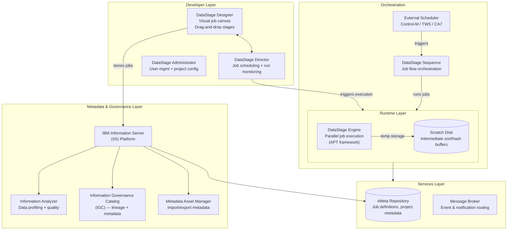

# IBM DataStage — SA Migration Guide

**Purpose:** Give a Solution Architect enough depth to assess an IBM DataStage estate, understand its moving parts, and map a migration path to Databricks.

This is not a developer guide. You won't be building DataStage jobs. You will be walking customer sites, reviewing architecture diagrams, asking the right questions, and scoping what it takes to move to a modern lakehouse platform.

---

## Architecture Diagrams

### DataStage Platform Architecture

How the IBM DataStage product suite fits together — from developer tooling through runtime execution to operations.

<div class="zd-wrapper" id="ds-arch-zoom" style="position:relative; border:1px solid #ddd; border-radius:6px; overflow:hidden; background:#fafafa;">
<div style="position:absolute; top:8px; right:10px; z-index:10; display:flex; align-items:center; gap:8px; font-size:0.78rem; color:#666;">
  <span>Scroll to zoom · Drag to pan</span>
  <button onclick="zdReset('ds-arch-zoom')" style="padding:2px 8px; font-size:0.75rem; border:1px solid #ccc; border-radius:4px; background:#fff; cursor:pointer;">Reset</button>
</div>
<div class="zd-canvas" style="cursor:grab; user-select:none;">



</div>
</div>

---

### DataStage as ETL — Data Flow Between Systems

How DataStage sits between source systems and targets in a typical enterprise data pipeline.

<div class="zd-wrapper" id="ds-flow-zoom" style="position:relative; border:1px solid #ddd; border-radius:6px; overflow:hidden; background:#fafafa;">
<div style="position:absolute; top:8px; right:10px; z-index:10; display:flex; align-items:center; gap:8px; font-size:0.78rem; color:#666;">
  <span>Scroll to zoom · Drag to pan</span>
  <button onclick="zdReset('ds-flow-zoom')" style="padding:2px 8px; font-size:0.75rem; border:1px solid #ccc; border-radius:4px; background:#fff; cursor:pointer;">Reset</button>
</div>
<div class="zd-canvas" style="cursor:grab; user-select:none;">



</div>
</div>

<script>

```mermaid
flowchart LR
    subgraph SOURCES["Source Systems"]
        DB[("Relational DB\nOracle / DB2 / SQL Server / Teradata")]
        MF["Mainframe\nCOBOL copybooks / VSAM / sequential"]
        FILES["Flat Files\nFixed-width / Delimited / XML"]
        MQ["IBM MQ / Kafka\nMessage streams"]
    end

    subgraph DS["DataStage ETL Layer"]
        direction TB
        READ["Input Stages\n(DB Connector, Sequential File,\nComplex Flat File, MQ)"]
        XFORM["Transformer / Processing Stages\nTransformer · Join · Sort · Aggregator\nLookup · Filter · Funnel · Modify"]
        SCRATCH_INT[("Scratch / Intermediate\nSort buffers, hash file partitions\nbetween pipeline stages")]
        WRITE["Output Stages\n(DB Connector, Sequential File,\nDataSet, File Set)"]

        READ --> XFORM
        XFORM -- intermediate buffers --> SCRATCH_INT
        SCRATCH_INT --> XFORM
        XFORM --> WRITE
    end

    subgraph TARGETS["Target Systems"]
        DW[("Data Warehouse\nTeradata / Netezza / DB2 / Redshift")]
        DATALAKE["Data Lake\nHDFS / S3 / ADLS"]
        RPTDB[("Reporting DB\nSQL Server / Oracle")]
        DOWNSTREAM["Downstream Apps\nvia file or DB feed"]
    end

    subgraph ORCH["Orchestration"]
        SEQ["DataStage Sequence\nChains parallel jobs\nacross the pipeline"]
    end

    SOURCES --> READ
    WRITE --> TARGETS
    SEQ -. schedules .-> DS
```

(function(){
  window.zdReset=window.zdReset||function(id){
    var w=document.getElementById(id);if(!w)return;
    var c=w.querySelector('.zd-canvas');if(!c)return;
    c._s=1;c._tx=0;c._ty=0;
    var sv=c.querySelector('svg');
    if(sv){sv.style.transform='translate(0,0) scale(1)';sv.style.transformOrigin='0 0';}
  };
  function initC(c){
    if(c._zdInit)return;c._zdInit=true;
    c._s=1;c._tx=0;c._ty=0;
    var sv=c.querySelector('svg');
    // Remove responsive max-width so transform scaling works freely
    sv.style.maxWidth='none';sv.style.display='block';sv.style.transformOrigin='0 0';
    // Lock canvas height to natural SVG height so the hit-target doesn't collapse
    var h=sv.getBoundingClientRect().height;
    if(h>0)c.style.height=h+'px';
    var dr=false,sx,sy,stx,sty;
    function ap(){sv.style.transform='translate('+c._tx+'px,'+c._ty+'px) scale('+c._s+')';}
    c.addEventListener('wheel',function(e){
      e.preventDefault();
      var r=c.getBoundingClientRect(),mx=e.clientX-r.left,my=e.clientY-r.top;
      var d=e.deltaY<0?1.12:1/1.12,ns=Math.min(5,Math.max(0.25,c._s*d));
      c._tx=mx-(mx-c._tx)*(ns/c._s);c._ty=my-(my-c._ty)*(ns/c._s);c._s=ns;ap();
    },{passive:false});
    c.addEventListener('mousedown',function(e){if(e.button)return;dr=true;sx=e.clientX;sy=e.clientY;stx=c._tx;sty=c._ty;c.style.cursor='grabbing';e.preventDefault();});
    window.addEventListener('mousemove',function(e){if(!dr)return;c._tx=stx+(e.clientX-sx);c._ty=sty+(e.clientY-sy);ap();});
    window.addEventListener('mouseup',function(){if(dr){dr=false;c.style.cursor='grab';}});
    c.addEventListener('touchstart',function(e){if(e.touches.length===1){dr=true;sx=e.touches[0].clientX;sy=e.touches[0].clientY;stx=c._tx;sty=c._ty;}},{passive:true});
    c.addEventListener('touchmove',function(e){if(dr&&e.touches.length===1){c._tx=stx+(e.touches[0].clientX-sx);c._ty=sty+(e.touches[0].clientY-sy);ap();}},{passive:true});
    c.addEventListener('touchend',function(){dr=false;});
  }
  function tryW(w){var c=w.querySelector('.zd-canvas');if(!c)return;var sv=c.querySelector('svg');if(!sv){setTimeout(function(){tryW(w);},200);return;}initC(c);}
  function initAll(){document.querySelectorAll('.zd-wrapper').forEach(function(w){tryW(w);});}
  if(document.readyState==='loading'){document.addEventListener('DOMContentLoaded',function(){setTimeout(initAll,600);});}else{setTimeout(initAll,600);}
})();
</script>

---

## Sections

1. [Ecosystem Overview](#1-ecosystem-overview)
2. [Jobs and Stages — The Core Building Block](#2-jobs-and-stages--the-core-building-block)
3. [Data Formats and Schema](#3-data-formats-and-schema)
4. [Parallelism and the APT Framework](#4-parallelism-and-the-apt-framework)
5. [Project Structure and Version Control](#5-project-structure-and-version-control)
6. [Orchestration: Sequences and External Schedulers](#6-orchestration-sequences-and-external-schedulers)
7. [Metadata, Lineage, and Impact Analysis](#7-metadata-lineage-and-impact-analysis)
8. [Data Quality with Information Analyzer](#8-data-quality-with-information-analyzer)
9. [DataStage File Formats Reference](#9-datastage-file-formats-reference)
10. [Migration Assessment and Artifact Inventory](#10-migration-assessment-and-artifact-inventory)
11. [Migration Mapping to Databricks](#11-migration-mapping-to-databricks)

---

## 1. Ecosystem Overview

### What Is IBM DataStage?

IBM DataStage is an enterprise ETL and data integration platform that has been a fixture in large-scale data warehousing environments since the late 1990s. Originally built by Parallel Software (later Ascential, then IBM), it is known for its **high-performance parallel processing engine** — the APT (Adaptive Parallel Transport) framework — and its deep integration with the broader IBM Information Server suite.

Customers in banking, insurance, telecommunications, healthcare, and government have typically used DataStage for:

- **Batch ETL into enterprise data warehouses** — primarily Teradata, DB2, Netezza, and Oracle
- **Mainframe data offload** — extracting COBOL-format or VSAM data for downstream analytics
- **High-volume financial processing** — nightly loads of hundreds of millions of records with strict SLA windows

Like Ab Initio, DataStage is:

- **Proprietary and license-gated** — full platform costs (IIS + Engine + Governance tooling) are substantial
- **On-premises first** — cloud deployment exists (as part of IBM Cloud Pak for Data or IBM DataStage as a Service) but most customer estates are on-prem
- **IBM ecosystem-dependent** — customers usually have other IBM products (MQ, DB2, InfoSphere) that DataStage integrates with, adding migration complexity
- **Talent-constrained** — DataStage-specific skills are narrowing as a developer pool, which is often the real driver behind migrations

### The IBM DataStage / Information Server Product Suite

DataStage sits inside the **IBM Information Server (IIS)** platform. Knowing which components a customer has deployed determines migration scope.

| Product | What It Does | Migration Relevance |
|---------|-------------|---------------------|
| **DataStage Engine** | Parallel job execution runtime (APT framework) | High — all transformation logic runs here |
| **DataStage Designer** | GUI for building parallel jobs and sequences | High — all job definitions are created here |
| **DataStage Director** | Job scheduling, monitoring, and run management | High — operational control plane |
| **DataStage Administrator** | Project and user management | Low — operational tooling, not logic |
| **xMeta Repository** | Stores all job definitions, project metadata | High — source of truth for estate inventory |
| **Information Analyzer (IA)** | Data profiling and quality analysis | Medium — quality rule artifacts to review |
| **Information Governance Catalog (IGC)** | Lineage, business glossary, data catalog | Medium — lineage data useful for impact analysis |
| **Metadata Asset Manager (IMAM)** | Import/export of metadata between systems | Low — tooling for metadata migration |
| **IBM MQ Connector** | IBM MQ messaging integration | Medium — if customer uses MQ feeds |

> **SA Tip:** Many customers have IIS licensed but only actively use DataStage Designer, the Engine, and Director. Information Analyzer is often deployed but underused — the quality rules it contains may be aspirational rather than enforced. Always ask which components are actively used in daily pipeline operations vs. which are licensed but neglected.

### Why Customers Want to Migrate

| Driver | What It Means for the Engagement |
|--------|----------------------------------|
| **Cost** | IIS platform licensing is expensive; customers want to eliminate it |
| **Talent scarcity** | DataStage developers are expensive and hard to find; Spark/Python is more accessible |
| **IBM ecosystem exit** | Customers moving off Netezza, DB2, or Teradata often want to exit the IBM stack entirely |
| **Cloud migration** | On-prem DataStage doesn't fit a cloud-first data strategy |
| **Speed of delivery** | GUI-based development is slow; customers want code-first, git-native pipelines |
| **Netezza decommission** | IBM Netezza end-of-life is a common forcing function — if the DW moves, the ETL must follow |

> **SA Tip:** The Netezza decommission angle is powerful. Many DataStage estates exist specifically to load Netezza. When Netezza goes, customers often ask "why keep DataStage at all?" Frame Databricks as the replacement for both — the compute *and* the ETL layer — rather than just the ETL migration.

### Key Discovery Questions

Before scoping a migration, ask:

1. How many **active production jobs** are running regularly? (vs. total jobs in the repository — there will be a significant percentage of stale/unused jobs)
2. What are the **primary target systems**? (Teradata, Netezza, DB2, Oracle, HDFS, S3)
3. How is **orchestration** handled — DataStage Sequences, an external scheduler (Control-M, TWS, CA7), or both?
4. Are there **mainframe or COBOL-format sources**? (Complex Flat File stage, VSAM readers)
5. Are there **custom stages** — compiled C++ or Java stages written by the customer?
6. How are jobs **promoted** across environments? (manual export/import, DataStage Manager, or a CI/CD tool?)
7. Is the **xMeta repository** current — or has it drifted from what's actually deployed in production?
8. What are the **SLAs** for critical batch windows, and which jobs are on the critical path?

---

## 2. Jobs and Stages — The Core Building Block

### The Parallel Job

In DataStage, the **parallel job** is the fundamental unit of work — equivalent to a pipeline or ETL graph in other tools. A parallel job is a directed dataflow: data enters from one or more input stages, passes through processing stages, and exits through output stages.

Developers build jobs visually in the **DataStage Designer** by dragging stages onto a canvas and connecting them with links. The canvas shows the data flow, and each stage has a properties panel where transformation logic, connection strings, and column mappings are configured.

A DataStage estate can easily contain **thousands of jobs** — including many that are dormant, duplicated across projects, or no longer run in production.

### The Three Job Types

| Job Type | What It Does | Migration Relevance |
|----------|-------------|---------------------|
| **Parallel Job** | Multi-stage ETL pipeline running in parallel across partitions — the primary job type | High — core migration target |
| **Server Job** | Legacy single-node job type from the pre-parallel era; still found in older estates | Medium — often simpler logic but may use deprecated server stages |
| **Sequence** | Orchestration job that chains other jobs in a dependency graph — not a data pipeline | High — maps to Databricks Workflow |

> **SA Tip:** When a customer says "we have 3,000 DataStage jobs," ask how many are Parallel Jobs vs. Sequences. Sequences are orchestration metadata — not ETL logic. The actual transformation work is in the Parallel Jobs. Counting Sequences as migration units is a common scoping mistake.

### Stages

A **stage** is a single processing step inside a parallel job. DataStage ships with a large library of stages organized by category. Stages are the DataStage equivalent of Spark transformations.

**Core stage categories:**

| Category | Examples | What They Do |
|----------|----------|--------------|
| **Database connectors** | `DB2 Connector`, `Oracle Connector`, `Teradata Connector`, `JDBC Connector` | Read from / write to relational databases |
| **File stages** | `Sequential File`, `Dataset`, `File Set`, `Complex Flat File` | Read/write flat files, fixed-width, mainframe-format data |
| **Processing stages** | `Transformer`, `Aggregator`, `Sort`, `Join`, `Lookup`, `Filter`, `Funnel`, `Modify` | Core transformation logic |
| **Partitioning / merge** | `Repartition` (via link properties), `Merge`, `Compress/Expand` | Control parallel distribution of data |
| **Message queues** | `MQ Connector`, `Kafka Connector` | Read from / write to messaging systems |
| **Custom stages** | `Plug-in Stage` (customer-written C++ or Java) | Proprietary business logic not available in built-in stages |

### The Transformer Stage

The **Transformer stage** is DataStage's workhorse — the equivalent of Ab Initio's Reformat combined with Filter and Route. It is where most field-level business logic lives: expressions for type conversion, string manipulation, conditional derivation, and column mapping.

Transformer expressions use **DataStage's built-in expression language** — a proprietary syntax with functions for string operations, date arithmetic, conditional logic, and null handling. These expressions do not directly translate to PySpark or SQL without rewriting.

> **SA Tip:** The density of Transformer logic is the single biggest driver of migration effort in a DataStage estate. A job with a Transformer containing 50 derived columns and nested `If-Then-Else` trees takes far longer to migrate than a job with simple pass-through column mappings. During assessment, count derived columns and conditional branches per Transformer — not just job count.

### Links and Partitioning

**Links** are the connections between stages that carry data. Each link carries a **schema** (column names and types) and a **partitioning specification** that controls how data is distributed across parallel partitions before entering the next stage.

- **Sequential links** — data passes through as-is, no re-partitioning
- **Hash partition** — rows with matching key values go to the same partition (required before Sort, Join, Aggregator on a key)
- **Round-robin partition** — rows are distributed evenly across partitions
- **Entire partition** — all data is sent to every partition (equivalent of a broadcast)

> **Migration relevance:** Link partitioning is the DataStage equivalent of a Spark shuffle. Jobs with many hash-partitioned links before Sort and Join stages are doing explicit parallel key-based joins — these translate directly to Spark's shuffle join semantics but may require cluster sizing review if the customer was running tight partition counts.

---

## 3. Data Formats and Schema

### Column Metadata and the Schema

DataStage uses **column-level metadata** defined on each link to describe the data flowing through a job. Each link has an associated schema: a list of column names, SQL types, lengths, precision/scale, and nullability.

Column metadata can be:
- **Defined inline** on each link in the job
- **Imported from a table definition** stored in the xMeta repository
- **Derived automatically** from the connected stage (e.g., from a database connector that introspects the target table)

There is no single external schema file format equivalent to Ab Initio's DML — schema is embedded in the job definition and in the xMeta **table definitions** (`.tbd` files exported from the repository).

### Table Definitions

**Table definitions** are reusable schema objects stored in the xMeta repository. They define column structures that can be referenced by multiple stages across multiple jobs — the DataStage equivalent of a shared DML schema.

When inventorying a DataStage estate, table definitions tell you:
- What canonical schemas the customer has defined
- Which jobs share a common schema contract
- Where schema drift has occurred (jobs that deviate from the table definition)

### Proprietary Data Formats

| Format | What It Is | Migration Note |
|--------|-----------|---------------|
| **DataStage Dataset** | Proprietary binary format for intermediate parallel storage — partitioned files written and read only by DataStage | Must be converted; not readable outside DataStage — replace with Delta tables |
| **DataStage File Set** | Similar to Dataset but with looser partitioning — used for output file delivery | Must be converted to standard formats (CSV, Parquet) |
| **Sequential File** | Standard delimited or fixed-width flat file | Directly readable in Databricks |
| **Complex Flat File** | Fixed-width files with COBOL-style record layouts (redefines, packed decimal, EBCDIC encoding) | Requires explicit schema definition and encoding conversion — high complexity |
| **VSAM / mainframe sequential** | Mainframe-origin binary formats | Requires mainframe offload step before Spark can read |

> **SA Tip:** The **Complex Flat File** stage is a red flag for migration effort. It handles COBOL `REDEFINES` clauses (polymorphic records that change structure based on a type field), packed decimal (`COMP-3`) numeric encoding, and EBCDIC character sets. If the customer has mainframe feeds processed through Complex Flat File stages, the schema parsing logic must be re-implemented — there is no out-of-the-box Spark equivalent.

---

## 4. Parallelism and the APT Framework

### What APT Is

DataStage's parallel engine is built on **APT (Adaptive Parallel Transport)** — a framework that partitions data across multiple processes (operators) running simultaneously on one or more nodes. Each stage in a parallel job runs as a set of APT operators, one per partition, processing data in parallel.

This is conceptually similar to Spark's executor model — each partition is processed independently, and inter-stage data movement (shuffles) happens when partitioning specifications change between linked stages.

### Configuration Files

DataStage's APT behavior is controlled by **configuration files** — environment-specific files that define the node pool (servers and CPUs) available to the engine, and how partitions are distributed across them.

```
# Simplified APT config concept
node "server01" {
  fastname "server01-ib"    // high-speed network interface
  pools ""                  // default pool
}
node "server02" {
  fastname "server02-ib"
  pools ""
}
# Default partition count derived from available CPU cores across nodes
```

| APT Config Concept | What It Controls | Databricks Equivalent |
|-------------------|-----------------|----------------------|
| **Node pool** | Which servers participate in parallel execution | Databricks cluster nodes (auto-managed) |
| **Partition count** | Number of parallel data partitions | Spark partition count (auto or `repartition()`) |
| **Scratch disk path** | Where sort/hash intermediate buffers are written | Databricks ephemeral worker storage / spill to cloud storage |
| **Resource tier** | CPU allocation per node | Instance type and core count |

> **Migration relevance:** APT configuration files are environment-specific infrastructure metadata — they don't migrate. The partition count they imply (e.g., 16 nodes × 4 cores = 64 partitions) helps right-size the Databricks cluster. Beyond that, Spark manages parallelism automatically and APT configs become irrelevant.

### Partition Strategies on Links

Partitioning is specified per link (connection between stages), not globally:

| DataStage Partition Type | What It Does | Databricks Equivalent |
|--------------------------|-------------|----------------------|
| **Hash** | Routes rows with the same key to the same partition | `repartition(col)` |
| **Round Robin** | Distributes rows evenly | `repartition(n)` |
| **Range** | Distributes by value range (used before Range sort) | Range partitioning |
| **Entire** | Broadcasts all data to every partition | `broadcast()` hint |
| **Same** | Keeps data in its current partition (no shuffle) | No-op / `coalesce()` |
| **Random** | Random distribution | `repartition(n)` |

---

## 5. Project Structure and Version Control

### Projects

DataStage organizes work into **projects** — top-level containers stored in the xMeta repository. Each project contains jobs, table definitions, parameter sets, shared containers, and operational metadata.

```
xMeta Repository
 └── Project: Finance_ETL
       ├── Jobs (Parallel Jobs, Server Jobs, Sequences)
       ├── Table Definitions
       ├── Parameter Sets
       ├── Shared Containers
       └── Operational Metadata (run logs, schedules)
```

Unlike Ab Initio's sandbox model, DataStage does not have native branch-per-developer working copies. Projects are shared, which creates collaboration challenges in large teams — developers often work in separate projects that represent dev/QA/prod environments.

### Version Control — The Gap

DataStage has no native Git integration. Version control is typically handled one of three ways:

| Approach | What It Looks Like | Risk |
|----------|-------------------|------|
| **No version control** | Jobs edited directly in the shared project | Very common — no history, no rollback |
| **Export/import** | `.dsx` export files checked into a shared folder or basic VCS | Fragile — merge conflicts are manual |
| **Third-party tooling** | IBM DataStage Asset Manager, Octopai, or Manta for change tracking | Better but uncommon |

> **SA Tip:** Most DataStage estates have weak version control. Before the migration starts, export all jobs as `.dsx` files and store them in Git — this becomes both the migration baseline and the first git commit history the customer has ever had for this estate. This is a quick win that customers appreciate.

### Promotion Workflow

Code promotion across environments (dev → QA → prod) is handled by **exporting** job definitions from one project and **importing** them into another. This is a manual, GUI-driven process prone to human error.

| DataStage Concept | Databricks Equivalent |
|-------------------|-----------------------|
| **Project** | Git repository + Databricks workspace folder |
| **Job** | Databricks notebook or Python script in Git |
| **Export/import (.dsx)** | Git commit + pull request |
| **Dev/QA/Prod project copy** | Git branches + Databricks Asset Bundles per environment |

---

## 6. Orchestration: Sequences and External Schedulers

### DataStage Sequences

A **Sequence** is a special DataStage job type that orchestrates other jobs. It defines a dependency graph of job executions — which jobs run first, which run in parallel, and what happens on success or failure. The Sequence canvas looks similar to a parallel job canvas but contains **Activity** nodes instead of data-processing stages.

A Sequence is the DataStage equivalent of a Databricks Workflow or an Airflow DAG.

**Key Sequence concepts:**

| Concept | Description | Databricks Equivalent |
|---------|-------------|----------------------|
| **Sequence job** | The orchestration container | Databricks Workflow |
| **Job Activity** | A node that runs a specific DataStage job | Workflow Task (Notebook / Python / DLT) |
| **Routine Activity** | Runs a shell command or stored procedure | Workflow Task (Python script / `%sh` cell) |
| **Notification Activity** | Sends an email or alert | Workflow notification / webhook |
| **Terminator** | Ends the sequence on a condition | Workflow `on_failure` task |
| **Dependency link** | Requires a prior activity to succeed before this one starts | Task dependency in Workflow |
| **Loop Activity** | Repeats a job N times (e.g., process one file per iteration) | For-each loop in Workflow |
| **User-defined status** | Custom return code logic | Databricks task result condition |
| **Job parameter** | Runtime value passed to a job activity | Databricks Workflow Job parameter |

### Sequence Structure Example

```
Sequence: NIGHTLY_ACCOUNT_PIPELINE
  Activity 1: Extract_Accounts          (no dependency — runs first)
  Activity 2: Validate_Accounts         (depends on Activity 1 success)
  Activity 3: Transform_Accounts        (depends on Activity 2 success)
  Activity 4: Load_DW_Accounts          (depends on Activity 3 success)
  Activity 5: Archive_Source_Files      (depends on Activity 4 success)
  Activity 6: Send_Failure_Alert        (runs if Activity 2, 3, or 4 fails)
```

This maps directly to a Databricks Workflow with task dependencies and `on_failure` routing.

### External Schedulers

The majority of enterprise DataStage environments use an **external enterprise scheduler** alongside or instead of Sequences:

| Scheduler | Common in |
|-----------|-----------|
| BMC Control-M | Financial services, insurance |
| IBM Workload Scheduler (TWS) | IBM-heavy shops |
| CA7 / Autosys | Legacy telco, utilities |
| Tivoli Workload Scheduler | Older IBM estates |

In a typical setup:
- The **external scheduler** handles timing, cross-system dependencies (e.g., "wait for the mainframe file to land on the SFTP server")
- **DataStage Sequences** handle intra-DataStage job chaining

> **Migration relevance:** If the customer uses Control-M or TWS to trigger DataStage Sequences, the migration has two layers — replacing DataStage Sequences with Databricks Workflows, AND deciding whether to keep the external scheduler calling the Databricks Jobs API or replace it entirely with Databricks native scheduling. This is frequently underestimated in scoping conversations.

---

## 7. Metadata, Lineage, and Impact Analysis

### The xMeta Repository

The **xMeta repository** is the database backend for IBM Information Server. It stores every job definition, stage configuration, link schema, table definition, project structure, and operational run record. xMeta is the authoritative source for estate inventory — if it's not in xMeta, it doesn't exist as far as DataStage is concerned.

> **SA Tip:** xMeta is a relational database (DB2 or SQL Server). Customers with access to a DBA can query it directly to pull artifact counts, job last-run dates, and dependency relationships — faster and more complete than navigating the Designer UI. Ask if the customer's team has done any xMeta queries before; if not, IBM provides metadata extract utilities.

### Information Governance Catalog (IGC)

For customers using **IGC** (part of the broader IIS suite), lineage is tracked at the job and field level:

| IGC Capability | What It Provides | Migration Use |
|---------------|-----------------|---------------|
| **Job lineage** | Which jobs read from and write to which assets | Dependency mapping for migration waves |
| **Column lineage** | Which source column flows through which stages to produce which target column | Schema mapping documentation |
| **Business glossary** | Business terms linked to technical assets | Context for migrated table/column naming |
| **Impact analysis** | What downstream assets are affected by changing a source | Risk assessment for migration changes |

### When IGC Is Not Present (Common)

Many DataStage customers have DataStage + Director but not IGC, or have IGC deployed but not populated. In this case:

- Lineage must be derived by **parsing `.dsx` job export files** — extracting the stage-level connections manually or with a metadata parsing tool
- Tools like **Manta**, **Octopai**, or **WhereScape** can parse DataStage `.dsx` exports and generate lineage graphs without IGC

> **SA Tip:** Don't assume IGC lineage is complete or current even when it's deployed. IGC lineage is only as good as the last metadata harvest — if jobs were modified without a re-harvest, IGC shows stale data. Always cross-reference with actual `.dsx` file inspection and developer interviews.

### Impact Analysis Without IGC

The practical approach for most estates:

1. **Export all jobs as `.dsx` files** from xMeta
2. **Parse the `.dsx` XML** to extract stage-level connections, input/output datasets, and table names
3. **Build a dependency matrix**: which jobs write to datasets that other jobs read
4. **Identify shared table definitions**: which schemas are referenced by multiple jobs

This gives you the dependency ordering needed for migration wave planning.

---

## 8. Data Quality with Information Analyzer

### What Information Analyzer Does

**Information Analyzer (IA)** is IBM's data profiling and quality tool, included in the IIS suite. It runs against source or intermediate datasets and produces:

- Column-level statistics (null rates, distinct values, min/max, value distributions)
- Format and pattern analysis (e.g., what fraction of a phone number field matches `\d{10}`)
- Cross-column dependency analysis (functional dependency detection)
- Rule-based quality scoring

In a migration context, IA outputs help establish:
- A data quality baseline before migration (so you can validate the migrated pipeline produces equivalent results)
- Evidence of existing quality issues that the customer may want to address during the migration

### Data Quality in Jobs

Data quality checks in DataStage are typically embedded inside parallel jobs using specific stages:

| Stage / Technique | What It Does | Databricks Equivalent |
|------------------|-------------|----------------------|
| **Transformer (with conditional logic)** | Routes invalid records to a reject link based on expression conditions | Delta Live Tables `expect_or_drop()` / PySpark filter |
| **Filter stage** | Hard filters rows that don't meet criteria | `df.filter()` |
| **Reject link** | Output link from a stage that carries failed/invalid records | DLT quarantine table / dead-letter Delta table |
| **IA Rule Stage** (optional plug-in) | Applies IA-defined quality rules inline in a job | DLT `expect()` constraints |
| **Aggregator (with COUNT checks)** | Verifies record counts at pipeline checkpoints | PySpark count assertions / DLT metrics |

> **Migration relevance:** Reject link handling is where business-critical exception logic hides. Always document what happens to records on reject links — they often feed downstream exception pipelines, notification jobs, or audit tables that get overlooked in migrations.

### Quality Baselines for Migration Validation

If the customer has run Information Analyzer against their source or target datasets, those profiling results are valuable as **post-migration reconciliation criteria**. Request:
- Row counts per dataset per day
- Null rates for key fields
- Distribution histograms for critical business columns

These become the acceptance criteria for validating the migrated Databricks pipelines produce equivalent output.

---

## 9. DataStage File Formats Reference

When inventorying a DataStage estate, you will encounter a specific set of file and artifact types. Understanding each one is essential for scoping migration effort.

---

### `.dsx` — DataStage Export (Job Definition)

The `.dsx` file is the **primary artifact** for migration — it is the exported definition of a DataStage job (Parallel Job, Server Job, or Sequence), table definition, or project component. DataStage Designer exports to `.dsx` format, and imports use the same format. It is a hierarchical text file with pseudo-XML structure.

| Property | Detail |
|----------|--------|
| **Created by** | DataStage Designer — File > Export > DataStage Components |
| **Stored in** | xMeta repository (internally); exported to file system for backup or promotion |
| **Contains** | Stage definitions, link schemas (column names/types), stage properties (expressions, SQL, connection references), Sequence flow definitions |
| **Human-readable?** | Partially — text-based but verbose pseudo-XML; not intended for hand-editing |
| **Migration target** | Each `.dsx` job is a migration unit — maps to a Databricks notebook, Python script, or DLT pipeline |

**Example `.dsx` snippet (stage definition):**
```
BEGIN DSRECORD
  Identifier "stage_transformer_1"
  OLEType "CTransformerStage"
  Name "Transformer_1"
  NextStageID "2"
  ...
  BEGIN DERIVATIONS
    Name "output_col"
    Derivation "If IsNull(input_col) Then \"UNKNOWN\" Else Trim(input_col)"
  END
END
```

> **SA Tip:** The count of `.dsx` Parallel Job definitions in active production is your primary migration scope number. Filter by last-run date from xMeta — estates commonly have 40–50% inactive or test jobs that should be excluded from the migration scope.

---

### `.apt` — APT Configuration File

The `.apt` (or `.conf`) file is the **engine configuration** that defines the node pool, parallelism degree, and scratch disk locations for the DataStage parallel execution environment. It is environment-specific — dev, QA, and prod each have their own APT config.

| Property | Detail |
|----------|--------|
| **Created by** | System administrators / DataStage infrastructure team |
| **Stored in** | DataStage Engine server file system; referenced by job execution |
| **Contains** | Node definitions (hostnames, CPU counts, pool assignments), scratch disk paths, network interface bindings |
| **Human-readable?** | Yes — text-based configuration syntax |
| **Migration target** | Does not migrate — eliminated entirely. The partition count informs Databricks cluster sizing only. |

---

### `.ds` / `.dsjob` — DataStage Parameter File / Job Parameter Set

Parameter files define **runtime configuration values** passed to jobs at execution time — date ranges, file paths, database connection names, environment flags, and record limits. DataStage supports both inline job parameters and **parameter sets** (reusable named collections).

| Property | Detail |
|----------|--------|
| **Created by** | Developers / pipeline engineers |
| **Stored in** | xMeta repository (parameter sets); also embedded in job definitions |
| **Contains** | Key-value pairs: `START_DATE`, `END_DATE`, `SOURCE_PATH`, `TARGET_TABLE`, `ENV_FLAG`, etc. |
| **Human-readable?** | Yes — key=value pairs |
| **Migration target** | Maps to Databricks Job parameters, Widgets, environment YAML configs, or Databricks Secrets for credentials |

**Example parameter set content:**
```
START_DATE=2024-01-01
END_DATE=2024-01-31
SOURCE_DIR=/data/input/accounts
TARGET_SCHEMA=finance_dw
MAX_ROWS=0
ENV=PROD
```

> **SA Tip:** Parameter sets that contain database connection strings are a security and migration concern — these often contain plaintext credentials. During inventory, flag all parameter sets with connection-related keys and map them to Databricks Secrets in the target architecture.

---

### DataStage Dataset Files (Proprietary Parallel Format)

A **DataStage Dataset** is a proprietary partitioned binary format used as intermediate storage between pipeline stages or for persistence between job runs. It is the DataStage equivalent of Ab Initio's MFS — partitioned files that only DataStage can read and write.

| Property | Detail |
|----------|--------|
| **Created by** | DataStage Engine — written by a Dataset output stage |
| **Stored in** | File system on the DataStage engine servers (multiple partition files per dataset) |
| **Contains** | Partitioned binary records in APT internal format, with a descriptor file (`.ds`) pointing to partition files |
| **Human-readable?** | No — proprietary binary format |
| **Migration target** | Replace with Delta tables; the data must be extracted by running the source pipeline end-to-end before the DataStage environment is decommissioned |

> **SA Tip:** DataStage Datasets used as **persistent intermediate stores** (written by one job, read by a later job in the same nightly batch) are an often-missed migration dependency. Map every Dataset that persists beyond the job that creates it — these require a Delta table in the migrated architecture and a migration plan for the initial data load.

---

### `.tbd` — Table Definition

A **table definition** is a reusable schema object stored in the xMeta repository. It defines column names, SQL data types, lengths, precision, scale, and nullability — and can be imported into multiple jobs as the schema for a stage's input or output link.

| Property | Detail |
|----------|--------|
| **Created by** | Developers — imported from databases or defined manually |
| **Stored in** | xMeta repository; exported in `.dsx` format within a project export |
| **Contains** | Column-level schema: name, SQL type, length, precision/scale, nullability, description |
| **Human-readable?** | Yes (when exported in `.dsx` text format) |
| **Migration target** | Maps to a Delta table schema definition or PySpark `StructType`; register in Unity Catalog |

---

### Shared Containers

A **Shared Container** is a reusable sub-pipeline packaged as a named component that can be embedded in multiple jobs. It is the DataStage equivalent of Ab Initio's wrapped sub-graph — a group of stages with defined input and output interfaces that encapsulates reusable logic.

| Property | Detail |
|----------|--------|
| **Created by** | Developers — extracted from job logic when reuse is needed |
| **Stored in** | xMeta repository as a named component |
| **Contains** | A set of stages with defined input/output link schemas and stage logic |
| **Human-readable?** | Only via the Designer canvas; exported in `.dsx` format |
| **Migration target** | Maps to a reusable PySpark function/module, a DLT named dataset, or a Databricks notebook template |

> **SA Tip:** Run a usage analysis on Shared Containers before migration — a container used by 30+ jobs is a shared dependency that must be migrated before any of its consumers. Count container usage from xMeta metadata; it directly affects migration wave sequencing.

---

### Shell / Batch Scripts

Shell scripts (`.sh`, `.ksh`, `.bat`, `.cmd`) are **external programs invoked by DataStage jobs or Sequences** via Routine Activities or shell command stages. They handle tasks outside DataStage's native capability: file movement, SFTP transfers, archive operations, pre/post-processing, and database stored procedure calls.

| Property | Detail |
|----------|--------|
| **Created by** | Developers / operations engineers |
| **Stored in** | File system on the DataStage server; referenced by path in job or Sequence configuration |
| **Contains** | Shell commands — file operations, network calls, database calls, environment setup, logging |
| **Human-readable?** | Yes — standard shell or batch script |
| **Migration target** | Maps to Databricks notebook `%sh` cells, Python `subprocess` calls, or dedicated Workflow tasks |

> **SA Tip:** Shell scripts are the most common source of **lineage gaps** in DataStage estates. If a script moves a file, renames it, or writes to a database table, neither xMeta nor IGC has visibility into it. Always review scripts manually — they frequently contain date-based file naming conventions, record count checks, and environment-specific logic that must be preserved in the migration.

---

### Quick Reference — File / Artifact Type Summary

| Artifact | What It Is | Migration Action |
|----------|-----------|-----------------|
| `.dsx` job export | Parallel Job / Sequence definition | Translate to PySpark notebook / DLT pipeline / Databricks Workflow |
| `.dsx` table definition | Reusable column schema | Translate to Delta table schema / StructType; register in Unity Catalog |
| `.apt` config | APT node pool / parallelism config | Discard — inform Databricks cluster sizing only |
| Parameter set | Runtime key-value configuration | Replace with Databricks Job parameters / Secrets |
| DataStage Dataset | Proprietary partitioned intermediate storage | Replace with Delta table; extract data before DataStage decommission |
| Shared Container | Reusable sub-pipeline component | Rewrite as PySpark module or DLT named dataset |
| Shell script | External program invoked by jobs / Sequences | Port to `%sh` cells, Python tasks, or Workflow Routine activities |

---

## 10. Migration Assessment and Artifact Inventory

### The Goal of the Assessment

Before a single line of Databricks code is written, you need a **migration inventory** — a structured catalog of everything in the DataStage estate, scored by complexity and priority.

A good inventory answers:
- How many artifacts need to be migrated?
- Which ones are complex and which are straightforward?
- What are the dependencies and in what order must they be migrated?
- What are the risks specific to this DataStage estate?

### Step 1: Extract the Artifact List from xMeta

Start with the xMeta repository. If direct DB access is available, query it for a full export. Alternatively, use DataStage Administrator to export project-level summaries.

```
For each DataStage Project:
  - List all Parallel Jobs with last-run date and owner
  - List all Server Jobs (legacy) with last-run date
  - List all Sequences with job dependency counts
  - List all Shared Containers with usage counts
  - List all Table Definitions
  - List all Parameter Sets
  - List all external scripts referenced by jobs or Sequences
```

**Filter immediately:** Jobs that have not run in 12+ months are likely dead code. Focus the migration on what is actively in production.

### Step 2: Score Job Complexity

For each Parallel Job, score its migration complexity:

| Factor | Low (1) | Medium (2) | High (3) |
|--------|---------|-----------|---------|
| Stage count | < 8 | 8–20 | > 20 |
| Transformer derived columns | < 5 | 5–20 | > 20 |
| Nested conditional logic | None | Simple if-then | Nested/chained expressions |
| External system calls | None | 1 DB connector | Multiple systems + MQ/mainframe |
| Shared Container dependencies | None | 1–2 | > 2 |
| Data format complexity | Delimited / DB table | Fixed-width | Complex Flat File / COBOL / VSAM |
| Custom stages | None | 1 standard plug-in | Customer-written C++/Java stages |

Sum the scores: Low (7–9) = lift-and-shift candidate. High (16–21) = re-engineering required.

### Step 3: Map Dependencies

Build a dependency graph:
- Which jobs read datasets written by other jobs?
- Which jobs use the same Shared Containers?
- Which Sequences orchestrate which jobs?
- Which jobs share Table Definitions?

This reveals **migration waves** — groups of jobs that must be migrated together because they share intermediate datasets or Shared Container logic.

### Step 4: Identify Risk Areas Specific to DataStage

| Risk | Indicator | Mitigation |
|------|-----------|-----------|
| Complex Flat File / COBOL sources | Jobs with Complex Flat File input stages | Requires COBOL copybook schema recreation and EBCDIC/packed decimal conversion — significant effort |
| Customer-written custom stages | Plug-in Stage components in jobs | Source code (C++/Java) must be located, understood, and rewritten as PySpark UDFs |
| Persistent DataStage Datasets | Dataset stages used as inter-job intermediate stores | Requires Delta table creation and initial data extraction before DataStage shutdown |
| Server Jobs (legacy) | Jobs using legacy Server stage types | Assess if logic can be rewritten or if a Server-to-Parallel migration is needed first |
| No version control baseline | No `.dsx` exports in any VCS | Export all jobs immediately as migration baseline before any changes are made |
| External scheduler integration | Control-M / TWS triggers Sequences | Scope scheduler migration separately — often a parallel workstream |
| Parameter set credentials | Connection strings in parameter sets | Audit and migrate to Databricks Secrets before any code goes to production |
| Undocumented shell script logic | Routine Activities calling scripts | Manual review required — scripts often contain critical business logic invisible to xMeta |

### Step 5: Define Migration Waves

Organize jobs into waves based on dependency order and complexity:

- **Wave 1:** Simple standalone Parallel Jobs with no Shared Container dependencies, standard delimited inputs/outputs, and minimal Transformer logic — quick wins that establish patterns
- **Wave 2:** Mid-complexity jobs with Shared Containers and standard DB connectors; migrate the Shared Containers first as shared dependencies
- **Wave 3:** Complex orchestrated Sequences with multi-job dependencies and cross-system writes; migrate external scheduler integration in this wave
- **Wave 4 (if applicable):** COBOL/mainframe sources, custom plug-in stages, legacy Server Jobs, and any real-time MQ/Kafka feeds

---

## 11. Migration Mapping to Databricks

### The Core Principle

DataStage was built for batch ETL on fixed, on-premises server clusters. Databricks is built for distributed cloud-native analytics with elastic compute. The operational model is fundamentally different: customers are not just moving pipelines, they are moving to a code-first, git-native, cloud-elastic platform. Frame that shift explicitly in the engagement.

### Building Block Mapping

| DataStage Concept | Databricks Equivalent | Notes |
|-------------------|----------------------|-------|
| **Parallel Job** | Databricks notebook / Python script / DLT pipeline | One Parallel Job ≈ one Databricks task or DLT pipeline |
| **Stage** | PySpark transformation / SQL statement | Most built-in stages map to native Spark operations |
| **Sequence job** | Databricks Workflow | One Sequence ≈ one Databricks Workflow |
| **Shared Container** | Reusable PySpark module / DLT named dataset | Modularize with Python imports or DLT table references |
| **Table Definition** | Delta table schema / PySpark StructType | Define in Python or SQL; enforce via Delta constraints |
| **DataStage Dataset** | Delta table (partitioned) | Replace intermediate Datasets with Delta for ACID + time travel |
| **Sequential File** | ADLS/S3 file via `spark.read` | Direct replacement |
| **Complex Flat File (COBOL)** | Custom PySpark schema + binary reader | Requires explicit schema recreation — no direct equivalent |
| **Parameter Set** | Databricks Job parameter / Widget / Secrets | Replace with job-level parameters or config files |
| **APT config (.apt)** | Spark `repartition()` / cluster auto-scaling | Eliminate — Spark manages parallelism automatically |

### Stage-Level Mapping

| DataStage Stage | PySpark / SQL Equivalent |
|----------------|--------------------------|
| **Transformer** | `select()` with column expressions; UDFs for complex logic |
| **Filter** | `filter()` / `where()` |
| **Aggregator** | `groupBy().agg()` |
| **Sort** | `orderBy()` |
| **Join** | `join()` (inner/left/right/outer) |
| **Lookup** | Broadcast `join()` or cached lookup Delta table |
| **Funnel** | `union()` / `unionAll()` |
| **Modify** | `withColumn()` / `select()` |
| **Remove Duplicates** | `dropDuplicates()` |
| **Merge** | `merge()` on Delta table (upsert) |
| **DB Connector (read)** | `spark.read.jdbc(...)` or Databricks partner connector |
| **DB Connector (write)** | `df.write.jdbc(...)` or Delta merge |
| **Sequential File (read)** | `spark.read.csv/text/json(path)` |
| **Sequential File (write)** | `df.write.csv/text/json(path)` |
| **Dataset (read/write)** | Delta table read/write |
| **MQ Connector** | Databricks Structured Streaming + Kafka connector |
| **Reject link** | DLT `expect_or_drop()` quarantine table |

### Orchestration Mapping

| DataStage Concept | Databricks Equivalent |
|-------------------|-----------------------|
| **Sequence job** | Databricks Workflow |
| **Job Activity** | Workflow Task (Notebook / DLT / Python script) |
| **Routine Activity (shell)** | Workflow Task (Python task or `%sh` cell) |
| **Notification Activity** | Workflow notification (email/webhook) |
| **Step dependency** | Task dependency in Workflow |
| **Loop Activity** | Databricks `For each` task |
| **User-defined status / condition** | `if_else_condition` task |
| **Job parameter** | Workflow Job parameter |
| **Time-based trigger** | Workflow scheduled trigger (cron) |
| **File-arrival trigger** | File arrival trigger / Auto Loader |
| **Control-M / TWS trigger** | External scheduler calls Databricks Jobs API, or replace with Workflow native schedule |

### Metadata and Governance Mapping

| DataStage Concept | Databricks Equivalent |
|-------------------|-----------------------|
| **xMeta repository** | Unity Catalog + Git (for code versioning) |
| **DataStage Project** | Unity Catalog namespace + Git repository |
| **Table Definition** | Delta table schema in Unity Catalog |
| **Dev/QA/Prod projects** | Git branches + Databricks Asset Bundles per environment |
| **Export/import (.dsx)** | Git commit / pull request |
| **Information Governance Catalog (IGC)** | Unity Catalog lineage (auto-captured for DLT pipelines) |
| **Column lineage (IGC)** | Unity Catalog column lineage |
| **Impact analysis** | Unity Catalog lineage graph + downstream dependency view |

### Data Quality Mapping

| DataStage Concept | Databricks Equivalent |
|-------------------|-----------------------|
| **Transformer reject link** | DLT `expect_or_drop()` → quarantine Delta table |
| **Filter stage (quality gate)** | DLT `expect()` constraint |
| **IA rule stage** | DLT `expect()` / Great Expectations / Databricks DQE |
| **Record count assertion** | DLT pipeline metrics / Lakehouse Monitoring |
| **Information Analyzer profiling** | Databricks Lakehouse Monitoring / Data Quality dashboards |
| **Reject file output** | Dead-letter Delta table with error metadata columns |

### What Doesn't Map Cleanly

These DataStage capabilities require deliberate re-engineering — not just translation:

| Challenge | Why It's Hard | Approach |
|-----------|--------------|---------|
| **Complex Flat File / COBOL sources** | COBOL `REDEFINES`, packed decimal (`COMP-3`), EBCDIC encoding have no native Spark reader | Recreate COBOL copybook as PySpark `StructType`; handle EBCDIC with custom binary reader or use a third-party COBOL parsing library |
| **Customer-written custom plug-in stages** | Compiled C++ or Java — source may be lost; logic must be reverse-engineered | Locate source code, understand the algorithm, rewrite as PySpark UDF or Scala — highest effort item in any DataStage migration |
| **Persistent DataStage Datasets** | Proprietary format — can only be read by the DataStage engine | Must extract data by running the source jobs before DataStage is decommissioned; replace with Delta tables in the new architecture |
| **Server Jobs (legacy)** | Use deprecated stage types not available in parallel engine | Assess whether to rewrite directly to PySpark (preferred) or first convert to Parallel Jobs as an interim step |
| **Transformer expression language** | DataStage's built-in expression syntax has no direct Spark equivalent | Must rewrite expression-by-expression; automated tools exist (e.g., IBM DataStage migration accelerators) but require validation |
| **IBM MQ integration** | MQ is IBM-proprietary; Databricks has no native MQ connector | Replace MQ with Kafka (if feasible) or use a Kafka-MQ bridge; alternatively use Azure Service Bus or AWS SQS depending on cloud |
| **Fixed-degree parallelism assumptions** | Jobs may depend on a specific partition count producing deterministic output ordering | Let Spark auto-partition and validate output — do not try to replicate fixed partition counts |
