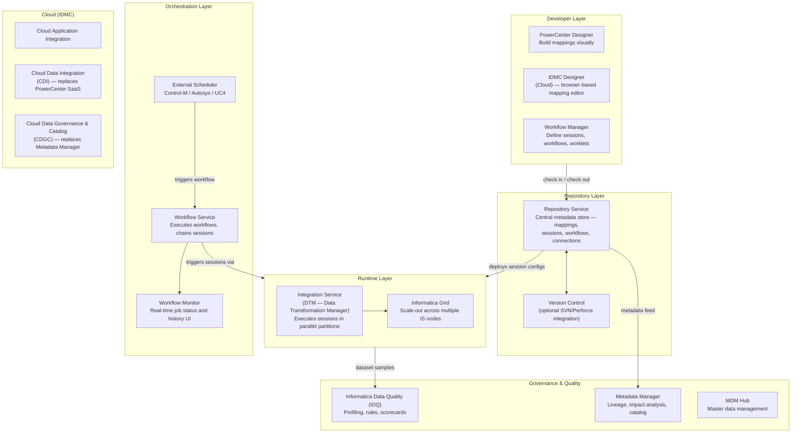
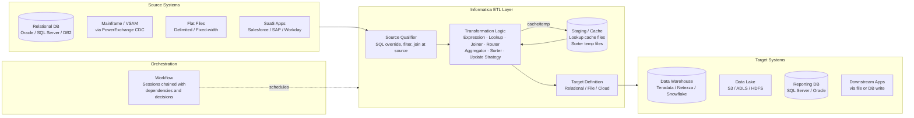

# Informatica — SA Migration Guide

**Purpose:** Give a Solution Architect enough depth to assess an Informatica estate, understand its moving parts, and map a migration path to Databricks.

This is not a developer guide. You won't be building Informatica mappings. You will be walking customer sites, reviewing architecture diagrams, asking the right questions, and scoping what it takes to move to a modern lakehouse platform.

---

## Architecture Diagrams

### Informatica Platform Architecture

How the Informatica product suite fits together — from developer tooling through runtime execution to governance.

<div class="zd-wrapper" id="infa-arch-zoom" style="position:relative; border:1px solid #ddd; border-radius:6px; overflow:hidden; background:#fafafa;">
<div style="position:absolute; top:8px; right:10px; z-index:10; display:flex; align-items:center; gap:8px; font-size:0.78rem; color:#666;">
  <span>Scroll to zoom · Drag to pan</span>
  <button onclick="zdReset('infa-arch-zoom')" style="padding:2px 8px; font-size:0.75rem; border:1px solid #ccc; border-radius:4px; background:#fff; cursor:pointer;">Reset</button>
</div>
<div class="zd-canvas" style="cursor:grab; user-select:none;">



</div>
</div>

---

### Informatica as ETL — Data Flow Between Systems

How Informatica sits between source systems and targets in a typical enterprise data pipeline.

<div class="zd-wrapper" id="infa-flow-zoom" style="position:relative; border:1px solid #ddd; border-radius:6px; overflow:hidden; background:#fafafa;">
<div style="position:absolute; top:8px; right:10px; z-index:10; display:flex; align-items:center; gap:8px; font-size:0.78rem; color:#666;">
  <span>Scroll to zoom · Drag to pan</span>
  <button onclick="zdReset('infa-flow-zoom')" style="padding:2px 8px; font-size:0.75rem; border:1px solid #ccc; border-radius:4px; background:#fff; cursor:pointer;">Reset</button>
</div>
<div class="zd-canvas" style="cursor:grab; user-select:none;">



</div>
</div>

<script>
(function(){
  window.zdReset=window.zdReset||function(id){var w=document.getElementById(id);if(!w)return;var c=w.querySelector('.zd-canvas');if(c){c._s=1;c._tx=0;c._ty=0;}var s=w.querySelector('svg');if(s){s.style.transform='translate(0,0) scale(1)';s.style.transformOrigin='0 0';}};
  function initC(c){if(c._zdInit)return;c._zdInit=true;c._s=1;c._tx=0;c._ty=0;var dr=false,sx,sy,stx,sty;function ap(sv){sv.style.transform='translate('+c._tx+'px,'+c._ty+'px) scale('+c._s+')';sv.style.transformOrigin='0 0';sv.style.display='block';}c.addEventListener('wheel',function(e){var sv=c.querySelector('svg');if(!sv)return;e.preventDefault();var r=c.getBoundingClientRect(),mx=e.clientX-r.left,my=e.clientY-r.top,d=e.deltaY<0?1.12:1/1.12,ns=Math.min(5,Math.max(0.4,c._s*d));c._tx=mx-(mx-c._tx)*(ns/c._s);c._ty=my-(my-c._ty)*(ns/c._s);c._s=ns;ap(sv);},{passive:false});c.addEventListener('mousedown',function(e){if(e.button)return;dr=true;sx=e.clientX;sy=e.clientY;stx=c._tx;sty=c._ty;c.style.cursor='grabbing';e.preventDefault();});window.addEventListener('mousemove',function(e){if(!dr)return;c._tx=stx+(e.clientX-sx);c._ty=sty+(e.clientY-sy);var sv=c.querySelector('svg');if(sv)ap(sv);});window.addEventListener('mouseup',function(){if(dr){dr=false;c.style.cursor='grab';}});c.addEventListener('touchstart',function(e){if(e.touches.length===1){dr=true;sx=e.touches[0].clientX;sy=e.touches[0].clientY;stx=c._tx;sty=c._ty;}},{passive:true});c.addEventListener('touchmove',function(e){if(dr&&e.touches.length===1){c._tx=stx+(e.touches[0].clientX-sx);c._ty=sty+(e.touches[0].clientY-sy);var sv=c.querySelector('svg');if(sv)ap(sv);}},{passive:true});c.addEventListener('touchend',function(){dr=false;});}
  function tryW(w){var c=w.querySelector('.zd-canvas');if(!c)return;var sv=c.querySelector('svg');if(!sv){setTimeout(function(){tryW(w);},200);return;}initC(c);}
  function initAll(){document.querySelectorAll('.zd-wrapper').forEach(function(w){tryW(w);});}
  if(document.readyState==='loading'){document.addEventListener('DOMContentLoaded',function(){setTimeout(initAll,600);});}else{setTimeout(initAll,600);}
})();
</script>

---

## Sections

1. [Ecosystem Overview](#1-ecosystem-overview)
2. [Mappings and Transformations — The Core Building Block](#2-mappings-and-transformations--the-core-building-block)
3. [Data Formats and Schema](#3-data-formats-and-schema)
4. [Parallelism and Session Partitioning](#4-parallelism-and-session-partitioning)
5. [Project Structure and Repository](#5-project-structure-and-repository)
6. [Orchestration: Workflows and Sessions](#6-orchestration-workflows-and-sessions)
7. [Metadata, Lineage, and Impact Analysis](#7-metadata-lineage-and-impact-analysis)
8. [Data Quality with IDQ](#8-data-quality-with-idq)
9. [Informatica File Formats Reference](#9-informatica-file-formats-reference)
10. [Migration Assessment and Artifact Inventory](#10-migration-assessment-and-artifact-inventory)
11. [Migration Mapping to Databricks](#11-migration-mapping-to-databricks)

---

## 1. Ecosystem Overview

### What Is Informatica?

Informatica is the market-leading enterprise data integration platform. It has been the de facto standard for large-enterprise ETL since the late 1990s and is embedded in financial services, healthcare, retail, and government organizations globally. Customers choose it because it covers an enormous range of data integration scenarios — batch ETL, CDC, data quality, MDM, and API integration — from a single vendor.

Unlike cloud-native tools, Informatica PowerCenter is:

- **On-premises first** — designed for dedicated server deployments, increasingly run on cloud VMs or hybrid
- **License-heavy and expensive** — PowerCenter licenses are sold by core, connector pack, and product module; large customers pay millions annually
- **Broad but complex** — the product suite is vast, which means configuration sprawl and steep learning curves for new developers
- **Transitioning to IDMC** — Informatica is actively pushing customers from PowerCenter (on-prem) to its cloud SaaS platform, IDMC (Intelligent Data Management Cloud)

### The Informatica Product Suite

Informatica is a suite of products. Knowing which ones a customer uses determines migration scope.

| Product | What It Does | Migration Relevance |
|---------|-------------|---------------------|
| **PowerCenter** | Core on-premises ETL engine — the primary migration target for most enterprises | High — all transformation logic, sessions, workflows live here |
| **IDMC / CDI** | Cloud SaaS replacement for PowerCenter — browser-based, serverless | Medium — customers partially migrated may have assets in both |
| **PowerExchange** | CDC and bulk-load connector for mainframe, SAP, databases | High — real-time/CDC pipelines require special migration handling |
| **Informatica Data Quality (IDQ)** | Profiling, cleansing rules, scorecards, address validation | Medium — quality rules embedded in pipelines must be migrated |
| **Metadata Manager** | Enterprise lineage, data catalog, impact analysis | High — primary tool for inventory and dependency mapping |
| **MDM Hub** | Master data management — golden record creation | Low-to-medium — usually out of scope for lakehouse migration |
| **Axon / CDGC** | Cloud data governance and catalog (successor to Metadata Manager) | Medium — lineage and catalog metadata relevant to migration planning |
| **Data Replication / CDC** | Real-time change data capture between systems | High if customer uses it — maps to Databricks DLT + CDC |

> **SA Tip:** Many customers use PowerCenter for batch ETL and PowerExchange for CDC, but treat them as separate teams. Ask explicitly whether there is a CDC workstream — it often has different owners and a longer migration timeline than batch pipelines.

### Why Customers Want to Migrate

| Driver | What It Means for the Engagement |
|--------|----------------------------------|
| **License cost** | PowerCenter license + maintenance + connector packs represent one of the largest data platform line items |
| **Vendor push to IDMC** | Informatica is end-of-lifing PowerCenter support — some customers are migrating to Databricks instead of IDMC |
| **Talent scarcity** | Informatica developers are increasingly rare; customers want Python/SQL-native platforms |
| **Cloud strategy** | Board mandate to exit on-prem data centers |
| **Performance limits** | PowerCenter scales vertically or via grid — customers hitting ceiling on large volumes |
| **Modern architecture** | Customers want streaming, Delta Lake, and unified batch/streaming — capabilities PowerCenter lacks natively |

> **SA Tip:** "Informatica is pushing us to IDMC and we don't want to pay for it twice" is one of the most common migration triggers in 2025–2026. Databricks becomes the alternative to IDMC — position it as the open, Python-native path rather than another proprietary SaaS lock-in.

### Key Discovery Questions

Before scoping a migration, ask:

1. How many mappings are in **active production** use? (vs. total mappings in the repository — there is always dead code)
2. Is this PowerCenter, IDMC, or both? Which version of PowerCenter?
3. What **connector packs** are in use? (Oracle, SAP, Salesforce, mainframe via PowerExchange?)
4. Is **PowerExchange / CDC** in scope? Which sources?
5. How is orchestration done — Informatica Workflows, external scheduler (Control-M, Autosys), or both?
6. Are there **reusable mapplets** or **shared Lookup caches** that many mappings depend on?
7. Is **IDQ** integrated into pipelines, or is data quality handled separately?
8. What does the repository look like — one central repository or multiple folder-per-team structures?
9. Are there **custom transformations** written in Java or C (Custom / External Procedure transformations)?
10. What are the **SLAs** for critical pipelines and what are the batch window constraints?

---

## 2. Mappings and Transformations — The Core Building Block

### The Mapping

In Informatica, the **mapping** is the fundamental unit of transformation logic — equivalent to a pipeline or ETL job. A mapping is a directed dataflow: data enters from one or more source definitions, passes through a series of transformation objects, and exits to one or more target definitions.

Developers build mappings visually in the **PowerCenter Designer** by dragging transformation objects onto a canvas and connecting them with links. Each link carries a row stream between transformations.

A single Informatica estate can have **thousands of mappings** — many of them legacy, redundant, or cloned from each other with minor differences.

### Transformations

A **transformation** is a single processing step within a mapping. Informatica ships with a large library of built-in transformations, and customers can write custom ones. Transformations are the Informatica equivalent of Spark DataFrame operations.

**Core transformation categories:**

| Category | Transformation | What It Does |
|----------|---------------|--------------|
| **Source** | Source Qualifier | Reads from source; SQL override for filtering/joining at DB level |
| **Expression** | Expression | Field-level calculations, conditionals, type conversions |
| **Filter** | Filter | Drops rows that don't meet a condition |
| **Routing** | Router | Splits rows into multiple output groups by condition |
| **Join** | Joiner | Joins two row streams (one must be a master, one detail) |
| **Lookup** | Lookup | Enriches rows by looking up values from a DB table or flat file |
| **Aggregate** | Aggregator | Group-by aggregations — sum, count, avg, max, min |
| **Sort** | Sorter | Orders rows; requires significant temp disk for large volumes |
| **Deduplicate** | n/a (done via Sorter + Expression logic) | No native dedup transform — customers implement manually |
| **Update logic** | Update Strategy | Marks rows as insert / update / delete / reject for target write |
| **Sequence** | Sequence Generator | Generates surrogate keys |
| **Stored Proc** | Stored Procedure | Calls a DB stored procedure inline |
| **Custom** | Custom / External Procedure | User-written C or Java logic — high migration risk |

### Mapplets — Reusable Sub-Mappings

A **mapplet** is a reusable transformation subgraph — a group of transformations packaged as a single reusable object. Mapplets are the Informatica equivalent of a shared library or helper function.

> **SA Tip:** Mapplets that are used across many mappings are high-priority migration dependencies — the Databricks equivalent (a shared PySpark function or Unity Catalog SQL function) must be built and validated before any downstream mappings can be migrated.

### Sessions and Workflows

A **mapping** is pure transformation logic with no execution context. To run a mapping, you wrap it in a **Session** task, which provides runtime configuration: connections, parameter files, partitioning, error handling. Sessions are then chained inside **Workflows** — see Section 6.

---

## 3. Data Formats and Schema

### How Informatica Defines Schema

Informatica uses **source and target definitions** stored in the repository to describe schema. Unlike Ab Initio's file-based DML, Informatica schema is stored relationally in the repository database and surfaced through the Designer UI.

**Key schema objects:**

| Object | What It Represents | Migration Relevance |
|--------|-------------------|---------------------|
| **Source Definition** | Schema of the input — DB table, flat file, XML, WSDL | Must be mapped to a Databricks source (Delta table, file, API) |
| **Target Definition** | Schema of the output | Must be mapped to a Databricks target table or file |
| **Transformation port** | A column in a transformation's input or output | Maps to a DataFrame column in PySpark |
| **Metadata Extension** | Custom annotations on objects | Useful for tagging migration status |

### Flat File Handling

Informatica handles flat files through the **Flat File Definition** — a schema descriptor stored in the repository that defines delimiter, row format, field order, and data types.

| File Type | Informatica Handling | Migration Note |
|-----------|---------------------|----------------|
| **Delimited (CSV, pipe)** | Flat File Source/Target with delimiter config | Directly readable in Databricks with `spark.read.csv` |
| **Fixed-width** | Flat File Definition with field positions | Requires schema definition in PySpark — more effort |
| **XML** | XML Source Qualifier with XPath | Maps to `spark.read.xml` or custom parsing |
| **JSON** | Supported in newer versions / IDMC | Maps to `spark.read.json` |
| **COBOL copybook** | Via PowerExchange or flat file with copybook schema | Requires mainframe offload — high effort |

> **SA Tip:** Fixed-width files with complex COBOL-style layouts are common in financial services Informatica estates. These require explicit schema definition in PySpark and are among the highest-effort individual sources to migrate. Count them during inventory.

### Parameter Files

Informatica uses **parameter files** (`.par`) to externalize runtime values — database connection strings, file paths, date ranges, environment flags. These are flat text files read at session startup.

Parameters are used at three scopes:

| Scope | Syntax | What It Controls |
|-------|--------|-----------------|
| **Mapping parameter** | `$$PARAM_NAME` | Values used inside transformation expressions |
| **Session parameter** | `$DBConnection`, `$InputFile` | Connection objects, file paths |
| **Workflow variable** | `$$WF_VAR` | Values passed between tasks in a workflow |

> **Migration relevance:** Parameter files are the Informatica equivalent of configuration — they must be translated to Databricks job parameters, Databricks Secrets, or environment-specific configs in Databricks Asset Bundles. Customers often have dozens of environment-specific parameter files (dev, QA, prod) that must all be accounted for.

---

## 4. Parallelism and Session Partitioning

### How Informatica Achieves Parallelism

Informatica's runtime engine — the **DTM (Data Transformation Manager)** — executes mappings as sessions. Parallelism is achieved through **session partitioning**: the DTM splits input data into partitions and processes them concurrently across threads (or across nodes on an Informatica Grid).

Unlike Spark, partitioning in Informatica is **manually configured per session** — the developer or DBA must specify partition type, partition count, and partition key for each session.

### Partition Types

| Partition Type | What It Does | Databricks Equivalent |
|----------------|-------------|----------------------|
| **Pass-through** | Rows flow as-is, no redistribution | No shuffle — default Spark behavior |
| **Round-robin** | Distributes rows evenly across partitions | `repartition(n)` |
| **Hash** | Routes rows with matching key to same partition | `repartition(col)` |
| **Key range** | Splits rows by value range | Range partitioning |
| **Database partitioning** | Uses DB-native partitioning (Oracle partition pruning) | Spark partition pushdown |

### Informatica Grid

The **Informatica Grid** distributes session processing across multiple Integration Service nodes. Each node handles a subset of partitions. Grid is the scale-out mechanism for very large volumes.

> **Migration relevance:** Customers running Grid configurations are processing at significant scale. When migrating to Databricks, the cluster size and auto-scaling configuration must be sized to match or exceed the throughput of the Grid setup. Ask for session statistics (rows/sec, peak throughput) from the Workflow Monitor to establish a baseline.

### Lookup Caching

The **Lookup transformation** is one of Informatica's most-used and most-expensive transforms. It can operate in two modes:

| Mode | Behavior | Migration Note |
|------|----------|---------------|
| **Cached lookup** | Reads the entire lookup table into memory at session start | Maps to Spark broadcast join — must check lookup table size |
| **Uncached lookup** | Issues a DB query per row — extremely slow at scale | Should be rewritten as a join in Databricks, not replicated as-is |
| **Dynamic cache** | Cache is updated as new records are inserted | Complex — maps to Delta merge pattern with stateful logic |

> **SA Tip:** Uncached lookups in production are a performance antipattern in Informatica — but they exist in nearly every large estate. When you find them, don't replicate the pattern; flag them as optimization opportunities in the migration. Rewriting as joins on Databricks almost always yields a 10–100x speedup.

---

## 5. Project Structure and Repository

### The Repository

The **PowerCenter Repository** is a relational database (Oracle, SQL Server, or DB2) that stores all metadata: source/target definitions, mappings, mapplets, sessions, workflows, connections, and version history. It is the authoritative inventory of the Informatica estate.

Access the repository through the **Repository Service** — a managed service that brokers all client connections. Direct database queries to the repository are possible (and useful for inventory scripting) but officially unsupported by Informatica.

### Folder Structure

Within the repository, artifacts are organized into **folders** — the primary organizational unit. Teams typically own one or more folders.

```
Repository: PROD_REPO
 ├── Folder: Finance_ETL
 │     ├── Sources
 │     ├── Targets
 │     ├── Transformations (including Mapplets)
 │     ├── Mappings
 │     └── Workflows / Sessions
 ├── Folder: HR_Integration
 └── Folder: Shared_Objects      ← cross-team reusable objects
```

| Concept | What It Is | Databricks Equivalent |
|---------|-----------|----------------------|
| **Repository** | Central metadata store for all artifacts | Databricks workspace (Unity Catalog as metadata store) |
| **Folder** | Team or domain grouping of all related artifacts | Databricks workspace folder / catalog schema |
| **Shared folder** | Common reusable objects (Lookups, Mapplets) referenced cross-folder | Unity Catalog shared schema |
| **Label** | Version tag applied to a folder snapshot | Git tag |
| **Deployment group** | A set of objects exported together for promotion | CI/CD artifact bundle |

### Version Control and Promotion

PowerCenter has a built-in **version control** capability (check-in/check-out of objects with history). However, it does not integrate natively with Git — version history lives in the repository, not in source code.

Promotion across environments (DEV → QA → PROD) is done via:

1. **Export/Import** — objects exported as XML (`.xml` export files) and imported into the target environment repository
2. **Deployment groups** — a named set of objects that can be promoted together

> **SA Tip:** Many customers have informal or ad-hoc promotion processes — "export this mapping, email it to the QA team." Ask specifically how promotion is done and who controls it. If the answer is not a repeatable automated process, migration to Databricks Asset Bundles with proper CI/CD is an immediate win to highlight.

---

## 6. Orchestration: Workflows and Sessions

### The Orchestration Model

Informatica orchestration has three layers:

| Layer | Object | What It Does |
|-------|--------|-------------|
| **Workflow** | Workflow | Top-level container — chains tasks (sessions, decisions, emails, commands) with dependencies |
| **Worklet** | Worklet | Reusable sub-workflow — a group of tasks packaged for reuse across workflows |
| **Session** | Session task | Executes a single mapping with runtime configuration |

A **Workflow** is the Informatica equivalent of a Databricks Workflow or an Airflow DAG.

### Task Types in Workflows

| Task Type | What It Does | Databricks Equivalent |
|-----------|-------------|----------------------|
| **Session** | Runs a mapping (the main work unit) | Databricks Workflow notebook/JAR task |
| **Command** | Runs a shell command or script | Databricks Workflow notebook task or shell script task |
| **Decision** | Evaluates a condition and branches | Conditional task dependency in Workflow |
| **Email** | Sends an email notification | Databricks Workflow alert / webhook |
| **Event Wait** | Pauses until a file or event arrives | Databricks file-arrival trigger |
| **Timer** | Waits a fixed time interval | Databricks schedule with offset |
| **Assignment** | Sets a workflow variable | Passing parameters between Workflow tasks |
| **Worklet** | Embeds a reusable sub-workflow | Databricks Workflow with nested task groups |

### Session Configuration

A session wraps a mapping with:
- **Connection objects** — named database or file connections (connection details externalized from mapping logic)
- **Parameter file** — runtime values for this execution
- **Partition configuration** — how many partitions, which partition type, which key
- **Error handling** — stop-on-error thresholds, bad file output path
- **Pre/post session SQL** — SQL commands run before/after the session (often used for truncate, index rebuild, stats update)

> **SA Tip:** Pre/post session SQL is frequently where critical logic hides — table truncates, index drops, statistics updates, audit inserts. These must be inventoried as part of session migration, not just the mapping logic. A session that "just loads data" often has five SQL commands doing equally important work around it.

### External Schedulers

Many Informatica environments delegate top-level scheduling to an **enterprise scheduler** — BMC Control-M, Tidal, Autosys, or IBM Workload Scheduler. In this pattern:

- The external scheduler handles **time-based triggers and cross-system dependencies** (e.g., "wait for the SAP extract file to land in the FTP folder")
- Informatica Workflows handle **intra-pipeline sequencing**

> **Migration relevance:** If an external scheduler is in scope, the migration involves two integration points: replacing Informatica Workflows with Databricks Workflows, and integrating Databricks with the external scheduler (or replacing it with Databricks' built-in scheduling). Confirm with the customer which schedulers are in play — they may have different owners and different migration timelines.

---

## 7. Metadata, Lineage, and Impact Analysis

### The Repository as a Metadata Store

The PowerCenter repository is the richest metadata source available during assessment. Because it stores all mapping logic relationally, it can be queried directly via SQL to produce inventory reports. Informatica also ships a set of **repository views** (tables prefixed with `REP_`) that expose metadata in a structured form.

**Key repository views for migration inventory:**

| View | What It Contains | Use During Migration |
|------|-----------------|---------------------|
| `REP_ALL_MAPPINGS` | All mappings with folder, name, description, last-modified | Top-level migration scope inventory |
| `REP_ALL_TRANSFORMS` | All transformation instances and their types | Identify complex transforms and custom objects |
| `REP_SESS_LOG` | Session run history with row counts and durations | Identify active pipelines, volume sizing |
| `REP_WORKFLOWS` | All workflows and their status | Orchestration scope inventory |
| `REP_SUBJECT_AREA` | Folder definitions | Organize inventory by team/domain |
| `REP_SRC_FILES` | Source file definitions | Identify flat file sources |
| `REP_TGT_FILES` | Target file definitions | Identify flat file targets |

> **SA Tip:** Query `REP_SESS_LOG` filtered to the last 90 days to distinguish **active** mappings from the full repository. Many Informatica estates have 50% or more legacy mappings that haven't run in years. Migrating only active pipelines dramatically reduces scope.

### Metadata Manager

**Informatica Metadata Manager** is a separate product that sits above the repository. It scans metadata from multiple sources (PowerCenter, databases, BI tools, Hadoop) and builds an enterprise lineage graph.

| Metadata Manager Feature | Migration Use |
|--------------------------|--------------|
| Cross-system lineage | Trace a field from source DB → Informatica mapping → target DW → BI report |
| Impact analysis | "What breaks if I change this source table column?" |
| Technical lineage | Field-level lineage within PowerCenter mappings |
| Business glossary | Link technical assets to business terms |

> **SA Tip:** Metadata Manager is often licensed but underused. Ask whether it's active and whether lineage has been scanned recently. If it is current, export the lineage graph — it is the fastest way to identify cross-system dependencies and scope the migration boundary.

### Field-Level Lineage

Within a mapping, field-level lineage can be traced manually or via repository queries: which source field, through which transformation expression, produces which target field. This is essential for validating that migrated pipelines produce identical output.

**Common lineage gaps:**

- Mappings that call **Command tasks** (shell scripts) — lineage breaks at the script boundary
- **Pre/post session SQL** — not captured in mapping lineage at all
- **Dynamic connections** where source/target is determined at runtime from parameter values
- Mappings that write to intermediate files read by other sessions (file-based handoffs between sessions within a workflow)

---

## 8. Data Quality with IDQ

### What Informatica Data Quality Does

**Informatica Data Quality (IDQ)** is a separate product suite for profiling, cleansing, standardization, and matching. In enterprises that use it, IDQ rules are often embedded directly inside PowerCenter mappings via **IDQ transformations**, making data quality part of the ETL pipeline rather than a separate system.

### IDQ Components in Mappings

| IDQ Component | What It Does | Databricks Equivalent |
|---------------|-------------|----------------------|
| **Data Processor** | Parses and transforms complex formats (XML, SWIFT, EDI, COBOL) | Custom parsing logic / Databricks `from_xml` / external library |
| **Parser** | Breaks unstructured text into structured fields | Custom NLP/regex UDF |
| **Standardizer** | Normalizes values to canonical form (address, name) | Custom lookup/regex expression or Databricks partner DQ tool |
| **Matcher** | Fuzzy matching for deduplication | Databricks ML-based entity resolution or partner tool |
| **Labeler** | Classifies records by pattern (email, phone, SSN) | Custom regex classifier / Unity Catalog data classification |
| **Exception** | Routes bad records to an exceptions queue | Delta Live Tables `expect()` with quarantine |
| **Scorecards** | Aggregate DQ metrics across pipelines | Databricks DQ dashboards / Lakehouse Monitoring |

> **SA Tip:** IDQ embedded in production mappings is business logic, not optional decoration. If a customer has IDQ transformations in their critical path, ask for the ruleset definitions — they must be migrated to Databricks (as DLT expectations, Great Expectations, or Soda) before the pipeline is considered equivalent. This is commonly underestimated in migration scoping.

### Profiling

IDQ includes a **Profiling** workbench that analyzes datasets and generates statistics — null rates, value distributions, pattern frequencies, PK/FK violations. Use existing profiling outputs to:

- Establish a **data quality baseline** before migration begins
- Define acceptance criteria for post-migration validation
- Identify columns with high null rates or format inconsistencies that may cause issues during migration

---

## 9. Informatica File Formats Reference

When you walk into a customer's Informatica environment, you will encounter a specific set of file types. Knowing what each file is and what it means for migration is essential for artifact inventory.

---

### `.xml` — Repository Export File

The `.xml` export file is the primary **portability format** for Informatica artifacts. When objects are exported from the repository (for backup, promotion, or migration), they are serialized as XML. This is the format used to move objects between repositories and environments.

| Property | Detail |
|----------|--------|
| **Created by** | Informatica Repository Manager — developers export objects manually or via `pmrep` CLI |
| **Stored in** | File system (not in repository) — typically on a shared drive or version control system |
| **Contains** | Complete definitions of mappings, sessions, workflows, source/target definitions, connections — everything needed to reconstruct objects in another repository |
| **Human-readable?** | Yes — XML text, but verbose and not intended for hand-editing |
| **Migration target** | The `.xml` export is the starting point for automated parsing during migration inventory — tools can extract mapping logic, transformation lists, and lineage from these files without needing live repository access |

> **SA Tip:** Ask the customer to export all production folder XML files as a first deliverable. These files give you a complete offline inventory of the estate without needing direct repository database access — and they can be parsed programmatically to count transformation types, identify custom objects, and scope effort.

---

### `.par` — Parameter File

The parameter file is a flat text file that externalizes runtime configuration values. Sessions read these files at startup to resolve `$$PARAMETER` and `$SessionVariable` references.

| Property | Detail |
|----------|--------|
| **Created by** | Developers or operations teams — hand-authored text files |
| **Stored in** | File system, typically in an environment-specific directory (e.g., `/infa/params/prod/`) |
| **Contains** | Name=value pairs for mapping parameters, session parameters, workflow variables, and connection overrides |
| **Human-readable?** | Yes — plain text key-value format |
| **Migration target** | Maps to Databricks job parameters, Databricks Secrets (for credentials), or environment-specific config files in Databricks Asset Bundles |

**Example parameter file:**
```
[session_name.mapping_name]
$$START_DATE=2024-01-01
$$END_DATE=2024-01-31
$DBConnection_Source=Oracle_Prod
$InputFile=/data/inbound/customers_20240101.csv
```

> **SA Tip:** Count how many unique parameter files exist across environments and how they differ. Customers with a disciplined parameter file structure (one file per environment, clearly named) migrate cleanly to DAB configs. Customers with ad-hoc parameter files scattered across server directories are a significant configuration management risk.

---

### `.wf` / Workflow and Session Definitions (in Repository)

Workflows and sessions are stored in the repository (not as standalone files) but are exported as part of the `.xml` export. They can also be inspected via the `pmrep` command-line interface.

| Property | Detail |
|----------|--------|
| **Created by** | Workflow Manager — developers configure sessions and wire them into workflows visually |
| **Stored in** | Repository database (exported as part of `.xml`) |
| **Contains** | Task definitions (sessions, commands, decisions), task dependencies, event triggers, scheduling, partition settings per session |
| **Human-readable?** | Via `.xml` export — yes, but verbose |
| **Migration target** | Each workflow maps to a Databricks Workflow; each session maps to a Databricks task (notebook or DLT pipeline) |

> **SA Tip:** Workflows with many branching Decision tasks and Assignment tasks are complex orchestration logic — not just "run these sessions in order." These must be carefully mapped to Databricks Workflow conditional dependencies. A workflow with 50+ tasks is a significant migration effort unit on its own.

---

### `.bad` — Bad Record File

The bad record file captures rows that fail a session's error threshold — records rejected at the target write stage. It is a flat file written by the DTM during session execution.

| Property | Detail |
|----------|--------|
| **Created by** | Integration Service — written automatically during session execution |
| **Stored in** | File system, path configured in session properties |
| **Contains** | Rejected rows in original format plus an indicator code |
| **Human-readable?** | Yes — same delimited format as the input |
| **Migration target** | Maps to a DLT quarantine table or a Delta "bad records" table with rejection reason column |

---

### Lookup Cache Files (`.idx` / `.dat`)

When a Lookup transformation runs in cached mode, it writes the lookup table to disk as cache files (an index file `.idx` and a data file `.dat`) in the cache directory.

| Property | Detail |
|----------|--------|
| **Created by** | Integration Service at session runtime |
| **Stored in** | Cache directory on the Integration Service server (configured per session) |
| **Contains** | In-memory snapshot of the lookup table, serialized to disk for reuse across sessions |
| **Human-readable?** | No — binary format |
| **Migration target** | No direct migration — in Databricks, lookups become broadcast joins or Delta table lookups. Shared/persistent caches map to Delta tables cached in memory via `cache()` or DBIO cache |

> **SA Tip:** Customers with large shared lookup caches (gigabytes of reference data loaded into memory) are tuning around Informatica's limitation that each session must load its own lookup copy. In Databricks, a single broadcast join or Delta cache serves all parallel tasks — this is an automatic performance improvement, not an additional engineering task.

---

### Session Log and Workflow Log

Informatica writes detailed run logs for every session and workflow execution to the file system.

| Property | Detail |
|----------|--------|
| **Created by** | Integration Service / Workflow Service at runtime |
| **Stored in** | Log directory on the server, configurable path |
| **Contains** | Row counts (sourced, inserted, updated, rejected, deleted), timestamps, SQL statements, error messages |
| **Human-readable?** | Yes — plain text with timestamps |
| **Migration target** | Not migrated — but use historical logs during assessment to identify run frequency, volumes, and SLA compliance of each pipeline |

---

### Quick Reference — Informatica File/Artifact Types

| Artifact | Format | Human-Readable | Migration Target |
|----------|--------|---------------|-----------------|
| Repository export | `.xml` | Yes (verbose) | Starting point for offline inventory and parsing |
| Parameter file | `.par` | Yes (key-value) | Databricks job params / Secrets / DAB config |
| Workflow + Session | `.xml` (exported) | Yes | Databricks Workflow |
| Bad record file | `.bad` | Yes (delimited) | DLT quarantine table / Delta bad records table |
| Lookup cache index | `.idx` | No (binary) | Not migrated — replaced by broadcast join |
| Lookup cache data | `.dat` | No (binary) | Not migrated — replaced by broadcast join |
| Session log | `.log` | Yes | Assessment only — not migrated |

---

## 10. Migration Assessment and Artifact Inventory

### How to Build the Estate Inventory

The richest inventory source is the **PowerCenter repository**. If you have read-only access to the repository database, run SQL queries against the `REP_*` views to extract:

1. **Mapping count by folder** — total scope, organized by team/domain
2. **Last run date per session** — filter to 90-day active window to identify live pipelines
3. **Transformation type distribution** — count of each transformation type across all mappings (identifies custom transform exposure)
4. **Session run statistics** — rows processed, duration, partition count — for volume sizing
5. **Workflow task counts** — number of sessions per workflow (identifies orchestration complexity)

If repository access is not available, request an **XML export of all production folders** — this gives you everything needed for offline parsing.

### Complexity Scoring Model

Score each mapping for migration effort using these factors:

| Factor | Low (1 pt) | Medium (2 pts) | High (3 pts) |
|--------|-----------|---------------|-------------|
| **Transformation count** | < 10 | 10–30 | > 30 |
| **Custom transformations** | None | 1–2 Java/C transforms | 3+ custom transforms |
| **Lookup count** | 0–2 | 3–6 | 7+ |
| **Uncached lookups** | None | 1–2 | 3+ |
| **IDQ components** | None | 1–2 rules | Complex ruleset |
| **Source types** | DB table / delimited file | Fixed-width / XML | COBOL / PowerExchange / SAP |
| **Pre/post session SQL** | None | Simple truncate/insert | Complex procedural SQL |
| **Parameter complexity** | Simple date/path params | Multi-scope params | Dynamic connection switching |
| **Workflow complexity** | Linear session chain | Decision branches | Complex worklet nesting |

**Scoring bands:**

| Total Score | Classification | Typical Migration Approach |
|-------------|---------------|--------------------------|
| 1–5 | Simple | Direct translation to PySpark/SQL notebook |
| 6–12 | Moderate | PySpark notebook with careful port-by-port validation |
| 13–20 | Complex | DLT pipeline with incremental migration and parallel run |
| 21+ | High | Architect-led redesign — likely a rewrite, not a lift-and-shift |

### Risk Areas Specific to Informatica

| Risk Area | What to Look For | Mitigation |
|-----------|----------------|------------|
| **Custom Java/C transformations** | `Custom Transformation` or `External Procedure` objects in mappings | Requires porting logic to PySpark UDFs — must find/review source code |
| **PowerExchange CDC** | Real-time change capture from mainframe, Oracle, DB2 | Different migration path — maps to Databricks DLT + CDC connectors |
| **Dynamic connections** | Session parameters override source/target connections at runtime | Complex config management — must be translated to Databricks multi-environment patterns |
| **Stored procedure calls** | Inline `Stored Procedure` transformations or heavy pre/post SQL | DB-side logic must be ported or DB retained as dependency |
| **Large Sorter usage** | Sorter transformations on multi-billion-row datasets | Sorter uses temp disk in Informatica — verify Databricks cluster has enough shuffle space |
| **IDQ embedded in critical pipelines** | `Data Processor`, `Standardizer`, `Matcher` in production mappings | Must build equivalent DQ layer before pipeline is considered migrated |
| **Shared Lookup across sessions** | Persistent caches shared across multiple sessions | Translate to Delta lookup table with appropriate caching strategy |
| **File-based session handoffs** | Session A writes a file; Session B reads it within same workflow | Intermediate files must become Delta tables in the Databricks version |

---

## 11. Migration Mapping to Databricks

### Building Blocks

| Informatica Concept | Databricks Equivalent |
|--------------------|-----------------------|
| Mapping | Databricks notebook (PySpark / SQL) or DLT pipeline |
| Mapplet | Shared PySpark function / Unity Catalog SQL function |
| Session | Databricks Workflow task (wraps a notebook or DLT pipeline) |
| Workflow | Databricks Workflow |
| Worklet | Databricks Workflow task cluster / reusable task group |
| Repository | Databricks workspace + Unity Catalog (metadata) + Git (code) |
| Folder | Databricks workspace folder / Unity Catalog schema |
| Parameter file | Databricks job parameters + Databricks Secrets + DAB config |
| Integration Service (DTM) | Databricks cluster (driver + workers) |
| Informatica Grid | Databricks cluster auto-scaling |

### Transformations to Databricks

| Informatica Transformation | Databricks Equivalent |
|---------------------------|----------------------|
| Source Qualifier | `spark.read.jdbc()` / `spark.read.format()` with pushdown filters |
| Expression | `withColumn()` / SQL `SELECT` expressions |
| Filter | `filter()` / `WHERE` clause |
| Router | `filter()` per branch / `CASE WHEN` with multiple writes |
| Joiner | `join()` / SQL `JOIN` |
| Lookup (cached) | Broadcast join (`broadcast()` hint) / Delta table join |
| Lookup (uncached) | Rewrite as join — do not replicate row-by-row lookup pattern |
| Aggregator | `groupBy().agg()` / SQL `GROUP BY` |
| Sorter | `orderBy()` / `sort()` — use only where required (output ordering) |
| Update Strategy | Delta Lake `MERGE INTO` (upsert) |
| Sequence Generator | `monotonically_increasing_id()` or Delta sequence table |
| Stored Procedure | PySpark JDBC call or migrate stored proc logic to Spark |
| Custom / External Procedure | PySpark UDF (Python or Scala) — requires source code review |
| Data Processor (IDQ) | Custom parsing + `from_xml()` / external library |
| Standardizer (IDQ) | Custom UDF / Databricks partner DQ tool |
| Matcher (IDQ) | Databricks ML entity resolution / partner tool |

### Orchestration

| Informatica Concept | Databricks Equivalent |
|--------------------|-----------------------|
| Workflow | Databricks Workflow |
| Session task | Databricks Workflow notebook task / DLT pipeline task |
| Command task | Databricks Workflow notebook task (Python script) |
| Decision task | Conditional task dependency (`on_success` / `on_failure` branches) |
| Worklet | Reusable Databricks Workflow task cluster or modular DAG |
| Event Wait (file arrival) | Databricks file-arrival trigger |
| External scheduler trigger | Databricks REST API job trigger from Control-M/Autosys |
| Scheduling | Databricks Workflow schedule (cron or continuous) |
| Parameter passing | Databricks Workflow job parameters + `dbutils.widgets` |

### Governance and Metadata

| Informatica Concept | Databricks Equivalent |
|--------------------|-----------------------|
| Repository | Unity Catalog (metadata) + Git repo (code) |
| Metadata Manager lineage | Unity Catalog automated lineage |
| Source/Target definitions | Unity Catalog table definitions |
| Metadata extensions (tags) | Unity Catalog tags |
| Version control (check-in/out) | Git + Databricks Repos / Workspace Git integration |
| Deployment group promotion | Databricks Asset Bundles (DAB) with CI/CD pipeline |
| Folder security | Unity Catalog schema-level permissions |

### Data Quality

| Informatica IDQ Concept | Databricks Equivalent |
|------------------------|-----------------------|
| Profile / scorecard | Databricks Lakehouse Monitoring |
| `Validate` / `Exception` | Delta Live Tables `expect()` with quarantine table |
| `Standardizer` | PySpark UDF / Databricks partner (Soda, Great Expectations) |
| `Matcher` | Databricks ML entity resolution |
| Bad record file (`.bad`) | DLT quarantine Delta table |
| DQ rules embedded in mapping | DLT expectations co-located with transformation logic |

### What Doesn't Map Cleanly

| Informatica Capability | Why It's Hard | Recommended Approach |
|-----------------------|--------------|---------------------|
| **Uncached Lookup (row-by-row)** | Anti-pattern that hides in thousands of mappings; replicating it in Spark would be equally slow | Rewrite as a broadcast join or Delta table lookup during migration |
| **PowerExchange real-time CDC** | Fundamentally different architecture — reads DB transaction logs at low level | Use Databricks DLT + Debezium/Qlik/Fivetran CDC connectors as the new source layer |
| **Custom C transformations** | Compiled binary — no source visibility; logic not in the repository | Locate C source files, port to PySpark UDF — may require original developer |
| **Dynamic connection switching** | Session-level parameter overrides connection objects at runtime | Translate to Databricks multi-environment config; complex if connections switch per row |
| **Pre/post session SQL with DDL** | `DROP INDEX` / `TRUNCATE TABLE` / `ANALYZE TABLE` before/after load | Migrate as notebook cells preceding/following the main load logic in a Workflow task |
| **Sorter on very large datasets** | Informatica Sorter uses unlimited disk temp space; Spark shuffle has different constraints | Right-size cluster shuffle storage; push ORDER BY to the consuming query where possible |
| **MDM Hub integration** | MDM is a separate product with its own data model and survivorship rules | Out of scope for lakehouse migration — must be addressed as a separate MDM track |
| **Worklet reuse across many workflows** | Worklets are shared objects; changes affect all consumers | Translate to Unity Catalog functions or shared DLT pipeline modules with explicit versioning |
