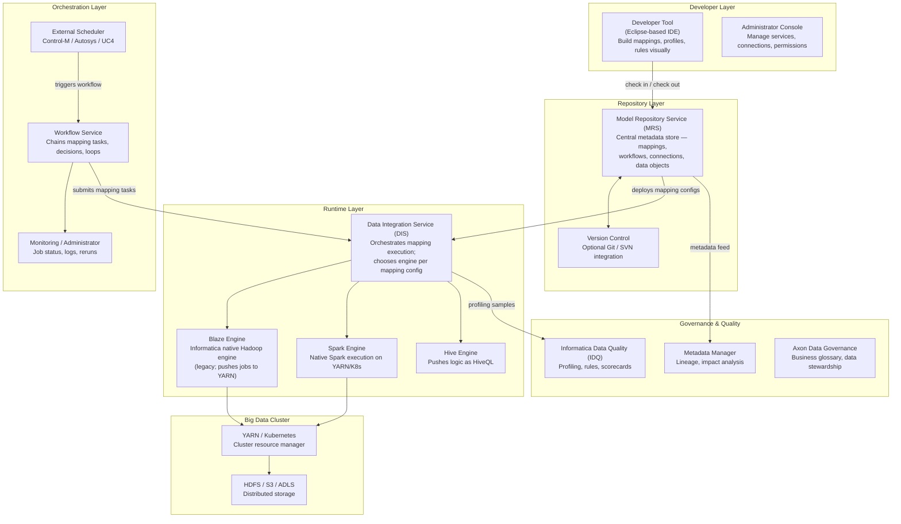

# Informatica BDM — SA Migration Guide

**Purpose:** Give a Solution Architect enough depth to assess an Informatica Big Data Management (BDM) estate, understand its moving parts, and map a migration path to Databricks.

This is not a developer guide. You won't be building BDM mappings. You will be walking customer sites, reviewing architecture diagrams, asking the right questions, and scoping what it takes to move to a modern lakehouse platform.

---

## Architecture Diagrams

### Informatica BDM Platform Architecture

How BDM's product suite fits together — from developer tooling through runtime execution to cluster resources.



---

### Informatica BDM as ETL — Data Flow Between Systems

How BDM sits between source systems and targets in a typical enterprise big data pipeline.

```mermaid
flowchart LR
    subgraph SOURCES["Source Systems"]
        RDBMS[("Relational DB\nOracle / SQL Server / Teradata")]
        HDFS_SRC["HDFS / Cloud Storage\nS3 / ADLS / GCS"]
        MF["Mainframe / Flat Files\nFixed-width / Delimited"]
        KAFKA["Streaming\nKafka topics"]
    end

    subgraph BDM["Informatica BDM ETL Layer"]
        direction TB
        READERS["Source Qualifiers & Readers\nRead from RDBMS, HDFS, files, Kafka"]
        TRANSFORMS["Transformation Logic\nExpression · Joiner · Aggregator\nFilter · Lookup · Router · Sorter\nNormalizer · Rank · Union"]
        SCRATCH["Temporary / Intermediate\nHDFS staging files or Hive tables\nbetween mapping stages"]
        WRITERS["Target Writers\nWrite to RDBMS, Hive, HDFS,\nHBase, cloud storage"]

        READERS --> TRANSFORMS
        TRANSFORMS -- intermediate staging --> SCRATCH
        SCRATCH --> TRANSFORMS
        TRANSFORMS --> WRITERS
    end

    subgraph TARGETS["Target Systems"]
        HIVE_TGT[("Hive / Impala\nAnalytic SQL layer")]
        DW[("Data Warehouse\nTeradata / Redshift / Synapse")]
        DATALAKE["Data Lake\nHDFS / S3 / ADLS (Parquet / ORC)"]
        RDBMS_TGT[("Operational DB\nOracle / SQL Server")]
    end

    subgraph ORCH["Orchestration"]
        WF["BDM Workflow\nChains mapping tasks\nacross the pipeline"]
    end

    SOURCES --> READERS
    WRITERS --> TARGETS
    WF -. schedules .-> BDM
```



---

## Sections

1. [Ecosystem Overview](#1-ecosystem-overview)
2. [Mappings — The Core Building Block](#2-mappings--the-core-building-block)
3. [Data Formats and Schema](#3-data-formats-and-schema)
4. [Parallelism and Scaling Model](#4-parallelism-and-scaling-model)
5. [Project Structure and Version Control](#5-project-structure-and-version-control)
6. [Orchestration: Workflows and External Schedulers](#6-orchestration-workflows-and-external-schedulers)
7. [Metadata, Lineage, and Impact Analysis](#7-metadata-lineage-and-impact-analysis)
8. [Data Quality with IDQ](#8-data-quality-with-idq)
9. [Informatica BDM File Formats Reference](#9-informatica-bdm-file-formats-reference)
10. [Migration Assessment and Artifact Inventory](#10-migration-assessment-and-artifact-inventory)
11. [Migration Mapping to Databricks](#11-migration-mapping-to-databricks)

---

## 1. Ecosystem Overview

### What Is Informatica BDM?

**Informatica Big Data Management (BDM)** is Informatica's enterprise ETL platform built specifically for big data environments — Hadoop, Hive, cloud object storage, and Spark. It extends the PowerCenter lineage into the distributed computing era, allowing customers to build PowerCenter-style mappings that execute natively on a Spark or Hive engine rather than on an Integration Service appliance.

Where PowerCenter runs transformations on a dedicated Integration Service node, **BDM pushes the execution to the cluster** — the transformation logic compiles to Spark jobs or HiveQL and runs where the data lives. This is the fundamental architectural difference that makes BDM relevant to customers who have already moved data to HDFS, S3, or ADLS.

BDM is part of Informatica's broader **IDMC (Intelligent Data Management Cloud)** story, but most legacy BDM estates are on-premises or on cloud VMs, not in the managed cloud service.

### The Informatica BDM Product Context

| Product | What It Does | Migration Relevance |
|---------|-------------|---------------------|
| **Informatica BDM** | ETL/ELT for Hadoop, Hive, Spark, and cloud storage | High — the primary migration target |
| **PowerCenter** | Traditional ETL on dedicated Integration Service nodes | Often runs alongside BDM; separate migration track |
| **IDQ (Data Quality)** | Profiling, rule-based validation, scorecards | Medium — quality rules must be replicated |
| **Metadata Manager** | Lineage, impact analysis, catalog integration | High — use for estate inventory |
| **Axon Data Governance** | Business glossary, data stewardship | Low — governance layer, not pipeline logic |
| **IDMC / CDI** | Cloud-managed SaaS successor to BDM/PowerCenter | Relevant if customer is already migrating to IDMC |
| **Enterprise Data Catalog (EDC)** | Auto-scanning catalog with ML-assisted lineage | High — often the richest source of inventory data |

> **SA Tip:** Many enterprise customers run **both PowerCenter and BDM** — PowerCenter handles relational ETL (RDBMS to RDBMS), BDM handles big data ETL (HDFS, Hive, S3). When scoping a migration, ask which product owns which pipelines. The migration paths are different and should be tracked separately.

### Why Customers Want to Migrate

| Driver | What It Means for the Engagement |
|--------|----------------------------------|
| **Hadoop cluster decommission** | Many customers are shutting down on-prem Hadoop; BDM loses its execution target |
| **License cost** | BDM licensing is expensive — Spark-native pipelines remove the vendor dependency |
| **Talent** | Informatica developers are expensive; Python/SQL skills are far more available |
| **Cloud-first mandate** | BDM requires managing cluster connectivity and service infrastructure; Databricks is managed |
| **IDMC transition pressure** | Informatica's own roadmap points to IDMC — customers face forced migration anyway |
| **Performance** | Databricks' Photon engine often outperforms BDM's Spark submission overhead |

### Key Discovery Questions

Before scoping a migration, ask:

1. How many BDM mappings are in **active production** use? (Ask for last-run date — many estates have 30–50% unused mappings)
2. Which execution engine is in use — **Blaze, Spark, or Hive**? (Blaze is legacy; Spark is the current path)
3. What are the **source and target systems**? (Hive, HDFS, S3, ADLS, RDBMS, HBase)
4. Are mappings run standalone or via **BDM Workflows**? Are external schedulers involved?
5. Does the customer use **IDQ rules embedded in mappings**, or is IDQ a separate profiling-only tool?
6. Is **Metadata Manager or EDC** in use, and is its metadata current?
7. Are there **reusable mapplets** (shared transformation logic) — and how many mappings depend on them?
8. What does the **Hadoop cluster** look like — is it being decommissioned alongside the migration?
9. Is there any **IDMC / CDI migration already underway** that would affect scope?

---

## 2. Mappings — The Core Building Block

### The Mapping

In Informatica BDM, the **mapping** is the fundamental unit of work — equivalent to an Ab Initio graph or a Talend Job. A mapping is a visual dataflow diagram: data enters through source objects, passes through a series of transformation objects, and exits to target objects.

BDM mappings look almost identical to PowerCenter mappings and are built in the same Developer Tool IDE. The key difference is that a BDM mapping carries an **execution engine setting** that tells the Data Integration Service whether to run it on Spark, Hive, or Blaze — rather than on the Integration Service's own process.

A single BDM estate can have **hundreds to thousands of mappings** across multiple projects, with wide variation in complexity, recency, and active use.

### Transformations

A **transformation** is a single processing step inside a mapping. BDM ships with a large library of transformations, and the set of available transformations varies by execution engine (not all transformations are supported on all engines).

| Category | Transformations | What They Do |
|----------|----------------|--------------|
| **Input** | `Source Qualifier`, `Read` | Read from RDBMS, Hive, HDFS, files, Kafka |
| **Transform** | `Expression`, `Normalizer`, `Rank` | Field-level calculations, flattening arrays, top-N |
| **Filter & Route** | `Filter`, `Router` | Conditional row filtering and multi-output branching |
| **Join & Lookup** | `Joiner`, `Lookup` | Dataset joins, enrichment from static or dynamic sources |
| **Aggregate** | `Aggregator`, `Sorter` | Group-by aggregations, deterministic sorting |
| **Set Operations** | `Union` | Combining multiple inputs into one output stream |
| **Output** | `Write`, `Target` | Write to RDBMS, Hive, HDFS, cloud storage, HBase |
| **Quality** | `Data Masking`, `Address Validator` | PII masking, IDQ-integrated validation |

> **SA Tip:** Ask whether the customer uses **active/passive lookups** extensively. Passive lookups cache reference data in memory — on large datasets this can cause memory pressure on the cluster. When mapping to Databricks, these become broadcast joins or Delta table lookups, and the sizing implications are different.

### Mapplets

A **mapplet** is a reusable sub-mapping — a named, encapsulated transformation logic block that can be embedded inside multiple parent mappings. Mapplets are the BDM equivalent of Ab Initio's wrapped graphs or Talend's subjobs.

When inventorying an estate, mapplets are a **critical dependency artifact** — a mapplet used by 40 mappings must be migrated before any of those mappings. Identify all mapplets and their fan-out early.

### Mapping Tasks vs. Mappings

A **mapping** defines the transformation logic. A **mapping task** (also called a session in PowerCenter terminology) is a runtime configuration that links a mapping to specific connections, parameter values, and execution settings. One mapping can have multiple mapping tasks — each pointing to different environments or connection sets.

| Concept | Description | Databricks Equivalent |
|---------|-------------|----------------------|
| **Mapping** | The transformation logic definition | Databricks notebook / DLT pipeline |
| **Mapping Task** | Runtime config — connections, parameters, engine | Job configuration / task parameters |
| **Workflow** | Ordered collection of tasks with dependencies | Databricks Workflow |

---

## 3. Data Formats and Schema

### How BDM Describes Data

BDM uses **data objects** to represent the schema of sources and targets. Rather than standalone schema definition files (like Ab Initio's DML), BDM embeds schema definitions inside the mapping object itself or links them to reusable **physical data objects** stored in the repository.

| Schema Artifact | Description | Migration Note |
|----------------|-------------|----------------|
| **Physical Data Object** | Reusable source/target schema definition registered in the repository | Maps to a Unity Catalog table or Delta schema definition |
| **Source Qualifier** | Read-side transformation that embeds a SQL override query | Inline query logic must be extracted and replicated in Databricks |
| **Flat File Data Object** | Schema for delimited or fixed-width flat files | Maps to a Databricks Auto Loader schema or COPY INTO definition |
| **Hive data object** | Schema for Hive tables with partition column definitions | Maps directly to a Delta/Hive metastore table |
| **Complex File Data Object** | Schema for Avro, Parquet, ORC, JSON | Directly supported in Databricks; minimal migration effort |

### Data Types

BDM uses Informatica's native type system, which maps to underlying platform types at runtime. Type mapping complexity varies by execution engine.

| Informatica Type | Description | Databricks / Spark Type |
|-----------------|-------------|------------------------|
| `String` | Variable-length string (up to 104,857,600 bytes) | `StringType` |
| `Integer` | 32-bit signed integer | `IntegerType` |
| `Bigint` | 64-bit signed integer | `LongType` |
| `Double` | 64-bit IEEE floating point | `DoubleType` |
| `Decimal(p,s)` | Arbitrary-precision decimal | `DecimalType(p,s)` |
| `Date/Time` | Date and timestamp with format | `TimestampType` / `DateType` |
| `Binary` | Raw bytes | `BinaryType` |

> **SA Tip:** BDM's `Decimal` handling differs slightly between Spark and Hive execution modes — precision truncation rules are not identical. If the customer's pipelines rely on specific decimal rounding behavior, flag this as a testing risk during migration.

### Source Qualifier SQL Overrides

In PowerCenter and BDM, developers frequently use **SQL overrides** in Source Qualifier transformations to push filter predicates, join conditions, or custom query logic into the database rather than processing records in the ETL engine. These overrides are hand-written SQL embedded inside the mapping XML.

> **Migration relevance:** SQL overrides are one of the most common sources of hidden logic in BDM estates. They don't appear in the visual dataflow — they're in a property field of the Source Qualifier. During inventory, always extract and review SQL overrides; they are often the most complex part of the mapping to replicate.

---

## 4. Parallelism and Scaling Model

### How BDM Achieves Performance

BDM's parallelism model is fundamentally different from PowerCenter's, and it's the reason BDM exists as a separate product. BDM doesn't manage partitioning itself — it **delegates execution to the cluster** and lets the underlying engine (Spark or Hive) handle distributed processing.

### Execution Engines

When a mapping task runs, the Data Integration Service selects an execution engine based on the mapping's engine setting and the available cluster connection.

| Engine | How It Works | Migration Relevance |
|--------|-------------|---------------------|
| **Spark** | Compiles the mapping to a Spark application, submits to YARN or K8s | Current-generation; most likely what active pipelines use |
| **Hive** | Translates mapping logic to HiveQL; executed by Hive on MapReduce or Tez | Older; slower; may indicate legacy pipelines that need re-evaluation |
| **Blaze** | Informatica's proprietary Hadoop engine (pre-Spark era) | Legacy — if seen, this mapping hasn't been updated in years |
| **Native (DIS)** | Runs on the Integration Service node, not the cluster | Used when source/target is RDBMS only; no cluster dependency |

> **SA Tip:** Ask which engine the customer's production mappings use. **Blaze-mode mappings are a migration red flag** — they indicate the customer is running old pipelines on deprecated technology, and they often contain patterns (like HDFS-specific tricks) that have no direct Spark equivalent. Budget extra time for Blaze-to-Spark translation.

### Partitioning in BDM

Unlike PowerCenter's explicit partition points, BDM relies on Spark's automatic data partitioning. The key configuration levers are:

| Setting | Description | Databricks Equivalent |
|---------|-------------|----------------------|
| **Cluster configuration** | Number of YARN executors, executor memory, executor cores | Databricks cluster node count and instance type |
| **spark.sql.shuffle.partitions** | Number of partitions after a shuffle (join, aggregation) | Same Spark config, tunable per job |
| **Partition hints in Hive targets** | Writing output to HDFS partitioned by column values | Delta table partitioning by column |
| **Bucketing in Hive sources** | Pre-bucketed Hive tables that enable bucket joins | Delta Z-ordering / liquid clustering |

### What Customers Have Likely Configured

At a typical BDM customer site, you will find:
- A centrally managed YARN cluster shared across BDM and other Hadoop workloads
- Spark execution for active mappings, with a handful of Blaze or Hive mappings from earlier phases
- Executor sizing set at the cluster level, not per-mapping — individual mapping performance tuning is often minimal
- Intermediate staging in HDFS (temp tables or temp files) between mapping stages

> **Migration relevance:** BDM's performance profile on Databricks won't automatically match what the customer sees on YARN — cluster sizing, Photon optimization, and Delta caching change the picture. Set expectations that performance validation is a migration task, not an assumption.

---

## 5. Project Structure and Version Control

### The Model Repository Service (MRS)

The **Model Repository Service** is BDM's central metadata store — analogous to Ab Initio's EME or PowerCenter's Repository Service. It stores every mapping, mapplet, workflow, physical data object, and connection definition, versioned and organized into projects and folders.

The MRS is the authoritative source for estate inventory. Any migration assessment should start with an MRS export or direct metadata query.

### Project Hierarchy

```
MRS
 └── Project: Finance_BDM
       ├── Folder: Ingest
       │     ├── Mapping: load_transactions
       │     ├── Mapping: load_customers
       │     └── Mapplet: cleanse_address
       ├── Folder: Transform
       │     ├── Mapping: calc_daily_balances
       │     └── Workflow: nightly_finance_load
       └── Folder: Reference_Data
             └── Mapping: refresh_lookup_tables
```

| Concept | What It Is | Equivalent |
|---------|-----------|------------|
| **Project** | Top-level container for all related artifacts | Git repository / Databricks workspace folder |
| **Folder** | Logical grouping within a project | Subdirectory / Databricks folder |
| **Mapping** | Transformation logic definition | Databricks notebook / Python script / DLT pipeline |
| **Mapplet** | Reusable sub-mapping | Databricks shared library / reusable DLT component |
| **Workflow** | Orchestration definition | Databricks Workflow / Airflow DAG |
| **Physical Data Object** | Reusable source/target schema | Unity Catalog table definition |

### Version Control

BDM supports optional integration with **Git or SVN** for version control, but many on-premises deployments rely solely on the MRS's built-in versioning (check-in/check-out model). In environments without Git integration:
- Artifact history is stored only in the MRS database
- Rollback requires restoring from MRS, not from a git revert
- Code review is done through the Developer Tool UI, not pull requests

> **SA Tip:** If the customer doesn't have Git integrated with BDM, the migration project itself will need to establish Git practices for the first time. Budget time for this cultural shift — it's often underestimated when customers are coming from an MRS-only versioning model.

### Deployment and Promotion

BDM uses an **export/import workflow** for promoting artifacts between environments (DEV → QA → PROD). Artifacts are exported as XML files (`.inf` or `.xml` format) and imported into the target environment's MRS. This is BDM's equivalent of a deployment pipeline.

---

## 6. Orchestration: Workflows and External Schedulers

### BDM Workflows

A **workflow** is BDM's built-in orchestration unit — an ordered collection of mapping tasks, decision tasks, and assignment tasks that run in sequence or conditionally based on outcomes.

| Concept | Description | Databricks Equivalent |
|---------|-------------|----------------------|
| **Workflow** | Named orchestration unit containing tasks | Databricks Workflow / Airflow DAG |
| **Mapping Task** | A step that runs a specific mapping with its runtime config | Databricks Workflow Task (notebook or Python) |
| **Decision Task** | A conditional branch — routes execution based on output variable | `if_else` condition in Workflow or Airflow BranchOperator |
| **Assignment Task** | Sets a workflow variable for use in downstream tasks | Workflow parameter / Airflow XCom |
| **Start/End Events** | Define trigger and termination of the workflow | Workflow schedule / trigger |
| **Link Conditions** | Boolean expressions on workflow variable values that control task sequencing | Databricks Workflow task dependency conditions |

### Workflow Structure Example

A typical BDM workflow for a nightly data load:

```
Workflow: NIGHTLY_FINANCE_LOAD
  Task 1: load_transactions        (runs first)
  Task 2: load_customers           (depends on Task 1 success)
  Task 3: calc_daily_balances      (depends on Task 2 success)
  Task 4: refresh_lookup_tables    (depends on Task 1 success — runs in parallel with Task 2)
  Decision: if Task 3 fails → send_alert_email
```

This maps directly to a Databricks Workflow with task dependencies and `on_failure` notification tasks.

### Worklets

A **worklet** is a reusable sub-workflow — a named, encapsulated set of tasks that can be embedded in multiple parent workflows. Worklets are the orchestration equivalent of mapplets. During migration, identify all worklets and their fan-out before migrating the workflows that depend on them.

### Monitoring

The **Informatica Administrator Console** and **Workflow Monitor** provide job status visibility — running jobs, historical run logs, success/failure states, and manual rerun capability.

| BDM Feature | Databricks Equivalent |
|------------|----------------------|
| Workflow Monitor — real-time status | Databricks Workflows UI — run monitoring |
| Historical run logs | Workflow run history |
| Manual task rerun | Task repair run |
| Email notification on failure | Workflow notification policy |
| Session log (per-mapping execution detail) | Spark driver/executor logs in cluster UI |

### External Schedulers

Many enterprise BDM environments use an **external enterprise scheduler** to trigger workflows — BMC Control-M, IBM Workload Scheduler, Autosys, or UC4. In this topology:
- The external scheduler handles **cross-system timing** (e.g., "wait for the upstream file to arrive from the mainframe")
- BDM Workflow handles **intra-pipeline dependencies** (task ordering within the pipeline)

> **Migration relevance:** If the customer uses an external scheduler, the migration has two layers: replacing BDM Workflows with Databricks Workflows, AND replacing or re-integrating with the external scheduler. This is frequently underestimated. Ask whether the external scheduler will be replaced or retained — retaining it simplifies migration but leaves a dependency.

---

## 7. Metadata, Lineage, and Impact Analysis

### What the MRS Tracks

The MRS stores not just artifacts but **relationships** between them — which mappings use which data objects, which mapplets are embedded in which mappings, which workflows chain which tasks. This relationship graph is the foundation for impact analysis.

| Relationship Type | Example |
|-------------------|---------|
| Mapping uses Physical Data Object | `load_transactions` reads `transactions_hive_object` |
| Mapping embeds Mapplet | `load_customers` uses `cleanse_address` mapplet |
| Workflow runs Mapping Task | `NIGHTLY_LOAD` executes `load_transactions_task` |
| Mapping Task runs Mapping | `load_transactions_task` executes `load_transactions` |
| Mapping writes target | `load_transactions` writes to `hive.finance.transactions` |

### Metadata Manager and Enterprise Data Catalog

BDM's richer lineage tools are **Metadata Manager (MM)** and the newer **Enterprise Data Catalog (EDC)**:

| Tool | Purpose | Migration Use |
|------|---------|---------------|
| **Metadata Manager** | Cross-system lineage — connects BDM pipelines to source and target systems | Estate inventory, cross-system dependency mapping |
| **Enterprise Data Catalog (EDC)** | Auto-scanned catalog with ML-assisted lineage, data domains, and profiling | Best source of current, trusted inventory data |
| **Axon** | Business glossary and stewardship | Lower migration relevance — governance layer |

> **SA Tip:** EDC is the most powerful inventory tool in the Informatica ecosystem, but it's a separate licensed product. Ask whether the customer has it. If they do, its scan results can significantly accelerate the migration assessment — you get a cross-system lineage picture without manually tracing each mapping.

### Impact Analysis

Before migrating any shared artifact (mapplet, physical data object, connection), use the MRS or Metadata Manager to identify **all dependents**. Key impact analysis questions:

- Which mappings use this mapplet?
- Which workflows depend on this mapping task?
- Which mappings write to this Hive table (which downstream processes might break)?
- Which mappings read from this source physical data object?

### Common Lineage Gaps

| Gap | Why It Happens | SA Implication |
|----|---------------|----------------|
| Shell script invocations | BDM can call OS commands; lineage stops at the script boundary | Manually trace what the script does |
| SQL override queries | Embedded SQL in Source Qualifiers bypasses visual lineage | Extract and document all SQL overrides |
| Parameter-driven paths | File paths or table names passed as runtime parameters | Lineage only visible at runtime, not in static analysis |
| Blaze-mode mappings | Some Blaze-specific patterns are not captured in modern EDC scans | Validate lineage manually for Blaze mappings |

---

## 8. Data Quality with IDQ

### What Informatica Data Quality Does

**IDQ (Informatica Data Quality)** is Informatica's standalone data quality product, tightly integrated with BDM. It provides profiling, rule-based validation, matching/deduplication, and scorecard reporting.

In a BDM estate, IDQ appears in two forms:
1. **Standalone IDQ mappings** — separate pipelines that profile datasets and produce quality reports
2. **Embedded IDQ transformations** — quality rules embedded directly inside BDM mappings as transformations

The second form is the migration-critical one — embedded rules are business logic that must be replicated.

### IDQ Transformations in BDM Mappings

| Transformation | What It Does | Databricks Equivalent |
|---------------|-------------|----------------------|
| `Data Quality` transformation | Applies IDQ rule specifications to records; routes bad records to reject port | Delta Live Tables `expect()` / Great Expectations |
| `Address Validator` | Validates and standardizes postal addresses against reference data | Third-party address validation API or custom UDF |
| `Data Masking` | Masks or tokenizes PII fields | Databricks column masking / Unity Catalog row filters |
| `Match` | Probabilistic or deterministic record matching / deduplication | Custom Spark dedup logic or third-party MDM |
| `Exception` transformation | Routes records that fail quality rules to an exception table | DLT quarantine pattern |

> **SA Tip:** Embedded IDQ transformations are frequently overlooked in migration scoping because they don't look like "ETL" — they're quality operations. When reviewing mappings, flag every IDQ transformation and document the rule it enforces. These are regulatory or business-critical rules the customer will want to verify are preserved post-migration.

### Scorecards and Quality Reports

IDQ produces **scorecards** — dashboards that aggregate quality metrics across datasets over time. If the customer actively uses scorecards, they will need a Databricks-native equivalent (DLT quality metrics, custom Delta tables feeding a BI tool) or a Databricks Data Quality product after migration.

---

## 9. Informatica BDM File Formats Reference

When you walk into a customer's BDM environment, you will encounter a specific set of file types in every export directory and repository. Knowing what each file is and what it means for migration is essential for artifact inventory.

---

### `.inf` — Informatica Export File (XML)

The `.inf` file is the primary **export format for BDM artifacts** — mappings, mapplets, workflows, physical data objects, and connections. When a developer or DBA exports objects from the Developer Tool or Administrator Console, they get `.inf` files. These are XML-formatted and human-readable.

| Property | Detail |
|----------|--------|
| **Created by** | Developer Tool export wizard, Administrator Console, `infacmd` CLI |
| **Stored in** | File system (deployment packages, migration archives) |
| **Contains** | Full definition of one or more BDM objects — transformations, port connections, expressions, parameter references |
| **Human-readable?** | Yes — XML format, verbose but inspectable |
| **Migration target** | Each `.inf` mapping is a migration unit — maps to a Databricks notebook, Python script, or DLT pipeline |

**Example `.inf` snippet (mapping header):**
```xml
<POWERMART EXPORT_VERSION="186.0911" REPOSITORY_VERSION="186.0911">
  <REPOSITORY NAME="BDM_REPO" VERSION="186" CODEPAGE="UTF-8">
    <FOLDER NAME="Finance" GROUP="" OWNER="admin">
      <MAPPING NAME="load_transactions" ISVALID="YES" VERSIONNUMBER="1">
        <TRANSFORMATION TYPE="Source Qualifier" NAME="SQ_transactions">
          ...
        </TRANSFORMATION>
      </MAPPING>
    </FOLDER>
  </REPOSITORY>
</POWERMART>
```

> **SA Tip:** The `.inf` count in active deployment packages is your best proxy for migration scope — these are the artifacts that are actually being promoted to production. A customer may have 2,000 objects in the MRS but only 300 `.inf` files in their current release package.

---

### `.xml` — Repository Object Export (MRS Backup / Metadata Extract)

The `.xml` export is a **broader repository export** — often produced by full-repository backups or Metadata Manager extracts. Unlike the `.inf` format used for individual deployments, `.xml` exports cover entire projects or folders and are used for DR and migration.

| Property | Detail |
|----------|--------|
| **Created by** | `infacmd mrs ExportObjects`, Administrator Console backup |
| **Stored in** | Backup directories, migration staging areas |
| **Contains** | Full project or folder contents including all artifact types and their relationships |
| **Human-readable?** | Yes — XML, but more verbose than `.inf`; relationships between objects are encoded |
| **Migration target** | Use as the source for estate inventory parsing — extract mapping names, transformation types, port connections |

> **SA Tip:** Ask the DBA team for a full MRS export early in the engagement. Even if the customer hasn't recently backed up, most sites have an `.xml` export from a recent DR drill. This is often faster to work with than live MRS queries for counting and categorizing artifacts.

---

### `.prm` — Parameter File

The `.prm` file defines **runtime parameters** for BDM mappings and workflows — file paths, database connection names, date ranges, environment-specific settings. Parameters are passed to mapping tasks and workflow sessions at runtime.

| Property | Detail |
|----------|--------|
| **Created by** | Manually by developers; sometimes generated by wrapper scripts |
| **Stored in** | File system — typically a `parameters/` directory adjacent to the mapping deployment |
| **Contains** | Key=value pairs for workflow-level or mapping-level parameters (`$PM_TARGET_TABLE`, `$LOAD_DATE`, etc.) |
| **Human-readable?** | Yes — plain text key=value format |
| **Migration target** | Maps to Databricks Workflow job parameters, widgets, or Databricks Secrets for credentials |

**Example `.prm` file:**
```
[load_transactions.mapping]
$$LOAD_DATE=2024-01-15
$$SOURCE_SCHEMA=finance_prod
$$TARGET_TABLE=transactions_delta

[load_transactions.session]
$PMTargetFileDir=/data/output/transactions/
$PMBadFileDir=/data/rejects/
```

> **SA Tip:** Parameter files are the primary mechanism for environment promotion in BDM — the same mapping runs in dev vs. prod because of different `.prm` files. Understanding the parameter set for each mapping tells you how many environment-specific configurations exist and what Databricks environment variables or secrets need to be created to replace them.

---

### `.wfl` — Workflow Export File

The `.wfl` format is used by some Informatica export tools to package **workflow definitions** separately from mapping logic. Not all environments produce `.wfl` files — many workflows are packaged inside `.inf` exports — but some customer tooling generates them explicitly.

| Property | Detail |
|----------|--------|
| **Created by** | Workflow Manager export, some third-party deployment tools |
| **Stored in** | Deployment packages, migration archives |
| **Contains** | Workflow task definitions, link conditions, decision logic, assignment variables |
| **Human-readable?** | Yes — XML format |
| **Migration target** | Each `.wfl` maps to a Databricks Workflow definition (JSON) or an Airflow DAG |

---

### `.mpp` — Mapping Specification (Developer Tool Project File)

The `.mpp` file is the Developer Tool's **project metadata file** — it records the project structure, folder hierarchy, and object registration within the MRS. It is analogous to a project file in an IDE.

| Property | Detail |
|----------|--------|
| **Created by** | Developer Tool when creating or exporting a project |
| **Stored in** | Project root directory |
| **Contains** | Project name, folder structure, registered MRS objects, version metadata |
| **Human-readable?** | Yes — XML |
| **Migration target** | Not a direct migration artifact — use to understand folder/project structure for Databricks workspace organization |

---

### Parameter Override Files (environment-specific)

Beyond named `.prm` files, BDM environments often have **environment-specific override files** — flat text files named by environment (e.g., `prod_overrides.ini`, `qa_connections.cfg`) that override default connection names, file paths, and schema names.

| Property | Detail |
|----------|--------|
| **Created by** | DBAs or deployment engineers manually |
| **Stored in** | Deployment infrastructure, often outside the MRS |
| **Contains** | Connection name mappings, schema aliases, path overrides |
| **Human-readable?** | Yes — plain text |
| **Migration target** | Maps to Databricks environment-specific job configuration or Databricks Secrets |

> **SA Tip:** Environment override files are frequently undocumented and stored only on production servers — not in the MRS or version control. Ask specifically for these during the discovery phase. They often contain the production connection names and paths that aren't visible from a pure MRS export.

---

### Quick-Reference Summary Table

| File Type | Created By | Human-Readable? | Migration Target |
|-----------|-----------|-----------------|-----------------|
| `.inf` | Developer Tool export, `infacmd` | Yes (XML) | Primary migration unit — notebook / DLT pipeline per mapping |
| `.xml` | MRS backup / full export | Yes (XML, verbose) | Estate inventory — parse for artifact counts and relationships |
| `.prm` | Developer / deployment scripts | Yes (key=value) | Databricks job parameters / Secrets |
| `.wfl` | Workflow Manager export | Yes (XML) | Databricks Workflow definition / Airflow DAG |
| `.mpp` | Developer Tool | Yes (XML) | Workspace structure reference only |
| Override files | DBA / deployment teams | Yes (plain text) | Databricks environment config / Secrets |

---

## 10. Migration Assessment and Artifact Inventory

### Building the Inventory

Start from the **MRS or EDC** — not from file system counts. The MRS is the authoritative list of what's been built; the file system may have stale exports mixed in with active artifacts.

**Step 1 — Export the MRS object list:**
Use `infacmd mrs ListAllObjects` or the Administrator Console to get a flat list of all mappings, mapplets, workflows, and physical data objects with their project/folder path and last-modified date.

**Step 2 — Filter to active production:**
Cross-reference the MRS object list with Workflow Monitor run history (export from the Workflow Monitor or query the repository database directly). A mapping that has not appeared in a successful workflow run in 12+ months is a candidate for decommissioning.

**Step 3 — Categorize mappings by execution engine:**
For each mapping task in production, note the engine setting (Spark, Hive, Blaze, Native). Blaze and Hive mappings are higher effort; Spark mappings translate most directly to Databricks.

**Step 4 — Extract SQL overrides:**
Parse the `.inf` or `.xml` exports for Source Qualifier transformations with custom SQL. These represent hidden logic not visible in the visual dataflow.

**Step 5 — Identify shared artifacts:**
List all mapplets and physical data objects, and for each, count how many mappings reference them. High-fan-out artifacts must be migrated before the mappings that depend on them.

### Complexity Scoring

Score each mapping on the following dimensions to produce a migration effort estimate:

| Dimension | Low (1) | Medium (2) | High (3) |
|-----------|---------|-----------|---------|
| **Transformation count** | < 10 transformations | 10–30 | > 30 |
| **Execution engine** | Spark | Hive | Blaze or Native (non-cluster) |
| **SQL overrides** | None | 1–2 simple queries | Complex queries, dynamic SQL |
| **Embedded IDQ transformations** | None | 1–2 rules | Multiple rules or Match/Dedup |
| **Mapplet dependencies** | None | 1–2 mapplets | 3+ mapplets or nested mapplets |
| **Source/target types** | HDFS / Hive / S3 | RDBMS | Mainframe, HBase, exotic connectors |
| **Parameter complexity** | Simple date/path params | Multiple env overrides | Dynamic parameter generation |

**Total score guidance:**
- **7–10:** Low complexity — strong candidate for direct migration
- **11–15:** Medium complexity — requires design review before migrating
- **16–21:** High complexity — break into sub-tasks; consider redesigning rather than translating

### Risk Areas Specific to BDM

| Risk Area | Why It Matters |
|-----------|---------------|
| **Blaze-mode mappings** | Blaze is deprecated; no direct Spark equivalent for some Blaze-specific behaviors |
| **Hive-to-Delta schema evolution** | Hive partition schemes don't always translate cleanly to Delta's partition strategy |
| **Source Qualifier SQL overrides** | Hidden business logic that won't surface in a standard mapping export review |
| **Passive lookup caching** | Memory-based lookup caching behavior differs between BDM and Spark broadcast joins |
| **IDQ Match/Dedup transformations** | Probabilistic matching has no out-of-box Databricks equivalent |
| **External scheduler dependencies** | Cross-system timing logic lives outside BDM and is easy to overlook |
| **Parameter file proliferation** | Many environments have accumulated dozens of parameter files without documentation |
| **Shared physical data objects** | A single data object used by many mappings creates a migration sequencing constraint |

---

## 11. Migration Mapping to Databricks

### Building Blocks

| BDM Concept | Databricks Equivalent | Notes |
|-------------|----------------------|-------|
| **Mapping** | Databricks notebook / Python script / DLT pipeline | One BDM mapping → one Databricks task; DLT for streaming or quality-heavy mappings |
| **Mapplet** | Shared Python module / Databricks utility library / DLT component | Register in Unity Catalog; treat as a shared dependency |
| **Physical Data Object** | Unity Catalog table definition | Register schemas in Unity Catalog for discoverability |
| **Data Integration Service (DIS)** | Databricks cluster / DLT runtime | Compute is managed; no service to administer |
| **Model Repository Service (MRS)** | Databricks workspace + Unity Catalog | Metadata and lineage in Unity Catalog; code in Git |
| **Developer Tool (IDE)** | VS Code / Databricks IDE / Databricks Repos | Git-native development replaces check-in/check-out |

### Transformations / Components

| BDM Transformation | Databricks / Spark Equivalent |
|-------------------|------------------------------|
| **Source Qualifier** | `spark.read` / Auto Loader / `COPY INTO` + optional SQL filter |
| **Expression** | `withColumn()` / SQL `SELECT` expressions |
| **Filter** | `filter()` / `WHERE` clause |
| **Router** | Multiple `filter()` branches / `CASE WHEN` splits |
| **Aggregator** | `groupBy().agg()` / SQL `GROUP BY` |
| **Joiner** | `join()` / SQL `JOIN` |
| **Lookup (passive)** | `broadcast()` join / Delta table lookup |
| **Lookup (active)** | Streaming stateful join / foreachBatch lookup |
| **Sorter** | `orderBy()` / SQL `ORDER BY` |
| **Normalizer** | `explode()` / `posexplode()` |
| **Rank** | `Window.partitionBy().orderBy()` + `row_number()` |
| **Union** | `union()` / SQL `UNION ALL` |
| **Target** | `spark.write` / Delta `MERGE INTO` / `INSERT INTO` |
| **Data Quality transformation** | DLT `expect()` / Great Expectations / custom UDF |
| **Data Masking** | Unity Catalog column masks / `sha2()` / Databricks pseudonymization |

### Orchestration

| BDM Concept | Databricks Equivalent |
|-------------|----------------------|
| **Workflow** | Databricks Workflow |
| **Mapping Task** | Databricks Workflow Task (notebook or Python) |
| **Worklet** | Reusable Databricks Workflow (called as a repair task or a sub-workflow trigger) |
| **Decision Task** | Workflow task `if_else` condition |
| **Assignment Task** | Workflow task output parameter passed to downstream tasks |
| **Parameter File** | Databricks job parameters / widgets / Databricks Secrets |
| **Workflow Monitor** | Databricks Workflows UI + Lakehouse Monitoring |
| **External Scheduler** | Retain existing scheduler triggering Databricks Workflows via REST API / CLI |

### Governance and Lineage

| BDM Concept | Databricks Equivalent |
|-------------|----------------------|
| **MRS (repository)** | Unity Catalog + Databricks workspace Git |
| **Metadata Manager lineage** | Unity Catalog automatic lineage (column-level for notebooks/DLT) |
| **Enterprise Data Catalog (EDC)** | Unity Catalog + Databricks Data Intelligence Platform catalog |
| **Axon (business glossary)** | Unity Catalog tags and comments / external governance tool |
| **Check-in / check-out version control** | Git branches + pull requests |
| **Folder / project structure** | Databricks workspace folders + Git repo structure |

### Data Quality

| BDM / IDQ Concept | Databricks Equivalent |
|-------------------|----------------------|
| **IDQ rule specifications** | DLT `expect()` / `expect_or_drop()` / `expect_or_fail()` |
| **Reject port (bad record routing)** | DLT quarantine pattern — bad records to separate Delta table |
| **IDQ Scorecard** | Lakehouse Monitoring quality metrics dashboard |
| **Data profiling** | Databricks Data Profiling / Lakehouse Monitoring column statistics |
| **Match/Dedup** | Custom Spark dedup (window functions + similarity scoring) or third-party MDM |
| **Address Validator** | Third-party address validation API called via UDF |

### What Doesn't Map Cleanly

| BDM Capability | Why It's Hard | Recommended Approach |
|---------------|-------------|---------------------|
| **Blaze execution engine** | Blaze has proprietary behaviors not in open Spark | Rewrite as native Spark; no automated conversion |
| **Passive lookup caching** | BDM caches entire lookup tables in Integration Service memory; Spark broadcast join behavior differs at large scale | Test broadcast join performance at production data volumes; consider Delta table lookups for very large reference datasets |
| **Probabilistic Match/Dedup (IDQ)** | No out-of-box Databricks equivalent | Custom Spark ML similarity, or third-party MDM tool (Reltio, Profisee, Tamr) |
| **Address Validator** | Relies on licensed Informatica reference data | Replace with third-party API (Google Maps, SmartyStreets, Melissa) or custom logic |
| **Source Qualifier SQL pushdown** | Logic is embedded in property fields, not visible in visual export | Must extract, document, and explicitly replicate as Databricks SQL or Auto Loader filter |
| **Worklet fan-out** | A worklet embedded in 50 workflows becomes 50 individual workflow task patterns | Define a shared Databricks Workflow or library pattern that all workflows call |
| **External scheduler cross-system timing** | Timing logic lives in Control-M or Autosys, not in BDM | Decide whether to migrate scheduler to Databricks Workflows or retain external scheduler and integrate via REST API |
| **Parameter file proliferation** | Dozens of environment-specific parameter files with no central registry | Consolidate into Databricks Secrets scope per environment during migration |
