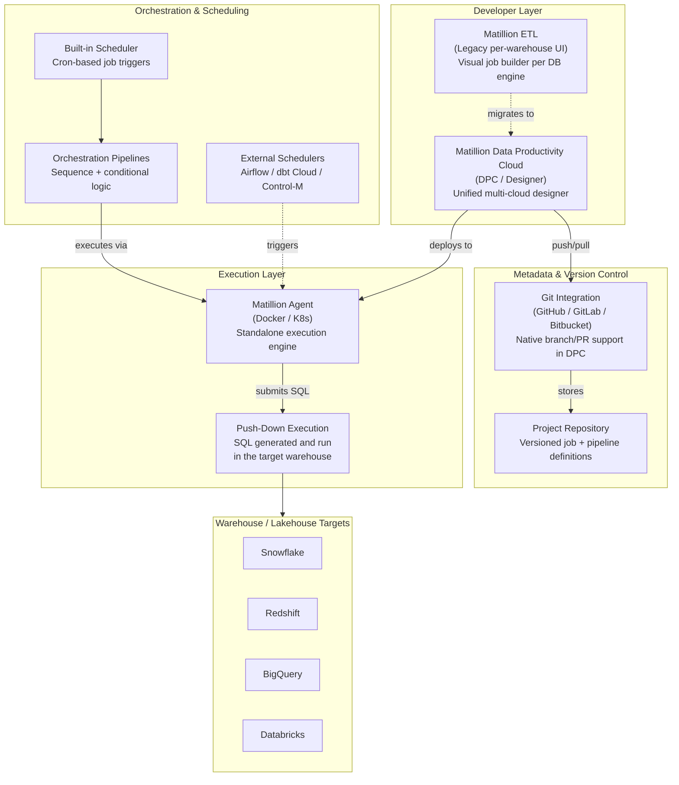
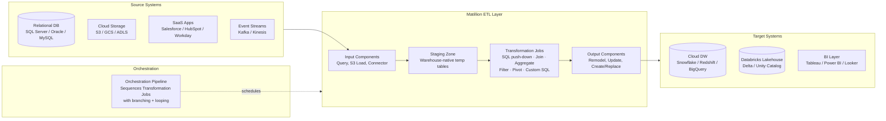

# Matillion — SA Migration Guide

**Purpose:** Give a Solution Architect enough depth to assess a Matillion estate, understand its moving parts, and map a migration path to Databricks.

This is not a developer guide. You won't be building Matillion jobs. You will be walking customer sites, reviewing pipeline catalogs, asking the right questions, and scoping what it takes to move to a modern lakehouse platform.

---

## Architecture Diagrams

### Matillion Platform Architecture

How the Matillion product suite fits together — from developer tooling through execution to orchestration and observability.

<div class="zd-wrapper" id="mat-arch-zoom" style="position:relative; border:1px solid #ddd; border-radius:6px; overflow:hidden; background:#fafafa;">
<div style="position:absolute; top:8px; right:10px; z-index:10; display:flex; align-items:center; gap:8px; font-size:0.78rem; color:#666;">
  <span>Scroll to zoom · Drag to pan</span>
  <button onclick="zdReset('mat-arch-zoom')" style="padding:2px 8px; font-size:0.75rem; border:1px solid #ccc; border-radius:4px; background:#fff; cursor:pointer;">Reset</button>
</div>
<div class="zd-canvas" style="cursor:grab; user-select:none;">



</div>
</div>

---

### Matillion as ETL — Data Flow Between Systems

How Matillion sits between source systems and cloud targets in a typical enterprise data pipeline.

<div class="zd-wrapper" id="mat-flow-zoom" style="position:relative; border:1px solid #ddd; border-radius:6px; overflow:hidden; background:#fafafa;">
<div style="position:absolute; top:8px; right:10px; z-index:10; display:flex; align-items:center; gap:8px; font-size:0.78rem; color:#666;">
  <span>Scroll to zoom · Drag to pan</span>
  <button onclick="zdReset('mat-flow-zoom')" style="padding:2px 8px; font-size:0.75rem; border:1px solid #ccc; border-radius:4px; background:#fff; cursor:pointer;">Reset</button>
</div>
<div class="zd-canvas" style="cursor:grab; user-select:none;">



</div>
</div>

<script>
(function(){
  window.zdReset=window.zdReset||function(id){var w=document.getElementById(id);if(!w)return;var c=w.querySelector('.zd-canvas');if(c){c._s=1;c._tx=0;c._ty=0;}var s=w.querySelector('svg');if(s){s.style.transform='translate(0,0) scale(1)';s.style.transformOrigin='0 0';}};
  function initC(c){if(c._zdInit)return;c._zdInit=true;c._s=1;c._tx=0;c._ty=0;var dr=false,sx,sy,stx,sty;function ap(sv){sv.style.transform='translate('+c._tx+'px,'+c._ty+'px) scale('+c._s+')';sv.style.transformOrigin='0 0';sv.style.display='block';}c.addEventListener('wheel',function(e){var sv=c.querySelector('svg');if(!sv)return;e.preventDefault();var r=c.getBoundingClientRect(),mx=e.clientX-r.left,my=e.clientY-r.top,d=e.deltaY<0?1.12:1/1.12,ns=Math.min(5,Math.max(0.4,c._s*d));c._tx=mx-(mx-c._tx)*(ns/c._s);c._ty=my-(my-c._ty)*(ns/c._s);c._s=ns;ap(sv);},{passive:false});c.addEventListener('mousedown',function(e){if(e.button)return;dr=true;sx=e.clientX;sy=e.clientY;stx=c._tx;sty=c._ty;c.style.cursor='grabbing';e.preventDefault();});window.addEventListener('mousemove',function(e){if(!dr)return;c._tx=stx+(e.clientX-sx);c._ty=sty+(e.clientY-sy);var sv=c.querySelector('svg');if(sv)ap(sv);});window.addEventListener('mouseup',function(){if(dr){dr=false;c.style.cursor='grab';}});c.addEventListener('touchstart',function(e){if(e.touches.length===1){dr=true;sx=e.touches[0].clientX;sy=e.touches[0].clientY;stx=c._tx;sty=c._ty;}},{passive:true});c.addEventListener('touchmove',function(e){if(dr&&e.touches.length===1){c._tx=stx+(e.touches[0].clientX-sx);c._ty=sty+(e.touches[0].clientY-sy);var sv=c.querySelector('svg');if(sv)ap(sv);}},{passive:true});c.addEventListener('touchend',function(){dr=false;});}
  function tryW(w){var c=w.querySelector('.zd-canvas');if(!c)return;var sv=c.querySelector('svg');if(!sv){setTimeout(function(){tryW(w);},200);return;}initC(c);}
  function initAll(){document.querySelectorAll('.zd-wrapper').forEach(function(w){tryW(w);});}
  if(document.readyState==='loading'){document.addEventListener('DOMContentLoaded',function(){setTimeout(initAll,600);});}else{setTimeout(initAll,600);}
})();
</script>

---

## Sections

1. [Ecosystem Overview](#1-ecosystem-overview)
2. [Pipelines and Components — The Core Building Block](#2-pipelines-and-components--the-core-building-block)
3. [Data Formats and Schema](#3-data-formats-and-schema)
4. [Parallelism and Scaling Model](#4-parallelism-and-scaling-model)
5. [Project Structure and Version Control](#5-project-structure-and-version-control)
6. [Orchestration](#6-orchestration)
7. [Metadata, Lineage, and Impact Analysis](#7-metadata-lineage-and-impact-analysis)
8. [Data Quality](#8-data-quality)
9. [Matillion File Formats Reference](#9-matillion-file-formats-reference)
10. [Migration Assessment and Artifact Inventory](#10-migration-assessment-and-artifact-inventory)
11. [Migration Mapping to Databricks](#11-migration-mapping-to-databricks)

---

## 1. Ecosystem Overview

### What Is Matillion?

Matillion is a **cloud-native ELT platform** designed to load data into cloud data warehouses and transform it there using push-down execution — meaning Matillion generates SQL and runs it inside the target warehouse rather than moving data through its own engine. This distinguishes it from traditional ETL tools like Ab Initio or Informatica that process data on a dedicated transform server.

Matillion targets **mid-market to enterprise** customers who have already moved to the cloud and want a low-code, visual way to build data pipelines without managing Spark clusters or writing raw dbt models. The tool has broad adoption in Snowflake shops, but also runs against Redshift, BigQuery, and Databricks.

Unlike heavyweight enterprise ETL tools, Matillion is:

- **Cloud-native and SaaS** — no on-premises servers to maintain; execution happens in the warehouse
- **Visual and low-code** — drag-and-drop component canvas, SQL expressions, no Java/C compilation
- **Push-down first** — transformation logic runs as SQL in the warehouse; Matillion is essentially a SQL code generator with a GUI
- **Multi-warehouse** — one platform, connectors to multiple engines; customers often have Matillion jobs targeting Snowflake today, and want to move to Databricks

### The Matillion Product Suite

Matillion has two product lines — understanding which one a customer is on is the first question to ask.

| Product | What It Is | Notes |
|---------|-----------|-------|
| **Matillion ETL** (Legacy) | Per-warehouse SaaS product — separate instances for Snowflake, Redshift, BigQuery | Older architecture; customers on this path are often in a forced migration to DPC |
| **Matillion Data Productivity Cloud (DPC)** | Unified multi-cloud platform — single designer, multi-target deployment | Current strategic product; includes Designer, Agent, Hub |
| **Designer** | The visual pipeline authoring UI inside DPC | Where all new development happens |
| **Matillion Agent** | Lightweight Docker/K8s runtime that executes pipelines | Deployed by the customer; connects to warehouses |
| **Hub** | Marketplace of pre-built connector templates and pipeline patterns | Accelerates connector setup |
| **Matillion Copilot** | AI-assisted SQL generation and pipeline building | Relevant for DPC customers, mostly demo-ware today |

> **SA Tip:** Many Matillion customers are mid-migration between ETL (legacy) and DPC themselves. Ask which product version they're on before assessing complexity — ETL and DPC have different artifact formats, project structures, and migration paths to Databricks.

### Why Customers Want to Migrate

| Driver | What It Means for the Engagement |
|--------|----------------------------------|
| **Warehouse consolidation** | Customer is moving from Snowflake/Redshift to Databricks; Matillion has no first-class Databricks support at parity with Snowflake |
| **Cost** | Matillion licensing plus warehouse compute is a significant combined cost; Databricks + dbt or Workflows can be lower TCO |
| **Developer experience** | Engineering teams prefer code-first tools (dbt, Spark, SQL notebooks) over a GUI-only tool |
| **Vendor concern** | Matillion's roadmap and pricing have been volatile; some customers are hedging by moving to open platforms |
| **dbt consolidation** | Many customers have dbt running alongside Matillion; the goal is to collapse onto one tool |

> **SA Tip:** Matillion customers moving to Databricks are often simultaneously evaluating dbt Core on Databricks as the replacement for the transformation layer. Position Databricks Workflows as the orchestration replacement and dbt or Delta Live Tables as the transform replacement — this resonates with their existing mental model.

### Key Discovery Questions

Before scoping a migration, ask:

1. Are they on **Matillion ETL (legacy)** or **Matillion DPC**? This determines the artifact format.
2. Which **warehouse is the current target** — Snowflake, Redshift, BigQuery? This affects SQL dialect translation work.
3. How many **Transformation Pipelines** are in active production use vs. total in the project?
4. How many **Orchestration Pipelines** exist, and do they use looping, branching, or variable-passing?
5. Are there **Python Script components** or **Custom SQL components** with complex bespoke logic?
6. How is **version control** managed — native Git integration in DPC, or manual export/import in legacy ETL?
7. Does the customer use **Matillion's built-in scheduler**, or does an external tool (Airflow, Control-M) trigger jobs?
8. Are there **Shared Jobs** (reusable pipeline components) that multiple pipelines depend on?

---

## 2. Pipelines and Components — The Core Building Block

### The Transformation Pipeline

In Matillion, the **Transformation Pipeline** (called a **Transformation Job** in legacy ETL) is the fundamental unit of work — it is the equivalent of an Ab Initio graph, an Informatica mapping, or a dbt model set. It is a directed visual dataflow: data enters from a source component, passes through transformation components, and exits to target components.

All transformation logic in Matillion runs as **push-down SQL** — Matillion compiles the component canvas into SQL statements that execute in the warehouse. There is no Matillion-side data movement for transformation work.

> **SA Tip:** Because Matillion is a SQL code generator, the migration artifact is effectively SQL logic embedded in a GUI. The challenge isn't porting a proprietary binary — it's extracting the SQL intent from the visual canvas and restructuring it as dbt models or Databricks notebooks. For skilled SQL engineers, this is often faster than migrating Ab Initio or DataStage.

### Pipeline Types

Matillion has two distinct pipeline types — both need to be inventoried.

| Pipeline Type | What It Does | Databricks Equivalent |
|--------------|-------------|----------------------|
| **Transformation Pipeline** | Reads data, applies SQL-based transforms, writes to target | dbt model / Delta Live Tables pipeline / Databricks notebook |
| **Orchestration Pipeline** | Sequences Transformation Pipelines; handles branching, looping, variable passing | Databricks Workflow / Airflow DAG |

### Components

A **component** is a single processing step on the canvas. Matillion ships a large library of built-in components per warehouse engine, plus generic ones.

**Core component categories:**

| Category | Examples | What They Do |
|----------|----------|--------------|
| **Input** | `Query`, `S3 Load`, `Salesforce Query`, `Fixed Connector` | Read from sources into staging tables |
| **Transform** | `Join`, `Aggregate`, `Filter`, `Calculator`, `Pivot`, `Unpivot` | Push-down SQL transformations |
| **Custom SQL** | `SQL`, `Custom Query` | Arbitrary SQL or Jinja-templated SQL run in the warehouse |
| **Output** | `Remodel`, `Update`, `Merge`, `Create/Replace Table` | Write results to target tables |
| **Scripting** | `Python Script`, `Bash Script` | Custom code execution (runs on agent, not in warehouse) |
| **Orchestration** | `Run Transformation`, `If`, `Case`, `Iterator`, `While Loop` | Control flow within Orchestration Pipelines |

> **SA Tip:** `Python Script` and `Bash Script` components are the migration risk area in Matillion. All other logic compiles to SQL and is predictable to port. Scripting components run arbitrary code on the Matillion Agent and may contain complex business logic, API calls, or file manipulation that doesn't have a simple SQL equivalent.

### Variables

Matillion supports **pipeline variables** — typed values that can be set, passed between pipelines, and used in SQL expressions or component parameters. Variables are the primary mechanism for parameterizing pipelines (e.g., date ranges, environment names, schema overrides).

| Variable Type | Scope | Databricks Equivalent |
|--------------|-------|----------------------|
| **Pipeline Variable** | Local to a single pipeline | Databricks Workflow task parameter / widget |
| **Environment Variable** | Shared across all pipelines in an environment | Databricks secret / environment-level parameter |
| **Grid Variable** | A tabular variable — multiple rows, used with iterators | Passed as JSON array to a foreach task |

---

## 3. Data Formats and Schema

### How Matillion Represents Schema

Matillion does not have a proprietary schema definition language like Ab Initio's DML. Schema in Matillion is **warehouse-native** — it is defined by the actual table structures in Snowflake, Redshift, BigQuery, or Databricks. When a component reads from a table, Matillion introspects the warehouse schema at design time to populate the column list.

This is a significant difference from legacy ETL tools: there are no standalone schema files to inventory or migrate. The schema lives in the warehouse, and Matillion reflects it.

**What this means for migration:**

- No DML/schema files to translate
- Schema mapping effort is focused on **SQL dialect differences** between the source warehouse (e.g., Snowflake) and Databricks
- Column expressions inside components use **warehouse-native SQL functions** — these need dialect translation (e.g., `DATEADD` in Snowflake → `DATE_ADD` in Spark SQL)

> **SA Tip:** The SQL dialect gap is the single biggest technical challenge in a Matillion → Databricks migration when the source warehouse is Snowflake or Redshift. Many Matillion jobs contain inline SQL with warehouse-specific functions. Inventory `Custom SQL` and `Calculator` component expressions during assessment — these are where dialect issues concentrate.

### Staging Tables

Matillion's execution model relies on **staging tables** in the warehouse — temporary or persistent tables that hold intermediate results between pipeline steps. Unlike Ab Initio's MFS files, these are real tables visible in the warehouse schema.

| Staging Pattern | Description | Migration Note |
|----------------|-------------|----------------|
| **Temp tables** | Created at runtime, dropped after job completion | Map to `CREATE OR REPLACE TEMP VIEW` or Delta temp tables |
| **Persistent staging tables** | Named tables in a dedicated staging schema | May need to be replicated as Delta tables in Databricks |
| **Workbook tables** | Matillion-managed transient tables used within a job | Treated as intermediate compute; restructure as CTEs or temp views |

### Data Movement: Load Components

For ingestion (landing data into the warehouse before transformation), Matillion uses **Load components** that call the warehouse's native bulk-load mechanism:

| Load Component | Mechanism | Migration Consideration |
|---------------|-----------|------------------------|
| **S3 Load / GCS Load / ADLS Load** | Warehouse COPY command from cloud storage | Can be replaced by Databricks Auto Loader or COPY INTO |
| **Database Query** | JDBC extraction from source DB into warehouse | Replace with Databricks ingestion (JDBC notebook, DLT, or Airbyte) |
| **SaaS Connectors** (Salesforce, HubSpot, etc.) | Matillion-managed API extraction | Replace with Fivetran / Airbyte / Databricks Partner Connect connectors |

---

## 4. Parallelism and Scaling Model

### Push-Down Execution — The Core Model

Matillion's performance model is fundamentally different from traditional ETL tools. There is no Matillion-managed parallel execution engine. **All performance comes from the warehouse executing the SQL that Matillion generates.**

When a customer asks "does Matillion scale?" — the answer is "as well as the warehouse scales." If they're on Snowflake with a large warehouse, Matillion jobs are fast. The Matillion Agent itself is lightweight and stateless.

### How Matillion Achieves Concurrency

| Pattern | How It Works | Databricks Equivalent |
|---------|-------------|----------------------|
| **Parallel components in Orchestration Pipeline** | Multiple Transformation Pipelines run concurrently in a single Orchestration Pipeline | Databricks Workflow tasks with no dependency (fan-out) |
| **Iterator / While Loop** | Loops over a set of values, running a sub-pipeline per iteration | `foreach` construct or dynamic task mapping in Databricks Workflows |
| **Warehouse concurrency** | Snowflake multi-cluster warehouse or Redshift concurrency scaling handles query parallelism | Databricks cluster auto-scaling / serverless SQL warehouse |

> **SA Tip:** Customers often mistake Matillion's Orchestration Pipeline parallelism for true ETL parallelism. The actual data processing parallelism is the warehouse's responsibility. When moving to Databricks, the right question is: "What cluster size and configuration replicates the warehouse compute the Matillion jobs were using?"

### The Matillion Agent

The **Matillion Agent** is a Docker container (or K8s pod) that orchestrates job execution — it submits SQL to the warehouse, manages variable state, and handles control flow. It is **not** a data-processing engine.

In practice, a customer typically runs one or a small number of Agents. Agent sizing is rarely a bottleneck; warehouse compute is.

> **SA Tip:** When a customer says their Matillion jobs are "slow," the root cause is almost always warehouse concurrency limits or query performance, not the Matillion Agent. This framing helps set realistic expectations for Databricks migration performance.

---

## 5. Project Structure and Version Control

### Project Organization

In **Matillion DPC**, the hierarchy is:

```
Organization
 └── Project
       ├── Environment (DEV / QA / PROD)
       │     ├── Transformation Pipelines
       │     ├── Orchestration Pipelines
       │     └── Shared Pipelines
       └── Git Repository (branch-per-environment or PR-based)
```

In **Matillion ETL (legacy)**, the hierarchy is:

```
Matillion Instance (per warehouse)
 └── Project
       ├── Job Groups (folders)
       │     ├── Transformation Jobs
       │     ├── Orchestration Jobs
       │     └── Shared Jobs
       └── Version Export (manual ZIP export — no native Git in legacy)
```

| Concept | Matillion ETL (Legacy) | Matillion DPC | Databricks Equivalent |
|---------|----------------------|--------------|----------------------|
| **Primary artifact** | Job (`.json` or proprietary export) | Pipeline (YAML in Git) | Notebook / dbt model / Workflow YAML |
| **Version control** | Manual export/import or proprietary snapshot | Native Git integration | Git-backed Databricks Repos / DABs |
| **Environment promotion** | Manual re-import to each instance | Git branch per environment | Databricks Asset Bundles CI/CD |
| **Reusable logic** | Shared Job | Shared Pipeline | dbt macro / reusable notebook / DLT function |

> **SA Tip:** DPC customers with mature Git integration are significantly easier to migrate than legacy ETL customers. Legacy ETL customers often have no reliable version history — their "source of truth" is whatever is deployed in production. Plan for a discovery sprint to catalog what's actually running before scoping migration work.

### Shared Pipelines

**Shared Pipelines** (called **Shared Jobs** in legacy ETL) are reusable pipelines that can be called from multiple Orchestration Pipelines. They are the Matillion equivalent of Ab Initio's wrapped graphs or Informatica's reusable mapplets.

Inventory Shared Pipelines carefully — they are dependencies for everything that calls them. A Shared Pipeline used by 20 Orchestration Pipelines must be migrated first, before any of its callers.

---

## 6. Orchestration

### Orchestration Pipelines

**Orchestration Pipelines** (called **Orchestration Jobs** in legacy ETL) are the sequencing layer — they call Transformation Pipelines in order, handle branching, looping, and variable passing. An Orchestration Pipeline is the Matillion equivalent of a Conduct>It plan or an Airflow DAG.

**Key orchestration constructs:**

| Construct | Description | Databricks Equivalent |
|-----------|-------------|----------------------|
| **Run Transformation** | Calls a Transformation Pipeline as a step | Databricks Workflow task (notebook/pipeline) |
| **If / Else** | Conditional branching based on variable values | `if_else` condition in Databricks Workflow |
| **Case** | Multi-branch conditional | Workflow task with conditional runs |
| **Iterator** | Loops over a Grid Variable, running a sub-pipeline per row | Dynamic task mapping or `foreach` in Databricks Workflows |
| **While Loop** | Loops until a condition is met | Not natively supported in Workflows — implement as a recursive notebook call or Airflow loop |
| **And Component** | Joins parallel branches — waits for all to complete | Workflow task with multiple upstream dependencies |
| **Failure / Success handling** | Routes to different steps on success vs. failure | `on_failure` and `on_success` task dependencies |

> **SA Tip:** The `While Loop` and `Iterator` components with dynamic variable passing are the hardest orchestration patterns to migrate to Databricks Workflows natively. Identify these upfront — they may require Airflow or a custom looping pattern in notebooks. Ask specifically: "Do any of your Orchestration Pipelines use loops over a variable-length list?"

### Scheduling

Matillion has a **built-in cron-based scheduler** that can trigger individual pipelines or top-level Orchestration Pipelines on a schedule. In DPC, schedules are defined per pipeline. In legacy ETL, schedules are set per job.

Many enterprise customers **supplement or replace** the built-in scheduler with an external tool:

| Scheduler | Integration Method | Migration Note |
|-----------|------------------|----------------|
| **Built-in scheduler** | Native — triggers Matillion Agent directly | Replace with Databricks Workflow schedule |
| **Apache Airflow** | Matillion operator or REST API call | Retain Airflow, replace Matillion task with Databricks operator |
| **AWS Step Functions** | REST API trigger | Replace with Databricks Workflow or Step Functions → Databricks |
| **Control-M / TWS** | REST API trigger or CLI | Replace Matillion REST call with Databricks REST API or CLI |

---

## 7. Metadata, Lineage, and Impact Analysis

### What Matillion Tracks

Matillion's metadata story is weaker than legacy enterprise ETL tools. It does not have a deep metadata repository like Ab Initio's EME.

**In Matillion ETL (legacy):**
- Job definitions are stored inside the Matillion instance — accessible via the UI or API export
- No native lineage tracking; dependency relationships must be inferred from Orchestration Job structures
- No impact analysis tooling built-in

**In Matillion DPC:**
- Pipeline definitions are stored as YAML in Git — the Git history is the version record
- Matillion has introduced **lineage integration with data catalog tools** (Alation, Collibra) via API
- Column-level lineage is partial and depends on component type — `Custom SQL` components break automated lineage tracing

> **SA Tip:** For Matillion ETL (legacy) customers, the Git integration is absent or minimal. The only reliable inventory source is the **Matillion API** — it can export all Job definitions as JSON. During assessment, run an API export of all Jobs across all environments; this is your estate inventory.

### Dependency Mapping

Since Matillion has no built-in impact analysis UI, dependency mapping must be done manually or via scripting:

| Analysis Needed | How to Get It |
|----------------|---------------|
| Which Orchestration Pipelines call a given Transformation Pipeline | Search pipeline YAML/JSON for `Run Transformation` references |
| Which Shared Pipelines are called from multiple parents | Search all Orchestration Pipelines for `Run Shared Job` references |
| What tables a pipeline reads/writes | Review Input/Output component configurations in exported JSON |
| External scheduler dependencies | Interview ops team and review scheduler configs separately |

### Lineage Gaps

Lineage in Matillion breaks in predictable places:

- **Custom SQL components** — Matillion cannot parse arbitrary SQL for lineage
- **Python Script components** — logic and data flow are opaque to Matillion's catalog integration
- **External data loads** done outside Matillion (direct COPY, Fivetran loads) that Matillion jobs read from

---

## 8. Data Quality

### Data Quality in Matillion

Matillion does not have a dedicated data quality product. Quality checks are implemented directly inside pipelines using standard transformation components or custom SQL.

**Common patterns:**

| Pattern | How It's Implemented | Databricks Equivalent |
|---------|---------------------|----------------------|
| **Row count validation** | `SQL` component that queries COUNT and fails the pipeline if below threshold | Delta Live Tables `expect_or_fail()` / Great Expectations |
| **Null / type checks** | `Filter` component routing invalid rows to a separate error table | DLT `expect()` with quarantine pattern |
| **Referential integrity** | `Join` to lookup table with `Filter` to catch unmatched rows | DLT expectation or custom CHECK constraint |
| **Duplicate detection** | `Aggregate` or `SQL` dedup logic | Delta `MERGE` dedup or DLT quality rule |
| **Custom business rules** | `Custom SQL` or `Calculator` component with CASE expressions | dbt test or custom DLT expectation |

> **SA Tip:** Unlike Informatica IDQ or Ab Initio Analyze, Matillion has no standalone data quality product. Quality logic is embedded invisibly inside pipelines as regular SQL components. Ask customers how they verify pipeline output correctness — the answer is often "we look at row counts in a dashboard" rather than formal DQ rules. This means migrating quality checks requires interrogating each pipeline, not pulling from a central DQ catalog.

### Quality Report Artifacts

Matillion does not generate standalone quality reports. If a customer has data quality documentation, it was likely built outside Matillion — in a BI tool, a custom query, or a separate DQ tool like Monte Carlo or dbt tests. These external artifacts should be inventoried separately.

---

## 9. Matillion File Formats Reference

When inventorying a Matillion estate, the artifacts you encounter depend on whether the customer is on legacy ETL or DPC. Both formats are covered below.

---

### `.json` — Job Definition (Matillion ETL Legacy)

The primary artifact in Matillion ETL legacy is a **Job definition exported as JSON**. Each job (Transformation or Orchestration) is exported as a structured JSON document containing the component canvas — every component, its configuration, its connections, and its SQL expressions.

| Property | Detail |
|----------|--------|
| **Created by** | Matillion ETL UI — developers build jobs visually, export via UI or API |
| **Stored in** | Matillion ETL instance database; exported to filesystem via API or manual export |
| **Contains** | Component type, parameters, SQL expressions, port connections, variable definitions, scheduling metadata |
| **Human-readable?** | Yes — standard JSON, but verbose and deeply nested; not intended for manual editing |
| **Migration target** | Each Transformation Job maps to a dbt model set or Databricks notebook; each Orchestration Job maps to a Databricks Workflow |

**Example snippet (Transformation Job component):**
```json
{
  "type": "filter",
  "label": "filter_active_customers",
  "parameters": {
    "filterExpression": "status = 'ACTIVE' AND balance > 0"
  },
  "inputs": ["customers_stage"],
  "outputs": ["active_customers"]
}
```

> **SA Tip:** Request a full JSON export via the Matillion API (`GET /v1/project/exportjob`) for every job in production. This is the most efficient way to inventory the estate without needing GUI access. The JSON is parseable with standard tooling — write a script to count jobs, extract SQL expressions, and identify Python Script components in one pass.

---

### `.yaml` / `.yml` — Pipeline Definition (Matillion DPC)

In Matillion DPC, pipeline definitions are stored as **YAML files in Git**. This is a fundamentally different artifact model from legacy ETL — the pipeline is a code artifact with version history, branch support, and PR workflows.

| Property | Detail |
|----------|--------|
| **Created by** | Matillion Designer UI — committed to Git automatically or via explicit push |
| **Stored in** | Git repository (GitHub / GitLab / Bitbucket) in the connected project |
| **Contains** | Pipeline metadata, component list with parameters, connector references, variable declarations, schedule configuration |
| **Human-readable?** | Yes — structured YAML; reviewable in any text editor or Git diff tool |
| **Migration target** | Transformation pipelines → dbt models or DLT pipelines; Orchestration pipelines → Databricks Workflow YAML |

**Example snippet (DPC pipeline YAML):**
```yaml
pipeline:
  name: transform_orders
  type: transformation
  variables:
    - name: run_date
      type: text
      default: "2024-01-01"
  components:
    - id: query_orders
      type: table-input
      table: raw.orders
      filter: "order_date >= '{{ run_date }}'"
    - id: aggregate_by_customer
      type: aggregate
      groupBy: [customer_id]
      measures:
        - field: order_value
          aggregation: SUM
```

> **SA Tip:** DPC customers with mature Git workflows are much easier to inventory — clone the repo, run `find . -name '*.yaml'` to count pipelines, and grep for `type: python-script` to identify scripted components needing review. This is significantly faster than legacy ETL assessment.

---

### `.mp` / Project Snapshot — Version Export (Matillion ETL Legacy)

Legacy Matillion ETL supports a **project export** — a snapshot of all jobs in a project exported as a `.mp` (Matillion Project) ZIP archive or via the API as a bulk JSON export. This is the mechanism for environment promotion and backup.

| Property | Detail |
|----------|--------|
| **Created by** | Matillion ETL UI — via "Export Project" or via REST API |
| **Stored in** | Filesystem or object storage; not natively version-controlled without external tooling |
| **Contains** | All jobs in the project, variable definitions, environment settings, schedule configurations |
| **Human-readable?** | Partially — ZIP contains JSON files; top-level structure is readable, nested expressions are verbose |
| **Migration target** | Used as the source inventory for migration — parse to extract all job definitions |

> **SA Tip:** Some legacy ETL customers have set up basic Git versioning by scripting nightly exports and committing the ZIP. Even this minimal version history is valuable — it shows which jobs changed recently and which have been stable for years. Ask for both the current export and any historical exports available.

---

### Environment Configuration (Connection Profiles)

Both Matillion ETL and DPC store **environment-specific configuration** — warehouse credentials, schema names, file paths — as named connection profiles or environment variables. These are the parameters that change between DEV, QA, and PROD.

| Property | Detail |
|----------|--------|
| **Created by** | Admins — configured in Matillion UI or DPC settings |
| **Stored in** | Matillion instance (legacy) or DPC project settings; secrets in a connected vault |
| **Contains** | Warehouse hostname, credentials, database/schema names, S3 bucket paths, environment-specific variable overrides |
| **Human-readable?** | Yes — visible in UI; credentials are masked |
| **Migration target** | Maps to Databricks cluster environment variables, secrets in Databricks Secrets, or Databricks Asset Bundle target configurations |

> **SA Tip:** Connection profiles reveal the customer's warehouse topology — how many databases, schemas, and cloud storage buckets Matillion touches. Inventory these during assessment; they define the scope of Unity Catalog setup needed on the Databricks side.

---

### File Formats Quick Reference

| Format | Tool Version | Primary Content | Human-Readable? | Migration Target |
|--------|-------------|----------------|-----------------|-----------------|
| `.json` Job Export | ETL Legacy | Transformation/Orchestration Job definition | Yes (verbose) | Databricks notebook / Workflow |
| `.yaml` Pipeline | DPC | Pipeline definition in Git | Yes | dbt model / DLT / Workflow YAML |
| `.mp` Project Export | ETL Legacy | Full project snapshot (ZIP of JSONs) | Partially | Inventory source |
| Connection Profiles | Both | Warehouse credentials + schema config | Yes (masked) | Databricks Secrets + DAB target config |

---

## 10. Migration Assessment and Artifact Inventory

### Inventory Approach

The first step in any Matillion migration is establishing an accurate estate inventory. The method depends on which product the customer is running.

**For Matillion ETL (Legacy):**

1. Use the Matillion REST API to export all Job definitions as JSON across all environments
2. Parse the JSON to count Transformation Jobs, Orchestration Jobs, and Shared Jobs
3. Grep for `python-script` and `bash-script` component types — these are high-effort migration items
4. Extract all `Custom SQL` expressions and review for Snowflake/Redshift-specific functions
5. Identify Shared Jobs and map which Orchestration Jobs call them (dependency graph)

**For Matillion DPC:**

1. Clone the Git repository and count `.yaml` pipeline files by type
2. Search for `type: python-script` in all YAML files
3. Extract all SQL expressions from `custom-sql` and `calculator` components
4. Review Git commit history to identify active vs. stale pipelines (last commit date)

### Complexity Scoring

Score each pipeline on migration effort using these dimensions:

| Dimension | Low (1) | Medium (2) | High (3) |
|-----------|---------|-----------|---------|
| **Component types** | Standard transforms only | Mix of standard + Custom SQL | Python/Bash script components |
| **SQL dialect complexity** | Simple SELECT / JOIN / AGG | Multi-step CTEs, window functions | Warehouse-specific UDFs, stored proc calls |
| **Variable usage** | Static parameters | Pipeline variables with runtime logic | Grid Variables + Iterator patterns |
| **Orchestration complexity** | Linear sequence | Branching (If/Case) | Loops (Iterator / While Loop) |
| **External dependencies** | Warehouse tables only | SaaS connectors, S3 | Mainframe feeds, API calls in scripts |
| **Shared Pipeline usage** | Not a shared dependency | Called by 2–5 pipelines | Called by 6+ pipelines |

> **SA Tip:** Focus complexity scoring on the **Orchestration Pipelines** first — they reveal the workflow complexity and external dependencies. The individual Transformation Pipelines are almost always straightforward SQL; it's the looping, branching, and variable-passing patterns in Orchestration Pipelines that drive migration effort.

### Risk Areas Specific to Matillion

| Risk Area | Why It's Risky | Mitigation |
|-----------|--------------|------------|
| **Python/Bash Script components** | Arbitrary code with unknown dependencies; not SQL push-down | Inventory all scripts; treat each as a custom code port |
| **SQL dialect functions** | Snowflake/Redshift-specific functions don't run on Databricks SQL | Extract all Custom SQL during assessment; map to Spark SQL equivalents |
| **Iterator over large Grid Variables** | May rely on row-level looping that Databricks Workflows handles differently | Identify loop patterns early; evaluate Airflow as alternative |
| **External SaaS connectors** | Matillion-bundled connectors (Salesforce, HubSpot) not available on Databricks | Map each connector to a Fivetran / Airbyte / Partner Connect equivalent |
| **Staging table dependencies** | Downstream Matillion jobs read staging tables created by earlier jobs | Map staging table lineage; ensure Databricks pipelines reproduce the same intermediate tables |
| **No Git history (legacy ETL)** | Can't determine which jobs are active or when they last changed | Use Matillion's job run history API to identify active jobs by last execution date |

---

## 11. Migration Mapping to Databricks

### Building Blocks

| Matillion Concept | Databricks Equivalent |
|------------------|----------------------|
| Transformation Pipeline / Job | Databricks notebook (PySpark or SQL) / dbt model / Delta Live Tables pipeline |
| Orchestration Pipeline / Job | Databricks Workflow |
| Shared Pipeline / Shared Job | Reusable notebook (called as a task) / dbt macro / DLT function |
| Variable (Pipeline) | Databricks Workflow task parameter / notebook widget |
| Variable (Environment) | Databricks secret + cluster environment variable |
| Grid Variable + Iterator | Databricks Workflow foreach task / dynamic task mapping |

### Components and Transforms

| Matillion Component | Databricks Equivalent |
|--------------------|-----------------------|
| `Query` (table input) | `spark.read.table()` / Delta table read |
| `S3 Load` / `ADLS Load` | Databricks Auto Loader / `COPY INTO` |
| `SaaS Connector` (Salesforce, HubSpot) | Fivetran / Airbyte / Databricks Partner Connect |
| `Join` | Spark `join()` / SQL `JOIN` |
| `Aggregate` | Spark `groupBy().agg()` / SQL `GROUP BY` |
| `Filter` | Spark `filter()` / SQL `WHERE` |
| `Pivot` / `Unpivot` | Spark `groupBy().pivot()` / SQL `PIVOT` |
| `Calculator` (expression) | `withColumn()` expression / SQL `SELECT` expression |
| `Custom SQL` | Databricks SQL notebook cell / dbt model SQL |
| `Python Script` | Databricks notebook (Python) / Databricks task (Python file) |
| `Remodel` (output) | Delta `CREATE OR REPLACE TABLE AS SELECT` |
| `Merge` (output) | Delta `MERGE INTO` |
| `Update` (output) | Delta `UPDATE` / `MERGE INTO` |

### Orchestration

| Matillion Orchestration | Databricks Equivalent |
|------------------------|----------------------|
| Orchestration Pipeline / Job | Databricks Workflow |
| Run Transformation component | Workflow task (notebook or DLT pipeline) |
| `If` / `Case` component | Workflow task with `if_else` or `run_if` conditions |
| `Iterator` over Grid Variable | Workflow foreach task (dynamic task mapping) |
| `While Loop` | Recursive notebook pattern or Airflow `while` sensor |
| `And` component (join parallel branches) | Workflow task with multiple upstream dependencies |
| Built-in scheduler | Databricks Workflow schedule (cron) |
| Airflow-triggered Matillion | Airflow `DatabricksRunNowOperator` |
| Control-M triggered Matillion | Control-M Databricks integration / REST API call |

### Governance

| Matillion Concept | Databricks Equivalent |
|------------------|----------------------|
| Environment (DEV / QA / PROD) | Databricks workspace per environment / Unity Catalog catalog per environment |
| Connection Profile (warehouse credentials) | Databricks Secret Scope + cluster environment variable |
| Git repository (DPC) | Databricks Repos / Git-backed Databricks Asset Bundles |
| Environment promotion (Git branch/PR) | Databricks Asset Bundle CI/CD pipeline |
| Hub (connector marketplace) | Databricks Partner Connect / Marketplace |

### Data Quality

| Matillion DQ Pattern | Databricks Equivalent |
|---------------------|----------------------|
| Row count check (`SQL` component) | Delta Live Tables `expect_or_fail()` / Great Expectations |
| Null / type filter (`Filter` component to error table) | DLT `expect()` with quarantine table |
| Referential integrity join | DLT expectation or Delta `CHECK` constraint |
| Custom business rule (`Custom SQL`) | dbt test / custom DLT expectation |
| No standalone DQ product | Databricks Lakehouse Monitoring / dbt tests / Great Expectations |

### What Doesn't Map Cleanly

| Matillion Pattern | Why It's Hard | Recommended Approach |
|------------------|--------------|---------------------|
| **While Loop with dynamic condition** | Databricks Workflows doesn't natively support condition-based looping | Implement loop logic inside a notebook (Python while loop) or move orchestration to Airflow |
| **Iterator over large Grid Variables** | Dynamic task mapping in Databricks Workflows has limits on fan-out; behavior differs for variable-length lists | Test foreach task limits early; consider Airflow for high-fan-out iteration |
| **Python Script components with file I/O** | Scripts that read/write local files on the Matillion Agent have no equivalent on serverless Databricks | Refactor to use cloud storage (S3/ADLS) via `dbutils.fs` or Pandas/PySpark |
| **SaaS connector logic embedded in pipelines** | Matillion bundles connectors that run inside the pipeline; Databricks doesn't | Move ingestion to Fivetran/Airbyte (separate pipeline stage); Matillion-to-Databricks is a two-layer migration |
| **Warehouse-specific SQL UDFs called from Custom SQL** | Snowflake/Redshift UDFs don't exist in Databricks SQL | Identify and rewrite as Spark SQL UDFs registered in Unity Catalog |
| **Matillion-managed staging table lifecycle** | Matillion creates and drops staging tables automatically; Databricks pipelines must manage this explicitly | Map staging table lifecycle into Delta temp views or explicit CREATE/DROP in notebook logic |
