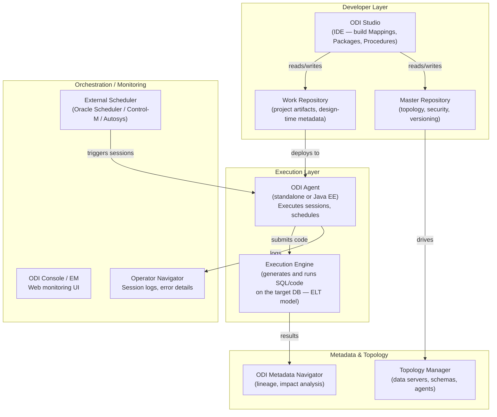
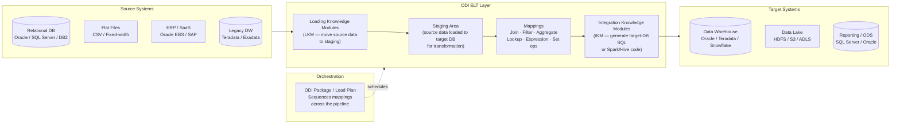

# Oracle Data Integrator (ODI) — SA Migration Guide

**Purpose:** Give a Solution Architect enough depth to assess an ODI estate, understand its moving parts, and map a migration path to Databricks.

This is not a developer guide. You won't be building ODI mappings. You will be walking customer sites, reviewing architecture diagrams, asking the right questions, and scoping what it takes to move to a modern lakehouse platform.

---

## Architecture Diagrams

### ODI Platform Architecture

How the ODI product suite fits together — from developer tooling through execution to operations.

<div class="zd-wrapper" id="odi-arch-zoom" style="position:relative; border:1px solid #ddd; border-radius:6px; overflow:hidden; background:#fafafa;">
<div style="position:absolute; top:8px; right:10px; z-index:10; display:flex; align-items:center; gap:8px; font-size:0.78rem; color:#666;">
  <span>Scroll to zoom · Drag to pan</span>
  <button onclick="zdReset('odi-arch-zoom')" style="padding:2px 8px; font-size:0.75rem; border:1px solid #ccc; border-radius:4px; background:#fff; cursor:pointer;">Reset</button>
</div>
<div class="zd-canvas" style="cursor:grab; user-select:none;">



</div>
</div>

---

### ODI as ETL — Data Flow Between Systems

How ODI sits between source systems and targets in a typical enterprise pipeline.

<div class="zd-wrapper" id="odi-flow-zoom" style="position:relative; border:1px solid #ddd; border-radius:6px; overflow:hidden; background:#fafafa;">
<div style="position:absolute; top:8px; right:10px; z-index:10; display:flex; align-items:center; gap:8px; font-size:0.78rem; color:#666;">
  <span>Scroll to zoom · Drag to pan</span>
  <button onclick="zdReset('odi-flow-zoom')" style="padding:2px 8px; font-size:0.75rem; border:1px solid #ccc; border-radius:4px; background:#fff; cursor:pointer;">Reset</button>
</div>
<div class="zd-canvas" style="cursor:grab; user-select:none;">



</div>
</div>

<script>
(function(){
  window.zdReset=window.zdReset||function(id){var w=document.getElementById(id);if(!w)return;var c=w.querySelector('.zd-canvas');if(c){c._s=1;c._tx=0;c._ty=0;}var s=w.querySelector('svg');if(s){s.style.transform='translate(0,0) scale(1)';s.style.transformOrigin='0 0';}};
  function initC(c){if(c._zdInit)return;c._zdInit=true;c._s=1;c._tx=0;c._ty=0;var dr=false,sx,sy,stx,sty;function ap(sv){sv.style.transform='translate('+c._tx+'px,'+c._ty+'px) scale('+c._s+')';sv.style.transformOrigin='0 0';sv.style.display='block';}c.addEventListener('wheel',function(e){var sv=c.querySelector('svg');if(!sv)return;e.preventDefault();var r=c.getBoundingClientRect(),mx=e.clientX-r.left,my=e.clientY-r.top,d=e.deltaY<0?1.12:1/1.12,ns=Math.min(5,Math.max(0.4,c._s*d));c._tx=mx-(mx-c._tx)*(ns/c._s);c._ty=my-(my-c._ty)*(ns/c._s);c._s=ns;ap(sv);},{passive:false});c.addEventListener('mousedown',function(e){if(e.button)return;dr=true;sx=e.clientX;sy=e.clientY;stx=c._tx;sty=c._ty;c.style.cursor='grabbing';e.preventDefault();});window.addEventListener('mousemove',function(e){if(!dr)return;c._tx=stx+(e.clientX-sx);c._ty=sty+(e.clientY-sy);var sv=c.querySelector('svg');if(sv)ap(sv);});window.addEventListener('mouseup',function(){if(dr){dr=false;c.style.cursor='grab';}});c.addEventListener('touchstart',function(e){if(e.touches.length===1){dr=true;sx=e.touches[0].clientX;sy=e.touches[0].clientY;stx=c._tx;sty=c._ty;}},{passive:true});c.addEventListener('touchmove',function(e){if(dr&&e.touches.length===1){c._tx=stx+(e.touches[0].clientX-sx);c._ty=sty+(e.touches[0].clientY-sy);var sv=c.querySelector('svg');if(sv)ap(sv);}},{passive:true});c.addEventListener('touchend',function(){dr=false;});}
  function tryW(w){var c=w.querySelector('.zd-canvas');if(!c)return;var sv=c.querySelector('svg');if(!sv){setTimeout(function(){tryW(w);},200);return;}initC(c);}
  function initAll(){document.querySelectorAll('.zd-wrapper').forEach(function(w){tryW(w);});}
  if(document.readyState==='loading'){document.addEventListener('DOMContentLoaded',function(){setTimeout(initAll,600);});}else{setTimeout(initAll,600);}
})();
</script>

---

## Sections

1. [Ecosystem Overview](#1-ecosystem-overview)
2. [Mappings — The Core Building Block](#2-mappings--the-core-building-block)
3. [Data Formats and Schema](#3-data-formats-and-schema)
4. [Parallelism and Scaling Model](#4-parallelism-and-scaling-model)
5. [Project Structure and Version Control](#5-project-structure-and-version-control)
6. [Orchestration: Packages and Load Plans](#6-orchestration-packages-and-load-plans)
7. [Metadata, Lineage, and Impact Analysis](#7-metadata-lineage-and-impact-analysis)
8. [Data Quality with IQS and CKM](#8-data-quality-with-iqs-and-ckm)
9. [ODI File and Artifact Formats Reference](#9-odi-file-and-artifact-formats-reference)
10. [Migration Assessment and Artifact Inventory](#10-migration-assessment-and-artifact-inventory)
11. [Migration Mapping to Databricks](#11-migration-mapping-to-databricks)

---

## 1. Ecosystem Overview

### What Is Oracle Data Integrator?

Oracle Data Integrator is an **ELT (Extract-Load-Transform)** platform — distinct from traditional ETL tools. Instead of transforming data inside a dedicated engine, ODI pushes the transformation logic **down to the target database**, generating and executing SQL (or Hive/Spark code) on the target system. The ODI agent is a lightweight orchestrator, not a data movement engine.

ODI has been an Oracle enterprise staple for 20+ years and appears heavily in Oracle-centric shops: Exadata, Oracle Data Warehouse, and Oracle EBS/E-Business Suite environments. Customers choose it because it integrates tightly with Oracle's ecosystem, leverages the power of the target database for transformation, and comes bundled with Oracle database and middleware licenses.

Unlike cloud-native ELT tools, ODI is:

- **On-premises first** — originally built for Oracle-on-prem; ODI on OCI is available but not widely adopted
- **Oracle ecosystem-dependent** — the ELT model shines on Oracle DB; heterogeneous environments require more KM customization
- **Repository-heavy** — everything is stored in Oracle database repositories (Master and Work), not files you can easily diff in Git
- **Knowledge Module (KM)-driven** — the logic that generates transformation code is modular but requires expertise to customize

### The ODI Product Suite

| Product / Component | What It Does | Migration Relevance |
|---------------------|-------------|---------------------|
| **ODI Studio** | Eclipse-based IDE — design Mappings, Packages, Procedures, Load Plans | High — all transformation and orchestration logic is authored here |
| **Master Repository** | Oracle DB schema storing topology (connections, agents), security, and versioning | High — source of truth for environment configuration |
| **Work Repository** | Oracle DB schema storing project artifacts — Mappings, Packages, models | High — the migration inventory is extracted from here |
| **ODI Agent (Standalone)** | Java process that executes sessions and manages scheduling | High — replaced by Databricks cluster + Workflows |
| **ODI Agent (Java EE / JEE)** | Deployed in WebLogic for high-availability execution | Medium — architecture dependency to document |
| **ODI Console** | Web UI for runtime monitoring and operations | Low — maps to Databricks Workflows UI |
| **Operator Navigator** | Session log viewer, error drill-down | Low — maps to Databricks job run details |
| **ODI Metadata Navigator** | Web-based lineage and impact analysis browser | Medium — use during inventory; maps to Unity Catalog lineage |
| **Oracle Data Quality (ODQ / IQS)** | Separate Oracle product for data profiling and quality | Medium — not always deployed alongside ODI |

> **SA Tip:** Many customers use ODI under an Oracle Technology Network or Oracle Database license that bundles it — they may not know what they're paying for it specifically. Before leading with cost savings, confirm whether ODI is a line-item purchase or bundled. If it's bundled, the conversation shifts to talent and agility.

### Why Customers Want to Migrate

| Driver | What It Means for the Engagement |
|--------|----------------------------------|
| **Oracle cost reduction** | Board-level "get off Oracle" mandate — ODI is caught in the broader Oracle exit |
| **Target database migration** | Moving the DW from Oracle/Teradata to Databricks makes the ELT model moot |
| **Talent scarcity** | ODI developers are a niche skill; customers want Python and SQL |
| **Cloud strategy** | ODI's on-prem agent model doesn't fit cloud-native pipelines |
| **Speed of delivery** | GUI-driven development, no native Git, slow release cycles |

> **SA Tip:** ODI migrations are almost never standalone. They're almost always part of a broader Oracle database exit or data warehouse modernization. Find out what the **target database was** — if it was Oracle Exadata, the ELT-to-database SQL is the entire transformation layer. Moving off Oracle means those SQL transforms need to be rethought, not just rehosted.

### Key Discovery Questions

1. How many **Mappings are in active production** use? (ODI repos contain a lot of draft and obsolete objects)
2. What **databases are source and target**? If the target was Oracle, the ELT SQL may use Oracle-specific functions that don't port cleanly.
3. Are **Knowledge Modules standard or customized**? Custom KMs represent proprietary logic that must be reverse-engineered.
4. Is orchestration done via **ODI Packages, Load Plans, or an external scheduler** (Control-M, Oracle Scheduler)?
5. Are there **ODI Procedures** that invoke shell scripts, SQL scripts, or OS commands?
6. Is **ODI Data Quality / IQS** deployed alongside ODI, or is data quality handled elsewhere?
7. How is **version control** managed? (ODI has its own internal versioning — most teams don't use external Git)
8. What are the **SLAs** and batch windows for critical load jobs?

---

## 2. Mappings — The Core Building Block

### The Mapping

In ODI, the **Mapping** is the primary unit of transformation logic — equivalent to a graph in Ab Initio, a Job in Talend, or a Mapping in Informatica. A Mapping defines how data moves from one or more sources through a series of transformation components to one or more targets.

Mappings are designed visually in ODI Studio. They define the **logical transformation** (what to do with data) separately from the **physical design** (which KM to use to execute it). This separation is central to ODI's architecture.

### Components Inside a Mapping

ODI 12c introduced a drag-and-drop component model. Each component on the Mapping canvas represents a transformation step:

| Component | What It Does | Databricks Equivalent |
|-----------|-------------|----------------------|
| **Datastore** | Source or target table/file bound to a Model | Delta table / external table |
| **Filter** | Removes rows based on a condition | `.filter()` / `WHERE` |
| **Join** | Merges two datasets on a key | `.join()` / `JOIN` |
| **Lookup** | Enriches records from a reference dataset | Broadcast join / dimension lookup |
| **Aggregate** | GROUP BY with expressions | `.groupBy().agg()` / `GROUP BY` |
| **Expression** | Derives a new column via an expression | `.withColumn()` / computed column |
| **Set** | UNION, INTERSECT, MINUS between datasets | `union()`, `intersect()`, `subtract()` |
| **Distinct** | Deduplicates records | `.distinct()` / `SELECT DISTINCT` |
| **Sort** | Orders output records | `.orderBy()` / `ORDER BY` |
| **Pivot / Unpivot** | Reshapes rows to columns or vice versa | `pivot()` / `stack()` |
| **Subquery Filter** | Semi-join or anti-join via subquery | `EXISTS` / anti-join |
| **Table Function** | Calls a database table function | Spark UDF / SQL function |
| **Jagged** | Handles hierarchical / XML source data | Nested JSON parsing in Spark |

### Physical and Logical Design

ODI separates every Mapping into two layers:

- **Logical design** — the transformation intent: joins, filters, expressions. Technology-agnostic.
- **Physical design** — the execution strategy: which KM to use, staging location, execution target.

> **SA Tip:** This separation is clever in theory but creates migration complexity in practice. The physical design holds crucial decisions — like whether staging happens in the source DB, the target DB, or a temporary schema. You must document both layers to understand what's actually happening at runtime.

### Interfaces (ODI 11g and Earlier)

Older ODI estates may use **Interfaces** instead of Mappings — the pre-12c equivalent. Interfaces are simpler (single target, less component variety) but follow the same logical/physical design split. If a customer is on ODI 11g, their primary artifact type is the Interface.

> **SA Tip:** Ask which version of ODI the customer is running. ODI 11g and ODI 12c have different repository schemas and different primary artifact types. Estates that were never upgraded from 11g have a higher migration risk because they carry more legacy patterns.

---

## 3. Data Formats and Schema

### ODI Models and Datastores

ODI describes its data sources and targets through **Models** and **Datastores** — ODI's metadata layer for understanding what data looks like.

| Concept | What It Is | Databricks Equivalent |
|---------|-----------|----------------------|
| **Model** | A logical grouping of Datastores corresponding to a technology (e.g., all tables in a schema) | Unity Catalog schema |
| **Datastore** | A single table, view, or file with its column definitions | Delta table / external table |
| **Logical Schema** | An abstraction over a physical schema — mappings reference logical schemas so physical connections can be swapped per environment | Databricks catalog / environment alias |
| **Physical Schema** | The actual database schema or file path behind a Logical Schema | Concrete catalog.schema.table path |
| **Column Metadata** | Field names, data types, lengths, keys, and constraints stored in the Work Repository | Delta schema / column metadata |

### Knowledge Modules (KMs)

KMs are the code generators at the heart of ODI. They are **templates that produce SQL or code** based on the Mapping's logical design. Every Mapping has at least two KMs attached to it:

| KM Type | What It Does |
|---------|-------------|
| **LKM (Loading KM)** | Moves source data to the staging area — generates INSERT/SELECT or bulk load code |
| **IKM (Integration KM)** | Transforms and integrates data into the target — generates the core transformation SQL |
| **CKM (Check KM)** | Enforces data quality constraints — generates SQL to find constraint violations |
| **JKM (Journalizing KM)** | Implements CDC (change data capture) — generates triggers or log table reads |
| **SKM (Service KM)** | Generates web service interfaces (rare, mostly legacy) |

> **SA Tip:** KMs come in standard (Oracle-provided) and custom flavors. Ask whether the customer has **modified any standard KMs or created custom KMs**. Custom KMs represent proprietary code-generation logic that has no analogue in Databricks — the transformation it generates must be reverse-engineered into native Spark/SQL.

### Data Type Considerations

ODI uses the source/target database's native data types directly. Migration risk comes from **Oracle-specific types**:

| Oracle Type | Notes | Databricks Migration |
|-------------|-------|---------------------|
| `NUMBER(p,s)` | Oracle's universal numeric type | `DECIMAL(p,s)` — straightforward |
| `VARCHAR2(n)` | Variable-length string | `STRING` |
| `DATE` | Oracle DATE includes time component | `TIMESTAMP` — common gotcha |
| `TIMESTAMP WITH TIME ZONE` | Timezone-aware | `TIMESTAMP` — timezone handling must be explicit |
| `CLOB / BLOB` | Large objects | `STRING` / `BINARY` — check if these are in mappings |
| `XMLType` | Oracle XML storage type | Needs explicit parsing in Spark |
| `ROWID` | Oracle internal row identifier | No equivalent — cannot be migrated |

> **SA Tip:** Oracle `DATE` silently includes hours, minutes, and seconds — it's equivalent to a `TIMESTAMP`. When customer data has `DATE` columns, Databricks `DateType` will truncate the time portion. This is a common data correctness bug post-migration that needs explicit handling.

---

## 4. Parallelism and Scaling Model

### ODI's ELT Approach to Performance

ODI does **not** have its own parallel execution engine. Performance comes from **pushing work to the target database** and letting that database's optimizer and parallel query execution handle it. The ODI agent is a thin orchestrator — it submits SQL and waits.

This is fundamentally different from Ab Initio, DataStage, or Informatica PowerCenter, all of which have their own parallel engines. In ODI, if the target is Oracle Exadata, you get Exadata's parallel query. If the target is a single-instance Oracle DB on a VM, you get that.

### Parallelism Mechanisms

| Mechanism | How It Works | Migration Consideration |
|-----------|-------------|------------------------|
| **Target DB parallelism** | ODI generates SQL with `PARALLEL` hints for Oracle — parallel query runs in the DB | Databricks Spark is parallel by default — this benefit transfers naturally |
| **IKM with staging** | Data staged in a temp table, then merged in one SQL statement | Rethink as a Spark transformation or DLT pipeline |
| **Multiple sessions** | ODI Packages can run multiple Mappings in parallel (concurrent steps) | Map to parallel Databricks Workflow tasks |
| **Partitioned sources** | Oracle partitioned tables read in parallel via the IKM | Databricks Delta handles partition pruning automatically |
| **CDC / Journalizing** | JKM-based incremental loads via change tables or triggers | Map to Databricks Delta CDC or DLT CDC patterns |

> **SA Tip:** In an Oracle-to-Oracle environment, ODI's performance story was "Oracle parallel query does the work." When the target moves to Databricks, Spark's distributed execution replaces Oracle's parallel query. The performance model is different but usually better for large-scale transforms — the key is right-sizing the cluster rather than tuning the SQL hints.

### Concurrent Session Limits

ODI Agents have a configurable **maximum number of concurrent sessions** — effectively how many Mappings can execute simultaneously. This is a key infrastructure parameter to capture during assessment:

- What is the max concurrent session limit per agent?
- How many agents are deployed?
- Are agents load-balanced or do specific mappings pin to specific agents?

---

## 5. Project Structure and Version Control

### ODI's Repository Model

Everything in ODI lives in two Oracle database schemas:

| Repository | Contents |
|------------|---------|
| **Master Repository** | Topology (connections, agents, contexts), security (users, profiles), global versioning, solution export history |
| **Work Repository** | All project artifacts — Projects, Folders, Models, Mappings, Packages, Load Plans, Procedures, Variables, Sequences |

There is no file system to browse. All artifacts are database rows. This is the single biggest challenge for migration assessment — **you cannot simply look at a directory**.

### Project Organization

Within a Work Repository, artifacts are organized as:

```
Work Repository
 └── Project: Finance_DW_Load
       ├── Folder: Customer_Domain
       │     ├── Mapping: MAP_CUSTOMER_LOAD
       │     ├── Mapping: MAP_CUSTOMER_DIM
       │     └── Package: PKG_CUSTOMER_NIGHTLY
       ├── Folder: Product_Domain
       │     ├── Mapping: MAP_PRODUCT_LOAD
       │     └── Load Plan: LP_PRODUCT_FULL
       └── Global Objects (Variables, Sequences, User Functions)
```

| Concept | What It Is | Databricks Equivalent |
|---------|-----------|----------------------|
| **Project** | Top-level grouping of all related ETL objects | Databricks workspace folder / Repos folder |
| **Folder** | Sub-grouping within a project, usually by domain or subject area | Sub-folder in Repos |
| **Mapping** | Single transformation unit (the ETL job) | Databricks notebook / DLT pipeline |
| **Package** | Orchestration workflow — sequences steps, handles branching | Databricks Workflow |
| **Load Plan** | Advanced orchestration — parallel steps, exception handling, restart | Databricks Workflow with complex dependencies |
| **Procedure** | Raw SQL or OS command steps not built as a Mapping | Databricks notebook with `%sql` / shell script |
| **Variable** | Scalar value used across mappings and packages (dates, flags, counts) | Databricks Workflow parameter / widget |
| **Sequence** | Auto-incrementing surrogate key generator | Delta `IDENTITY` column / `uuid()` |

### Version Control

ODI has internal versioning via **ODI Solutions** — a snapshot mechanism that bundles a set of objects into a versioned, exportable package. This is not Git. There is no branching, no pull request workflow, no diff tooling.

Mature customers export ODI objects as `.xml` files and store them in SVN or Git, but this is a manual process and rarely done consistently.

> **SA Tip:** Assume most ODI estates do not have reliable version control outside the repository itself. The migration is an opportunity to introduce proper Git-based CI/CD with Databricks Asset Bundles. Frame this as a process improvement, not just a tool swap.

### Environment Promotion

ODI uses **Contexts** to manage environment differences (DEV, QA, PROD). A Context maps Logical Schemas to Physical Schemas — the same Mapping runs against different databases/schemas in different environments by switching the Context.

```
Logical Schema: "DWH_TARGET"
  → DEV Context  → oracle-dev.DWH_DEV
  → QA Context   → oracle-qa.DWH_QA
  → PROD Context → oracle-prod.DWH_PROD
```

This maps to Databricks environment isolation via catalog names or workspace-per-environment.

---

## 6. Orchestration: Packages and Load Plans

### Packages — Basic Orchestration

A **Package** is the primary orchestration unit in ODI. It sequences a series of steps — Mappings, Procedures, Variables, OS commands — into a workflow with conditional branching based on success or failure.

| Package Concept | Description | Databricks Equivalent |
|----------------|-------------|----------------------|
| **Step** | A single execution unit (Mapping, Procedure, Variable refresh) | Databricks Workflow Task |
| **On Success** | Next step if this step succeeds | Task success dependency |
| **On Failure** | Next step or error handler if this step fails | `on_failure` task / notification |
| **Variable step** | Evaluate or refresh a Variable value mid-flow | Widget / parameter task |
| **OS Command step** | Run a shell command or external script | Databricks notebook with `%sh` or cluster init script |

### Load Plans — Advanced Orchestration

**Load Plans** were introduced in ODI 12c as a more powerful orchestration layer. They add:

- **Parallel Steps** — multiple steps genuinely execute concurrently (unlike Package steps which are sequential)
- **Serial and Parallel Step Groups** — mix of ordered and unordered execution
- **Exception Handling** — explicit exception steps that run on failure
- **Restartability** — failed runs can be restarted from the point of failure
- **Hierarchical structure** — nested step groups with independent parallelism

> **SA Tip:** Load Plans are the ODI equivalent of a Databricks Workflow with multiple parallel task groups. They are more complex than Packages and require more careful analysis during inventory. If the customer uses Load Plans heavily, the orchestration migration is non-trivial.

### External Schedulers

Most enterprise ODI environments do not schedule sessions directly from ODI — they rely on an **external scheduler** (Oracle Enterprise Scheduler, Oracle DBMS_SCHEDULER, Control-M, Autosys) to trigger ODI sessions via command-line `OdiStartScen` or REST API.

| Scheduler | Integration Method |
|-----------|-------------------|
| **Oracle DBMS_SCHEDULER** | Calls `OdiStartScen` or the ODI REST API |
| **Oracle Enterprise Scheduler (ESS)** | Native integration for Oracle Cloud environments |
| **Control-M / Autosys / TWS** | Calls `OdiStartScen` via OS command |

> **Migration relevance:** If an external scheduler orchestrates ODI at the top level, the migration has two layers: replace ODI Packages/Load Plans with Databricks Workflows, and repoint the external scheduler to trigger Databricks jobs. This is often underestimated.

### Monitoring

| ODI Feature | Databricks Equivalent |
|-------------|----------------------|
| Operator Navigator (session logs) | Databricks Workflow run history + task logs |
| Session error detail (bad rows written to E$ tables) | DLT quarantine table / expectation failure logs |
| Variable history log | Databricks Workflow parameter history |
| Agent status | Cluster health / Workflow alerts |

---

## 7. Metadata, Lineage, and Impact Analysis

### What the Work Repository Tracks

The Work Repository is a complete metadata store — every relationship between artifacts is captured as database rows. This is the foundation for inventory and impact analysis.

| Relationship Type | Example |
|-------------------|---------|
| Mapping uses Datastore | `MAP_CUSTOMER_LOAD` reads from `SRC_CUSTOMER` |
| Mapping writes to Datastore | `MAP_CUSTOMER_LOAD` writes to `DWH_CUSTOMER_DIM` |
| Package runs Mapping | `PKG_CUSTOMER_NIGHTLY` executes `MAP_CUSTOMER_LOAD` |
| Load Plan contains Package | `LP_NIGHTLY_DWH` runs `PKG_CUSTOMER_NIGHTLY` |
| Mapping uses Variable | `MAP_CUSTOMER_LOAD` reads `VAR_LOAD_DATE` |
| Mapping uses User Function | `MAP_CUSTOMER_LOAD` calls `FN_CLEAN_ADDRESS` |

### Accessing Metadata for Inventory

ODI metadata lives in the Work Repository Oracle schema and can be queried directly via SQL. Oracle provides a documented repository schema, and ODI Studio's **Metadata Navigator** offers a web UI for impact analysis.

Key tables/views for inventory:

| Repository Object | What to Query |
|-------------------|--------------|
| `SNP_POP` | Mappings (Interfaces in 11g) — count, names, last modified |
| `SNP_PACKAGE` | Packages — count, names, associated project |
| `SNP_LOADPLAN` | Load Plans |
| `SNP_TABLE` | Datastores (source/target tables) |
| `SNP_MODEL` | Models (schema groupings) |
| `SNP_SCENARIO` | Generated Scenarios (deployed execution units) |
| `SNP_SESSION` | Historical session execution logs |

> **SA Tip:** The `SNP_SESSION` table is gold for identifying active-vs-dead mappings. Filter for sessions in the last 90 days to find what's truly in production. A large ODI repository will have hundreds of mappings — a 90-day session filter typically cuts that to 30–50% active.

### Scenarios — The Deployed Execution Unit

A key ODI concept is the **Scenario** — a compiled, executable snapshot of a Mapping or Package. When you deploy ODI to production, you deploy Scenarios, not the source Mapping objects.

| Concept | What It Is | Migration Note |
|---------|-----------|----------------|
| **Scenario** | A generated, versioned execution artifact from a Mapping or Package | Analogous to a compiled artifact — document version in use |
| **Scenario version** | Multiple versions can coexist — the scheduler calls a specific version | Ensure you inventory the version in active use, not just the latest design |

> **SA Tip:** Scenario versions can diverge from the underlying Mapping if regeneration wasn't done after a change. Always confirm which Scenario version is running in production and compare it to the current Mapping design — they may not match.

### Data Lineage

ODI Metadata Navigator provides field-level lineage — tracing source columns through expressions to target columns. Coverage depends on how well Datastores are modeled.

Common lineage gaps:

- Procedures that execute raw SQL (lineage breaks at the Procedure boundary)
- Datastores sourced from external files where the file schema wasn't modeled in ODI
- Variables that drive dynamic SQL in Procedures — lineage is effectively invisible

---

## 8. Data Quality with IQS and CKM

### ODI's Data Quality Approach

ODI's data quality model has two separate mechanisms:

1. **CKM (Check Knowledge Modules)** — embedded in Mappings, generate SQL to detect constraint violations and route bad records to error tables
2. **Oracle Data Quality / IQS (Informatica Quality Service predecessor acquired by Oracle)** — a separate Oracle product that provides profiling and cleansing; often not deployed alongside ODI

### CKM: Inline Constraint Checking

When a Mapping runs with CKM enabled, ODI generates SQL to validate records against **Datastore constraints** (keys, NOT NULL, check constraints, referential integrity) before or after loading them into the target.

Bad records are routed to **E$ (Error) tables** — staging tables in the target schema prefixed with `E$_`:

| CKM Concept | What It Does | Databricks Equivalent |
|-------------|-------------|----------------------|
| **Constraint** | NOT NULL, UNIQUE, FK, CHECK defined on a Datastore | Delta table constraints / `expect()` in DLT |
| **E$ Error table** | Staging table where rejected records land with error reason | DLT quarantine table / error dataset |
| **Flow Control** | Checks records before writing to target | DLT `expect_or_drop()` |
| **Static Control** | Checks data already in the target table | `CHECK CONSTRAINT` on Delta / data quality scan job |

> **SA Tip:** E$ error tables are critical migration artifacts. Ask the customer how they monitor E$ tables day-to-day — if they have active monitoring, those checks are business rules that must be replicated in Databricks as DLT expectations or Great Expectations tests.

### IQS / Oracle Data Quality (When Present)

If the customer has Oracle IQS deployed, it typically handles address standardization, deduplication, and profiling — more sophisticated than CKM. Ask specifically whether IQS connectors or IQS cleansing steps appear in their Mappings. If they do, the migration must address this separately — there is no direct Databricks equivalent; customers typically evaluate Databricks DQE or third-party data quality tools.

---

## 9. ODI File and Artifact Formats Reference

When you assess an ODI estate, most artifacts live in the Oracle database repository. However, there are file-system artifacts you will also encounter in project directories and export packages.

---

### ODI Export XML (`.xml`)

The primary file format for ODI artifact portability. Any ODI object — a single Mapping, a whole Project, a Master Repository snapshot — can be exported as an XML file.

| Property | Detail |
|----------|--------|
| **Created by** | ODI Studio (File → Export) or Smart Export; also generated by CI/CD scripts |
| **Stored in** | Project file share, SVN/Git repository, or deployment packages |
| **Contains** | Complete definition of one or more ODI objects — Mappings, Packages, Models, KMs, Variables — in Oracle's proprietary XML schema |
| **Human-readable?** | Technically yes (XML), but verbose and not meant to be read or edited by hand |
| **Migration target** | Source of truth for artifact inventory if Work Repository is unavailable; parsed to understand Mapping structure |

> **SA Tip:** If a customer has a disciplined export process, XML exports are the easiest way to do offline analysis. If not, you'll need direct database access to the Work Repository. Try to get both — repository access for querying metadata at scale, and XML exports for deep-diving into individual Mapping logic.

---

### ODI Scenario Export (`.xml` — Scenario)

Scenarios are generated, versioned execution artifacts. When exported, they have the same XML format as other ODI objects but contain the **generated SQL/code** rather than the logical Mapping design.

| Property | Detail |
|----------|--------|
| **Created by** | ODI Studio (Generate Scenario) — a compilation step the developer must run |
| **Stored in** | Work Repository (database); exported to file as XML for deployment |
| **Contains** | Pre-generated SQL statements, OS commands, and step orchestration for one version of a Mapping or Package |
| **Human-readable?** | XML wrapper around generated SQL — the SQL is readable; the wrapper is verbose |
| **Migration target** | Compare against the parent Mapping to confirm version alignment; the generated SQL is useful for understanding what actually runs in production |

> **SA Tip:** Pull the generated SQL from active production Scenarios during inventory. This is what the database actually executes — and for Oracle-to-Oracle environments, it will contain Oracle-specific syntax (`MERGE`, `PARALLEL` hints, `CONNECT BY` hierarchical queries) that requires rewriting for Databricks.

---

### Knowledge Module (`.xml` — KM)

KMs are code templates stored as XML files (standard KMs ship with ODI; custom KMs are managed by the customer). They define the code generation logic — what SQL or code pattern gets produced for a given type of source/target combination.

| Property | Detail |
|----------|--------|
| **Created by** | Oracle (standard KMs) or customer developers (custom KMs) |
| **Stored in** | Master Repository (database); shipped as `.xml` files in the ODI installation |
| **Contains** | Groovy/Oracle template code with substitution variables — the instructions for generating LKM/IKM/CKM/JKM SQL |
| **Human-readable?** | Yes — Groovy template syntax is readable if you know it |
| **Migration target** | Standard KMs have no equivalent — their generated output (SQL) is what migrates. Custom KMs must be analyzed to understand the proprietary logic they encode. |

> **SA Tip:** The most dangerous discovery in an ODI engagement is highly customized KMs that encode complex loading patterns (multi-table inserts, custom CDC logic, Oracle-specific merge patterns). These represent significant migration effort — treat each custom KM as a bespoke development artifact that needs individual analysis.

---

### ODI Smart Export (`.xml` — Smart Export Bundle)

A "Smart Export" bundles a set of related ODI objects — automatically including dependencies (Datastores, Models, Variables referenced by the selected objects).

| Property | Detail |
|----------|--------|
| **Created by** | ODI Studio — Smart Export wizard |
| **Stored in** | File system — typically used for deployment or migration packages |
| **Contains** | Multiple inter-related ODI objects in a single XML file, dependency-resolved |
| **Human-readable?** | XML, verbose, not practically readable by hand |
| **Migration target** | Preferred format for artifact extraction — use to pull complete Mapping + dependencies in one step |

> **SA Tip:** Smart Export is the best way to extract a complete Mapping and all its dependencies for offline review. Ask the ODI team to generate Smart Exports for the top 20 production Mappings — these give you enough material to assess complexity and scope migration effort without needing live repository access.

---

### ODI Solution (`.xml` — Version Snapshot)

An ODI Solution is an internal version-control snapshot — a named bundle of objects at a point in time.

| Property | Detail |
|----------|--------|
| **Created by** | ODI Studio — Solutions Navigator |
| **Stored in** | Master Repository |
| **Contains** | Version history of selected objects — metadata snapshot, not full artifact export |
| **Human-readable?** | XML, but primarily useful only through ODI Studio |
| **Migration target** | Low migration value — use for change history context only |

---

### Topology Configuration Export (`.xml` — Topology)

The Master Repository's topology — all data server connections, physical and logical schemas, agent definitions — can be exported.

| Property | Detail |
|----------|--------|
| **Created by** | ODI Studio — Topology Manager export |
| **Stored in** | File system (deployment artifact) |
| **Contains** | All connection strings, schema mappings, agent host/port configurations, Context definitions |
| **Human-readable?** | XML |
| **Migration target** | Essential for migration — maps to Databricks secrets, Unity Catalog external locations, and Workflow connection parameters |

> **SA Tip:** The Topology export reveals all source and target connections — databases, file servers, FTP endpoints. This is your map of everything ODI touches. Collect this early; it drives the data source inventory and access requirements for the migration environment.

---

### Quick-Reference Summary Table

| Artifact | Extension | Created By | Stored In | Human-Readable? | Migration Target |
|----------|-----------|-----------|-----------|-----------------|-----------------|
| Mapping / Interface export | `.xml` | ODI Studio | File system / Repo | Verbose XML | Core migration unit — 1:1 with Databricks pipeline |
| Scenario export | `.xml` | ODI Studio (Generate) | Work Repository / file | XML + readable SQL | Extract generated SQL for analysis |
| Knowledge Module | `.xml` | Oracle / Dev | Master Repository | Yes (Groovy template) | Generated SQL migrates; custom KMs need analysis |
| Smart Export bundle | `.xml` | ODI Studio | File system | Verbose XML | Best format for dependency-complete artifact extraction |
| ODI Solution | `.xml` | ODI Studio | Master Repository | XML (ODI UI only) | Version history context only |
| Topology export | `.xml` | Topology Manager | File system | XML | Maps to Databricks connection secrets + UC external locations |

---

## 10. Migration Assessment and Artifact Inventory

### Getting the Inventory

Because ODI stores everything in a database, the fastest inventory path is **direct SQL queries on the Work Repository**. Get a read-only database account and run queries against the key tables.

**Suggested inventory queries:**

```sql
-- Count active Mappings (run in last 90 days)
SELECT COUNT(DISTINCT s.SCEN_NAME)
FROM SNP_SESSION s
WHERE s.SESS_BEG > SYSDATE - 90;

-- Mapping count by Project and Folder
SELECT p.PROJ_NAME, f.FOLD_NAME, COUNT(*) AS mapping_count
FROM SNP_POP m
JOIN SNP_FOLDER f ON m.I_FOLD = f.I_FOLD
JOIN SNP_PROJECT p ON f.I_PROJECT = p.I_PROJECT
GROUP BY p.PROJ_NAME, f.FOLD_NAME
ORDER BY mapping_count DESC;

-- Custom KMs (non-Oracle-provided)
SELECT KM_NAME, KM_TYPE, CREA_DATE, UPDT_DATE
FROM SNP_KM
WHERE CREA_USER != 'SUPERVISOR'
ORDER BY KM_TYPE, KM_NAME;
```

### Complexity Scoring

Score each Mapping on two axes: **technical complexity** and **business criticality**.

**Technical Complexity Factors:**

| Factor | Low (1) | Medium (2) | High (3) |
|--------|---------|-----------|---------|
| Component count | < 10 | 10–25 | > 25 |
| Source count | 1 | 2–3 | 4+ |
| Custom KM usage | None | 1 standard custom KM | Multiple or complex custom KMs |
| Oracle-specific SQL in Procedures | None | Simple SQL | `CONNECT BY`, `MERGE`, `MODEL` clause, analytic functions |
| CDC / Journalizing | None | Standard JKM | Custom CDC logic |
| Variables / dynamic SQL | None | Simple variables | Dynamic SQL in Procedures |
| E$ error handling | None | Standard CKM | Custom error routing logic |

**Business Criticality Factors:**

| Factor | Low | Medium | High |
|--------|-----|--------|------|
| Run frequency | Monthly / ad-hoc | Daily | Multiple times per day |
| Downstream consumers | Internal reporting | Multiple internal systems | Revenue-critical / regulatory |
| SLA | None | Best effort | Hard SLA with financial penalty |

### Risk Areas Specific to ODI

| Risk Area | Why It's Risky | Mitigation |
|-----------|---------------|-----------|
| **Custom KMs** | Encode proprietary code-generation logic with no Databricks analogue | Reverse-engineer generated SQL from Scenarios; treat as bespoke development |
| **Oracle-specific SQL** | `CONNECT BY`, `MODEL`, `MERGE`, analytical functions may not have direct Spark equivalents | Review Scenario-generated SQL during inventory; flag for rewrite |
| **Oracle `DATE` vs. `TIMESTAMP`** | Time-of-day data will be lost if mapped to Databricks `DateType` | Audit all date columns in Datastores; mandate `TIMESTAMP` mapping |
| **ELT-to-ETL shift** | ODI relied on Oracle parallel SQL; Databricks requires Spark code | Right-sizing the cluster and re-expressing SQL as Spark is unavoidable |
| **Procedure-heavy estates** | Procedures are raw SQL/OS commands — opaque to lineage tools | Manually review every Procedure; document inputs, outputs, side effects |
| **IQS data quality** | No direct Databricks equivalent | Evaluate Databricks DQE, dbt tests, or Great Expectations as replacements |
| **Scenario version drift** | Production may be running a Scenario that no longer matches the current Mapping design | Compare Scenario generation date to last Mapping modification date |
| **External scheduler coupling** | ODI sessions triggered by Control-M / Oracle Scheduler — two systems must be migrated | Map all external scheduler jobs that invoke ODI and plan Databricks Workflows replacement in parallel |

### Inventory Checklist

- [ ] Total Mapping count by Project and Folder
- [ ] Active Mapping count (sessions in last 90 days)
- [ ] Package and Load Plan count
- [ ] Procedure count (especially those with raw SQL or OS commands)
- [ ] Custom KM inventory (name, type, usage count across Mappings)
- [ ] Variable inventory (global vs. project-scoped)
- [ ] Source and target Datastore count by technology
- [ ] Oracle-specific syntax in generated Scenarios (scan for `CONNECT BY`, `MODEL`, `MERGE`)
- [ ] E$ error table usage — which Mappings use CKM
- [ ] External scheduler dependency map (which scheduler triggers which sessions)
- [ ] Topology export — all connection strings and schema mappings

---

## 11. Migration Mapping to Databricks

### Building Blocks

| ODI Concept | Databricks Equivalent | Notes |
|-------------|----------------------|-------|
| Mapping (12c) | Databricks notebook / DLT pipeline / dbt model | 1:1 migration unit; complexity varies by component count |
| Interface (11g) | Databricks notebook / DLT pipeline | Simpler than 12c Mappings; single-target |
| Procedure | Databricks notebook (`%sql`, `%sh`) | Review for Oracle-specific SQL |
| Variable | Databricks Workflow parameter / widget | Scoping (global vs. project) maps to job vs. notebook scope |
| Sequence | Delta `IDENTITY` column / `uuid()` | Surrogate key generation |
| User Function | SQL UDF in Unity Catalog / PySpark UDF | Register in Unity Catalog for shared use |

### Components and Transforms

| ODI Component | Databricks / Spark Equivalent |
|---------------|-------------------------------|
| Filter | `.filter()` / `WHERE` clause in DLT |
| Join | `.join()` / DLT join logic |
| Lookup | Broadcast join / dimension lookup in DLT |
| Aggregate | `.groupBy().agg()` / `GROUP BY` |
| Expression (derived column) | `.withColumn()` / computed column |
| Set (UNION / INTERSECT) | `union()`, `intersect()`, `subtract()` |
| Distinct | `.distinct()` |
| Sort | `.orderBy()` — note: sort without limit is discouraged in streaming |
| Pivot / Unpivot | `pivot()` / `stack()` |
| Jagged (XML / hierarchical) | `from_json()`, `explode()`, schema inference |

### Orchestration

| ODI Concept | Databricks Equivalent |
|-------------|----------------------|
| Package | Databricks Workflow (linear or branching tasks) |
| Load Plan (parallel groups) | Databricks Workflow with parallel task clusters |
| On Success / On Failure branching | Databricks Workflow `if_else` task |
| OS Command step | Databricks notebook `%sh` or cluster init |
| Variable evaluation step | Databricks Workflow parameter task or Python task |
| External scheduler trigger | Databricks Jobs API (REST) called from existing scheduler, or migrate to Databricks Workflow schedule |
| Session restart (Load Plan) | Databricks Workflow task repair / repair run |

### Governance

| ODI Concept | Databricks Equivalent |
|-------------|----------------------|
| Model / Datastore metadata | Unity Catalog table metadata |
| Logical Schema / Context | Unity Catalog catalog per environment, or catalog.schema aliasing |
| Topology (connection registry) | Databricks secrets + Unity Catalog external locations |
| ODI Metadata Navigator (lineage UI) | Unity Catalog lineage |
| ODI Solutions (versioning) | Git + Databricks Asset Bundles |
| Project / Folder structure | Databricks workspace folder hierarchy / Repos |

### Data Quality

| ODI Concept | Databricks Equivalent |
|-------------|----------------------|
| CKM constraint check | Delta table `CHECK CONSTRAINT` / DLT `expect()` |
| E$ error table | DLT quarantine table / error dataset |
| Flow Control (pre-load check) | DLT `expect_or_drop()` |
| Static Control (post-load check) | dbt test / Great Expectations suite |
| IQS profiling | Databricks DQE / open-source Great Expectations |
| IQS address cleansing | Third-party data quality tool or custom UDF |

---

### What Doesn't Map Cleanly

| ODI Capability | Why It Doesn't Map | Recommended Approach |
|----------------|-------------------|---------------------|
| **ELT push-down to Oracle** | ODI's performance model relies on Oracle doing the work; Databricks is a different execution engine | Rewrite transformations as Spark — performance is generally equivalent or better, but the code is different |
| **Custom Knowledge Modules** | KMs encode code-generation logic with no Databricks analogue | Reverse-engineer the generated SQL from Scenarios; implement as Spark or dbt; treat as custom development |
| **Oracle `CONNECT BY` (hierarchical queries)** | Oracle recursive tree traversal — no direct Spark SQL equivalent in all cases | Rewrite as recursive CTEs (`WITH RECURSIVE`) or iterative Spark DataFrame logic |
| **Oracle `MODEL` clause** | Oracle's spreadsheet-like row-to-row calculation syntax — not supported in Spark SQL | Rewrite as PySpark window functions or custom iterative logic |
| **JKM-based journalizing / CDC** | ODI CDC used Oracle trigger-based or redo log reading — Databricks CDC uses Delta change data feed or DLT CDC | Redesign CDC using Delta CDF or DLT `APPLY CHANGES INTO` |
| **IQS data quality and address parsing** | Oracle IQS has no direct Databricks equivalent | Evaluate Databricks DQE, dbt tests, or a third-party data quality platform |
| **Scenario version control** | ODI's internal versioning does not export to Git; history is not portable | Rebuild version history in Git from this point forward using Databricks Asset Bundles |
| **Context-based environment switching** | ODI Contexts elegantly swap connection targets per environment in one click | Implement via Databricks catalog-per-environment + Workflow parameter injection; requires explicit environment wiring |
| **Agent high-availability (JEE on WebLogic)** | ODI JEE agents ran in WebLogic clusters for HA | Databricks Workflows are cloud-managed and HA by default — no equivalent configuration needed |
