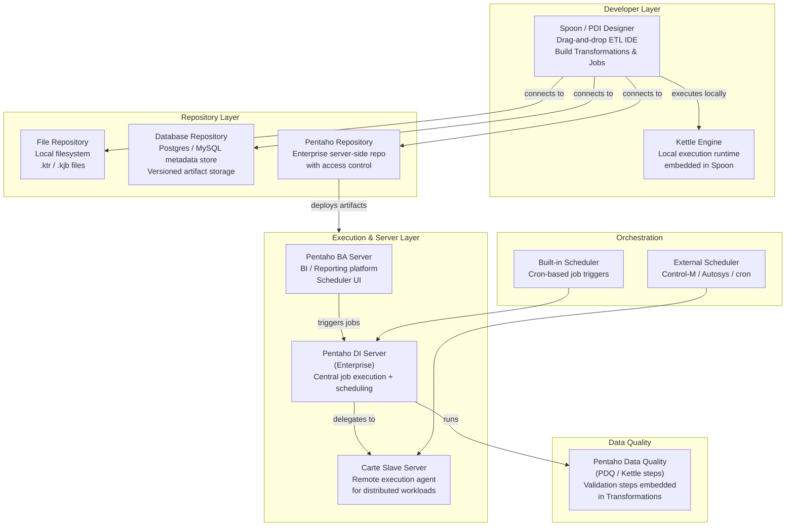
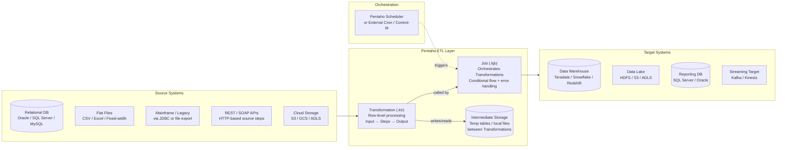

# Pentaho — SA Migration Guide

**Purpose:** Give a Solution Architect enough depth to assess a Pentaho estate, understand its moving parts, and map a migration path to Databricks.

This is not a developer guide. You won't be building Pentaho transformations. You will be walking customer sites, reviewing pipeline inventories, asking the right questions, and scoping what it takes to move to a modern lakehouse platform.

---

## Architecture Diagrams

### Pentaho Platform Architecture

How the Pentaho product suite fits together — from developer tooling through runtime execution to operations.

<div class="zd-wrapper" id="pent-arch-zoom" style="position:relative; border:1px solid #ddd; border-radius:6px; overflow:hidden; background:#fafafa;">
<div style="position:absolute; top:8px; right:10px; z-index:10; display:flex; align-items:center; gap:8px; font-size:0.78rem; color:#666;">
  <span>Scroll to zoom · Drag to pan</span>
  <button onclick="zdReset('pent-arch-zoom')" style="padding:2px 8px; font-size:0.75rem; border:1px solid #ccc; border-radius:4px; background:#fff; cursor:pointer;">Reset</button>
</div>
<div class="zd-canvas" style="cursor:grab; user-select:none;">



</div>
</div>

---

### Pentaho as ETL — Data Flow Between Systems

How Pentaho sits between source systems and targets in a typical enterprise data pipeline.

<div class="zd-wrapper" id="pent-flow-zoom" style="position:relative; border:1px solid #ddd; border-radius:6px; overflow:hidden; background:#fafafa;">
<div style="position:absolute; top:8px; right:10px; z-index:10; display:flex; align-items:center; gap:8px; font-size:0.78rem; color:#666;">
  <span>Scroll to zoom · Drag to pan</span>
  <button onclick="zdReset('pent-flow-zoom')" style="padding:2px 8px; font-size:0.75rem; border:1px solid #ccc; border-radius:4px; background:#fff; cursor:pointer;">Reset</button>
</div>
<div class="zd-canvas" style="cursor:grab; user-select:none;">



</div>
</div>

<script>
(function(){
  window.zdReset=window.zdReset||function(id){var w=document.getElementById(id);if(!w)return;var c=w.querySelector('.zd-canvas');if(c){c._s=1;c._tx=0;c._ty=0;}var s=w.querySelector('svg');if(s){s.style.transform='translate(0,0) scale(1)';s.style.transformOrigin='0 0';}};
  function initC(c){if(c._zdInit)return;c._zdInit=true;c._s=1;c._tx=0;c._ty=0;var dr=false,sx,sy,stx,sty;function ap(sv){sv.style.transform='translate('+c._tx+'px,'+c._ty+'px) scale('+c._s+')';sv.style.transformOrigin='0 0';sv.style.display='block';}c.addEventListener('wheel',function(e){var sv=c.querySelector('svg');if(!sv)return;e.preventDefault();var r=c.getBoundingClientRect(),mx=e.clientX-r.left,my=e.clientY-r.top,d=e.deltaY<0?1.12:1/1.12,ns=Math.min(5,Math.max(0.4,c._s*d));c._tx=mx-(mx-c._tx)*(ns/c._s);c._ty=my-(my-c._ty)*(ns/c._s);c._s=ns;ap(sv);},{passive:false});c.addEventListener('mousedown',function(e){if(e.button)return;dr=true;sx=e.clientX;sy=e.clientY;stx=c._tx;sty=c._ty;c.style.cursor='grabbing';e.preventDefault();});window.addEventListener('mousemove',function(e){if(!dr)return;c._tx=stx+(e.clientX-sx);c._ty=sty+(e.clientY-sy);var sv=c.querySelector('svg');if(sv)ap(sv);});window.addEventListener('mouseup',function(){if(dr){dr=false;c.style.cursor='grab';}});c.addEventListener('touchstart',function(e){if(e.touches.length===1){dr=true;sx=e.touches[0].clientX;sy=e.touches[0].clientY;stx=c._tx;sty=c._ty;}},{passive:true});c.addEventListener('touchmove',function(e){if(dr&&e.touches.length===1){c._tx=stx+(e.touches[0].clientX-sx);c._ty=sty+(e.touches[0].clientY-sy);var sv=c.querySelector('svg');if(sv)ap(sv);}},{passive:true});c.addEventListener('touchend',function(){dr=false;});}
  function tryW(w){var c=w.querySelector('.zd-canvas');if(!c)return;var sv=c.querySelector('svg');if(!sv){setTimeout(function(){tryW(w);},200);return;}initC(c);}
  function initAll(){document.querySelectorAll('.zd-wrapper').forEach(function(w){tryW(w);});}
  if(document.readyState==='loading'){document.addEventListener('DOMContentLoaded',function(){setTimeout(initAll,600);});}else{setTimeout(initAll,600);}
})();
</script>

---

## Sections

1. [Ecosystem Overview](#1-ecosystem-overview)
2. [Transformations and Jobs — The Core Building Blocks](#2-transformations-and-jobs--the-core-building-blocks)
3. [Data Formats and Schema](#3-data-formats-and-schema)
4. [Parallelism and Scaling Model](#4-parallelism-and-scaling-model)
5. [Project Structure and Version Control](#5-project-structure-and-version-control)
6. [Orchestration](#6-orchestration)
7. [Metadata, Lineage, and Impact Analysis](#7-metadata-lineage-and-impact-analysis)
8. [Data Quality](#8-data-quality)
9. [Pentaho File Formats Reference](#9-pentaho-file-formats-reference)
10. [Migration Assessment and Artifact Inventory](#10-migration-assessment-and-artifact-inventory)
11. [Migration Mapping to Databricks](#11-migration-mapping-to-databricks)

---

## 1. Ecosystem Overview

### What Is Pentaho?

Pentaho is an open-core data integration and analytics platform built around the **Kettle** engine (the open-source ETL runtime). Originally developed as an open-source project (Kettle / PDI — Pentaho Data Integration), it was acquired by Hitachi Vantara and rebranded as part of the broader Pentaho suite, which also includes a BI/reporting server.

Customers choose Pentaho because it is:

- **Open-core with a free Community Edition** — lower initial barrier than Ab Initio or Informatica, which drives wide adoption
- **Java-based and cross-platform** — runs anywhere a JVM runs; common in heterogeneous on-premises environments
- **Graphical and developer-friendly** — the Spoon IDE makes pipeline building approachable for a broad range of skill levels
- **Broad connector library** — hundreds of built-in connectors for databases, files, REST APIs, Hadoop, and cloud storage

In 2023, Hitachi Vantara transferred the open-source Pentaho/Kettle project to a new open-source community project called **Hop** (Apache Hop). Many customers may be on legacy Pentaho CE/EE versions, recent Hitachi Vantara Pentaho+, or migrating to Hop. Understand which variant you're dealing with.

### The Pentaho Product Suite

| Product | What It Does | Migration Relevance |
|---------|-------------|---------------------|
| **PDI / Spoon (Community)** | The open-source ETL designer — builds Transformations and Jobs | High — all transformation logic lives here |
| **Kettle Engine** | The execution runtime that runs `.ktr` and `.kjb` files | High — must be replicated or replaced |
| **Pentaho BA Server** | BI reporting platform + scheduler UI (Enterprise) | Medium — scheduler maps to Databricks Workflows |
| **Pentaho DI Server** | Centralized ETL execution server with a repository (Enterprise) | High — source of artifact inventory and scheduling |
| **Carte** | Lightweight slave server for distributed/remote execution | Medium — distributed execution model matters for right-sizing |
| **Pentaho Data Catalog** | Metadata management and lineage (Enterprise add-on) | Medium — maps to Unity Catalog |
| **Pentaho Data Quality (PDQ)** | Data profiling and quality rules | Medium — maps to DLT expectations or Great Expectations |

> **SA Tip:** Many Pentaho customers are on the **Community Edition** — free, no support contract, minimal governance tooling. This means artifact inventory is harder (no central server repository), and the migration conversation often begins because the customer has outgrown what CE can offer in terms of reliability, governance, and scale.

### Why Customers Want to Migrate

| Driver | What It Means for the Engagement |
|--------|----------------------------------|
| **Scale** | Kettle is single-node by default; large volumes require workarounds (Carte clustering, Spark execution) that are brittle |
| **Performance** | Customers hitting row-by-row processing limits — Pentaho doesn't natively leverage distributed compute |
| **Cost (Enterprise)** | Hitachi Vantara Enterprise licensing has increased; Community Edition has no SLA or support |
| **Cloud strategy** | On-prem Pentaho environments aren't cloud-native; customers want managed cloud ETL |
| **Governance gaps** | Community Edition has minimal lineage, auditing, or access control |
| **Talent** | Spoon/Kettle skills are becoming rarer as developers move to Python/Spark-native tools |

> **SA Tip:** When a customer says "Pentaho is too slow," probe whether they're running on CE with no clustering, or Enterprise with Carte slaves. The underlying issue is almost always single-node row processing — Databricks Spark fixes this architecturally, not just by tuning.

### Key Discovery Questions

Before scoping a migration, ask:

1. Are you on **Community Edition or Enterprise**? Is there a central DI Server repository, or are `.ktr`/`.kjb` files on developer laptops and shared drives?
2. How many Transformations and Jobs are in **active production** use? (vs. total files — Pentaho estates often have large amounts of dead or draft pipelines)
3. What is the typical **data volume** per pipeline — rows per run, GB per day?
4. What are the **source and target systems**? Are any sources legacy/mainframe, REST APIs, or cloud storage?
5. Are you using any **Big Data steps** — Hadoop, Spark, Kafka integration inside Pentaho?
6. How are jobs **scheduled and triggered** — built-in Pentaho scheduler, external scheduler (Control-M, cron), or manual?
7. Is the **Kettle repository a database repo or file-based**? If database: what metadata is tracked?
8. Are there custom **Java plugins or custom steps** developed in-house?
9. What does the **promotion process** look like — how do pipelines move from dev to prod?
10. What are the **SLAs** for critical batch jobs?

---

## 2. Transformations and Jobs — The Core Building Blocks

### The Transformation (.ktr)

The **Transformation** is the fundamental unit of data processing in Pentaho. It defines a row-level dataflow: data enters from sources, passes through a series of steps connected by hops, and exits to targets. Transformations are analogous to an Ab Initio graph or an Informatica mapping.

A Transformation runs inside the Kettle engine and processes data **row by row** (or in configurable row-set buffers). Steps within a Transformation run in **parallel threads** on a single JVM by default — not distributed across nodes.

> **SA Tip:** The single-JVM threading model is the core performance ceiling for Pentaho. Transformations scale up (more threads, more memory) but not out (across nodes) without Carte clustering or the Spark execution engine add-on. This is what breaks at enterprise data volumes.

### The Job (.kjb)

The **Job** is the orchestration layer. It defines the control flow between Transformations — sequencing, branching, error handling, and conditional logic. A Job does not process rows directly; it invokes Transformations (and other Jobs) as steps.

Jobs are the Pentaho equivalent of an Ab Initio Conduct>It plan or an Informatica Workflow.

**Key Job concepts:**

| Concept | Description | Databricks Equivalent |
|---------|-------------|----------------------|
| **Job Entry** | A single step in a Job — runs a Transformation, executes SQL, calls a script, sends email | Databricks Workflow Task |
| **Hop (unconditional)** | Executes the next entry regardless of success/failure | Unconditional task dependency |
| **Hop (on success)** | Only proceeds if the previous entry succeeded | Task dependency with success condition |
| **Hop (on failure)** | Proceeds only on failure — used for error/alert logic | `on_failure` task in Workflow |
| **Start entry** | The entry point of a Job | Workflow trigger |
| **Sub-job** | A Job that calls another Job as a step | Nested Workflow or `run_job_task` |

### Steps

A **step** is a single processing node inside a Transformation. Pentaho ships with hundreds of built-in steps across categories:

| Category | Example Steps | What They Do |
|----------|--------------|--------------|
| **Input** | Table Input, CSV File Input, Excel Input, REST Client | Read data from sources |
| **Output** | Table Output, Insert/Update, Text File Output | Write data to targets |
| **Transform** | Calculator, String Operations, Number Range, Replace in String | Field-level transformations |
| **Mapping / Join** | Stream Lookup, Merge Join, Join Rows | Lookup enrichment, dataset joins |
| **Scripting** | Modified JavaScript Value, User Defined Java Class, Execute SQL | Custom logic in JS or Java |
| **Filter & Route** | Filter Rows, Switch / Case, Multiway Merge Join | Conditional routing |
| **Aggregate** | Group By, Sorted Merge, Unique Rows | Aggregation and deduplication |
| **Hadoop / Big Data** | Hadoop File Output, HBase Output, Spark Submit | Big Data connectors |
| **Utility** | Add Sequence, Set Variables, Get Variables | Pipeline control utilities |

> **SA Tip:** The **Modified JavaScript Value** and **User Defined Java Class** steps are migration risk flags. They contain arbitrary logic that must be manually reviewed and rewritten — they don't translate to any automated tool. Count and catalog these during discovery.

### Hops and Row Sets

A **hop** is a connection between two steps in a Transformation. Hops carry a **row set** (a buffered queue of rows) from the output of one step to the input of another. Multiple steps can run concurrently in separate threads, with hops acting as the communication channel between them.

- Hops can be **enabled** or **disabled** at runtime — this is how conditional flow control is implemented inside Transformations
- A step with multiple incoming hops **merges** the rows by default (interleaved); this is different from a join

---

## 3. Data Formats and Schema

### How Pentaho Describes Data

Pentaho does not use a separate schema definition file (unlike Ab Initio's DML). Instead, schema is **inferred or defined inline at each step**:

- **Input steps** infer schema from the source (database column types, file headers, API response structure)
- **Transform steps** carry the schema forward, modified by each step's configuration
- **Metadata is embedded in the `.ktr` file** — the step configuration XML contains field names, types, lengths, and formats

This means there is no separate "schema catalog" to inventory — schema lives inside each Transformation file.

### Field Metadata per Step

Each step in a Transformation tracks the **row metadata** flowing through it:

| Metadata Property | Description | Migration Note |
|-------------------|-------------|----------------|
| **Field name** | Column name flowing through the step | Maps to column name in Databricks schema |
| **Type** | String, Number, Integer, BigNumber, Date, Boolean, Binary | Maps to PySpark/SQL types |
| **Format** | Date format string, number mask | Must be preserved during migration |
| **Length / Precision** | For strings and decimals | Important for data fidelity |
| **Currency / Decimal / Grouping** | Number formatting symbols | Locale-specific — migration risk |

### Intermediate Storage

Pentaho Transformations do not use a proprietary intermediate file format for intermediate data (unlike Ab Initio's MFS). Intermediate data lives in-memory row sets within the JVM. However, customers often use:

- **Temporary database tables** — written by one Transformation, read by the next
- **Flat files (CSV/text)** — written as intermediate handoff between Jobs
- **Hadoop/HDFS** — for Big Data pipelines using the Hadoop execution layer

> **SA Tip:** When you see Jobs that write to a temp table and then immediately read from it in the next Transformation, that's a classic Pentaho workaround for passing large datasets between pipeline stages. In Databricks this maps to a Delta table or a Delta Live Tables dataset — but the pattern itself is a migration inventory item.

### Proprietary Formats That Matter

| Format | Where It Appears | Migration Note |
|--------|-----------------|----------------|
| **`.ktr` (XML)** | Transformation definition | Human-readable XML — parseable for inventory |
| **`.kjb` (XML)** | Job definition | Human-readable XML — parseable for inventory |
| **Kettle DB repository tables** | `R_*` tables in a relational database | Queryable — source of truth for Enterprise estates |
| **`.properties` files** | Externalised variable values | Maps to Databricks Workflow parameters / Secrets |
| **`.kettle/kettle.properties`** | Global variable and connection configuration | Must be migrated to Databricks Secrets / config |

---

## 4. Parallelism and Scaling Model

### Default Single-Node Threading

By default, a Pentaho Transformation runs all its steps as **parallel threads within a single JVM**. Step A and Step B run concurrently, passing rows through an in-memory row buffer (the hop). The degree of parallelism is controlled by two settings:

- **Number of copies** of a step — a step can be instantiated N times to process rows in parallel (equivalent to a mini fan-out within the Transformation)
- **Row set buffer size** — controls how many rows are held in memory between steps

This model works well for moderate volumes but hits a ceiling when data exceeds available RAM or when processing time per row is high.

### Carte Clustering

For larger workloads, Pentaho Enterprise uses **Carte slave servers** to distribute a Transformation across multiple nodes. A **cluster schema** defines which Carte servers participate, and a **clustered step** runs a copy on each slave with the master coordinating data distribution.

| Concept | Description | Databricks Equivalent |
|---------|-------------|----------------------|
| **Carte slave server** | A remote execution agent running the Kettle engine | Databricks worker node |
| **Cluster schema** | Defines a named group of Carte servers | Databricks cluster configuration |
| **Clustered step** | A step that runs N copies across all Carte slaves | Spark stage with N partitions |
| **Data partitioning in cluster** | Round-robin or hash-based routing between slaves | Spark shuffle / repartition |
| **Master step** | Aggregates results from slaves | Spark driver aggregation |

> **SA Tip:** If a customer is using Carte clustering, ask how many slaves they have and what the network topology looks like. This tells you their current degree of parallelism and helps you right-size the Databricks cluster. More importantly, ask whether the clustering is stable — Carte is notoriously difficult to manage and is often the stated reason for migrating.

### Spark Execution Mode (Pentaho AEL / Adaptive Execution Layer)

Pentaho Enterprise introduced an **Adaptive Execution Layer (AEL)** that can run Transformations on a Spark cluster instead of the Kettle engine. This is architecturally significant for migration:

- If the customer is **already running on AEL/Spark**, the migration to Databricks is conceptually straightforward — they're already on Spark
- If they're on native Kettle, Databricks introduces distributed execution for the first time — a bigger architectural shift

> **SA Tip:** Ask directly: "Are any of your Transformations running on Spark via AEL?" If yes, identify which ones — those pipelines will migrate more cleanly than native Kettle pipelines.

---

## 5. Project Structure and Version Control

### File-Based vs. Repository-Based Estates

Pentaho estates come in two fundamentally different forms, and which one the customer has changes your inventory strategy:

| Estate Type | Description | Discovery Approach |
|-------------|-------------|-------------------|
| **File-based (CE common)** | `.ktr` and `.kjb` files stored on filesystems, often in Git or shared drives | Scan directories; parse XML files for dependencies |
| **Database repository (EE)** | Artifacts stored in `R_*` tables in a relational DB | Query `R_TRANSFORMATION`, `R_JOB`, `R_STEP` tables |
| **Pentaho DI Server repository** | Enterprise server repository with access control and versioning | Use DI Server API or database queries |

### Artifact Organization

In a file-based estate, artifacts are typically organized in directories by domain or project:

```
/pentaho-jobs/
  finance/
    nightly_gl_load.kjb
    extract_gl_source.ktr
    transform_gl_records.ktr
    load_gl_warehouse.ktr
  hr/
    daily_headcount.kjb
    ...
  shared/
    common_lookup.ktr          ← shared Transformation called by many Jobs
    send_failure_email.kjb
```

### Version Control

Pentaho has no native Git integration in the Community Edition. In practice:

- **CE customers** often have no formal version control — files live on shared drives or developer laptops
- **Enterprise customers** use the DI Server repository for versioning, but it is proprietary and not Git
- **Mature CE customers** may have manually set up Git for their `.ktr`/`.kjb` files

> **SA Tip:** The absence of version control is a governance gap, but it's also a migration opportunity. Migrating to Databricks Asset Bundles + Git gives the customer modern CI/CD for the first time. Frame this as an immediate win, not just a technical replacement.

### Environment Promotion

Without formal CI/CD, promotion in most Pentaho environments is manual:

```
Developer laptop → shared DEV folder → QA folder → PROD folder
```

In Enterprise, the DI Server has folder-based access control, and artifacts can be promoted between server folders. But there is no equivalent of Ab Initio's EME promotion workflow or Informatica's deployment specs.

---

## 6. Orchestration

### Jobs as Orchestration

In Pentaho, **Jobs** are both the orchestration layer and the error-handling layer. A Job defines the sequence of Transformations that run, the conditions under which each proceeds, and what happens on failure.

**Common Job patterns:**

| Pattern | Description | Databricks Equivalent |
|---------|-------------|----------------------|
| **Linear chain** | Transformation A → B → C | Sequential Workflow tasks |
| **Fan-out** | One success hop triggers multiple parallel entries | Parallel tasks in Databricks Workflow |
| **Error email** | On-failure hop to a "Send Email" entry | Workflow notification on failure |
| **Parameter-driven** | Job receives a date parameter and passes it to each Transformation | Workflow job parameters / widgets |
| **File sensor** | Job entry that waits for a file to exist before proceeding | Databricks file arrival trigger or custom sensor task |
| **Nested Jobs** | A Job that calls another Job as a step | Nested Workflow run or separate Workflow with dependency |

### Built-in Pentaho Scheduler

The Pentaho BA Server (Enterprise) includes a **Quartz-based scheduler** that can trigger Jobs on cron schedules. It provides:

- Time-based triggers (cron expressions)
- Manual run capability
- Basic run history and status visibility

This is the direct equivalent of a Databricks Workflow schedule.

### External Schedulers

Many large Pentaho environments use **external enterprise schedulers** to trigger Jobs:

- **BMC Control-M** — most common in financial services
- **cron** (Linux) — most common in CE environments and smaller shops
- **Autosys / CA7** — common in larger enterprises
- **Jenkins / TeamCity** — used by more DevOps-mature customers

> **Migration relevance:** If the customer uses Control-M or Autosys, the migration involves two layers: replacing Job/Transformation logic with Databricks notebooks or DLT, AND replacing or integrating with the external scheduler. Control-M integration with Databricks is supported natively — this is often not as hard as it sounds.

### Monitoring

Pentaho does not have a robust native operations monitoring layer. Enterprise customers use:

- DI Server job run history (limited)
- Log files on the Carte server or local machine
- External log aggregation (Splunk, ELK) if the customer has invested in it

> **SA Tip:** Poor observability is a common pain point. Databricks Workflows provides run history, error tracing, and notification hooks out of the box. This is a genuine upgrade customers can see immediately.

---

## 7. Metadata, Lineage, and Impact Analysis

### What Metadata Is Available

The richness of metadata depends heavily on whether the customer uses a database repository or file-based storage:

| Metadata Type | File-Based Estate | Database Repository Estate |
|---------------|-------------------|---------------------------|
| List of all Transformations | Directory listing | `R_TRANSFORMATION` table |
| List of all Jobs | Directory listing | `R_JOB` table |
| Steps within a Transformation | Parse `.ktr` XML | `R_STEP` table |
| Entries within a Job | Parse `.kjb` XML | `R_JOBENTRY` table |
| Dependencies (Job → Transformation) | Parse XML | `R_JOBENTRY_COPY` + `R_JOB_HOP` |
| Shared database connections | `.kettle/kettle.properties` | `R_DATABASE` table |
| Run history | Log files | DI Server audit tables (EE only) |

### Lineage

Pentaho has **no built-in field-level lineage**. Lineage must be inferred by:

1. Parsing `.ktr` XML to extract step input/output field mappings
2. Following hops between steps to trace field flow
3. Correlating across Jobs to identify which Transformation produces which dataset

The **Pentaho Data Catalog** (Enterprise add-on) provides some automated lineage, but it is not widely deployed.

> **SA Tip:** In most Pentaho estates you will not get turnkey lineage — plan for a discovery phase that involves parsing XML and interviewing the developers who own each pipeline. Budget accordingly in the migration scoping conversation.

### Impact Analysis

Without a metadata graph, impact analysis requires:

- **Grep / text search** across all `.ktr` and `.kjb` files for references to a shared Transformation name or shared database connection name
- Querying `R_STEP` and `R_JOB` tables in a database repository for cross-references
- Manual dependency mapping with the development team

> **SA Tip:** One high-value early deliverable for a customer is a **dependency map** — which Jobs call which Transformations, and which Transformations are shared across multiple Jobs. This is buildable from XML parsing alone and immediately helps scope the migration.

---

## 8. Data Quality

### Quality Checks in Pentaho

Data quality in Pentaho is implemented at the step level inside Transformations — there is no separate DQ engine. The most common patterns:

| Quality Pattern | Steps Used | Migration Target |
|-----------------|-----------|-----------------|
| **Row-level validation** | Filter Rows, Switch/Case — invalid rows routed to error output | Delta Live Tables `expect()` / DQ framework |
| **Field format validation** | Calculator, String Operations with conditional filter | DLT expectations or PySpark validation |
| **Referential integrity** | Stream Lookup — unmatched rows flagged or rejected | DLT quarantine pattern |
| **Null / empty checks** | Filter Rows with null condition | DLT `expect_or_drop` |
| **Aggregate reconciliation** | Group By + Calculator — compare source count to target count | Post-load reconciliation notebook |
| **JavaScript validation** | Modified JavaScript Value — custom rule in JS | PySpark UDF or inline logic |

### Error Handling Within Transformations

Each step in a Transformation can have an **error output hop** — records that fail a step's processing are routed to a separate error stream rather than aborting the pipeline. This error stream can be:

- Written to an error table for review
- Written to a file for reprocessing
- Counted and used to trigger an alert in the parent Job

> **Migration relevance:** Error hops are business logic, not infrastructure. When inventorying a customer's Transformations, document every step that has an active error output — these represent exception-handling logic that must be preserved in the migrated pipeline.

### Pentaho Data Quality (PDQ)

The Enterprise **Pentaho Data Quality** tool provides a standalone profiling and quality management environment. It is a separate product from PDI and not widely deployed. Where it exists, PDQ rules must be inventoried and mapped to a Databricks-native DQ framework.

---

## 9. Pentaho File Formats Reference

When you walk into a customer's Pentaho environment, you will encounter a specific set of file and artifact types. Knowing what each one is and what it means for migration is essential for estate inventory.

---

### `.ktr` — Transformation

The `.ktr` file is the **core artifact** of Pentaho — it defines a single ETL Transformation. It is a well-formed XML file that Spoon reads and renders as the visual step canvas.

| Property | Detail |
|----------|--------|
| **Created by** | Spoon IDE — developers build visually and save |
| **Stored in** | Filesystem directory or database repository (`R_TRANSFORMATION`) |
| **Contains** | Step definitions (type, config, positions), hop connections, step-level field metadata, database connection references, variable references |
| **Human-readable?** | Yes — XML, parseable without special tooling |
| **Migration target** | Each `.ktr` maps to a Databricks notebook (PySpark/SQL), a DLT pipeline, or a reusable function |

**Example `.ktr` snippet (step definition):**
```xml
<step>
  <name>Filter Rows</name>
  <type>FilterRows</type>
  <condition>
    <negated>N</negated>
    <operator>-</operator>
    <leftvalue>account_status</leftvalue>
    <function>EQUAL</function>
    <rightExact>ACTIVE</rightExact>
  </condition>
</step>
```

> **SA Tip:** `.ktr` files are machine-parseable. A Python script that walks a directory tree, parses every `.ktr`, and extracts step types + hop counts can produce a complexity inventory in hours — this is one of the most valuable early deliverables you can offer a customer before scoping begins.

---

### `.kjb` — Job

The `.kjb` file defines an orchestration Job — the control flow layer that sequences Transformations and other Jobs.

| Property | Detail |
|----------|--------|
| **Created by** | Spoon IDE |
| **Stored in** | Filesystem directory or database repository (`R_JOB`) |
| **Contains** | Job entry definitions (type, configuration), hop connections (unconditional / on-success / on-failure), Job-level parameters, scheduler configuration (when embedded) |
| **Human-readable?** | Yes — XML |
| **Migration target** | Maps to a Databricks Workflow (DAG of tasks); nested Jobs map to nested Workflows or multi-task Workflows |

**Example `.kjb` hop snippet:**
```xml
<hop>
  <from>Extract Customer Data</from>
  <to>Transform Customer Records</to>
  <from_nr>0</from_nr>
  <to_nr>0</to_nr>
  <enabled>Y</enabled>
  <evaluation>Y</evaluation>   <!-- Y = on success only -->
  <unconditional>N</unconditional>
</hop>
```

> **SA Tip:** The `<evaluation>` and `<unconditional>` flags on hops define conditional vs. unconditional flow. When parsing `.kjb` files for inventory, extract these — they tell you the complexity of the orchestration logic and whether there is significant error-handling branching that needs to be preserved.

---

### `.kettle/kettle.properties` — Global Configuration

The `kettle.properties` file holds **global variables** — database connection strings, file paths, environment flags, and other runtime values that are referenced by name inside Transformations and Jobs.

| Property | Detail |
|----------|--------|
| **Created by** | Administrators or developers — hand-edited |
| **Stored in** | `~/.kettle/kettle.properties` on each execution host; or managed centrally in Enterprise environments |
| **Contains** | Key=value pairs: connection strings, path variables, environment identifiers, credentials |
| **Human-readable?** | Yes — standard Java properties file format |
| **Migration target** | Maps to Databricks Secrets (for credentials), Databricks Workflow job parameters (for runtime values), or environment-specific configuration in Databricks Asset Bundles |

> **SA Tip:** `kettle.properties` is often where database passwords are stored in plaintext. Flag this immediately as a security risk during assessment — and use it as a selling point for Databricks Secrets, which encrypts and access-controls credentials.

---

### `.properties` — Job/Transformation Parameter Files

Externalized parameter files for specific Jobs or Transformations, following the same key=value format as `kettle.properties` but scoped to a specific pipeline.

| Property | Detail |
|----------|--------|
| **Created by** | Developers — extracted from hard-coded values to support environment switching |
| **Stored in** | Same directory as the `.kjb` or `.ktr` file, or a shared config directory |
| **Contains** | Key=value pairs specific to one pipeline: run dates, file paths, table names |
| **Human-readable?** | Yes |
| **Migration target** | Maps to Databricks Workflow task parameters or widget defaults in notebooks |

---

### `R_*` Tables — Database Repository Metadata

When a customer uses a Pentaho database repository, all artifact metadata is stored in a relational database as a set of `R_`-prefixed tables.

| Property | Detail |
|----------|--------|
| **Created by** | Pentaho DI Server on repository initialization |
| **Stored in** | PostgreSQL, MySQL, or Oracle database designated as the Pentaho repository |
| **Contains** | `R_TRANSFORMATION`, `R_JOB`, `R_STEP`, `R_JOBENTRY`, `R_DATABASE`, `R_HOP`, `R_JOB_HOP`, and ~60 other tables |
| **Human-readable?** | Yes — standard SQL tables |
| **Migration target** | Not migrated directly; queried during assessment to produce inventory reports |

**Key tables for migration inventory:**

| Table | What It Contains |
|-------|-----------------|
| `R_TRANSFORMATION` | All Transformations — name, description, creation date, modified date |
| `R_JOB` | All Jobs — name, directory, modification date |
| `R_STEP` | All steps within each Transformation — type, configuration |
| `R_JOBENTRY` | All entries within each Job |
| `R_DATABASE` | All named database connections — type, host, DB name |
| `R_JOB_HOP` | Job hop definitions — from/to entries, conditions |

> **SA Tip:** If the customer has a database repository, SQL queries against `R_TRANSFORMATION`, `R_STEP`, and `R_JOB` are your fastest path to a migration inventory. You can count steps by type across the entire estate in minutes — use this to identify how many Scripting steps (JS/Java) are present before the customer is even ready to start formal scoping.

---

### Quick Reference: Pentaho Artifact Types

| File / Artifact | Extension / Location | Human-Readable? | Migration Target |
|-----------------|---------------------|-----------------|-----------------|
| Transformation | `.ktr` | Yes (XML) | Databricks notebook / DLT pipeline |
| Job | `.kjb` | Yes (XML) | Databricks Workflow |
| Global config | `kettle.properties` | Yes | Databricks Secrets + job parameters |
| Pipeline parameters | `.properties` | Yes | Databricks Workflow parameters |
| Database repo metadata | `R_*` SQL tables | Yes | Inventory queries only — not migrated |
| Shared connections | Named connections in `.ktr`/`.kjb` XML | Yes | Databricks Secrets / connection config |

---

## 10. Migration Assessment and Artifact Inventory

### Inventory Strategy

The first step of any Pentaho migration assessment is building a complete inventory of what exists and what is actively used.

**Step 1 — Artifact discovery:**

| Source | What to Extract |
|--------|----------------|
| Filesystem (CE) | All `.ktr` and `.kjb` files; directory structure; file modification dates |
| Database repository (EE) | Query `R_TRANSFORMATION`, `R_JOB` — extract names, directories, last-modified dates |
| DI Server (EE) | Export repository to file-based format using the Pentaho export tool |
| Log files | Identify which Jobs have actually run in the last 90 days — eliminate dead code |

**Step 2 — Step type analysis:**

Parse all `.ktr` files and count step types. The distribution tells you migration complexity:

| Step Type | Count | Migration Complexity | Notes |
|-----------|-------|---------------------|-------|
| Table Input / Output | — | Low | Standard SQL — maps directly |
| CSV / Text File Input/Output | — | Low | Standard file I/O |
| Stream Lookup / Merge Join | — | Medium | Maps to Spark join — check join size |
| Modified JavaScript Value | — | High | Manual rewrite required |
| User Defined Java Class | — | High | Manual rewrite required |
| Big Data / Hadoop steps | — | Medium-High | Check AEL usage; may already be on Spark |
| Carte clustered steps | — | Medium | Need cluster sizing analysis |

### Complexity Scoring

Score each Transformation and Job on a simple 1–5 scale:

| Score | Criteria |
|-------|---------|
| **1 — Simple** | Single source, single target, no scripting steps, no error handling, <10 steps |
| **2 — Standard** | Multiple sources or targets, basic lookup/join, standard filter logic |
| **3 — Moderate** | Multiple joins, parameter-driven paths, error output hops, shared lookups |
| **4 — Complex** | JavaScript/Java custom steps, Carte clustering, nested Jobs with complex conditional logic |
| **5 — High Risk** | Java class steps with embedded business logic, AEL/Spark execution, undocumented or orphaned pipelines |

### Risk Areas Specific to Pentaho

| Risk Area | Description | Mitigation |
|-----------|-------------|-----------|
| **Modified JavaScript Value steps** | Arbitrary JS logic — no equivalent in Spark; must be manually rewritten in Python/SQL | Catalog all instances; prioritize business rules documentation |
| **User Defined Java Class steps** | Compiled Java embedded in the transformation — highest migration risk | Require source code review; may need domain expert involvement |
| **Shared Transformations** | A single `.ktr` called by many Jobs — changing it breaks all callers | Identify fan-out during inventory; migrate shared Transformations before callers |
| **Parameterized paths** | Transformations where input/output paths or table names are variables at runtime | Map all variables to Databricks job parameters or Secrets |
| **Single-node row processing assumptions** | Logic that assumes serial, ordered row processing (e.g., sequence numbers generated in-step) | Rethink as distributed operation in Spark |
| **Carte cluster configuration** | Cluster schemas that reference specific server hostnames | Must be replaced with Databricks cluster configuration |
| **Credential sprawl in kettle.properties** | Plaintext passwords in properties files across execution hosts | Security audit required before migration starts |
| **File-based intermediate handoffs** | Jobs that write temp files between Transformations | Map to Delta tables or Delta Live Tables datasets |

---

## 11. Migration Mapping to Databricks

### Building Blocks

| Pentaho Concept | Databricks Equivalent | Notes |
|-----------------|----------------------|-------|
| **Transformation (.ktr)** | Databricks notebook (PySpark/SQL) or DLT pipeline | One Transformation ≈ one notebook or DLT dataset |
| **Job (.kjb)** | Databricks Workflow | Job entries → Workflow tasks; hops → task dependencies |
| **Step** | Spark transformation / SQL expression | Most steps map to standard DataFrame operations |
| **Hop** | DataFrame method chaining or DLT flow | No explicit hop concept in Databricks |
| **Error output hop** | DLT `expect_or_drop` / quarantine table pattern | Business logic — must be preserved |
| **Row set buffer** | Spark in-memory processing | Handled automatically by Spark |

### Component / Step Mapping

| Pentaho Step | Databricks Equivalent |
|-------------|----------------------|
| Table Input | `spark.read.jdbc()` |
| Table Output / Insert/Update | `df.write.format("delta").saveAsTable()` |
| CSV File Input | `spark.read.csv()` |
| Text File Output | `df.write.csv()` |
| Stream Lookup | `df.join(lookup_df, how="left")` |
| Merge Join | `df.join(other_df, ...)` with appropriate join type |
| Filter Rows | `df.filter()` |
| Group By | `df.groupBy().agg()` |
| Sort Rows | `df.orderBy()` |
| Calculator | `df.withColumn()` with arithmetic expressions |
| String Operations | `df.withColumn()` with `pyspark.sql.functions` string functions |
| Modified JavaScript Value | Manual rewrite as PySpark UDF or SQL expression |
| User Defined Java Class | Manual rewrite — Python function or Spark UDF |
| Switch / Case | `df.withColumn()` with `when/otherwise` |
| Add Sequence | `df.withColumn("seq", monotonically_increasing_id())` |
| REST Client | `requests` library in a notebook or custom Spark step |
| Execute SQL | `spark.sql()` |
| Send Email | Databricks notification or external integration |
| File Exists / Wait for File | Custom sensor notebook or Databricks file arrival trigger |

### Orchestration Mapping

| Pentaho Orchestration Concept | Databricks Equivalent |
|-------------------------------|----------------------|
| **Job** | Databricks Workflow |
| **Job Entry (run Transformation)** | Workflow Task (notebook task) |
| **Unconditional hop** | Unconditional task dependency |
| **On-success hop** | Task dependency with success condition |
| **On-failure hop** | `on_failure` task or Workflow notification |
| **Nested Job** | Separate Workflow triggered via API, or multi-task Workflow |
| **Cron schedule** | Databricks Workflow schedule |
| **File arrival trigger** | Databricks file arrival trigger |
| **External Control-M trigger** | Control-M Databricks integration (native plugin available) |
| **Pset / parameter set** | Databricks Workflow job parameters |
| **Variable (set/get)** | Databricks Task Values (for inter-task communication) |

### Governance and Metadata Mapping

| Pentaho Concept | Databricks Equivalent |
|-----------------|----------------------|
| Database repository (DI Server) | Unity Catalog |
| Named database connections | Unity Catalog external locations / Databricks Secrets |
| `kettle.properties` credentials | Databricks Secrets |
| Folder-based access control (EE) | Unity Catalog permissions + workspace access control |
| Pentaho Data Catalog (EE) | Unity Catalog + AI-generated column tags |
| Field-level lineage (Pentaho EE) | Unity Catalog automated lineage |
| Promotion workflow (EE folders) | Databricks Asset Bundles + Git CI/CD |

### Data Quality Mapping

| Pentaho DQ Pattern | Databricks Equivalent |
|--------------------|----------------------|
| Filter Rows (validation) | Delta Live Tables `expect()` |
| Error output hop → error table | DLT quarantine table pattern |
| Stream Lookup (referential integrity) | DLT `expect_or_fail` with lookup join |
| Group By + count reconciliation | Post-load reconciliation notebook |
| JavaScript validation rules | PySpark UDF or Great Expectations |
| Pentaho Data Quality (PDQ) rules | Great Expectations or Databricks Lakehouse Monitoring |

### What Doesn't Map Cleanly

| Pentaho Feature | Challenge | Recommended Approach |
|-----------------|-----------|---------------------|
| **Modified JavaScript Value** | No equivalent in Spark; arbitrary JS logic must be rewritten step by step | Schedule dedicated workshops with the developers who wrote the logic; extract business rules before starting migration |
| **User Defined Java Class** | Compiled Java embedded in the pipeline — highest migration risk in a Pentaho estate | Treat as a separate workstream; may require decompiling or locating source |
| **Single-node ordering assumptions** | Logic that relies on rows arriving in a specific sequence (e.g., in-memory running totals using the "Add Sequence" step on a non-partitioned stream) | Rewrite with explicit `orderBy` + window functions in Spark |
| **Carte cluster schemas** | Server-specific hostnames and port configurations | Replace entirely with Databricks cluster config; no direct migration |
| **Quartz-based scheduler in BA Server** | Proprietary scheduling configuration | Recreate as Databricks Workflow schedules or Databricks Asset Bundle–defined schedules |
| **Row-level locking / cursor-based updates** | Pentaho's "Insert/Update" step does row-level upserts via JDBC, which doesn't exist in Spark natively | Replace with Delta `MERGE INTO` — functionally equivalent but different semantics |
| **Parameterized connection switching** | Some Transformations dynamically select their database connection at runtime based on a variable | Databricks doesn't support runtime connection switching the same way; must be refactored with explicit branching logic |
