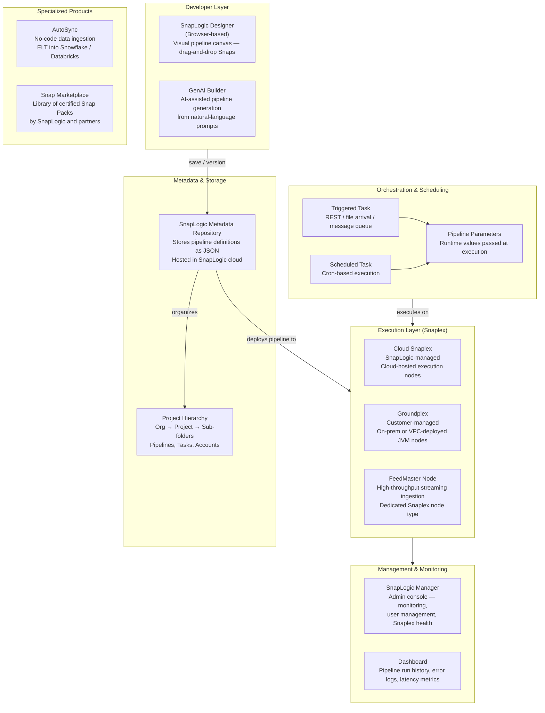
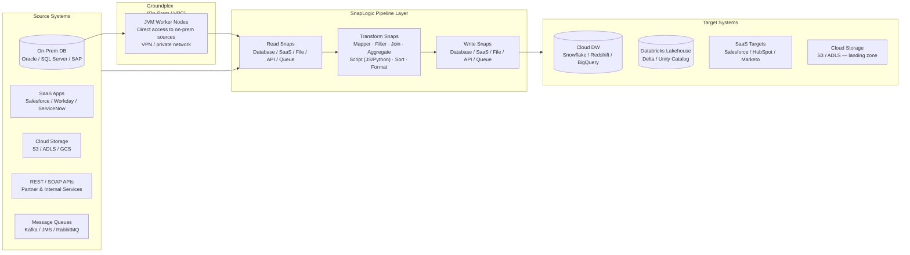

# SnapLogic — SA Migration Guide

**Purpose:** Give a Solution Architect enough depth to assess a SnapLogic estate, understand its moving parts, and map a migration path to Databricks.

This is not a developer guide. You won't be building SnapLogic pipelines. You will be walking customer sites, reviewing pipeline catalogs, asking the right questions, and scoping what it takes to move to a modern lakehouse platform.

---

## Architecture Diagrams

### SnapLogic Platform Architecture

How the SnapLogic Intelligent Integration Platform (IIP) fits together — from developer tooling through execution to orchestration and monitoring.

<div class="zd-wrapper" id="slp-arch-zoom" style="position:relative; border:1px solid #ddd; border-radius:6px; overflow:hidden; background:#fafafa;">
<div style="position:absolute; top:8px; right:10px; z-index:10; display:flex; align-items:center; gap:8px; font-size:0.78rem; color:#666;">
  <span>Scroll to zoom · Drag to pan</span>
  <button onclick="zdReset('slp-arch-zoom')" style="padding:2px 8px; font-size:0.75rem; border:1px solid #ccc; border-radius:4px; background:#fff; cursor:pointer;">Reset</button>
</div>
<div class="zd-canvas" style="cursor:grab; user-select:none;">



</div>
</div>

---

### SnapLogic as Integration Layer — Data Flow Between Systems

How SnapLogic sits between source systems and targets in a typical enterprise data pipeline.

<div class="zd-wrapper" id="slp-flow-zoom" style="position:relative; border:1px solid #ddd; border-radius:6px; overflow:hidden; background:#fafafa;">
<div style="position:absolute; top:8px; right:10px; z-index:10; display:flex; align-items:center; gap:8px; font-size:0.78rem; color:#666;">
  <span>Scroll to zoom · Drag to pan</span>
  <button onclick="zdReset('slp-flow-zoom')" style="padding:2px 8px; font-size:0.75rem; border:1px solid #ccc; border-radius:4px; background:#fff; cursor:pointer;">Reset</button>
</div>
<div class="zd-canvas" style="cursor:grab; user-select:none;">



</div>
</div>

<script>
(function(){
  window.zdReset=window.zdReset||function(id){var w=document.getElementById(id);if(!w)return;var c=w.querySelector('.zd-canvas');if(c){c._s=1;c._tx=0;c._ty=0;}var s=w.querySelector('svg');if(s){s.style.transform='translate(0,0) scale(1)';s.style.transformOrigin='0 0';}};
  function initC(c){if(c._zdInit)return;c._zdInit=true;c._s=1;c._tx=0;c._ty=0;var dr=false,sx,sy,stx,sty;function ap(sv){sv.style.transform='translate('+c._tx+'px,'+c._ty+'px) scale('+c._s+')';sv.style.transformOrigin='0 0';sv.style.display='block';}c.addEventListener('wheel',function(e){var sv=c.querySelector('svg');if(!sv)return;e.preventDefault();var r=c.getBoundingClientRect(),mx=e.clientX-r.left,my=e.clientY-r.top,d=e.deltaY<0?1.12:1/1.12,ns=Math.min(5,Math.max(0.4,c._s*d));c._tx=mx-(mx-c._tx)*(ns/c._s);c._ty=my-(my-c._ty)*(ns/c._s);c._s=ns;ap(sv);},{passive:false});c.addEventListener('mousedown',function(e){if(e.button)return;dr=true;sx=e.clientX;sy=e.clientY;stx=c._tx;sty=c._ty;c.style.cursor='grabbing';e.preventDefault();});window.addEventListener('mousemove',function(e){if(!dr)return;c._tx=stx+(e.clientX-sx);c._ty=sty+(e.clientY-sy);var sv=c.querySelector('svg');if(sv)ap(sv);});window.addEventListener('mouseup',function(){if(dr){dr=false;c.style.cursor='grab';}});c.addEventListener('touchstart',function(e){if(e.touches.length===1){dr=true;sx=e.touches[0].clientX;sy=e.touches[0].clientY;stx=c._tx;sty=c._ty;}},{passive:true});c.addEventListener('touchmove',function(e){if(dr&&e.touches.length===1){c._tx=stx+(e.touches[0].clientX-sx);c._ty=sty+(e.touches[0].clientY-sy);var sv=c.querySelector('svg');if(sv)ap(sv);}},{passive:true});c.addEventListener('touchend',function(){dr=false;});}
  function tryW(w){var c=w.querySelector('.zd-canvas');if(!c)return;var sv=c.querySelector('svg');if(!sv){setTimeout(function(){tryW(w);},200);return;}initC(c);}
  function initAll(){document.querySelectorAll('.zd-wrapper').forEach(function(w){tryW(w);});}
  if(document.readyState==='loading'){document.addEventListener('DOMContentLoaded',function(){setTimeout(initAll,600);});}else{setTimeout(initAll,600);}
})();
</script>

---

## Sections

1. [Ecosystem Overview](#1-ecosystem-overview)
2. [Snaps and Pipelines — The Core Building Blocks](#2-snaps-and-pipelines--the-core-building-blocks)
3. [Data Formats and Schema](#3-data-formats-and-schema)
4. [Parallelism and Scaling Model](#4-parallelism-and-scaling-model)
5. [Project Structure and Version Control](#5-project-structure-and-version-control)
6. [Orchestration](#6-orchestration)
7. [Metadata, Lineage, and Impact Analysis](#7-metadata-lineage-and-impact-analysis)
8. [Data Quality](#8-data-quality)
9. [SnapLogic File Formats Reference](#9-snaplogic-file-formats-reference)
10. [Migration Assessment and Artifact Inventory](#10-migration-assessment-and-artifact-inventory)
11. [Migration Mapping to Databricks](#11-migration-mapping-to-databricks)

---

## 1. Ecosystem Overview

### What Is SnapLogic?

SnapLogic is a cloud-native **iPaaS (Integration Platform as a Service)** that uses a visual, low-code canvas to build data pipelines and application integrations. Unlike traditional ETL tools (Ab Initio, Informatica) that focus on batch data movement between databases, SnapLogic is architected around **connecting heterogeneous systems** — SaaS apps, APIs, databases, cloud storage, and message queues — using pre-built connectors called **Snaps**.

SnapLogic targets **enterprise IT teams** that need to integrate many systems quickly without writing custom code. Its sweet spot is application integration (Salesforce → Workday, CRM → ERP) combined with data pipeline use cases (API → warehouse). It is not as deep on SQL transformation as Matillion, nor as parallelism-optimized as Ab Initio — it is primarily an **integration-first, transformation-second** platform.

Key differentiators:
- **Snap-based connectivity** — 700+ pre-built Snaps covering databases, SaaS, cloud storage, protocols; minimal custom code required
- **Cloud-native SaaS** — metadata and orchestration are hosted by SnapLogic; only the execution node (Snaplex) is customer-managed (when needed for on-prem access)
- **Ultra Pipelines** — real-time, low-latency streaming pipelines alongside batch
- **GenAI Builder** — LLM-assisted pipeline generation from natural language (relevant for demos and POCs)
- **AutoSync** — a separate no-code ELT product specifically for ingesting SaaS data into cloud warehouses

### The SnapLogic Product Suite

| Product | What It Is | Notes |
|---------|-----------|-------|
| **SnapLogic IIP** (Intelligent Integration Platform) | Core iPaaS — visual pipeline builder, Snaplex runtime, metadata repo | The primary product most customers are on |
| **SnapLogic Designer** | Browser-based canvas for building pipelines | Where all development happens |
| **SnapLogic Manager** | Admin and monitoring console | Snaplex health, user management, job history |
| **AutoSync** | No-code ELT — ingests SaaS data directly into Snowflake, Databricks, or BigQuery | Separate product; simpler than IIP; competes with Fivetran |
| **GenAI Builder** | AI-assisted pipeline creation from prompts | Newer capability; mostly for demos |
| **Snap Marketplace** | Library of certified Snap Packs | SnapLogic and partner-published connectors |
| **FeedMaster** | High-throughput streaming ingestion node | Dedicated Snaplex node for event stream use cases |

> **SA Tip:** Ask early whether the customer uses **SnapLogic IIP**, **AutoSync**, or both — they are different products with different artifact models. AutoSync has no custom pipeline logic to migrate; IIP pipelines may contain complex transformations and orchestration. Many customers have IIP for complex integration and AutoSync for simple SaaS ingestion running side by side.

### Why Customers Want to Migrate

| Driver | What It Means for the Engagement |
|--------|----------------------------------|
| **Lakehouse consolidation** | Customer is standardizing on Databricks; wants to reduce tool sprawl and eliminate SnapLogic licensing costs |
| **Cost** | SnapLogic is consumption-based (data volume + Snaplex nodes) — costs grow with data scale; Databricks + open connectors can be lower TCO at scale |
| **Data engineering capability** | SnapLogic is primarily an integration tool; data engineering teams want native Spark, Delta, and SQL — not a GUI connector |
| **Latency and throughput** | Some customers hit SnapLogic performance ceilings for large-volume batch pipelines; Databricks handles these natively |
| **Vendor lock-in** | Proprietary Snap definitions are not portable; customers want open, code-based pipelines |
| **dbt / Airflow consolidation** | Teams with dbt and Airflow want to eliminate SnapLogic as the integration middle layer |

> **SA Tip:** SnapLogic customers moving to Databricks are often simultaneously looking at Fivetran or Airbyte for SaaS ingestion (replacing SnapLogic's connector role) and Databricks Workflows for orchestration (replacing SnapLogic's scheduling role). Position the migration as a **two-layer replacement**: connectors (Fivetran/Airbyte) + orchestration (Databricks Workflows). Don't try to map SnapLogic pipelines 1:1 into Databricks notebooks — reframe as purpose-built ingestion + transformation.

### Key Discovery Questions

Before scoping a migration, ask:

1. Are they primarily using SnapLogic for **application integration** (SaaS-to-SaaS), **data pipelines** (source → warehouse), or both?
2. How many **active production pipelines** are there vs. total in the project?
3. Are they using **Cloud Snaplex** (SnapLogic-hosted) or **Groundplex** (customer-managed on-prem)? Groundplex means on-prem source access that must be replicated in Databricks.
4. What are the **primary source systems**? SaaS (Salesforce, Workday), on-prem databases, APIs, or file systems?
5. Are there **Script Snaps** (JavaScript or Python)? These indicate custom logic beyond connector configuration.
6. How is **version control** managed — is SnapLogic connected to Git, or are pipelines only in the SnapLogic metadata repository?
7. Does the customer use **SnapLogic's built-in scheduler**, or does an external tool (Control-M, Airflow) trigger pipelines?
8. Are there **Ultra Pipelines** (real-time/streaming)? These require a different Databricks target pattern than batch.

---

## 2. Snaps and Pipelines — The Core Building Blocks

### The Snap

A **Snap** is the atomic unit of work in SnapLogic — a pre-built, configurable connector or transformation step. Snaps are organized into **Snap Packs** (collections of related Snaps, e.g., the Salesforce Snap Pack, the Snowflake Snap Pack).

Snaps have typed **input views** and **output views** — the data flowing between Snaps is a stream of JSON-like documents. Unlike SQL-based tools, SnapLogic processes data as **document streams**, not as table rows moving through SQL queries.

**Snap categories:**

| Category | Examples | What They Do |
|----------|----------|--------------|
| **Read (Source)** | `Database Select`, `Salesforce Read`, `S3 File Reader`, `REST GET`, `Kafka Consumer` | Pull data from source systems into the pipeline |
| **Transform** | `Mapper`, `Filter`, `Join`, `Aggregate`, `Sort`, `Script (JS/Python)`, `XML/JSON Parser` | Modify, reshape, or enrich data in-flight |
| **Write (Target)** | `Database Insert/Upsert`, `Snowflake Bulk Load`, `S3 File Writer`, `Salesforce Upsert` | Push data to target systems |
| **Route** | `Router`, `Union`, `Copy` | Fan-out, fan-in, or conditional branching |
| **Parse / Format** | `CSV Parser`, `JSON Formatter`, `XML Generator` | Encode or decode data formats |
| **Utility** | `Pipeline Execute`, `Sequence Generator`, `Binary Snap` | Control flow, sub-pipeline calls, scripting |

> **SA Tip:** The **Mapper Snap** is where most SnapLogic transformation logic lives — it maps fields from input documents to output documents using SnapLogic Expression Language (a JavaScript-like syntax). Mapper logic is not SQL; it must be rewritten as PySpark transformations, SQL SELECT expressions, or dbt models. Ask how complex the Mapper configurations are — simple field-to-field mappings are easy to port; complex nested document transformations are significant effort.

### The Pipeline

A **Pipeline** is a directed graph of Snaps connected by links — data flows left to right through the canvas. It is the core executable artifact in SnapLogic, equivalent to an Informatica Mapping or an Ab Initio graph.

Pipelines can be:
- **Batch** — reads all records from a source, processes, and writes to target
- **Ultra** — real-time, low-latency event streaming; different execution model from batch

| Pipeline Type | Characteristics | Databricks Equivalent |
|--------------|----------------|----------------------|
| **Batch Pipeline** | Reads bounded data sets; scheduled or triggered | Databricks notebook / DLT batch pipeline |
| **Ultra Pipeline** | Continuous, event-driven; stateful streaming | Databricks Structured Streaming / DLT streaming |
| **Sub-Pipeline** | Reusable pipeline called by a parent via `Pipeline Execute` Snap | Reusable notebook (called as Workflow task) |

### Pipeline Parameters

**Pipeline Parameters** are typed input variables that can be passed at runtime — similar to Matillion pipeline variables. Parameters allow the same pipeline to run for different date ranges, environments, or entity subsets.

| Parameter Type | Behavior | Databricks Equivalent |
|---------------|---------|----------------------|
| **Required parameter** | Must be passed by caller; pipeline fails without it | Databricks Workflow task parameter (required) |
| **Optional parameter** | Has a default value; can be overridden at runtime | Databricks Workflow task parameter with default |
| **Encrypted parameter** | Masked in UI; used for credentials | Databricks Secret Scope reference |

### Accounts (Connection Configs)

**Accounts** are SnapLogic's reusable credential and connection configuration objects — separate from pipelines, shared across Snaps of the same type. An Account holds the hostname, credentials, and connection settings for a given system (e.g., a Salesforce Account, a Snowflake Account).

> **SA Tip:** Inventory Accounts during assessment — they reveal the full topology of what SnapLogic touches. Each Account maps to a Databricks connection credential that must be recreated in Databricks Secrets or in the Unity Catalog connection registry. Count distinct Account types (database, SaaS, storage) — this scopes the connectivity setup work.

---

## 3. Data Formats and Schema

### How SnapLogic Represents Data

Unlike SQL-based ETL tools, SnapLogic processes data as **streams of JSON-like documents** (internally called "Snappy" format). This has important implications for migration:

- There are no standalone schema files or DML definitions
- Schema is **inferred at runtime** from source Snaps reading live system metadata
- Transformations are expressed as **field-level mapping expressions**, not SQL queries
- Nested and hierarchical data (JSON, XML) is a first-class concept — SnapLogic handles it natively

**What this means for migration:**
- No schema files to inventory or translate
- Mapping logic must be **reverse-engineered** from Mapper Snap expressions
- Customers moving JSON/API data through SnapLogic will need to implement JSON parsing explicitly in Databricks

### Document vs. Tabular Mode

SnapLogic can handle both document-oriented (nested JSON, XML) and tabular (flat rows from databases) data in the same pipeline. The **Schema Snap** and **Validate Snap** can enforce a schema at a point in the pipeline.

| Data Shape | SnapLogic Handling | Migration Approach |
|-----------|-------------------|-------------------|
| **Flat tabular rows** | Database Snaps produce typed row documents | Map to Spark DataFrame / Delta table |
| **Nested JSON** | Document stream; nested fields accessed via dot notation | Flatten using `from_json` / `explode` in PySpark or SQL |
| **XML** | XML Parser Snap produces document tree | Parse with PySpark `xpath` / `from_xml` (Spark 4+) or custom UDF |
| **Binary / files** | Binary Snap, file readers | Databricks Auto Loader / `binaryFile` format |

### SnapLogic Expression Language

SnapLogic's **Expression Language** (used in Mapper, Filter, and other Snaps) is a JavaScript-like syntax for field-level transformations. Examples:

```javascript
// Date formatting
$inputDate.format("yyyy-MM-dd")

// String concatenation
$firstName + " " + $lastName

// Conditional
$status == "ACTIVE" ? "Y" : "N"

// Nested field access
$customer.address.city
```

> **SA Tip:** SnapLogic Expression Language logic must be manually translated to Spark SQL expressions or PySpark column operations. There is no automated translator. During assessment, export pipeline JSON and count the number of Mapper Snaps with complex expressions — each non-trivial expression is a manual rewrite item. Simple field renames are trivial; date math, conditional logic, and nested field manipulation require careful translation.

---

## 4. Parallelism and Scaling Model

### SnapLogic's Execution Model

SnapLogic pipelines run on **Snaplex nodes** — JVM-based worker processes that execute the pipeline stages. Data flows through the pipeline as a stream; Snaps are pipelined in-process.

Unlike Ab Initio (which uses OS-level parallel processes) or Matillion (which delegates to warehouse SQL), SnapLogic processes data **inside the Snaplex JVM**. This means:
- Performance is bounded by Snaplex node memory and CPU
- Large datasets require careful tuning or chunking strategies
- The Snaplex node is the bottleneck for high-volume pipelines

### Scaling Mechanisms

| Mechanism | How It Works | Notes |
|-----------|-------------|-------|
| **Multiple Snaplex nodes** | Scale-out by adding JVM nodes to the Snaplex cluster | Enterprise customers run 2–8 nodes |
| **Pipeline partitioning** | Some Snaps support data partitioning to run in parallel across nodes | Not automatic; must be configured per pipeline |
| **Ultra Pipeline throughput** | Designed for low-latency event streaming, not high-volume batch | Different architecture from batch pipelines |
| **Cloud Snaplex auto-scale** | SnapLogic-managed Snaplex can scale nodes dynamically | Available in cloud-hosted mode; not for Groundplex |

> **SA Tip:** Customers frequently complain about SnapLogic performance on large batch volumes. The root cause is almost always the Snaplex JVM hitting memory limits or a single-node configuration. When scoping migration effort, ask: "How large are the datasets this pipeline processes, and how long does it take today?" — this sets the baseline for Databricks cluster sizing and gives you a benchmark target for the migration.

### The Groundplex Complication

When customers use a **Groundplex** (on-prem Snaplex), it means their pipelines access on-prem databases and file systems directly. Moving to Databricks requires either:

1. **Network connectivity** — Databricks JDBC to on-prem sources (VPN, ExpressRoute, Direct Connect)
2. **Landing zone** — land on-prem data in cloud storage first, then process in Databricks
3. **Incremental ingestion** — set up Airbyte or Fivetran self-hosted connectors to replicate on-prem data

> **SA Tip:** Groundplex pipelines are the most complex to migrate because they have on-prem network dependencies that Databricks cannot replicate without infrastructure changes. Always ask: "Which of your Groundplex pipelines access on-prem sources that are not yet in the cloud?" — these pipelines will require a network or landing zone decision before the Databricks migration can begin.

---

## 5. Project Structure and Version Control

### Project Hierarchy

SnapLogic organizes all artifacts in a **folder hierarchy** within the SnapLogic metadata repository:

```
Organization
 └── Project
       ├── Pipelines (batch and Ultra)
       ├── Sub-Pipelines (reusable)
       ├── Tasks (scheduled and triggered)
       ├── Accounts (connection configs)
       └── Files (uploaded reference data)
```

Projects map to logical teams or applications. Sub-projects (folders) are used to organize by domain, environment (DEV/PROD), or pipeline type.

### Version Control

SnapLogic's built-in versioning is limited:

| Capability | SnapLogic Built-in | Databricks Equivalent |
|-----------|-------------------|----------------------|
| **Pipeline versioning** | SnapLogic maintains a version history per pipeline in its metadata repo | Git-backed Databricks Repos |
| **Git integration** | Available in IIP — pipelines can be exported to Git as JSON; not universally used | Native Git integration in Databricks |
| **Environment promotion** | Manual copy/export between projects (DEV → PROD) | Databricks Asset Bundles CI/CD |
| **Branching / PRs** | Supported with Git integration only | Standard Git workflows |

> **SA Tip:** Many SnapLogic customers do **not** have Git integration enabled. Their version history is what SnapLogic stores internally — which may not match what's in production. Always ask: "Are your SnapLogic pipelines in Git?" If not, the production SnapLogic instance is the only source of truth. Plan for a full export via the SnapLogic REST API before migration begins.

### Shared / Reusable Pipelines

**Sub-Pipelines** are reusable pipelines called via the `Pipeline Execute` Snap. They accept parameters from the parent and return output. Equivalent to Informatica reusable mapplets or Ab Initio wrapped graphs.

| Concept | SnapLogic | Databricks Equivalent |
|---------|-----------|----------------------|
| Sub-Pipeline | Called by parent via `Pipeline Execute` | Reusable notebook (called as a Workflow task) |
| Account | Shared connection config | Databricks Secret + Unity Catalog connection |
| Project folder | Logical grouping of related pipelines | Databricks workspace folder / DAB bundle |

---

## 6. Orchestration

### Tasks — The Execution Wrapper

In SnapLogic, a **Task** is the unit of execution that wraps a pipeline for scheduling or triggering. A Pipeline alone cannot run on a schedule — it must be wrapped in a Task.

| Task Type | Description | Databricks Equivalent |
|-----------|-------------|----------------------|
| **Scheduled Task** | Cron-based — triggers a pipeline on a time schedule | Databricks Workflow (scheduled) |
| **Triggered Task** | Event-based — triggered by REST call, file arrival, or message | Databricks Workflow (file arrival trigger / REST API call) |
| **Ultra Task** | Continuous task wrapping an Ultra (streaming) Pipeline | Databricks Structured Streaming job |

### Pipeline Chaining and Orchestration

SnapLogic does not have a dedicated orchestration pipeline type like Matillion's Orchestration Pipeline. Instead, orchestration is achieved through:

| Pattern | How It Works | Databricks Equivalent |
|---------|-------------|----------------------|
| **`Pipeline Execute` Snap** | Call a sub-pipeline inline within a parent pipeline | Databricks Workflow task dependency |
| **Sequential Tasks** | Task A triggers Task B via REST on completion | Databricks Workflow task chain |
| **External scheduler** | Control-M / Airflow calls SnapLogic Tasks via REST API | Airflow `SnapLogicOperator` → replace with `DatabricksRunNowOperator` |
| **Error handling routes** | Pipeline branches to error handler on Snap failure | Databricks Workflow `on_failure` task routing |

> **SA Tip:** SnapLogic's orchestration model is **less expressive** than Airflow or Databricks Workflows. Complex multi-pipeline dependencies in SnapLogic are often implemented as chains of REST calls or external scheduler dependencies — not as a single visual workflow. When mapping to Databricks, this is an opportunity to consolidate: build one Databricks Workflow that sequences all the pipelines that were previously chained across SnapLogic Tasks and an external scheduler.

### Scheduling

| Scheduler | Integration | Migration Note |
|-----------|------------|----------------|
| **SnapLogic built-in scheduler** | Cron expressions on Task definitions | Replace with Databricks Workflow schedule |
| **Apache Airflow** | `SnapLogicOperator` or generic REST operator | Replace SnapLogic task call with `DatabricksRunNowOperator` |
| **Control-M / UC4** | REST API call to SnapLogic Task endpoint | Replace REST call with Databricks Workflow REST API trigger |
| **AWS EventBridge / Azure Logic Apps** | Webhook trigger on SnapLogic Task | Replace with Databricks Workflow REST API or event-based trigger |

---

## 7. Metadata, Lineage, and Impact Analysis

### What SnapLogic Tracks

SnapLogic's metadata is stored in its **cloud-hosted metadata repository**. All pipeline definitions, Account configs, Task schedules, and run history are accessible via the **SnapLogic REST API**.

| Metadata Type | Where It Lives | How to Access |
|--------------|---------------|---------------|
| Pipeline definitions | SnapLogic metadata repo | REST API — `GET /pipeline` endpoints; JSON export |
| Run history and logs | SnapLogic Manager dashboard | REST API — `GET /runtime` endpoints |
| Account configs | SnapLogic metadata repo | REST API — `GET /account` endpoints |
| Task schedules | SnapLogic metadata repo | REST API — `GET /task` endpoints |

**Lineage limitations:**
- SnapLogic does not track **column-level lineage** natively
- Pipeline-level lineage (which pipeline reads from which source, writes to which target) can be inferred from Snap configurations in exported JSON
- No built-in impact analysis UI — dependency mapping requires scripting against exported pipeline JSON

> **SA Tip:** For inventory and assessment, use the SnapLogic REST API to export all pipeline JSON from every project. A SnapLogic admin can generate a full API export in hours. Parse the JSON to extract: source system types (Account references in Read Snaps), target system types (Account references in Write Snaps), Script Snap presence, and `Pipeline Execute` sub-pipeline references. This gives you the full estate map without needing GUI access.

### Dependency Mapping

| Analysis Needed | How to Get It |
|----------------|---------------|
| Which pipelines call a given sub-pipeline | Grep exported JSON for `Pipeline Execute` Snap with target pipeline name |
| What systems a pipeline reads from | Extract `Account` references in Read Snap configurations |
| What systems a pipeline writes to | Extract `Account` references in Write Snap configurations |
| Which pipelines have Script Snaps | Grep for `snap-type: "com.snaplogic.snaps.script"` in JSON |
| Active pipelines vs. stale ones | Query `GET /runtime` API for last successful run date per pipeline |

---

## 8. Data Quality

### Data Quality in SnapLogic

SnapLogic does not have a dedicated data quality product. Quality checks are implemented inside pipelines using standard Snaps.

**Common patterns:**

| Pattern | How It's Implemented | Databricks Equivalent |
|---------|---------------------|----------------------|
| **Row count validation** | `Aggregate` Snap → `Filter` Snap checking count threshold | DLT `expect_or_fail()` / Great Expectations |
| **Null / type checks** | `Filter` Snap routing null-field records to error output | DLT `expect()` with quarantine pattern |
| **Schema validation** | `Schema` Snap enforcing field types on input | DLT schema enforcement on Delta tables |
| **Duplicate detection** | `Aggregate` Snap with GROUP BY + count > 1 filter | Delta `MERGE INTO` dedup / DLT expectation |
| **Custom business rules** | `Script` Snap (JavaScript / Python) with custom logic | dbt test / custom DLT expectation |
| **Error routing** | Output error views on Snaps route failed records to error targets | DLT quarantine table pattern |

> **SA Tip:** SnapLogic's **error view** feature — where each Snap has a secondary error output for failed records — is a DQ mechanism unique to SnapLogic's document-stream model. It routes bad records to a separate error target (database table, S3 file) rather than failing the pipeline. When migrating, ask: "Are your error outputs actively monitored, or are they a dead-letter drop?" — this determines whether the error routing logic needs to be faithfully reproduced in Databricks or can be simplified.

---

## 9. SnapLogic File Formats Reference

### Pipeline JSON — The Primary Artifact

All SnapLogic pipelines are stored internally as structured JSON. Pipelines can be exported from the SnapLogic Designer UI or via the REST API.

| Property | Detail |
|----------|--------|
| **Created by** | SnapLogic Designer — visual canvas generates JSON internally |
| **Stored in** | SnapLogic cloud metadata repository; exportable via REST API |
| **Contains** | Snap types, configuration properties, links between Snaps, pipeline parameters, Account references |
| **Human-readable?** | Yes — JSON format; verbose with SnapLogic-internal type names |
| **Migration target** | Databricks notebook (PySpark or SQL) / DLT pipeline; Snap-by-Snap translation |

**Example snippet (Mapper Snap in pipeline JSON):**
```json
{
  "type": "Mapper",
  "id": "mapper_customer_fields",
  "properties": {
    "mapping": [
      { "source": "$customer_id", "target": "id" },
      { "source": "$first_name + ' ' + $last_name", "target": "full_name" },
      { "source": "$created_date.format('yyyy-MM-dd')", "target": "created_dt" }
    ]
  }
}
```

> **SA Tip:** Export all pipeline JSON via `GET /pipeline/<org>/<project>/<pipeline_name>` for each pipeline, or use the bulk project export. Write a script to parse the JSON and count Snaps by type — specifically flagging `Script` Snaps and `Pipeline Execute` Snaps. Script Snaps are high-effort migration items; `Pipeline Execute` Snaps reveal sub-pipeline dependencies.

---

### `.slp` — SnapLogic Pipeline Package

A `.slp` file is a **ZIP archive** containing one or more exported pipeline JSON files plus associated metadata. It is the format used for sharing pipelines between SnapLogic instances or storing them outside the platform.

| Property | Detail |
|----------|--------|
| **Created by** | SnapLogic Designer — "Export" function |
| **Stored in** | Filesystem or version control (if customer has Git integration) |
| **Contains** | Pipeline JSON + dependency metadata (Account type references, parameter definitions) |
| **Human-readable?** | After unzipping — standard JSON inside |
| **Migration target** | Source for pipeline analysis and migration planning |

> **SA Tip:** If a customer has `.slp` files in a Git repository, they have a version-controlled pipeline history. Unzip and analyze the JSON directly — this is faster than API access and gives you historical context about which pipelines were recently modified.

---

### Account Configuration

**Accounts** are stored as named configurations in the SnapLogic metadata repository. They hold connection details per system type.

| Property | Detail |
|----------|--------|
| **Created by** | SnapLogic admin — configured per environment |
| **Stored in** | SnapLogic metadata repo; not typically in Git (contain credentials) |
| **Contains** | Hostname, credentials (masked), database/schema names, SSL settings, OAuth tokens |
| **Human-readable?** | Partially — structure visible in UI; secrets masked |
| **Migration target** | Databricks Secret Scope + Unity Catalog connection registration |

---

### File Formats Quick Reference

| Format | Primary Content | Human-Readable? | Migration Target |
|--------|----------------|-----------------|-----------------|
| Pipeline JSON (API export) | Full pipeline definition — Snaps, links, params | Yes (verbose) | Databricks notebook / DLT |
| `.slp` package | ZIP of pipeline JSON(s) | After unzip — Yes | Analysis + migration source |
| Account config (API export) | Connection credentials + settings | Partially (masked) | Databricks Secrets + Unity Catalog |
| Run log (API export) | Execution history per pipeline | Yes (JSON) | Determine active vs. stale pipelines |

---

## 10. Migration Assessment and Artifact Inventory

### Inventory Approach

1. Use the SnapLogic REST API to export all pipeline JSON across all projects and environments
2. Parse JSON to count pipelines by type (batch vs. Ultra) and identify sub-pipelines
3. Grep for `Script` Snap types (JavaScript and Python) — these are high-effort migration items
4. Extract all `Account` references in Read and Write Snaps — this maps the full source/target topology
5. Pull `Pipeline Execute` Snap references to build a sub-pipeline dependency graph
6. Query run history API to identify active pipelines (last run within 90 days) vs. stale ones
7. List all Groundplex-dependent pipelines — these have on-prem source dependencies requiring network decisions

### Complexity Scoring

Score each pipeline on migration effort:

| Dimension | Low (1) | Medium (2) | High (3) |
|-----------|---------|-----------|---------|
| **Snap types** | Standard database/storage Snaps | Mix of standard + API / SaaS Snaps | Script Snaps (JS/Python) |
| **Mapper complexity** | Simple field renames | Conditional logic, date math | Nested document transformation, custom JS expressions |
| **Source system** | Cloud database or storage | SaaS API with standard connector | On-prem via Groundplex |
| **Pipeline chaining** | Standalone pipeline | 1–2 sub-pipeline calls | Complex chain of `Pipeline Execute` calls |
| **Data volume** | < 1M rows / run | 1M–100M rows | 100M+ rows or streaming (Ultra) |
| **Orchestration** | Simple scheduled Task | Multiple chained Tasks | External scheduler + REST trigger chains |

### Risk Areas Specific to SnapLogic

| Risk Area | Why It's Risky | Mitigation |
|-----------|--------------|------------|
| **Script Snaps (JS/Python)** | Custom code with unknown dependencies; not a standard Snap | Inventory all Script Snaps; treat each as a custom code port |
| **Complex Mapper expressions** | SnapLogic Expression Language (JS-like) must be rewritten as Spark SQL or PySpark | Extract all Mapper expressions during assessment; map to Spark SQL equivalents |
| **Groundplex on-prem dependencies** | On-prem sources require network or landing zone decisions before Databricks can access them | Identify and sequence: network/landing zone first, then pipeline migration |
| **Ultra Pipelines (streaming)** | Different architecture from batch; requires Databricks Structured Streaming | Inventory streaming pipelines separately; assess latency requirements |
| **SaaS connector feature parity** | Some SnapLogic-bundled SaaS Snaps have deep connector features (incremental, field selection) not available in generic JDBC | Map each SaaS connector to Fivetran / Airbyte equivalent; validate feature parity |
| **Account / credentials scope** | Production credentials stored in SnapLogic Accounts may not be accessible during migration | Engage customer's security team early to provision equivalent Databricks Secrets |
| **No Git history** | Customers without Git integration have no pipeline version history | Use API run history to identify active pipelines; treat production instance as source of truth |

---

## 11. Migration Mapping to Databricks

### Building Blocks

| SnapLogic Concept | Databricks Equivalent |
|------------------|----------------------|
| Pipeline (batch) | Databricks notebook (PySpark or SQL) / dbt model / Delta Live Tables pipeline |
| Pipeline (Ultra / streaming) | Databricks Structured Streaming / DLT streaming pipeline |
| Sub-Pipeline | Reusable notebook (called as a Workflow task) / dbt macro |
| Snap (Read — database) | `spark.read.jdbc()` / Delta table read |
| Snap (Read — S3/ADLS) | Databricks Auto Loader / `spark.read.format("cloudFiles")` |
| Snap (Read — SaaS) | Fivetran / Airbyte connector (external ingestion) |
| Snap (Transform — Mapper) | `withColumn()` / SQL `SELECT` expression / dbt column expression |
| Snap (Transform — Filter) | `filter()` / SQL `WHERE` |
| Snap (Transform — Join) | `join()` / SQL `JOIN` |
| Snap (Transform — Aggregate) | `groupBy().agg()` / SQL `GROUP BY` |
| Snap (Script — JavaScript) | Databricks notebook (Python) / Spark UDF |
| Snap (Script — Python) | Databricks notebook (Python) / Databricks task (Python file) |
| Snap (Write — database) | Delta `CREATE OR REPLACE TABLE AS SELECT` / `MERGE INTO` |
| Snap (Write — S3/ADLS) | `spark.write` to Delta / cloud storage |
| Account (connection config) | Databricks Secret Scope + Unity Catalog connection |
| Pipeline Parameter | Databricks Workflow task parameter / notebook widget |

### Orchestration

| SnapLogic Orchestration | Databricks Equivalent |
|------------------------|----------------------|
| Scheduled Task | Databricks Workflow (scheduled with cron) |
| Triggered Task (REST) | Databricks Workflow (REST API trigger) |
| Triggered Task (file arrival) | Databricks Workflow (file arrival trigger) |
| Ultra Task (streaming) | Databricks Structured Streaming job (continuous) |
| `Pipeline Execute` Snap (sub-pipeline) | Databricks Workflow task dependency |
| External scheduler (Airflow) → SnapLogic REST | Airflow `DatabricksRunNowOperator` |
| External scheduler (Control-M) → SnapLogic REST | Control-M Databricks integration / REST API call |
| Error output routing | Databricks Workflow `on_failure` task / DLT quarantine table |

### Connectivity

| SnapLogic Connectivity | Databricks Equivalent |
|-----------------------|----------------------|
| Cloud Snaplex | Databricks serverless / shared cluster |
| Groundplex (on-prem) | Databricks with VPN / ExpressRoute + JDBC connector |
| SaaS Snap Pack (Salesforce, Workday) | Fivetran / Airbyte connector (external) |
| AutoSync (no-code ELT) | Databricks ingestion (Auto Loader, COPY INTO) or Fivetran |
| FeedMaster (streaming ingestion) | Databricks Auto Loader (cloud files) / Kafka → DLT |

### Governance

| SnapLogic Concept | Databricks Equivalent |
|------------------|----------------------|
| Project (org unit) | Databricks workspace folder / Unity Catalog schema |
| Account (credential) | Databricks Secret Scope + Unity Catalog external connection |
| Pipeline version history | Git-backed Databricks Repos / Databricks Asset Bundles |
| SnapLogic Manager monitoring | Databricks Workflow run history + Job monitoring UI |
| API-based run history | Databricks Jobs API run history |

### What Doesn't Map Cleanly

| SnapLogic Pattern | Why It's Hard | Recommended Approach |
|------------------|--------------|---------------------|
| **Complex Mapper expressions (nested JSON)** | SnapLogic Expression Language handles nested documents natively; Spark requires explicit `from_json` / `explode` / `struct` operations | Inventory all Mapper Snaps with nested field access; treat each as a manual rewrite |
| **Ultra Pipelines (real-time streaming)** | Different architecture from batch; real-time requirements may change cluster and SLA design | Assess latency requirements separately; design Structured Streaming or DLT streaming pipeline with appropriate trigger intervals |
| **SaaS connectors with deep incremental logic** | Some SnapLogic Snap Packs have complex CDC and watermark logic built-in | Map to Fivetran/Airbyte for SaaS ingestion; do not try to replicate connector logic in notebooks |
| **Groundplex on-prem source access** | Requires network connectivity decisions (VPN, ExpressRoute) before Databricks can access sources | Treat as a separate workstream — network/landing zone setup must precede pipeline migration |
| **JavaScript Script Snaps with business logic** | Non-standard; may call external libraries, make API calls, or manipulate files | Treat each Script Snap as a custom code audit item; port to Python notebook or PySpark UDF |
| **Error output routing (document-level)** | SnapLogic routes individual bad records to error outputs; Databricks processes in bulk | Implement DLT quarantine pattern or write failed records to a separate Delta table via conditional write logic |
