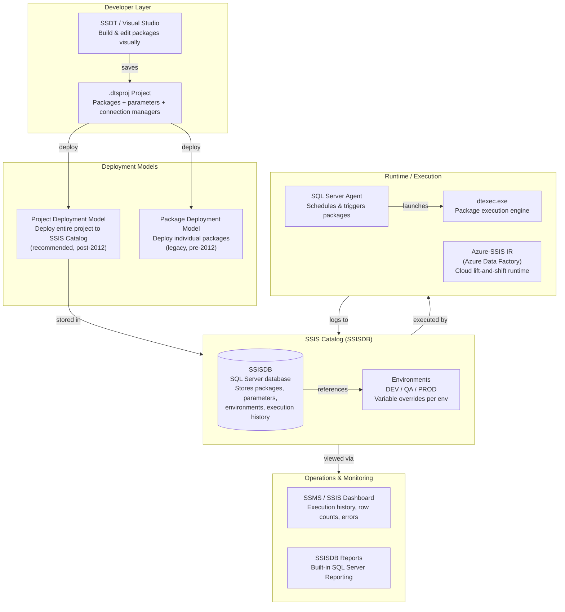
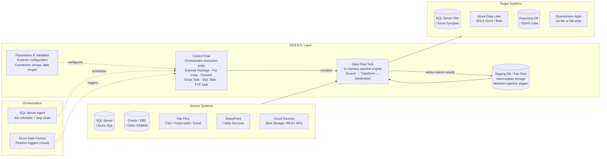

# SSIS — SA Migration Guide

**Purpose:** Give a Solution Architect enough depth to assess an SSIS estate, understand its moving parts, and map a migration path to Databricks.

This is not a developer guide. You won't be building SSIS packages. You will be walking customer sites, reviewing architecture diagrams, asking the right questions, and scoping what it takes to move to a modern lakehouse platform.

---

## Architecture Diagrams

### SSIS Platform Architecture

How SSIS fits into the broader Microsoft data stack — from developer tooling through deployment and runtime execution.



---

### SSIS as ETL — Data Flow Between Systems

How SSIS sits between source systems and targets in a typical Microsoft-centric enterprise pipeline.



---

## Sections

1. [Ecosystem Overview](#1-ecosystem-overview)
2. [Packages — The Core Building Block](#2-packages--the-core-building-block)
3. [Data Formats and Schema](#3-data-formats-and-schema)
4. [Parallelism and Scaling Model](#4-parallelism-and-scaling-model)
5. [Project Structure and Version Control](#5-project-structure-and-version-control)
6. [Orchestration: SQL Server Agent and ADF](#6-orchestration-sql-server-agent-and-adf)
7. [Metadata, Lineage, and Impact Analysis](#7-metadata-lineage-and-impact-analysis)
8. [Data Quality](#8-data-quality)
9. [SSIS File Formats Reference](#9-ssis-file-formats-reference)
10. [Migration Assessment and Artifact Inventory](#10-migration-assessment-and-artifact-inventory)
11. [Migration Mapping to Databricks](#11-migration-mapping-to-databricks)

---

## 1. Ecosystem Overview

### What Is SSIS?

**SQL Server Integration Services (SSIS)** is Microsoft's enterprise ETL and data integration platform. It has been bundled with SQL Server since 2005 and is the dominant ETL tool in Microsoft-centric enterprise environments — banks, retail, healthcare, government, and manufacturing shops that standardized on the SQL Server stack.

SSIS is a **visual, task-based workflow engine**. Developers build packages in Visual Studio (using SQL Server Data Tools / SSDT), deploying them to a SQL Server instance that stores, schedules, and monitors execution. It is deeply integrated with SQL Server, Active Directory, and the broader Microsoft platform.

Unlike cloud-native ETL tools, SSIS is:

- **On-premises first** — designed to run on Windows servers; cloud use requires Azure-SSIS IR (a managed VM cluster in Azure Data Factory), which is lift-and-shift, not native cloud
- **Single-node by default** — SSIS does not distribute processing across a cluster; scale comes from the SQL Server host machine
- **Proprietary packaging** — packages are `.dtsx` files (XML), which are readable but not portable to other platforms without rewriting
- **Tightly coupled to SQL Server** — many patterns (staging tables, stored procedure calls, linked servers) assume SQL Server as the hub

### The SSIS Product Ecosystem

Customers with large SSIS estates often also have adjacent Microsoft data tools. Understanding the full stack matters for scoping.

| Product | What It Does | Migration Relevance |
|---------|-------------|---------------------|
| **SSIS** | ETL package execution engine | High — all transformation logic lives here |
| **SSISDB (SSIS Catalog)** | SQL Server database storing packages, environments, execution history | High — inventory and execution logs live here |
| **SQL Server Agent** | Windows-based job scheduler; triggers SSIS packages | High — all scheduling to be replaced |
| **SSDT / Visual Studio** | IDE for building and debugging SSIS packages | Medium — development tooling only |
| **SSMS** | SQL Server Management Studio; used to deploy, run, and monitor packages | Medium — operational tooling |
| **SSIS Scale Out** | Multi-server parallel execution feature (SQL Server 2017+) | Low — rarely deployed; note if present |
| **Azure-SSIS IR** | Azure Data Factory managed runtime to run SSIS packages in cloud | Medium — customers on Azure may use this as a migration stepping stone |
| **Data Quality Services (DQS)** | Standalone Microsoft data quality cleansing/matching tool | Low-Medium — note if actively used; requires separate migration |
| **Master Data Services (MDS)** | Reference data and MDM tool | Low — separate product; flag if in scope |

> **SA Tip:** Ask whether the customer is on **Azure-SSIS IR** already. If yes, they've done a lift-and-shift to the cloud but haven't modernized — this is actually a strong migration entry point because they're already paying cloud costs and feeling the limitations of running SSIS on a managed VM cluster.

### Why Customers Want to Migrate

| Driver | What It Means for the Engagement |
|--------|----------------------------------|
| **Cloud strategy** | Moving off on-premises SQL Server eliminates the SSIS runtime — packages need a new home |
| **SQL Server license cost** | SQL Server Enterprise (required for full SSIS capability) is expensive; migration reduces licensing |
| **Performance limits** | SSIS runs on a single node; large datasets hit memory and CPU ceilings that Spark doesn't have |
| **Developer productivity** | SSIS development in Visual Studio is slow; Databricks notebooks and DLT pipelines are faster to iterate |
| **Vendor ecosystem** | Customers moving to Azure broadly want cloud-native tools, not a VM running SSIS packages |
| **Talent** | New data engineers don't know SSIS; they know Python, SQL, and Spark |

> **SA Tip:** The most common trigger is a **SQL Server version upgrade or cloud migration project** that surfaces SSIS as a dependency. The customer wasn't planning to migrate ETL — they discovered they have to. This means they often haven't assessed scope yet. The first conversation is often about scoping, not selling.

### Key Discovery Questions

Before scoping a migration, ask:

1. How many packages are in **active production** use? (vs. total packages in SSISDB — there will be significant dead code)
2. Are packages deployed in **Project Deployment Model** or the legacy **Package Deployment Model**?
3. What is the **SQL Server version** and is the customer on Azure-SSIS IR or on-premises?
4. What is the **SQL Server Agent** job structure — how many jobs, how many steps per job?
5. Are there **Script Tasks or Script Components** with custom C# or VB.NET code? How many?
6. What are the **primary source and target systems**? (SQL Server tables, flat files, Oracle, SAP, cloud storage?)
7. Are packages organized in **Visual Studio solutions** with Git, or are they stored loose in the file system or SSISDB only?
8. Is **Data Quality Services (DQS)** in use, or are quality checks embedded in packages?
9. What are the **SLAs** for critical nightly batch jobs?
10. Are there **SSIS packages calling stored procedures** with heavy business logic? How much logic is in SQL vs. SSIS?

---

## 2. Packages — The Core Building Block

### The Package

In SSIS, the **package** is the fundamental unit of work — equivalent to a pipeline or job in modern ETL tools. A package contains two main design surfaces:

- **Control Flow** — the orchestration layer; defines what tasks run, in what order, with what conditions
- **Data Flow** — the data pipeline layer; defines how data moves from source to destination through transformations

A package is saved as a `.dtsx` file — an XML document that encodes every task, component, connection, and expression in the package.

A single SSIS project can have **dozens to hundreds of packages**, often organized by source system, subject area, or processing stage.

### Control Flow

The **Control Flow** is the top-level canvas in SSIS. It defines the workflow logic — sequencing of tasks, looping over files or records, conditional branching, and error handling.

**Core Control Flow task types:**

| Task Type | What It Does | Databricks Equivalent |
|-----------|-------------|----------------------|
| **Execute SQL Task** | Runs a SQL statement against a connection | `spark.sql()` / notebook cell |
| **Data Flow Task** | Runs a data pipeline (source → transform → destination) | DLT pipeline / notebook ETL code |
| **Execute Package Task** | Calls another SSIS package | Databricks Workflow task dependency |
| **Script Task** | Runs custom C# or VB.NET code | Python notebook cell / utility function |
| **For Loop Container** | Iterates N times | Python `for` loop / Workflow loop |
| **Foreach Loop Container** | Iterates over a collection (files, rows, variables) | Python list comprehension / Auto Loader |
| **Sequence Container** | Groups tasks for organization or error handling | Task group in Workflow |
| **File System Task** | Copies, moves, or deletes files | DBFS/ADLS file operations in Python |
| **FTP Task** | Transfers files via FTP | Python ftplib / partner connector |
| **Send Mail Task** | Sends email notification | Databricks alert / webhook notification |

**Precedence Constraints** connect tasks in the Control Flow and define when a downstream task runs: on success, on failure, or on completion of the upstream task. They can include expression-based conditions.

### Data Flow

The **Data Flow Task** is where actual data transformation happens. Inside a Data Flow, you build a pipeline of **components** — sources, transformations, and destinations — connected by data paths.

**Core Data Flow component categories:**

| Category | Examples | What They Do |
|----------|----------|--------------|
| **Sources** | OLE DB Source, Flat File Source, Excel Source, ADO.NET Source | Read data from connections |
| **Row Transforms** | Derived Column, Data Conversion, Character Map | Field-level transformations |
| **Split / Route** | Conditional Split, Multicast | Filter rows or copy stream to multiple outputs |
| **Join / Lookup** | Merge Join, Lookup, Cache Transform | Combining datasets, enrichment |
| **Aggregate** | Aggregate, Sort | Group-by aggregations, ordering |
| **Row counting / sampling** | Row Count, Row Sampling, Percentage Sampling | Metrics collection, testing |
| **Fuzzy matching** | Fuzzy Lookup, Fuzzy Grouping | Probabilistic matching and deduplication |
| **Script Component** | Script Component (Source / Transform / Destination) | Custom C# or VB.NET transformation logic |
| **Destinations** | OLE DB Destination, Flat File Destination, SQL Server Destination | Write data to targets |

> **SA Tip:** **Script Components** are the hardest part of any SSIS migration. They contain arbitrary C# or VB.NET business logic that has no direct equivalent — each one requires a developer to read, understand, and rewrite the logic in Python or Spark. Count them early; they are the primary driver of migration effort.

### Variables and Expressions

SSIS packages use **Variables** to store runtime values — counters, file paths, date ranges, row counts, status flags. Variables can be scoped to the package or to a specific container.

**Expressions** are a lightweight scripting language embedded in SSIS that evaluates at runtime. They are used to:
- Build dynamic file paths (`"C:\\data\\" + @[User::RunDate] + "_customers.csv"`)
- Set conditional precedence constraints
- Parameterize task properties

> **Migration relevance:** Variables and expressions containing business logic (date arithmetic, conditional paths) must be extracted and rewritten in Python or SQL during migration. They are rarely documented outside the package XML.

### Connection Managers

**Connection Managers** define how packages connect to external systems — database connection strings, file paths, FTP servers, web service URLs. They are defined at the package or project level and referenced by source/destination components.

In the Project Deployment Model, connection managers can be overridden per **environment** (dev/qa/prod) using environment variable references — this is the SSIS approach to configuration management across environments.

> **SA Tip:** Ask whether connection strings are stored directly in packages, in project-level connection managers, or parameterized via environment references. Hard-coded connection strings in individual packages is a common technical debt pattern — it means each package has its own idea of where the database is, which complicates any infrastructure change and creates migration risk.

---

## 3. Data Formats and Schema

### How SSIS Describes Data

SSIS uses **metadata** — not external schema files — to describe data moving through pipelines. Column names, data types, and lengths are embedded directly in the `.dtsx` XML for each Data Flow component. This means:

- There is **no central schema registry** in SSIS (unlike Ab Initio's DML files)
- Schema is defined per-component, per-package
- Changes to upstream schemas break downstream components — SSIS validates metadata at design time but not at runtime against live data

**SSIS native data types:**

| SSIS Type | Maps To | Databricks Equivalent |
|-----------|--------|----------------------|
| `DT_STR` | ANSI string (fixed length) | StringType |
| `DT_WSTR` | Unicode string (fixed length) | StringType |
| `DT_I4` | 32-bit integer | IntegerType |
| `DT_I8` | 64-bit integer | LongType |
| `DT_R4` / `DT_R8` | Single / Double float | FloatType / DoubleType |
| `DT_NUMERIC` | Decimal with precision/scale | DecimalType(p,s) |
| `DT_DATE` / `DT_DBTIMESTAMP` | Date / Datetime | DateType / TimestampType |
| `DT_BOOL` | Boolean | BooleanType |
| `DT_BYTES` | Binary | BinaryType |
| `DT_IMAGE` | Variable-length binary (BLOB) | BinaryType |

> **SA Tip:** SSIS's `DT_STR` vs. `DT_WSTR` (ANSI vs. Unicode) mismatch is a **classic source of silent data truncation and corruption**. In migration, assume all strings should be Unicode (`StringType` in Spark) and flag any packages that mix string types — these are latent data quality risks.

### File Formats SSIS Reads and Writes

| Format | How SSIS Uses It | Migration Note |
|--------|-----------------|----------------|
| **Delimited CSV** | Flat File Source/Destination | Read directly in Databricks with `spark.read.csv()` |
| **Fixed-width flat file** | Flat File Source with column positions | Requires format definition; parse with `spark.read.text()` + regex |
| **Excel (.xls / .xlsx)** | Excel Source — requires 32-bit ACE driver | Problematic — use openpyxl in Python or convert to CSV first |
| **XML** | XML Source — maps XML elements to rows | Parse with `spark.read.xml()` (Databricks native) or `lxml` |
| **JSON** | Script Component (no native source pre-2019) | `spark.read.json()` — straightforward |
| **ORC / Parquet** | Not natively supported | N/A — SSIS estates don't typically produce these |

> **SA Tip:** Excel as a source is a significant risk flag. The SSIS ACE/Jet driver for Excel is 32-bit only, brittle, and a frequent source of production failures. Customers relying on Excel as a source system often have informal data entry processes that will need to be redesigned as part of any migration.

---

## 4. Parallelism and Scaling Model

### How SSIS Achieves Performance

SSIS is **not a distributed processing engine**. It runs on a single machine and scales vertically — by adding more CPU, RAM, and faster storage to the SSIS server. This is the most important architectural difference to convey to a customer comparing SSIS performance to Databricks.

**Within a single package, SSIS achieves limited parallelism through:**

- **Multiple Data Flow Tasks running in parallel** — the Control Flow can execute multiple tasks simultaneously if they have no dependencies
- **Data Flow pipeline streaming** — within a Data Flow, components process rows in a pipeline fashion (source is reading while transformations are computing)
- **Asynchronous transformations** — transforms like `Sort` and `Aggregate` must consume all rows before emitting output (blocking); most others are row-by-row (non-blocking)

### SSIS Scale Out (Rare)

SQL Server 2017 introduced **SSIS Scale Out** — a master/worker architecture that distributes package execution across multiple worker servers. It is rarely deployed in the field because:
- It requires significant infrastructure setup
- It only parallelizes at the package level, not within a Data Flow
- Most customers who need true distributed processing have moved to other tools

> **SA Tip:** If a customer mentions SSIS Scale Out, they have an unusually large SSIS estate that has hit single-node limits. This is actually a good signal — they already know they need more than SSIS can offer and are primed for the Databricks pitch.

### Buffer-Based Execution

SSIS Data Flow processes rows in **memory buffers**. The SSIS engine reads rows from the source into buffer memory, passes buffers through transformation components, and writes to the destination. Buffer size is configurable (`DefaultBufferSize`, `DefaultBufferMaxRows`).

This means:
- Performance is heavily dependent on available RAM
- Large transformations requiring full dataset access (Sort, Aggregate, Merge Join) can cause buffer spills to disk
- There is no concept of distributed shuffle — everything happens on one machine

| SSIS Scaling Factor | Databricks Equivalent |
|--------------------|----------------------|
| Machine RAM (buffer size) | Cluster memory across all workers |
| CPU cores on SSIS server | Total vCores across Spark executors |
| Disk I/O for buffer spills | Managed by Spark shuffle service |
| Parallelism via multiple packages | Spark partitions within a single job |

---

## 5. Project Structure and Version Control

### Deployment Models

SSIS has two deployment models that determine how packages are stored, configured, and deployed:

| Model | Introduced | How It Works | Version Control |
|-------|-----------|-------------|----------------|
| **Project Deployment Model** | SQL Server 2012 | Entire `.ispac` project file deployed to SSISDB | Recommended — project stays in Git as `.dtsproj` |
| **Package Deployment Model** | SQL Server 2005 | Individual `.dtsx` packages deployed to file system or MSDB | Legacy — packages often not in any VCS |

> **SA Tip:** If the customer is on Package Deployment Model, assume version control is weak or absent. Packages in MSDB (the SQL Server system database) are particularly hard to inventory — you need to extract them via SSMS or T-SQL before you can even count them accurately.

### Visual Studio Project Structure

When packages are managed in Visual Studio / SSDT, the project structure looks like:

```
Solution: EnterpriseETL.sln
 └── Project: Finance_ETL.dtsproj
       ├── Connection Managers/
       │     ├── DW_Connection.conmgr
       │     └── Staging_Connection.conmgr
       ├── Project.params              ← project-level parameters
       ├── Packages/
       │     ├── Extract_Customers.dtsx
       │     ├── Transform_Accounts.dtsx
       │     └── Load_DW_Facts.dtsx
       └── Environments/              ← SSISDB environment references
             ├── DEV.xml
             └── PROD.xml
```

| Artifact | File Extension | What It Contains |
|----------|---------------|-----------------|
| **Package** | `.dtsx` | A single ETL workflow (Control Flow + Data Flow) |
| **Project file** | `.dtsproj` | Package list, project-level connection managers, parameters |
| **Solution file** | `.sln` | Visual Studio solution grouping one or more projects |
| **Project parameters** | `.params` | Shared parameters available to all packages in the project |
| **Connection manager** | `.conmgr` | Shared connection definition at project level |
| **Deployment package** | `.ispac` | Compiled, deployable version of a project |

### Version Control Reality

SSIS and Git have a complicated relationship. `.dtsx` files are XML, which means:
- They are technically diffable, but the XML is verbose and auto-generated, making diffs hard to read
- Visual Studio makes minor formatting changes on every save, creating noisy commits
- Many teams give up on meaningful code review and treat the package as a binary

As a result, many SSIS estates have **nominal Git tracking** — packages are committed but PRs are never reviewed and history is not meaningful. The production state in SSISDB is often ahead of or different from what's in Git.

> **SA Tip:** Before trusting the Git repository as the source of truth, ask: "When was the last time you did a code review on an SSIS package?" If the answer is uncertain, treat SSISDB as the authoritative source and export packages directly from there for inventory.

---

## 6. Orchestration: SQL Server Agent and ADF

### SQL Server Agent

**SQL Server Agent** is the primary scheduler for SSIS in on-premises environments. It is a Windows service built into SQL Server that runs **Jobs** on a schedule. Each Job has one or more **Steps**, and each step can execute a different action — running an SSIS package, executing T-SQL, running a PowerShell script, and so on.

**Key SQL Server Agent concepts:**

| Concept | Description | Databricks Equivalent |
|---------|-------------|----------------------|
| **Job** | A named scheduled task with one or more steps | Databricks Workflow |
| **Step** | A single action within a job (e.g., run SSIS package) | Workflow Task |
| **Schedule** | Time-based trigger (cron-style or recurring) | Workflow schedule |
| **Alert** | Trigger on SQL Server event or performance condition | Databricks alert / webhook |
| **Operator** | Named recipient for job failure notifications | Notification contact in Workflow |
| **Job History** | Run log: success/failure, duration, messages | Workflow run history |

A typical batch pipeline in SSIS looks like a SQL Server Agent job with steps in sequence:

```
Job: NIGHTLY_FINANCE_LOAD (runs at 01:00)
  Step 1: Run Extract_Source_Data.dtsx   (success → Step 2, fail → notify)
  Step 2: Run Validate_Records.dtsx      (success → Step 3, fail → notify)
  Step 3: Run Load_DW_Facts.dtsx         (success → Step 4, fail → notify)
  Step 4: Run Update_Audit_Table.sql     (success → end)
```

### Azure Data Factory (Cloud Orchestration)

Customers who have moved SSIS to Azure commonly use **Azure Data Factory (ADF)** to trigger packages on Azure-SSIS IR. ADF acts as the orchestration layer — its pipelines call **Execute SSIS Package** activities that run packages on the IR.

| ADF Concept | SSIS Equivalent | Databricks Equivalent |
|------------|-----------------|----------------------|
| **Pipeline** | SQL Server Agent Job | Databricks Workflow |
| **Activity** | Agent Job Step | Workflow Task |
| **Trigger** | Agent Schedule | Workflow Schedule |
| **Execute SSIS Package activity** | Agent step running dtexec | Databricks notebook task |
| **Linked Service** | Connection Manager | Databricks secret-backed connection |
| **Integration Runtime** | SSIS server / Azure-SSIS IR | Databricks cluster |

> **SA Tip:** Customers on ADF + Azure-SSIS IR are in a **half-migrated state** — they've moved the scheduling layer to cloud-native but kept the ETL logic in SSIS packages. This is a compelling conversation: they're already paying for ADF and IR; migrating the packages to Databricks notebooks replaces the IR cost and gives them a genuinely cloud-native, scalable platform.

### External Schedulers

Some large enterprises use Control-M, Autosys, or IBM Workload Scheduler to trigger SQL Server Agent jobs or ADF pipelines. The same principle from Ab Initio applies here: if an external scheduler is in play, the migration involves two layers — replacing SSIS with Databricks, and replacing or integrating the external scheduler trigger.

---

## 7. Metadata, Lineage, and Impact Analysis

### SSISDB as the Inventory Source

The **SSIS Catalog (SSISDB)** is the most reliable inventory source for deployed packages. It stores:
- All deployed projects and packages (binary `.ispac` and individual `.dtsx`)
- Execution history — every package run, its start/end time, status, and row counts
- Environment references — which environments exist and which variables they override
- Validation reports — package validation results at deploy time

**Useful SSISDB queries for inventory:**

```sql
-- List all deployed packages
SELECT p.name AS project_name, pkg.name AS package_name, pkg.description
FROM catalog.projects p
JOIN catalog.packages pkg ON p.project_id = pkg.project_id
ORDER BY p.name, pkg.name;

-- Find packages that have actually run in the last 90 days
SELECT DISTINCT package_name, COUNT(*) AS executions,
       MAX(start_time) AS last_run
FROM catalog.executions
WHERE start_time > DATEADD(day, -90, GETDATE())
GROUP BY package_name
ORDER BY last_run DESC;

-- Find packages that have NEVER run (candidates for decommission)
SELECT pkg.name AS package_name
FROM catalog.packages pkg
LEFT JOIN catalog.executions ex ON pkg.name = ex.package_name
WHERE ex.execution_id IS NULL;
```

> **SA Tip:** The "never run" query is always revealing. Large SSIS estates commonly have 20–40% of packages that were built but never deployed or ran in production. Filtering these out before scoping migration saves significant effort and cost.

### Lineage Limitations

SSIS has **no native data lineage capability**. The platform tracks job execution history (did the package succeed?) but does not track column-level or table-level data lineage (where did this data come from and where does it go?).

**Approaches customers use to compensate:**

| Approach | What It Captures | Limitations |
|----------|----------------|-------------|
| **Package XML parsing** | Source/destination connections within each package | Requires custom tooling; misses stored procedure logic |
| **SQL Server Audit / Extended Events** | Which tables were read/written at runtime | Infrastructure-level, not ETL-logic-level |
| **Third-party lineage tools** | Manta, WhereScape, MANTA Data Lineage | Expensive; results vary by package complexity |
| **Manual documentation** | Spreadsheets maintained by the team | Almost always out of date |

> **SA Tip:** Don't assume lineage documentation exists or is current. The most reliable approach is to parse the `.dtsx` XML directly — extract all OLE DB Sources (connection + SQL query), all OLE DB Destinations (table names), and all Execute SQL Tasks. This gives you a first-pass data flow map without needing any documentation from the customer.

### Impact Analysis Without EME

Unlike Ab Initio, SSIS has no built-in impact analysis tool. To understand dependencies:

- **Package dependencies**: Search for `Execute Package Task` entries in `.dtsx` XML to find parent-child package relationships
- **Shared connection managers**: Project-level `.conmgr` files are referenced by multiple packages — changing a connection manager affects all packages in the project
- **Shared parameters**: Project-level `.params` files are consumed by multiple packages — parameter changes have wide scope
- **SQL object dependencies**: `sys.sql_expression_dependencies` in SQL Server can show which stored procedures and views are called from Execute SQL Tasks

---

## 8. Data Quality

### Data Quality in SSIS Packages

SSIS has no dedicated "data quality layer" — quality checks are implemented as logic embedded directly in packages, using standard components in creative ways.

**Common data quality patterns in SSIS:**

| Pattern | SSIS Implementation | Databricks Equivalent |
|---------|--------------------|-----------------------|
| **Null / required field check** | Conditional Split on `ISNULL([column])` | DLT `expect_or_drop()` |
| **Range / domain validation** | Derived Column + Conditional Split | DLT `expect()` with constraint expression |
| **Referential integrity check** | Lookup component (no match → error output) | DLT `expect()` or left-anti join |
| **Duplicate detection** | Sort + Aggregate to find duplicates | DLT / Great Expectations |
| **Fuzzy matching / deduplication** | Fuzzy Lookup, Fuzzy Grouping components | Splink / custom similarity logic |
| **Row count validation** | Row Count component + Execute SQL Task comparison | DLT row count expectations |
| **Checksum / hash validation** | Script Component computing hash | Python hashlib in notebook |

### The Error Output Pattern

Every SSIS Data Flow component has an optional **Error Output** — a second output port that catches rows that fail processing (type cast failure, truncation, constraint violation). Developers route error rows to:
- A flat file for manual review
- An error logging table in SQL Server
- A separate "exception" processing package

> **Migration relevance:** Error output routing is business logic, not infrastructure. During inventory, document every component that has an active Error Output wired to a destination — these represent exception handling workflows that must be preserved in the migrated pipeline.

### Data Quality Services (DQS)

**Microsoft Data Quality Services** is a separate SQL Server feature for knowledge-based data cleansing. It is **rarely used** in practice — most SSIS estates use inline Conditional Split / Lookup patterns instead of DQS. If a customer mentions DQS:
- It requires a separate SQL Server DQS installation
- Cleansing rules are stored in a DQS "knowledge base" — a proprietary store that must be re-implemented in Databricks (Great Expectations, custom Python, or a third-party DQ tool)

---

## 9. SSIS File Formats Reference

When you walk into a customer's SSIS environment, you will encounter a specific set of file types. Knowing what each one is and what it means for migration is essential for artifact inventory.

---

### `.dtsx` — SSIS Package

The `.dtsx` file is the **core artifact** of every SSIS estate. It defines a single ETL package — both the Control Flow (workflow logic) and the Data Flow (data pipeline). It is an XML file, making it technically human-readable, but the XML is verbose and generated by Visual Studio.

| Property | Detail |
|----------|--------|
| **Created by** | Visual Studio / SSDT — developers build packages visually |
| **Stored in** | SSISDB (deployed), `.dtsproj` project folder (source), file system (legacy package deployment) |
| **Contains** | All tasks, components, variables, expressions, connection manager references, event handlers, and configurations for one package |
| **Human-readable?** | Technically yes (XML), but verbose and not meant to be edited by hand |
| **Migration target** | Each `.dtsx` is a migration unit — maps to a Databricks notebook, Python script, or DLT pipeline |

**Example snippet (OLE DB Source inside a Data Flow):**
```xml
<component name="OLE DB Source" componentClassID="Microsoft.OLEDBSource">
  <properties>
    <property name="SqlCommand">
      SELECT customer_id, name, balance FROM dbo.customers WHERE active = 1
    </property>
  </properties>
  <connections>
    <connection connectionManagerID="{DW-Connection}" />
  </connections>
</component>
```

> **SA Tip:** Parsing `.dtsx` XML is the most reliable way to inventory SSIS logic at scale — extract all SQL queries in `SqlCommand` properties and all table names in `OpenRowset` properties across all packages. Tools like BIML, custom PowerShell, or the open-source `ssis-parser` project can automate this. The count of distinct source tables and destination tables from this parse is your data asset inventory.

---

### `.dtproj` — SSIS Project File

The `.dtproj` file is the **Visual Studio project definition**. It lists all packages in the project, project-level connection managers, parameters, and configuration references. It is the top-level organizing unit for a group of related packages.

| Property | Detail |
|----------|--------|
| **Created by** | Visual Studio when a new Integration Services project is created |
| **Stored in** | Source control alongside `.dtsx` files |
| **Contains** | References to all `.dtsx` packages in the project, project parameters file, project-level connection managers |
| **Human-readable?** | Yes — XML format |
| **Migration target** | Maps to a Databricks project folder / Git repository; project structure informs Workflow organization |

> **SA Tip:** Count the number of `.dtproj` files to understand how many logical project boundaries exist. Large estates often have one project per subject area (Finance_ETL, HR_ETL, Operations_ETL) — these become natural migration wave boundaries.

---

### `.params` — Project Parameters File

The `.params` file defines **project-level parameters** — named values that can be passed in at execution time to configure packages without modifying the package itself. Parameters include connection strings, file paths, run dates, batch IDs, and environment-specific values.

| Property | Detail |
|----------|--------|
| **Created by** | Visual Studio — developers add parameters when packages need runtime configuration |
| **Stored in** | Root of the SSDT project folder, alongside `.dtproj` |
| **Contains** | Parameter definitions: name, data type, default value, whether it is sensitive (encrypted) |
| **Human-readable?** | Yes — XML format |
| **Migration target** | Maps to Databricks Workflow job parameters, Databricks secrets (for sensitive values), or Delta table configuration entries |

**Example snippet:**
```xml
<SSIS:Parameter SSIS:Name="RunDate">
  <SSIS:Properties>
    <SSIS:Property SSIS:Name="DataType">7</SSIS:Property>
    <SSIS:Property SSIS:Name="Value">2026-01-01</SSIS:Property>
    <SSIS:Property SSIS:Name="Sensitive">0</SSIS:Property>
  </SSIS:Properties>
</SSIS:Parameter>
```

> **SA Tip:** Parameters marked `Sensitive="1"` are encrypted in the SSISDB. You cannot read their values without appropriate SQL Server permissions. Identify these early — they represent credentials and secrets that need to be migrated to Databricks Secrets / Azure Key Vault with proper access controls.

---

### `.conmgr` — Project-Level Connection Manager

The `.conmgr` file defines a **shared database or file connection** that multiple packages in a project can reference. Project-level connection managers avoid repeating connection strings in every package.

| Property | Detail |
|----------|--------|
| **Created by** | Visual Studio when developers promote a package-level connection to project scope |
| **Stored in** | `Connection Managers/` folder inside the SSDT project |
| **Contains** | Connection type (OLE DB, ADO.NET, flat file, etc.), connection string, provider, authentication mode |
| **Human-readable?** | Yes — XML format |
| **Migration target** | Maps to Databricks cluster environment variables, secrets, or Unity Catalog external locations |

> **SA Tip:** Count distinct connection managers to understand how many distinct data systems the SSIS estate touches. Each unique `Data Source` in the OLE DB connection strings represents a separate source or target system — this is your integration surface map.

---

### `.ispac` — SSIS Deployment Package

The `.ispac` file is the **compiled, deployable artifact** for a project — a ZIP archive containing all packages, parameters, and connection managers for a project. It is created by Visual Studio's Build process and deployed to SSISDB using SSMS or the SSIS Deployment Wizard.

| Property | Detail |
|----------|--------|
| **Created by** | Visual Studio Build output |
| **Stored in** | Build output directory; CI/CD artifact store; sometimes archived in file shares |
| **Contains** | All `.dtsx` packages, `.params`, `.conmgr` files for the project — compressed and signed |
| **Human-readable?** | No — binary ZIP; can be unzipped to access constituent XML files |
| **Migration target** | Not directly — extract constituent `.dtsx` files for analysis |

> **SA Tip:** If a customer doesn't have Visual Studio source projects or Git history, `.ispac` files are the next best source for package extraction. Unzip the `.ispac` and you have all the package XML. This is often the fastest path to a complete package inventory when source control is absent.

---

### `.sln` — Visual Studio Solution File

The `.sln` file is the top-level Visual Studio solution container — it groups one or more `.dtproj` SSIS projects together. It is a Visual Studio artifact, not an SSIS-specific format.

| Property | Detail |
|----------|--------|
| **Created by** | Visual Studio when a solution is created |
| **Stored in** | Source control root |
| **Contains** | References to `.dtproj` project files and their relative paths |
| **Human-readable?** | Yes — plain text |
| **Migration target** | Organizational artifact only — maps to a Databricks workspace folder hierarchy |

---

### File Formats Quick Reference

| Format | Extension | Migration Priority | Human-Readable? | Migration Target |
|--------|-----------|-------------------|-----------------|-----------------|
| SSIS Package | `.dtsx` | **Critical** | Yes (XML) | Databricks notebook / DLT pipeline |
| SSIS Project | `.dtproj` | High | Yes (XML) | Workspace folder / repo structure |
| Project Parameters | `.params` | High | Yes (XML) | Workflow job parameters / Databricks Secrets |
| Connection Manager | `.conmgr` | High | Yes (XML) | Databricks cluster config / Secrets |
| Deployment Package | `.ispac` | Medium | No (ZIP) | Source for package extraction if no Git |
| Visual Studio Solution | `.sln` | Low | Yes | Organizational reference only |

---

## 10. Migration Assessment and Artifact Inventory

### Step 1 — Establish the Package Inventory

The first deliverable in any SSIS migration assessment is a complete package inventory. Sources to query:

1. **SSISDB** — deployed packages; query `catalog.packages` for the authoritative deployed list
2. **Git / SSDT projects** — source packages; may differ from what's deployed
3. **File system / MSDB** — legacy Package Deployment Model packages; check `msdb.dbo.sysdtspackages90`
4. **Build artifacts** — `.ispac` files in CI/CD or file shares

Combine and deduplicate these sources to build your inventory. For each package, capture:
- Package name and project
- Last execution date (from `catalog.executions`)
- Execution count in the last 90 days
- Average and max runtime
- Success/failure rate

### Step 2 — Classify by Complexity

Score each package by migration complexity:

| Complexity Factor | Low (1 pt) | Medium (2 pts) | High (3 pts) |
|-------------------|-----------|---------------|-------------|
| **Data Flow tasks** | 1–2 | 3–5 | 6+ |
| **Script Tasks / Components** | None | 1–2 | 3+ |
| **Source / destination types** | SQL Server only | 2–3 distinct systems | 4+ or includes mainframe/VSAM |
| **Conditional logic (Conditional Splits, precedence expressions)** | Minimal | Moderate | Complex branching |
| **Fuzzy Lookup / Fuzzy Grouping** | None | Present | Central to pipeline |
| **Foreach Loop / dynamic file processing** | None | Present | Nested loops |
| **Execute Package Task calls** | None | 1–3 sub-packages | 4+ sub-packages |
| **Expressions with custom date/string logic** | None | Simple | Complex |

**Score interpretation:**

| Total Score | Complexity | Migration Approach |
|------------|-----------|-------------------|
| 1–5 | Simple | Direct rewrite in notebook — 0.5–1 day |
| 6–10 | Medium | Structured rewrite with testing — 2–5 days |
| 11–15 | Complex | Requires architect involvement — 1–2 weeks |
| 16+ | High | Full decomposition and redesign — 2–4 weeks |

### Step 3 — Identify Risk Areas

**Script Tasks and Script Components** — the highest migration risk. Each one contains arbitrary C# or VB.NET code. There is no automated translation path. Every Script Task/Component must be read, understood, and rewritten.

> **SA Tip:** Ask the customer if their Script Tasks/Components have unit tests. The answer is almost always no. This means the only validation is behavioral testing against known data. Build regression test datasets before migration starts.

**Stored Procedure Logic** — SSIS packages that call Execute SQL Tasks with complex stored procedures push logic into SQL Server, not into the package. These stored procedures are often not inventoried as SSIS artifacts but are part of the ETL pipeline. They need to be inventoried and migrated too.

**Foreach Loop over file directories** — packages that loop over incoming file batches and process each file individually. These patterns map to Databricks Auto Loader but require understanding the file naming convention, trigger logic, and downstream sequencing.

**Mixed encoding and flat files** — especially Excel sources. These are fragile in SSIS and don't have direct equivalents; they require data ingestion redesign.

**Cross-package parameters and shared connection managers** — changing one shared connection manager can break many packages simultaneously. Map these dependencies before any infrastructure changes.

### Complexity Distribution Benchmark

In a typical mid-size enterprise SSIS estate:

| Complexity | Expected % | Notes |
|-----------|-----------|-------|
| Never-run / decommissioned | 20–40% | Filter these out — no migration needed |
| Simple (score 1–5) | 30–40% | Quick wins for early migration waves |
| Medium (score 6–10) | 20–30% | Bulk of migration effort |
| Complex (score 11+) | 5–15% | Highest risk; plan carefully |

---

## 11. Migration Mapping to Databricks

### Building Blocks

| SSIS Concept | Databricks Equivalent |
|-------------|----------------------|
| **Package** | Databricks notebook / Python script / DLT pipeline |
| **Project** | Databricks workspace folder / Git repository |
| **Control Flow** | Databricks Workflow (task graph) |
| **Data Flow Task** | PySpark DataFrame transformations / DLT pipeline |
| **Execute Package Task** | Workflow task dependency (child workflow call) |
| **SSISDB** | Unity Catalog (metadata) + Workflow run history (execution) |
| **Environment (DEV/QA/PROD)** | Databricks environment-specific job configurations |
| **Project Parameters** | Databricks Workflow job parameters / Databricks Secrets |
| **Connection Manager** | Databricks external location / secret-backed connection |
| **SSIS Catalog (deployment)** | Databricks Asset Bundles (DABs) |

### Components and Transforms

| SSIS Component | Databricks Equivalent |
|---------------|----------------------|
| **OLE DB Source / ADO.NET Source** | `spark.read.jdbc()` or native Delta/Parquet read |
| **Flat File Source** | `spark.read.csv()` / `spark.read.text()` |
| **Excel Source** | `openpyxl` in Python notebook (pre-process to CSV/Parquet) |
| **Derived Column** | `df.withColumn()` / `SELECT col + expression AS new_col` |
| **Data Conversion** | `df.cast()` / SQL `CAST()` |
| **Conditional Split** | `df.filter()` + multiple output DataFrames / DLT `expect_or_drop` |
| **Merge Join** | `df.join()` / SQL `JOIN` |
| **Lookup** | `df.join(..., how="left")` + null filter / `broadcast()` join |
| **Aggregate** | `df.groupBy().agg()` / SQL `GROUP BY` |
| **Sort** | `df.orderBy()` — note: avoid in Spark unless necessary |
| **Fuzzy Lookup / Fuzzy Grouping** | Splink library / custom cosine similarity / Databricks ML |
| **Script Component (transform)** | Python UDF / pandas UDF registered in Unity Catalog |
| **Row Count** | `df.count()` / DLT metrics |
| **Multicast** | Multiple DataFrame references to same source DataFrame |
| **OLE DB Destination** | `df.write.jdbc()` or Delta merge |
| **Flat File Destination** | `df.write.csv()` / `df.write.parquet()` |
| **Error Output routing** | DLT quarantine pattern / explicit filter + write to error table |

### Orchestration

| SSIS / SQL Agent Concept | Databricks Equivalent |
|-------------------------|----------------------|
| **SQL Server Agent Job** | Databricks Workflow |
| **Agent Job Step** | Workflow Task |
| **Agent Job Schedule** | Workflow Schedule (cron) |
| **Step success/failure branching** | Workflow task `on_success` / `on_failure` dependencies |
| **Agent Operator (email)** | Workflow notification / webhook |
| **Job run history** | Workflow run history |
| **dtexec.exe (command-line execution)** | Databricks CLI job run / REST API |
| **Azure Data Factory trigger** | Databricks Workflow schedule / ADF linked notebook activity |
| **SSIS Package parameter at runtime** | Workflow job parameter override |

### Governance and Configuration

| SSIS Concept | Databricks Equivalent |
|-------------|----------------------|
| **SSISDB environments (DEV/QA/PROD)** | Databricks workspace environments + DABs targets |
| **Environment variable overrides** | Job parameters + Databricks Secrets |
| **Sensitive parameters (encrypted)** | Databricks Secrets / Azure Key Vault |
| **Package protection level (EncryptSensitiveWithPassword)** | Databricks Secrets — no password-based encryption in DABs |
| **SSISDB execution log** | Unity Catalog system tables / Workflow run history |
| **SSMS deployment wizard** | `databricks bundle deploy` (DABs) |
| **Visual Studio project** | Git repository + DABs bundle definition |

### Data Quality

| SSIS Pattern | Databricks Equivalent |
|-------------|----------------------|
| **Conditional Split (null / range check)** | Delta Live Tables `expect()` / `expect_or_drop()` |
| **Lookup with no-match → error output** | Left anti-join pattern in DLT |
| **Fuzzy Lookup / Fuzzy Grouping** | Splink / custom ML similarity |
| **Row Count + comparison** | DLT row count metric + expectation |
| **Script Component (custom validation)** | Python UDF with validation logic |
| **Error output → error log table** | DLT quarantine table pattern |
| **Data Quality Services (DQS)** | Great Expectations / custom Python DQ framework |

---

### What Doesn't Map Cleanly

| SSIS Feature | Why It's Hard | Recommended Approach |
|-------------|--------------|---------------------|
| **Script Tasks / Components (C# / VB.NET)** | No automated translation; arbitrary business logic | Manual rewrite to Python; treat each as a custom development task |
| **Excel source (ACE driver)** | 32-bit Windows driver; no equivalent in Spark | Redesign: convert Excel to CSV or Parquet at ingest; use `openpyxl` for preprocessing |
| **Fuzzy Lookup / Fuzzy Grouping** | Probabilistic matching with no direct Spark equivalent | Splink library or custom similarity scoring; requires ML expertise |
| **Package protection levels (password encryption)** | SSIS encryption tied to Windows identity / passwords | Migrate secrets to Databricks Secrets / Azure Key Vault before migration |
| **Real-time row-level Error Output routing** | SSIS error outputs are per-row inline; DLT quarantine is batch | Redesign as DLT quarantine pattern or explicit filter-and-write |
| **Foreach Loop with dynamic file discovery** | File-arrival-driven patterns require redesign | Databricks Auto Loader for continuous file ingestion; event-based triggers via ADF |
| **Linked Server calls inside Execute SQL Tasks** | Linked Servers are SQL Server-specific and won't exist in target | Identify all linked server references; each is a separate source system requiring direct JDBC or connector |
| **SSIS transactions (TransactionOption)** | SSIS supports distributed transactions across components | Delta ACID transactions replace this; redesign pipeline boundaries around Delta merge operations |
| **Windows Authentication (SSPI) to SQL Server** | Windows identity-based auth has no equivalent in Databricks | Migrate to service principal / token authentication; update all connection managers |

> **SA Tip:** The combination of **Script Components + Fuzzy matching + Excel sources** in a single package is a reliable indicator of maximum migration complexity. If a customer has more than 10 packages with all three, flag it as a significant custom development engagement — not a lift-and-shift.
