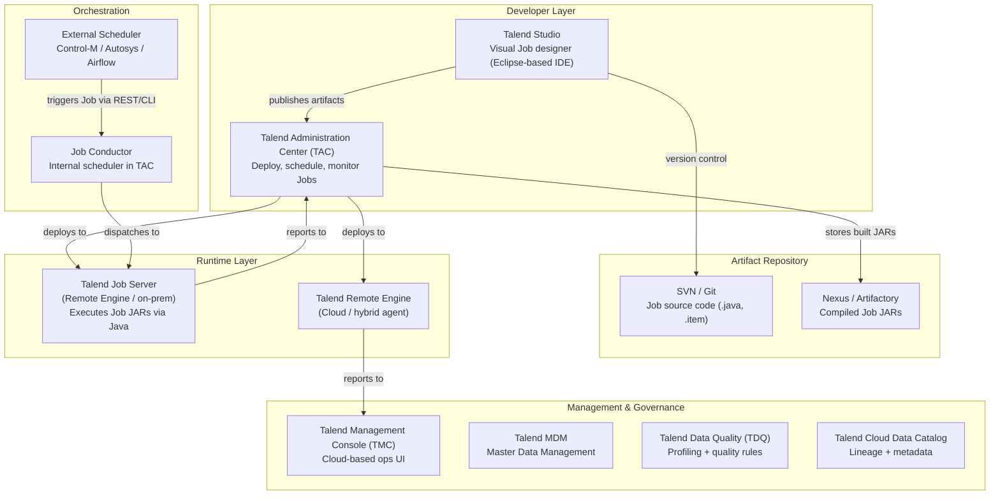

# Talend — SA Migration Guide

**Purpose:** Give a Solution Architect enough depth to assess a Talend estate, understand its moving parts, and map a migration path to Databricks.

This is not a developer guide. You won't be building Talend Jobs. You will be walking customer sites, reviewing architecture diagrams, asking the right questions, and scoping what it takes to move to a modern lakehouse platform.

---

## Architecture Diagrams

### Talend Platform Architecture

How the Talend product suite fits together — from developer tooling through runtime execution to management and governance.

<div class="zd-wrapper" id="talend-arch-zoom" style="position:relative; border:1px solid #ddd; border-radius:6px; overflow:hidden; background:#fafafa;">
<div style="position:absolute; top:8px; right:10px; z-index:10; display:flex; align-items:center; gap:8px; font-size:0.78rem; color:#666;">
  <span>Scroll to zoom · Drag to pan</span>
  <button onclick="zdReset('talend-arch-zoom')" style="padding:2px 8px; font-size:0.75rem; border:1px solid #ccc; border-radius:4px; background:#fff; cursor:pointer;">Reset</button>
</div>
<div class="zd-canvas" style="cursor:grab; user-select:none;">



</div>
</div>

---

### Talend as ETL — Data Flow Between Systems

How Talend sits between source systems and targets in a typical enterprise data pipeline.

<div class="zd-wrapper" id="talend-flow-zoom" style="position:relative; border:1px solid #ddd; border-radius:6px; overflow:hidden; background:#fafafa;">
<div style="position:absolute; top:8px; right:10px; z-index:10; display:flex; align-items:center; gap:8px; font-size:0.78rem; color:#666;">
  <span>Scroll to zoom · Drag to pan</span>
  <button onclick="zdReset('talend-flow-zoom')" style="padding:2px 8px; font-size:0.75rem; border:1px solid #ccc; border-radius:4px; background:#fff; cursor:pointer;">Reset</button>
</div>
<div class="zd-canvas" style="cursor:grab; user-select:none;">



</div>
</div>

<script>

```mermaid
flowchart LR
    subgraph SOURCES["Source Systems"]
        DB[("Relational DB\nOracle / SQL Server / MySQL")]
        FILES["Flat Files\nCSV / JSON / XML / Fixed-width"]
        API["REST / SOAP APIs"]
        MF["Mainframe / Legacy\nvia file extract or JDBC"]
        CLOUD["Cloud SaaS\nSalesforce / SAP / S3"]
    end

    subgraph TALEND["Talend ETL Layer"]
        direction TB
        COMP_IN["Input Components\ntFileInputDelimited · tJDBCInput\ntSalesforceInput · tS3Get"]
        TRANSFORM["Transformation Components\ntMap · tFilterRow · tAggregate\ntSortRow · tJoin · tUnite"]
        DQ_COMP["Data Quality Components\ntDqReportRun · tSchemaComplianceCheck"]
        COMP_OUT["Output Components\ntFileOutputDelimited · tJDBCOutput\ntHiveOutput · tDeltaLakeOutput"]

        COMP_IN --> TRANSFORM
        TRANSFORM --> DQ_COMP
        DQ_COMP --> COMP_OUT
    end

    subgraph TARGETS["Target Systems"]
        DW[("Data Warehouse\nSnowflake / Redshift / Synapse")]
        DATALAKE["Data Lake\nADLS / S3 / HDFS"]
        DELTA["Databricks Lakehouse\nDelta Tables"]
        DOWNSTREAM["Downstream Apps\nvia file or DB"]
    end

    subgraph ORCH["Orchestration"]
        JOBCONDUCTOR["TAC Job Conductor\nor external scheduler"]
    end

    SOURCES --> COMP_IN
    COMP_OUT --> TARGETS
    JOBCONDUCTOR -. schedules .-> TALEND
```

(function(){
  window.zdReset=window.zdReset||function(id){var w=document.getElementById(id);if(!w)return;var c=w.querySelector('.zd-canvas');if(c){c._s=1;c._tx=0;c._ty=0;}var s=w.querySelector('svg');if(s){s.style.transform='translate(0,0) scale(1)';s.style.transformOrigin='0 0';}};
  function initC(c){if(c._zdInit)return;c._zdInit=true;c._s=1;c._tx=0;c._ty=0;var dr=false,sx,sy,stx,sty;function ap(sv){sv.style.transform='translate('+c._tx+'px,'+c._ty+'px) scale('+c._s+')';sv.style.transformOrigin='0 0';sv.style.display='block';}c.addEventListener('wheel',function(e){var sv=c.querySelector('svg');if(!sv)return;e.preventDefault();var r=c.getBoundingClientRect(),mx=e.clientX-r.left,my=e.clientY-r.top,d=e.deltaY<0?1.12:1/1.12,ns=Math.min(5,Math.max(0.4,c._s*d));c._tx=mx-(mx-c._tx)*(ns/c._s);c._ty=my-(my-c._ty)*(ns/c._s);c._s=ns;ap(sv);},{passive:false});c.addEventListener('mousedown',function(e){if(e.button)return;dr=true;sx=e.clientX;sy=e.clientY;stx=c._tx;sty=c._ty;c.style.cursor='grabbing';e.preventDefault();});window.addEventListener('mousemove',function(e){if(!dr)return;c._tx=stx+(e.clientX-sx);c._ty=sty+(e.clientY-sy);var sv=c.querySelector('svg');if(sv)ap(sv);});window.addEventListener('mouseup',function(){if(dr){dr=false;c.style.cursor='grab';}});c.addEventListener('touchstart',function(e){if(e.touches.length===1){dr=true;sx=e.touches[0].clientX;sy=e.touches[0].clientY;stx=c._tx;sty=c._ty;}},{passive:true});c.addEventListener('touchmove',function(e){if(dr&&e.touches.length===1){c._tx=stx+(e.touches[0].clientX-sx);c._ty=sty+(e.touches[0].clientY-sy);var sv=c.querySelector('svg');if(sv)ap(sv);}},{passive:true});c.addEventListener('touchend',function(){dr=false;});}
  function tryW(w){var c=w.querySelector('.zd-canvas');if(!c)return;var sv=c.querySelector('svg');if(!sv){setTimeout(function(){tryW(w);},200);return;}initC(c);}
  function initAll(){document.querySelectorAll('.zd-wrapper').forEach(function(w){tryW(w);});}
  if(document.readyState==='loading'){document.addEventListener('DOMContentLoaded',function(){setTimeout(initAll,600);});}else{setTimeout(initAll,600);}
})();
</script>

---

## Sections

1. [Ecosystem Overview](#1-ecosystem-overview)
2. [Jobs and Components — The Core Building Block](#2-jobs-and-components--the-core-building-block)
3. [Data Formats and Schema](#3-data-formats-and-schema)
4. [Parallelism and Scaling Model](#4-parallelism-and-scaling-model)
5. [Project Structure and Version Control](#5-project-structure-and-version-control)
6. [Orchestration: Job Conductor and TAC](#6-orchestration-job-conductor-and-tac)
7. [Metadata, Lineage, and Impact Analysis](#7-metadata-lineage-and-impact-analysis)
8. [Data Quality with TDQ](#8-data-quality-with-tdq)
9. [Migration Assessment and Artifact Inventory](#9-migration-assessment-and-artifact-inventory)
10. [Migration Mapping to Databricks](#10-migration-mapping-to-databricks)

---

## 1. Ecosystem Overview

### What Is Talend?

Talend is an open-core data integration platform built around a **visual, component-based ETL designer**. It compiles Jobs into standard Java code — a deliberate design choice that sets it apart from tools like Ab Initio or Informatica, which use proprietary runtimes. Customers choose Talend because it was (and is) significantly cheaper than legacy ETL tools, produces code in a standard language, and covers a wide range of connectivity needs out of the box.

The platform spans two product lines:

- **Talend Open Studio** — the free, community version; no server, no scheduler, Job execution is manual
- **Talend Data Fabric / Cloud** — the enterprise suite; adds TAC (Administration Center), Job Server, MDM, Data Quality, and cloud-managed execution

> **SA Tip:** Many mid-market customers started with Open Studio and bolted on the enterprise components over time. What they have in production may be a hybrid: some Jobs scheduled through TAC, others triggered by shell scripts or external schedulers, and some run manually. Ask how Jobs are actually executed day-to-day — don't assume TAC is the full story.

### The Talend Product Suite

Knowing which products a customer uses determines migration scope.

| Product | What It Does | Migration Relevance |
|---------|-------------|---------------------|
| **Talend Studio** | Eclipse-based IDE where developers build Jobs visually | High — all transformation logic lives here as `.item` files |
| **Talend Administration Center (TAC)** | Web UI for deploying, scheduling, and monitoring Jobs | High — source of schedule and deployment configuration |
| **Talend Job Server / Remote Engine** | Runtime agent that executes compiled Job JARs | High — the execution model must be replicated |
| **Talend Management Console (TMC)** | Cloud-based ops UI for Talend Cloud customers | Medium — maps to Databricks Workflows monitoring |
| **Talend Data Quality (TDQ)** | Profiling, quality rules, and DQ reporting | Medium — maps to Databricks Lakehouse Monitoring or DLT expectations |
| **Talend MDM** | Master Data Management — golden record consolidation | High if used — no direct Databricks equivalent; requires bespoke replacement |
| **Talend Cloud Data Catalog** | Metadata, lineage, and data discovery | Medium — maps to Unity Catalog |
| **Talend Big Data** | Spark-native Job execution (generates Spark code instead of Java) | High — understand whether Jobs run in standalone Java or on Spark |

> **SA Tip:** Talend Big Data Jobs generate Spark code that can sometimes be salvaged or accelerated in migration. If the customer is already on Talend Big Data, they have Spark logic — it may be closer to Databricks-ready than standard Java Jobs.

### Why Customers Want to Migrate

| Driver | What It Means for the Engagement |
|--------|----------------------------------|
| **License cost** | Talend Data Fabric / Cloud is expensive at scale — customers want to reduce per-connector and per-Job licensing |
| **Java runtime overhead** | Each Job spins up a JVM — poor performance at scale without Big Data edition |
| **Cloud-native gap** | Not designed for elastic cloud execution; scaling requires provisioning more Job Servers |
| **Talent and maintainability** | Visual Job design is hard to review in code, diff in Git, or test properly |
| **Open Studio end-of-life pressure** | Qlik's acquisition of Talend has introduced roadmap uncertainty |
| **Databricks already in-house** | Customer has adopted the lakehouse and wants to consolidate |

> **SA Tip:** Qlik acquired Talend in 2023. Customers with active Talend contracts are increasingly uncertain about the roadmap. This is a meaningful conversation opener — they may be looking for an exit path regardless of cost.

### Key Discovery Questions

Before scoping a migration, ask:

1. Are they on **Talend Open Studio, Data Fabric, or Talend Cloud**? (determines what infra exists)
2. How many Jobs are in **active production** use? (vs. total Jobs in the repository)
3. Are Jobs written as **standard Java Jobs or Big Data (Spark) Jobs**?
4. How are Jobs **executed** — TAC Job Conductor, external scheduler (Control-M / Autosys), shell scripts, or all of the above?
5. Are there **Job Chains** or parent-child Job relationships?
6. Are **custom Java components** or third-party component libraries (Talend Exchange) in use?
7. Is **Talend MDM** actively used for master data? If so, what processes depend on it?
8. Is **Talend Data Quality** embedded in production pipelines, or used only for profiling?
9. What is the **version control story** — SVN, Git, or none?
10. What are the **SLAs** for critical pipelines?

### What You'll Actually Find

The architecture sections above describe how Talend is *designed* to work. What you encounter on a customer site is usually messier. These are the patterns that come up repeatedly across real Talend environments — know them before the discovery call.

| What You'll Find | Why It Matters |
|-----------------|---------------|
| **Version control is nominal** | Developers check in infrequently, commit messages are meaningless ("fix", "test", "update"), and the version in source control often doesn't match what's actually deployed to the Job Server. Always verify the running JAR version against the repo. |
| **"Zombie" TAC tasks** | TAC Job Conductor has dozens of defined tasks that haven't run in months — or ever. Operators often define a task once and then trigger jobs manually by SSH-ing to the server and running the JAR directly. Scope only what's provably running. |
| **Shell script wrappers everywhere** | A significant number of Jobs are invoked not through TAC but via shell scripts (`.sh` / `.bat`) scheduled in cron or called by an external scheduler. These are invisible to TAC and easy to miss in discovery — always ask ops to show you actual cron entries and Control-M jobs. |
| **Studio is slow and hard to diff** | Talend Studio is Eclipse-based. It's heavyweight, slow on large projects, and `.item` files are XML that produces noisy diffs in Git. This is a persistent developer pain point — use it in the "why migrate" conversation. |
| **Licensing per connector pack** | Talend's enterprise licensing is tied to connector packs — customers pay separately for Salesforce, SAP, mainframe, and cloud storage connectors. Ask which connector packs are licensed and which are actively used. Unused connector licenses are immediate TCO savings talking points. |
| **Mixed standard and Big Data Jobs** | Very few customers are 100% standard Java Jobs or 100% Big Data. Most have a mix — some Jobs were migrated to Big Data for performance, others were never touched. The ratio of Big Data to standard Jobs is the single most important variable in migration scoping. |
| **Open Studio Jobs in production** | Even at Data Fabric customers, some Jobs — often older ones built before the enterprise rollout — were created in Open Studio and still run via shell wrappers. These have no TAC task, no schedule metadata, and no deployment history. |

> **SA Tip:** In the first discovery meeting, ask the ops team (not the developers) to show you the actual job run logs from the past 30 days — in TAC, in cron, and in the external scheduler. This is the fastest way to distinguish active Jobs from dead code and find Jobs that TAC doesn't know about.

---

## 2. Jobs and Components — The Core Building Block

### The Job

In Talend, the **Job** is the fundamental unit of work — equivalent to an Ab Initio graph or an Informatica mapping. A Job is a directed dataflow built visually in Talend Studio by connecting input, transformation, and output components on a canvas.

Behind the scenes, when a Job is built, Talend compiles it to **Java source code** and packages it as a JAR. The execution engine is a standard JVM — no proprietary runtime. This is important for migration: you can inspect what a Job actually does by reading its generated Java.

A typical Talend estate ranges from a few hundred to several thousand Jobs, many of which are inactive.

### Components

A **component** is a single processing step inside a Job. Talend ships with hundreds of built-in components, grouped by connector type and function.

**Core component categories:**

| Category | Examples | What They Do |
|----------|----------|--------------|
| **File I/O** | `tFileInputDelimited`, `tFileOutputDelimited`, `tFileInputJSON`, `tFileOutputXML` | Read and write flat files |
| **Database** | `tJDBCInput`, `tOracleInput`, `tMysqlOutput`, `tSnowflakeOutput` | JDBC-based DB read/write |
| **Cloud / SaaS** | `tS3Get`, `tSalesforceInput`, `tAzureBlobInput`, `tDeltaLakeOutput` | Cloud storage and SaaS connectors |
| **Transform** | `tMap`, `tFilterRow`, `tAggregateRow`, `tSortRow` | Core data transformation |
| **Join** | `tJoin`, `tDenormalize`, `tNormalize` | Dataset joining and reshaping |
| **Flow control** | `tFlowMeter`, `tLogRow`, `tWarn`, `tDie` | Logging, metrics, error handling |
| **Orchestration** | `tRunJob`, `tPreJob`, `tPostJob` | Calling sub-Jobs, setup and teardown |
| **Data Quality** | `tDqReportRun`, `tSchemaComplianceCheck` | Inline DQ checks |
| **Big Data** | `tHiveInput`, `tSparkConfiguration`, `tAzureHDInsightConfiguration` | Spark/Hadoop connectivity |

### The tMap Component

The `tMap` is the **most important component in Talend** for migration purposes. It is a multi-input, multi-output transformation editor that handles:

- **Joins** between multiple input flows
- **Field mapping** — expressions that define how source fields map to output fields
- **Filtering** — row-level conditions
- **Multiple output flows** — one main output plus reject flows

Almost every non-trivial Job contains at least one `tMap`. The logic inside a `tMap` is written in **Java expressions** — not SQL, not Python. This is the primary migration complexity driver.

> **SA Tip:** The `tMap` is where most business logic lives, and it's the hardest thing to migrate. A Job with a single `tMap` containing 50 field expressions and 3 output flows is not a simple Job. When inventorying, always open the `tMap` editor and look at expression complexity — not just component count.

### Subjobs and Row Links

Within a Job, components are connected by **row links** (data flows) and **trigger links** (control flows):

| Link Type | What It Does |
|-----------|-------------|
| **Main row link** | Carries a stream of records between components |
| **Reject row link** | Routes records that failed processing to a separate component |
| **Iterate link** | Repeats a component for each record (like a for-each loop) |
| **OnSubjobOk / OnSubjobError** | Trigger link — runs the next component group on success or failure |
| **OnComponentOk / OnComponentError** | Trigger link at the individual component level |

A **subjob** is a visual grouping of components connected by row and trigger links. A Job can contain multiple subjobs that execute sequentially or in parallel depending on trigger link wiring.

### Job Chains — tRunJob

The `tRunJob` component calls another Job as a child, passing parameters. This is the primary reuse mechanism — a parent Job orchestrates multiple child Jobs. Understanding the `tRunJob` dependency tree is essential for scoping: the real complexity is in the full chain, not a single Job.

---

## 3. Data Formats and Schema

### How Talend Describes Data: Schemas

Every component in Talend has a **schema** — a definition of the columns (fields) flowing in or out, including name, type, length, nullable, and default value. Schemas are defined inline in the component editor or stored as shared **metadata** in the repository.

Unlike Ab Initio's DML files, Talend schemas are embedded in the component configuration, not separate schema files. This makes them easier to read but harder to inventory programmatically.

**Talend data types:**

| Talend Type | Java Type | Databricks / Delta Equivalent |
|-------------|-----------|-------------------------------|
| `String` | `String` | `StringType` |
| `Integer` | `int` | `IntegerType` |
| `Long` | `long` | `LongType` |
| `Double` | `double` | `DoubleType` |
| `Float` | `float` | `FloatType` |
| `Boolean` | `boolean` | `BooleanType` |
| `Date` | `java.util.Date` | `DateType` / `TimestampType` |
| `BigDecimal` | `BigDecimal` | `DecimalType(p,s)` |
| `byte[]` | `byte[]` | `BinaryType` |
| `Document` (XML/JSON) | `org.dom4j.Document` | `StringType` or `VariantType` |

> **SA Tip:** Talend's `Date` type is backed by `java.util.Date`, which has millisecond precision. Date format patterns in `tMap` expressions (e.g., `TalendDate.parseDate("yyyy-MM-dd", value)`) are Java SimpleDateFormat — not SQL or Python. When migrating date logic to PySpark, verify format string compatibility carefully.

### Repository Metadata

In the enterprise edition, Talend Studio has a **Metadata** section in the repository tree where shared objects are defined once and reused across Jobs:

| Metadata Object | What It Is | Migration Relevance |
|-----------------|-----------|---------------------|
| **DB Connection** | Named JDBC connection with host/port/credentials | Maps to Databricks secrets + JDBC config |
| **File/Directory** | Named file path definition | Maps to ADLS/S3 path configuration |
| **Generic Schema** | Reusable schema definition shared across Jobs | Maps to Delta table schema |
| **Context** | Named parameter group (dev/QA/prod values) | Maps to Databricks Job parameters or environment config |

### Context Variables

**Context variables** are Talend's parameterization mechanism. A Context is a set of named variables (e.g., `db_host`, `file_path`, `run_date`) with environment-specific values for dev, QA, and prod. Components reference context variables using `context.variable_name`.

Context groups are stored in the repository and applied at runtime — similar to Databricks Job parameters or environment-specific config files.

> **Migration relevance:** Document all context variables and their per-environment values. These become Databricks Job parameters, Databricks secrets (for credentials), or environment-specific YAML configs. Missing a context variable during migration causes silent failures.

### Supported File Formats

Talend natively reads and writes all standard formats. No proprietary intermediate format is used.

| Format | Components | Migration Note |
|--------|-----------|----------------|
| CSV / Delimited | `tFileInputDelimited`, `tFileOutputDelimited` | Direct — `spark.read.csv()` |
| Fixed-width | `tFileInputPositional` | Requires schema definition during migration |
| JSON | `tFileInputJSON`, `tExtractJSONFields` | Direct — `spark.read.json()` |
| XML | `tFileInputXML`, `tExtractXMLField` | Moderate — use `spark.read.format("xml")` or custom parsing |
| Parquet | `tParquetInput`, `tParquetOutput` | Direct — native Spark format |
| Avro | `tAvroInput`, `tAvroOutput` | Direct — `spark.read.format("avro")` |
| Excel | `tFileInputExcel` | Use `spark.read` with appropriate library |

---

## 4. Parallelism and Scaling Model

### How Standard Talend Jobs Scale

Standard Talend Jobs (non-Big Data edition) run as **single-threaded Java processes** on the Job Server. Parallelism within a Job is achieved through:

- **Multiple subjobs** running concurrently (if trigger links allow)
- **tParallelize** component — splits a data flow into parallel threads within the same JVM
- **Multiple Job Server instances** — different Jobs run on different servers; horizontal scale-out by deploying more servers

This is fundamentally different from Databricks — standard Talend has no Spark cluster, no distributed shuffle, and no dynamic resource scaling. Performance is bounded by the single JVM's memory and the Job Server's CPU.

> **SA Tip:** When a customer says their Talend Jobs are "slow," this is usually why — they're running large data volumes through a single Java process. Right-sizing the Databricks cluster will often deliver order-of-magnitude performance improvement without any code optimization. Use this as a TCO and performance narrative.

### Talend Big Data Jobs — The Fork That Changes Everything

**Ask this question first, before any other scoping:** *"Are your Jobs standard Java Jobs or Big Data (Spark) Jobs?"* The answer bifurcates the entire migration approach.

Customers on the **Talend Big Data** edition can configure Jobs to run on a Spark cluster (on-prem YARN, AWS EMR, Azure HDInsight, or Databricks). In this mode:

- Talend Studio generates **Spark code** (Scala or Java Spark API) instead of plain Java
- A `tSparkConfiguration` or `tAzureDatabricksConfiguration` component provides cluster connection details
- Components like `tHiveInput`, `tSparkOutput`, and `tMap` generate Spark-native operations

The migration effort is fundamentally different depending on which mode a Job uses:

| Job Type | What Migration Looks Like | Relative Effort |
|----------|--------------------------|-----------------|
| **Standard Java Job** | Full rewrite — every `tMap`, Routine, and component must be re-implemented in PySpark or SQL | High |
| **Big Data Job on YARN / EMR / HDInsight** | Repoint cluster config (`tSparkConfiguration` → Databricks cluster); validate Spark logic still works | Low–Medium |
| **Big Data Job already on Databricks** | Remove Talend Studio as the orchestration layer; the execution logic is already running on Databricks | Low — dependency elimination only |

> **SA Tip:** If the customer is already running Talend Big Data Jobs on Databricks, you're not migrating a workload — you're eliminating a license. The pitch is: "You're paying Talend to be an IDE wrapper around Databricks. Let's cut the wrapper." That's a very different conversation than a full ETL replatform, and it's a much easier win to scope and close.

### Parallelism Mechanisms Summary

| Mechanism | Where It Applies | Databricks Equivalent |
|-----------|-----------------|----------------------|
| Single-threaded Java Job | Standard Jobs | Not relevant — Databricks is inherently distributed |
| `tParallelize` | Multi-thread within JVM | Spark native parallelism — no explicit configuration needed |
| Multiple Job Servers | Horizontal scale-out | Databricks cluster auto-scaling |
| Talend Big Data (Spark) | Big Data Jobs | Native Databricks notebook or DLT pipeline |
| Partitioned file reads | Reading multiple files in parallel | `spark.read` with wildcard — automatic |

---

## 5. Project Structure and Version Control

### Studio Repository Structure

Talend Studio organizes artifacts in a **repository** stored in a project directory. The tree structure in the Studio UI reflects folders on disk:

```
Talend Project
 ├── Job Designs
 │     ├── /ETL/Finance/customer_load
 │     ├── /ETL/Finance/account_rollup
 │     └── /ETL/HR/employee_sync
 ├── Metadata
 │     ├── DB Connections
 │     ├── File/Directory
 │     └── Generic Schemas
 ├── Context
 │     ├── DEV
 │     ├── QA
 │     └── PROD
 ├── Code
 │     └── Routines (custom Java utility classes)
 └── Documentation
```

Each Job is stored as an `.item` file (XML format) alongside generated Java source. The project directory is what gets version-controlled.

### Version Control

Talend supports SVN and Git for version control, but adoption varies widely:

| State | What It Means |
|-------|--------------|
| **No version control** | Jobs are on a shared drive or a single developer's machine — common in Open Studio environments |
| **SVN** | Legacy setup — can export history, but no branching culture |
| **Git** | Better — Jobs have commit history; can use `git log` to identify active vs. dormant Jobs |

> **SA Tip:** In many Talend environments, version control is nominal — developers commit infrequently, commit messages are meaningless, and the "production" version may not match what's in the repository. Always ask the team to show you the actual Job JARs deployed to the Job Server and compare to what's in source control. The delta is often significant.

### Environments and Promotion

Talend uses **Context groups** for environment separation (dev / QA / prod connection strings, file paths, etc.) rather than full environment-specific artifacts. Promotion from dev to prod means:

1. Export the Job as a ZIP or publish to TAC
2. Deploy to the target Job Server
3. Apply the correct Context group at runtime

This is simpler than Ab Initio's EME but also less governed. There is no enforced approval gate unless a CI/CD pipeline has been built around TAC's REST API.

### Key Artifact Types

When inventorying a Talend estate, these are the artifact types you will encounter. Everything in the first block lives inside the Studio project directory and is version-controlled (or should be). Everything in the second block is runtime infrastructure.

**Design-time artifacts (in the Studio repository / Git):**

| Artifact | File Extension | What It Contains |
|----------|---------------|-----------------|
| **Job** | `.item` | XML definition of the entire Job — component configuration, row links, trigger links, schema definitions, and tMap expressions; the primary migration target |
| **Context Group** | `.item` (type: context) | Named set of environment-specific variables (dev / QA / prod values for DB hosts, file paths, run dates); referenced as `context.variable_name` inside Jobs |
| **Routine** | `.java` | Custom Java utility class with reusable helper methods — called from `tMap` expressions; equivalent of Ab Initio's `.xfr` transform; the second-highest migration effort item after tMap |
| **Generic Schema** | `.item` (type: schema) | Reusable column definition (field names, types, lengths) shared across multiple Jobs — changes here ripple to every Job that references it |
| **DB Connection** | `.item` (type: metadata) | Named JDBC connection definition — host, port, database, driver class; referenced by `tJDBCInput`, `tOracleInput`, etc. |
| **File Metadata** | `.item` (type: metadata) | Named file or directory path definition with associated schema — referenced by file input/output components |
| **Job Script (wrapper)** | `.sh` / `.bat` | Shell script that invokes the compiled Job JAR directly (`java -jar JobName_run.jar`); used when Jobs are triggered outside TAC via cron or external scheduler |
| **pom.xml** | `.xml` | Maven build descriptor — present in CI/CD-enabled projects; defines how Jobs are compiled and packaged into JARs; absent in older or Open Studio environments |
| **talend.project** | `.project` | Eclipse project descriptor — metadata about the Studio project itself; not migration-relevant but needed to open the project in Studio |

**Runtime artifacts (produced at build/deploy time, not in source control):**

| Artifact | File Extension | What It Contains |
|----------|---------------|-----------------|
| **Compiled Job JAR** | `.jar` | The executable artifact deployed to the Job Server — compiled from the `.item` definition; what actually runs in production |
| **Job Properties file** | `.properties` | Key-value config file bundled with the JAR — contains default parameter values and classpath entries; sometimes modified directly in production (a red flag for drift) |
| **TAC Task Definition** | (stored in TAC DB) | Schedule, target Job Server, Context group override, and execution history for a deployed Job — lives in TAC's internal database, not in source control |
| **Job Chain Definition** | (stored in TAC DB) | Ordered sequence of TAC tasks with dependency and trigger rules — the orchestration configuration for a pipeline; must be exported from TAC separately during inventory |
| **Execution Log** | `.log` / TAC UI | Per-run stdout/stderr from the Job JVM — stored on the Job Server filesystem or viewable in TAC; the first place to look when diagnosing failures |

> **SA Tip:** The `.item` file is XML and technically readable in any text editor, but it's dense and not human-friendly. During discovery, ask developers to walk you through Jobs in Studio — it's far faster than reading raw XML. For inventory purposes, parsing `.item` files programmatically (grep for component names, tRunJob references, context variable usage) is more practical than opening each one manually.

---

## 6. Orchestration: Job Conductor and TAC

### Talend Administration Center (TAC)

TAC is the web-based management layer for enterprise Talend. It handles deployment, scheduling, monitoring, and user management. The key orchestration component within TAC is the **Job Conductor**.

### Job Conductor — The Internal Scheduler

**Job Conductor** lets users define **tasks** — a named execution of a Job with a schedule, a target Job Server, and a Context group. Tasks can be chained into **Job Chains**.

| Concept | Description | Databricks Equivalent |
|---------|-------------|----------------------|
| **Task** | A scheduled execution of a single Job | Databricks Workflow task |
| **Job Chain** | A sequence of tasks with dependencies | Databricks Workflow (multi-task) |
| **Trigger** | Time-based schedule (cron) or manual | Workflow scheduled trigger |
| **Context override** | Per-run parameter overrides | Databricks Job run parameters |
| **Execution server** | Target Job Server for the task | Databricks cluster / job cluster |
| **Log/History** | Run history in TAC | Workflow run history |

### Job Chain Example

A typical nightly batch in Job Conductor:

```
Job Chain: NIGHTLY_FINANCE_LOAD
  Task 1: Extract_GL_Source         (no dependency — runs first)
  Task 2: Validate_GL_Records       (runs after Task 1 success)
  Task 3: Load_GL_Warehouse         (runs after Task 2 success)
  Task 4: Archive_Source_Files      (runs after Task 3 success)
  Task 5: Alert_On_Failure          (runs if any prior task fails)
```

This maps directly to a Databricks Workflow with sequential task dependencies and an `on_failure` notification.

### External Schedulers

Many enterprise Talend environments use an **external enterprise scheduler** (BMC Control-M, Autosys, IBM TWS) to trigger Talend Jobs rather than — or in addition to — Job Conductor. The common patterns:

- External scheduler calls a **shell script** that invokes the Job JAR directly
- External scheduler calls the **TAC REST API** to trigger a task
- External scheduler manages cross-system dependencies; TAC handles intra-Talend sequencing

> **Migration relevance:** If the customer uses an external scheduler, the migration has two layers: replacing Job Conductor chains with Databricks Workflows, AND replacing or integrating with the external scheduler. This is frequently underestimated in scoping.

### Talend Cloud / TMC

Customers on **Talend Cloud** use the **Talend Management Console (TMC)** instead of TAC. TMC provides the same scheduling and monitoring capabilities in a SaaS model. Jobs run on **Remote Engines** — lightweight agents deployed in the customer's cloud environment that pull Job execution instructions from TMC.

---

## 7. Metadata, Lineage, and Impact Analysis

### What Metadata Talend Holds

Talend's metadata lives in two places: the **Studio repository** (for design-time metadata) and the **Talend Cloud Data Catalog** (for enterprise lineage, if licensed).

**Design-time metadata in Studio repository:**

| Metadata Type | What It Covers |
|---------------|---------------|
| **Job definitions** | Component configuration, schemas, row links, context references |
| **Shared schemas** | Reusable column definitions referenced by multiple Jobs |
| **DB connections** | Source/target system definitions |
| **Context variables** | Parameter names and per-environment values |
| **Routines** | Custom Java code used as UDFs across Jobs |
| **Job documentation** | Optional HTML documentation generated from Job metadata |

### Talend Cloud Data Catalog

The **Talend Cloud Data Catalog** (licensed separately) provides:

- **Automated lineage** — traces data from source to target across Jobs
- **Data dictionary** — business glossary linked to technical metadata
- **Impact analysis** — shows which Jobs read from or write to a given dataset

> **SA Tip:** Most mid-market Talend customers don't have the Data Catalog licensed. Lineage must be reconstructed manually from Job `.item` files or by parsing generated Java. Ask upfront whether the catalog is available and populated — if it is, treat it as gold for scoping.

### Impact Analysis Without the Catalog

Without the Data Catalog, impact analysis requires inspecting Jobs directly:

1. **Search `.item` files** for references to a shared schema, routine, or DB connection name
2. **Parse generated Java** to find which source tables and target tables a Job reads/writes
3. **Review TAC Job Chains** to understand execution dependencies
4. **Grep Studio repository** for `tRunJob` component entries to map parent-child Job relationships

This is manual work — build time into the assessment for it.

### Lineage Gaps Common in Talend Environments

| Gap | Cause |
|-----|-------|
| **Shell script invocations** | Jobs called via `tSystem` or shell wrappers break lineage tracing |
| **Dynamic file paths** | Paths built from context variables — actual dataset unknown until runtime |
| **External DB writes outside Talend** | Downstream processes that read Talend outputs but aren't Jobs |
| **Undocumented Routines** | Custom Java called from `tMap` that transforms data without a Talend component footprint |

---

## 8. Data Quality with TDQ

### What Talend Data Quality Does

**Talend Data Quality (TDQ)** is a separate product within the Talend suite that provides:

- **Data profiling** — column statistics, value distributions, null rates, pattern analysis
- **Quality rules** — reusable business rules (e.g., "email must match regex", "amount must be > 0")
- **DQ reporting** — run history, pass/fail rates, trend dashboards
- **Indicators** — statistical measures applied to a column across a dataset

TDQ rules are surfaced in two ways:

1. **Standalone analysis** — run against a dataset outside any Job (profiling / discovery use case)
2. **Embedded in a Job** — using `tDqReportRun` or `tSchemaComplianceCheck` components that invoke TDQ rules inline during pipeline execution

### Inline Data Quality in Jobs

| Component | What It Does | Databricks Equivalent |
|-----------|-------------|----------------------|
| `tSchemaComplianceCheck` | Validates record structure and types against a schema | Delta Live Tables `expect()` / `expect_or_drop()` |
| `tDqReportRun` | Runs a named TDQ analysis report on a dataset | Databricks Lakehouse Monitoring scheduled analysis |
| `tFilterRow` (as DQ gate) | Filters rows based on business rules — valid rows go forward, invalid to reject | DLT `expect_or_drop()` + quarantine table |
| Reject flow | Routes invalid records to a separate output (file, DB table) | DLT dead letter table / quarantine pattern |

> **Migration relevance:** Embedded quality checks in Jobs are business logic — they must be migrated, not skipped. Document every `tSchemaComplianceCheck` and reject-flow pattern during inventory. These map to DLT expectations or Great Expectations in Databricks.

### Standalone TDQ Profiles

TDQ profiling reports are valuable during migration assessment — they give you a baseline understanding of data quality before migration. If customers have regular profiling runs, request the reports as inputs to the migration design. They help define **data reconciliation criteria** for validating that Databricks output matches Talend output post-migration.

---

## 9. Migration Assessment and Artifact Inventory

### The Goal of the Assessment

Before a single Databricks notebook is written, you need a **migration inventory** — a structured catalog of every active Job, its complexity, its dependencies, and its risk factors.

A good inventory answers:
- How many Jobs are in active production use (vs. total in the repository)?
- Which Jobs are complex and which are straightforward?
- What are the dependency chains and what order must they migrate in?
- What are the risks unique to this Talend environment?

### Step 1: Extract the Job List

Start with the Studio repository or TAC:

```
For each Job in the repository:
  - Name, folder path, last-modified date
  - Whether it appears in a TAC task or Job Chain (active indicator)
  - Number of components
  - Number of tMap components
  - Whether it contains tRunJob (parent Job indicator)
  - Referenced Context groups
  - Referenced Routines
```

**Filter immediately:** Jobs that have never been deployed to TAC and have not been modified in 12+ months are likely dead code. Confirm with the team before including them in scope.

### Step 2: Score Complexity

For each active Job, score its complexity:

| Factor | Low (1) | Medium (2) | High (3) |
|--------|---------|-----------|---------|
| Component count | < 10 | 10–30 | > 30 |
| tMap expressions | < 5 fields | 5–20 fields | > 20 fields or nested logic |
| Output flows | 1 (main only) | 2 (main + reject) | 3+ (multiple outputs) |
| tRunJob dependencies | None | 1–2 child Jobs | > 2 child Jobs |
| Custom Routines | None | 1–2 Routines | > 2 Routines |
| Big Data / Spark | No | Mixed (some components) | Full Big Data Job |
| External system calls | None | 1 DB or API | Multiple / mainframe / SAP |

Sum the scores: Low (7–10) = lift-and-shift candidate. High (17–21) = re-engineering required.

### Step 3: Map Dependencies

Build a dependency graph:
- Which Jobs call other Jobs via `tRunJob`?
- Which Jobs share Routines?
- Which Jobs share DB Connections or Schemas from the repository?
- Which TAC Job Chains sequence which Jobs?

Groups of tightly coupled Jobs (shared Routines, parent-child `tRunJob` chains) should be migrated together as a unit.

### Step 4: Identify Risk Areas

| Risk | Indicator | Mitigation |
|------|-----------|-----------|
| **Complex tMap logic** | tMap with > 20 expressions, joins, and multiple outputs | Rewrite as PySpark DataFrame operations — highest effort per component |
| **Custom Routines** | `.java` Routine files with business logic | Rewrite as PySpark UDFs or SQL functions |
| **tSystem calls** | Jobs invoking shell commands via `tSystem` | Replace with Databricks notebook or REST API call |
| **Talend MDM dependency** | Jobs reading/writing MDM golden records | MDM has no direct Databricks equivalent — scope as separate workstream |
| **External scheduler** | Control-M / Autosys triggering Jobs | Scope scheduler integration or migration separately |
| **Dynamic context-driven paths** | File paths or DB names built from context at runtime | Audit and document all context variable permutations |
| **Big Data Jobs on non-Databricks Spark** | Jobs targeting EMR, HDInsight, or YARN | Repoint cluster configuration — lower effort than full rewrite |
| **XML processing** | Heavy use of `tExtractXMLField` or `tFileInputXML` | Validate Spark XML handling — edge cases exist |

### Step 5: Define Migration Waves

Organize Jobs into waves based on dependency order and complexity:

- **Wave 1:** Simple, standalone Jobs (single tMap, no Routines, no tRunJob) — quick wins that prove the pattern
- **Wave 2:** Jobs with shared Routines and repository schemas, moderate tMap complexity
- **Wave 3:** Job Chains with parent-child `tRunJob` dependencies; medium Routine usage
- **Wave 4 (if applicable):** MDM-integrated Jobs, heavy XML processing, external scheduler dependencies, or Big Data Jobs on non-Databricks clusters

---

## 10. Migration Mapping to Databricks

### The Core Principle

Standard Talend Jobs are single-JVM, single-threaded, and procedural. Databricks is distributed, declarative, and built for columnar operations. The migration is not just translation — it is a re-architecture of the execution model. Help customers understand: the performance gains are significant, but the rewrite effort is proportional to `tMap` complexity and Routine usage.

### Building Block Mapping

| Talend Concept | Databricks Equivalent | Notes |
|----------------|----------------------|-------|
| **Job (.item)** | Notebook / Python script / DLT pipeline | One Job ≈ one Databricks task or DLT pipeline |
| **Component** | PySpark transformation / SQL transform | Built-in components map to native Spark operations |
| **tMap** | PySpark `join()` + `select()` + `filter()` | The core rewrite target — complexity varies widely |
| **Routine (.java)** | PySpark UDF / SQL function | Register as named function in Unity Catalog |
| **Context variable** | Databricks Job parameter / Widget / secret | Credentials → Databricks Secrets; paths → Job params |
| **Repository DB Connection** | Databricks secrets + JDBC config | Centralize in Unity Catalog or secrets scope |
| **Generic Schema** | Delta table schema / StructType | Define in SQL or Python; enforce via Delta constraints |
| **tRunJob (child Job)** | Databricks Workflow task dependency / `%run` | Modularize with Workflow multi-task or shared notebooks |
| **Job Script (shell wrapper)** | Databricks CLI / REST API call | Replace with Workflow trigger or API-based invocation |
| **Big Data Job (Spark)** | Native Databricks notebook or DLT pipeline | Often lowest migration effort — Spark logic is reusable |

### Component-Level Mapping

| Talend Component | PySpark / SQL Equivalent |
|-----------------|--------------------------|
| `tMap` (join) | `df.join(other, on=..., how=...)` |
| `tMap` (field expression) | `df.withColumn()` / `select()` with expressions |
| `tFilterRow` | `df.filter()` / `df.where()` |
| `tAggregateRow` | `df.groupBy().agg()` |
| `tSortRow` | `df.orderBy()` |
| `tJoin` | `df.join()` |
| `tDenormalize` | `df.groupBy().agg(collect_list())` |
| `tNormalize` | `df.withColumn(..., explode(...))` |
| `tUnite` | `df.unionByName()` |
| `tFileInputDelimited` | `spark.read.csv(path, schema=..., sep=...)` |
| `tFileOutputDelimited` | `df.write.csv(path)` |
| `tFileInputJSON` | `spark.read.json(path)` |
| `tParquetInput` | `spark.read.parquet(path)` |
| `tParquetOutput` | `df.write.parquet(path)` |
| `tJDBCInput` | `spark.read.jdbc(url, table, properties=...)` |
| `tJDBCOutput` | `df.write.jdbc(url, table, properties=...)` |
| `tSnowflakeInput` | Databricks Snowflake connector |
| `tS3Get` / `tS3Put` | `spark.read` / `df.write` on `s3://` path |
| `tSchemaComplianceCheck` | DLT `expect()` / `expect_or_drop()` |
| `tLogRow` | `df.show()` / logging in notebook |
| `tRunJob` | Databricks Workflow task dependency |
| `tSystem` | `subprocess` in Python task / Databricks REST API |

### Orchestration Mapping

| Talend Concept | Databricks Equivalent |
|----------------|----------------------|
| **TAC Job Conductor Task** | Databricks Workflow task |
| **Job Chain** | Databricks Workflow (multi-task) |
| **Task dependency (success)** | Task dependency in Workflow |
| **Context group (per-environment)** | Databricks Job parameters + environment-specific clusters |
| **Cron trigger** | Workflow scheduled trigger (cron expression) |
| **Manual trigger** | Workflow manual run / `dbutils.notebook.run()` |
| **TAC REST API trigger** | Databricks Jobs REST API (`POST /api/2.1/jobs/run-now`) |
| **External scheduler (Control-M)** | Keep external scheduler + Databricks Jobs API, or migrate to Workflows |
| **TMC (Talend Cloud)** | Databricks Workflows + Databricks Asset Bundles for deployment |

### Metadata and Governance Mapping

| Talend Concept | Databricks Equivalent |
|----------------|----------------------|
| **Studio repository** | Git repository + Unity Catalog |
| **Job Design folder hierarchy** | Git folder structure + Databricks workspace folders |
| **Context groups** | Databricks Job parameters + Databricks Secrets |
| **Shared Repository Schema** | Unity Catalog table schema |
| **Routine** | Unity Catalog SQL function / Python UDF |
| **Talend Cloud Data Catalog** | Unity Catalog (lineage, metadata, discovery) |
| **TAC deployment history** | Databricks Asset Bundles CI/CD pipeline |
| **Job documentation** | Notebook markdown cells + Unity Catalog table comments |

### Data Quality Mapping

| Talend Concept | Databricks Equivalent |
|----------------|----------------------|
| **tSchemaComplianceCheck** | Delta Live Tables `expect()` |
| **tFilterRow (as DQ gate)** | DLT `expect_or_drop()` |
| **Reject flow** | DLT quarantine table (dead letter pattern) |
| **TDQ quality rule** | DLT expectation / Great Expectations rule |
| **TDQ profiling report** | Databricks Lakehouse Monitoring |
| **TDQ trend dashboard** | Lakehouse Monitoring alert and metrics dashboard |

### What Doesn't Map Cleanly

These Talend capabilities require deliberate re-engineering — not just translation:

| Challenge | Why It's Hard | Approach |
|-----------|--------------|---------|
| **Complex tMap with multi-output** | tMap can join multiple inputs AND produce multiple outputs simultaneously — no single Spark operation does this | Decompose into sequential `join()` + multiple filtered `write()` operations; or use DLT multi-dataset pipeline |
| **Custom Java Routines** | Business logic in Java — must understand semantics before rewriting | Reverse-engineer each Routine; rewrite as PySpark UDF or SQL function; unit test against Talend output |
| **Talend MDM** | No Databricks equivalent for master data management | Scope as separate workstream — options include Delta-based golden record pattern, or third-party MDM on top of Databricks |
| **tSystem shell calls** | Jobs invoke arbitrary shell commands — breaks Databricks execution model | Replace with Python `subprocess`, REST API calls, or Databricks notebook tasks depending on intent |
| **XML-heavy pipelines** | `tExtractXMLField` uses XPath logic inside Java — Spark XML support has edge cases | Validate with actual data samples; consider converting to JSON upstream if XML source is controllable |
| **Big Data Jobs on non-Databricks Spark** | Jobs written for YARN/EMR have cluster-specific config (Hive metastore, HDFS paths) | Repoint to Databricks cluster config — lower effort than a full rewrite, but needs validation |
| **Dynamic context-driven logic** | Some Jobs use context variables in SQL fragments or file paths assembled at runtime | Map all runtime permutations before migrating — a single Job may behave as N different pipelines |
