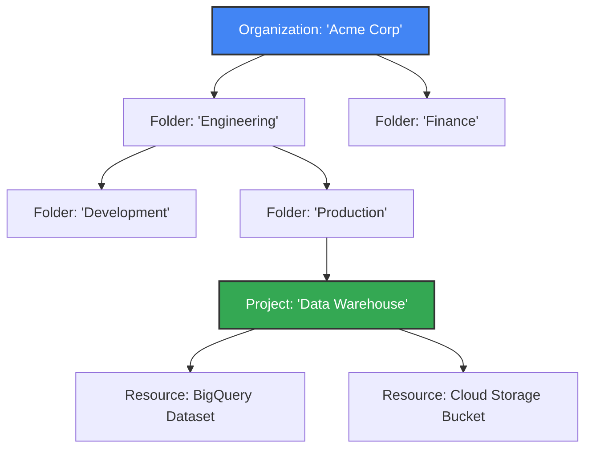

# GCP Fundamentals and Resource Hierarchy

### Section at a Glance
**What you'lllearn:**
- The structural anatomy of Google Cloud (Organization, Folders, Projects, Resources).
- How IAM policies and security configurations inherit down the hierarchy.
- Strategies for designing a scalable resource hierarchy for enterprise governance.
- The relationship between Billing Accounts and Projects.
- How to use the hierarchy to enforce cost controls and data isolation.

**Key terms:** `Organization` · `Folder` · ``Project`` · `Resource` · `IAM Inheritance` · `Billing Account`

**TL;DR:** Google Cloud uses a hierarchical structure to manage resources, where policies applied at the top (Organization) flow down to the bottom (Resources), allowing for centralized control and decentralized execution.

---

### Overview
For any enterprise, the primary challenge of cloud adoption isn't just technical—it is **governance**. Without a structured approach, cloud environments quickly descend into "resource sprawl," where orphaned VMs, unmonitored BigQuery datasets, and unmanaged permissions create massive security holes and "bill shock."

The GCP Resource Hierarchy solves this by providing a single, unified tree structure. This structure allows a central IT or Security team to define "guardrails" (e.g., "No one in the Dev folder can create external IP addresses") while allowing individual engineering teams the autonomy to manage their own projects and resources.

In this section, we lay the foundation for everything else in the course. As a Data Engineer, understanding this hierarchy is critical because your data pipelines, BigQuery datasets, and Pub/Sub topics do not exist in a vacuum; they live within a hierarchy that dictates who can see them, how much they cost, and how they are protected from accidental deletion.

---

### Core Concepts

The GCP hierarchy is organized into four primary levels, moving from the most general to the most specific.

#### 1. The Organization Resource
The root node of the hierarchy. It represents your entire company. It is tied to a Google Workspace or Cloud Identity domain.
*   **Function:** Acts as the central point for all security and compliance policies.
*   **Governance:** This is where you apply "Organization Policy Constraints" (e.g., restricting which regions can be used).
*   📌 **Must Know:** If you do not have an Organization resource, you are likely operating in "unmanaged" mode, which makes enterprise-grade governance nearly impossible.

#### 2. Folders
Folders are logical groupings used to organize projects. You can nest folders within folders to mirror your company's departmental or environmental structure.
*   **Use Case:** A common pattern is to have a `Production` folder and a `Development` folder, or folders for `Marketing` and `Engineering`.
*   ⚠️ **Warning:** While folders are powerful for organization, deeply nested hierarchies can make debugging IAM permissions incredibly complex. Avoid "folder sprawl."

#### 3. Projects
The fundamental unit of isolation in GCP. Every resource you create (a BigQuery dataset, a Cloud Storage bucket, a Compute Engine VM) **must** belong to a project.
*   **API Management:** APIs (like the BigQuery API) are enabled at the project level.
*   **Identity & Access:** IAM permissions are most granularly managed here, but they are also inherited from above.
*   💡 **Tip:** Think of a project as a "container for a specific application or workload."

#### 4. Resources
The actual "things" you use: BigQuery tables, Cloud Storage buckets, Pub/Sub topics, etc.
*   **Inheritance:** Resources inherit all permissions and policies from their parent Project, Folder, and Organization.

---

### Architecture / How It Works

The following diagram illustrates the flow of policy inheritance from the top-level Organization down to the individual Resource.



1.  **Organization:** The root node where global security guardrails are applied.
2.  **Folders:** Middle-tier containers used to group projects by department or lifecycle stage.
3.  **Projects:** The operational boundary where APIs are enabled and billing is tracked.
4.  **Resources:** The leaf nodes where actual data and compute reside.

---

### Comparison: When to Use What (Folder Strategies)

| Strategy | Best For | Trade-offs | Approx. Cost Signal |
| :--- | :--- | :--- | :---|
| **Flat Structure** | Small startups or single-team setups. | Low complexity, but harder to scale as the company grows. | Low management overhead. |
| **Departmental Hierarchy** | Mid-to-large enterprises with distinct business units (e.g., HR, Finance). | Excellent isolation; allows departments to manage their own budgets. | High visibility into BU spending. |
| **Environment-Based Hierarchy** | Highly regulated industries (e.g., Banking) requiring strict Dev/Prod separation. | Maximum security; prevents "accidental" changes to production. | Higher complexity in managing cross-env access. |

**How to choose:** Start with a Departmental or Environment-based structure if you have more than one team or a clear distinction between "Testing" and "Live" data.

---

### Cost Cheat Sheet

| Scenario | Recommended Option | Key Cost Driver | Watch Out For |
| :--- | :--- | :--- | :--- |
| **Tracking Dept Spend** | Separate Folders per Dept | Project-level usage | Overlapping projects in multiple folders. |
| **Managing Dev/Prod** | Separate Projects per Env | Resource duplication | Using Prod-sized VMs in Dev. |
| **Centralized Logging** | Centralized Log Project | Data ingestion/Storage | Logging every single "read" event (high cost). |
| **Multi-tenant Apps** | Separate Projects per Client | API & Inter-region egress | Data egress between different projects. |

💰 **Cost Note:** The single biggest cost mistake is failing to attach a structured billing/project hierarchy, leading to "unattributed spend" where you see a massive bill but cannot identify which team or application caused it.

---

### Service & Tool Integrations

1.  **Cloud Billing Account:** The "wallet" that sits outside the hierarchy but is linked to Projects.
    *   One Billing Account can pay for many Projects.
    *   You can use "Labels" on projects to further slice costs for accounting.
2.  **Cloud IAM:** The security engine that uses the hierarchy to determine access.
    *   Permissions granted at the Folder level automatically apply to all Projects inside that folder.
3.  **Cloud Asset Inventory:** A tool to audit the hierarchy.
    *   Allows you to see exactly which resources exist within a specific Folder or Project.

---

### Security Considerations

Security in GCP is governed by the **Principle of Least Privilege (PoLP)** and the concept of **Inheritance**.

| Control | Default State | How to Enable / Strengthen |
| :--- | :--- | :--- |
| **IAM Inheritance** | Permissions flow DOWN. | Use Folders to apply "Read Only" roles to wide groups, then add specific "Writer" roles at the Project level. |
| **Organization Policy** | Some constraints are OFF. | Enable `constraints/compute.disableExternalIp` at the Org level to prevent public VMs. |
| **Resource Isolation** | Projects are isolated. | Use separate Projects for Production and Development to prevent cross-contamination. |
| **Audit Logging** | Admin Activity is ON. | Enable `Data Access Logs` for BigQuery to track who is querying sensitive datasets. |

---

### Performance & Cost

**Scaling the Hierarchy:**
As your organization grows, the "cost" is not in dollars, but in **operational complexity**. A deep hierarchy (e.g., 10 levels of folders) creates a "permission labyrinth" that makes it difficult for engineers to troubleshoot why they *cannot* access a resource.

**Concrete Cost Example:**
Imagine a Data Engineer running a massive BigQuery job.
*   **Scenario A (No Hierarchy):** All resources are in one project. The bill shows $5,000 for "Project-Alpha". You don't know if it was the Marketing team's dashboard or the Engineering team's ETL.
*   **Scenario B (Structured Hierarchy):** You have a `Marketing` folder and an `Engineering` folder. The bill clearly shows $4,000 for `Engineering` and $1,000 for `Marketing`.
*   **Result:** You can implement a "Budget Alert" specifically for the Marketing folder to prevent them from overspending, without affecting the Engineering team's budget.

---

### Hands-On: Key Operations

The following `gcloud` commands demonstrate how to interact with the hierarchy via the CLI.

**Create a new project within your organization:**
```bash
gcloud projects create my-data-project-123 --organization=123456789012
```
💡 **Tip:** You can find your Organization ID by running `gcloud organizations list`.

**Assign a Project Owner (the most powerful role):**
This command grants the `roles/owner` role to a user, which is essential for initial setup.
```bash
gcloud projects add-iam-policy-binding my-data-project-123 \
    --member='user:data-engineer@example.com' \
    --role='roles/owner'
```

**Link a project to a specific Billing Account:**
This is required before you can use any paid services like BigQuery.
```bash
gcloud beta billing projects link my-data-project-123 \
    --billing-account=0X1X2X-3X4X-5X6X
```

---

### Customer Conversation Angles

**Q: We are migrating from on-prem. How do we mirror our existing server structure in GCP?**
**A:** We can use Google Cloud Folders to mirror your existing departments or environments, providing a familiar logical structure while leveraging GCP's automated governance.

**Q: Can our developers accidentally delete our production databases if they have access to the organization?**
**A:** Not if we implement Organization Policy constraints and use a folder-based hierarchy to strictly separate Production from Development environments.

**Q: How will we know which department is responsible for our monthly cloud bill?**
**A:** By using a structured project hierarchy and linking projects to specific billing accounts or using labels, we can generate highly granular cost reports by department.

**Q: If I give a user "Viewer" access at the Folder level, can they see everything in that folder?**
**A:** Yes, because permissions in GCP are inherited downwards; any permission granted at the folder level automatically applies to all projects and resources beneath it.

**Q: We have a third-party vendor who needs access to only one specific dataset. How do we handle this?**
**A:** We would create a dedicated Project for that vendor or grant them access at the specific Resource level (the dataset itself), ensuring they have zero visibility into your other projects.

---

### Common FAQs and Misconceptions

**Q: Can a Project belong to two different Folders at once?**
**A:** No. A Project can have only one parent (either one Folder or the Organization root).

**Q: Does creating a Folder cost money?**
**A:** No, Folders are a logical organizational construct and do not incur any direct Google Cloud charges.

**Q: If I delete a Folder, what happens to the Projects inside it?**
**A:** ⚠️ **Warning:** Deleting a folder also deletes all projects and resources contained within that folder. Always use "soft-delete" or careful IAM protections before modifying folder structures.

**Q: Can I use one Billing Account for all my projects?**
**A:** Yes, and most companies do. However, you can also use multiple Billing Accounts if different business units need separate invoicing.

**Q: Is a Project the same as a Service?**
**A:** No. A Project is a container; a Service (like BigQuery or Cloud Storage) is a capability you enable *within* that container.

**Q: Does IAM inheritance work "upwards"?**
**A:** No. Permissions only flow downwards from the Organization to the Resource. You cannot grant a permission at a Project level and have it apply to a parent Folder.

---

### Exam & Certification Focus

*   **IAM Hierarchy & Inheritance (High Frequency):** Understand exactly how a permission at the Org level affects a Resource. 📌 **Must Know: Permissions flow DOWN, not UP.**
*   **Resource Isolation (High Frequency):** Identifying when to use a new Project vs. a new Folder.
*   **Organization Policy Constraints (Medium Frequency):** Knowing which level of the hierarchy is best for enforcing "no external IPs" or "restricted regions."
*   **Billing Linkage (Medium Frequency):** The relationship between the Billing Account and the Project.

---

### Quick Recap
- The **Organization** is the root of the hierarchy and the anchor for global security.
- **Folders** allow for logical grouping and departmentalized governance.
- **Projects** are the fundamental unit for enabling APIs and managing costs.
- **Inheritance** is the "cascade" effect where policies applied at the top apply to everything below.
- A well-structured hierarchy is the foundation of **Security, Cost Control, and Scalability**.

---

### Further Reading
**Google Cloud Documentation** — The definitive guide to the Resource Hierarchy structure.
**Cloud IAM Documentation** — Detailed breakdown of how identities and roles interact with the hierarchy.
**Google Cloud Architecture Framework** — Best practices for designing scalable and secure environments.
**Cloud Billing Documentation** — How to manage costs and link projects to billing accounts.
**Organization Policy Service** — How to use constraints to enforce enterprise-wide guardrails.