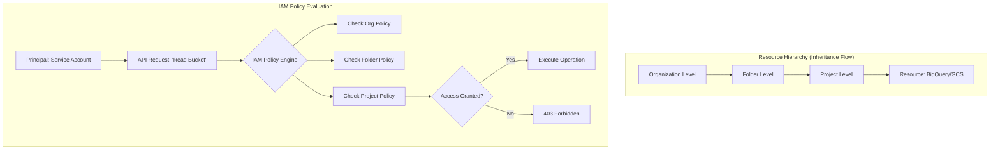

## Security, Identity, and Access Management (IAM)

### Section at a Glance
**What you'll learn:**
- The fundamental "Who, Can Do What, On Which Resource" IAM triad.
- How the Google Cloud Resource Hierarchy governs permission inheritance.
- The critical distinction between User Accounts and Service Accounts for automated workloads.
- Implementing the Principle of Least Privilege (PoLP) using Predefined and Custom roles.
- Auditing and monitoring access using Cloud Audit Logs.

**Key terms:** `Principal` · `Role` · `Policy` · `Service Account` · `Inheritance` · `Least Privilege`

**TL;DR:** IAM is the security backbone of GCP that defines which identities (Users/Services) have which permissions (Roles) on which resources (Buckets/BigQuery), using a hierarchical structure where permissions flow downward.

---

### Overview
In a modern enterprise, the greatest threat to data integrity is not an external hacker bypassing a firewall, but "permission creep"—where users and automated processes accumulate excessive privileges. For a business, this represents an unmanageable **blast radius**: if a single developer's credentials or a single Dataflow service account is compromised, an attacker could potentially delete entire production datasets or exfiltrate sensitive customer information.

Google Cloud IAM solves this by providing a centralized, granular control plane. Instead of managing access on a per-server basis, you manage it at the resource level across the entire organization. This allows data engineering teams to scale rapidly—provisioning new BigQuery datasets or Cloud Storage buckets with the confidence that security policies are automatically inherited and enforced.

As a data engineer, you are often the primary "custodian" of these permissions. While security teams set the high-level guardrails, you will be the one configuring the Service Accounts that power your ETL pipelines, ensuring they have exactly enough access to read from a landing zone and write to a warehouse, and nothing more.

---


### Core Concepts

The entire IAM framework is built on a single logical binding: **The IAM Policy.** An IAM policy is a collection of "bindings" that link a **Principal** to a **Role**.

#### 1. The Three Pillars of a Binding
*   **Principal (The "Who"):** The identity being granted access. This can be a Google Account (individual), a Service Account (for applications), a Google Group, or a Cloud Identity domain.
*   **Role (The "What"):** A collection of permissions. 
    *   **Primitive Roles:** (e.g., Owner, Editor, Viewer) ⚠️ **Warning:** These are legacy roles that are far too broad for production use. They grant access to almost everything in a project, creating a massive security risk.
    *   **Predefined Roles:** Granular, Google-managed roles (e.g., `roles/bigquery.dataViewer`). These are the gold standard for most use cases.
    *   **Custom Roles:** A collection of specific permissions you define yourself. 📌 **Must Know:** Use these only when Predefined roles provide too much access.
*   **Resource (The "Where"):** The specific GCP object (e.g., a BigQuery dataset, a GCS bucket, or an entire Project) to which the permission applies.

#### 2. The Resource Hierarchy and Inheritance
Google Cloud organizes resources in a hierarchy: **Organization $\rightarrow$ Folder $\rightarrow$ Project $\rightarrow$ Resource**. 
Permissions are **inherited** downward. If you grant `roles/storage.admin` at the Folder level, every project and every bucket within that folder automatically inherits that permission.

> 💡 **Tip:** When designing your architecture, use Folders to group related projects (e.g., "Production" vs. "Development"). This allows you to apply security policies at the folder level once, rather than repeating them for every new project.

#### 3. Service Accounts: The Identity of Data Pipelines
For a Data Engineer, Service Accounts are your most important identity type. Unlike a human user who uses a password and MFA, a Service Account is an identity used by an application (like a Dataflow job or a Compute Engine VM) to authenticate to other GCP services.

📌 **Must Know:** Service Accounts are both an **identity** (they can be granted roles) and a **resource** (you can control who can "act as" the service account).

---

### Architecture / How It Works

The following diagram illustrates how an identity request is evaluated through the hierarchy and the policy engine.



1.  **Principal:** The entity (e.g., a Dataflow Service Account) initiates a request to an API.
2.  **API Request:** The request carries the identity credentials and the target resource.
3.  **IAM Policy Engine:** GCP intercepts the request and traverses the hierarchy upward.
4.  **Policy Evaluation:** The engine checks for any "Deny" policies first, then aggregates all "Allow" bindings from the Resource level up to the Organization level.
5.  **Decision:** If a binding exists that matches the Principal, Role, and Resource, the operation proceeds.

---

### Comparison: When to Use What

| Role Type | Best For | Trade-offs | Approx. Cost Signal |
| :--- | :--- | :--- | :--- |
| **Primitive Roles** | Quick prototyping/Sandbox only | **High Risk:** Too broad; violates Principle of Least Privilege. | Free (but high risk cost) |
| **Predefined Roles** | Standard production workloads | **Ease of Use:** Managed by Google; updated automatically. | Free |
| **Custom Roles** | Highly specialized, hyper-secure needs | **High Maintenance:** You must manually update permissions when GCP adds new features. | Free |

**How to choose:** Always start with the most granular **Predefined Role** that satisfies the requirement. Only move to **Custom Roles** if a Predefined role grants permissions that are strictly unnecessary for your task.

---

### Cost Cheat Sheet

| Scenario | Recommended Option | Key Cost Driver | Watch Out For |
| :--- | :--- | :--- | :--- |
| **Automated ETL (Dataflow)** | Dedicated Service Account | None | Over-privileged accounts increasing blast radius. |
| **External Vendor Access** | Workload Identity Federation | None | Avoid downloading long-lived JSON keys to local machines. |
  | **Compliance Auditing** | Cloud Audit Logs | **Data Volume:** High-frequency API calls generate massive log volumes. | 💰 **Cost Note:** The biggest cost mistake is enabling "Data Access" logs for every single service without filtering. This can lead to massive Cloud Logging bills. |
| **Multi-project access** | Identity Groups | None | Managing individual users instead of groups creates massive administrative overhead. |

---

### Service & Tool Integrations

1.  **BigQuery & IAM:**
    *   Permissions can be applied at the Project level (for running jobs) or the Dataset level (for reading/writing data).
    *   Use `roles/bigquery.dataViewer` for read-only access to specific datasets.
2.  **Cloud Storage & IAM:**
    *   Integrates with IAM, but also supports **ACLs (Access Control Lists)**. 
    *   ⚠️ **Warning:** Avoid using ACLs for modern architectures; use IAM for unified, scalable management.
3.  **Workload Identity (GKE):**
    *   The most secure way to link Kubernetes Service Accounts to GCP IAM roles, eliminating the need for secret keys inside pods.

---

### Security Considerations

| Control | Default State | How to Enable / Strengthen |
| :--- | :--- | :--- |
| **Authentication** | Enabled (via Google Identity) | Enforce Multi-Factor Authentication (MFA) via Cloud Identity. |
| **Authorization** | Role-based | Implement **Least Privilege** by auditing roles regularly. |
  | **Encryption (At Rest)** | Enabled (Google-managed) | Use **Customer-Managed Encryption Keys (CMEK)** via Cloud KMS for higher control. |
  | **Audit Logging** | Admin Activity (Enabled) | Manually enable **Data Access Logs** for sensitive datasets. |

---

### Performance & Cost

IAM evaluation is performed by Google's global infrastructure and is highly optimized; it does not introduce measurable latency to your data pipelines. However, **architectural complexity** can impact management performance.

**Scenario: The "Global Access" Mistake**
A Data Engineer creates a single Service Account with `roles/editor` at the Organization level to "make things work" across all projects.
*   **The Result:** If the Dataflow pipeline is compromised, the attacker can delete every project in the company. 
*   **The Cost of Remediation:** The cost is not in GCP billing, but in the hundreds of man-hours required for forensic investigation, data recovery, and a complete security overhaul.

---

### Hands-On: Key Operations

**1. Create a Service Account for a Data Pipeline**
This creates an identity that our Dataflow job will use.
```bash
gcloud iam service-accounts create dataflow-worker-sa \
    --display-name="Dataflow Worker Service Account"
```

**2. Assign the BigQuery Data Editor role to the Service Account**
This allows the service account to write data to BigQuery, but not delete the dataset.
```bash
gcloud projects add-iam-policy-binding my-data-project \
    --member="serviceAccount:dataflow-worker-sa@my-data-project.iam.gserviceaccount.com" \
    --role="roles/bigquery.dataEditor"
```
> 💡 **Tip:** Always use the fully qualified email address of the service account when binding roles to prevent typos.

**3. Create a Key (Avoid if possible!)**
This generates a JSON key file for local testing. 
```bash
gcloud iam service-accounts keys create key.json \
    --iam-account=dataflow-worker-sa@my-data-project.iam.gserviceaccount.com
```
> ⚠️ **Warning:** Never commit `key.json` to Git. If this key is leaked, your project is compromised. Use Workload Identity or attached Service Accounts instead.

---

### Customer Conversation Angles

**Q: "We have many third-party vendors accessing our BigQuery data. How do we manage this without creating hundreds of individual accounts?"**
**A:** "The best approach is to use Google Groups. We can invite their existing identities into a specific Group in our Cloud Identity, and then simply grant that Group the necessary permissions. This makes offboarding as simple as removing them from the group."

**Q: "Can we restrict access so that a developer can only see data in the 'Dev' project but not 'Prod'?"**
**A:** "Absolutely. By using the resource hierarchy, we apply specific IAM bindings at the Project level for 'Dev' and much stricter, limited-access roles at the 'Prod' level. Permissions do not flow 'upward,' so 'Dev' access cannot leak into 'Prod'."

**Q: "How do I know if someone has improperly accessed our sensitive customer data?"**
**A:** "We enable Cloud Audit Logs, specifically 'Data Access' logs. This creates an immutable audit trail of every time a user or service account reads or modifies your sensitive BigQuery tables or Cloud Storage buckets."

**Q: "Is it cheaper to use Custom Roles instead of Predefined ones?"**
**A:** "There is no direct service cost difference, but Custom Roles carry a 'hidden' operational cost. You become responsible for manually updating them whenever Google releases new API features, which can lead to broken pipelines if not managed."

**Q: "We use on-premise servers to run our ETL. How do they securely talk to GCP?"**
**A:** "I wouldn't recommend using long-lived JSON keys. We should use **Workload Identity Federation**, which allows your on-premise identity provider to exchange a local token for a short-lived GCP access token, significantly reducing the risk of credential theft."

---

### Common FAQs and Misconceptions

**Q: If I grant a user 'Owner' at the Project level, can they still be restricted by an Organization-level policy?**
**A:** Yes. Organization-level "Deny" policies or constraints (like 'Disable Service Account Key Creation') override any permissions granted at the project level. ⚠️ **Warning:** Never assume Project-level 'Owner' status gives you total, unrestricted control.

**Q: Does IAM control network access?**
**A:** No. IAM controls *identity* and *permissions*. To control *where* a request comes from (e.g., only from a specific IP), you need VPC Service Controls or Firewall rules.

**Q: Do I need to create a new Service Account for every single Dataflow job?**
**A:** Not necessarily, but you should use a unique Service Account for different *classes* of workloads (e.g., one for 'Ingestion' and one for 'Transformation') to maintain a clean security boundary.

**Q: Is IAM 'active' or 'passive'?**
**A:** It is active. Every single API call to GCP is intercepted and checked against your IAM policies in real-time.

**Q: Can I use a standard Gmail account for production IAM?**
**A:** You *can*, but you **should not**. For production, you should use Google Cloud Identity or Google Workspace to ensure enterprise-grade management and lifecycle control.

---

### Exam & Certification Focus

*   **Principle of Least Privilege (Domain: Security/IAM):** Expect questions where you must choose the *most restrictive* role that still allows a task to complete. 📌 **Must Know**
*   **Hierarchy and Inheritance (Domain: Infrastructure):** Understand how permissions applied at the Folder level affect Project-level resources.
*   **Service Account Usage (Domain: Data Engineering/Operations):** Know how to distinguish between a User account and a Service Account, and how to use them in automated pipelines.
*   **Audit Logging (Domain: Security/Compliance):** Understand the difference between Admin Activity logs and Data Access logs.

---

### Quick Recap
- **IAM is the "Who, What, Where" of GCP security.**
- **The Hierarchy governs everything:** Permissions flow down from Org $\rightarrow$ Folder $\rightarrow$ Project.
- **Always prefer Predefined Roles** over Primitive or Custom roles to reduce management overhead.
- **Service Accounts** are the backbone of all automated data engineering workloads.
- **Least Privilege is the goal:** Minimize the blast radius by granting only the bare minimum permissions required.

---

### Further Reading
**[Google Cloud IAM Documentation]** — The definitive guide to all IAM concepts and API references.
**[Cloud Audit Logs Overview]** — Essential reading for understanding how to track API activity and data access.
**[Workload Identity Federation Whitepaper]** — Best practices for secure, keyless access from non-GCP environments.
**[IAM Best Practices Guide]** — A high-level strategic document for designing secure organizational structures.
**[VPC Service Controls Documentation]** — Critical for understanding how to wrap IAM in a network security perimeter.