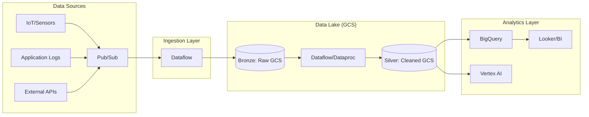

## Cloud Storage and Data Lake Architectures

### Section at a Glance
**What you'll learn:**
- Distinguishing between Cloud Storage classes and choosing the optimal tier for specific data access patterns.
- Designing scalable Data Lake architectures using the "Medallion" (Bronze, Silver, Gold) pattern.
- Implementing automated Object Lifecycle Management (OLM) to optimize storage costs.
- Integrating Cloud Storage with BigQuery and Dataflow for unified analytics.
- Implementing robust security controls, including Uniform Bucket-Level Access and Encryption.

**Key terms:** `Cloud Storage` · `Data Lake` · `Object Lifecycle Management` · `Strong Consistency` · `Coldline` · `BigQuery Omni`

**TL;DR:** Cloud Storage acts as the highly scalable, "infinite" landing zone for raw, unstructured, and semi-structured data, forming the foundation of a Data Lake, while BigQuery serves as the structured analytical engine for high-performance querying.

---

### Overview
In the modern enterprise, data is no longer just structured rows in a relational database. It is a deluge of logs, images, sensor telemetry, and clickstreams. The fundamental business problem is "Data Gravity" and "Cost of Retention": how do you store petabytes of data indefinitely without breaking the budget, while ensuring it remains accessible for both real-time streaming and long-term machine learning training?

Historically, companies built "Data Warehouses"—rigid, expensive, and schema-on-write structures. While excellent for reporting, they fail when faced with unstructured data. This section introduces the **Data Lake architecture**. By using Google Cloud Storage (GCS) as the primary storage layer, organizations can implement a "Schema-on-Read" approach. This allows engineers to ingest data in its native format, significantly reducing ingestion latency and architectural complexity.

Within the broader context of this course, this section provides the "Foundation Layer." You cannot build a robust Data Warehouse (BigQuery) or a Machine Learning pipeline (Vertex AI) without a reliable, cost-effective strategy for the underlying data persistence.

---

### Core Concepts

#### Cloud Storage (GCS) Classes
GCS is an object storage service, meaning it stores data as "objects" in "buckets." Unlike a file system, there is no true hierarchy, only key-value pairs where the key is the object name (including slashes).

*   **Standard Storage:** Optimized for "hot" data. High availability, frequent access. Use for: Website content, active streaming data.
*    **Nearline Storage:** For data accessed less than once a month. 
    > 💡 **Tip:** Use Nearline for monthly reports or backups that you might need to audit occasionally but don't need in milliseconds.
*    **Coldline Storage:** For data accessed less than once a quarter. 
    > ⚠️ **Warning:** While storage costs are lower, "retrieval" costs are significantly higher. Frequent access to Coldline data will lead to a "bill shock."
*   **Archive Storage:** For long-term regulatory compliance. Lowest cost, highest latency for the first byte of retrieval.

#### Data Lake Architectures (The Medallion Pattern)
A well-architected Data Lake does not just dump data into a single bucket. It organizes data into logical stages to manage quality and complexity:

1.  **Bronze (Raw) Layer:** The landing zone. Data is stored exactly as it arrived from the source (e.g., IoT, Web logs). No transformations allowed.
2.  **Silver (Cleansed) Layer:** Data is filtered, cleaned, and standardized (e.g., converting CSV to Parquet, normalizing timestamps). 
3.  **Gold (Curated) Layer:** Highly aggregated, business-level data. This is the layer most often consumed by BI tools like Looker.

📌 **Must Know:** In a GCP exam context, always look for the architecture that separates "Ingestion/Raw" (GCS) from "Analytics/Structured" (BigQuery).

#### Object Lifecycle Management (OLM)
OLM allows you to define rules to automate transitions between storage classes or to delete objects.
*   **Example Rule:** "If an object in the `logs/` prefix hasn't been modified in 365 days, move it from Standard to Archive."
*   **Prefix-based logic:** Rules can be applied to specific "folders" (prefixes) within a bucket.

---

### Architecture / How It Works

The following diagram illustrates a standard GCP Data Lake pipeline, moving from raw ingestion to actionable intelligence.



1.  **Pub/Sub:** Acts as the asynchronous buffer for incoming streaming data.
2.  **Dataflow:** The processing engine that performs ETL (Extract, Transform, Load) and executes the logic to move data between layers.
3.  **Bronze/Silver GCS Buckets:** The persistent, durable storage for raw and processed files.
- **BigQuery:** The destination for structured, high-performance SQL analytics.
- **Vertex AI:** Consumes the processed data from the Silver/Gold layers for model training.

---

### Comparison: When to Use What

| Option | Best For | Trade-offs | Approx. Cost Signal |
| :--- | :--- | :--- | :--- |
| **Cloud Storage (Standard)** | Active, frequently accessed files/assets. | Highest storage cost per GB. | High Storage / Low Access |
| **Cloud Storage (Archive)** | Long-term regulatory/compliance data. | Highest retrieval latency/cost. | Lowest Storage / High Access |
| **BigQuery (Native)** | Structured, highly queried analytical data. | Requires predefined schema (mostly). | High Compute / High Performance |
| **BigQuery (External Tables)** | Querying files directly in GCS (Data Lake). | Slower than native BigQuery tables. | Low Management / Lower Performance |

**How to choose:** If your access pattern involves random reads and high frequency, use **Standard GCS**. If you need to run complex SQL joins on petabytes of data with sub-second response times, move that data from GCS into **BigQuery Native** format.

---

### Cost Cheat Sheet

| Scenario | Recommended Option | Key Cost Driver | Watch Out For |
| :--- | :--- | :--- | :--- |
| **Daily IoT Ingestion** | GCS Standard | Storage Volume (GB/month) | High "Class A" Operations (Writes) |
| **Regulatory Logs (7 Years)** | GCS Archive | Retrieval Volume | Data "Egress" and Retrieval fees |
| **Monthly Audit Reports** | GCS Coldline | Retrieval Volume | Minimum storage duration penalties |
| **Production Web Assets** | GCS Standard | Network Egress (to internet) | High egress fees to non-GCP regions |

> 💰 **Cost Note:** The single biggest cost mistake in GCS is ignoring **Class A vs. Class B operations**. Writing/Listing objects (Class A) is significantly more expensive than reading objects (Class B). If your pipeline "lists" millions of files every hour, your bill will explode regardless of your storage tier.

---

### Service & Integrations

1.  **BigQuery Omni & External Tables:**
    *   Allows you to run SQL queries directly against CSV, Avro, or Parquet files stored in GCS without "loading" them into BigQuery.
2.  **Dataflow (Apache Beam):**
    *   The primary "mover." It reads from GCS, applies transformations, and writes back to GCS or BigQuery.
3.  **Dataproc (Managed Hadoop/Spark):**
    *   Used for lifting and shifting existing Hadoop workloads. It uses GCS as a "transparent" file system (via the GCS connector) instead of HDFS.
4.  **Vertex AI:**
    *   Directly integrates with GCS to pull datasets for training machine learning models.

---

### Security Considerations

Security in GCS is multi-layered. You must protect against both external actors and accidental internal misconfigurations.

| Control | Default State | How to Enable / Strengthen |
| :--- | :--- | :--- |
| **Uniform Bucket-Level Access** | Often Disabled (Fine-grained) | **Enable this.** It prevents complex, error-prone ACLs and uses only IAM. |
| **Encryption at Rest** | Google-Managed Keys | Use **CMEK (Customer-Managed Encryption Keys)** via Cloud KMS for higher compliance. |
| **Public Access Prevention** | Depends on Organization Policy | Enable "Public Access Prevention" at the bucket or project level. |
| **Audit Logging** | Basic (Admin Activity) | Enable **Data Access Logs** in Cloud Audit Logs to track who read which object. |

---

### Performance & Cost

**Tuning Guidance:**
To maximize performance when using GCS as a data lake, use **larger file sizes**. Small files (e.g., 1KB) create massive overhead for metadata operations and significantly degrade BigQuery/Spark performance. Aim for files in the 100MB–1GB range for optimal throughput.

**Cost Scenario Example:**
Imagine you have 100 TB of data.
*   **Option A (Standard):** ~$2,300/month (High cost, instant access).
*   **Option B (Archive):** ~$120/month (Extremely low cost, but retrieval is expensive).
*   **The "Gotcha":** If you suddenly decide to run a massive analytical job on that 100TB in Archive, the **retrieval costs** could easily exceed $5,000 in a single day.

---

### Hands-On: Key Operations

To manage GCS, we use the `gcloud storage` (the modern replacement for `gsutil`) CLI.

**1. Create a bucket with a specific location and storage class:**
This ensures your data resides in a specific region to minimize latency and costs for local compute.
```bash
gcloud storage buckets create gs://my-data-lake-bronze --location=US-CENTRAL1 --storage-class=standard
```

**2. Upload a file to the bucket:**
```bash
gcloud storage cp ./logs/daily_export.csv gs://my-data-lake-bronze/raw/
```
> 💡 **Tip:** Use the `--no-clobber` flag to prevent accidentally overwriting existing objects in your pipeline.

**3. Set a Lifecycle Rule (via JSON configuration):**
This policy moves files to Coldline after 90 days.
```bash
# Create a file named lifecycle.json
echo '{"rule": [{"action": {"type": "SetStorageClass", "storageClass": "COLDLINE"}, "condition": {"age": 90}}]}' > lifecycle.json

# Apply it to the bucket
gcloud storage buckets update gs://my-data-lake-bronze --lifecycle-file=lifecycle.json
```

---

### Customer Conversation Angles

**Q: "We have huge amounts of data, but we only look at it once a year for audits. Why shouldn't we just use Standard storage?"**
**A:** "While Standard is easy, you'd be paying a premium for high-availability features you don't need. Moving that data to Archive class could reduce your monthly storage bill by over 90%, provided you account for the slightly higher retrieval cost when the audit happens."

**Q: "Can we just point our BI tools at our GCS buckets to save money on BigQuery storage?"**
**A:** "You can use BigQuery External Tables to do exactly that. It's a great way to reduce costs, but keep in mind that query performance will be slower than if the data were natively loaded into BigQuery's optimized columnar format."

**Q: "How do I ensure my developers don't accidentally make our data public?"**
**A:** "We should implement 'Public Access Prevention' at the Organization level in GCP. This acts as a global guardrail that overrides any individual bucket settings, ensuring no one can accidentally flip a switch and expose your data to the internet."

**Q: "Is it better to have one giant bucket for everything or many small buckets?"**
**A:** "A multi-bucket approach is better for security and organization. You can apply different IAM policies and lifecycle rules to a 'Bronze' bucket versus a 'Gold' bucket, ensuring strict access control."

**Q: "Does GCS provide the same consistency as a traditional database?"**
**A:** "Yes, GCS provides strong global consistency for all read-after-write, read-after-update, and read-after-delete operations. You won't run into the 'eventual consistency' issues that plagued older cloud storage systems."

---

### Common FAQs and Misconceptions

**Q: Does GCS support folders?**
**A:** No. GCS is a flat namespace. "Folders" are actually just part of the object's name (a prefix).
> ⚠️ **Warning:** Do not rely on "moving" folders. In GCS, a 'move' is actually a `copy` followed by a `delete`.

** 
**Q: Is Cloud Storage as fast as a local SSD?**
**A:** No. While throughput can be very high, latency (time to first byte) is much higher than an SSD. It is an object store, not a block store.

**Q: Can I use GCS as a replacement for Cloud SQL?**
**A:** Only for unstructured or semi-structured data. For relational data requiring ACID transactions and complex joins, you still need a database like Cloud SQL or Spanner.

**Q: What happens if I delete an object?**
**A:** It is gone instantly unless you have enabled **Object Versioning**. 
> ⚠️ **Warning:** Always enable Object Versioning on critical 'Silver' or 'Gold' buckets to protect against accidental deletions or overwrites.

**Q: Is there a limit to how many objects I can store in a bucket?**
**A:** No, the capacity is virtually infinite.

**Q: Does GCS support encryption?**
**A:** Yes, by default, all data is encrypted at rest with Google-managed keys. You can also use your own keys (CMEK).

---

### Exam & Certification Focus

*   **Storage Class Selection (Exam Domain: Data Engineering/Architecture):** 📌 **High Frequency.** You will be given a scenario (e.g., "data accessed once a year") and asked to pick the cheapest class.
*   **Lifecycle Management:** Understand how to automate transitions from Standard $\rightarrow$ Nearline $\rightarrow$ Coldline.
*   **Security (IAM & ACLs):** Know the difference between Uniform Bucket-Level Access and fine-grained ACLs.
*   **Data Lake Pattern:** Be able to identify the roles of GCS (Raw/Landing) vs. BigQuery (Analytics/Warehouse) in a multi-tier architecture.
*   **Consistency Models:** Understand that GCS provides **Strong Consistency**.

---

### Quick Recap
- **Cloud Storage** is the foundation of the Data Lake, offering infinite, scalable object storage.
- **Storage Classes** (Standard, Nearline, Coldline, Archive) allow for massive cost optimization based on access frequency.
- **The Medallion Architecture** (Bronze, Silver, Gold) is the best practice for organizing data quality.
- **Object Lifecycle Management** is essential for automating cost-reduction strategies.
- **Security** should be enforced via Uniform Bucket-Level Access and Organization-level guardrails.

---

### Further Reading
**GCS Storage Classes Documentation** — Detailed breakdown of costs and latency for each tier.
**Cloud Storage Security Best Practices** — Essential guide for IAM and encryption.
**BigQuery External Tables Whitepaper** — How to build a data lake pattern using GCS and BigQuery.
**Google Cloud Architecture Framework** — High-level principles for designing reliable and cost-effective systems.
**Dataflow Templates Guide** — How to use pre-built pipelines to move data from GCS to BigQuery.