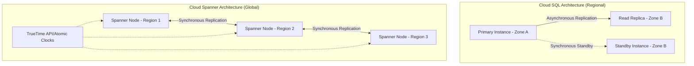

## Relational Databases: Cloud SQL and Spanner

### Section at a Glance
**What you'll learn:**
- Differentiating between managed RDBMS (Cloud SQL) and horizontally scalable RDBMS (Cloud Spanner).
- Architecting for High Availability (HA) and disaster recovery in a managed environment.
- Understanding the technical mechanics of Spanner’s TrueTime and global consistency.
- Evaluating cost-performance trade-offs for regional vs. multi-scale workloads.
- Selecting the correct database engine based on transaction volume and geographical footprint.

**Key terms:** `Cloud SQL` · `Cloud Spanner` · `ACID Compliance` · `Horizontal Scaling` · `TrueTime` · `Read Replicas`

**TL;DR:** Use **Cloud SQL** for traditional, vertical-scaling workloads (MySQL, PostgreSQL, SQL Server) where regional presence is sufficient; use **Cloud Spanner** for mission-critical, global-scale applications requiring horizontal scaling and strong consistency across multiple regions.

---

### Overview
In the era of digital transformation, the "undifferentiated heavy lifting" of database administration—patching, backups, and replication—is a primary driver of operational inefficiency. For organizations, the cost of a database outage or a failed migration isn't just measured in downtime, but in lost customer trust and compromised data integrity.

This section explores Google Cloud's two primary pillars of relational database services. **Cloud SQL** solves the problem of managing standard, widely-used database engines by automating the operational overhead of a traditional RDBMS. It is the natural destination for "lift-and-shift" migrations of existing applications.

However, as businesses grow into global enterprises, they hit the "vertical scaling wall." Traditional databases can only grow so large on a single machine. **Cloud Spanner** addresses this by providing a "NewSQL" solution: the ability to scale horizontally across the globe while maintaining the ACID (Atomicity, Consistency, Isolation, Durability) guarantees that developers expect from a relational database. This section provides the framework to decide which path your architecture requires.

---

### Core Concepts

#### Cloud SQL: Managed Familiarity
Cloud SQL is a fully managed service for **MySQL, PostgreSQL, and SQL Server**. It handles backups, replication, and patching, allowing engineers to focus on schema design and query optimization.

*   **Vertical Scaling:** To handle more load, you must increase the machine type (CPU/RAM). 
    ⚠️ **Warning:** Scaling vertically involves a brief period of downtime or a failover event, depending on your configuration.
*    **High Availability (HA):** Cloud SQL achieves HA by maintaining a primary instance in one zone and a standby instance in a different zone within the same region.
*   **Read Replicas:** To offload read-heavy workloads, you can create replicas. 
    📌 **Must Know:** Read replicas are asynchronous; therefore, there is a slight "replication lag" where a read from a replica might return slightly stale data.

#### Cloud Spanner: The Global Powerhouse
Cloud Spanner is a unique, distributed, and globally scalable relational database. It is designed for workloads that cannot be contained within a single region.

*   **Horizontal Scaling:** Unlike Cloud SQL, you scale Spanner by adding **nodes** (or processing units). This allows for virtually unlimited throughput.
*   **TrueTime API:** This is the "secret sauce." Spanner uses a combination of atomic clocks and GPS receivers in Google's data centers to provide highly accurate timestamps.
    📌 **Must Know:** TrueTime allows Spanner to achieve **External Consistency**—the highest level of consistency—even across continents, by managing clock uncertainty.
*   **Strong Consistency:** Spanner provides synchronous replication across zones and regions, ensuring that once a transaction is committed, all subsequent reads see that change.

---

### Architecture / How It Works



1.  **Primary Instance (Cloud SQL):** The authoritative source for all writes and reads in a single-zone setup.
2.  **Standby Instance (Cloud SQL):** A standby instance in a different zone that takes over automatically if the primary fails.
3.  **Read Replica (Cloud SQL):** An asynchronous copy used to scale read operations.
4.  **Spanner Nodes:** Compute units that manage shards of data (splits) and execute transactions.
5.  **Synchronous Replication (Spanner):** Ensures that data is written to a majority of replicas before a transaction is committed, preventing data loss.
6.  **TrueTime API:** The underlying infrastructure that synchronates clocks globally to ensure order of operations.

---

### Comparison: When to Use What

| Option | Best For | Trade-offs | Approx. Cost Signal |
| :--- | :--- | :--- | :--- |
| **Cloud SQL** | Standard web apps, CMS (WordPress), ERPs, migrating existing on-prem DBs. | Limited to vertical scaling; regional availability only. | Low to Moderate (Pay for instance size) |

| **Cloud Spanner** | Global e-commerce, financial transaction systems, massive-scale gaming backends. | Higher complexity in schema design (interleaving); higher entry cost. | High (Pay for nodes/processing units) |
| **AlloyDB** (Bonus) | High-performance PostgreSQL workloads requiring massive throughput. | PostgreSQL compatible but optimized for Google Cloud. | Moderate to High |

**How to choose:** If your database fits on a single large machine and your users are in one geographic area, choose **Cloud SQL**. If your application requires "unlimited" growth and must serve users in London, Tokyo, and New York with the same data consistency, choose **Cloud Spanner**.

---

### Cost Cheat Sheet

| Scenario | Recommended Option | Key Cost Driver | Watch Out For |
| :--- | :--- | :--- | :--- |
| **Small Dev/Test Environment** | Cloud SQL (Micro instance) | Instance size & Storage | Leaving large instances running 24/7. |
| **High-Traffic Regional Web App** | Cloud SQL (High Availability) | Regional replication & RAM | High egress costs between regions. |
| **Global Financial Ledger** | Cloud Spanner (Multi-region) | Number of Nodes/Processing Units | Spanner is expensive for low-traffic apps. |
| **Massive Data Ingestion/Analytics** | Cloud Spanner | Storage volume & Compute | Rapidly growing splits increasing node requirements. |

> 💰 **Cost Note:** The single biggest cost mistake in Cloud SQL is over-provisioning CPU and RAM "just in case." Use vertical scaling to adjust capacity as you observe actual usage patterns.

---


### Service & Tool Integrations
1.  **Cloud Dataflow:** Use for ETL pipelines that ingest massive amounts of streaming data into Cloud Spanner for real-time processing.
2.  **Cloud Storage:** Primary destination for Cloud SQL automated backups and database exports.
3.  **Cloud IAM:** Use to manage granular permissions (e.g., who can create a new Spanner instance vs. who can only run queries).
4.  **BigQuery:** Use "Federated Queries" to join data residing in Cloud SQL or Spanner directly with BigQuery for large-scale analytics without moving the data.

---

### Security Considerations

| Control | Default State | How to Enable / Strengthen |
| :--- | :--- | :--- |
| **Encryption at Rest** | Enabled (Google Managed) | Use **CMEK** (Customer Managed Encryption Keys) for higher compliance. |
| **Encryption in Transit** | Enabled (SSL/TLS) | Enforce SSL/TLS connections in the database configuration. |
  | **Network Isolation** | Public IP available | Use **Private IP** (Private Service Access) to keep traffic off the public internet. |
| **Authentication** | Database-level users | Integrate with **Cloud IAM** for centralized identity management. |

---

### Performance & Cost
**Tuning Guidance:**
*   **Cloud SQL:** Focus on **Index Optimization** and **Query Tuning**. Because you scale vertically, a poorly written query that causes a full table scan will quickly exhaust your allocated RAM and CPU, leading to instance crashes.
*   **Spanner:** Focus on **Schema Design**. Avoid "hotspots." 
    ⚠️ **Warning:** If you use a monotonically increasing primary key (like a timestamp) in Spanner, all writes will hit a single node, destroying your ability to scale horizontally. Use UUIDs or bit-reversed sequences instead.

**Cost Scenario Example:**
A startup running a single-region app on a `db-n1-standard-1` Cloud SQL instance (2 vCPU, 7.5GB RAM) might spend ~$60/month. Moving that same workload to a multi-region Cloud Spanner configuration with 1 node could cost upwards of ~$600+/month. This 10x increase must be justified by the business need for global scale.

---

### Hands-On: Key Operations

**Create a Cloud SQL PostgreSQL instance using gcloud:**
This command initializes a new managed instance with a specific version and tier.
```bash
gcloud sql instances create my-postgres-instance \
    --database-version=POSTGRES_14 \
    --tier=db-f1-micro \
    --region=us-central1 \
    --root-password=my-secure-password
```
> 💡 **Tip:** Always use a strong, randomly generated password for your root user and store it in Secret Manager.

**Create a Spanner Database using gcloud:**
This command creates a database within an existing Spanner instance.
```bash
gcloud spanner databases create my-global-db \
    --instance=my-spanner-instance
```

---

### Customer Conversation Angles

**Q: "We are moving from an on-prem MySQL setup. Why shouldn't we just use Cloud SQL?"**
**A:** You absolutely should. Cloud SQL is the path of least resistance for MySQL migrations, providing the same engine you know but removing the operational burden of patching and backups.

**Q: "Can I use Cloud Spanner for my small, low-traffic internal tool? It's much more powerful."**
**A:** While possible, it's likely not cost-effective. Cloud Spanner has a higher 'entry price' due to its distributed architecture. For low-traffic, single-region tools, Cloud SQL will save you significant budget.

**Q: "How do I know if my application is ready for Spanner's architecture?"**
**A:** If your application requires horizontal scaling to handle massive write throughput or if you need a single, consistent view of data across different continents, you are a prime candidate for Spanner.

**Q: "Will moving to Cloud SQL improve my application's performance?"**
**A:** It won't automatically make queries faster, but it provides the infrastructure to scale vertically and add read replicas, which directly addresses performance bottlenecks as your user base grows.

**Q: "Is my data safe from Google employees in Cloud SQL?"**
**A:** Your data is encrypted at rest and in transit. For even stricter control, you can implement Customer Managed Encryption Keys (CMEK) so that you control the keys used to encrypt your data.

---

### Common FAQs and Misconceptions

**Q: Does Cloud SQL automatically scale its CPU/RAM when traffic spikes?**
**A:** No. Cloud SQL scales vertically, which requires a manual change to the instance tier.
⚠️ **Warning:** Do not assume "Managed" means "Autoscaling" for Cloud SQL; it means "Managed Maintenance."

**Q: Is Spanner eventually consistent or strongly consistent?**
**A:** Spanner provides strong, external consistency. It is not "eventually consistent" like some NoSQL databases.

**Q: Can I use Spanner if I don't want to change my SQL queries?**
**A:** Most standard SQL will work, but you must be careful with primary key design to avoid "hotspotting," which is a fundamental difference from single-node databases.

**Q: Is Cloud SQL's High Availability (HA) the same as Multi-Region?**
**A:** No. Cloud SQL HA protects you against a Zone failure within a region. It does **not** protect you against a whole Region failure. For that, you would need a multi-region Spanner setup or a complex Cloud SQL cross-region replica strategy.

**Q: Does Spanner support all PostgreSQL features?**
**A:** No. While Google is working on PostgreSQL interface compatibility, Spanner is a distinct dialect. Always check the compatibility documentation before migrating complex logic.

---

### Exam & Certification Focus

*   **Selection Logic (Design for Security/Reliability):** You will be tested on choosing between Cloud SQL and Spanner based on a scenario (e.g., "A global retail app needs..."). 📌 **High Frequency Topic.**
*   **High Availability (Reliability):** Understanding the difference between Zonal and Regional availability for Cloud SQL.
*   **Scaling Strategies (Performance):** Identifying when to use Read Replicas (Cloud SQL) vs. adding Nodes (Spanner).
*   **Data Integrity (Security/Reliability):** Understanding the role of TrueTime in Spanner's consistency model.

---

### Quick Recap
- **Cloud SQL** is for managed, vertical-scaling, regional relational workloads.
- **Cloud Spanner** is for horizontally-scaling, globally-distributed, mission-critical workloads.
- **TrueTime** is the foundational technology that enables Spanner's global consistency.
- **Vertical scaling** in Cloud SQL can involve brief downtime; **Horizontal scaling** in Spanner is seamless.
- **Cost management** requires matching the database's complexity and scale to your business's actual requirements.

---

### Further Reading
**Cloud SQL Documentation** — Detailed technical specs for MySQL, PostgreSQL, and SQL Server flavors.
**Cloud Spanner Architecture Whitepaper** — Deep dive into TrueTime and distributed transaction mechanics.
**Google Cloud Database Selection Guide** — A decision-tree approach to choosing the right database service.
**Spanner Schema Design Best Practices** — Critical reading for avoiding performance hotspots.
**Cloud SQL High Availability Overview** — Understanding failover mechanisms and regional architectures.