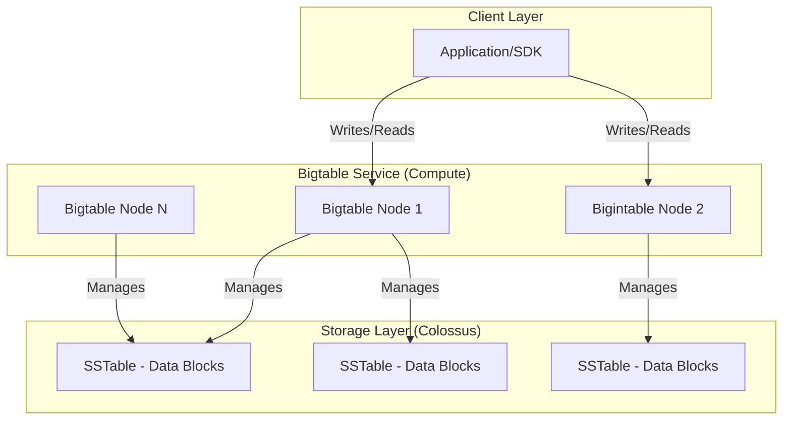

## NoSQL and Wide-Column Stores: Bigtable and Firestore

### Section at a Glance
**What you'll learn:**
- Distinguish between wide-column (Bigtable) and document-oriented (Firestore) NoSQL models.
- Architecting high-throughput workloads using Cloud Bigtable.
- Building real-time, scalable mobile and web backends with Firestore.
- Identifying the "scaling wall" where relational databases fail and NoSQL succeeds.
- Optimizing row-key design to prevent hotspots in distributed systems.

**Key terms:** `Wide-column` · `Document-oriented` · `Row-key` · `Hotspotting` · `Subcollections` · `Eventual Consistency`

**TL;DR:** Bigtable is a high-throughput, massive-scale engine for analytical and operational "big data" workloads; Firestore is a flexible, real-time database designed for seamless application development and user-facing state management.

---

### Overview
In the era of relational databases (SQL), we were taught that schema is king. However, modern business requirements—such as IoT sensor streams, real-time social feeds, and global mobile apps—often create data patterns that break the rigid structure of a relational engine. When your data grows from gigabytes to petabytes, or when your write velocity exceeds what a single primary node can handle, you face "The Wall."

This section explores two different solutions to the "Scaling Wall." First, we look at **Cloud Bigtable**, a wide-column service designed for massive analytical throughput. If you are processing millions of events per second from millions of devices, Bigtable is your engine. 

Second, we examine **Firestore**, a document-oriented database. Unlike Bigtable, which focuses on raw throughput, Firestore focuses on developer velocity and real-time synchronization. It solves the problem of keeping a mobile app perfectly in sync with a backend without the developer writing complex WebSocket logic.

Understanding when to choose a "heavy-duty" engine (Bigtable) versus an "agile-sync" engine (Firestore) is the difference between an architecture that scales infinitely and one that becomes a cost and performance nightmare.

---

### Core Concepts

#### Cloud Bigtable: The Heavy Lifter
Bigtable is a sparse, distributed, multi-dimensional sorted map. It is not a "database" in the sense of having built-in complex joins; it is a high-performance storage engine.

*   **Row Keys:** The single most important concept. Data is sorted lexicographically by row key. 
    ⚠️ **Warning:** Choosing a monotonically increasing key (like a `timestamp`) will cause all writes to hit a single node, creating a **hotspot** and defeating the purpose of a distributed system.
*   **Column Families:** Groups of related columns. You define these at schema creation. 
    📌 **Must Know:** You cannot add new column families after the table is created without recreating the table.
*   **Cell Versioning:** Bigtable stores multiple versions of data in a single cell, distinguished by timestamps. This allows for "time-travel" queries on specific rows.
*   **Single-Row Atomicity:** Transactions are only guaranteed at the row level. You cannot atomically update two different rows in one operation.

#### Firestore: The Developer's Choice
Firestore is a NoSQL, document-oriented database. It stores data in **Documents**, which are organized into **Collections**.

*   **Document Model:** Data is stored in JSON-like structures. This allows for a flexible schema where every document in a collection can have different fields.
*   
*   **Subcollections:** A document can contain collections. This creates a hierarchical tree structure, allowing you to model complex relationships (e.g., `Users` -> `UserDoc` -> `Orders` -> `OrderDoc`).
*   **Real-time Listeners:** Firestore can push updates to connected clients (Web/Mobile) instantly when data changes.
*   **Shallow Queries:** When you query a collection, you only get the documents in that collection, not the documents within their subcollections.
    💡 **Tip:** This "shallow" behavior prevents massive, accidental data transfers when you only need the top-level metadata.

---

### Architecture / How It Works

The following diagram illustrates the architectural separation of concerns in Cloud Bigtable, which allows it to scale storage and compute independently.



1.  **Application/SDK:** The entry point where your code interacts with the Bigtable API.
2.  **Bigtable Nodes:** The compute layer that handles processing, filtering, and managing the data.
3.  **Colossus:** Google's distributed file system that provides the underlying persistent storage.
4.  **SSTables:** The actual data files stored in Colossus; Bigtable nodes use these to serve reads and organize writes.

---

### Comparison: When to Use What

| Option | Best For | Trade-offs | Approx. Cost Signal |
| :--- | :--- | :--- | :--- |
| **Cloud Bigtable** | IoT, AdTech, Financial Tickers, Large-scale Analytics. | No complex queries/joins; requires expert key design. | High (Node-based pricing; fixed minimum cost). |
| **Firestore** | Mobile/Web Apps, User Profiles, Real-time Chat, Product Catalogs. | Limited query capabilities; performance degrades with massive single-document sizes. | Low to Medium (Usage-based; pay for ops). |
| **Cloud SQL** | Traditional ERP, CRM, highly relational data. | Vertical scaling limits; manual management of sharding. | Medium (Instance-based). |

**How to choose:** If your workload is characterized by **massive throughput** (GB/s) and sequential data patterns, choose **Bigtable**. If your workload is characterized by **complex data relationships** and the need for **real/near-real-time UI updates**, choose **Firestore**.

---

### Cost Cheat Sheet

| Scenario | Recommended Option | Key Cost Driver | Watch Out For |
| :--- | :--- | :--- | :--- |
| High-velocity IoT sensor ingestion | Bigtable | Number of Nodes (Compute) | Over-provisioning nodes for "just in case" scaling. |
| User-facing mobile app with profiles | Firestore | Number of Reads/Writes/Deletes | Massive "wildcard" queries that trigger millions of reads. |
| Small-scale prototype/MVP | Firestore | Storage and Operations | Using Firestore for heavy analytical processing (too expensive). |
| Large-scale Data Warehouse staging | Bigtable | Disk usage (SSD/HDD) | Not cleaning up old versions/timestamps (bloated cells). |

> 💰 **Cost Note:** In Bigtable, you pay for the **nodes** you provision, regardless of whether you are using 1% or 90% of their capacity. Always use Autoscale features or right-size your cluster to avoid paying for idle compute.

---

### Service & Tool Integrations

1.  **Data Ingestion Pipeline:**
    *   `Pub/Sub` $\rightarrow$ `Dataflow` $\rightarrow$ `Bigtable`.
    *   This pattern is the gold standard for real-time streaming analytics.
2.  **Mobile Backend-as-a-Service (MBaaS):**
    *   `Firebase Authentication` $\rightarrow$ `Firestore`.
    *   Used to implement secure, user-specific data access rules without a custom server.
3.  **Big Data Ecosystem:**
    *   `BigQuery` $\rightarrow$ `Bigtable` (via Federated Queries).
    *   Allows you to run SQL analytics in BigQuery directly against your high-frequency Bigtable data.

---

### Security Considerations

Both services utilize IAM, but the granularity of access differs.

| Control | Default State | How to Enable / Strengthen |
| :--- | :--- | :--- |
| **Authentication** | IAM-based (Service Accounts) | Use fine-grained IAM roles (e.g., `roles/bigtable.reader` instead of `owner`). |
| **Encryption at Rest** | AES-256 (Google Managed) | Use **Customer-Managed Encryption Keys (CMEK)** via Cloud KMS for higher compliance. |
| **Network Isolation** | Public Internet (via API) | Use **VPC Service Controls (VPC-SC)** to prevent data exfiltration. |
| **Authorization** | IAM Permissions | Implement **Firestore Security Rules** to control document-level access for end-users. |

---

### Performance & Cost

**The Bigtable "Hotspot" Scenario:**
Imagine a customer running a Bigtable cluster with 3 nodes to ingest logs. They use `timestamp` as the first part of their row key.
*   **The Problem:** All new logs have the same current timestamp. Consequently, every single write hits the **same node** in the cluster.
*   **The Result:** The cluster reports high CPU on one node, while the other two nodes are idle. Throughput plateaus, and latency spikes.
*   **The Fix:** Prepend a hashed version of the device ID to the timestamp (`hash_id#timestamp`). This distributes writes across all nodes.

**Cost Example:**
A startup uses Firestore for a "Global News" app.
*   **Usage:** 1 million reads/day, 100k writes/day.
*   **Cost:** Very low (likely within free tier or a few dollars).
*   **The Danger:** They implement a feature where every user's "Like" triggers a recount of the total "Likes" on a document. If 1 million users like a post, that single document update causes massive contention and an exponential increase in write costs and latency.

---

### Hands-Hands: Key Operations

**Bigtable: Creating a Table and a Row (Python)**
This script initializes a table and writes a single entry. Use this to test connectivity and schema setup.

```python
from google.cloud import bigtable

# Initialize client and instance
client = bigtable.Client(project='my-project', admin=True)
instance = client.instance('my-instance')
table = instance.table('sensor_data')

# Define the row key (using a distributed pattern: device_id + timestamp)
row_key = b'device_001#1672531200'
row = table.direct_row(row_key)

# Set data in a column family named 'metrics'
row.set_cell('metrics', b'temperature', b'22.5')

# Commit the row
row.commit()
```
> 💡 **Tip:** Always use byte strings (`b'...'`) in Bigtable; the service is agnostic to data types and treats everything as raw bytes.

**Firestore: Querying a Collection (Node.js)**
This script fetches all "active" users from a collection.

```javascript
const admin = require('firebase-admin');
admin.initializeApp();
const db = admin.firestore();

async function getActiveUsers() {
  // Querying a collection with a filter
  const snapshot = await db.collection('users')
    .where('status', '==', 'active')
    .get();

  snapshot.forEach(doc => {
    console.log(doc.id, '=>', doc.data());
  });
}

getActiveUsers();
```

---

### Customer Conversation Angles

**Q: "Our current SQL database is struggling with the volume of incoming IoT data. Is Bigtable the right move?"**
**A:** "If you need high-throughput, low-latency writes and are prepared to manage a non-relational schema, Bigtable is designed exactly for that scale. We should focus on your row-key design to ensure we don't create hotspots."

**Q: "We are building a real-time mobile game. Do we need a backend server to sync player scores?"**
**A:** "You can actually use Firestore's real-time listeners to sync scores directly to the clients, reducing your backend complexity and latency."

**Q: "Is Bigtable cheaper than Firestore for storing large amounts of historical data?"**
**A:** "Not necessarily. Bigtable has a higher 'entry price' because you pay for nodes. However, for massive, steady-state ingestion, Bigtable's cost per GB is often much more predictable than Firestore's per-operation pricing."

**Q: "Can I run complex SQL JOINs on my Bigtable data?"**
**A:** "No, Bigtable does not support joins. However, you can use BigQuery to run federated SQL queries against your Bigtable data for analytical purposes."

**Q: "How do we ensure users can only see their own data in Firestore?"**
**A:** "We would implement Firestore Security Rules, which allow us to write logic that checks the user's authenticated ID against the document's owner ID before allowing a read."

---

### Common FAQs and Misconceptions

**Q: Can I use Bigtable for a small application with low traffic?**
**A:** No. ⚠️ **Warning:** Bigtable has a high minimum cost due to the required node count. For small apps, Firestore or Cloud SQL is much more cost-effective.

**Q: Does Firestore support transactions?**
**A:** Yes, Firestore supports atomic transactions, but they are limited to a single document or a small group of documents.

**Q: Is Bigtable 'Schema-less'?**
**A:** It is "Schema-flexible." While you don't define every column, you **must** define your Column Families upfront.

**Q: Can I use Bigtable as a replacement for Cloud SQL for my ERP system?**
**A:** No. ⚠️ **Warning:** An ERP requires complex relational integrity and ACID transactions across many tables. Bigtable lacks the relational logic needed for these workloads.

**Q: If I delete a document in Firestore, is the data gone forever?**
**A:** Yes, unless you have implemented a backup strategy or are using Firestore's Point-in-Time Recovery (PITR) feature.

**Q: Does Bigtable automatically handle re-sharding?**
**A:** Yes, Bigtable manages the splitting of tablets (shards) automatically, but your row-key design determines how effectively that work is distributed.

---

### Exam & Certification Focus
*   **Data Engineering/Professional Cloud Architect Domains:**
    *   **Storage Selection (High Weight):** Identifying when to use Bigtable (throughput) vs. Firestore (app state) vs. Spanner (relational + global).
    *   **Bigtable Row Key Design:** Understanding the impact of monotonic keys and how to prevent hotspots. 📌 **Critical for Exam.**
    *   **Firestore Querying:** Knowledge of "Shallow Queries" and the limitations of deep subcollection retrieval.
    *   **Cost Optimization:** Recognizing the difference between node-based (Bigtable) and operation-based (Firestore) pricing models. 📌 **Critical for Exam.**

---

### Quick Recap
- **Bigtable** is for massive-scale, high-throughput, wide-column data (e.g., IoT, Analytics).
- **Firestore** is for flexible, document-oriented, real-time application data (e.g., Mobile, Web).
- **Row-key design** is the single most important factor in Bigtable performance and scalability.
- **Firestore Security Rules** are the primary mechanism for securing client-side data access.
- **Cost Drivers:** Bigtable scales by **nodes**; Firestore scales by **operations (reads/writes)**.

---

### Further Reading
**[Cloud Bigtable Documentation]** — Deep dive into instance management and row-key patterns.
**[Cloud Firestore Documentation]** — Detailed guide on data modeling and Security Rules.
**[Google Cloud Architecture Framework]** — Best practices for choosing the right database for your workload.
**[Bigtable Performance Tuning Whitepaper]** — Technical guide on avoiding hotspots and managing throughput.
**[Firebase Realtime Database vs. Firestore]** — Crucial context for deciding between the two Firebase NoSQL options.