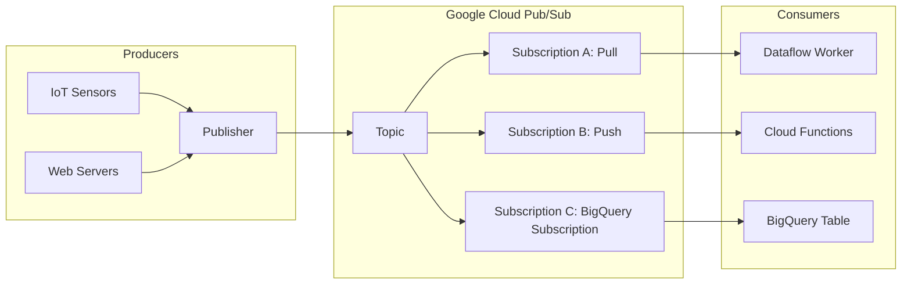

## Real-time Data Ingestion with Pub/Sub

### Section at a Glance
**What you'll learn:**
- Understanding the role of asynchronous messaging in decoupled architectures.
- Differentiating between **Push** and **Pull** subscription models.
- Designing resilient pipelines using **Dead Letter Topics** and **Retry Policies**.
- Implementing message ordering and managing delivery guarantees.
- Optimizing Pub/Sub for cost-efficiency and high-throughput requirements.

**Key terms:** `Topic` · `Subscription` · `Publisher` · `Subscriber` · `Push/Pull` · `Acknowledgment (ACK)` · `Dead Letter Topic` · `Ordering Key`

**TL; $DR:** Google Cloud Pub/Sub is a globally distributed, scalable messaging service that allows you to decouple event producers (publishers) from event consumers (subscribers), ensuring that data spikes are buffered and processed reliably without overwhelming downstream systems.

---

### Overview
In modern enterprise architecture, the greatest threat to system stability is "tight coupling." When Service A sends data directly to Service B, a spike in traffic or a momentary failure in Service B can cause a cascading failure across your entire ecosystem. This is the "brittle system" problem.

Google Cloud Pub/Sub solves this by introducing a buffer layer. It acts as a shock absorber for your data pipelines. Instead of Service A needing to know if Service B is online or how fast it can process data, Service A simply hands the data to Pub//Sub and moves on. This is critical for business use cases like real-time fraud detection, IoT telemetry, and live clickstream analysis, where the loss of even a few seconds of data can lead to incorrect business decisions or financial loss.

In the context of this course, Pub/Sub is the "Entry Point." It is the first stage of the ingestion layer in almost every modern GCP data pipeline, feeding data into processing engines like Dataflow or storage sinks like BigQuery.

---

### Core Concepts

*   **Topic:** A named resource to which messages are sent. Think of it as a "category" or "folder" for specific types of data (e.g., `transactions-topic`).
*   **Message:** The actual data payload. Pub/Sub is payload-agnostic, meaning it can carry JSON, Avro, or even binary blobs. 📌 **Must Know:** The maximum size for a single message is **10 MB**.
*   **Publisher:** The application or service that sends data to a topic.
*   **Subscription:** A named resource representing the stream of messages from a single, specific topic to be delivered to a subscriber. 
    *   A single topic can have multiple subscriptions (Fan-out pattern).
    *   Each subscription maintains its own state of which messages have been acknowledged.
*   **Subscriber:** The application that receives messages from a subscription.
*   **Acknowledgment (ACK):** A signal sent by the subscriber to Pub/Sub indicating that a message has been successfully processed. ⚠️ **Warning:** If a subscriber fails to send an ACK within the "Acknowledgement Deadline," Pub/Sub will redeliver the message, which can lead to duplicate processing.

#### Delivery Guarantees
Pub/Sub provides **at-least-once delivery** by default. This means that while Pub/Sub ensures no message is lost, it is technically possible for a subscriber to receive the same message twice (e.g., due to network retries or expired ACK deadlines). 

📌 **Must Know:** If your downstream logic (like a SQL insert) is not **idempotent** (meaning it can't handle the same data twice), you must implement deduplication logic in your processing layer.

#### Advanced Reliability Features
*   **Dead Letter Topics (DLT):** When a message fails to be processed after a specific number of attempts, Pub/Sub can move it to a separate "Dead Letter" topic. This prevents "poison pill" messages from blocking your entire pipeline indefinitely.
*   **Ordering Keys:** While Pub/Sub is highly distributed and messages can arrive out of order, you can use an `ordering_key` to ensure that messages with the same key are delivered in the order they were published. ⚠️ **Warning:** Using ordering keys can limit the parallel scalability of your subscribers, as messages with the same key are processed sequentially.

---

### Architecture / How It Works

1.  **Publisher:** Encapsulates the data and sends it to a specific Topic.
2.  **Topic:** Recements the message and immediately replicates it across multiple zones for durability.
3.  **Subscription:** Acts as the delivery mechanism, determining how and where the data flows.
4.  **Subscriber/Sink:** The final destination where the data is either pulled by a worker, pushed to a webhook, or directly ingested into a database.

---

### Comparison: When to Use What

| Option | Best For | Trade-offs | Approx. Cost Signal |
| :--- | :--- | :--- | :--- |
| **Pull Subscription** | High-throughput, heavy processing (e.g., Dataflow, custom workers). | Requires managing a long-running worker; higher operational complexity. | Standard throughput pricing. |
| **Push Subscription** | Event-driven, low-latency tasks (e.g., Cloud Functions, Webhooks). | Subject to HTTP timeout limits; risk of overwhelming the endpoint. | Standard throughput + HTTP overhead. |
| **BigQuery Subscription** | Direct ingestion into BigQuery without intermediate processing. | Limited transformation capabilities; "Schema-on-write" constraints. | Highly cost-effective; avoids Dataflow costs. |

**How to choose:** Choose **Push** if you want to trigger serverless code (Cloud Functions) for small, discrete tasks. Choose **Pull** if you are handling massive streams of data that require heavy-duty processing (Dataflow). Choose **BigQuery Subscription** if you only need to land raw data into a warehouse as fast and cheaply as possible.

---

### Cost Cheat Sheet

| Scenario | Recommended Option | Key Cost Driver | Watch Out For |
| :--- | :--- | :--- | :--- |
| **Massive IoT Telemetry** | Pull Subscription | Total Volume (GB processed) | Small, frequent messages increase "number of operations" costs. |
| **Simple Webhook Trigger** | Push Subscription | Throughput + Cloud Function executions | High-frequency pushes can cause "bursty" costs in downstream services. |
  | **Direct Data Warehouse Ingestion** | BigQuery Subscription | Throughput (GB) | Ensure your schema is strictly defined to avoid ingestion errors. |
  | **Low-latency Alerting** | Push Subscription | Message size and count | Sudden spikes in traffic can lead to unexpected billing. |

> 💰 **Cost Note:** The single biggest cost mistake in Pub/Sub is "Micro-messaging"—sending thousands of tiny 100-byte messages instead of batching them into larger payloads. You are charged for the volume of data **and** the number of operations. Batching at the publisher level can significantly reduce your total bill.

---

### Service & Integrations

1.  **Pub/Sub $\rightarrow$ Dataflow $\rightarrow$ BigQuery:** The "Gold Standard" for streaming analytics. Dataflow handles windowing, aggregations, and late-arriving data.
2.  **Pub/Sub $\rightarrow$ Cloud Functions:** The "Event-Driven" pattern. Use this to trigger a specific action (like sending an email or resizing an image) the moment an event occurs.
3.  **Pub/Sub $\rightarrow$ Cloud Storage:** The "Archival" pattern. Using Dataflow or a Dataflow template to move raw stream data into GCS for long-term "cold" storage.

---

### Security Considerations

Security in Pub/Sub follows the principle of least privilege. You should never use a single "Owner" service account for both publishing and subscribing.

| Control | Default State | How to Enable / Strengthen |
| :--- | :--- | :--- |
| **Authentication** | Service Accounts | Use IAM-based authentication for all Publishers and Subscribers. |
| **Authorization** | Granular IAM | Assign `roles/pubsub.publisher` to producers and `roles/pubdat.subscriber` to consumers. |
| **Encryption** | Google-managed keys | For highly regulated industries, use **CMEK** (Customer-Managed Encryption Keys) via Cloud KMS. |
| **Network Isolation** | Public Endpoint | Use **VPC Service Controls** to create a security perimeter, preventing data exfiltration. |

---

### Performance & Cost

To achieve maximum performance, focus on **parallelism**. In a Pull subscription, increasing the number of worker threads or instances allows you to process more messages simultaneously. 

**The Cost of Scale Example:**
Imagine a retail application processing 100 GB of clickstream data per month.
*   **Data Volume Cost:** ~$40 (Based on ~$0.40 per GB).
*   **Operation Cost:** If you send 1 billion small messages, the "number of operations" cost could easily exceed the data volume cost.
*   **Optimization Strategy:** By batching messages at the source so each message is 100KB instead of 1KB, you reduce the number of operations by 100x, potentially saving hundreds of dollars per month.

---

### Hands-On: Key Operations

Use the `gcloud` CLI to manage your messaging infrastructure.

**1. Create a new topic for incoming orders:**
`gcloud pubsub topics create orders-topic`
💡 **Tip:** Always use a consistent naming convention (e.g., `[environment]-[service]-[event]`) to manage hundreds of topics.

**2. Create a pull subscription for a worker service:**
`gcloud pubsub subscriptions create orders-sub --topic=orders-topic`

**  3. Publish a test message to the topic:**
`gcloud pubsub topics publish orders-topic --message='{"order_id": "12345", "status": "pending"}'`

**4. Pull and acknowledge the message:**
`gcloud pubsub subscriptions pull orders-sub --auto-ack`
💡 **Tip:** Use the `--auto-ack` flag only for testing; in production, your application code should manually handle the ACK after successful processing to ensure no data loss.

---

### Customer Conversation Angles

**Q: "We are currently using Kafka. How hard is it to migrate to Pub/Sub?"**
**A:** "The migration is conceptually similar because both use the Pub/Sub pattern, but the primary benefit you'll gain is 'Zero Ops'—you no longer have to manage brokers, clusters, or Zookeeper, allowing your team to focus on data logic rather than infrastructure maintenance."

**Q: "What happens if our downstream database goes offline for an hour?"**
**A:** "Pub/Sub acts as a buffer. It will continue to accept messages from your producers and hold them in the subscription for up to 7 days (by default), so as soon as your database is back online, your workers can drain the backlog."

**Q: "We are worried about duplicate data in our reports. Can Pub/Sub guarantee exactly-once delivery?"**
**A:** "Pub/Sub guarantees at-least-once delivery. To ensure your reports are accurate, we recommend implementing idempotent logic in your Dataflow pipeline or using BigQuery's ability to handle duplicate entries via primary keys."

**Q: "Is it more expensive to use Push or Pull subscriptions?"**
**A:** "The cost difference is usually negligible in terms of Pub/Sub throughput, but Push subscriptions can drive up costs in downstream services like Cloud Functions if the volume of requests is extremely high."

**Q: "Can we use one topic for multiple different departments?"**
**A:** "Technically yes, but for security and scaling, it's a best practice to use separate topics. This allows you to apply specific IAM permissions so Department A cannot see Department B's data."

---

### Common FAQs and Misconceptions

**Q: "Does Pub/Sub store my data forever?"**
**A:** No. By default, unacknowledged messages are retained for 7 days. ⚠️ **Warning:** If you don't acknowledge messages within this window, they are permanently deleted.

**Q: "Can I send a 50MB file through a message?"**
**A:** No. The limit is 10MB. For larger files, use the **Claim Check Pattern**: upload the file to Cloud Storage and only send the GCS URI through Pub/Sub.

**Q: "Is Pub/Sub a database?"**
**A:** No. It is a transient messaging service. Once a message is acknowledged and expired, it is gone. It is not meant for long-term storage.

**Q: "Does adding more subscribers increase the speed of message delivery?"**
**A:** Only if those subscribers are working in parallel on different subscriptions or different keys. Adding more subscribers to the *same* subscription just distributes the existing load.

**Q: "Can I use Pub/Sub to trigger a SQL query in BigQuery?"**
**A:** Not directly. You would use Pub/Sub to trigger a Cloud Function or a Dataflow job, which then executes the BigQuery logic.

---

### Exam & Certification Focus
*   **[Domain: Design Data Processing Systems]** Identifying Pub/Sub as the core component for **decoupling** microservices. 📌 **Must Know**
*   **[Domain: Designing for Reliability]** Understanding **Dead Letter Topics** and **Retry Policies** to handle failed processing. 📌 **Must Know**
*   **[Domain: Designing for Cost]** Understanding the impact of **message size** and **number of operations** on the monthly bill.
*   **[Domain: Security]** Knowing how to use **IAM roles** to restrict which services can publish or subscribe to specific topics.

---

### Quick Recap
- Pub/Sub provides **asynchronous decoupling** between producers and consumers.
- **At-least-once delivery** is the standard; your downstream logic must be **idempotent**.
- **Push** is for event-driven triggers; **Pull** is for high-throughput processing.
- **Dead Letter Topics** are essential for building resilient, self-healing pipelines.
- **Cost optimization** relies on batching messages to reduce the number of operations.

---

### Further Reading
**[Google Cloud Documentation]** — Pub/Sub service overview and fundamental architecture.
**[Google Cloud Architecture Framework]** — Best practices for designing reliable, decoupled systems.
**[Pub/Sub Pricing Page]** — Detailed breakdown of throughput and operation costs.
**[Dataflow Documentation]** — How to build streaming pipelines using Pub/Sub as a source.
**[Cloud IAM Documentation]** — Managing fine-grained permissions for Pub/Sub resources.