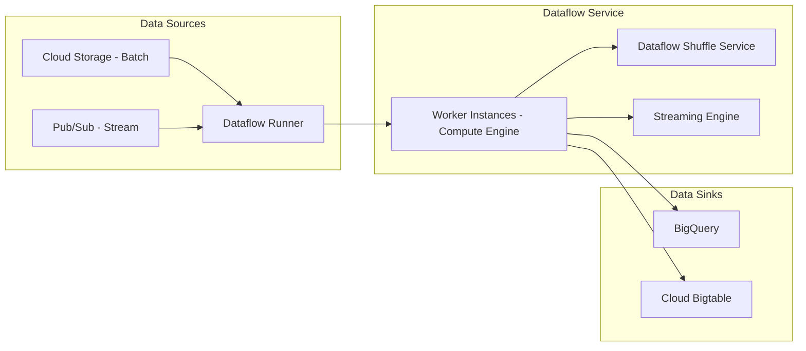

## Stream and Batch Processing with Dataflow

### Section at a Glance
**What you'll learn:**
- The fundamental "Unified Model" that distinguishes Dataflow from traditional MapReduce or Spark architectures.
- How to implement windowing, watermarks, and triggers to handle late-arriving data in streaming pipelines.
- The architectural differences between the Dataflow Runner and the Apache Beam SDK.
- Strategies for optimizing pipeline performance and managing cost in both batch and streaming modes.
- Integration patterns for building end-to-end production-grade ETL/ELT pipelines on GCP.

**Key terms:** `Apache Beam` · `PCollection` · `PTransform` · `Watermark` · `Windowing` · `Streaming Engine` · `Side Inputs` · `Windowing`

**TL;DR:** Dataflow is a fully managed, serverless service for executing unified stream and batch data processing pipelines using the Apache Beam SDK, eliminating the operational overhead of managing clusters while handling both real-time and historical data with a single code base.

---

### Overview
In the modern enterprise, data arrives in two distinct velocities: the "historical" (batch) and the "immediate" (stream). Historically, companies had to maintain two separate codebases and two separate engineering teams—one for batch processing (e.g., Hadoop/MapReduce) and one for real-stream processing (e.g., Apache Flink or Storm). This "Lambda Architecture" created massive technical debt, as logic had to be duplicated and synchronized across different systems.

Dataflow solves this "dual-pipeline" problem by providing a **Unified Model**. Built on the Apache Beam SDK, Dataflow allows a single piece of logic to process a static file in Cloud Storage (Batch) and a continuous stream from Pub/Sub (Streaming) with identical semantics.

For a business, this means reduced engineering overhead, faster time-to-market for new features, and significantly higher data consistency. Instead of managing infrastructure, your engineers focus on the transformation logic, while Dataflow handles the autoscaling, provisioning, and resource management.

---

### Core Concepts

To master Dataflow, you must move beyond thinking about "rows in a table" and start thinking about "unbounded collections of data."

*   **The Apache Beam SDK:** Dataflow is the *execution engine* (the Runner), while Apache Beam is the *programming model*. You write your code in Beam (Python, Java, or Go), and Dataflow executes it.
*   **PCollection:** The core abstraction. A `PCollection` represents a distributed data set. 
    *   In **Batch**, a `PCollection` is bounded (it has a clear beginning and end).
    *   In **Streaming**, a `PCollection` is unbounded (it is an infinite stream of data).
*   **PTransform:** The operations performed on your data (e.g., `ParDo`, `GroupByKey`, `Combine`).
*   **Windowing:** The process of dividing a `PCollection` into finite chunks based on time or other criteria.
    *   **Fixed Windows:** Time intervals of equal length (e.g., every 5 minutes).
    *   **Sliding Windows:** Overlapping intervals (e.g., a 10-minute window that starts every 5 minutes).
    *   **Session Windows:** Windows defined by periods of activity followed by gaps of inactivity.
*   **Watermarks:** 📌 **Must Know:** The watermark is Dataflow's notion of progress in event time. It is the system's way of saying, "I am reasonably sure that no more data with an event timestamp earlier than $X$ will arrive." 
    *   *Customer Query:* "What happens if data arrives after the watermark has passed?"
    *   *SA Answer:* "That is considered 'late data.' You must define **Triggers** to decide whether to drop that data, update your previous results, or trigger a special corrective pane."
*   **Triggers:** The mechanism that determines when a window is actually "emitted" or materialized as an output. 
    *   ⚠️ **Warning:** Using overly frequent triggers in a streaming pipeline can lead to "state explosion," where the system spends more resources managing window metadata than processing actual data, significantly driving up costs.

---

### Architecture / How It Works

Dataflow abstracts the underlying Compute Engine instances, but understanding the orchestration is vital for troubleshooting.



1.  **Dataflow Runner:** The orchestration layer that parses your Beam pipeline and converts it into a directed acyclic graph (DAG) of execution steps.
2.  **Worker Instances:** The underlying Compute Engine VMs that perform the actual `PTransforms` on your data.
3.  **Dataflow Shuffle Service:** A service-side implementation of the "Shuffle" operation (re-distributing data across workers), which removes the need for workers to store intermediate data on local disks.
4.  **Streaming Engine:** An offload mechanism that moves window state and many shuffle operations from the worker VMs to a specialized backend, allowing for much smoother autoscaling and smaller, more efficient workers.

---

### Comparison: When to Use What

Choosing the right tool is a frequent architecture review topic.

| Option | Best For | Trade-offs | Approx. Cost Signal |
| :--- | :--- | :--- | :--- |
| **Dataflow** | Complex, unified stream/batch processing; heavy transformations. | Higher cost per unit of compute compared to simple SQL. | Moderate/High (Managed/Serverless) |
| **BigQuery SQL** | Simple, high-volume aggregations and transformations (ELT). | Limited to SQL; cannot handle complex custom logic or complex windowing. | Low (Pay per query/slot) |
| **Dataproc** | Migrating existing Spark/Hadoop workloads without rewriting code. | High operational overhead (you manage clusters and scaling). | Variable (Cluster uptime) |

**How to choose:** If your logic can be expressed in standard SQL and the data is already in BigQuery, use BigQuery. If you have complex, non-SQL logic or need to ingest from Pub/Sub and transform it in real-time, choose Dataflow.

---

### Cost Cheat Sheet

| Scenario | Recommended Option | Key Cost Driver | Watch Out For |
| :--- | :--- | :--- | :--- |
| **Simple Batch ETL** | Dataflow (Standard) | VCPU/Memory usage | Over-provisioning worker types. |
| **High-Volume Streaming** | Dataflow + Streaming Engine | Throughput (Bytes processed) | 💰 **Cost Note:** Not using Streaming Engine; this forces workers to handle shuffle, ballooning disk/CPU costs. |

| **Large-scale Shuffle** | Dataflow Shuffle Service | Volume of data shuffled | High cardinality keys causing "Hot Keys." |
| **Periodic Burst Jobs** | Dataflow Flex Templates | Pipeline startup time/duration | Keeping workers alive longer than necessary. |

> 💰 **Cost Note:** The single biggest cost mistake in Dataflow is failing to enable the **Streaming Engine**. Without it, your workers must manage all the state and shuffle data locally, leading to massive disk I/O and much higher CPU usage as your stream scales.

---

### Service & Tool Integrations

Dataflow rarely exists in a vacuum. It is the "glue" of the GCP data ecosystem.

1.  **The Ingestion Pattern:** `Pub/Sub` $\to$ `Dataflow` $\to$ `BigQuery`. This is the gold standard for real-time analytics.
2.  **The Data Lake Pattern:** `Cloud Storage` $\to$ `Dataflow` $\to$ `BigQuery`. Used for cleaning and structured-loading raw CSV/JSON/Avro files.
3.  **The Feature Store Pattern:** `Pub/Sub` $\to$ `Dataflow` $\to$ `Cloud Bigtable`. Essential for low-latency serving of machine learning features.

---

### Security Considerations

Dataflow integrates deeply with Google Cloud's security perimeter.

| Control | Default State | How to Enable / Strengthen |
| :--- | :--- | :--- |
| **Encryption at Rest** | Enabled (Google Managed) | Use **Customer-Managed Encryption Keys (CMEK)** via Cloud KMS for higher compliance. |
| **Encryption in Transit** | Enabled | Ensure all data sources (like Pub/Sub) are configured for TLS. |
| **Network Isolation** | Public Internet (Default) | Deploy Dataflow workers in a **VPC** with no external IP addresses and use Private Google Access. |
| **Access Control** | IAM-based | Use fine-grained **IAM roles** (e.g., `roles/dataflow.worker`) rather than primitive owner/editor roles. |

---

### Performance & Cost

**Tuning for Performance:**
*   **Avoid Hot Keys:** If one key (e.g., a single `user_id` in a massive stream) has 100x more data than others, one worker will do all the work while others sit idle. Use `Combine.globally()` or sub-keys to redistribute work.
*   **Right-size Workers:** Don't use `n1-standard-32` for a pipeline that only does simple filtering. Use smaller machines and let the **Autoscaling** feature do its job.

**Cost Scenario Example:**
Imagine a pipeline processing 1GB of data per hour.
*   **Scenario A (No Streaming Engine):** You use `n1-standard-1` workers. To handle the shuffle, you need 100GB of persistent disk per worker. Total cost: High due to disk and inefficient CPU usage.
*   **Scenario B (With Streaming Engine):** You use the same `n1-standard-1` workers but offload shuffle. Total cost: Significantly lower, as you only pay for the minimal compute and the processed bytes, with much smaller, cheaper disks.

---

### Hands-On: Key Operations

The following Python snippet demonstrates a basic Beam pipeline that reads from a source and writes to BigQuery.

**Step 1: Define the pipeline logic.**
This script reads a text file, extracts a word, and prepares it for a BigQuery table.

```python
import apache_beam as beam
from apache_beam.options.pipeline_options import PipelineOptions

def run_pipeline():
    # Define your pipeline options (e.g., project, runner, temp_location)
    options = PipelineOptions(runner='DataflowRunner', project='my-gcp-project')

    with beam.Pipeline(options=options) as p:
        (
            p 
            | 'ReadFromGCS' >> beam.io.ReadFromText('gs://my-bucket/input.txt')
            | 'ExtractWord' >> beam.Map(lambda line: {'word': line.split()[0], 'count': 1})
            | 'WriteToBQ' >> beam.io.WriteToBigQuery(
                'my-project:my_dataset.my_table',
                schema='word:STRING, count:INTEGER',
                write_disposition=beam.io.BigQueryDisposition.WRITE_APPEND
            )
        )

if __name__ == '__main__':
    run_pipeline()
```
> 💡 **Tip:** When testing locally, use the `DirectRunner` instead of `DataflowRunner`. It allows you to debug your logic on your laptop without incurring GCP costs or waiting for cluster provisioning.

---

### Customer Conversation Angles

**Q: We already have BigQuery. Why do we need Dataflow?**
**A:** BigQuery is incredible for SQL-based transformations on data already in the warehouse, but Dataflow is for the "processing" part of ETL—handling unstructured data, performing complex windowing, or transforming data *before* it ever hits BigQuery to save on storage and ingest costs.

**Q: Is Dataflow more expensive than Dataproc?**
**A:** It depends on your operational capacity. Dataproc might have a lower "per-compute" cost, but you must pay for the engineering hours spent managing, patching, and scaling the clusters. Dataflow is "hands-off," which often results in a lower Total Cost of Ownership (TCO).

**Q: How do we handle data that arrives 2 hours late?**
**A:** We use Dataflow's Watermarking and Triggering capabilities. We can define a "late data" policy that allows the pipeline to update existing BigQuery rows whenever late data arrives, ensuring eventual accuracy.

**Q: Can Dataflow handle both my real-time clickstream and my nightly CSV uploads?**
**A:** Yes, that is the primary advantage. You can use a single Beam pipeline and simply switch the source from a Pub/Sub topic to a GCS file path.

**Q: We are worried about "Hot Keys" slowing down our pipeline. How does Dataflow help?**
**A:** Dataflow's autoscaling and the use of the Shuffle Service help mitigate this, but we would also implement architectural patterns like "combiner lifting" to aggregate data before the heavy shuffle occurs.

---

### Common FAQs and Misconceptions

**Q: Does Dataflow scale infinitely?**
**A:** While highly scalable, it is subject to the limits of the underlying Google Cloud infrastructure and your quota for Compute Engine resources.
⚠️ **Warning:** Never assume "infinite" scaling; always monitor your `system_lag` metric.

**Q: If I use the Streaming Engine, do I still pay for workers?**
**A:** Yes, you still pay for the Compute Engine VMs (the workers) that execute your code. The Streaming Engine just offloads the "heavy lifting" of state management.

**Q: Can I run Dataflow using only SQL?**
**A:** Not directly. You use the Apache Beam SDK (Python/Java) or Beam SQL. You still need a "Runner" to execute the logic.

**Q: Does Dataflow support Python for all features?**
**A:** Most features are supported, but some advanced Java-centric Beam features might have a delay in Python support. Always check the compatibility matrix for complex transforms.

**Q: Is Dataflow a replacement for Pub/Sub?**
**A:** No. Pub/Sub is the *transport* layer (the messenger); Dataflow is the *processing* layer (the brain). You almost always use them together.

---

### Exam & Certification Focus

*   **Unified Model (Domain: Data Processing):** Understand how the same code handles both Bounded (Batch) and Unbounded (Stream) datasets. 📌 **High Frequency.**
*   **Windowing & Watermarks (Domain: Data Processing):** Be able to identify which windowing type (Fixed, Sliding, Session) is appropriate for a given business requirement. 📌 **High Frequency.**
*   **Choosing between Dataflow and Dataproc (Domain: Architecture):** Know when to use Serverless (Dataflow) vs. Managed Cluster (Dataproc).
*   **Dataflow Shuffle & Streaming Engine (Domain: Optimization):** Understand how these services impact performance and cost-efficiency.

---

### Quick Recap
- Dataflow provides a **Unified Model** for both batch and streaming data using Apache Beam.
- **Watermarks** track progress in event time; **Triggers** handle late-arriving data.
- **Streaming Engine** is a critical component for cost-effective, scalable streaming pipelines.
- Use **BigQuery** for simple SQL; use **Dataflow** for complex, multi-step transformations and real-time ingestion.
- Always design for **Hot Keys** to prevent bottlenecks in distributed processing.

---

### Further Reading
**[Apache Beam Documentation]** — The authoritative guide to the programming model, transforms, and SDKs.
**[Google Cloud Dataflow Service Overview]** — High-level documentation on features, capabilities, and service limits.
**[Dataflow Best Practices]** — Essential reading for performance tuning and cost optimization.
**[Cloud Pub/Sub Documentation]** — Understanding the primary source for Dataflow streaming pipelines.
**[Google Cloud Architecture Framework]** — For understanding how Dataflow fits into a secure, reliable, and cost-optimized ecosystem.