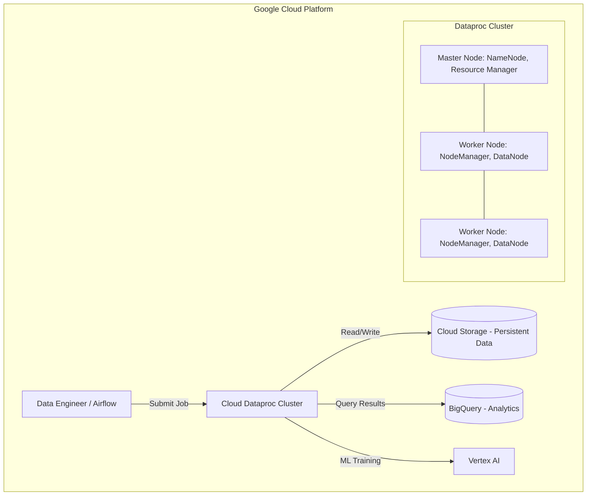

## Managed Hadoop and Spark with Cloud Dataproc

### Section at a Glance
**What you'll learn:**
- The strategic business value of "Lift and Shift" using Cloud Dataproc.
- How to architect ephemeral clusters to minimize operational overhead and cost.
- The architectural shift from HDFS-centric to Cloud Storage (GCS)-centric data processing.
- Implementing autoscaling and using Spot (Preemptible) VMs for cost-optimized batch processing.
- Integrating Dataproc with the broader Google Cloud ecosystem (BigQuery, Vertex AI, and Pub/Sub).

**Key terms:** `Ephemeral Clusters` · `Cloud Storage (GCS) Connector` · `Preemptible/Spot VMs` · `Autoscaling` · `YARN` · `Master/Worker Architecture`

**TL;DR:** Cloud Dataproc is a managed service for running Apache Spark and Hadoop clusters that allows you to rapidly create, scale, and delete clusters, moving away from the high-maintenance, "always-on" infrastructure of traditional on-premises Hadoop environments.

---

### Overview
For many enterprises, the transition to the cloud is not a "big bang" event where every legacy workload is rewritten for serverless technologies. Many organizations possess massive, mature investments in Apache Spark, Hive, and Pig codebases. The primary business pain point is the "Hadoop Tax"—the immense operational burden of managing NameNodes, Zookeeper, and complex hardware lifec edge-cases in on-premises data centers.

Cloud Dataproc addresses this by providing a managed, highly available service that automates the "undifferentiated heavy lifting" of cluster management. It allows data engineers to focus on writing transformation logic rather than patching OS kernels or managing disk failures.

In the context of this course, Dataproc represents your "bridge" technology. While BigQuery is your destination for modern, serverless SQL analytics, Dataproc is your engine for complex, iterative, or legacy-dependent large-scale processing that requires the specific flexibility of the Apache ecosystem.

---

### Core Concepts

#### 1. The Ephemeral Cluster Paradigm
In traditional Hadoop, clusters are "pets"—they are long-lived, carefully nurtured, and expensive to maintain. In Dataproc, the best practice is to treat clusters as "cattle"—specifically, **ephemeral clusters**. You spin a cluster up, run a specific Spark job, and terminate the cluster immediately upon completion.

> 📌 **Must Know:** In a certification context, always favor the **ephemeral cluster** pattern for batch workloads. This is the fundamental way to achieve cost efficiency and operational simplicity in GCP.

#### 2. Decoupling Compute from Storage
Traditional Hadoop relies on HDFS (Hadoop Distributed File System), where data lives on the same nodes that perform the computation. This creates a scaling bottleneck: to get more storage, you must pay for more compute. 

Dataproc breaks this bond using the **Cloud Storage (GCS) Connector**. By using `gs://` paths instead of `hdfs://`, you can use GCS as your primary data lake. 
⚠️ **Warning:** If you store data in the local HDFS of a Dataproc cluster, that data is **lost forever** the moment the cluster is deleted. Always use GCS for persistent data.

#### 3. Scaling and Instance Types
Dataproc allows you to scale horizontally via **Autoscaling policies** that add or remove workers based on YARN memory demand. To further optimize costs, you can leverage **Spot VMs** (formerly Preemptible VMs).
💡 **Tip:** Use Spot VMs for worker nodes in non-critical batch processing to save up to 80% in costs, but always keep your Master node on a standard VM to prevent cluster instability.

---

### Architecture / How It Works



1. **User/Orchestrator:** Triggers a job via CLI, Console, or an orchestrator like Cloud Composer (Airflow).
2. **Master Node:** Manages the cluster state, coordinates resource allocation via YARN, and handles metadata.
3. **Worker Nodes:** Perform the actual heavy lifting, executing the Spark tasks and processing data.
4. **Cloud Storage (GCS):** Serves as the persistent, decoupled storage layer, ensuring data survives cluster termination.
5. **Downstream Services:** The output of Dataproc is typically moved to BigQuery for BI or Vertex AI for machine learning.

---

### Comparison: When to Use What

| Option | Best For | Trade-offs | Approx. Cost Signal |
| :--- | :--- | :--- | :--- |
| **Cloud Dataproc** | Legacy Spark/Hadoop migrations; complex, iterative ML processing. | Requires managing cluster configurations and scaling logic. | Medium (Pay for uptime) |

| **BigQuery** | Serverless SQL analytics; ad-hoc querying; high-concurrency BI. | Less flexibility for non-SQL/non-standard Java/Scala logic. | Variable (Pay per query/storage) |
| **Dataflow**| Unified Stream and Batch processing; complex windowing logic. | Requires rewriting code from Spark to Apache Beam. | Medium (Pay for throughput) |

**How to choose:** If you have existing Spark code and need a "lift and shift," choose **Dataproc**. If you are starting a new project and want zero infrastructure management, choose **BigQuery**. If you need complex stream-processing with specific windowing requirements, choose **Dataflow**.

---

### Cost Cheat Sheet

| Scenario | Recommended Option | Key Cost Driver | Watch Out For |
| :--- | :--- | :--- | :--- |
| **Nightly Batch Job** | Ephemeral Cluster with Spot VMs | Cluster duration (uptime) | Forgetting to delete the cluster |
| **Continuous Streaming** | Persistent Cluster with Autoscale | Number of worker nodes | High cost of running 24/7 |
| **Exploratory Data Science** | Small, short-lived cluster | Instance machine type | Over-provisioning CPU/RAM |
| **Large Scale ETL** | Secondary Workers (Preemptible) | Total vCPU hours | Job failure due to node reclamation |

> 💰 **Cost Note:** The single biggest cost mistake is the **"Zombie Cluster"**—leaving a Dataproc cluster running indefinitely after a job has finished. Always automate cluster deletion in your pipelines.

---

### Service & Tool Integrations

1. **Cloud Storage (GCS):** The foundational integration. Provides the "unlimited" storage required for a modern data lake.
2. **Cloud Composer (Apache Airflow):** The "brain" that orchestrates the lifecycle of Dataproc clusters (Create $\to$ Run Job $\to$ Delete).
3. **BigQuery:** Dataproc can use the BigQuery connector to read from and write directly to BigQuery tables, allowing for hybrid processing.
4. **Vertex AI:** Dataproc can be used to preprocess massive datasets that are then used as input for training models in Vertex AI.

---

### Security Considerations

| Control | Default State | How to Enable / Strengthen |
| :--- | :--- | :--- |
| **IAM (Identity & Access Management)** | Service Account has broad access | Use fine-grained Service Accounts with "Least Privilege." |
| **Network Isolation** | Accessible via public IP (if not configured) | Deploy clusters in a **Private VPC** with no external IP addresses. |
| **Data Encryption** | Google-managed keys | Use **Customer-Managed Encryption Keys (CMEK)** via Cloud KMS. |
| **Audit Logging** | Basic logging enabled | Enable **Data Access Audit Logs** to track who accessed GCS data via Dataproc. |

---

### Performance & Cost

To achieve the best performance-to-cost ratio, you must balance **Compute Power** against **Data Locality**.

**Example Scenario:**
You have a 1TB Spark job.
* **Approach A (Suboptimal):** Running a single, massive `n1-standard-160` node. 
  * *Result:* High cost, high risk of failure, no parallelism.
* **Approach B (Optimized):** Running an ephemeral cluster of 10 `n1-standard-8` nodes using **Spot VMs**.
  * *Result:* Significantly lower cost (due to Spot pricing) and much faster execution due to parallelized disk I/O and CPU usage.

**Tuning Tip:** Always monitor **YARN Memory Utilization**. If your executors are constantly spilling to disk, you don't need more nodes; you need *larger* nodes (more RAM per executor).

---

### Hands-On: Key Operations

First, we create a cluster using the `gcloud` CLI, specifying the use of an ephemeral-friendly configuration.
```bash
# Create a cluster with 2 masters and 10 workers using Spot VMs
gcloud dataproc clusters create my-ephemeral-cluster \
    --region us-central1 \
    --single-node \
    --master-machine-type n1-standard-4 \
    --num-workers 10 \
    --secondary-master 0 \
    --preemptible
```
> 💡 **Tip:** The `--preemptible` flag is the quickest way to slash your worker node costs for batch workloads.

Next, we submit a PySpark job to the cluster, pointing to a script stored in GCS.
```bash
# Submit a PySpark job that reads from GCS
gcloud dataproc jobs submit pyspark gs://my-data-bucket/scripts/etl_job.py \
    --cluster=my-ephemeral-cluster \
    --region=us-central1
```

Finally, we delete the cluster immediately after the job is finished to prevent unnecessary charges.
```bash
# Delete the cluster to stop the billing meter
gcloud dataproc clusters delete my-ephemeral-cluster \
    --region us-central1
```

---

### Customer Conversation Angles

**Q: We have a massive Hadoop cluster on-prem. How long will it take to move to Dataproc?**
**A:** If you use the GCS connector to point your existing Spark/Hive code to Cloud Storage, you can achieve a "Lift and Shift" in weeks rather than months, as you aren't rewriting the logic, just the storage path.

**Q: Is Dataproc cheaper than BigQuery?**
**A:** It depends on the workload. For massive, iterative, or unstructured processing, Dataproc can be more cost-effective. For standard SQL-based analytics, BigQuery's serverless nature usually wins on total cost of ownership.

**Q: What happens to my data if a Spot VM is reclaimed during a job?**
**A:** Because we use GCS as our primary storage, your input and output data remain safe. Spark's built-in fault tolerance will simply re-run the lost task on a different node.

**Q: Can I use Dataproc for real-time streaming?**
**A:** Yes, Dataproc supports Spark Streaming, but for high-scale, production-grade streaming, we often recommend Dataflow for its superior windowing and managed scaling.

**Q: How do I ensure my data engineers don't accidentally delete our production data?**
**A:** We implement strict IAM roles and use GCS Bucket Lock (Object Retention) policies, so even if a cluster is deleted, the underlying data in GCS remains immutable and protected.

---

### Common FAQs and Misconceptions

**Q: Does Dataproc replace the need for BigQuery?**
**A:** No. They are complementary. Dataproc is for heavy-duty processing; BigQuery is for high-speed analytics.

**Q: Is all data in Dataproc ephemeral?**
**A:** ⚠️ **Warning:** Only data stored on the cluster's local disks (HDFS) is ephemeral. Data stored in `gs://` buckets is permanent.

**Q: Can I run Hadoop Hive on Dataproc?**
**A:** Yes, Dataproc comes with Hive, Pig, and Presto pre-installed and ready to use.

**Q: Is Dataproc a serverless service?**
**A:** No. While it is "managed," you are still technically managing a cluster (even if it's ephemeral). For a truly serverless experience, look at BigQuery or Dataflow.

**Q: Can I use custom libraries in my Spark job?**
**A:** Yes, you can use initialization actions to install custom software or use `.zip/.py` files provided in your job submission.

---

### Exam & Certification Focus
*   **Domain: Designing and Planning Data Processing Solutions**
*   **Key Topics to Master:**
    *   📌 **Ephemeral vs. Persistent Clusters:** Know when to use which (Batch = Ephemeral).
    *   📌 **Storage Strategy:** The critical importance of moving from HDFS to GCS.
    *   📌 **Cost Optimization:** Using Spot/Preemptible VMs for worker nodes.
    *   📌 **Service Selection:** Distinguishing between Dataproc (Hadoop/Spark), Dataflow (Beam), and BigQuery (SQL).

---

### Quick Recap
- Dataproc is the premier choice for "Lift and Shift" of legacy Hadoop/Spark workloads.
- The **Ephemeral Cluster** pattern is the industry standard for cost and operational efficiency.
- **Decoupling Compute from Storage** via GCS is the single most important architectural change.
- **Spot VMs** can drastically reduce costs for fault-tolerant batch processing.
- Dataproc integrates deeply with the GCP ecosystem (GCS, BigQuery, Vertex AI).

---

### Further Reading
**[Google Cloud Documentation]** — Official guide to Dataproc cluster configuration and lifecycle.
**[Dataproc Architecture Whitepaper]** — Deep dive into how Google manages the underlying infrastructure.
**[Cloud Storage Connector Docs]** — Critical instructions on using `gs://` in Spark/Hive.
**[Cost Optimization Best Practices]** — Detailed strategies for reducing cloud spend in data workloads.
**[BigQuery vs. Dataproc Reference Architecture]** — How to design hybrid architectures for complex data pipelines.