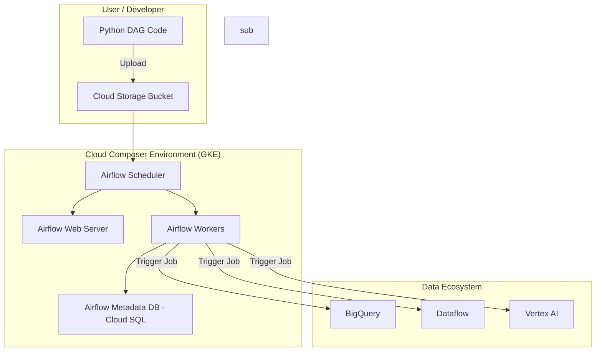

## Workflow Orchestration with Cloud Composer

### Section at a Glance
**What you'll learn:**
- Understanding the fundamental role of Apache Airflow and Cloud Composer in data pipelines.
- Designing Directed Acyclic Graphs (DAGs) to manage complex task dependencies.
- Distinguishing between Cloud Composer and lightweight alternatives like Cloud Workflows.
- Implementing scaling and resource management strategies for production workloads.
- Implementing security best practices and environment isolation in a managed environment.

**Key terms:** `DAG` · `Functions` · `Operators` · `Sensors` · `XCom` · `Scheduler` · `Worker`

**TL;DR:** Cloud Composer is a fully managed Apache Airflow service that allows you to automate, schedule, and monitor complex, multi-step data pipelines across Google Cloud, ensuring that data arrives in the right place, at the right time, and in the right format.

---

### Overview
In a modern data architecture, data does not simply move from point A to point B in a single, continuous stream. It undergoes transformations, joins, aggregations, and validations. The "spaghetti" problem arises when engineers attempt to manage these interdependent steps using simple cron jobs or disconnected script executions. Without a central orchestrator, a failure in "Step 2" might not stop "Step 3" from running, leading to corrupted datasets and "silent failures" that are only discovered days later by downstream business users.

Cloud Composer solves this by providing a unified control plane. It acts as the "brain" of your data operations. While services like BigQuery do the heavy lifting of processing data, and Dataflow handles stream processing, Cloud Composer manages the *logic of the sequence*. It ensures that the BigQuery load job only starts after the Cloud Storage file arrival is confirmed, and that the Vertex AI training model only triggers once the feature engineering pipeline has successfully completed.

For a business, this translates to **operational resilience**. Instead of engineers spending hours debugging why a dashboard is empty, Cloud Composer provides immediate visibility into exactly which node in the workflow failed, why it failed, and allows for automated retries. It transforms data engineering from a reactive "firefighting" discipline into a proactive, automated manufacturing process.

---

### Core Concepts

To master Cloud Composer, you must move beyond thinking of "scripts" and start thinking in terms of "graphs."

*   **DAG (Directed Acyclic Graph):** The core unit of work. A DAG is a collection of all the tasks you want to run, organized in a way that reflects their dependencies. 
    *   **Directed:** There is a clear path from start to finish.
    *   **Acyclic:** There are no loops; a task cannot eventually point back to itself. 
    📌 **Must Know:** In the exam, if a workflow description implies a loop or a circular dependency, it is *not* a DAG.
*   **Operators:** These are the templates for your tasks. An operator defines what actually happens.
    *   *Action Operators:* Execute a specific command (e.g., `BigQueryInsertJobOperator`).
    *   *Transfer Operators:* Move data between services (e.g., `GCSToBigQueryOperator`).
    *   *Sensors:* A special type of operator that "waits" for an external event. ⚠️ **Warning:** Overusing sensors can lead to "sensor deadlock" where all available worker slots are occupied by tasks that are simply waiting, preventing actual work from starting.
*   **Tasks:** The actual instantiation of an operator within a DAG.
*    and **XCom (Cross-Communication):** This is the mechanism used to pass small amounts of metadata between tasks. 
    💡 **Tip:** Never use XCom to pass large datasets (like a CSV or a BigQuery result). XCom is stored in the Airflow metadata database; passing large objects will degrade the performance of the entire environment.
*   **The Environment Components:**
    *   **Scheduler:** The heartbeat. It monitors all DAGs and triggers task instances whose dependencies have been met.
    🚀 **Note:** In Composer 2, the Scheduler is managed and scales more fluidly than in Composer 1.
    *   **Worker:** The muscle. This is where the actual code (your Python logic or SQL commands) is executed.
    *   **Web Server:** The interface. This is the UI where you visualize your DAGs, inspect logs, and manually trigger runs.

---

### Architecture / How It Works

Cloud Composer is built on top of Google Kubernetes Engine (GKE). When you create an environment, Google provisions a managed cluster of resources to run the Airflow components.



1.  **Cloud Storage Bucket:** The "source of truth" where your DAG Python files reside.
2.  **Airflow Scheduler:** Watches the GCS bucket for changes and determines when tasks are ready to run.
3.  **Airflow Web Server:** Provides the UI for human interaction and monitoring.
4.  **Airflow Workers:** Pods within GKE that execute the actual logic of your operators.
5.  **Cloud SQL (Metadata DB):** A managed database that stores the state of every task, every DAG run, and every XCom.
6.  **External Services:** The various GCP services that the Workers trigger via APIs.

---

### Comparison: When to Use What

Choosing the wrong orchestration tool is a common architectural error that leads to massive over-provisioning.

| Option | Best For | Trade-offs | Approx. Cost Signal |
| :--- | :--- | :--- | :--- |
| **Cloud Composer** | Complex, multi-step, long-running ETL/ELT pipelines with many dependencies. | High "base" cost; requires more management overhead than Workflows. | 💰 High (Running a cluster 24//7) |
| **Cloud Workflows** | Lightweight, event-driven, low-latency orchestration (e.g., reacting to a Pub/Sub message). | Limited to HTTP-based logic; difficult to manage complex data transformations. | 📉 Low (Pay-per-use/execution) |
| **Dataflow** | Large-scale, high-throughput stream or batch data processing. | Focuses on *data movement/transform*, not *task sequencing*. | 📈 Medium (Pay for vCPUs/Memory) |

**How to choose:** If your logic is "If A finishes, then start B, then C, and if C fails, alert someone," use **Cloud Composer**. If your logic is "When a file hits this bucket, immediately trigger a Cloud Function," use **Cloud Workflows**.

---

### Cost Cheat Sheet

| Scenario | Recommended Option | Key Cost Driver | Watch Out For |
| :--- | :--- | :--- | :--- |
| **Daily Batch ETL** | Composer (Small Environment) | Environment uptime (GKE nodes) | Leaving a large environment running for a task that only runs once a day. |
| **Real-time Event Processing** | Cloud Workflows | Number of steps/executions | High-frequency triggers (e.g., 1000s/sec) can lead to unexpected usage costs. |
| **Complex ML Pipelines** | Composer (Large/Autoscaling) | Worker CPU/Memory usage | Heavy Python libraries in your DAGs increasing worker startup time. |
| **Data Migration/One-off** | Cloud Data Transfer Service | Volume of data moved | Using Composer to move data manually instead of using a dedicated service. |

💰 **Cost Note:** The single biggest cost mistake in Cloud Composer is **over-provisioning the environment size** for workloads that only run once a day. Because Composer runs a persistent GKE cluster, you pay for the "idle" time of that cluster 24/7. For intermittent tasks, consider using Cloud Workflows or Cloud Functions.

---

### Service & Tool Integrations

Cloud Composer acts as the glue for the Google Cloud ecosystem.

1.  **BigQuery Integration:** Using the `BigQueryInsertJobOperator` to execute SQL scripts, manage partitioned tables, and manage datasets as part of a pipeline.
2.  **Cloud Storage Integration:** Using `GCSToBigQueryOperator` to automate the ingestion of raw files into structured tables.
3.  **Vertex AI Integration:** Triggering training pipelines or batch prediction jobs, ensuring models are updated only after fresh data is available.
4.  **Pub/Sub Integration:** Using **Sensors** to pause a DAG until a specific message or event is detected in a Pub/Sub topic.

---

### Security Considerations

Security in Cloud Composer must be addressed at the identity, network, and data levels.

| Control | Default State | How to Enable / Strengthen |
| :--- | :--- | :--- |
| **IAM (Identity & Access Management)** | Service Account-based | Use the principle of least privilege; assign specific roles to the Composer Service Account. |
| **Network Isolation** | Public/Private Access | Use **VPC Service Controls** and Private Google Access to ensure traffic stays within your VPC. |
| **Encryption at Rest** | Google-managed keys | Use **Customer-Managed Encryption Keys (CMEK)** via Cloud KMS for sensitive data in GCS/BigQuery. |
| **Audit Logging** | Enabled (Cloud Audit Logs) | Ensure Data Access logs are enabled to track who triggered which DAG and when. |

---

### Performance & Cost

**The "Large DAG" Bottleneck:**
A common performance killer is creating a single, massive DAG with hundreds of tasks. This places immense pressure on the **Scheduler** and the **Metadata Database**. 

*   **The Symptom:** Tasks stay in a "scheduled" or "queued" state for long periods even when resources are available.
*   **The Fix:** Break large, monolithic DAGs into smaller, modular DAGs that communicate via sensors or external triggers.

**Example Cost Scenario:**
Imagine an environment running 24/7 for a BigQuery pipeline.
*   **Scenario A (Small Env):** 1 small worker, minimal CPU. Cost: ~$300/month.
*   **Scenario B (Over-provisioned):** 5 large workers, high memory. Cost: ~$1,200/month.
*   **The Result:** If your actual workload only uses 5% of the capacity in Scenario B, you are wasting ~$900/month. Always start small and use **Composer 2 Autoscaling** to grow as needed.

---

### Hands-On: Key Operations

The following Python snippet demonstrates how to define a simple DAG that runs a BigQuery job.

First, we define the default arguments, which include retry logic—a critical feature for production stability.
```python
from airflow import DAG
from airflow import operators
from airflow.providers.google.cloud.operators.bigquery import BigQueryInsertJobOperator
from datetime import datetime, timedelta

# Define the retry strategy to handle transient network errors
default_args = {
    'retries': 3,
    'retry_delay': timedelta(minutes=5),
}

with DAG(
    'bq_transformation_pipeline',
    default_args=default_args,
    start_date=datetime(2023, 1, 1),
    schedule_interval='@daily',
    catchup=False # Prevents running all past missed days since 2023
) as dag:

    # This task executes a SQL command in BigQuery
    run_query = BigQueryInsertJobOperator(
        task_id='transform_daily_sales',
        configuration={
            'query': {
                'query': 'SELECT user_id, SUM(amount) FROM `my_project.my_dataset.sales` GROUP BY 1',
                'useLegacySql': False,
            }
        }
    )
```
💡 **Tip:** Always set `catchup=False` in your DAG definition unless you specifically intend to backfill all historical data from the `start_date`. Leaving it `True` can trigger hundreds of concurrent tasks the moment you deploy, potentially crashing your environment or incurring massive BigQuery costs.

---

### Customer Conversation Angles

**Q: We already use Cloud Functions for our data moves. Why should we pay for Cloud Composer?**
**A:** Cloud Functions are great for single, isolated events, but they lack "state." If you have a process where Step 3 *must* wait for Step 2, and you need to see a visual history of successes and failures, Cloud Composer provides the orchestration and observability that functions cannot.

**Q: How do we know if our pipeline failed before our customers do?**
**A:** Cloud Composer provides real-time monitoring via the Airflow UI and integrates natively with Cloud Monitoring. We can set up alerts to notify your team via Slack or Email the moment a task enters a "failed" state.

**Q: Is Cloud Composer secure enough for our highly regulated financial data?**
**A:** Absolutely. We can deploy Composer within a Private VPC, use Customer-Managed Encryption Keys (CMEK) for all underlying storage, and use VPC Service Controls to ensure data cannot be exfiltrated to unauthorized projects.

**Q: We have a very limited budget. Can we use Composer for small, infrequent tasks?**
**A:** If the task is truly infrequent and small, I would actually recommend Cloud Workflows. It's much more cost-effective for lightweight, event-driven logic. Composer is best reserved for your core, heavy-duty data processing.

**Q: What happens to our pipeline if the Composer environment itself goes down?**
**A:** Because Cloud Composer is a managed service running on GKE, Google handles the availability of the infrastructure. If a component fails, Google's control plane automatically restarts or replaces it, ensuring high availability for your workloads.

---

### Common FAQs and Misconceptions

**Q: Can I run any Python library in my Cloud Composer tasks?**
**A:** Yes, but you must include them in your environment's `requirements.txt` file. ⚠️ **Warning:** Adding too many heavy libraries can significantly increase the time it takes for your environment to scale or restart.

**Q: Does Cloud Composer replace BigQuery?**
**A:** No. BigQuery is the *engine* (the compute); Cloud Composer is the *driver* (the orchestrator).

**Q: If I delete a DAG from my GCS bucket, does it disappear from the UI?**
**A:** It will disappear from the "active" list, but the history of its previous runs remains in the metadata database until the logs are cleaned up.

**Q: Is Airflow the same thing as Cloud Composer?**
**A:** No. Airflow is the open-source software; Cloud Composer is the managed Google Cloud service that runs Airflow on GKE.

**Q: Can I use Cloud Composer to run real-time streaming?**
**A:** Not directly. Composer is designed for batch and micro-batch orchestration. For true, sub-second streaming, you should use Dataflow.

**Q: Does the Scheduler run every second?**
**A:** The Scheduler runs in a loop based on a configurable interval, checking for new tasks to trigger. It is not a "constant" stream but a periodic check.

---

### Exam & Certification Focus

For the **Google Cloud Professional Data Engineer** exam, focus on these high-frequency areas:

*   **Service Selection (Domain: Designing Data Processing Systems):** Being able to choose between Composer (complex/batch), Workflows (simple/event-driven), and Dataflow (streaming/heavy processing). 📌 **Must Know**
*   **DAG Fundamentals (Domain: Building and Operationalizing Data Pipelines):** Understanding the definition of a DAG and the difference between Operators and Sensors.
*   **Error Handling (Domain: Operationalizing Data Pipelines):** Knowledge of `retries` and `retry_delay` in DAG arguments.
*   **Cost Optimization (Domain: Operationalizing Data Pipelines):** Identifying the cost implications of environment sizing and the "catchup" parameter.
*   **Scaling (Domain: Designing Data Processing Systems):** Understanding how Composer 2 uses GKE to autoscale workers.

---

### Quick Recap
- Cloud Composer is a **managed Apache Airflow** service for complex orchestration.
- **DAGs** define the workflow; **Operators** define the tasks; **Sensors** wait for events.
- Use **Cloud Workflows** for lightweight/event-driven; use **Composer** for complex/dependency-heavy pipelines.
- **Cost Efficiency** requires careful management of environment size and avoiding "catchup=True" unless necessary.
- Security is achieved through **IAM, VPC Service Controls, and CMEK**.

---

### Further Reading
**[Airflow Documentation]** — The definitive guide to all Airflow operators, triggers, and internal mechanics.
**[Google Cloud Composer Documentation]** — Specifics on managing the managed environment, GKE integration, and scaling.
**[Google Cloud Architecture Framework]** — Best practices for designing reliable and cost-effective data pipelines.
**[Cloud Composer Best Practices Whitepaper]** — Deep dive into performance tuning and cost optimization strategies.
**[Google Cloud Networking Documentation]** — Essential for understanding VPC Service Controls and private connectivity.