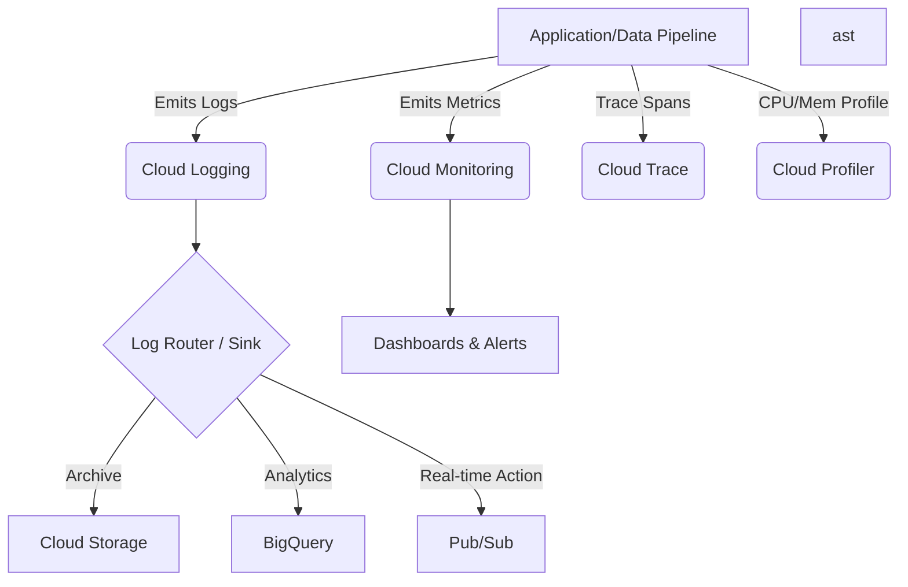

## Monitoring, Logging, and Observability

### Section at a Glance
**What you'll learn:**
- The fundamental distinction between monitoring, logging, and observability.
- How to implement proactive alerting using Cloud Monitoring to reduce MTTR.
- Designing robust log aggregation pipelines using Log Sinks to BigQuery and Pub/Sub.
- Leveraging Cloud Trace and Cloud Profiler to identify bottlenecks in distributed data pipelines.
- Managing the cost and performance implications of high-cardinalability metrics and log volume.

**Key terms:** `Cloud Monitoring` · `Cloud Logging` · `Log Sink` · `SLI/SLO/SLA` · `Cardinality` · `Cloud Trace`

**TL;DR:** Monitoring tells you *if* something is broken; Logging tells you *why* it is broken; Observability allows you to understand the internal state of a system by looking at its external outputs.

---

### Overview
In a modern, distributed cloud environment, "system failure" is rarely a binary state of a single server being down. Instead, failure manifests as increased latency, partial data loss, or silent downstream corruption. For a Data Engineer, the business impact of these failures is measured in broken SLAs, inaccurate reporting, and lost revenue.

The Google Cloud Observability suite (formerly Stackdriver) provides the essential "eyes and ears" for your infrastructure. Without a robust observability strategy, your engineering team moves from a proactive stance (fixing issues before customers notice) to a reactive, "firefighting" stance (responding to customer complaints). 

This section moves beyond simple "up/down" checks. We will explore how to build an ecosystem where telemetry data is not just collected, but utilized to drive automated recovery, audit compliance, and cost-optimized performance tuning.

---

### Core Concepts

#### 1. Cloud Monitoring (The "What")
Cloud Monitoring focuses on **Metrics**—numerical representations of data measured over intervals of time.
*   **System Metrics:** Automatically collected by GCP (e.g., CPU utilization of a Compute Engine instance, BigQuery slot usage).
*   **Custom Metrics:** Metrics you define within your application code (e.s., number of records processed by a Dataflow job).
*   **SLIs, SLOs, and SLAs:** 
    *   **SLI (Indicator):** A specific metric (e.g., "Latency of the ingestion API").
    *   **SLO (Objective):** The target value for an SLI (e.g., "99% of requests must be < 200ms").
    *   **SLA (Agreement):** The business contract (e.g., "If we miss our SLO, we credit the customer").

> 📌 **Must Know:** In the exam, if you are asked how to measure the health of a service, look for **SLOs**. Monitoring is the tool; SLOs are the standard.

#### 2. Cloud Logging (The "Why")
Cloud Logging captures, stores, and analyzes structured and unstructured data.
*   **Log Entries:** Every log is an event with metadata (timestamp, severity, resource type).
*    **Log Router (Sinks):** This is the "traffic controller." It allows you to route logs to different destinations:
    *   **Cloud Storage:** For long-term, low-cost archival (Compliance).
    *   **BigQuery:** For deep analytical querying (Data Engineering's favorite).
    *   **Pub/Sub:** For real-time streaming processing (Automated alerting/reactive pipelines).

> ⚠️ **Warning:** Never use BigQuery as your *primary* log storage for high-frequency, real-time debugging. While powerful for analysis, the cost of continuous ingestion and the latency of BigQuery can become prohibitive compared to the Logging-native Log Explorer.

#### 3. Cloud Trace & Profiler (The "Where")
*   **Cloud Trace:** A distributed tracing system that tracks how requests move through a complex architecture (e.g., from a Cloud Function to a Pub/Sub topic to a Dataflow job).
*   **Cloud Profiler:** Analyents the CPU and memory usage of your applications at the code level to find "hot" functions.

#### 4. Cardinality: The Silent Killer
**Cardinality** refers to the uniqueness of values in a metric.
*   **Low Cardinality:** `region` (e.g., `us-east1`, `europe-west1`).
*   **High Cardinality:** `user_id` (e.g., `user_123456789`).

> ⚠️ **Warning:** Creating custom metrics that include high-cardinality dimensions (like `user_id` or `order_id`) can lead to an exponential explosion in the number of time series, causing massive cost spikes and dashboard performance degradation.

---

### Architecture / How It Works



1.  **Application/Data Pipeline:** The source of telemetry (logs, metrics, traces).
2.  **Cloud Logging:** The ingestion engine that receives and indexes log entries.
3.  **Log Router:** Evaluates filters to decide where each log entry should be sent.
4.  **Destinations (BigQuery/GCS):** The final resting places for data, chosen based on retention needs and query requirements.
5.  **Cloud Monitoring:** The engine that aggregates metrics and triggers alerts based on thresholds.

---

### Comparison: When to Use What

| Option | Best For | Trade-offs | Approx. Cost Signal |
| :--- | :--- | :--- | :--- |
| **Cloud Logging (Log Explorer)** | Immediate, real-time debugging and searching. | Limited retention period; expensive for massive volumes. | High (per GB ingested) |
| **BigQuery (via Log Sink)** | Long-term trend analysis and audit investigations. | Not real-time (latency in sink); requires SQL knowledge. | Medium (Storage + Query) |
| **Cloud Storage (via Log Sink)** | Compliance and regulatory long-term archiving. | Extremely difficult to query; "cold" data. | Low (Standard/Archive) |
| **Pub/Sub (via Log Sink)** | Triggering automated responses (e.g., auto-scaling). | Requires downstream compute (e.g., Cloud Functions) to act. | Medium (Data volume) |

**How to choose:** Use **Log Explorer** for "what just happened," **BigQuery** for "what happened over the last 6 months," and **Cloud Storage** for "we need to keep this for 7 years for legal reasons."

---

### Cost Cheat Sheet

| Scenario | Recommended Option | Key Cost Driver | Watch Out For |
| :--- | :--- | :--- | :--- |
| **Daily Debugging** | Cloud Logging (Default Bucket) | Ingestion volume (GB/day) | Over-logging "Debug" level logs in production. |
| **Compliance Audit** | Cloud Storage (Archive Class) | Data volume & Retrieval fees | Not setting a lifecycle policy to move data to Archive. |
/ | **Operational Analytics** | BigQuery | Unoptimized, "SELECT *" queries on massive log tables. |
| **Real-time Alerting** | Cloud Monitoring Alerts | Number of active Alerting Policies | Too many fine-grained alerts causing "Alert Fatigue." |

> 💰 **Cost Note:** The single biggest cost mistake is failing to implement **Log Exclusion Filters**. If you are ingesting "Verbose" or "Debug" logs from a high-traffic service into Cloud Logging, you are paying a premium for data that provides zero business value in production.

---

### Service & Integrations

1.  **Dataflow + Cloud Monitoring:**
    *   Monitor "System Lag" and "Data Watermark" to detect pipeline processing delays.
    *   Use custom counters to track record error rates within your `DoFn`.
2.  **Pub/Sub + Cloud Logging:**
    *   Route Pub/Sub "Subscription Dead Letter" logs to a BigQuery sink.
    *   Use this to build a dashboard showing the volume of unprocessable messages over time.
3.  **Compute Engine + Cloud Trace:**
    *   Instrumenting web servers to trace a request from the Load Balancer through to the backend database.

---

### Security Considerations

Observability data is a goldmine for attackers. If they can see your logs, they may see sensitive PII or system vulnerabilities.

| Control | Default State | How to Enable / Strengthen |
| :--- | :--- | :--- |
| **Audit Logging** | Admin Activity is ON; Data Access is OFF. | Explicitly enable **Data Access logs** for sensitive services (e.g., BigQuery, Cloud Storage). |
| **Log Content Security** | Plaintext in logs. | Implement **Log Redaction** (via Data Loss Prevention API) before logs reach the sink. |
| **Access Control** | IAM-based. | Use **Fine-grained Access Control** for Log Buckets to restrict PII access. |
| **Encryption** | Encrypted at rest/transit. | Use **Customer-Managed Encryption Keys (CMEK)** for highly regulated environments. |

---

### Performance & Cost

**The Cardinality Problem in Practice:**
Imagine a Dataflow pipeline processing 1 million transactions per hour.
*   **Scenario A (Good):** You track a metric `records_processed_total`. This is 1 time series. Cost: Negligible.
*   **Scenario B (Bad):** You track a metric `records_processed_per_transaction_id`. This creates 1,000,000 time series per hour.
*   **Impact:** Your Cloud Monitoring bill will skyrocket, and your dashboards will likely time out or fail to load because the system is trying to compute an aggregate across millions of unique series.

---

### Hands-On: Key Operations

**1. Create a Log Sink to BigQuery**
This command routes all logs with the `ERROR` severity to a specific BigQuery dataset for long-term analysis.
```bash
gcloud logging sinks create error-analysis-sink \
    bigquery.googleapis.com/projects/my-project/datasets/my_dataset \
    --log-filter="severity=ERROR"
```
> 💡 **Tip:** Always test your `--log-filter` in the Logs Explorer UI before running this command to ensure you aren't over-ingesting data.

**2. Inspecting Logs via CLI**
Use this to quickly check recent error logs without opening the web console.
```bash
gcloud logging read "severity>=ERROR" --limit=5 --format="table(timestamp, textPayload)"
```

---

### Customer Conversation Angles

**Q: "We are worried about the cost of Cloud Logging as our traffic scales. How do we control this?"**
**A:** "We should implement Log Exclusion Filters to drop high-volume, low-value logs (like 200 OKs) at the ingestion point, and use Sinks to move the essential logs to cheaper storage like Cloud Storage or BigQuery."

**Q: "How can I be sure our data pipeline is actually meeting our 99.9% processing SLA?"**
**A:** "We will define Service Level Indicators (SLIs) around your pipeline's 'system lag' and 'completeness,' then set up Cloud Monitoring alerts that trigger when these metrics approach your defined SLO threshold."

**Q: "Can we use logs to trigger automated recovery of our services?"**
**A:** "Absolutely. We can route specific error logs via a Log Sink to Pub/Sub, which can then trigger a Cloud Function to restart a service or scale up your resources."

**Q: "Is it safe to log all our application's input parameters for debugging?"**
**A:** "It's a security risk. We recommend using the Cloud DLP (Data Loss Prevention) API to redact sensitive information like PII or credentials before they are written to your permanent logs."

**Q: "Why should we invest in Observability instead of just using traditional monitoring?"**
**A:** "Traditional monitoring tells you when a system is down; Observability allows you to understand *why* a distributed system is behaving unpredictably, which is critical for the complex, interconnected architecture you are running on GCP."

---

### Common FAQs and Misconceptions

**Q: Is Cloud Monitoring and Cloud Logging the same thing?**
**A:** No. Monitoring is for numerical metrics and alerts; Logging is for text-based event records.

**Q: Does Cloud Logging keep my logs forever?**
**A:** No. ⚠️ **Warning:** By default, logs are kept for 30 days. For long-term retention, you must use a Log Sink to Cloud Storage.

**Q: Can I query logs using SQL?**
**A:** Not directly in the Logs Explorer, but if you use a Log Sink to BigQuery, you can use standard SQL to perform deep analysis.

**Q: Does every log I create cost money?**
**A:** Yes. You are charged primarily based on the volume (GB) of logs ingested.

**Q: If I use a Log Sink to BigQuery, does that mean I'm paying for the log twice?**
**A:** You pay for the initial ingestion into Cloud Logging, and then you pay for the secondary write into BigQuery.

**Q: Can Cloud Trace track requests across different cloud providers?**
**A:** While Cloud Trace is optimized for GCP, you can instrument non-GCP services to send trace spans to it, provided they follow the OpenTelemetry standard.

---

### Exam & Certification Focus
*   **Cloud Operations Domain:**
    *   Identifying the correct tool for a task (e.g., Trace for latency, Logging for errors). 📌 **High Frequency**
    *   Designing log architectures (Sinks $\rightarrow$ BigQuery/GCS/PubSub). 📌 **High Frequency**
    *   Understanding the impact of high cardinality on monitoring costs.
    *   Implementing Audit Logs for compliance requirements.

---

### Quick Recap
- **Monitoring** tracks metrics and performance; **Logging** records events; **Observability** provides the context to debug complex systems.
- **Log Sinks** are essential for routing data to BigQuery (Analysis) or GCS (Archival).
- **Cardinality** must be managed to prevent massive cost spikes and performance issues.
- **SLIs/SLOs** are the standard for defining and measuring service reliability.
- **Security** requires enabling Data Access logs and implementing log redaction for sensitive data.

---

### Further Reading
**Google Cloud Documentation** — Detailed guides on all Cloud Observability components.
**Cloud Architecture Center** — Reference architectures for scalable logging and monitoring.
**Cloud Debugger/Profiler Documentation** — Deep dives into application-level performance tuning.
**Google Cloud Pricing Calculator** — For estimating the costs of log ingestion and BigQuery storage.
**Cloud Audit Logs Overview** — Essential reading for security and compliance-focused engineers.