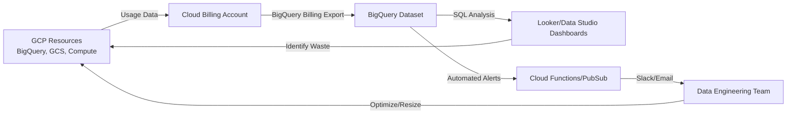

## Cost Management and Billing Optimization

### Section at a Glance
**What you'll learn:**
- Navigating the Google Cloud Billing hierarchy and resource organization.
- Optimizing BigQuery pricing models (On-demand vs. Capacity/Editions).
- Implementing cost-effective Cloud Storage lifecycle management.
- Utilizing FinOps tools: Budgets, Alerts, and the Cost Recommender.
- Managing Compute Engine costs through Spot VMs and Committed Use Discounts (CUDs).

**Key terms:** `FinOps` · `BigQuery Editions` · `Committed Use Discounts (CUD)` · `Cloud Billing Export` · `Lifecycle Management` · `Cost Recommender`

**TL;DR:** Cost management in GCP is about moving from reactive "sticker shock" to proactive "unit economics" by leveraging automated scaling, intelligent storage tiering, and granular visibility through BigQuery billing exports.

---

### Overview
In the era of cloud computing, the primary business challenge has shifted from *capacity planning* (how much hardware do I need?) to *consumption management* (how much is this query costing me?). For data engineers, a single unoptimized SQL query or an improperly configured Dataflow pipeline can trigger massive, unexpected operational expenses (OpEx).

This section addresses the fundamental tension between performance and cost. We treat cost as a first-class architectural constraint, much like latency or throughput. We will explore how to build "cost-aware" data pipelines that automatically scale down during idle periods and move data to cheaper storage tiers as it ages.

By the end of this section, you will understand how to implement a FinOps culture within your engineering team—ensuring that every dollar spent on GCP directly contributes to business value, rather than being wasted on inefficient resource allocation.

---

### Core Concepts

#### The Billing Hierarchy
Google Cloud organizes costs through a strict hierarchy. Understanding this is critical for cost attribution (knowing which department spent what).
1.  **Organization:** The root node (your company).
2.  **Folders:** Logical groupings (e.g., "Production," "Staging," "Marketing").
3.  **Projects:** The fundamental unit of billing. All resources (BigQuery, GCS, etc.) live in a project.
4.  **Resources:** The individual services (e.g., a specific BigQuery table).

📌 **Must Know:** Cost attribution is best managed via **Labels**. Labels are key-value pairs attached to resources (e.g., `env:prod`, `team:data-science`) that allow you to break down your BigQuery billing export by department or application.

#### BigQuery Pricing Models
BigQuery pricing is a frequent source of confusion. There are two primary modes:
*   **On-Demand Pricing:** You pay per TB of data scanned.
    *   ⚠️ **Warning:** A single `SELECT *` on a multi-terabyte table can cost hundreds of dollars in seconds. This model is "unbounded" in cost unless you use quotas.
*    **Capacity-Based (Editions):** You pay for dedicated "Slots" (virtual CPUs) per hour. This uses "Standard," "Enterprise," or "Enterprise Plus" tiers.
    *   This is much more predictable for large-scale, steady-state workloads.

#### Cloud Storage Classes
Storage costs are driven by **Access Frequency** and **Data Volume**.
*   **Standard:** High availability, frequent access.
*   **Nearline/Coldline/Archive:** Lower storage cost, but higher "retrieval" costs.
    *   📌 **Must Know:** If you frequently access data in an Archive bucket, your retrieval fees will likely exceed any savings gained from the lower storage price.

#### Compute Optimization
*   **Spot VMs:** Use spare GCP capacity for a massive discount (up to 91%).
    *   ⚠️ **Warning:** Google can reclaim these VMs at any time with short notice. Never use Spot VMs for stateful workloads or critical production databases without a checkpointing strategy.
*   **Committed Use Discounts (CUDs):** A contract where you commit to a certain amount of usage (vCPU/RAM) for 1 or 3 years in exchange for lower rates.

---

### Architecture / How It Works

The following diagram illustrates the "Continuous Cost Optimization Loop," showing how billing data flows from raw usage into actionable engineering insights.



1.  **GCP Resources:** The origin of all costs (compute, storage, networking).
2.  **Cloud Billing Account:** The centralized entity that aggregates all costs from all projects.
    *   **BigQuery Billing Export:** A built-in feature that streams granular, resource-level usage data into a BigQuery dataset.
3.  **Looker/Data Studio Dashboards:** The visualization layer where engineers track "Cost per Query" or "Cost per Pipeline."
4.  **Automated Alerts:** Logic-driven triggers (e.g., "If cost > $500/day, alert team").
5.  **Data Engineering Team:** The actors who implement changes (e.g., changing a storage class or adjusting a BigQuery reservation).

---

### Comparison: When to Use What

| Option | Best For | Trade-offs | Approx. Cost Signal |
| :--- | :--- | :--- | :--- |
| **BigQuery On-Demand** | Ad-hoc, unpredictable, or low-volume queries. | Unpredictable; high risk of "runaway" costs. | High per-TB cost; low entry barrier. |
| **BigQuery Editions (Capacity)** | Steady-state, large-scale ETL/ELT workloads. | Requires capacity planning; higher complexity. | Predictable; much lower per-unit cost at scale. |
| **GCS Standard Storage** | Active datasets, landing zones for ingestion. | Highest storage price per GB. | Expensive for long-term retention. |
| **GCS Archive Storage** | Regulatory compliance, long-term backups. | High retrieval costs and latency for first byte. | Cheapest storage; expensive to "touch" data. |

**How to choose:** Start with **On-Demand** for experimentation and small projects. As your workload becomes predictable and your daily spend reaches a certain threshold, migrate to **Big/Enterprise Editions** to lock in unit costs.

---

### Cost Cheat Sheet

| Scenario | Recommended Option | Key Cost Driver | Watch Out For |
| :--- | :--- | :--- | :--- |
| **Daily ETL Pipeline** | BigQuery Enterprise Edition | Slot Utilization | Over-provisioning slots during idle time. |
| **Raw Data Landing (S3/GCS)** | GCS Standard | Data Volume (GB) | Lack of Lifecycle Policy (keeping data in Standard forever). |
| **Compliance/Audit Logs** | GCS Archive | Retrieval/Egress | Accessing logs for debugging (retrieval fees). |
| **Unpredictable Research/Ad-hoc** | BigQuery On-Demand | Data Scanned (TB) | `SELECT *` queries on large tables. |

💰 **Cost Note:** The single biggest mistake in BigQuery is failing to use **Partitioning and Clustering**. Without these, every query scans the entire table, effectively multiplying your cost by the number of partitions you *didn't* filter out.

---

### Service & Tool Integrations

1.  **Cloud Billing Export + BigQuery + Looker:**
    *   Enable BigQuery Billing Export in the Billing Console.
    *   Use SQL to aggregate costs by `labels.team` or `labels.env`.
    *   Visualize trends in Looker to identify "Cost Spikes."
2.  **Cloud Storage Lifecycle Management + Cloud Functions:**
    *   Set a policy to move files from `Standard` to `Nearline` after 30 days.
    *   Trigger a Cloud Function to notify the team when a bucket reaches a certain size.
3.  **Cost Recommender + Terraform:**
    *   Review Google's "Right-sizing" recommendations.
    *   Use IaC (Terraform) to automatically adjust machine types based on recommendation feedback.

---

### Security Considerations

Cost management is an extension of security; unauthorized access to billing data can reveal sensitive business intelligence (e.g., revenue-driving scale).

| Control | Default State | How to Enable / Strengthen |
| :--- | :--- | :--- |
| **Billing Access Control (IAM)** | Restricted to Billing Admins. | Use the principle of least privilege; do not grant `Billing Account Administrator` to engineers. |
  | **Audit Logging** | Data Access Logs are often OFF. | Enable **Data Access Audit Logs** for the BigQuery billing dataset to track who is querying cost data. |
| **Encryption of Billing Data** | Encrypted at rest (Google Managed). | Use **Customer-Managed Encryption Keys (CMEK)** if your compliance requires total control over the billing dataset. |

---

### Performance & Cost

In data engineering, **Performance and Cost are two sides of the same coin.**

**Example Scenario: The "Runaway Query"**
*   **The Setup:** A Data Engineer runs a query on a 10TB partitioned table in BigQuery On-Demand mode.
*   **The Mistake:** They forget the `WHERE` clause for the partition column.
*   **The Cost:** At ~$6.25 per TB, a full scan of 10TB costs **$62.50 for a single query.**
*   **The Optimized Way:** Using a partitioned table and filtering by `date`, the query only scans 100GB. The cost drops to **$0.625**.

**Tuning Guidance:**
*   **Dataflow:** Use **Autoscaling**. If you set a fixed number of workers, you pay for idle compute.
*   **BigQuery:** Always use **Clustering** on columns frequently used in filters. This reduces the amount of data read, directly reducing the cost in On-Demand mode.

---

### Hands-On: Key Operations

First, we will use the `gcloud` CLI to identify if any of our projects are exceeding a specific budget threshold.

```bash
# List all budgets in the project to check for active alerts
gcloud billing budgets list --billing-account=[YOUR_BILLING_ACCOUNT_ID]
```
💡 **Tip:** Always use a script or a dashboard to aggregate these; checking them one-by-one via CLI is not scalable for large organizations.

Next, we will apply a label to a BigQuery dataset to enable granular cost tracking.

```bash
# Add a 'team' label to an existing BigQuery dataset
bq update --location=US my_project:my_dataset --labels=team:data_eng,env:prod
```
💡 **Tip:** Ensure your labeling convention is standardized across the organization (e.g., use lowercase and underscores) to prevent fragmented reporting.

---

### Customer Conversation Angles

**Q: "We are worried about our monthly cloud bill becoming unpredictable. How can we prevent spikes?"**
**A:** "We recommend implementing BigQuery quotas to limit the amount of data scanned per day and setting up Cloud Billing Budgets with automated alerts that notify your team as soon as you hit 50%, 80%, and 100% of your threshold."

**Q: "Our data grows by 5TB every month. Won't our storage costs spiral out of control?"**
**A:** "Not if we implement Lifecycle Management policies. We can automate the transition of data from Standard to Coldline storage after 90 days, significantly reducing your long-term storage footprint."

**Q: "We see high costs in Dataflow. Is there a way to optimize this?"**
**A:** "The primary driver is usually worker uptime. We should check if you are using 'Streaming Engine' and ensure your pipeline uses Vertical Autoscaling to shrink the cluster when data volume drops."

**Q: "Can we use Spot VMs for our production ETL jobs?"**
**A:** "I wouldn't recommend it for the primary stage of a critical pipeline due to the risk of interruption. However, we can use them for non-critical, idempotent tasks like data reprocessing or secondary aggregations to save up to 90%."

**Q: "How do I know which department is responsible for which cost?"**
**A:** "We will implement a mandatory labeling policy. By tagging every resource with a `department` label, we can export your billing data to BigQuery and generate a dashboard showing exact cost attribution by team."

---

### Common FAQs and Misconceptions

**Q: Does using BigQuery On-Demand mean I'm paying for the storage?**
**A:** No, BigQuery pricing is split into **Compute (Scanning)** and **Storage**. You pay for the bytes scanned during the query and a separate fee for the bytes stored in the table.

**Q: If I delete a BigQuery table, do I stop being charged for storage immediately?**
**A:** Yes, once the table is deleted, the storage charges for that specific data stop. ⚠️ **Warning:** However, if you have a "Snapshot" or a "Long-term storage" version of that data elsewhere, those costs will persist.

**Q: Is 'Standard' storage always the best for all our data?**
**A:** No. ⚠️ **Warning:** Using Standard storage for data you rarely touch is a common way to waste money. You should use Lifecycle policies to move infrequently accessed data to Nearline or Coldline.

**Q: Are labels free to use?**
**A:** Yes, applying labels to your resources does not incur additional Google Cloud costs.

**Q: Does BigQuery 'Streaming Inserts' cost extra?**
**A:** Yes. While the storage is part of the standard storage cost, there is a separate, much higher cost associated with the "Streaming API" usage for real-time ingestion.

**Q: Can I use CUDs (Committed Use Discounts) for any service?**
**A:** CUDs are primarily available for Compute Engine, Cloud SQL, and Spanner. They are not applied to BigQuery On-Demand or Cloud Storage.

---

### Exam & Certification Focus

*   **Cost Optimization (Data Engineer Domain):**
    *   Identifying when to move data from Standard to Archive storage (📌 **High Frequency**).
    *   Choosing between BigQuery On-Demand and Capacity/Editions based on workload predictability (📌 **High Frequency**).
    *   Calculating the cost impact of `SELECT *` vs. partitioned queries.
    *   Implementing BigQuery Billing Export for FinOps visibility.
    *   Using Labels for cost attribution and reporting.

---

### Quick Recap
- **Hierarchy Matters:** Use Projects and Labels to organize and attribute costs.
- **BigQuery Strategy:** Use Partitioning and Clustering to minimize scan costs.
- **Storage Lifecycle:** Automate the movement of aged data to cheaper tiers (Nearline/Archive).
- **Compute Intelligence:** Use Spot VMs for non-critical tasks and CUDs for predictable workloads.
- **Visibility is Key:** Always export billing data to BigQuery for deep, actionable analysis.

---

### Further Reading
**Google Cloud Billing Documentation** — Comprehensive guide on all billing-related features and hierarchy.
**BigQuery Pricing Overview** — Detailed breakdown of On-Demand vs. Capacity-based pricing.
**Cloud Storage Class Comparison** — Deep dive into the cost-per-GB and retrieval fees for all tiers.
**GCP Cost Optimization Whitepaper** — Best practices for architectural cost reduction.
**FinOps Foundation Framework** — General industry principles applicable to GCP cost management.