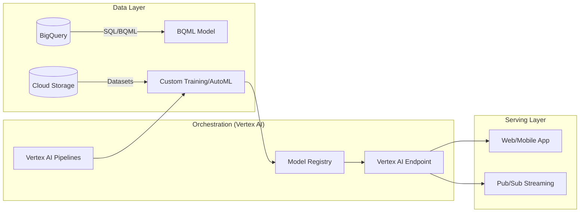

## Machine Learning Integration with Vertex AI

### Section at a Layer
**What you'll learn:**
- How to bridge the gap between data engineering pipelines and ML model deployment.
- Orchestrating ML workflows using Vertex AI Pipelines.
- Leveraging BigQuery ML (BQML) to run machine learning using standard SQL.
- Implementing MLOps patterns to automate model retraining and monitoring.
- Integrating Vertex AI with BigQuery, Cloud Storage, and Dataflow for end-to-end automation.

**Key terms:** `MLOps` · `Vertex AI Pipelines` · `BigQuery ML` · `Feature Store` · `Model Registry` · `Endpoints`

**TL;DR:** Vertex AI is the unified managed platform that integrates data engineering workflows (SQL/Dataflow) with machine learning lifecycles, enabling you to move from raw data in BigQuery to production-grade model predictions via a single, automated ecosystem.

---

### Overview
In many traditional organizations, a "wall of confusion" exists between Data Engineers and Data Scientists. Data Engineers build robust, scalable pipelines in BigQuery and Dataflow, while Data Scientists build models in isolated Jupyter Notebooks. This fragmentation leads to "hidden technical debt," where models fail in production because the data pipeline changed, or models cannot scale because they weren't built for real-time inference.

Vertex AI solves this by providing a unified orchestration layer. For a Data Engineer, Vertex AI is not just a place to "train models"; it is the production engine where your SQL transformations and Dataflow preprocessing jobs become part of a versioned, reproducible machine learning pipeline. 

By integrating ML into the data ecosystem, businesses can move from "batch-and-forget" processing to "continuous intelligence." The business impact is measurable: reduced time-to-market for new features, higher prediction accuracy through fresher data, and significantly lower operational overhead by using managed, serverless ML infrastructure.

---

### Core Concepts

#### 1. BigQuery ML (BQML)
For Data Engineers, BQML is the most impactful integration. It allows you to create and execute machine learning models directly within BigQuery using standard SQL syntax. 
- **No Data Movement:** You don't need to export massive datasets to external ML frameworks.
- **SQL-Native:** If you know `CREATE MODEL`, you can perform linear regression, K-means clustering, and even deep learning.
📌 **Must Know:** BQML is the preferred choice for "low-complexity" ML tasks where the primary goal is to leverage existing SQL expertise and avoid the latency/cost of moving data out of BigQuery.

#### 2. Vertex AI Pipelines
This is the orchestration engine based on Kubeflow and TFX. It allows you to define a Directed Acyclic Graph (DAG) of tasks.
- **Components:** Each step (data ingestion, preprocessing, training, evaluation) is a discrete, reusable component.
- **Serverless:** You don't manage the underlying Kubernetes cluster; Google manages the execution.
⚠️ **Warning:** While pipelines are serverless, a common mistake is designing "monolithic" components. To ensure scalability, each pipeline step should be small, modular, and handle its own data I/O.

#### 3. Vertex AI Feature Store
A centralized repository to store, share, and serve ML features. 
- **Consistency:** Ensures that the same feature logic used in training is used in real-time serving, preventing "training-serving skew."
- **Streaming Support:** Integrates with Pub/Sub and Dataflow to update features in real-time.

#### 4. Model Registry & Endpoints
- **Model Registry:** A central repository to manage model versions. Think of it as "Git for models."
- **Endpoints:** The managed interface used to call your model for predictions.
💡 **Tip:** Always use the Model Registry to version your models; never manually deploy a "latest" version that might be overwritten by a failed pipeline run.

---

### Architecture / How It Works



1. **BigQuery/GCS:** Acts as the primary source of truth for structured and unstructured data.
2. **Vertex AI Pipelines:** Orchestrates the flow, triggering training jobs when new data arrives.
3. **Custom Training/AutoML:** The computational engine where the model is actually built.
4. **Model Registry:** Stores the resulting artifact and its metadata.
5. **Vertex AI Endpoint:** The RESTful interface that serves predictions to downstream applications.

---

### Comparison: When to Use What

| Option | Best For | Trade-offs | Approx. Cost Signal |
| :--- | :--- | :--- | :--- |
| **BigQuery ML** | SQL-heavy teams; simple regression/classification. | Limited to specific algorithms; less control over hyperparameter tuning. | Low (Uses BQ compute) |
 
| **AutoML** | Rapid prototyping; no deep ML expertise required. | "Black box" nature; less control over model architecture. | Medium (High compute cost) |

| **Custom Training** | Complex, specialized architectures (e.g., Deep Learning). | High engineering effort; requires managing containers/code. | High (Requires GPU/TPU) |

**How to choose:** Start with **BQML** if your data is already in BigQuery and the problem is standard. Move to **AutoML** if you have unstructured data (images/video) and need speed. Move to **Custom Training** only when you have a specific scientific requirement that standard libraries cannot meet.

---

### Cost Cheat Sheet

| Scenario | Recommended Option | Key Cost Driver | Watch Out For |
| :--- | :--- | :--- | :--- |
| Batch predictions on huge datasets | BigQuery ML | Bytes processed in BQ | Running complex joins during model creation |
| Real-time, low-latency API | Vertex AI Endpoints | Node hours (Instance uptime) | **Unscaled endpoints** left running 24/ 7 |
| Automated retraining weekly | Vertex AI Pipelines | Pipeline execution time/steps | Over-complex DAGs with too many small steps |
| Storing many feature versions | Vertex Store | Storage and online serving throughput | High-frequency updates to online features |

💰 **Cost Note:** The single biggest cost driver in Vertex AI is **Provisioned Throughчно (Endpoints)**. An endpoint left running on a high-memory machine 24/7 can cost hundreds of dollars per month even if it receives zero requests. Always implement auto-scaling or shut down endpoints when not in use for testing.

---

### Service & Tool Integrations

1. **BigQuery $\rightarrow$ Vertex AI:**
    - Use BigQuery as the feature source for training.
    - Use BQML for direct model creation.
2. **Dataflow $\rightarrow$ Vertex AI:**
    - Use Dataflow for heavy-duty preprocessing (e.g., image resizing, text tokenization) before passing data to Vertex AI.
3. **Cloud Storage $\rightarrow$ Vertex AI:**
    - Use GCS as the "Artifact Store" for storing trained model weights and pipeline metadata.
4. **Pub/Sub $\rightarrow$ Vertex AI:**
    - Stream real-time events into a Dataflow job, which then calls a Vertex AI Endpoint for real-time inference.

---

### Security Considerations

| Control | Default State | How to Enable / Strengthen |
| :--- | :--- | :--- |
| **IAM (Identity & Access Management)** | Granular (User-based) | Use **Service Accounts** with "Least Privilege" for pipelines. |
| **Encryption at Rest** | Google-managed keys | Use **Cloud KMS** for Customer-Managed Encryption Keys (CMEK). |
| **Network Isolation** | Public Internet Access | Use **VPC Service Controls** to prevent data exfiltration. |
| **Audit Logging** | Cloud Audit Logs enabled | Integrate with **Cloud Logging** to track who deployed which model. |

---

### Performance & Cost

To optimize performance, focus on **Data Locality**. If your training job is running in a different region than your BigQuery dataset, you will incur significant egress costs and latency.

**Concrete Cost Scenario:**
Imagine a retail company running a daily demand forecasting model.
- **Option A (Inefficient):** Export 1TB of data from BigQuery to a local VM for training. 
  - *Cost:* 1TB Egress + VM compute + manual management.
- **Option B (Optimized):** Use BigQuery ML.
  - *Cost:* BQ reservation/slots + BQML processing. 
  - *Result:* 0 Egress cost, zero infrastructure management, and much faster execution due to BigQuery's distributed architecture.

---

### Hands-On: Key Operations

**1. Create a Linear Regression model in BigQuery using SQL**
This command instructs BigQuery to use its internal compute to train a model on a specific table.
```sql
CREATE OR REPLACE MODEL `my_project.my_dataset.demand_forecast_model`
OPTIONS(model_type='linear_reg', input_label_cols=['target_sales']) AS
SELECT
  feature_1,
  feature_2,
  target_sales
FROM
  `my_project.my_dataset.training_data`;
```

**2. Deploy a trained model to a Vertex AI Endpoint using Python SDK**
This script takes a model from the registry and exposes it via a REST API.
```python
from google.cloud import aiplatform

# Initialize the SDK
aiplatform.init(project='my_project', location='us-central1')

# Reference the existing model in the Registry
model = aiplatform.Model('my_model_resource_name')

# Deploy to an endpoint
endpoint = model.deploy(
    machine_type='n1-standard-4',
    min_replica_count=1,
    max_replica_count=3 # Enables auto-scaling
)
```
💡 **Tip:** When deploying for testing, set `min_replica_count=0` (if supported) or use a small `machine_type` to save costs.

---

### Customer Conversation Angles

**Q: We already have a massive data warehouse in BigQuery. Do we need to move all that data to a new ML platform?**
**A:** Not at all. You can use BigQuery ML to build models directly where your data lives, avoiding the cost and complexity of data movement.

**Q: How can we ensure our models are actually working as intended once they are live?**
**A:** We can implement Vertex AI Model Monitoring, which automatically detects "feature drift"—when the incoming production data starts looking significantly different from the training data.

**%Q: My team is mostly SQL developers, not Python experts. Can they participate in ML?**
**A:** Yes, through BigQuery ML, your team can leverage their existing SQL skills to build, train, and deploy models without writing a single line of Python.

**Q: How do we prevent our developers from accidentally leaving expensive GPU instances running?**
**A:** We can use Vertex AI Pipelines to automate the entire lifecycle, including automated cleanup, and implement IAM policies and budget alerts via Cloud Billing.

**Q: Is it possible to use our existing Dataflow pipelines for ML preprocessing?**
**A:** Absolutely. Dataflow is the ideal companion for Vertex AI for complex, large-scale transformations before feeding data into your models.

---

: **Q: How much downtime should we expect during model updates?**
**A:** Virtually zero. Vertex AI Endpoints support traffic splitting, allowing you to route 5% of traffic to a new model version to test it before fully switching over.

---

### Common FAQs and Misconceptions

**Q: Is Vertex AI a replacement for BigQuery?**
**A:** No. BigQuery is your data warehouse (storage/analytics); Vertex AI is your machine learning factory. They are designed to work together.

**Q: Can I use Vertex AI with unstructured data like images?**
**A:** Yes, Vertex AI is specifically built to handle multimodal data, including images, video, and text, via AutoML and Custom Training.

**Q: Does using Vertex AI mean I have to manage Kubernetes clusters?**
**A:** No. ⚠️ **Warning:** A common misconception is that "Vertex AI = Kubernetes." While it uses K8s under the hood, it is a managed, serverless experience for the user.

**Q: Is the data I use in Vertex AI training kept private?**
**A:** Yes. Your data stays within your project boundaries and is encrypted at rest and in transit.

**Q: Is Vertex AI only for real-time predictions?**
**A:** No. It supports both real-time (Endpoint) and batch prediction (Batch Prediction Jobs) for large-scale offline processing.

**Q: Can I use my own custom Docker containers for training?**
**A:** Yes, one of the core strengths of Vertex AI is the ability to bring your own container (BYOC) for custom training workloads.

---

### Exam & Certification Focus

*   **BigQuery ML (BQML):** Understand how to use SQL for model creation. (Domain: Data Engineering/Analytics) 📌 **High Frequency**
*   **Vertex AI Pipelines:** Understand the concept of DAGs and the orchestration of ML workflows. (Domain: MLOps) 📌 **High Frequency**
*   **Model Deployment:** Difference between Endpoints and Batch Prediction. (Domain: ML Ops/Data Engineering)
*   **Feature Store:** When to use it (training-serving skew) and its integration with Dataflow.
*   **IAM & Security:** How to secure model endpoints and use service accounts for pipelines.

---

### Quick Recap
- Vertex AI integrates the entire ML lifecycle, from data in BigQuery to production endpoints.
- BigQuery ML is the entry point for SQL-savvy engineers to perform ML without moving data.
- Vertex AI Pipelines provide a serverless, scalable way to orchestrate complex ML workflows.
- Cost management is critical; focus on auto-scaling endpoints and avoiding unneeded data egress.
- Security is handled through standard GCP IAM and VPC Service Controls.

---

### Further Reading
**[Vertex AI Documentation]** — The definitive guide to all services within the Vertex AI ecosystem.
**[BigQuery ML Overview]** — Deep dive into the SQL syntax and supported algorithms for BQML.
**[MLOps on Google Cloud Whitepaper]** — Best practices for automating the ML lifecycle.
**[Vertex AI Pipelines Reference]** — Technical details on component development and orchestration.
**[Google Cloud Architecture Framework]** — Guidelines on building secure and cost-effective ML architectures.