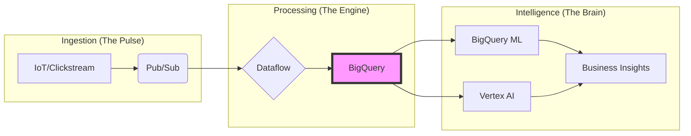

## Competitive Positioning and Industry Use Cases

### Section at a Glance
**What you'll learn:**
- How to differentiate Google Cloud Platform (GCP) from AWS, Azure, and Snowflake/Databricks.
- How to map specific GCP services to industry-standard data architectures.
- How to justify GCP adoption through business value drivers (TCO, Innovation, Agility).
- How to architect industry-specific solutions for Retail, Finance, and Healthcare.
- How to handle "Cloud Migration" conversations from a technical and commercial perspective.

**Key terms:** `Differentiation` · `Total Cost of Ownership (TCO)` · `Multi-cloud` · `Data Mesh` · `Serverless Analytics` · `Vertical Solutions`

**TL;DR:** To succeed as a Data Engineer, you must move beyond knowing *how* a service works to knowing *why* a business should choose it over a competitor, focusing on Google’s unique strengths in AI integration, serverless scaling, and global networking.

---

### Overview
In the modern enterprise, the choice of a cloud provider is rarely a purely technical decision; it is a strategic business move. As a Data Engineer, you will often find yourself in a position where you must defend a specific architecture against competitors like AWS or Snowflake. 

The fundamental problem this section addresses is "The Commodity Trap"—the misconception that all cloud providers are functionally identical. If you treat GCP as just "another place to run SQL," you fail to communicate the value of Google’s unique DNA: its heritage in handling planetary-scale web traffic, its deeply integrated AI/ML ecosystem (Vertex AI), and its commitment to a serverless-first philosophy.

This section bridges the gap between technical implementation and architectural strategy. We will look at how GCP’s ability to separate compute from storage and its unified data-to-AI pipeline provides a competitive edge in reducing "Time to Insight," which is the ultimate metric for any data-driven organization.

---

### Core Concepts

#### 1. The Google Differentiation Pillars
To position GCP effectively, you must understand the three pillars that separate it from the competition:
*   **Serverless Ubiquity:** Unlike AWS, where many services still require manual instance management (e.ability to scale is high, but "management" remains), GCP’s core data stack (BigQuery, Dataflow, Pub/Sub) is built on a "No-Ops" philosophy.
*   **Integrated AI/ML Lifecycle:** Google Cloud is the only provider where the data warehouse (BigQuery) and the ML platform (Vertex AI) share a unified feature store and seamless integration (BigQuery ML), reducing the "Data Gravity" problem.
*   **Global Networking & Single VPC:** GCP’s global VPC allows resources in different regions to communicate over Google's private fiber without traversing the public internet, significantly reducing latency and complexity.

#### 2. Industry-Specific Data Patterns
Enterprises do not buy "BigQuery"; they buy "Reduced Inventory Shrinkage" or "Faster Fraud Detection."
*   **Retail & E-commerce:** Focus on **Real-time Personalization**. Using Pub/Sub and Dataflow to process clickstream data to trigger immediate personalized offers.
*   **Financial Services:** Focus on **Regulatory Compliance and Fraud**. Leveraging BigQuery's security features and the ability to run complex ML models on massive historical datasets for anomaly detection.
*   **Healthcare/Life Sciences:** Focus on **Genomic Processing and HIPAA Compliance**. Using Google’s specialized Healthcare API and high-throughput computing capabilities.

> 📌 **Must Know:** When an interviewer or customer asks about "The Google Advantage," always pivot toward the **integration of Data and AI**. The ability to run ML models directly where the data lives (BigSQL/BigQuery ML) is a primary differentiator.

---

### Architecture / How It Works

The following diagram illustrates the "Unified Data-to-AI Pipeline," representing the core competitive advantage of GCP over traditional fragmented architectures.



1.  **Pub/Sub:** Acts as the global, asynchronous messaging bus that decouples data producers from consumers.
2.  **Dataflow:** A unified stream and batch processing service that executes Apache Beam pipelines.
3.  **BigQuery:** The central, serverless data warehouse serving as both the "Single Source of Truth" and the compute engine for ML.
4.  **Vertex AI/BQML:** The intelligence layer that transforms raw, processed data into predictive models without moving data out of the warehouse.

---

### Comparison: When to Use What

| Option | Best For | Trade-offs | Approx. Cost Signal |
| :--- | :--- | :--- | :--- |
| **BigQuery (On-Demand)** | Ad-hoc queries, unpredictable workloads, and small-to-medium scale. | No cost control; a single "bad" query can be expensive. | Pay-per-TB scanned. |
| **BigQuery (Editions/Slots)** | Predictable, high-scale production workloads and enterprise budgeting. | Requires capacity planning and management of "slots." | Fixed/Reservable capacity cost. |
| **Dataproc (Managed Spark/Hadoop)** | Migrating existing on-prem Hadoop/Spark workloads with minimal code change. | Requires managing clusters and scaling logic. | Compute (VM) + Storage (PD) cost. |
| **Dataflow (Apache Beam)** | Complex ETL/ELT, stream processing, and windowing logic. | High learning curve for Beam SDK; requires Java/Python expertise. | VCPU/Memory/Data processed. |

> 💡 **Tip:** If a customer's primary goal is "minimal operational overhead," always steer them toward **BigQuery and Dataflow**. If the goal is "lowest cost for existing Spark jobs," suggest **Dataproc**.

---

### Cost Cheat Sheet

| Scenario | Recommended Option | Key Cost Driver | Watch Out For |
| :--- | :--- | :--- | :--- |
| **Periodic Monthly Reporting** | BigQuery (On-Demand) | Bytes scanned per query. | Large `SELECT *` statements. |
| **High-Volume Real-time Streaming** | Pub/Sub + Dataflow | Throughput (MB/s) and Dataflow Shuffle. | High "Unused" windowing time. |
| **Large-scale Data Migration** | Transfer Service / Storage Transfer | Data volume and egress fees. | Hidden egress costs from other clouds. |
| **Continuous ML Model Training** | Vertex AI Pipelines | Compute instance type (GPU/TPU) & duration. | Idle notebook instances/orphaned VMs. |

> 💰 **Cost Note:** The single biggest cost mistake in BigQuery is failing to use **Partitioning and Clustering**. Running a full table scan on a multi-terabyte table daily can lead to catastrophic budget overruns.

---

### Service & Tool Integrations

1.  **The AI Integration Pattern:**
    *   `BigQuery` $\rightarrow$ `BigQuery ML` $\rightarrow$ `Vertex AI`.
    *   Use Case: Running a regression model using standard SQL to predict sales trends.
2.  **The Real-time Analytics Pattern:**
    *   `Pub/Sub` $\rightarrow$ `Dataflow` $\rightarrow$ `BigQuery` $\rightarrow$ `Looker`.
    *   Use Case: A retail dashboard showing live inventory levels across global stores.
3.  **The Data Lakehouse Pattern:**
    *   `Cloud Storage` $\rightarrow$ `BigLake` $\rightarrow$ `BigQuery`.
    *   Use Case: Querying unstructured/semi-structured files (Parquet/Avro) using BigQuery's engine without importing them.

---

### Security Considerations

In a competitive landscape, security is a feature. GCP’s "Security by Design" approach focuses on reducing the attack surface through managed services.

| Control | Default State | How to Enable / Strengthen |
| :--- | :--- | :--- |
| **Data Encryption** | Encrypted at rest/transit (Google-managed) | Use **Customer-Managed Encryption Keys (CMEK)** via Cloud KMS. |
| **Network Isolation** | Publicly accessible via API (unless restricted) | Implement **VPC Service Controls (VPC-SC)** to create a security perimeter. |
| **Identity Management** | IAM-based (Granular) | Enforce **Principle of Least Privilege** and use **IAM Conditions**. |
| **Data Privacy** | Accessible to anyone with BigQuery User role | Implement **Column-level security** and **Data Masking**. |

> ⚠️ **Warning:** Enabling BigQuery access via the public internet is standard, but for highly regulated industries (Finance/Healthcare), you **must** use VPC Service Controls to prevent data exfiltration.

---

### Performance & Cost

**The Scaling Trade-off:**
As a Data Engineer, you must balance **Latency** against **Cost**. 

*   **Example Scenario:** A logistics company needs to track 10,000 delivery trucks.
    *   **Approach A (High Cost/Low Latency):** Use Dataflow with high-availability workers and persistent disk. Result: Real-time updates every 5 seconds. Cost: High due to always-on compute.
    *   **Approach B (Low Cost/Medium Latency):** Use periodic BigQuery Load Jobs from Cloud Storage. Result: Updates every 30 minutes. Cost: Extremely low (mostly storage and load costs).

**Tuning Guidance:**
To optimize BigQuery performance, always ensure your queries use **Partitioned Tables** (e.g., by `event_date`) to limit the amount of data scanned.

---

### Hands-On: Key Operations

The following SQL script demonstrates how an engineer audits BigQuery usage to identify "expensive" users or queries—a critical task during cost optimization projects.

```sql
-- Identify the top 5 most expensive queries in the last 7 days
-- This helps in identifying 'bad actors' or unoptimized code in a production environment.
SELECT
    user_email,
    SUM(total_bytes_billed) / pow(1024, 4) AS tb_billed,
    SUM(total_bytes_billed / pow(1024, 4) * 6.25) AS estimated_cost_usd
FROM
    `region-us`.INFORMATION_SCHEMA.JOBS_BY_PROJECT
WHERE
    creation_time > TIMESTAMP_SUB(CURRENT_TIMESTAMP(), INTERVAL 7 DAY)
GROUP BY
    1
ORDER BY
    tb_billed DESC
LIMIT 5;
```
> 💡 **Tip:** Always run these audits periodically. The `INFORMATION_SCHEMA` is your best friend for proactive cost management and "FinOps" in the cloud.

---

### Customer Conversation Angles

**Q: "We already have a massive investment in Snowflake. Why should we move to BigQuery?"**
**A:** "While Snowflake is a great warehouse, BigQuery offers a more integrated, serverless experience where your AI/ML models live directly alongside your data, eliminating the cost and complexity of moving data between a warehouse and an ML platform."

**Q: "How do I know if I'm going to overspend on BigQuery monthly?"**
**A:** "We can implement BigQuery Quotas and Alerts at the project or user level, and use the `INFORMATION_SCHEMA` to build custom cost-tracking dashboards that alert you the moment a query exceeds a certain threshold."

**Q: "Can Google Cloud handle our HIPAA compliance requirements for healthcare data?"**
**A:** "Absolutely. Google Cloud provides a Business Associate Agreement (BAA) and has specific architectural patterns, such as VPC Service Controls and Cloud Healthcare API, designed specifically to meet HIPAA standards."

**Q: "Is it hard to migrate our existing Spark pipelines from on-prem to GCP?"**
**A:** "Not at all. You can use Dataproc, which is a managed Spark service that allows you to lift-and-shift your existing clusters with minimal code changes while gaining the benefits of cloud elasticity."

**Q: "What happens if our data volume spikes unexpectedly during a sale event?"**
**A:** "GCP's serverless architecture, specifically BigQuery and Dataflow, is designed for this. These services automatically scale compute resources up to meet the demand and scale back down when the spike subsides, so you only pay for what you use."

---

### Common FAQs and Misconceptions

**Q: Is BigQuery just a place to store data, like an S3 bucket?**
**A:** No. BigQuery is a fully managed, serverless data warehouse with a compute engine. 
> ⚠️ **Warning:** Never use BigQuery as a "dumping ground" for raw, unstructured files; use Cloud Storage for that and use BigLake to query it.

**Q: Do I need to manage servers for Dataflow?**
**A:** No, Dataflow is entirely serverless. You provide the code; Google manages the infrastructure and scaling.

**Q: Can I use Python to interact with BigQuery?**
**A:** Yes, through the Google Cloud Client Libraries, which are highly optimized for Python-based data science workflows.

**Q: Is BigQuery more expensive than traditional SQL Server?**
**A:** It's a different pricing model. You don't pay for "idle" servers, which often makes it much cheaper for intermittent or highly variable workloads.

**Q: Does 'Serverless' mean I have no control over the infrastructure?**
**A:** You lose control over the underlying VM management, but you gain control over much more important things: data partitioning, clustering, and resource allocation.

**Q: Can I run my BigQuery queries from my local machine?**
**A:** Yes, via the BigQuery API, the `bq` command-line tool, or even standard SQL interfaces like Python/Pandas.

---

### Exam & Certification Focus

*   **Service Selection (Domain: Design Data Processing Systems):** You must be able to decide between **Dataproc** (Spark/Hadoop migration) vs. **Dataflow** (New, stream/batch unified) vs. **BigQuery** (SQL/Warehouse). 📌 *High Frequency*
*   **Cost Optimization (Domain: Operationalizing Data Pipelines):** Expect questions on using **Partitions/Clustering** to reduce costs and choosing between **On-Demand vs. Slots**. 📌 *High Frequency*
*   **Security Architecture (Domain: Data Security and Compliance):** Focus on **VPC Service Controls** and **IAM roles** for protecting sensitive datasets.
*   **Migration Strategies:** Understanding how to use **Storage Transfer Service** and **BigQuery Data Transfer Service**.

---

### Quick Recap
- **Differentiate via Integration:** Focus on the seamless link between BigQuery and Vertex AI.
- **Serverless is Key:** Emphasize reduced operational overhead (No-Ops).
- **Industry Context Matters:** Tailor your architecture to the business outcome (e.g., Real-time for Retail).
- **Cost Management is Engineering:** Use partitioning, clustering, and monitoring to prevent budget overruns.
- **Security is a Pillar:** Leverage VPC Service Controls and IAM for enterprise-grade compliance.

---

### Further Reading
**[Google Cloud Architecture Framework]** — Best practices for building reliable, secure, and cost-optimized architectures.
**[BigQuery Documentation]** — Deep dive into query execution, storage formats, and pricing models.
**[Vertex AI Whitepaper]** — Understanding the unified platform for ML lifecycle management.
**[Dataflow Programming Guide]** — Technical details on Apache Beam and stream processing patterns.
**[Google Cloud Security Foundation Guide]** — Essential reading for implementing VPC-SC and identity management.