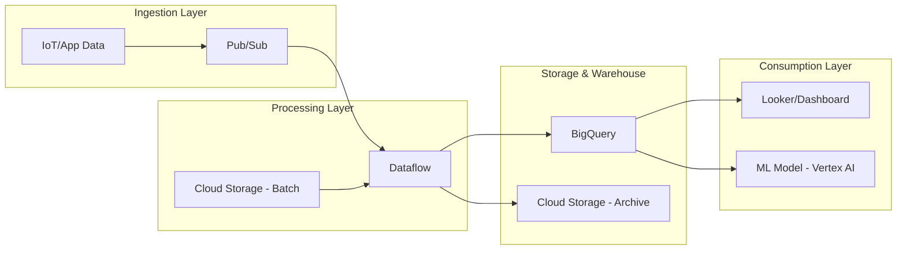

## Certification Exam Readiness and Capstone Project

### Section at a                          Glance
**What you'll learn:**
- How to synthesize individual GCP services into a production-ready data architecture via a Capstone Project.
- Strategies for interpreting complex, scenario-based questions in the Google Cloud Professional Data Engineer exam.
- Best practices for implementing end-to-end observability, security, and cost-optimization in data pipelines.
- Techniques for validating data integrity and pipeline reliability under load.
- Methods for mapping technical implementations to business-driven Service Level Objectives (SLOs).

**Key terms:** `Professional Data Engineer` · `Capstone Project` · `Exam Blueprints` · `Observability` · `Operational Excellence` · `Architectural Patterns`

**TL;TR:** This final section transitions you from a student of individual services to a practitioner of integrated systems, using a Capstone Project to simulate real-world engineering and a structured review to ensure exam success.

---

### Overview
The "Last Mile" of engineering is often the most difficult. You may know how to write a BigQuery SQL query or how to spin up a Dataproc cluster, but the ability to weave these disparate threads into a resilient, secure, and cost-efficient ecosystem is what defines a Professional Data Engineer. In a business context, companies do not pay for "knowledge of BigQuery"; they pay for the "mitigation of data downtime" and the "reduction of cloud spend."

The Capstone Project serves as your laboratory. It is designed to move you away from "tutorial-style" thinking—where everything works by default—and into "production-style" thinking, where you must handle schema evolution, late-arriving data, and permission bottlenecks. This project mimics a real-world stakeholder request: building a scalable streaming and batch pipeline that provides actionable insights without breaking the budget.

Concurrently, the Certification Readiness portion of this section focuses on the cognitive shift required for the Google Cloud Professional Data Engineer exam. The exam does not test your ability to memorize documentation; it tests your ability to perform "Architectural Decision Making" under pressure. We will focus on the patterns of decision-making that Google expects from its certified professionals.

---

### Core Concepts

#### 1. The Integrated Data Pipeline Pattern
A professional pipeline is never a single service; it is a chain of custody. In your Capstone, you will implement the **Lambda or Kappa architectures**, ensuring that both streaming (real-time) and batch (historical) data paths are accounted for.
📌 **Must Know:** The exam frequently tests your ability to choose between **Dataflow** (unified stream/batch) and **Dataproc** (Hadoop/Spark ecosystem migration). Choose Dataflow for serverless, auto-scaling needs; choose Dataproc if you have existing Spark/Hadoop code that requires fine-grained cluster control.

#### 2. Observability and Operational Excellence
A pipeline is only as good as its monitoring. You must implement **Cloud Monitoring** and **Cloud Logging** to track "Data Freshness" (latency) and "Data Completeness." 
⚠️ **Warning:** Never assume a "Running" status in Dataflow means your data is correct. A pipeline can be functionally operational (no crashes) while being logically broken (dropping records due to incorrect filtering logic).

#### 3. The "Cost-First" Engineering Mindset
Every architectural decision has a price tag. In the Capstone, you will evaluate the trade-offs between **BigQuery Slots (Reservations)** vs. **On-demand pricing**.
💰 **Cost Note:** For predictable, high-volume workloads, BigQuery Reservations can prevent the "sticker shock" of massive on-demand queries that scan entire datasets.

---

### Architecture / How It Works

The following diagram illustrates the end-to-end architecture you will implement and validate during your Capstone Project.



1. **Pub/Sub**: Acts as the global, asynchronous messaging backbone for real-time ingestion.
2. **Dataflow**: Performs the heavy lifting of windowing, aggregating, and transforming data using the Apache Beam SDK.
3. **Cloud Storage**: Serves as the "Landing Zone" for raw files and the long-term archive for cold data.
4. **BigQuery**: The analytical engine where structured data is stored in partitioned/clustered tables for high-performance SQL.
ical.
5. **Vertex AI**: Represents the downstream consumer where processed data is used for predictive modeling.

---

### Comparison: When to Use What

| Option | Best For | Trade-offs | Approx. Cost Signal |
| :--- | :--- | :--- | :--- |
| **Dataflow** | Unified Stream/Batch, complex transformations | Higher management overhead of windowing logic | Moderate (Pay for vCPUs/Memory) |
| **Dataproc** | Migrating existing Spark/Hadoop workloads | Requires managing cluster scaling and node types | Variable (Cluster uptime + Disk) |
| **BigQuery ML** | Simple ML models directly within SQL | Limited to supported algorithms; not for deep learning | Low (Pay for bytes processed) |
| **Cloud Data Fusion**| No-code/Low-code ETL orchestration | Less flexible than code-based pipelines | High (Instance-based pricing) |

**How to choose:** Start with **Dataflow** if you are building a new, cloud-native pipeline. Only pivot to **Datapron** if you have legacy Spark code that is too costly to rewrite.

---

### Cost Cheat Sheet

| Scenario | Recommended Option | Key Cost Driver | Watch Out For |
| :--- | :--- | :--- | :--- |
| **Real-time Dashboarding** | Pub/Sub + Dataflow | Throughput (MB/s) | High volume of small messages increases overhead |
| **Large Scale Historical Analysis** | BigQuery Partitioned Tables | Amount of Data Scanned | Forgetting to use partition filters in `WHERE` clauses |
| **Long-term Log Retention** | Cloud Storage (Archive Class) | Retrieval/Egress fees | Frequent access to "Archive" class data is extremely expensive |
| **Periodic Batch Processing** | Cloud Storage $\to$ BigQuery | Data Volume & Load Frequency | Keeping Compute Engines running longer than necessary |

> 💰 **Cost Note:** The single biggest mistake in BigQuery is running `SELECT *` on unpartitioned tables. This forces a full table scan, which can cost hundreds of dollars for a single mistake on multi-terabyte datasets.

---

### Service & Tool Integrations

1. **The Automated Pipeline Pattern (CI/CD):**
   - Use **Cloud Build** to trigger **Dataflow Template** updates whenever new Java/Python code is pushed to Git.
   - This ensures that deployment is repeatable and reduces human error in production.

2. **The Secure Ingestion Pattern:**
   - Integrate **Cloud KMS** with **Cloud Storage** to ensure that any data landing in your "Raw" bucket is encrypted with customer-managed keys (CMEK) immediately upon arrival.

3. **The Intelligent Alerting Pattern:**
   - Connect **BigQuery Information Schema** to **Cloud Monitoring** to create alerts that trigger when query costs exceed a predefined daily threshold.

---

### Security Considerations

| Control | Default State | How to Enable / Strengthen |
| :--- | :--- | :--- |
| **IAM (Least Privilege)** | Broad (if using primitive roles) | Use **Predefined Roles** (e.g., `roles/bigquery.dataViewer`) instead of `roles/editor`. |
| **Encryption at Rest** | Google-managed keys | Implement **Cloud KMS** for Customer-Managed Encryption Keys (CMEK). |
| **Network Isolation** | Public Internet accessibility | Use **VPC Service Controls** to create a security perimeter around sensitive data. |
| **Audit Logging** | Basic logging enabled | Enable **Data Access Audit Logs** in Cloud Logging to track who viewed which BigQuery table. |

---

### Performance & Cost

To optimize performance, you must balance **Compute** vs. **Storage**. 

**Example Scenario:**
You have a 10TB table in BigQuery. 
- **Scenario A (Unpartitioned):** A user runs `SELECT COUNT(*) FROM logs WHERE date = '2023-10-01'`. BigQuery scans all 10TB. At \$6.25/TB, this single query costs **\$62.50**.
- **Scenario B (Partitioned by Date):** The same query only scans the specific partition for that day (assume 100GB). The cost drops to **\$0.62**.

**Tuning Guidance:**
- **Scaling:** For Dataflow, use `autoscaling_algorithm=THROUGHPUT_BASED` to allow the service to react to spikes in Pub/Sub backlog.
- **Bottlenecks:** Monitor "System Lag" in Dataflow. If lag increases while CPU is low, you likely have a "Hot Key" issue in your grouping logic.

---

### Hands-On: Key Operations

**Step 1: Create a BigQuery dataset with a specific location to ensure data residency compliance.**
```bash
# Create a dataset in the US multi-region
bq mk --location=US my_capstone_dataset
```

**Step 2: Load raw data from Cloud Storage into BigQuery using a predefined schema.**
```bash
# Load CSV data into a table
bq load --source_format=CSV --autodetect my_caplant_dataset.raw_events ./data/events.csv
```
> 💡 **Tip:** Always use `--autodetect` in development, but in production, explicitly define your schema in a JSON file to prevent pipeline breakage when source data changes.

**Step 3: Validate the integrity of the loaded data using SQL.**
```sql
-- Check for nulls in critical primary key columns
SELECT 
  count(*) as null_count 
FROM `my_capstone_dataset.raw_events` 
WHERE event_id IS NULL;
```

---

### Customer Conversation Angles

**Q: We have a massive amount of legacy Hadoop code. Should we move to Dataflow?**
**A:** If you want a "hands-off" serverless experience, Dataflow is ideal, but it requires rewriting your logic in Apache Beam. If the goal is a fast migration with minimal code changes, Dataproc is your best path.

**Q: How can we ensure that our data scientists aren't running queries that break our monthly budget?**
**A:** We can implement BigQuery Quotas and Custom Cost Controls, and set up Cloud Monitoring alerts to notify us the moment a single query exceeds a specific cost threshold.

**Q: Is our data secure from external hackers while it's moving through the pipeline?**
**A:** Yes, all data in transit between GCP services is encrypted by default, and we can further harden this using VPC Service Controls to ensure data cannot leave our authorized network perimeter.

**Q: We need to comply with GDPR. How does GCP help with "the right to be forgotten"?**
**A:** By using BigQuery's DML `DELETE` capabilities and structured partitioning, we can efficiently locate and purge specific user records without needing to rewrite the entire dataset.

**Q: How do we know if our data pipeline has failed before our customers complain?**
**A:** We implement proactive observability using Cloud Monitoring, setting up alerts on "Data Freshness" metrics so we are notified the moment processing latency exceeds our agreed-upon SLA.

---

### Common FAQs and Misconceptions

**Q: Does the Professional Data Engineer exam test my ability to write Python/Java?**
**A:** No, it tests your ability to *architect* solutions. You don't need to write perfect code, but you must understand how code interacts with GCP services.

**Q: Is BigQuery "Serverless" in the sense that I don't have to manage any hardware?**
**A:** Yes, but you still manage "logical" resources like partitions, clusters, and slots to ensure performance and cost-efficiency.

**Q: Can I use Pub/Sub as a long-term storage solution?**
**A:** ⚠️ **Warning:** No. Pub/Sub is a messaging service designed for transient data. Once data is acknowledged, it is deleted. You must architect a path to BigQuery or Cloud Storage for persistence.

**Q: Does Dataflow scale infinitely?**
**A:** While it scales massively, you are still bound by the throughput of your downstream sinks (like BigQuery write quotas).

**Q: If I use Cloud Storage, is my data automatically "safe"?**
**A:** It is highly durable (99.999999999% durability), but "durability" is not "security." You must still configure IAM and encryption to protect against unauthorized access.

**Q: Is it cheaper to always use the smallest machine type in Dataflow?**
**A:** Not necessarily. Small machines might lead to much longer processing times (high "wall clock" time), which can actually increase your total cost due to the extended duration of the worker instances.

---

### Exam & Certification Focus

*   **Domain: Designing Data Processing Systems** 📌 *High Frequency:* Choosing between Batch and Stream based on latency requirements.
*   **Domain: Building and Operationalizing Data Pipelines** 📌 *High Frequency:* Implementing error handling, dead-letter queues (DLQs), and retries in Dataflow.
*   **Domain: Ensuring Data Quality and Security** 📌 *High Frequency:* Implementing IAM roles, VPC Service Controls, and Data Masking.
*   **Domain: Operational Excellence** 📌 *High Frequency:* Setting up Cloud Monitoring alerts and optimizing BigQuery cost/performance.

---

### Quick Recap
- The Capstone Project is the bridge between "knowing services" and "architecting systems."
- Always prioritize **Dataflow** for new, serverless, unified pipelines.
- **Cost optimization** in BigQuery relies heavily on partitioning and clustering.
- **Security** must be multi-layered: IAM for access, KMS for encryption, and VPC-SC for network isolation.
- **Exam success** requires thinking about the "why" (business impact) rather than just the "how" (technical steps).

---

### Further Reading
**[Google Cloud Architecture Framework]** — Best practices for reliability, security, and cost-optimization.
**[BigQuery Best Practices Documentation]** — Crucial for learning how to optimize query performance and costs.
**[Dataflow Streaming Guide]** — Deep dive into windowing, triggers, and watermarks.
**[Cloud IAM Documentation]** — Essential for mastering the principle of least privilege.
**[Google Cloud Professional Data Engineer Exam Guide]** — The official blueprint of topics to master.