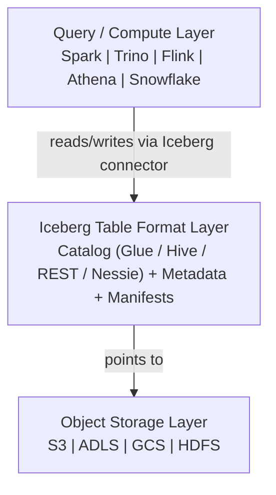
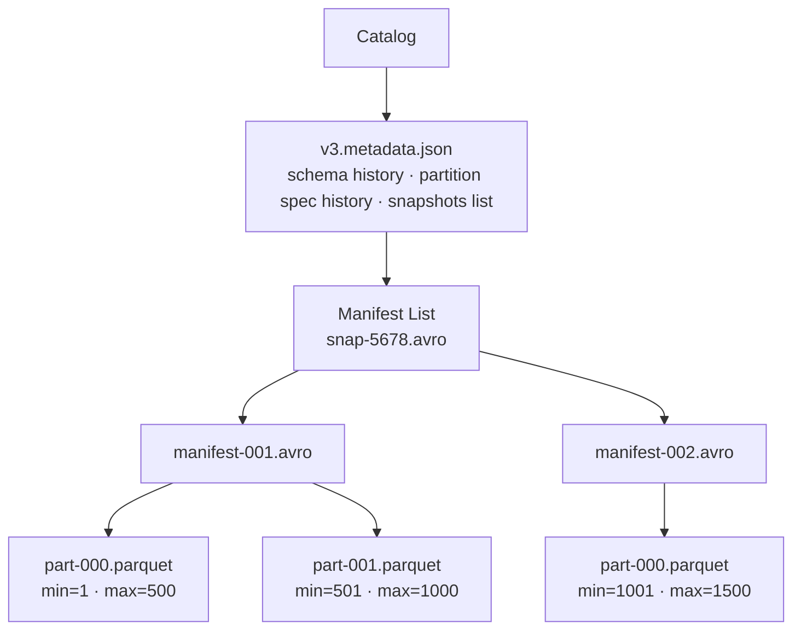

# Apache Iceberg

## 1. What Is It & Why It Exists

### The Problem It Solves

Before open table formats, data lakes were directories of files — Parquet or ORC sitting on S3 or HDFS with no transactional guarantees. This created a set of painful, well-known problems:

- **No ACID guarantees.** A failed write left partial data visible to readers. Two concurrent writers would silently corrupt each other's output.
- **Schema drift.** Adding a column meant coordinating every upstream writer and downstream reader manually. A single mismatch broke pipelines.
- **No time travel.** Once data was overwritten, it was gone. Auditing, debugging, or reproducing a historical report required maintaining separate snapshot copies.
- **Painful partition management.** Hive-style partitioning baked physical layout into queries — `WHERE dt='2024-01-01'` — coupling business logic to storage layout. Changing the partition scheme required rewriting the entire table.
- **Small file problem.** Streaming ingestion produced thousands of tiny files, causing metadata overhead and slow scans.

Apache Iceberg, created at Netflix and open-sourced in 2018, solves all of these at the **table format layer** — the specification that describes how a set of files constitutes a table — without locking you into a specific compute engine or storage system.

### How It Fits Into the Modern Data Stack



Iceberg sits between your compute engines and your raw files. The catalog tracks the current table state; the metadata layer provides snapshot history, schema, and partition spec; the data layer is standard Parquet/ORC/Avro files. Any engine that implements the Iceberg spec can read and write the same table concurrently.

### When to Choose Iceberg Over Delta Lake or Hudi

| Scenario | Recommendation |
|---|---|
| Multi-engine access (Spark + Trino + Flink + Athena on same table) | **Iceberg** — open spec, widest engine support |
| Pure Databricks shop | Delta Lake — tighter Unity Catalog integration |
| High-frequency upserts / CDC at scale | Hudi — purpose-built indexing for record-level upserts |
| Need partition evolution without rewriting data | **Iceberg** — hidden partitioning is uniquely powerful |
| AWS-native, want Glue catalog + Athena | **Iceberg** — first-class Glue support, Athena v3 native |
| Need Git-like branching on data | **Iceberg** + Nessie catalog |

Choose Iceberg when engine portability, partition evolution, and long-term open standards matter most.

---

## 2. Core Architecture

### Internal File Layout

An Iceberg table on object storage has this directory structure:

```
s3://my-bucket/warehouse/
└── my_db/
    └── my_table/
        ├── metadata/
        │   ├── v1.metadata.json          ← table metadata (schema, partition spec, snapshots list)
        │   ├── v2.metadata.json
        │   ├── snap-1234.avro            ← snapshot file (points to manifest list)
        │   ├── manifest-list-1234.avro   ← manifest list (lists all manifest files for snapshot)
        │   └── manifest-abc.avro         ← manifest file (lists data files + stats)
        └── data/
            ├── dt=2024-01/
            │   ├── 00000-part-abc.parquet
            │   └── 00001-part-def.parquet
            └── dt=2024-02/
                └── 00000-part-ghi.parquet
```

**Four layers, bottom-up:**

1. **Data files** — Parquet, ORC, or Avro. Immutable once written.
2. **Manifest files** — Avro files listing data files with column-level statistics (min/max, null counts, row counts). This is what enables predicate pushdown without reading data.
3. **Manifest list** — One per snapshot. An Avro file listing all manifest files for that snapshot, with partition-level summaries.
4. **Table metadata** — JSON file. Contains the schema history, partition spec history, snapshot list, and a pointer to the current snapshot. The catalog stores only a pointer to the current metadata file.

### Layer Relationship Diagram



A query planner reads: catalog → metadata → manifest list → manifests → prunes data files using column stats → reads only qualifying files.

### Snapshot / Versioning Model

Every write operation (insert, overwrite, delete, merge) creates a new **snapshot**. A snapshot is immutable and identified by a `snapshot-id` (long integer). The table metadata file maintains an ordered list of snapshots.

```json
{
  "snapshot-id": 9876543210,
  "parent-snapshot-id": 9876543209,
  "timestamp-ms": 1706140800000,
  "summary": {
    "operation": "append",
    "added-data-files": "3",
    "added-records": "150000"
  },
  "manifest-list": "s3://bucket/warehouse/db/table/metadata/snap-9876543210.avro"
}
```

Snapshots are **append-only to the metadata** — old snapshots remain until explicitly expired, enabling time travel and rollback.

The **current snapshot** pointer in the metadata JSON is what the catalog updates atomically. Readers always see a consistent snapshot because they resolve the snapshot pointer at query start time.

### How ACID Transactions Are Implemented

Iceberg uses **optimistic concurrency control**. There are no distributed locks held during writes.

**Write path:**
1. Writer reads the current metadata file version (e.g., `v5.metadata.json`).
2. Writer creates new data files and a new manifest.
3. Writer creates a new metadata file (`v6.metadata.json`) pointing to the new snapshot.
4. Writer atomically swaps the catalog pointer from `v5` to `v6` using a **compare-and-swap (CAS)** operation.
   - On S3: implemented via conditional PUT (`if-none-match` on the metadata file path).
   - On Hive Metastore: implemented via a table lock during the metadata swap.
   - On AWS Glue: uses optimistic locking on the table version.

**Conflict resolution:**
- If two writers race and both try to commit based on `v5`, only one CAS succeeds. The loser retries by re-reading `v5`, re-planning, and attempting `v7`.
- For append operations, Iceberg can automatically retry because appends to disjoint partitions commute.
- For overwrites, the retry logic checks whether the conflict is resolvable (e.g., did the other writer touch the same files?).

**Isolation level:** Iceberg provides **snapshot isolation** by default — readers always see the state of the table at the snapshot they opened, unaffected by concurrent writes.

---

## 3. Key Concepts Deep Dive

### Schema Evolution

Iceberg tracks the full schema history in the metadata. Each column has a stable integer `field-id` assigned at creation time. Schema operations never rename the underlying `field-id`, so old files remain readable under the new schema without rewriting.

**Supported operations:**
- Add a column (new `field-id` assigned; old files return `null`)
- Rename a column (only the name changes; `field-id` is stable)
- Drop a column (removed from schema; data remains in files but is not read)
- Widen a type (e.g., `int` → `long`)
- Reorder columns

```sql
-- Add a column
ALTER TABLE my_catalog.my_db.orders ADD COLUMN discount DOUBLE;

-- Rename a column
ALTER TABLE my_catalog.my_db.orders RENAME COLUMN customer_id TO user_id;

-- Drop a column
ALTER TABLE my_catalog.my_db.orders DROP COLUMN legacy_field;
```

```python
from pyspark.sql import SparkSession

spark = SparkSession.builder \
    .config("spark.sql.extensions", "org.apache.iceberg.spark.extensions.IcebergSparkSessionExtensions") \
    .config("spark.sql.catalog.my_catalog", "org.apache.iceberg.spark.SparkCatalog") \
    .config("spark.sql.catalog.my_catalog.type", "glue") \
    .getOrCreate()

# Programmatic schema evolution
from pyspark.sql.types import DoubleType
spark.sql("ALTER TABLE my_catalog.my_db.orders ADD COLUMN discount DOUBLE")

# Old Parquet files without the column are read fine — returns null for that column
df = spark.read.table("my_catalog.my_db.orders")
df.select("order_id", "discount").show()
```

### Time Travel & Rollback

Every snapshot is queryable by `snapshot-id` or timestamp.

```sql
-- Query a specific snapshot
SELECT * FROM my_catalog.my_db.orders
VERSION AS OF 9876543209;

-- Query at a point in time
SELECT * FROM my_catalog.my_db.orders
TIMESTAMP AS OF '2024-01-15 12:00:00';
```

```python
# PySpark time travel
df = spark.read \
    .option("snapshot-id", "9876543209") \
    .table("my_catalog.my_db.orders")

# Or by timestamp
df = spark.read \
    .option("as-of-timestamp", "1705320000000") \
    .table("my_catalog.my_db.orders")
```

**Rollback** — restores the current snapshot pointer to a previous snapshot without rewriting any data:

```sql
-- Rollback to a snapshot
CALL my_catalog.system.rollback_to_snapshot('my_db.orders', 9876543209);

-- Rollback to a timestamp
CALL my_catalog.system.rollback_to_timestamp('my_db.orders', TIMESTAMP '2024-01-15 12:00:00');
```

### MERGE / UPSERT Semantics

Iceberg supports SQL MERGE with full MATCHED / NOT MATCHED clauses, backed by position-delete files or equality-delete files (format v2).

```sql
MERGE INTO my_catalog.my_db.orders AS target
USING updates AS source
ON target.order_id = source.order_id
WHEN MATCHED AND source.status = 'CANCELLED' THEN DELETE
WHEN MATCHED THEN UPDATE SET
    target.status = source.status,
    target.updated_at = source.updated_at
WHEN NOT MATCHED THEN INSERT (order_id, customer_id, status, created_at, updated_at)
    VALUES (source.order_id, source.customer_id, source.status, source.created_at, source.updated_at);
```

```python
# PySpark MERGE via DataFrame API
from pyspark.sql.functions import col

target = spark.table("my_catalog.my_db.orders")
updates = spark.read.parquet("s3://bucket/updates/")

# Using Iceberg's MergeIntoWriter (Spark 3.4+)
target.alias("t").merge(
    updates.alias("s"),
    "t.order_id = s.order_id"
).whenMatchedUpdateAll() \
 .whenNotMatchedInsertAll() \
 .execute()
```

**Under the hood:** For format v2 tables, MERGE writes **equality-delete files** (containing the primary key of deleted/updated rows) rather than rewriting data files. A subsequent `REWRITE_DATA_FILES` compaction merges deletes into base files, restoring full read performance.

### Compaction / Small File Problem

Streaming writes and frequent incremental loads produce many small files. Iceberg provides the `rewrite_data_files` procedure:

```sql
-- Compact files to 512 MB target size
CALL my_catalog.system.rewrite_data_files(
  table => 'my_db.orders',
  strategy => 'binpack',
  options => map(
    'target-file-size-bytes', '536870912',
    'min-file-size-bytes',    '268435456',
    'max-file-size-bytes',    '805306368'
  )
);

-- Sort-based compaction (rewrites + sorts by key, improves range scans)
CALL my_catalog.system.rewrite_data_files(
  table => 'my_db.orders',
  strategy => 'sort',
  sort_order => 'order_id ASC NULLS LAST',
  options => map('target-file-size-bytes', '536870912')
);
```

```python
# Schedule compaction in PySpark
spark.sql("""
  CALL my_catalog.system.rewrite_data_files(
    table => 'my_db.orders',
    strategy => 'binpack',
    options => map('target-file-size-bytes', '536870912')
  )
""")

# Also expire old snapshots to reclaim storage
spark.sql("""
  CALL my_catalog.system.expire_snapshots(
    table => 'my_db.orders',
    older_than => TIMESTAMP '2024-01-01 00:00:00',
    retain_last => 5
  )
""")
```

### Hidden Partitioning and Partition Evolution

This is one of Iceberg's most distinctive features. In Hive, partitioning is **user-visible** — queries must include `WHERE dt='2024-01-01'` or they scan everything. In Iceberg, partitioning is **hidden** — you write `WHERE event_time > '2024-01-01'` and Iceberg automatically maps it to the correct partitions.

**Partition transforms** let you derive partitions from column values without storing a separate partition column:

```sql
-- Partition by month derived from a timestamp column
CREATE TABLE my_catalog.my_db.events (
    event_id   BIGINT,
    event_time TIMESTAMP,
    user_id    BIGINT,
    event_type STRING
)
USING iceberg
PARTITIONED BY (months(event_time));
```

Available transforms: `years(ts)`, `months(ts)`, `days(ts)`, `hours(ts)`, `bucket(N, col)`, `truncate(W, col)`, `identity(col)`.

**Partition evolution** — change the partition scheme without rewriting existing data:

```sql
-- Start with daily partitions
CREATE TABLE my_catalog.my_db.events (...)
USING iceberg
PARTITIONED BY (days(event_time));

-- Table grows; switch to hourly without rewriting
ALTER TABLE my_catalog.my_db.events
REPLACE PARTITION FIELD days(event_time) WITH hours(event_time);
```

Old data retains its daily partition layout; new data uses hourly. Query planning handles both transparently. No backfill needed.

---

## 4. Implementation Guide

### Creating a Table

```python
from pyspark.sql import SparkSession

spark = SparkSession.builder \
    .appName("iceberg-demo") \
    .config("spark.sql.extensions",
            "org.apache.iceberg.spark.extensions.IcebergSparkSessionExtensions") \
    .config("spark.sql.catalog.my_catalog",
            "org.apache.iceberg.spark.SparkCatalog") \
    .config("spark.sql.catalog.my_catalog.type", "glue") \
    .config("spark.sql.catalog.my_catalog.warehouse", "s3://my-bucket/warehouse/") \
    .config("spark.sql.defaultCatalog", "my_catalog") \
    .getOrCreate()
```

```sql
CREATE TABLE my_catalog.my_db.orders (
    order_id    BIGINT      NOT NULL,
    customer_id BIGINT,
    status      STRING,
    amount      DECIMAL(12,2),
    created_at  TIMESTAMP,
    updated_at  TIMESTAMP
)
USING iceberg
PARTITIONED BY (months(created_at))
TBLPROPERTIES (
    'format-version'                    = '2',
    'write.format.default'              = 'parquet',
    'write.parquet.compression-codec'   = 'zstd',
    'write.target-file-size-bytes'      = '536870912',
    'write.delete.mode'                 = 'merge-on-read',
    'write.update.mode'                 = 'merge-on-read',
    'write.merge.mode'                  = 'merge-on-read',
    'history.expire.min-snapshots-to-keep' = '5',
    'history.expire.max-snapshot-age-ms'   = '604800000'
);
```

### Writing Data — Batch

```python
from pyspark.sql.functions import current_timestamp
from pyspark.sql.types import StructType, StructField, LongType, StringType, DecimalType, TimestampType
import decimal

schema = StructType([
    StructField("order_id",    LongType(),              False),
    StructField("customer_id", LongType(),              True),
    StructField("status",      StringType(),            True),
    StructField("amount",      DecimalType(12, 2),      True),
    StructField("created_at",  TimestampType(),         True),
    StructField("updated_at",  TimestampType(),         True),
])

from datetime import datetime

data = [
    (1001, 42, "PLACED",    decimal.Decimal("99.99"),  datetime(2024, 1, 15), datetime(2024, 1, 15)),
    (1002, 43, "SHIPPED",   decimal.Decimal("149.50"), datetime(2024, 1, 16), datetime(2024, 1, 17)),
    (1003, 42, "DELIVERED", decimal.Decimal("29.00"),  datetime(2024, 2, 1),  datetime(2024, 2, 3)),
]

df = spark.createDataFrame(data, schema)

# Append write
df.writeTo("my_catalog.my_db.orders").append()

# Overwrite a partition (idempotent batch load pattern)
df.writeTo("my_catalog.my_db.orders") \
  .overwritePartitions()
```

### Writing Data — Streaming

```python
# Structured Streaming write to Iceberg
stream_df = spark.readStream \
    .format("kafka") \
    .option("kafka.bootstrap.servers", "broker:9092") \
    .option("subscribe", "orders-topic") \
    .load()

from pyspark.sql.functions import from_json, col, current_timestamp
from pyspark.sql.types import StructType, StructField, LongType, StringType, DecimalType

order_schema = StructType([
    StructField("order_id",    LongType()),
    StructField("customer_id", LongType()),
    StructField("status",      StringType()),
    StructField("amount",      DecimalType(12, 2)),
])

parsed = stream_df \
    .select(from_json(col("value").cast("string"), order_schema).alias("data")) \
    .select("data.*") \
    .withColumn("created_at", current_timestamp()) \
    .withColumn("updated_at", current_timestamp())

query = parsed.writeStream \
    .format("iceberg") \
    .outputMode("append") \
    .trigger(processingTime="60 seconds") \
    .option("path", "my_catalog.my_db.orders") \
    .option("checkpointLocation", "s3://my-bucket/checkpoints/orders/") \
    .start()
```

### Reading with Time Travel

```python
# Read current snapshot
df_current = spark.read.table("my_catalog.my_db.orders")

# Read a specific snapshot
df_v1 = spark.read \
    .option("snapshot-id", "9876543209") \
    .table("my_catalog.my_db.orders")

# Read at a point in time (epoch ms)
df_yesterday = spark.read \
    .option("as-of-timestamp", str(int(datetime(2024, 1, 14).timestamp() * 1000))) \
    .table("my_catalog.my_db.orders")

# List all snapshots
spark.read \
    .format("iceberg") \
    .load("my_catalog.my_db.orders.snapshots") \
    .show(truncate=False)
```

```sql
-- SQL time travel
SELECT COUNT(*) FROM my_catalog.my_db.orders
TIMESTAMP AS OF '2024-01-14 00:00:00';

-- Inspect snapshot history
SELECT * FROM my_catalog.my_db.orders.snapshots
ORDER BY committed_at DESC;

-- Inspect data files in current snapshot
SELECT file_path, record_count, file_size_in_bytes
FROM my_catalog.my_db.orders.files;
```

### Running MERGE/UPSERT

```python
# Load CDC updates from S3
updates = spark.read.parquet("s3://my-bucket/cdc/orders/")
updates.createOrReplaceTempView("order_updates")

spark.sql("""
  MERGE INTO my_catalog.my_db.orders AS t
  USING order_updates AS s
  ON t.order_id = s.order_id
  WHEN MATCHED AND s.status = 'DELETED' THEN DELETE
  WHEN MATCHED THEN UPDATE SET
    t.status     = s.status,
    t.updated_at = s.updated_at
  WHEN NOT MATCHED THEN INSERT *
""")
```

### Schema Evolution in Practice

```python
# Step 1: Add a nullable column (safe, backward compatible)
spark.sql("ALTER TABLE my_catalog.my_db.orders ADD COLUMN loyalty_points INT")

# Step 2: Write new data that includes the column
new_data = [(1004, 44, "PLACED", decimal.Decimal("59.99"),
             datetime(2024, 3, 1), datetime(2024, 3, 1), 150)]
new_schema = df.schema.add("loyalty_points", "integer")
new_df = spark.createDataFrame(new_data, new_schema)
new_df.writeTo("my_catalog.my_db.orders").append()

# Step 3: Old rows read fine — loyalty_points returns null
spark.sql("SELECT order_id, loyalty_points FROM my_catalog.my_db.orders").show()
# +--------+--------------+
# |order_id|loyalty_points|
# +--------+--------------+
# |    1001|          null|   ← old file, column absent
# |    1004|           150|   ← new file
```

### Full Config Block

```python
spark = SparkSession.builder \
    .appName("iceberg-production") \
    # ── Iceberg extensions (MERGE, CALL procedures, etc.) ──────────────────
    .config("spark.sql.extensions",
            "org.apache.iceberg.spark.extensions.IcebergSparkSessionExtensions") \
    \
    # ── Catalog configuration (AWS Glue example) ───────────────────────────
    .config("spark.sql.catalog.my_catalog",
            "org.apache.iceberg.spark.SparkCatalog") \
    .config("spark.sql.catalog.my_catalog.type",        "glue") \
    .config("spark.sql.catalog.my_catalog.warehouse",   "s3://my-bucket/warehouse/") \
    .config("spark.sql.catalog.my_catalog.io-impl",
            "org.apache.iceberg.aws.s3.S3FileIO") \
    # S3 multi-part upload threshold — avoid tiny parts
    .config("spark.sql.catalog.my_catalog.s3.multipart-threshold-mb", "64") \
    \
    # ── Default write settings ──────────────────────────────────────────────
    # Target file size: 512 MB is the sweet spot for most workloads
    .config("spark.sql.catalog.my_catalog.write.target-file-size-bytes", "536870912") \
    # Use ZSTD for best compression/speed ratio on Parquet
    .config("spark.sql.catalog.my_catalog.write.parquet.compression-codec", "zstd") \
    \
    # ── Vectorized reads (Parquet only, significant speedup) ───────────────
    .config("spark.sql.parquet.enableVectorizedReader", "true") \
    \
    # ── Dynamic partition overwrite (safer than static) ────────────────────
    .config("spark.sql.sources.partitionOverwriteMode", "dynamic") \
    \
    .getOrCreate()
```

---

## 5. Integration with the Ecosystem

### Apache Spark

#### Catalog Options: When to Use Each

| Catalog | When to Use |
|---|---|
| **REST Catalog** | New deployments; cloud-agnostic; works with Polaris, Unity, Tabular. Preferred for multi-engine setups. |
| **Hive Metastore** | Existing on-prem/EMR Hive ecosystem; want to share tables with Hive queries. |
| **AWS Glue** | AWS-native; serverless; integrates with Athena, Glue ETL, Lake Formation permissions. Best default for AWS. |
| **Nessie** | Need Git-like branching/tagging on data — feature branches, isolated dev environments. |

```python
# REST Catalog (e.g., pointing at Polaris or Tabular)
spark = SparkSession.builder \
    .config("spark.sql.catalog.rest_cat",       "org.apache.iceberg.spark.SparkCatalog") \
    .config("spark.sql.catalog.rest_cat.type",  "rest") \
    .config("spark.sql.catalog.rest_cat.uri",   "https://catalog.example.com/") \
    .config("spark.sql.catalog.rest_cat.token", "Bearer <token>") \
    .getOrCreate()

# Nessie Catalog (branching / isolated writes)
spark = SparkSession.builder \
    .config("spark.sql.catalog.nessie",
            "org.apache.iceberg.spark.SparkCatalog") \
    .config("spark.sql.catalog.nessie.catalog-impl",
            "org.apache.iceberg.nessie.NessieCatalog") \
    .config("spark.sql.catalog.nessie.uri",    "http://nessie:19120/api/v1") \
    .config("spark.sql.catalog.nessie.ref",    "main") \
    .config("spark.sql.catalog.nessie.warehouse", "s3://my-bucket/warehouse/") \
    .getOrCreate()

# Hive Metastore Catalog
spark = SparkSession.builder \
    .config("spark.sql.catalog.hive_cat",       "org.apache.iceberg.spark.SparkCatalog") \
    .config("spark.sql.catalog.hive_cat.type",  "hive") \
    .config("spark.sql.catalog.hive_cat.uri",   "thrift://hive-metastore:9083") \
    .config("spark.sql.catalog.hive_cat.warehouse", "s3://my-bucket/warehouse/") \
    .getOrCreate()
```

### AWS Glue / S3

```python
# EMR / Glue job config
spark = SparkSession.builder \
    .config("spark.sql.extensions",
            "org.apache.iceberg.spark.extensions.IcebergSparkSessionExtensions") \
    .config("spark.sql.catalog.glue_cat",
            "org.apache.iceberg.spark.SparkCatalog") \
    .config("spark.sql.catalog.glue_cat.catalog-impl",
            "org.apache.iceberg.aws.glue.GlueCatalog") \
    .config("spark.sql.catalog.glue_cat.warehouse", "s3://my-bucket/warehouse/") \
    .config("spark.sql.catalog.glue_cat.io-impl",
            "org.apache.iceberg.aws.s3.S3FileIO") \
    .getOrCreate()
```

```yaml
# AWS Glue job parameters (--conf flags)
--conf spark.sql.extensions=org.apache.iceberg.spark.extensions.IcebergSparkSessionExtensions
--conf spark.sql.catalog.glue_cat=org.apache.iceberg.spark.SparkCatalog
--conf spark.sql.catalog.glue_cat.catalog-impl=org.apache.iceberg.aws.glue.GlueCatalog
--conf spark.sql.catalog.glue_cat.warehouse=s3://my-bucket/warehouse/
--conf spark.sql.catalog.glue_cat.io-impl=org.apache.iceberg.aws.s3.S3FileIO
```

**Athena (v3 native Iceberg support):**

```sql
-- Athena creates Iceberg tables natively
CREATE TABLE my_db.orders (
    order_id    BIGINT,
    customer_id BIGINT,
    status      VARCHAR(50),
    amount      DOUBLE,
    created_at  TIMESTAMP
)
LOCATION 's3://my-bucket/warehouse/my_db/orders/'
TBLPROPERTIES ('table_type'='ICEBERG', 'format'='parquet');

-- Time travel in Athena
SELECT * FROM my_db.orders FOR SYSTEM_TIME AS OF TIMESTAMP '2024-01-15 00:00:00 UTC';
SELECT * FROM my_db.orders FOR SYSTEM_VERSION AS OF 9876543209;
```

### Trino

```yaml
# trino/etc/catalog/iceberg.properties
connector.name=iceberg
iceberg.catalog.type=glue
hive.s3.aws-access-key=<key>
hive.s3.aws-secret-key=<secret>
hive.s3.region=us-east-1
iceberg.file-format=PARQUET
iceberg.compression-codec=ZSTD
```

```sql
-- Trino query
SELECT order_id, status, amount
FROM iceberg.my_db.orders
WHERE created_at >= DATE '2024-01-01';

-- Trino time travel
SELECT * FROM iceberg.my_db.orders
FOR VERSION AS OF 9876543209;
```

### Kafka / Flink (Streaming Writes)

```java
// Flink SQL — streaming insert into Iceberg
// Add to flink-conf.yaml: classloader.resolve-order: parent-first

TableEnvironment tEnv = TableEnvironment.create(EnvironmentSettings.inStreamingMode());

tEnv.executeSql("""
    CREATE CATALOG iceberg_catalog WITH (
        'type'            = 'iceberg',
        'catalog-type'    = 'glue',
        'warehouse'       = 's3://my-bucket/warehouse/',
        'io-impl'         = 'org.apache.iceberg.aws.s3.S3FileIO'
    )
""");

tEnv.executeSql("USE CATALOG iceberg_catalog");

tEnv.executeSql("""
    CREATE TABLE IF NOT EXISTS my_db.orders_stream (
        order_id    BIGINT,
        customer_id BIGINT,
        status      STRING,
        amount      DECIMAL(12,2),
        event_time  TIMESTAMP(3),
        WATERMARK FOR event_time AS event_time - INTERVAL '5' SECOND
    ) WITH (
        'format-version'             = '2',
        'write.upsert.enabled'       = 'true',
        'write.metadata.delete-after-commit.enabled' = 'true',
        'write.metadata.previous-versions-max'       = '100'
    )
""");

// Insert from Kafka source table into Iceberg
tEnv.executeSql("""
    INSERT INTO my_db.orders_stream
    SELECT order_id, customer_id, status, amount, event_time
    FROM kafka_orders_source
""");
```

### dbt

```yaml
# profiles.yml — Spark connection
my_profile:
  target: prod
  outputs:
    prod:
      type: spark
      method: thrift
      host: spark-thrift-server
      port: 10001
      schema: my_db
      threads: 8
```

```yaml
# dbt_project.yml
models:
  my_project:
    +file_format: iceberg
    +incremental_strategy: merge
    +unique_key: order_id
    +partition_by:
      field: created_at
      data_type: timestamp
      granularity: month
```

```sql
-- models/orders_clean.sql
{{ config(
    materialized='incremental',
    file_format='iceberg',
    incremental_strategy='merge',
    unique_key='order_id',
    merge_update_columns=['status', 'updated_at']
) }}

SELECT
    order_id,
    customer_id,
    status,
    amount,
    created_at,
    updated_at
FROM {{ source('raw', 'orders') }}

WHERE updated_at > (SELECT MAX(updated_at) FROM {{ this }})

```

---

## 6. Performance Tuning

### File Sizing Recommendations

The optimal file size for Iceberg is **256 MB – 1 GB** (target 512 MB for most workloads). This balances:
- **Too small** → excessive metadata overhead, slow planning, S3 LIST latency dominates.
- **Too large** → poor parallelism, wasted work on partial scans.

```sql
-- Set at table creation
TBLPROPERTIES (
    'write.target-file-size-bytes'    = '536870912',   -- 512 MB target
    'write.delete.target-file-size-bytes' = '67108864' -- 64 MB for delete files
);
```

For streaming workloads that produce small files, schedule compaction every 1–4 hours depending on ingest volume (see Compaction section below).

### Partitioning Strategies

**Partition on columns used in WHERE or JOIN frequently.** Never partition on high-cardinality columns (user IDs, UUIDs) — this creates millions of partitions and destroys planning performance.

| Column type | Recommended transform |
|---|---|
| Event timestamp | `months(ts)` or `days(ts)` — match query range granularity |
| Region / tenant | `identity(region)` — low cardinality |
| Numeric ID range | `bucket(100, entity_id)` — distributes load evenly |
| String prefix | `truncate(3, zip_code)` — groups nearby values |

**Avoid over-partitioning.** A good rule: each partition should contain at least 1–2 Parquet files of the target size (512 MB). If you have 1 MB partitions, you're over-partitioned.

```sql
-- Good: monthly partition on a table with years of data
PARTITIONED BY (months(created_at))

-- Bad: daily partition on a table that gets 10 MB/day — too granular
-- Result: 365 partitions/year × 10 MB = 3.6 GB, but 365 tiny files
```

### Compaction Strategy and Scheduling

Run compaction regularly; do not let it fall behind.

```sql
-- Bin-pack compaction (pure size optimization, fastest)
CALL my_catalog.system.rewrite_data_files(
  table   => 'my_db.orders',
  strategy => 'binpack',
  options  => map(
    'target-file-size-bytes',     '536870912',
    'min-file-size-bytes',        '134217728',   -- compact files < 128 MB
    'max-file-size-bytes',        '805306368',   -- split files > 768 MB
    'max-concurrent-file-group-rewrites', '20',  -- parallelism
    'partial-progress.enabled',   'true'         -- commit partial results on failure
  )
);

-- Sort compaction (better for range scans; more expensive)
CALL my_catalog.system.rewrite_data_files(
  table      => 'my_db.orders',
  strategy   => 'sort',
  sort_order => 'created_at ASC NULLS LAST, order_id ASC NULLS LAST',
  options    => map('target-file-size-bytes', '536870912')
);

-- Expire snapshots (run after compaction, not before)
CALL my_catalog.system.expire_snapshots(
  table        => 'my_db.orders',
  older_than   => now() - INTERVAL 7 DAYS,
  retain_last  => 10
);

-- Remove orphan files (files not in any snapshot)
CALL my_catalog.system.remove_orphan_files(
  table      => 'my_db.orders',
  older_than => now() - INTERVAL 3 DAYS
);
```

**Scheduling guidance:**
- High-ingest streaming tables: compact every 1–4 hours.
- Daily batch tables: compact once after the daily load.
- Expire snapshots weekly; retain at least 5–10 for rollback safety.

### Column Stats, Bloom Filters, Z-ordering

Iceberg manifests store per-column min/max and null counts for **every data file**. Queries with predicates on indexed columns skip files entirely without reading them — this is the primary performance lever for point lookups and range scans.

```sql
-- Enable Bloom filters for high-cardinality equality lookups
ALTER TABLE my_catalog.my_db.orders
SET TBLPROPERTIES (
    'write.parquet.bloom-filter-enabled.column.order_id' = 'true',
    'write.parquet.bloom-filter-fpp.column.order_id'     = '0.01'  -- 1% false positive rate
);
```

**Z-ordering** co-locates rows with similar values across multiple columns in the same file, improving multi-column predicate performance:

```sql
-- Z-order compaction (Spark + Iceberg 1.2+)
CALL my_catalog.system.rewrite_data_files(
  table      => 'my_db.orders',
  strategy   => 'sort',
  sort_order => 'zorder(customer_id, created_at)'
);
```

### Common Query Patterns and Tuning

**Point lookup by ID:**
```sql
-- Ensure Bloom filter is on order_id; file-level min/max also prunes well
SELECT * FROM my_catalog.my_db.orders WHERE order_id = 1001;
```

**Time-range scan (most common):**
```sql
-- Partition on months(created_at) + sort by created_at within files
-- eliminates irrelevant partitions + enables file-skip within partition
SELECT * FROM my_catalog.my_db.orders
WHERE created_at BETWEEN '2024-01-01' AND '2024-01-31';
```

**Aggregations:**
```sql
-- Iceberg metadata tables provide pre-aggregated stats — use for monitoring
SELECT partition, record_count, file_count
FROM my_catalog.my_db.orders.partitions
ORDER BY partition;
```

**Tuning Spark scan parallelism:**
```python
spark.conf.set("spark.sql.iceberg.planning.preserve-data-grouping", "true")
spark.conf.set("spark.sql.files.maxPartitionBytes", str(256 * 1024 * 1024))  # 256 MB per task
spark.conf.set("spark.sql.adaptive.enabled", "true")
spark.conf.set("spark.sql.adaptive.coalescePartitions.enabled", "true")
```

---

## 7. Common Pitfalls & How to Avoid Them

**Pitfall:** Using format v1 instead of v2 for tables that need MERGE/DELETE.

**Symptom:** `DELETE` and `UPDATE` rewrite entire Parquet files instead of writing small delete files, causing massive write amplification and slow operations.

**Fix:** Always create tables with `'format-version' = '2'`. For existing v1 tables: `ALTER TABLE my_db.orders SET TBLPROPERTIES ('format-version' = '2')`.

---

**Pitfall:** Never running `expire_snapshots`, causing unbounded metadata and storage growth.

**Symptom:** The `metadata/` directory grows to tens of thousands of files; Glue/Hive catalog calls slow down; S3 storage costs balloon.

**Fix:** Schedule weekly: `CALL catalog.system.expire_snapshots(table => 'db.table', older_than => now() - INTERVAL 7 DAYS, retain_last => 10)`. Always retain at least 5 snapshots for rollback safety.

---

**Pitfall:** Over-partitioning with high-cardinality columns or too-fine time granularity.

**Symptom:** Table planning time is slow (seconds); `SHOW PARTITIONS` returns millions of rows; S3 LIST calls dominate query latency.

**Fix:** Use coarser transforms: replace `days(ts)` with `months(ts)` for low-volume tables. Use `bucket(N, id)` for ID columns — never `identity(user_id)` on a column with millions of distinct values.

---

**Pitfall:** Running MERGE without compaction on MOR (merge-on-read) tables.

**Symptom:** Read performance degrades over time as delete files accumulate. Scans that once took 10 seconds now take 2 minutes.

**Fix:** After each MERGE batch, schedule `rewrite_data_files` to merge delete files into base files. For real-time pipelines, compact every 1–4 hours.

---

**Pitfall:** Mixing catalog types across compute engines pointing at the same table.

**Symptom:** One engine (Spark via Glue) sees the table; another (Trino via Hive) does not, or sees stale schema.

**Fix:** Standardize on a single catalog backend for all engines. AWS Glue is the best AWS-native choice. For multi-cloud, use a REST catalog (Polaris, Tabular, Nessie).

---

**Pitfall:** Not setting `write.merge.mode = 'merge-on-read'` for CDC/UPSERT-heavy tables.

**Symptom:** Every MERGE rewrites large data files (copy-on-write), causing hours of write latency for incremental loads.

**Fix:**
```sql
ALTER TABLE my_db.orders SET TBLPROPERTIES (
    'write.delete.mode' = 'merge-on-read',
    'write.update.mode' = 'merge-on-read',
    'write.merge.mode'  = 'merge-on-read'
);
```
Schedule regular compaction to merge the accumulated delete files.

---

**Pitfall:** Schema evolution with type widening in the wrong direction.

**Symptom:** `ALTER TABLE ... CHANGE COLUMN amount TYPE DOUBLE` fails or silently corrupts values when narrowing (e.g., `double` → `float`).

**Fix:** Iceberg only allows safe widening promotions: `int` → `long`, `float` → `double`, `decimal(P, S)` → `decimal(P2, S)` where `P2 > P`. Never narrow a type. If you need to narrow, add a new column and backfill.

---

**Pitfall:** Using Iceberg's `overwrite` mode without understanding its semantics.

**Symptom:** `df.writeTo("table").overwrite(lit(True))` deletes **all** existing data, not just the affected partitions.

**Fix:** Use `overwritePartitions()` for dynamic partition overwrite (replaces only partitions present in the new data) or use a predicate overwrite:
```python
from pyspark.sql.functions import col, lit
df.writeTo("my_catalog.my_db.orders") \
  .overwrite(col("created_at").between("2024-01-01", "2024-01-31"))
```

---

**Pitfall:** Orphan files accumulating after failed writes or Spark job retries.

**Symptom:** S3 storage costs are higher than expected; `data/` directory has files not referenced by any manifest.

**Fix:** Schedule monthly orphan file removal:
```sql
CALL my_catalog.system.remove_orphan_files(
  table      => 'my_db.orders',
  older_than => now() - INTERVAL 3 DAYS
);
```
The 3-day grace period ensures in-progress writes are not deleted.

---

## 8. Comparison with the Other Two OTF Options

| Feature | Apache Iceberg | Delta Lake | Apache Hudi |
|---|---|---|---|
| **ACID support** | Full ACID (snapshot isolation) | Full ACID (serializable on Databricks) | Full ACID |
| **Streaming ingestion** | Flink, Spark Structured Streaming | Spark Structured Streaming, Auto Loader | Flink, Spark, Kafka Connect (native) |
| **Schema evolution** | All operations; stable field IDs | Add/rename/drop columns | Add columns; limited rename |
| **Partitioning model** | Hidden partitioning + partition evolution (no query rewrite needed) | Explicit Hive-style; Liquid Clustering (file-level, no partition columns) | Explicit Hive-style partitioning |
| **Catalog dependency** | REST, Hive, Glue, Nessie, JDBC — engine-agnostic | Delta Log (self-describing); Unity Catalog for governance | Hive Metastore or custom timeline-based |
| **Cloud/managed support** | AWS (Athena, Glue, EMR), Snowflake, BigQuery Omni, Dremio, Starburst | Azure Databricks (native), AWS (EMR w/ Delta), Databricks on GCP | AWS (EMR), Databricks, Azure HDInsight |
| **Primary use case** | Multi-engine open lakehouse; long-term portability; partition evolution | Databricks-centric pipelines; Unity Catalog governance; Delta Sharing | High-frequency CDC / record-level upserts; near-real-time analytics |

---

## 9. Quick Reference

### Cheat-Sheet Config Block

```sql
-- Recommended table properties for a production Iceberg v2 table
TBLPROPERTIES (
    -- Format version: always 2 for DELETE/UPDATE/MERGE support
    'format-version'                              = '2',

    -- Data file format and compression
    'write.format.default'                        = 'parquet',
    'write.parquet.compression-codec'             = 'zstd',        -- better than snappy

    -- File size tuning: 512 MB is the production sweet spot
    'write.target-file-size-bytes'                = '536870912',
    'write.delete.target-file-size-bytes'         = '67108864',    -- 64 MB delete files

    -- MOR mode: fast writes, amortize reads via compaction
    'write.delete.mode'                           = 'merge-on-read',
    'write.update.mode'                           = 'merge-on-read',
    'write.merge.mode'                            = 'merge-on-read',

    -- Metadata management: cap metadata file history
    'write.metadata.delete-after-commit.enabled'  = 'true',
    'write.metadata.previous-versions-max'        = '100',

    -- Snapshot expiry defaults (also enforced via CALL procedures)
    'history.expire.min-snapshots-to-keep'        = '10',
    'history.expire.max-snapshot-age-ms'          = '604800000',   -- 7 days

    -- Bloom filters for high-cardinality ID columns (add per column)
    'write.parquet.bloom-filter-enabled.column.order_id' = 'true',
    'write.parquet.bloom-filter-fpp.column.order_id'     = '0.01',

    -- Distribution mode: hash on partition key for better file layout
    'write.distribution-mode'                     = 'hash'
)
```

### Key SQL Commands Reference

```sql
-- ── DDL ─────────────────────────────────────────────────────────────────
CREATE TABLE catalog.db.table (col1 TYPE, ...) USING iceberg
  PARTITIONED BY (months(ts_col))
  TBLPROPERTIES ('format-version' = '2');

ALTER TABLE catalog.db.table ADD COLUMN new_col STRING;
ALTER TABLE catalog.db.table RENAME COLUMN old_name TO new_name;
ALTER TABLE catalog.db.table DROP COLUMN old_col;
ALTER TABLE catalog.db.table SET TBLPROPERTIES ('key' = 'value');
ALTER TABLE catalog.db.table REPLACE PARTITION FIELD days(ts) WITH months(ts);

-- ── DML ─────────────────────────────────────────────────────────────────
INSERT INTO catalog.db.table SELECT ...;
INSERT OVERWRITE catalog.db.table SELECT ...;

MERGE INTO catalog.db.table AS t USING source AS s ON t.id = s.id
  WHEN MATCHED THEN UPDATE SET ...
  WHEN NOT MATCHED THEN INSERT *;

DELETE FROM catalog.db.table WHERE condition;
UPDATE catalog.db.table SET col = value WHERE condition;

-- ── TIME TRAVEL ─────────────────────────────────────────────────────────
SELECT * FROM catalog.db.table VERSION AS OF <snapshot_id>;
SELECT * FROM catalog.db.table TIMESTAMP AS OF '<timestamp>';

-- ── METADATA INSPECTION ─────────────────────────────────────────────────
SELECT * FROM catalog.db.table.snapshots;
SELECT * FROM catalog.db.table.history;
SELECT * FROM catalog.db.table.files;
SELECT * FROM catalog.db.table.manifests;
SELECT * FROM catalog.db.table.partitions;

-- ── MAINTENANCE PROCEDURES ──────────────────────────────────────────────
CALL catalog.system.rewrite_data_files(
  table => 'db.table', strategy => 'binpack',
  options => map('target-file-size-bytes', '536870912'));

CALL catalog.system.rewrite_manifests(table => 'db.table');

CALL catalog.system.expire_snapshots(
  table => 'db.table', older_than => now() - INTERVAL 7 DAYS, retain_last => 10);

CALL catalog.system.remove_orphan_files(
  table => 'db.table', older_than => now() - INTERVAL 3 DAYS);

CALL catalog.system.rollback_to_snapshot('db.table', <snapshot_id>);
CALL catalog.system.rollback_to_timestamp('db.table', TIMESTAMP '<ts>');

CALL catalog.system.set_current_snapshot('db.table', <snapshot_id>);
```

### Official Documentation

- [Official Docs](https://iceberg.apache.org/docs/latest/)
- [GitHub](https://github.com/apache/iceberg)
- [Iceberg Spec](https://iceberg.apache.org/spec/)
- [Spark Integration Guide](https://iceberg.apache.org/docs/latest/spark-getting-started/)
- [Flink Integration Guide](https://iceberg.apache.org/docs/latest/flink/)
- [AWS Glue Iceberg Guide](https://docs.aws.amazon.com/glue/latest/dg/aws-glue-programming-etl-format-iceberg.html)
- [Athena Iceberg Guide](https://docs.aws.amazon.com/athena/latest/ug/querying-iceberg.html)
