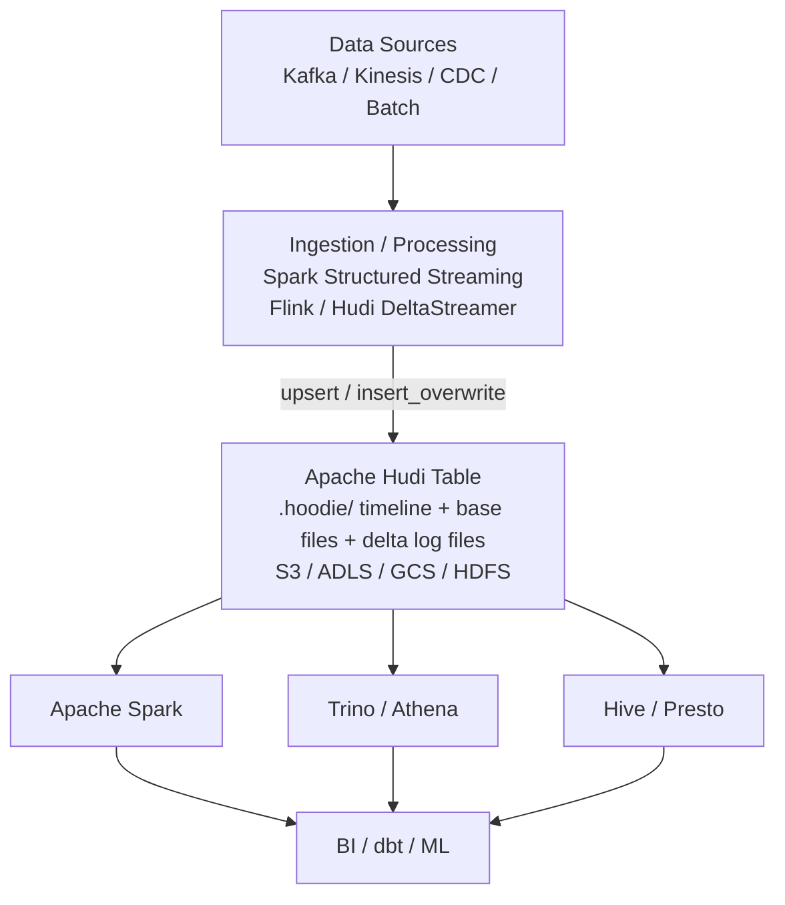
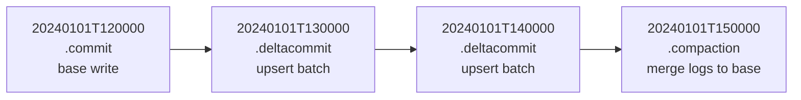
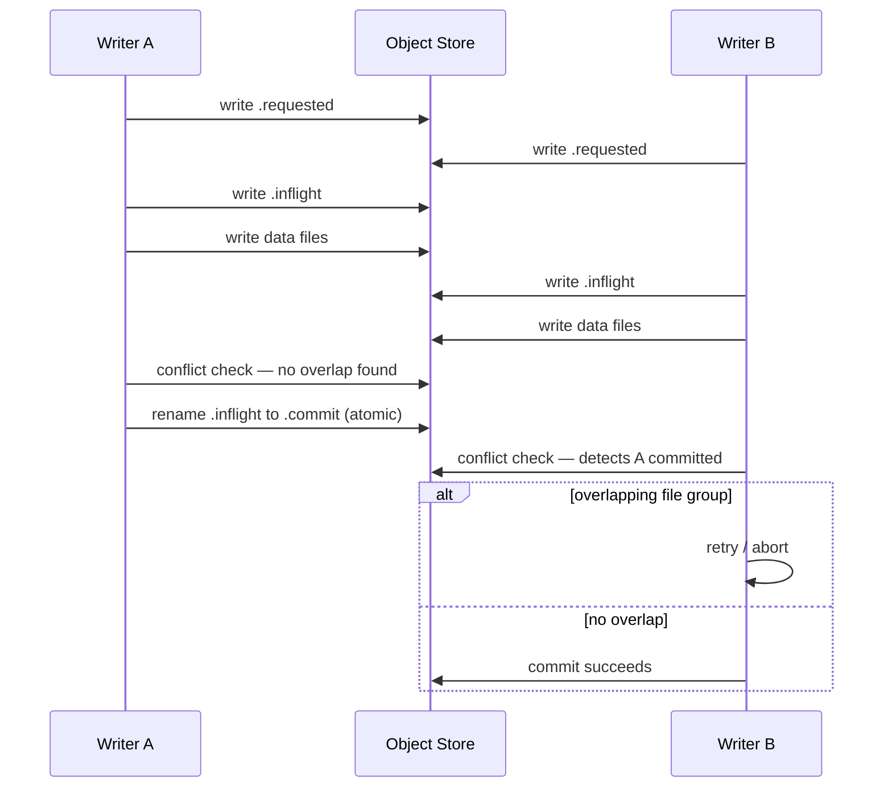
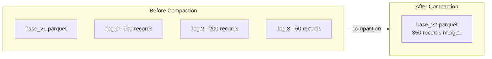
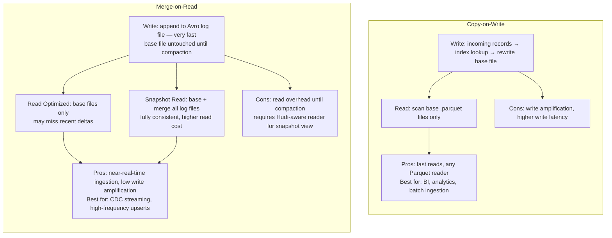
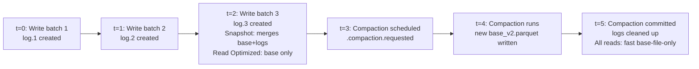

# Apache Hudi

## 1. What Is It & Why It Exists

### The Problem It Solves

Before open table formats existed, data lakes were write-once, append-only systems. Engineers who needed to correct records, propagate deletes (GDPR compliance), or run slowly changing dimension (SCD) logic were forced into one of two painful patterns:

1. **Full table rewrites** — read the entire dataset, apply changes, write it back. Works at small scale; catastrophic at petabyte scale.
2. **Shadow tables + merge jobs** — maintain a staging layer, run nightly merge scripts. Complex, brittle, and always one failed job away from data corruption.

Apache Hudi (Hadoop Upserts Deletes and Incrementals) was created at Uber in 2016 to solve exactly this class of problem for their 100 TB+ Hadoop-based data lake. The core insight: give every record a primary key and a record key, track changes in a per-commit timeline, and make upserts a first-class operation.

Specifically, Hudi solves:

- **ACID transactions on object storage** — optimistic concurrency control via an immutable timeline/commit log stored alongside data files.
- **Efficient record-level upserts and deletes** — avoids full rewrites by using index lookups to find which files contain a given record key.
- **Schema evolution** — add, rename, or drop columns without breaking downstream readers using Avro schema compatibility rules.
- **Time travel and incremental pulls** — query the table as of any previous commit instant; pull only records changed since a given instant (critical for streaming pipelines).
- **GDPR/CCPA right-to-delete** — issue a hard delete that propagates through compaction to all storage layers.

### How It Fits Into the Modern Data Stack



Hudi sits at the **storage layer** of the lakehouse architecture. It wraps raw Parquet/ORC files on object storage with a transactional management layer, exposing standard interfaces (Hive Metastore, Glue, REST) so every compute engine above it can query the table without knowing about Hudi internals.

### When to Choose Hudi Over Iceberg or Delta Lake

| Scenario | Choose Hudi |
|---|---|
| High-frequency CDC ingestion (millions of upserts/hour) | Yes — bloom/bucket indexes are tuned for this |
| Streaming pipeline with exactly-once upsert semantics | Yes — DeltaStreamer + Flink source connector |
| GDPR hard deletes that must propagate quickly | Yes — MOR tables surface deletes without waiting for compaction |
| Primary workload is analytics on mostly-static data | Consider Iceberg instead |
| Databricks-centric environment | Consider Delta Lake instead |
| Need partition evolution or hidden partitioning | Consider Iceberg instead |
| Need fine-grained access control via Unity Catalog | Consider Delta Lake instead |

**Rule of thumb:** If your dominant operation is **upsert** — CDC pipelines, event deduplication, SCD Type 2 — Hudi's indexing primitives give you lower write latency and cheaper storage than rebuilding with Iceberg or Delta.

---

## 2. Core Architecture

### Internal File Layout

A Hudi table on object storage looks like this:

```
s3://my-bucket/my_hudi_table/
│
├── .hoodie/                              # Timeline & metadata
│   ├── hoodie.properties                 # Table-level config (table type, key fields)
│   ├── 20240101120000000.commit          # Completed commit metadata (JSON)
│   ├── 20240101120000000.commit.requested
│   ├── 20240101120000000.commit.inflight
│   ├── 20240101130000000.deltacommit     # MOR delta commit
│   ├── 20240101140000000.compaction.requested
│   ├── 20240101140000000.compaction.inflight
│   ├── 20240101140000000.commit          # Compaction completed → becomes a commit
│   ├── .schema/                          # Avro schema history
│   └── metadata/                         # Hudi Metadata Table (optional, recommended)
│       ├── files/                        # Partition → file list index
│       ├── column_stats/                 # Min/max/null stats per column
│       └── bloom_filters/               # Serialised bloom filters
│
├── year=2024/month=01/day=01/            # User-defined partitions
│   ├── 1aa2b3c4-uuid_1-0_0-base.parquet  # Base file (COW) or base file (MOR)
│   ├── 1aa2b3c4-uuid_1-0_0-base.parquet.hoodie_partition_metadata
│   └── .1aa2b3c4-uuid_1-0_1.log.1_0     # Delta log file (MOR only)
│
└── year=2024/month=01/day=02/
    └── 2bb3c4d5-uuid_2-0_0-base.parquet
```

**Key components:**

| Component | Purpose |
|---|---|
| `.hoodie/` | The timeline — every action (commit, compaction, clean, rollback) is recorded here as an atomic triple: `.requested` → `.inflight` → completed |
| `hoodie.properties` | Immutable table config: `hoodie.table.type`, `hoodie.table.name`, key fields |
| `.commit` / `.deltacommit` | Completed action metadata: which files were written, sizes, stats, schema |
| Base files (`.parquet`) | Columnar data files, self-describing, readable by any Parquet reader |
| Log files (`.log`) | Avro-encoded delta records (inserts/updates/deletes) appended by MOR writes |
| Metadata Table | Secondary index that tracks file listings and column stats — avoids `LIST` calls on S3 |

### Snapshot / Versioning Model

Hudi uses a **timeline** — an ordered, append-only log of instants. Each instant has:

```
instant_time (yyyyMMddHHmmssSSS) + action (commit|deltacommit|compaction|clean|rollback) + state (requested|inflight|completed)
```



- A **snapshot read** at time T sees all instants ≤ T that are in `completed` state.
- An **incremental read** from T1 to T2 yields only records touched in that window.
- A **time travel read** re-constructs state as of a specific instant time.

Atomicity is guaranteed because an instant only becomes visible to readers when the completed file is written. Writers first write `.requested`, then `.inflight`, then data files, then atomically rename `.inflight` → `.commit`. If a writer crashes, the `.inflight` is detected and rolled back.

### How ACID Transactions Are Implemented

**Optimistic Concurrency Control (OCC):**



- **File-group level locking** (default): two writers conflict only if they touch the same file group (same partition + same file group UUID).
- **ZooKeeper / DynamoDB lock provider** (optional): adds distributed locking for multi-writer scenarios where OCC alone is insufficient.
- **Marker files**: before writing any data file, Hudi writes a marker to `.hoodie/.temp/<instant>/`. On crash recovery, orphan data files are identified via marker file diff and cleaned up.

---

## 3. Key Concepts Deep Dive

### Schema Evolution

Hudi uses **Avro schema compatibility** rules internally. The table schema is stored in `.hoodie/.schema/` and updated atomically with each commit that changes it.

Supported operations (with `hoodie.avro.schema.validate=true` — default):
- **Add nullable column** — backward compatible, old files read new column as `null`
- **Add column with default** — backward compatible
- **Drop column** — forward compatible (old readers ignore unknown fields)
- **Rename column** — requires `hoodie.datasource.write.reconcile.schema=true` + alias config
- **Widen type** (int→long) — supported
- **Narrow type** (long→int) — **not supported**, will throw

```python
from pyspark.sql import SparkSession
from pyspark.sql.types import StructType, StructField, StringType, IntegerType, LongType

spark = SparkSession.builder \
    .config("spark.serializer", "org.apache.spark.serializer.KryoSerializer") \
    .config("spark.sql.extensions", "org.apache.spark.sql.hudi.HoodieSparkSessionExtension") \
    .config("spark.sql.catalog.spark_catalog", "org.apache.spark.sql.hudi.catalog.HoodieCatalog") \
    .getOrCreate()

table_path = "s3://my-bucket/hudi/customers"

# --- Initial schema ---
df_v1 = spark.createDataFrame([
    (1, "Alice", 30),
    (2, "Bob",   25),
], ["id", "name", "age"])

df_v1.write.format("hudi") \
    .option("hoodie.table.name", "customers") \
    .option("hoodie.datasource.write.recordkey.field", "id") \
    .option("hoodie.datasource.write.precombine.field", "age") \
    .option("hoodie.datasource.write.operation", "upsert") \
    .mode("overwrite") \
    .save(table_path)

# --- Add a new column (email) ---
df_v2 = spark.createDataFrame([
    (3, "Carol", 28, "carol@example.com"),
], ["id", "name", "age", "email"])

df_v2.write.format("hudi") \
    .option("hoodie.table.name", "customers") \
    .option("hoodie.datasource.write.recordkey.field", "id") \
    .option("hoodie.datasource.write.precombine.field", "age") \
    .option("hoodie.datasource.write.operation", "upsert") \
    # Allow schema evolution: adds 'email' to the table schema
    .option("hoodie.datasource.write.schema.evolution", "true") \
    .mode("append") \
    .save(table_path)

# Old records now return NULL for 'email' — no rewrite needed
spark.read.format("hudi").load(table_path).show()
```

```sql
-- SQL-based schema evolution (Hudi 0.13+)
ALTER TABLE customers ADD COLUMNS (email STRING);
ALTER TABLE customers RENAME COLUMN age TO customer_age;
ALTER TABLE customers DROP COLUMN obsolete_field;
```

### Time Travel & Rollback

```python
# --- Time travel: read table as of a specific commit instant ---
df_past = spark.read.format("hudi") \
    .option("as.of.instant", "20240101120000000") \
    .load(table_path)

# --- Time travel via SQL ---
spark.sql("""
    SELECT * FROM customers
    TIMESTAMP AS OF '2024-01-01 12:00:00'
""")

# --- Incremental pull: only records changed between two instants ---
df_incremental = spark.read.format("hudi") \
    .option("hoodie.datasource.query.type", "incremental") \
    .option("hoodie.datasource.read.begin.instanttime", "20240101120000000") \
    .option("hoodie.datasource.read.end.instanttime",   "20240101150000000") \
    .load(table_path)
```

```python
# --- Rollback via Spark ---
from pyspark.sql import SparkSession

hudi_utils = spark._jvm.org.apache.hudi.utilities.HoodieCLIUtils
# Via Hudi CLI (recommended for production rollback):
# hudi-cli> connect --path s3://my-bucket/hudi/customers
# hudi-cli> rollback --instantTime 20240101130000000
```

```sql
-- SQL rollback (Hudi 0.14+)
CALL run_rollback(table => 'customers', instant_time => '20240101130000000');
```

### MERGE / UPSERT Semantics

Hudi's `upsert` is its killer feature. Under the hood:

1. **Tag incoming records** — look up the index (bloom/bucket/HBase) to find which existing file group (partition + file ID) contains each record key.
2. **Bucket incoming records** — group new/updated records by their target file group.
3. **COW**: rewrite affected base files with merged content.  
   **MOR**: append a log file to the affected file group; base file unchanged.

```python
# Upsert (insert new + update existing by primary key)
updates_df.write.format("hudi") \
    .option("hoodie.table.name", "customers") \
    .option("hoodie.datasource.write.recordkey.field", "id") \
    .option("hoodie.datasource.write.precombine.field", "updated_at") \
    .option("hoodie.datasource.write.operation", "upsert") \
    .mode("append") \
    .save(table_path)

# Delete by primary key
deletes_df.write.format("hudi") \
    .option("hoodie.datasource.write.operation", "delete") \
    .option("hoodie.datasource.write.recordkey.field", "id") \
    .mode("append") \
    .save(table_path)
```

```sql
-- SQL MERGE (Hudi 0.13+)
MERGE INTO customers AS target
USING updates AS source
ON target.id = source.id
WHEN MATCHED AND source.action = 'delete' THEN DELETE
WHEN MATCHED THEN UPDATE SET *
WHEN NOT MATCHED THEN INSERT *;
```

**Precombine field**: when multiple incoming records share the same record key (e.g., a CDC topic emits two updates for the same row in one micro-batch), Hudi uses the `precombine.field` to pick the winner — the record with the **larger** value wins. Use a monotonically increasing timestamp or sequence number.

### Compaction / Small File Problem

**Why small files occur:** MOR tables append a new log file per micro-batch write. After N batches, a file group may have 1 base file + N log files. Reading requires merging all of them.

**Compaction** merges log files back into a new base file, resetting the file group to a clean state:



```python
# Inline compaction: runs compaction synchronously after every N delta commits
df.write.format("hudi") \
    .option("hoodie.compact.inline", "true") \
    .option("hoodie.compact.inline.max.delta.commits", "5") \
    .mode("append") \
    .save(table_path)

# Async compaction: schedule compaction separately (recommended for streaming)
from pyspark.sql import SparkSession

spark.sql("""
    CALL run_compaction(
        op       => 'schedule',
        table    => 'customers'
    )
""")

spark.sql("""
    CALL run_compaction(
        op           => 'run',
        table        => 'customers',
        instant_time => '<instant_from_schedule>'
    )
""")
```

**Small file handling on COW** — Hudi auto-sizes files during writes via:
```
hoodie.parquet.small.file.limit          = 104857600   # 100 MB — files below this get backfilled
hoodie.copyonwrite.insert.split.size     = 524288000   # 500 MB — target file size for new inserts
```

### Copy-on-Write vs Merge-on-Read

This is Hudi's most important architectural decision. **Set it once at table creation; cannot be changed.**



**MOR Compaction Lifecycle:**



```python
# Create a MOR table
spark.sql("""
    CREATE TABLE IF NOT EXISTS customers_mor (
        id          BIGINT,
        name        STRING,
        age         INT,
        updated_at  TIMESTAMP
    )
    USING hudi
    TBLPROPERTIES (
        'hoodie.table.type'                          = 'MERGE_ON_READ',
        'hoodie.datasource.write.recordkey.field'    = 'id',
        'hoodie.datasource.write.precombine.field'   = 'updated_at',
        'hoodie.compact.inline'                      = 'false',
        'hoodie.compact.inline.max.delta.commits'    = '10'
    )
    LOCATION 's3://my-bucket/hudi/customers_mor'
""")
```

### Indexing Strategies

Hudi's index answers the question: *"Given a set of incoming record keys, which existing file groups contain them?"* This drives upsert efficiency.

#### Bloom Index (default)

Each base file stores a Bloom filter of its record keys in the Parquet footer. On upsert, Hudi loads all Bloom filters, tests incoming keys, and identifies candidate files. False positives are resolved by reading candidate files.

```
Pros:  No external dependency, works out of the box
Cons:  O(n_files) Bloom filter loads; degrades at scale (>10k files per partition)
       Poor for high-cardinality keys spread across many partitions
```

```python
.option("hoodie.index.type", "BLOOM") \
.option("hoodie.bloom.index.parallelism", "200") \
.option("hoodie.bloom.index.filter.dynamic.max.entries", "100000")
```

#### Bucket Index

Assigns each record key to a fixed bucket (file group) via consistent hashing: `bucket = hash(record_key) % num_buckets`. No index lookup needed — the target file is computed deterministically.

```
Pros:  O(1) lookup, no index state to maintain, very fast upserts
Cons:  num_buckets is fixed at table creation; bucket skew if keys are not uniform
       Must set num_buckets correctly upfront (hard to change later)
```

```python
.option("hoodie.index.type",                         "BUCKET") \
.option("hoodie.storage.layout.type",                "BUCKET") \
.option("hoodie.storage.layout.partitioner.class",
        "org.apache.hudi.table.action.commit.SparkBucketIndexPartitioner") \
.option("hoodie.bucket.index.num.buckets",           "64")
```

**Sizing rule:** `num_buckets ≈ expected_total_records / records_per_file`. If you expect 640M records and target 10M records/file → 64 buckets.

#### HBase Index

Stores a global `record_key → (partition, file_id)` mapping in Apache HBase. Enables cross-partition lookups for tables where the same record key can appear in different partitions over time.

```
Pros:  Supports global (non-partitioned) key lookups, handles partition changes
Cons:  Requires operational HBase cluster; adds network latency per lookup
```

```python
.option("hoodie.index.type",               "HBASE") \
.option("hoodie.index.hbase.zkquorum",     "zk-host1,zk-host2") \
.option("hoodie.index.hbase.zkport",       "2181") \
.option("hoodie.index.hbase.table",        "hudi_hbase_index")
```

#### Metadata Table Index (recommended for large tables)

Hudi's own metadata table (stored in `.hoodie/metadata/`) maintains a `files` partition that acts as a secondary index, eliminating expensive `LIST` operations on S3. Enable it for any table with >100 partitions.

```python
.option("hoodie.metadata.enable",                    "true") \
.option("hoodie.metadata.index.column.stats.enable", "true") \
.option("hoodie.metadata.index.bloom.filter.enable", "true")
```

---

## 4. Implementation Guide

### End-to-End Working Example

#### Prerequisites

```python
# requirements / PySpark session with Hudi jars
# spark-submit --packages org.apache.hudi:hudi-spark3.4-bundle_2.12:0.14.1 ...

from pyspark.sql import SparkSession
from pyspark.sql.functions import col, current_timestamp, lit
from datetime import datetime

spark = SparkSession.builder \
    .appName("HudiDemo") \
    .config("spark.serializer",
            "org.apache.spark.serializer.KryoSerializer") \
    .config("spark.sql.extensions",
            "org.apache.spark.sql.hudi.HoodieSparkSessionExtension") \
    .config("spark.sql.catalog.spark_catalog",
            "org.apache.spark.sql.hudi.catalog.HoodieCatalog") \
    .config("spark.kryo.registrator",
            "org.apache.spark.HoodieSparkKryoRegistrar") \
    .getOrCreate()

TABLE_PATH = "s3://my-bucket/hudi/orders"
TABLE_NAME = "orders"
```

#### Creating a Table

```sql
-- SQL DDL
CREATE TABLE IF NOT EXISTS orders (
    order_id      BIGINT       NOT NULL,
    customer_id   BIGINT,
    status        STRING,
    total_amount  DOUBLE,
    order_date    DATE,
    updated_at    TIMESTAMP
)
USING hudi
PARTITIONED BY (order_date)
TBLPROPERTIES (
    'hoodie.table.type'                            = 'COPY_ON_WRITE',
    'hoodie.datasource.write.recordkey.field'      = 'order_id',
    'hoodie.datasource.write.partitionpath.field'  = 'order_date',
    'hoodie.datasource.write.precombine.field'     = 'updated_at',
    'hoodie.table.name'                            = 'orders',
    'hoodie.metadata.enable'                       = 'true',
    'hoodie.metadata.index.column.stats.enable'    = 'true',
    'hoodie.parquet.max.file.size'                 = '134217728',
    'hoodie.parquet.small.file.limit'              = '104857600'
)
LOCATION 's3://my-bucket/hudi/orders';
```

```python
# Equivalent via PySpark API (creates table on first write)
common_hudi_options = {
    "hoodie.table.name":                           TABLE_NAME,
    "hoodie.datasource.write.recordkey.field":     "order_id",
    "hoodie.datasource.write.partitionpath.field": "order_date",
    "hoodie.datasource.write.precombine.field":    "updated_at",
    "hoodie.datasource.write.hive_style_partitioning": "true",
    "hoodie.metadata.enable":                      "true",
    "hoodie.metadata.index.column.stats.enable":   "true",
    "hoodie.parquet.max.file.size":                str(128 * 1024 * 1024),
    "hoodie.parquet.small.file.limit":             str(100 * 1024 * 1024),
}
```

#### Writing Data — Batch

```python
from pyspark.sql.functions import to_date

# Simulate initial load
initial_data = [
    (1001, 501, "PLACED",    99.99,  "2024-01-15", "2024-01-15 10:00:00"),
    (1002, 502, "SHIPPED",  149.00,  "2024-01-16", "2024-01-16 11:00:00"),
    (1003, 503, "PLACED",    49.50,  "2024-01-17", "2024-01-17 09:30:00"),
]
schema = ["order_id", "customer_id", "status", "total_amount", "order_date", "updated_at"]

df_initial = spark.createDataFrame(initial_data, schema) \
    .withColumn("order_date",  to_date("order_date")) \
    .withColumn("updated_at",  col("updated_at").cast("timestamp"))

df_initial.write.format("hudi") \
    .options(**common_hudi_options) \
    .option("hoodie.datasource.write.operation", "bulk_insert") \
    .mode("overwrite") \
    .save(TABLE_PATH)
```

#### Writing Data — Streaming (Structured Streaming)

```python
from pyspark.sql.functions import from_json, schema_of_json

# Read from Kafka CDC topic
raw_stream = spark.readStream \
    .format("kafka") \
    .option("kafka.bootstrap.servers", "kafka-broker:9092") \
    .option("subscribe", "orders_cdc") \
    .load()

orders_schema = "order_id BIGINT, customer_id BIGINT, status STRING, " \
                "total_amount DOUBLE, order_date STRING, updated_at TIMESTAMP"

parsed_stream = raw_stream \
    .select(from_json(col("value").cast("string"), orders_schema).alias("data")) \
    .select("data.*") \
    .withColumn("order_date", to_date("order_date"))

query = parsed_stream.writeStream \
    .format("hudi") \
    .options(**common_hudi_options) \
    .option("hoodie.datasource.write.operation",          "upsert") \
    .option("hoodie.table.type",                          "MERGE_ON_READ") \
    .option("hoodie.compact.inline",                      "false") \
    .option("hoodie.compact.inline.max.delta.commits",    "10") \
    .option("checkpointLocation",                         "s3://my-bucket/checkpoints/orders") \
    .outputMode("append") \
    .trigger(processingTime="60 seconds") \
    .start(TABLE_PATH)

query.awaitTermination()
```

#### Reading with Time Travel

```python
# Snapshot read (latest)
df_latest = spark.read.format("hudi").load(TABLE_PATH)
df_latest.show()

# Time travel — as of a specific instant
df_at_time = spark.read.format("hudi") \
    .option("as.of.instant", "20240115100000000") \
    .load(TABLE_PATH)

# Time travel — as of a date string (Hudi 0.12+)
df_at_date = spark.read.format("hudi") \
    .option("as.of.instant", "2024-01-15 10:00:00") \
    .load(TABLE_PATH)

# Incremental read — only changed records
df_incremental = spark.read.format("hudi") \
    .option("hoodie.datasource.query.type",              "incremental") \
    .option("hoodie.datasource.read.begin.instanttime",  "20240115100000000") \
    .option("hoodie.datasource.read.end.instanttime",    "20240116120000000") \
    .load(TABLE_PATH)
```

```sql
-- SQL time travel
SELECT * FROM orders TIMESTAMP AS OF '2024-01-15 10:00:00';
SELECT * FROM orders VERSION AS OF '20240115100000000';
```

#### Running MERGE / UPSERT

```python
# Batch upsert — update existing + insert new
updates = [
    (1002, 502, "DELIVERED", 149.00, "2024-01-16", "2024-01-17 08:00:00"),  # update
    (1004, 504, "PLACED",     75.25, "2024-01-17", "2024-01-17 14:00:00"),  # insert
]

df_updates = spark.createDataFrame(updates, schema) \
    .withColumn("order_date", to_date("order_date")) \
    .withColumn("updated_at", col("updated_at").cast("timestamp"))

df_updates.write.format("hudi") \
    .options(**common_hudi_options) \
    .option("hoodie.datasource.write.operation", "upsert") \
    .mode("append") \
    .save(TABLE_PATH)
```

```sql
-- SQL MERGE
MERGE INTO orders AS t
USING (
    SELECT 1002 AS order_id, 502 AS customer_id, 'DELIVERED' AS status,
           149.00 AS total_amount, DATE('2024-01-16') AS order_date,
           TIMESTAMP('2024-01-17 08:00:00') AS updated_at
) AS s
ON t.order_id = s.order_id
WHEN MATCHED THEN
    UPDATE SET t.status = s.status, t.updated_at = s.updated_at
WHEN NOT MATCHED THEN
    INSERT (order_id, customer_id, status, total_amount, order_date, updated_at)
    VALUES (s.order_id, s.customer_id, s.status, s.total_amount, s.order_date, s.updated_at);
```

#### Schema Evolution in Practice

```python
# Add a new column to existing table
from pyspark.sql.functions import lit

# Read current data
df = spark.read.format("hudi").load(TABLE_PATH)

# New batch has an additional column
new_data = [(1005, 505, "PLACED", 200.00, "2024-01-18", "2024-01-18 10:00:00", "PRIORITY")]
new_schema = schema + ["fulfillment_type"]

df_new = spark.createDataFrame(new_data, new_schema) \
    .withColumn("order_date", to_date("order_date")) \
    .withColumn("updated_at", col("updated_at").cast("timestamp"))

df_new.write.format("hudi") \
    .options(**common_hudi_options) \
    .option("hoodie.datasource.write.operation",        "upsert") \
    # Critical: enable schema evolution to add the new column
    .option("hoodie.datasource.write.schema.evolution", "true") \
    .mode("append") \
    .save(TABLE_PATH)

# Old records return NULL for fulfillment_type — no rewrite
spark.read.format("hudi").load(TABLE_PATH).select(
    "order_id", "status", "fulfillment_type"
).show()
```

#### Full Config Block

```python
hudi_full_config = {
    # ── Table Identity ────────────────────────────────────────────────
    "hoodie.table.name":                    "orders",           # Required: logical table name
    "hoodie.database.name":                 "ecommerce",        # Optional: Hive database

    # ── Key Fields ───────────────────────────────────────────────────
    "hoodie.datasource.write.recordkey.field":     "order_id",  # Primary key (unique per record)
    "hoodie.datasource.write.partitionpath.field": "order_date",# Partition column(s), comma-sep
    "hoodie.datasource.write.precombine.field":    "updated_at",# Dedup: higher value wins

    # ── Table Type ───────────────────────────────────────────────────
    # "COPY_ON_WRITE" (default) or "MERGE_ON_READ"
    # COW: better read perf; MOR: better write perf for streaming
    "hoodie.datasource.write.table.type":   "COPY_ON_WRITE",

    # ── Write Operation ──────────────────────────────────────────────
    # upsert (default), insert, bulk_insert, delete, insert_overwrite
    "hoodie.datasource.write.operation":    "upsert",

    # ── Index ────────────────────────────────────────────────────────
    # BLOOM (default), BUCKET, GLOBAL_BLOOM, SIMPLE, HBASE, INMEMORY
    "hoodie.index.type":                    "BLOOM",
    "hoodie.bloom.index.parallelism":       "200",              # Parallelism for Bloom lookup
    "hoodie.bloom.index.update.partition.path": "true",         # Allow key to move partitions

    # ── File Sizing ──────────────────────────────────────────────────
    "hoodie.parquet.max.file.size":         str(128 * 1024 * 1024),  # 128 MB target file size
    "hoodie.parquet.small.file.limit":      str(100 * 1024 * 1024),  # Files < 100MB get backfilled
    "hoodie.copyonwrite.insert.split.size": str(500 * 1024 * 1024),  # Split inserts at 500MB

    # ── Compaction (MOR only) ─────────────────────────────────────────
    "hoodie.compact.inline":                        "false",    # true = synchronous (avoid for streaming)
    "hoodie.compact.inline.max.delta.commits":      "10",       # Trigger after N delta commits
    "hoodie.parquet.small.file.limit":              "104857600",

    # ── Cleaning ─────────────────────────────────────────────────────
    "hoodie.cleaner.policy":                "KEEP_LATEST_COMMITS",
    "hoodie.cleaner.commits.retained":      "10",               # Keep last 10 commits for time travel
    "hoodie.clean.automatic":               "true",             # Auto-clean after each commit
    "hoodie.clean.async":                   "true",             # Don't block writes

    # ── Schema Evolution ─────────────────────────────────────────────
    "hoodie.datasource.write.schema.evolution":     "true",
    "hoodie.avro.schema.validate":                  "true",     # Validate schema compat on write

    # ── Metadata Table ────────────────────────────────────────────────
    "hoodie.metadata.enable":                       "true",     # Recommended: avoids S3 LIST calls
    "hoodie.metadata.index.column.stats.enable":    "true",     # Min/max stats for data skipping
    "hoodie.metadata.index.bloom.filter.enable":    "true",     # Bloom filters in metadata

    # ── Hive Sync ─────────────────────────────────────────────────────
    "hoodie.datasource.hive_sync.enable":           "true",
    "hoodie.datasource.hive_sync.database":         "ecommerce",
    "hoodie.datasource.hive_sync.table":            "orders",
    "hoodie.datasource.hive_sync.mode":             "hms",      # hms | glue | jdbc
    "hoodie.datasource.hive_sync.metastore.uris":   "thrift://hive-metastore:9083",
    "hoodie.datasource.write.hive_style_partitioning": "true",  # order_date=2024-01-15/

    # ── Parallelism ──────────────────────────────────────────────────
    "hoodie.upsert.shuffle.parallelism":    "200",              # Shuffle for upsert bucketing
    "hoodie.insert.shuffle.parallelism":    "200",              # Shuffle for insert bucketing
    "hoodie.bulkinsert.shuffle.parallelism":"200",              # Shuffle for bulk insert
    "hoodie.delete.shuffle.parallelism":    "200",
}
```

---

## 5. Integration with the Ecosystem

### Apache Spark

```python
# spark-defaults.conf or SparkSession config
spark = SparkSession.builder \
    .config("spark.serializer",
            "org.apache.spark.serializer.KryoSerializer") \
    .config("spark.sql.extensions",
            "org.apache.spark.sql.hudi.HoodieSparkSessionExtension") \
    .config("spark.sql.catalog.spark_catalog",
            "org.apache.spark.sql.hudi.catalog.HoodieCatalog") \
    .config("spark.kryo.registrator",
            "org.apache.spark.HoodieSparkKryoRegistrar") \
    # Add Hudi bundle jar (choose version matching your Spark/Scala)
    # .config("spark.jars.packages",
    #         "org.apache.hudi:hudi-spark3.4-bundle_2.12:0.14.1") \
    .getOrCreate()
```

```yaml
# spark-submit example
spark-submit \
  --packages org.apache.hudi:hudi-spark3.4-bundle_2.12:0.14.1 \
  --conf spark.serializer=org.apache.spark.serializer.KryoSerializer \
  --conf spark.sql.extensions=org.apache.spark.sql.hudi.HoodieSparkSessionExtension \
  --conf spark.sql.catalog.spark_catalog=org.apache.spark.sql.hudi.catalog.HoodieCatalog \
  my_hudi_job.py
```

### AWS Glue / S3

```python
# AWS Glue 4.0+ with Hudi support
# In Glue job parameters: --datalake-formats hudi

import sys
from awsglue.context import GlueContext
from awsglue.job import Job
from pyspark.context import SparkContext

sc = SparkContext()
glueContext = GlueContext(sc)
spark = glueContext.spark_session
job = Job(glueContext)

# Glue automatically adds Hudi jars when --datalake-formats hudi is set
glue_hudi_options = {
    "hoodie.table.name":                           "orders",
    "hoodie.datasource.write.recordkey.field":     "order_id",
    "hoodie.datasource.write.precombine.field":    "updated_at",
    "hoodie.datasource.write.operation":           "upsert",
    "hoodie.datasource.write.partitionpath.field": "order_date",
    "hoodie.datasource.hive_sync.enable":          "true",
    "hoodie.datasource.hive_sync.database":        "ecommerce",
    "hoodie.datasource.hive_sync.table":           "orders",
    "hoodie.datasource.hive_sync.partition_fields": "order_date",
    "hoodie.datasource.hive_sync.mode":            "glue",      # Sync to AWS Glue Catalog
    "hoodie.datasource.hive_sync.use_jdbc":        "false",
    "hoodie.datasource.hive_sync.region":          "us-east-1",
}

dynamic_frame = glueContext.create_dynamic_frame.from_catalog(
    database="ecommerce", table_name="orders_source"
)

dynamic_frame.toDF().write.format("hudi") \
    .options(**glue_hudi_options) \
    .mode("append") \
    .save("s3://my-bucket/hudi/orders/")
```

```yaml
# Glue job parameters (set in AWS Console or CDK/Terraform)
--datalake-formats: hudi
--conf: spark.serializer=org.apache.spark.serializer.KryoSerializer
--conf: spark.sql.extensions=org.apache.spark.sql.hudi.HoodieSparkSessionExtension
--conf: spark.sql.catalog.spark_catalog=org.apache.spark.sql.hudi.catalog.HoodieCatalog
```

### Trino / Athena

```sql
-- Trino with Hudi connector (Trino 398+)
-- Configure hudi catalog in etc/catalog/hudi.properties:
-- connector.name=hudi
-- hive.metastore.uri=thrift://hive-metastore:9083

-- Read Hudi table via Trino
SELECT order_id, status, total_amount
FROM hudi.ecommerce.orders
WHERE order_date >= DATE '2024-01-15';

-- Trino supports snapshot reads only (no time travel via Trino directly)
-- For time travel use Spark or Athena v3
```

```sql
-- AWS Athena v3 (Hudi native support)
-- Register table in Glue Catalog, then query directly:
SELECT * FROM ecommerce.orders
WHERE order_date = '2024-01-17';

-- Athena time travel (supported in Athena v3 for Hudi COW tables):
SELECT * FROM ecommerce.orders
FOR TIMESTAMP AS OF TIMESTAMP '2024-01-15 10:00:00 UTC';
```

### Apache Flink (Streaming Writes)

```xml
<!-- pom.xml dependency -->
<dependency>
    <groupId>org.apache.hudi</groupId>
    <artifactId>hudi-flink1.17-bundle_2.12</artifactId>
    <version>0.14.1</version>
</dependency>
```

```python
# PyFlink streaming write to Hudi
from pyflink.datastream import StreamExecutionEnvironment
from pyflink.table import StreamTableEnvironment

env = StreamExecutionEnvironment.get_execution_environment()
env.set_parallelism(4)
t_env = StreamTableEnvironment.create(env)

t_env.execute_sql("""
    CREATE TABLE orders_source (
        order_id      BIGINT,
        customer_id   BIGINT,
        status        STRING,
        total_amount  DOUBLE,
        order_date    STRING,
        updated_at    TIMESTAMP(3),
        WATERMARK FOR updated_at AS updated_at - INTERVAL '5' SECOND
    ) WITH (
        'connector'             = 'kafka',
        'topic'                 = 'orders_cdc',
        'properties.bootstrap.servers' = 'kafka-broker:9092',
        'format'                = 'json',
        'scan.startup.mode'     = 'latest-offset'
    )
""")

t_env.execute_sql("""
    CREATE TABLE orders_hudi (
        order_id      BIGINT PRIMARY KEY NOT ENFORCED,
        customer_id   BIGINT,
        status        STRING,
        total_amount  DOUBLE,
        order_date    STRING,
        updated_at    TIMESTAMP(3)
    ) WITH (
        'connector'                          = 'hudi',
        'path'                               = 's3://my-bucket/hudi/orders',
        'table.type'                         = 'MERGE_ON_READ',
        'hoodie.datasource.write.recordkey.field' = 'order_id',
        'write.precombine.field'             = 'updated_at',
        'write.tasks'                        = '4',
        'write.rate.limit'                   = '3000',     -- records/s
        'compaction.tasks'                   = '2',
        'compaction.async.enabled'           = 'true',
        'compaction.trigger.strategy'        = 'num_commits',
        'compaction.delta_commits'           = '10',
        'hive_sync.enabled'                  = 'true',
        'hive_sync.mode'                     = 'hms',
        'hive_sync.metastore.uris'           = 'thrift://hive-metastore:9083',
        'hive_sync.database'                 = 'ecommerce',
        'hive_sync.table'                    = 'orders'
    )
""")

t_env.execute_sql("""
    INSERT INTO orders_hudi SELECT * FROM orders_source
""")
```

### dbt

```yaml
# profiles.yml — use Spark or Trino adapter
my_hudi_project:
  target: dev
  outputs:
    dev:
      type: spark
      method: thrift
      host: spark-thrift-server
      port: 10001
      schema: ecommerce
      threads: 4
```

```sql
-- models/orders_enriched.sql
{{ config(
    materialized='incremental',
    incremental_strategy='merge',
    unique_key='order_id',
    file_format='hudi',
    pre_hook="SET hoodie.datasource.write.operation=upsert",
    tblproperties={
        'hoodie.table.type':                         'COPY_ON_WRITE',
        'hoodie.datasource.write.recordkey.field':   'order_id',
        'hoodie.datasource.write.precombine.field':  'updated_at',
        'hoodie.metadata.enable':                    'true',
    }
) }}

SELECT
    o.order_id,
    o.customer_id,
    c.name        AS customer_name,
    o.status,
    o.total_amount,
    o.order_date,
    current_timestamp() AS updated_at
FROM {{ source('raw', 'orders') }} o
JOIN {{ source('raw', 'customers') }} c ON o.customer_id = c.id


WHERE o.updated_at > (SELECT MAX(updated_at) FROM {{ this }})

```

---

## 6. Performance Tuning

### File Sizing Recommendations

Target **128–256 MB** per Parquet base file. This balances:
- **Too small (<32 MB)**: many files → high S3 LIST latency, high Spark task overhead
- **Too large (>512 MB)**: slow rewrites on upsert (COW), slow compaction (MOR)

```python
{
    # Target size for base files
    "hoodie.parquet.max.file.size":             str(128 * 1024 * 1024),   # 128 MB
    # Files smaller than this will be "backfilled" (new inserts go into them)
    "hoodie.parquet.small.file.limit":          str(100 * 1024 * 1024),   # 100 MB
    # For COW: split large insert batches into multiple files of this size
    "hoodie.copyonwrite.insert.split.size":     str(500 * 1024 * 1024),   # 500 MB
    # For log files in MOR: max log block size before rolling
    "hoodie.logfile.max.size":                  str(1024 * 1024 * 1024),  # 1 GB
    # Parquet row group size
    "hoodie.parquet.block.size":                str(128 * 1024 * 1024),   # 128 MB
    # Parquet page size
    "hoodie.parquet.page.size":                 str(1 * 1024 * 1024),     # 1 MB
}
```

### Partitioning Strategies

**Good partition columns:**
- Low-to-medium cardinality (100–10,000 distinct values)
- Frequently used in WHERE filters (date, region, event_type)
- Roughly equal data distribution

**Anti-patterns:**
- High-cardinality columns (user_id, UUID) → millions of tiny partitions
- Columns rarely used in queries → scan must hit all partitions
- Deeply nested hierarchies (year/month/day/hour) → excessive partitions for small tables

```python
# Good: partition by date, query pattern is always date-filtered
.option("hoodie.datasource.write.partitionpath.field", "order_date")

# Good for event data: partition by event_type + date
.option("hoodie.datasource.write.partitionpath.field", "event_type,event_date")

# Avoid: partition by user_id (high cardinality → millions of partitions)
# .option("hoodie.datasource.write.partitionpath.field", "user_id")  # BAD

# For non-partitioned tables (global upsert with HBase/Bucket index)
.option("hoodie.datasource.write.partitionpath.field", "")
.option("hoodie.datasource.write.keygenerator.class",
        "org.apache.hudi.keygen.NonpartitionedKeyGenerator")
```

### Compaction / Optimize Strategies

```python
# For MOR tables: schedule and run compaction as a separate Spark job
# Run during off-peak hours to avoid competing with streaming writes

# Option 1: Spark-based compaction job
from pyspark.sql import SparkSession

spark = SparkSession.builder \
    .config("spark.serializer", "org.apache.spark.serializer.KryoSerializer") \
    .config("spark.sql.extensions", "org.apache.spark.sql.hudi.HoodieSparkSessionExtension") \
    .config("spark.sql.catalog.spark_catalog", "org.apache.spark.sql.hudi.catalog.HoodieCatalog") \
    .getOrCreate()

# Schedule a compaction plan
spark.sql("CALL run_compaction(op => 'schedule', table => 'ecommerce.orders')")

# Show pending compaction plans
spark.sql("CALL show_compaction(table => 'ecommerce.orders')").show()

# Run compaction
spark.sql("""
    CALL run_compaction(
        op           => 'run',
        table        => 'ecommerce.orders',
        instant_time => '20240101140000000'
    )
""")
```

```yaml
# Recommended compaction schedule for CDC workloads
# Run every 15 minutes in a separate Spark job
inline_compaction: false                    # Never inline for streaming tables
async_compaction: true                      # Background compaction
delta_commits_trigger: 5                    # Compact after every 5 delta commits
target_io_per_compaction: 5GB              # Limit I/O per compaction run
```

### Column Stats, Bloom Filters, Z-ordering / Clustering

```python
# Enable column stats (min/max/null counts) in metadata table
# Allows Spark to skip files where column value is outside query range
{
    "hoodie.metadata.index.column.stats.enable":         "true",
    "hoodie.metadata.index.column.stats.column.list":    "status,order_date,customer_id",
}

# Z-ordering / clustering: re-sort data within partitions to improve skipping
# Schedule via Spark SQL (Hudi 0.13+)
spark.sql("""
    CALL run_clustering(
        table    => 'ecommerce.orders',
        order_columns => 'customer_id,order_date'
    )
""")
```

```python
# Clustering config (inline, for batch workloads)
{
    "hoodie.clustering.inline":                     "false",     # Don't block writes
    "hoodie.clustering.async.enabled":              "true",
    "hoodie.clustering.plan.strategy.class":
        "org.apache.hudi.client.clustering.plan.strategy.SparkSizeBasedClusteringPlanStrategy",
    "hoodie.clustering.plan.strategy.target.file.max.bytes": str(128 * 1024 * 1024),
    "hoodie.clustering.plan.strategy.small.file.limit":      str(600 * 1024 * 1024),
    "hoodie.clustering.plan.strategy.sort.columns": "customer_id,order_date",
    "hoodie.layout.optimize.strategy":              "z-order",   # z-order or hilbert
}
```

### Common Query Patterns and Tuning

```python
# Pattern 1: Point lookup by record key
# → Use BUCKET index, no shuffle needed
{
    "hoodie.index.type":                        "BUCKET",
    "hoodie.bucket.index.num.buckets":          "64",
    "hoodie.metadata.index.column.stats.enable": "true",
}

# Pattern 2: Range scan on partition column (date range)
# → Partition pruning is automatic; add column stats for sub-partition skipping
spark.sql("""
    SELECT * FROM orders
    WHERE order_date BETWEEN '2024-01-01' AND '2024-01-31'
    AND status = 'SHIPPED'
""")
# status column stats allow Hudi to skip files where status != 'SHIPPED'

# Pattern 3: Incremental pipeline (read only changed records)
# → Use incremental query type — reads only commit metadata, not full table
df = spark.read.format("hudi") \
    .option("hoodie.datasource.query.type",             "incremental") \
    .option("hoodie.datasource.read.begin.instanttime", last_processed_instant) \
    .load(TABLE_PATH)

# Pattern 4: MOR read performance — prefer Read Optimized for BI
# MOR snapshot view (all data including uncommitted deltas):
spark.sql("SELECT * FROM orders")

# MOR read-optimized view (base files only, may be slightly stale):
spark.sql("SELECT * FROM orders_ro")  # _ro suffix registered by Hive sync
```

---

## 7. Common Pitfalls & How to Avoid Them

**Pitfall:** Choosing COPY_ON_WRITE for a high-frequency CDC streaming workload
**Symptom:** Spark jobs run slowly; write amplification causes excessive S3 PUT traffic; small files accumulate because each micro-batch rewrites entire file groups
**Fix:** Switch to `hoodie.table.type=MERGE_ON_READ` at table creation time. Schedule async compaction separately. Note: table type cannot be changed after creation — recreate the table if needed.

---

**Pitfall:** Not setting a `precombine.field`, or setting it to a column that is not monotonically increasing
**Symptom:** Stale values win over newer updates within the same write batch; duplicate records appear after deduplication
**Fix:** Always set `hoodie.datasource.write.precombine.field` to a column that strictly increases with time — e.g., a Unix epoch millisecond timestamp or a monotonic sequence number. Never use a boolean or low-cardinality field.

---

**Pitfall:** Using BLOOM index on a table with millions of files or globally distributed keys
**Symptom:** Upsert jobs spend 80%+ of their time in the "index lookup" stage; Bloom filter loading causes OOM errors on executors
**Fix:** Switch to `hoodie.index.type=BUCKET` if your key distribution is uniform. For non-uniform or cross-partition keys, use `GLOBAL_BLOOM` with `hoodie.bloom.index.filter.dynamic.max.entries` tuned down, or migrate to HBase index for very large tables.

---

**Pitfall:** Disabling the Metadata Table (`hoodie.metadata.enable=false`) on S3-backed tables with many partitions
**Symptom:** Every write and read job issues thousands of `LIST` API calls to S3; high S3 costs; job latency dominated by S3 LIST operations
**Fix:** Set `hoodie.metadata.enable=true` (default in Hudi 0.11+). The metadata table maintains a file listing index that eliminates `LIST` calls. Also enable `hoodie.metadata.index.column.stats.enable=true` for data skipping.

---

**Pitfall:** Running inline compaction on a streaming MOR table (`hoodie.compact.inline=true`)
**Symptom:** Streaming micro-batches occasionally take 10–50x longer than normal; downstream consumers see latency spikes; streaming SLA breaches
**Fix:** Set `hoodie.compact.inline=false` and run compaction as an async background job (separate Spark application or scheduled via `CALL run_compaction`). This decouples write latency from compaction I/O.

---

**Pitfall:** Retaining too few commits for time travel (`hoodie.cleaner.commits.retained` set too low)
**Symptom:** Time travel queries fail with `HoodieException: Could not find commit`; incremental consumers that fall behind lose their checkpoint and must full-reload
**Fix:** Set `hoodie.cleaner.commits.retained` to cover your maximum expected consumer lag plus a safety margin. For streaming pipelines with 24h SLA, retain at least 48h worth of commits. For BI time travel use cases, retain 7–30 days.

---

**Pitfall:** Using `hive_style_partitioning=false` with Hive/Glue/Athena
**Symptom:** Athena/Hive cannot discover partitions; `MSCK REPAIR TABLE` finds no partitions; partition filter pushdown does not work
**Fix:** Always set `hoodie.datasource.write.hive_style_partitioning=true`. This writes partitions as `order_date=2024-01-15/` (Hive-compatible) instead of `2024-01-15/` (Hudi default).

---

**Pitfall:** Writing to a MOR table with both Spark Structured Streaming and a batch job concurrently without a lock provider
**Symptom:** `HoodieIOException: Failed to acquire lock`; occasional commit failures; `.inflight` files that never complete
**Fix:** Either serialize writes (use a single writer) or configure a distributed lock provider:
```python
{
    "hoodie.write.lock.provider":
        "org.apache.hudi.client.transaction.lock.ZookeeperBasedLockProvider",
    "hoodie.write.lock.zookeeper.url":          "zk-host1:2181,zk-host2:2181",
    "hoodie.write.lock.zookeeper.lock_key":     "ecommerce/orders",
    "hoodie.write.lock.zookeeper.base_path":    "/hudi/locks",
}
# Or DynamoDB lock provider (AWS-native):
# "hoodie.write.lock.provider":
#     "org.apache.hudi.aws.transaction.lock.DynamoDBBasedLockProvider"
# "hoodie.write.lock.dynamodb.table": "hudi-lock-table"
```

---

**Pitfall:** Schema mismatch between incoming DataFrame and the stored table schema when `hoodie.avro.schema.validate=true`
**Symptom:** `SchemaCompatibilityException: Incompatible schema` on write; jobs fail when a source adds a non-nullable column or narrows a type
**Fix:** Enforce schema validation at the source (Kafka schema registry, Glue schema registry). For legitimate schema changes, use `hoodie.datasource.write.schema.evolution=true` for additive changes only. Never narrow types. For destructive schema changes, use a staging table + `INSERT OVERWRITE`.

---

## 8. Comparison with the Other Two OTF Options

| Feature | Apache Iceberg | Delta Lake | Apache Hudi |
|---|---|---|---|
| **ACID Support** | Full ACID via optimistic concurrency + snapshot isolation | Full ACID via optimistic concurrency + transaction log | Full ACID via timeline-based OCC; optional distributed locking |
| **Streaming Ingestion** | Good (Flink/Spark sink); no native upsert index | Good (Structured Streaming sink); no native upsert index | Excellent — indexing (Bloom/Bucket/HBase) enables efficient record-level upserts at streaming rates |
| **Schema Evolution** | Excellent — full add/rename/drop/reorder with column IDs; no reader breakage | Good — add/rename/drop; limited reorder support | Good — add/drop via Avro compat rules; rename via alias config; type widening only |
| **Partitioning Model** | Hidden partitioning + partition evolution; writers never specify partition values | File-based partitioning; Liquid Clustering replaces partition evolution | Explicit partitioning; partition path field set at write time; no built-in evolution |
| **Catalog Dependency** | Pluggable catalog required (REST, Hive, Glue, Nessie); no catalog = no table management | Optional catalog; Delta tables readable without catalog via path | Optional Hive/Glue sync; table readable via path without catalog |
| **Cloud / Managed Service** | Snowflake Polaris, AWS Glue, Dremio Arctic, Tabular | Databricks, Azure Synapse Delta, AWS EMR | AWS EMR, Databricks (limited), Cloudera, self-managed; no fully managed OSS offering |
| **Primary Use Case** | Analytical read-heavy workloads, multi-engine environments, long-lived immutable datasets | Databricks-native workloads, BI + ML pipelines, unified analytics in Azure/AWS | CDC streaming ingestion, high-frequency upserts, GDPR deletes, incremental pipelines |

---

## 9. Quick Reference

### Cheat-Sheet Config Block

```python
# All important Hudi table properties with defaults and recommended values

HUDI_CHEATSHEET = {
    # ── Required ──────────────────────────────────────────────────────
    "hoodie.table.name":                               "my_table",    # No default — always set
    "hoodie.datasource.write.recordkey.field":         "id",          # No default — always set
    "hoodie.datasource.write.precombine.field":        "updated_at",  # No default — always set

    # ── Table Type (set at creation, immutable) ───────────────────────
    "hoodie.table.type":                               "COPY_ON_WRITE",   # Default: COW
    # Recommended: MERGE_ON_READ for streaming CDC, COW for batch analytics

    # ── Write Operation ──────────────────────────────────────────────
    "hoodie.datasource.write.operation":               "upsert",      # Default: upsert
    # Options: upsert | insert | bulk_insert | delete | insert_overwrite

    # ── Partitioning ─────────────────────────────────────────────────
    "hoodie.datasource.write.partitionpath.field":     "",            # Default: non-partitioned
    "hoodie.datasource.write.hive_style_partitioning": "true",        # Default: false — ALWAYS set true

    # ── Index ────────────────────────────────────────────────────────
    "hoodie.index.type":                               "BLOOM",       # Default: BLOOM
    # Recommended: BUCKET for high-frequency upserts
    "hoodie.bucket.index.num.buckets":                 "64",          # Only for BUCKET index

    # ── File Sizing ──────────────────────────────────────────────────
    "hoodie.parquet.max.file.size":                    "134217728",   # Default: 120 MB → use 128 MB
    "hoodie.parquet.small.file.limit":                 "104857600",   # Default: 100 MB
    "hoodie.copyonwrite.insert.split.size":            "524288000",   # Default: 500 MB

    # ── Compaction (MOR) ─────────────────────────────────────────────
    "hoodie.compact.inline":                           "false",       # Default: true — ALWAYS set false for streaming
    "hoodie.compact.inline.max.delta.commits":         "10",          # Default: 5

    # ── Cleaning ─────────────────────────────────────────────────────
    "hoodie.cleaner.policy":                           "KEEP_LATEST_COMMITS",  # Default
    "hoodie.cleaner.commits.retained":                 "10",          # Default: 10 — increase for time travel
    "hoodie.clean.async":                              "true",        # Default: false — set true to avoid blocking

    # ── Metadata Table ────────────────────────────────────────────────
    "hoodie.metadata.enable":                          "true",        # Default: true (0.11+)
    "hoodie.metadata.index.column.stats.enable":       "true",        # Default: false — enable for data skipping
    "hoodie.metadata.index.bloom.filter.enable":       "true",        # Default: false

    # ── Schema Evolution ─────────────────────────────────────────────
    "hoodie.datasource.write.schema.evolution":        "true",        # Default: false
    "hoodie.avro.schema.validate":                     "true",        # Default: true

    # ── Parallelism ──────────────────────────────────────────────────
    "hoodie.upsert.shuffle.parallelism":               "200",         # Default: 1500 (too high) — tune to cluster
    "hoodie.insert.shuffle.parallelism":               "200",         # Default: 1500
    "hoodie.bulkinsert.shuffle.parallelism":           "200",         # Default: 1500

    # ── Hive Sync ─────────────────────────────────────────────────────
    "hoodie.datasource.hive_sync.enable":              "true",        # Default: false
    "hoodie.datasource.hive_sync.mode":                "hms",         # hms | glue | jdbc
    "hoodie.datasource.hive_sync.metastore.uris":      "thrift://hive-metastore:9083",
    "hoodie.datasource.hive_sync.database":            "default",
    "hoodie.datasource.hive_sync.table":               "my_table",
}
```

### Key SQL Commands Reference

```sql
-- ── DDL ──────────────────────────────────────────────────────────────

-- Create table
CREATE TABLE my_table (
    id          BIGINT,
    name        STRING,
    updated_at  TIMESTAMP
)
USING hudi
PARTITIONED BY (dt STRING)
TBLPROPERTIES (
    'hoodie.table.type'                         = 'COPY_ON_WRITE',
    'hoodie.datasource.write.recordkey.field'   = 'id',
    'hoodie.datasource.write.precombine.field'  = 'updated_at'
)
LOCATION 's3://my-bucket/hudi/my_table';

-- Add column
ALTER TABLE my_table ADD COLUMNS (email STRING);

-- Drop column
ALTER TABLE my_table DROP COLUMN obsolete_col;

-- Drop table (metadata only, data preserved)
DROP TABLE IF EXISTS my_table;

-- ── DML ──────────────────────────────────────────────────────────────

-- Insert
INSERT INTO my_table VALUES (1, 'Alice', current_timestamp(), '2024-01-15');

-- Update
UPDATE my_table SET name = 'Alicia' WHERE id = 1;

-- Delete
DELETE FROM my_table WHERE id = 1;

-- Merge
MERGE INTO my_table AS t
USING updates AS s ON t.id = s.id
WHEN MATCHED THEN UPDATE SET *
WHEN NOT MATCHED THEN INSERT *;

-- ── Maintenance ──────────────────────────────────────────────────────

-- Show timeline
CALL show_commits(table => 'my_table', limit => 20);

-- Rollback a commit
CALL run_rollback(table => 'my_table', instant_time => '20240101120000000');

-- Schedule compaction (MOR)
CALL run_compaction(op => 'schedule', table => 'my_table');

-- Run compaction
CALL run_compaction(op => 'run', table => 'my_table', instant_time => '<instant>');

-- Show compaction plans
CALL show_compaction(table => 'my_table');

-- Schedule clustering (Z-order)
CALL run_clustering(table => 'my_table', order_columns => 'name,updated_at');

-- Clean old commits
CALL run_clean(table => 'my_table');

-- Show file sizes
CALL show_file_status(table => 'my_table');

-- ── Time Travel ───────────────────────────────────────────────────────

-- As of timestamp
SELECT * FROM my_table TIMESTAMP AS OF '2024-01-15 10:00:00';

-- As of commit instant
SELECT * FROM my_table VERSION AS OF '20240115100000000';
```

### Official Documentation Links

- [Official Docs](https://hudi.apache.org/docs/overview)
- [GitHub](https://github.com/apache/hudi)
- [Hudi Configuration Reference](https://hudi.apache.org/docs/configurations)
- [Hudi Flink Integration](https://hudi.apache.org/docs/flink-quick-start-guide)
- [AWS EMR Hudi Guide](https://docs.aws.amazon.com/emr/latest/ReleaseGuide/emr-hudi.html)
- [Hudi on AWS Glue](https://docs.aws.amazon.com/glue/latest/dg/aws-glue-programming-etl-format-hudi.html)
