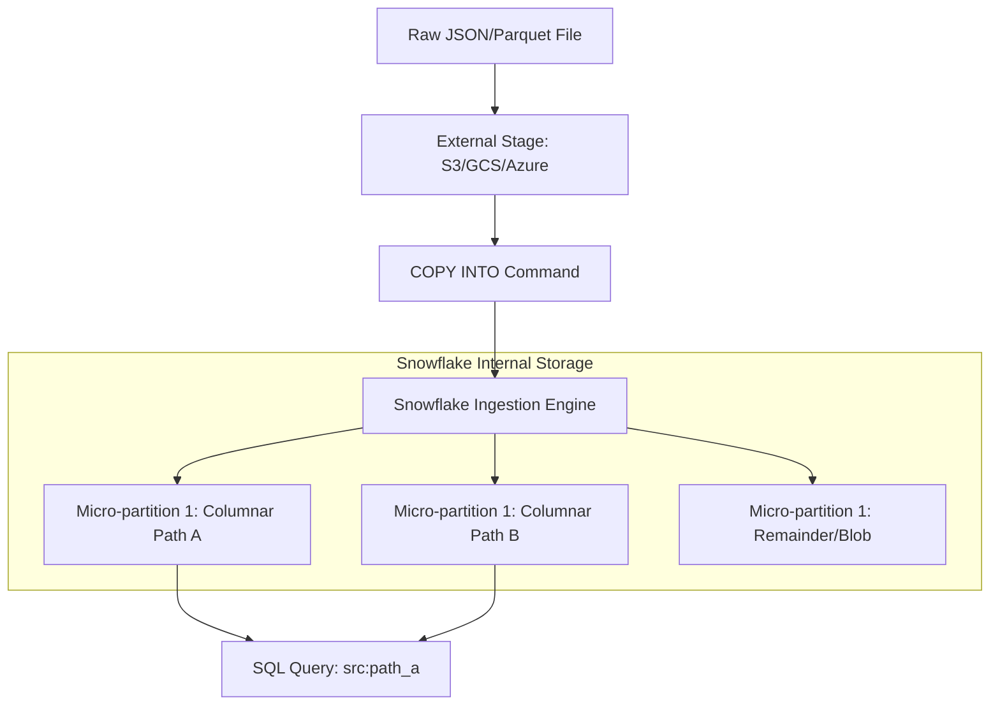

## Data Storage and Semi-Structured Data Handling

### Section at a Glance
**What you'll learn:**
- The mechanics of the Snowflake `VARIANT` data type and its role in schema-on-read.
- How Snowflake optimizes semi-structured data through internal columnarization.
- Techniques for querying and flattening nested JSON, Avro, Parquet, and ORC.
- Strategies to manage schema evolution without breaking downstream pipelines.
- Performance tuning for high-volume semi-structured data ingestion and retrieval.

**Key terms:** `VARIANT` · `LOADED_AS_IS` · `LATERAL FLATTEN` · `SCHEMA-ON-READ` · `DOT NOTATION` · `MICRO-PARTITIONS`

**TL;DR:** Snowflake allows you to store semi-structured data in its raw format using the `VARIANT` type, providing the flexibility of a NoSQL database with the performance and SQL interface of a high-end data warehouse by automatically optimizing common paths into columnar storage.

---

### Overview
In the modern data ecosystem, the "ETL tax"—the massive amount of engineering effort required to parse, flatten, and transform JSON or Avro files before they hit a warehouse—is a significant bottleneck to business agility. When a source system changes a field name or adds a new attribute, traditional rigid schemas break, leading to failed pipelines and stale dashboards.

Snowflake addresses this "schema drift" problem through a "Schema-on-Read" approach. By leveraging the `VARIANT` data type, engineers can ingest raw, nested data directly into Snowflake without prior transformation. This shifts the complexity from the ingestion phase (Write) to the analysis phase (Read), allowing data producers to move fast and data consumers to decide how to interpret the data when it is needed.

From a business perspective, this capability reduces "Time-to-Insight." Instead of waiting for a data engineering sprint to update an ETL pipeline, analysts can immediately query new data points as soon as they land in the warehouse. This section explores the technical implementation of this flexibility and how to ensure it doesn't come at the cost of query performance or cloud spend.

---

### Core Concepts

#### The `VARIANT` Data Type
The `VARIANT` type is a specialized column capable of storing any semi-structured data format (JSON, Avro, ORC, Parquet, or XML). 

> 📌 **Must Know:** When you load JSON into a `VARIANT` column, Snowflake does not just store a "blob." It internally parses the data and, if possible, extracts frequently occurring elements into their own hidden, columnar sub-structures. This is why Snowflake can query JSON almost as fast as relational data.

#### Schema-on-Read vs. Schema-on-Write
*   **Schema-on-Write (Traditional):** Requires a strictly defined table structure. Data must be transformed to match this structure before the `INSERT` or `COPY` command succeeds.
*   **Schema-on-Read (Snowflake):** Data is loaded in its native, nested structure. The structure is interpreted via SQL queries at runtime using dot notation or flattening functions.

#### Flattening Nested Structures
To transform hierarchical data into a relational format (rows and columns), Snowflake uses the `FLATTEN` function. This is often used in conjunction with `LATERAL` joins to explode arrays into individual rows.

> ⚠️ **Warning:** Using `FLATTEN` on deeply nested arrays or extremely large JSON objects can lead to massive data explosion. A single array with 1,000 elements, when flattened, generates 1,000 rows for every single row in the source table, which can exponentially increase compute costs and memory usage during the query.

#### Dot Notation and Pathing
Snowflake provides a simple syntax to traverse JSON. For a column `src_data` of type `VARIANT`, accessing a field `user_id` is as simple as `src_data:user_id`.

---

### Architecture / How It Works

The following diagram illustrates the transition from raw semi-structured files to Snowflake's optimized columnar storage.



1.  **External Stage:** The raw, unstructured files reside in your cloud object storage.
2.  **COPY INTO Command:** The command triggers the ingestion process, instructing Snowflake to parse the incoming files.

3.  **Snowflake Ingestion Engine:** The engine performs the heavy lifting of parsing the semi-structured format.
4.  **Columnarization (The Secret Sauce):** Snowflake identifies common keys within the `VARIANT` column and physically stores them in separate columns within the micro-partitions.
5.  **SQL Query:** When a user queries a specific path (e.g., `data:customer_id`), Snowflake only reads the optimized column, bypassing the heavy "blob" of the rest of the JSON.

---

### Comparison: When to Use What

| Option | Best For | Trade-offs | Approx. Cost Signal |
| :--- | :--- | :--- | :--- |
| **Relational Columns** (`INT`, `STRING`) | Known, stable, high-frequency fields. | Requires schema changes if source changes. | Lowest compute/storage cost. |
| **`VARIANT` Type** | Semi-structured data, rapidly changing schemas, or "catch-all" payloads. | Requires slightly more complex SQL (flattening/pathing). | Moderate; cost depends on parsing complexity. |
| **`OBJECT` Type** | Specifically storing key-value pairs (dictionaries). | Less flexible than `VARIANT` for arrays. | Similar to `VARIANT`. |
| **`ARRAY` Type** | Storing ordered lists of elements. | Requires `FLATTEN` to turn elements into rows. | Similar to `VARIANT`. |

**How to choose:** Use relational columns for your "core" business dimensions (Date, ID, Region) and use `VARIANT` for the "payload" or "attributes" that vary by event or source.

---

### Cost Cheat Sheet

| Scenario | Recommended Option | Key Cost Driver | Watch Out For |
| :--- | :--- | :--- | :--- |
| **High-volume IoT Telemetry** | `VARIANT` with optimized pathing | Storage of repetitive keys | Large, deeply nested arrays causing "Explosion." |
| **Standard Dimension Tables** | Native Data Types (`VARCHAR`, `NUMBER`) | Compute for parsing `VARIANT` | Using `VARIANT` where `STRING` would suffice. |
| **One-time Data Ingest (Audit)** | `VARIANT` (Raw Load) | Ingestion compute (Warehouse size) | Not cleaning/pruning data, leading to high storage. |
| **Complex JSON Transformation** | `LATERAL FLATTEN` | Virtual Warehouse (Compute) time | Over-flattening without filters. |

> 💰 **Cost Note:** The single biggest cost driver in semi-structured processing is **Data Explosion**. A query that flattens a massive array without a `WHERE` clause to limit the scope can cause a Warehouse to run for much longer than expected, as the intermediate result set grows exponentially in memory.

---

### Service & Tool Integrations

1.  **Cloud Object Storage (S3/ADLS/GCS):** The primary landing zone for raw JSON/Parquet files before they are moved into Snowflake.
2.  **Snowpipe:** Enables continuous, automated ingestion of semi-structured data as soon as files arrive in the stage.
3.  **Kafka/Confluent:** Use the Snowflake Connector for Kafka to stream semi-structured JSON events directly into `VARIANT` columns in real-time.
4.  **Data Science Tools (Python/Snowpark):** Allows practitioners to use Python libraries (like `pandas`) to programmatically navigate and manipulate the `VARIANT` structures once loaded.

---

### Security Considerations

Security in semi-structured data focuses on preventing "data leakage" through hidden nested fields.

| Control | Default State | How to Enable / Strengthen |
| :--- | :--- | :--- |
| **Encryption at Rest** | Enabled (AES-256) | Managed by Snowflake; no action required. |
| **Column-Level Security** | Open to anyone with table access | Use **Masking Policies** to redact specific keys within a `VARIANT` column. |
| **Data Masking (Nested)** | Not applicable to raw blobs | Use SQL logic to mask `src:ssn` while leaving `src:name` visible. |
| **Network Isolation** | Access via Public Internet | Implement **Network Policies** to restrict access to known IPs/VPCs. |

---

### Performance & Cost

**The Optimization Paradox:**
While Snowflake optimizes `VARIANT` columns, the efficiency of your query depends on how much you rely on the "optimized" paths vs. the "unoptimized" remainder.

**Example Scenario:**
Imagine a `VARIANT` column containing 1TB of JSON data. 
*   **Query A:** `SELECT data:user_id FROM logs;` — Snowflake reads only the optimized `user_id` column. This is lightning fast and uses minimal IO.
*   **Query B:** `SELECT * FROM logs;` — Snowflake must scan the entire 1TB blob, including all the unparsed, unoptimized parts of the JSON.

**Cost/Performance Trade-off:**
If you have a high-volume column that is frequently queried, the cost of the warehouse during the `COPY INTO` phase (to parse and optimize) is offset by the massive savings in `SELECT` performance during daily analytical workloads.

---

### Hands-On: Key Operations

First, we create a stage to hold our raw JSON files.
```sql
CREATE OR REPLACE STAGE my_json_stage;
```

Next, we create a table with a `VARIANT` column to hold the incoming JSON.
```sql
CREATE OR REPLACE TABLE raw_events (
    event_payload VARIANT,
    ingested_at TIMESTAMP DEFAULT CURRENT_TIMESTAMP()
);
```
> 💡 **Tip:** Always include an `ingested_at` or `metadata_filename` column. When debugging schema drift, you need to know exactly which file introduced the breaking change.

Now, we load the data from the stage into our table.
```sql
COPY INTO raw_latests_events
FROM @my_json_stage
FILE_FORMAT = (TYPE = 'JSON');
```

Finally, we query a nested value and flatten an array within that value.
```sql
-- This query extracts a top-level field and flattens an array of 'items'
SELECT 
    event_payload:event_id::STRING AS event_id,
    item.value:item_name::STRING AS item_name
FROM raw_events,
LATERAL FLATTEN(input => event_payload:items) item;
```
> 💡 **Tip:** Notice the `::STRING` cast. While Snowflake can infer types, explicitly casting your `VARIANT` elements to native types (e.g., `::INT`, `::DATE`) in your views prevents unexpected behavior in downstream BI tools.

---

### Customer Conversation Angles

**Q: We have a lot of schema changes in our upstream microservices. Will our Snowflake pipelines break every week?**
**A:** Not if we use `VARIANT` columns. We can ingest the data as-is, and your pipelines will remain stable. You only need to update your SQL views when you actually want to start using the new fields.

**Q: Does storing JSON in Snowflake make my queries slower than a traditional relational table?**
**A:** For the optimized fields, no. Snowflake automatically extracts common JSON paths into a columnar format. You get the flexibility of NoSQL with the performance of a warehouse.

**Q: We are worried about the cost of storing massive JSON blobs. How do we manage this?**
**A:** Snowflake uses heavy compression on `VARIANT` data. However, to optimize cost, we recommend a "Medallion Architecture": land raw data in `VARIANT` (Bronze), then use a task to flatten and move high-value fields into structured columns (Silver).

**Q: Can we use Snowflake to replace our existing Document Store (like MongoDB) for analytics?**
**A:** Yes, specifically for analytical workloads. While MongoDB is better for transactional, high-concurrency app writes, Snowflake is much more efficient for complex aggregations and cross-dataset joins on that same JSON data.

**Q: How do I ensure sensitive data like SSNs aren't visible in the JSON payload?**
**A:** We can implement Snowflake Masking Policies that use dot notation to identify and redact specific keys within the `VARIANT` column, even before the data is fully flattened.

---

### Common FAQs and Misconceptions

**Q: Is `VARIANT` just a fancy way to store `VARCHAR`?**
**A:** No. `VARCHAR` is a string of characters. `VARIANT` is a structured object that Snowflake understands, allowing for much faster access to nested elements via dot notation.
> ⚠️ **Warning:** Storing JSON as `VARCHAR` is a major anti-pattern. You lose all the automatic optimization and must use expensive string-parsing functions like `PARSE_JSON` every single time you query.

**Q: Does Snowflake flatten the JSON for me automatically?**
**A:** It optimizes the *storage* (columnarization), but it does not change the *structure*. To turn an array into rows, you must still use the `FLATTEN` function.

**Q: Can I store XML in a `VARIANT` column?**
**A:** Yes, though JSON is the most common. Snowflake's `VARIANT` supports the core structures found in most semi-structured formats.

**Q: Does the size of the JSON object affect my storage costs?**
**A:** Yes, but significantly less than you might think because of Snowflake's highly efficient compression algorithms.

**Q: If I add a new field to my JSON, do I need to run `ALTER TABLE`?**
**A:** No. This is the beauty of `VARIANT`. The new field is simply available in the payload immediately.

**Q: Is there a size limit on a single `VARIANT` value?**
**A:** Yes, there is a limit (effectively the size of a single micro-partition's capacity), but for standard JSON payloads, you are unlikely to hit this unless you are storing massive, multi-gigabyte single-object blobs.

---

### Exam & Certification Focus
*   **Data Loading (Domain: Data Movement):** Understand how `COPY INTO` interacts with `JSON` and `PARQUET` file formats.
*   **Data Transformation (Domain: Data Engineering):** Mastery of `LATERAL FLATTEN` and the ability to write SQL that navigates `VARIANT` paths.
*   **Storage Optimization (Domain: Snowflake Architecture):** Knowledge of how Snowflake's internal engine performs columnarization on `VARIANT` data.
*   **Data Types (Domain: Core Snowflake):** Deep understanding of the `VARIANT`, `OBJECT`, and `ARRAY` types and their differences. 📌 **Highest Frequency: `VARIANT` optimization and `FLATTEN` syntax.**

---

### Quick Recap
- `VARIANT` is the cornerstone of Snowflake's semi-structured data handling.
- Snowflake uses **Schema-on-Read** to provide agility against schema drift.
- The engine **automatically optimizes** common paths in `VARIANT` columns for columnar performance.
- Use `LATERAL FLATTEN` to transform nested arrays into relational rows.
- **Explicit casting** (e.g., `::STRING`) is a best practice for downstream stability.

---

### Further Reading
**Snowflake Documentation** — The definitive guide to the `VARIANT` data type and semi-structured loading.
**Snowflake Best Practices** — Expert advice on optimizing `COPY` commands for JSON/Parquet.
**Snowflake Architecture Whitepaper** — Deep dive into micro-partition storage and columnarization.
**Snowflake Data Modeling Guide** — Strategies for combining relational and semi-structured data in a single schema.
**Snowpark Developer Guide** — How to manipulate complex JSON structures using Python and DataFrames.