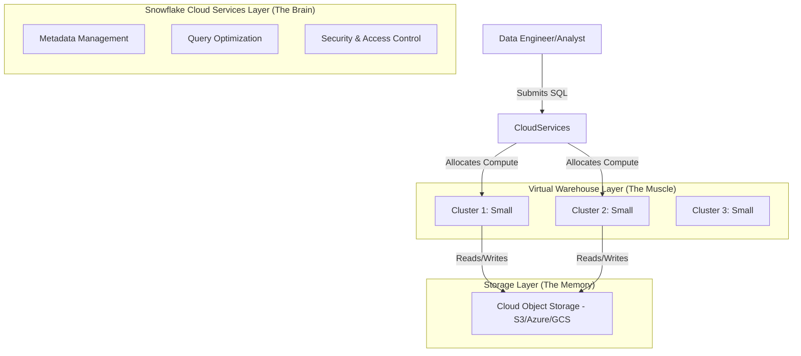

## Virtual Warehouse Management and Scaling

### Section at a Glance
**What you'll learn:**
- The fundamental difference between Scaling Up and Scaling Out.
- How to configure Auto-suspend and Auto-resume to optimize cloud spend.
- The mechanics of Multi-cluster Warehouses and concurrency management.
- How to choose the right warehouse size for specific workload profiles (ETL vs. BI).
- Strategies for preventing "Resource Contention" in shared environments.

**Key terms:** `Compute Scaling` · `Multi-cluster Warehouse` · `Auto-suspend` · `Scaling Up` · `Scaling Out` · `Concurrency`

**TL;DR:** Snowflake Virtual Warehouses are independent compute clusters that can be resized (Scaling Up) to handle complex queries or expanded (Scaling Out) to handle more users, allowing you to decouple performance from cost.

---

### Overview
In traditional on-premises data warehousing, capacity planning was a nightmare of "peak-load provisioning." To ensure the system didn't crash on Monday morning when every analyst logged in, companies had to purchase massive amounts of hardware that sat idle 90% of the time. This resulted in wasted capital and a "performance ceiling" that frustrated business users.

Snowflake solves this through the **decoupling of storage and compute**. Virtual Warehouses are the "engines" of Snowflake. Because they are independent of the data storage, you can spin up a massive engine for a heavy ETL job, shut it down immediately after, and then spin up a small, inexpensive engine for a dashboard. 

From a business perspective, this transforms IT spend from a **CAPEX (Capital Expenditure)** model—where you pay for hardware upfront—to an **OPEX (Operational Expenditure)** model—where you pay only for the seconds of compute you actually use. This flexibility allows data engineering teams to respond to business growth in real-time without waiting for procurement cycles.

---

### Core Concepts

#### 1. Scaling Up (Vertical Scaling)
Scaling Up refers to increasing the size of a single warehouse (e.g., moving from `Small` to `Large`). 
*   **Mechanism:** Increasing the number of nodes in the cluster. Each size increase (e.g., X-Small to Small) roughly doubles the compute resources (CPU, RAM, Local SSD).
*   **Use Case:** Use this for **complex, heavy-duty queries** involving massive joins, large aggregations, or massive data volumes.
*   📌 **Must Know:** Scaling Up improves the execution speed of a **single, large query** by providing more parallel processing power. It does **not** help with more users.

#### 2. Scaling Out (Horizontal Scaling / Multi-cluster Warehouses)
Scaling Out refers to adding more clusters of the *same size* to a warehouse.
*   **Mechanism:** Snowflake automatically starts additional clusters of the same size to handle incoming query load.
*   **Use Case:** Use this for **high concurrency**—when you have hundreds of users running many small, simultaneous queries (e.g., a Tableau dashboard suite).
*   ⚠️ **Warning:** Adding clusters does not make a single query run faster; it only prevents queries from queuing when many people are using the system at once.

#### 3. Auto-Suspend and Auto-Resume
These are the primary levers for cost management.
*   **Auto-suspend:** Automatically shuts down the warehouse after a period of inactivity.
*   **Auto-resume:** Automatically restarts the warehouse the moment a new query is submitted.
*   💰 **Cost Note:** A warehouse that is "running" is consuming credits, even if it is not executing a single line of SQL. Always set an aggressive `AUTO_SUSPEND` for non-production workloads.

#### 4. Multi-cluster Warehouse Modes
When configuring Multi-cluster warehouses, you must choose a scaling policy:
*   **Standard:** Focuses on minimizing queuing. It starts clusters as soon as it detects pending queries.
*   **Economy:** Focuses on cost savings. It waits to see if the load persists before spinning up a new cluster, allowing the system to "pack" queries into existing clusters.

---

### Architecture / How It Works



1.  **Cloud Services Layer:** Acts as the entry point, managing the "brain" functions like parsing SQL and deciding which warehouse will execute it.
2.  **Virtual Warehouse Layer:** The independent compute clusters that perform the actual heavy lifting of data processing.
3.  **Storage Layer:** The persistent, centralized layer where the actual data resides, accessible by all warehouses simultaneously.

---


### Comparison: When to Use What

| Option | Best For | Trade-offs | Approx. Cost Signal |
| :--- | :--- | :--- | :--- |
| **Scaling Up (Bigger Size)** | Large, complex ETL/ELT; massive joins. | Does not increase concurrency; higher cost per second. | 2x cost per size increase. |
| **Scaling Out (Multi-cluster)** | High concurrency; many simultaneous users/dashboards. | Does not speed up single large queries. | Linear increase based on cluster count. |
| **Single Small Warehouse** | Simple data ingestion; low-priority ad-hoc analysis. | High risk of queuing during peak periods. | Lowest, most predictable cost. |

**How to choose:** If your users are complaining that "the dashboard is slow," you likely need to **Scale Up**. If your users are complaining that "the dashboard is stuck/queued," you need to **Scale Out**.

---

### Cost Cheat Sheet

| Scenario | Recommended Option | Key Cost Driver | Watch Out For |
| :--- | :--- | :--- | :--- |
| **Nightly ETL Pipeline** | Large Warehouse + Short Auto-suspend | Warehouse Size | Leaving `AUTO_SUSPEND` at a high value. |
| **Business Intelligence (BI) Dashboards** | Multi-cluster (Standard) | Number of Clusters | "Spiky" usage patterns triggering unnecessary clusters. |
| **Ad-hoc Data Science Research** | X-Small Warehouse | Duration of use | Long-running "zombie" queries that keep the WH active. |
| **Dev/Test Environments** | X-Small + 1-min Auto-suspend | Idle time | Forgetting to shut down after testing. |

> 💰 **Cost Note:** The single biggest cost mistake is setting `AUTO_SUSPEND` to a very long duration (e.g., 1 hour) for a warehouse used only for intermittent tasks. This results in paying for 59 minutes of "idling" every time a task finishes.

---

### Service & Tool Integrations

1.  **BI Tools (Tableau, Looker, PowerBI):**
    *   Connect these tools to a dedicated **Multi-cluster Warehouse**.
    *   This prevents user-driven analytical queries from competing with backend ETL processes.
2.  **ETL/ELT Tools (dbt, Fivetran, Matillion):**
    *   Use a dedicated **Large/X-Large Warehouse** for heavy transformations.
    *   Set high `AUTO_SUSPEND` thresholds to ensure the warehouse doesn't die mid-batch.
3.  **Snowpark / Python:**
    *   When running heavy Python logic, use a larger Warehouse (Scaling Up) to provide the necessary RAM and CPU for the Python runtime.

---

### Security Considerations

Access to warehouses must be strictly controlled to prevent "Resource Exhaustion" attacks (where a user runs a massive query that drains the company budget).

| Control | Default State | How to Enable / Strengthen |
| :--- | :--- | :--- |
| **Warehouse Usage (RBAC)** | `PUBLIC` role can use any WH. | Revoke `USAGE` from `PUBLIC`; grant only to specific functional roles. |
| **Query Timeout** | No strict limit by default. | Set `STATEMENT_TIMEOUT_IN_SECONDS` at the warehouse level. |
| **Network Isolation** | Accessible via Snowflake URL. | Use **Network Policies** to restrict warehouse access to known IP ranges. |

---

### Performance & Cost

**Tuning Guidance:**
*   **Monitor the `QUERY_LOAD_HISTORY`:** If you see a high `QUEUED_PROVISIONING_TIME`, your warehouses are struggling to spin up. If you see `QUEUED_OVERLOAD_TIME`, your warehouse is physically too small for the concurrent load.
*   **The "Goldilocks" Rule:** Don't start with a 2X-Large. Start with an X-Small. Only scale up when you see "Spilling to Remote Storage" in the Query Profile (which indicates the warehouse ran out of local RAM).

**Example Cost Scenario:**
*   **Scenario:** An ETL job runs for 2 hours every night using a `Large` warehouse (8 credits/hour).
*   **Cost A (No Auto-suspend):** Warehouse stays on 24/7. $8 \text{ credits} \times 24 \text{ hours} = 192 \text{ credits/day}$.
*   **Cost B (With 5-min Auto-suspend):** Warehouse runs 2 hours + 5 mins buffer. $2.08 \text{ hours} \times 8 \text{ credits} \approx 16.6 \text{ credits/day}$.
*   **Savings:** ~91% reduction in daily spend.

---

### Hands-On: Key Operations

Create a warehouse optimized for BI workloads with auto-scaling capabilities.
```sql
CREATE WAREHOUSE bi_analytics_wh
  WITH WAREHOUSE_SIZE = 'MEDIUM'
  AUTO_SUSPEND = 60 -- Shut down after 60 seconds of inactivity
  AUTO_RESUME = TRUE
  MIN_CLUSTER_COUNT = 1
  MAX_CLUSTER_COUNT = 5 -- Allow scaling out up to 5 clusters
  SCALING_POLICY = 'ECONOMY';
```
> 💡 **Tip:** Using `ECONOMY` scaling policy is excellent for BI workloads where you want to save money by waiting for a "sustained" load before adding clusters.

Resize an existing warehouse to handle a heavy end-of-month processing task.
```sql
ALTER WAREHOUSE etl_warehouse SET WAREHOUSE_SIZE = 'XLARGE';
```
> ⚠️ **Warning:** Changing the size of a warehouse is an "online" operation, but it can cause a momentary pause in query processing as the new nodes are provisioned.

---

### Customer Conversation Angles

**Q: "We have 50 analysts hitting the warehouse at once. Should we move to a larger warehouse size?"**
**A:** "If they are all running simple queries and seeing delays, we should actually look at a Multi-cluster warehouse to scale *out* rather than scaling *up*."

**Q: "How do I stop my developers from accidentally running up a $10,000 bill in one night?"**
**A:** "We can implement two layers of protection: strictly enforcing `AUTO_SUSPEND` and setting `STATEMENT_TIMEOUT_IN_SECONDS` to kill runaway queries automatically."

**Q: "Does scaling up a warehouse affect the data stored in Snowflake?"**
**A:** "Not at all. The data lives in a persistent storage layer; the warehouse is just the temporary compute engine we use to process it."

**Q: "If I scale up my warehouse mid-day, will my current running queries fail?"**
**A:** "Snowflake handles this gracefully; however, the query currently running will finish on the old cluster, and new queries will begin using the new, larger cluster."

**Q: "Is it cheaper to use one giant warehouse for everything or multiple small ones?"**
**A:** "It is almost always cheaper and more efficient to use dedicated warehouses for different workloads (e.g., one for ETL, one for BI) to prevent resource contention and control costs."

---

### Common FAQs and Misconceptions

**Q: Does a larger warehouse size make data loading faster?**
**A:** Only if the data can be processed in parallel. If you are loading a single, non-splittable file, a larger warehouse won't help.

**Q: Can I use the same warehouse for both ETL and BI?**
**A:** You *can*, but it's a bad practice. ⚠️ **Warning:** A heavy ETL job could consume all the CPU/RAM, causing the BI dashboards to queue and appear "broken" to executives.

**Q: Does 'Auto-resume' cost money?**
**A:** Only when the warehouse is actually running and executing queries or idling after a resume.

**Q: Does 'Scaling Out' increase the cost per hour of a single cluster?**
**A:** No, it increases the *total* cost because you are paying for additional clusters.

**Q: Can I resize a warehouse while a query is running?**
**A:** Yes, Snowflake manages the transition, though there is a brief moment of reconfiguration.

**Q: If I use a 'Small' warehouse, is it always 2x cheaper than 'Medium'?**
**A:** In terms of credit consumption per hour, yes. However, if the 'Small' warehouse takes twice as long to finish the job, the total cost remains the same.

---

### Exam & Certification Focus

*   **Scaling Up vs. Scaling Out (Domain: Snowflake Architecture):** 📌 **High Frequency.** You must distinguish between "improving single query speed" and "improving concurrency."
*   **Warehouse Sizes and Credits (Domain: Cost Management):** Know that each size increase roughly doubles the credit consumption per hour.
*   **Auto-suspend/Resume (Domain: Snowflake Operations):** Understand how these settings impact the billing cycle.
*   **Multi-cluster Scaling Policies (Domain: Snowflake Architecture):** Understand the difference between `Standard` (performance-focused) and `Economy` (cost-focused) policies.

---

### Quick Recap
- **Scaling Up** = More power for a single query (Vertical).
- **Scaling Out** = More clusters for more users (Horizontal).
- **Auto-suspend** is your most important tool for cost control.
- **Decoupled Architecture** allows you to scale compute without moving data.
- **Workload Isolation** (using separate warehouses for ETL and BI) is a fundamental best practice.

---

### Further Reading
**[Snowflake Documentation]** — Virtual Warehouse Sizing and Scaling.
**[Snowflake Documentation]** — Multi-cluster Warehouse Scaling Policies.
**[Snowflake Whitepaper]** — Snowflake Architecture and the separation of storage/compute.
**[Snowflake Documentation]** — Managing Warehouse Usage and Cost.
**[Snowflake Documentation]** — Query Profile and Performance Tuning.