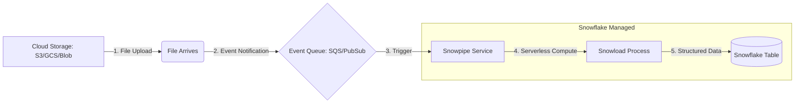

## Data Ingestion Techniques and Snowpipe

### Section at a Glance
**What you'll learn:**
- The fundamental difference between bulk loading and continuous ingestion.
- How to configure and manage External and Internal Stages.
- The architecture and mechanics of Snowpipe for automated, serverless ingestion.
- Strategies for optimizing file sizes and formats for ingestion performance.
- Security best practices using Storage Integrations to eliminate credential leakage.

**Key terms:** `COPY INTO` · `Snowpipe` · `Stage` · `File Format` · `Storage Integration` · `Auto-ingest`

**TL;DR:** Data ingestion in Snowflake is categorized into two primary patterns: **Bulk Loading** (using `COPY INTO` with a user-managed Virtual Warehouse) for large, periodic datasets, and **Continuous Loading** (using Snowpipe) for near real-time, micro-batching via a serverless compute model.

---

### Overview
In the modern data estate, data rarely resides where it is first created. It is captured by IoT sensors, exported from ERP systems, or dumped by application logs into cloud object storage like Amazon S3, Google Cloud Storage, or Azure Blob Storage. The fundamental business problem is "data latency": the gap between when an event occurs and when it is available for decision-making.

For a business, ingestion techniques represent a trade-off between **cost** and **freshness**. A retailer performing nightly inventory reconciliations does not need real-time streaming; a massive `COPY` command during off-hours is cost-effective. However, a fraud detection system requires data to be available within seconds. This is where Snowpipe enters the architectural conversation.

This section moves beyond "how to move data" and explores "how to architect movement." We will examine how to leverage Snowflake’s separation of storage and compute to build ingestion pipelines that are scalable, secure, and cost-optimized, ensuring that your data platform provides a "single source of truth" that is as timely as it is accurate.

---

### Core Concepts

#### 1. Bulk Loading with `COPY INTO`
The `COPY INTO <table_name>` command is the workhorse of Snowflake ingestion. It is a declarative command that pulls data from a **Stage** (a pointer to a file location) into a target table.
*   **Compute Model:** Uses a user-managed **Virtual Warehouse**. You pay for the time the warehouse is running.
*   **Pattern:** Best suited for periodic, high-volume batches (e.g., every 4 hours, once a day).
*   **Transformation:** Can perform basic transformations (reordering columns, casting types) during the load process.

> ⚠️ **Warning:** If you use a `COPY` command on a large dataset using a Small warehouse, you may encounter "spilling" to local or remote disk, significantly slowing down the load and increasing costs.

#### 2. Continuous Ingestion with Snowpipe
Snowpipe is Snowflake's serverless ingestion service. It automates the loading of data as soon as files arrive in a stage.
*   **Compute Model:** **Serverless**. Snowflake manages the compute resources. You do not need an active Virtual Warehouse.
*   
> 📌 **Must Know:** Snowpipe does **not** use your Virtual Warehouse. It uses Snowflake-managed resources. This means you don't have to worry about managing warehouse scaling, but you are billed based on the overhead of the compute used to ingest the files.

#### 3. Stages: The Landing Zone
A **Stage** is a structural object in Snowflake that represents a location where data files are stored.
*   **Internal Stages:** Files are stored within Snowflake's managed storage.
*   **External Stages:** Files reside in your cloud provider's bucket (S3, GCS, Azure).
*   **File Formats:** An object that defines the structure of the data (e.g., CSV, JSON, Parquet, Avro, ORC, XML).

#### 4. The Auto-Ingest Mechanism
For Snowpipe to be truly "continuous," it needs to know when a new file has arrived. This is achieved via **Event Notifications**:
*   **AWS:** S3 Event Notifications $\rightarrow$ SQS (Simple Queue Service) $\rightarrow$ Snowpipe.
*   **Azure:** Azure Event Grid $\rightarrow$ Storage Queue $\rightarrow$ Snowpipe.
*   **GCS:** Pub/Sub $\rightarrow$ Snowpipe.

---

### Architecture / How It Works



1.  **Cloud Storage:** The source of truth where raw files (CSV, JSON, etc.) are dropped.
2.  **Event Notification:** A cloud-native trigger (like AWS SQS) that notifies Snowflake of a new file.
3.  **Snowpipe Service:** The serverless orchestration engine that listens to the queue.
4.  **Load Process:** The compute resource that parses the file and executes the `COPY` logic.
5.  **Snowflake Table:** The final destination where data is structured and queryable.

---

### Comparison: When to Use What

| Option | Best For | Trade-offs | Approx. Cost Signal |
| :--- | :--- | :--- | :--- |
| **`COPY INTO` (Bulk)** | Large, scheduled batches (Daily/Hourly) | High latency; requires managing a Warehouse. | Warehouse Credits (per second). |
| **Snowpipe (Continuous)** | Micro-batches; near real-time data | Higher complexity to set up (SQS/SNS); files must be small. | Serverless overhead (per file/volume). |
| **Snowflake Connector (Kafka)** | High-velocity streaming data | Requires managing Kafka infrastructure/clusters. | Kafka Cluster costs + Snowflake Compute. |

**How to choose:** If your business requirement is "data must be available within 5 minutes," choose **Snowpipe**. If your requirement is "we need the report ready by 8:00 AM," choose **Bulk Loading**.

---

### Cost Cheat Sheet

| Scenario | Recommended Option | Key Cost Driver | Watch Out For |
| :--- | :--- | :--- | :--- |
| **Large Daily Bulk Load** | `COPY INTO` | Warehouse Size & Duration | Keeping a warehouse running just for a 2-minute load. |
| **Frequent Small Files (100/min)** | **Avoid Snowpipe** | Per-file overhead/metadata | "Small file problem": High cost due to overhead per file. |
  | **High-Volume Continuous Stream** | Snowpipe | Total volume of data processed | Massive amounts of tiny files can inflate serverless costs. |
| **Occasional Data Dumps** | `COPY INTO` | Data Volume | Inefficient file formats (e.g., uncompressed CSV). |

> 💰 **Cost Note:** The single biggest cost mistake in Snowpipe is the **"Small File Problem."** Ingesting thousands of 10KB files is significantly more expensive than ingesting one 100MB file because Snowflake must manage the metadata and compute overhead for every single file arrival. Aim for file sizes between 100MB and 250MB for optimal efficiency.

---

### Service & Tool Integrations

1.  **Cloud Infrastructure (IAM/IAM Roles):**
    *   Use **Storage Integrations** to allow Snowflake to access S3/GCS without passing secret keys in SQL.
    *   This pattern uses an IAM Role with a trust relationship between your Cloud Provider and Snowflake.

2.  **Messaging Queues (SQS/Pub-Sub):**
    *   Integrates with Snowpipe to provide the "trigger" mechanism.
    *   Essential for automating the transition from "File Uploaded" to "Data Loaded."

3.  **Data Orchestration (Airflow/dbt):**
    *   Use Airflow to trigger `COPY INTO` commands for complex, multi-stage ETL pipelines.
    *   Use dbt to transform the raw data landed by Snowpipe into analytics-ready models.

---

### Security Considerations

The primary security risk in ingestion is **Credential Exposure**. Never use hardcoded AWS Secret Keys in your `CREATE STAGE` statements.

| Control | Default State | How to Enable / Strengthen |
| :--- | :--- | :--- |
| **Authentication** | Credentials in SQL (Insecure) | Use **Storage Integrations** (IAM Role-based). |
| **Encryption in Transit** | Standard TLS | Enforced by Snowflake/Cloud Provider. |
| **Encryption at Rest** | AES-256 | Managed by Snowflake (Tri-Secret Secure for extra layer). |
| **Network Isolation** | Public Internet Access | Use **Network Policies** to restrict access to specific IPs. |

---

### Performance & Cost

**The Golden Rule of Ingestion:** File size matters more than file count.

**Performance Bottlenecks:**
*   **Small Files:** As noted, too many small files cause high metadata overhead in Snowpipe.
*   **Complex Regex/Parsing:** Using complex transformations within the `COPY` command increases compute time.
*   **Uncompressed Data:** Larger file transfers take longer and increase network costs.

**Example Cost Scenario:**
*   **Scenario A (Inefficient):** 10,000 files of 10KB each arriving every hour via Snowpipe.
    *   *Result:* High Snowpipe overhead due to 10,000 individual file processing events.
*   **Scenario B (Optimized):** 10 files of 10MB each arriving every hour via Snowpipe.
    *   *Result:* Significantly lower cost; the same volume of data is processed with 1,000x less metadata management.

---

### Hands-On: Key Operations

**1. Create a Storage Integration (The Secure Way)**
This allows Snowflake to access your S3 bucket using an IAM Role instead of keys.
```sql
CREATE STORAGE INTEGRATION s3_int
  TYPE = EXTERNAL_STAGE
  STORAGE_PROVIDER = 'S3'
  ENABLED = TRUE
  STORAGE_ALLOWED_LOCATIONS = ('s3://my-company-data-bucket/landing/');
```
> 💡 **Tip:** After running this, run `DESC STORAGE INTEGRATION s3_int;` to get the `STORAGE_AWS_IAM_USER_ARN`. You must add this ARN to your AWS IAM Role's Trust Policy.

**2. Create an External Stage**
This defines the location and format of the source data.
```sql
CREATE STAGE my_external_stage
  URL = 's3://my-company-data-bucket/landing/'
  STORAGE_INTEGRATION = s3_int
  FILE_FORMAT = (TYPE = 'PARQUET');
```

**3. Create a Snowpipe for Continuous Loading**
This creates the pipe and tells it which stage to monitor.
```sql
CREATE PIPE my_snowpipe AS
  COPY INTO my_target_table
  FROM @my_external_stage
  FILE_FORMAT = (TYPE = 'PARQUET');
```

---

### Customer Conversation Angles

**Q: "We have a lot of small JSON files arriving every minute. Will Snowpipe work for us?"**
**A:** "Snowpipe is perfect for the 'near real-time' requirement, but we should look at your file sizing. If the files are tiny, we might incur higher overhead costs. I'd recommend a pre-processing step to batch those small files into larger chunks before they hit the bucket."

**Q: "How do I know if a file failed to load in Snowpipe?"**
**A:** "You can monitor the `SNOWPIPE_ERROR_HISTORY` view. It provides details on which files failed and the specific error message returned by the loading engine."

**Q: "Does Snowpipe require me to keep a warehouse running 24/7?"**
**A:** "No, that is one of the biggest advantages. Snowpipe is serverless, meaning Snowflake manages the compute. You only pay for the actual resources used to process the files, not for idle time."

**Q: "Is it safe to put my AWS Access Keys directly into my Snowflake scripts?"**
**A:** "It's highly discouraged. We recommend using a Storage Integration. This uses IAM roles to establish a trust relationship, which is much more secure and easier to rotate than managing static keys."

**Q: "Can I use Snowpipe to transform data, or should I do that later?"**
**A:** "You can perform basic transformations like column reordering or casting during the pipe execution, but for complex business logic, the best practice is to land the 'raw' data first and use a tool like dbt for downstream transformations."

---

### Common FAQs and Misconceptions

**Q: Does Snowpipe use my existing Virtual Warehouse?**
**A:** No. ⚠️ **Warning:** Many engineers mistakenly try to monitor their owned warehouses to track Snowpipe activity. Snowpipe uses its own serverless compute.

**Q: Can I use `COPY INTO` and Snowpipe on the same table simultaneously?**
**A:** Yes, but be careful with overlapping files. Snowflake tracks loaded files via metadata to prevent duplicates, but managing two different ingestion paths into one table can lead to complex debugging.

**Q: Does Snowpipe support CSV files?**
**A:** Yes, absolutely. It supports all standard Snowflake-supported formats (CSV, JSON, Parquet, etc.).

**Q: How do I trigger Snowpipe if I'm not using S3/GCS/Azure?**
**A:** Snowpipe's "auto-ingest" relies on cloud-native event notifications (like SQS). If you are loading from a custom source, you would likely use a `COPY INTO` command triggered by an external orchestrator like Airflow.

**Q: Is there a limit to how much data Snowpipe can ingest?**
**A:** There is no specific throughput limit, but the architecture is optimized for micro-batches. The bottleneck is usually the frequency and size of files, not the service itself.

**Q: Can Snowpipe handle schema changes?**
**A:** It can, provided you have configured **Schema Evolution** on your target table. ⚠️ **Warning:** Without Schema Evolution enabled, a change in the source file structure (like a new column) will cause the pipe to fail.

---

### Exam & Certification Focus

*   **Identify Ingestion Types:** Distinguish between `COPY` (Warehouse-based) and `Snowpipe` (Serverless). 📌 **High Frequency**
*   **Compute Models:** Understand that Snowpipe does **not** require a user-managed warehouse.
*   **Security:** Understand the use of **Storage Integrations** to avoid credential management. 📌 **High Frequency**
*   **Architecture:** Knowledge of the flow from Cloud Storage $\rightarrow$ Event Queue $\rightarrow$ Snowpipe.
*   **Stage Types:** Difference between Internal and External stages.

---

### Quick Recap
- **Bulk Loading (`COPY INTO`)** is for scheduled, large-scale data movement using your own Warehouse.
- **Snowpipe** is for continuous, near real-time ingestion using Snowflake's serverless compute.
- **Storage Integrations** are the best practice for secure, keyless access to cloud storage.
- **The "Small File Problem"** is a major cost driver; aim for larger, more efficient files.
- **Event Notifications** (SQS/Pub-Sub) are the "engine" that makes Snowpipe automated.

---

### Further Reading
**Snowflake Documentation** — Deep dive into `COPY INTO` syntax and error handling.
**Snowflake Documentation** — Comprehensive guide on Snowpipe and Auto-ingest setup.
**Snowflake Whitepaper** — Best practices for data ingestion and performance tuning.
**AWS Documentation** — Setting up S3 Event Notifications for SQS.
**Snowflake Documentation** — Detailed breakdown of Storage Integrations and IAM roles.