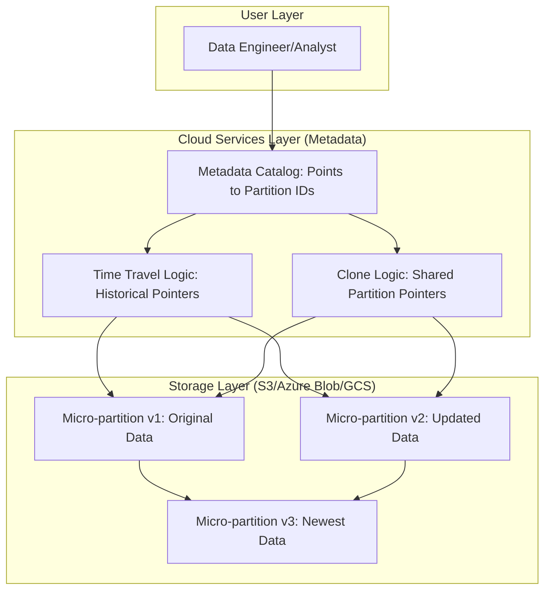

## Time Travel, Fail-safe, and Zero-Copy Cloning

### Section at a Glance
**What you'll learn:**
- How to leverage **Time Travel** to recover from accidental `DROP` or `DELETE` operations.
- The mechanics of **Fail-safe** and its role in disaster recovery.
- How to implement **Zero-Copy Cloning** to create instant, cost-effective Dev/Test environments.
- The architectural relationship between micro-partitions and data retention.
- Strategies to manage storage costs associated with extended retention periods.

**Key terms:** `Time Travel` · `Fail-safe` · `Zero-Copy Cloning` · `Micro-partition` · `Retention Period` · `Metadata`

**TL;DR:** Snowflake provides built-in data protection and agility through features that allow you to query historical data, recover from catastrophic loss via support, and duplicate massive datasets instantly without duplicating physical storage.

---

### Overview
In a modern data-driven enterprise, the "Human Error" factor is one of the highest-impact risks to data integrity. A developer running a `DELETE` statement without a `WHERE` clause or an automated pipeline dropping a production schema can result in massive operational downtime and significant financial loss. 

Traditionally, solving this required complex, manual backup-and-restore orchestration, often involving expensive storage overhead and long Recovery Time Objectives (MTTR). Snowflake addresses this pain point natively through its unique architecture. By leveraging the immutability of micro-partitions, Snowflake allows you to "look back" in time, providing an automated safety net that functions without manual intervention.

Beyond protection, these features drive business agility. **Zero-Copy Cloning** allows organizations to move from a slow, "copy-paste" development lifecycle to an instantaneous "clone-and-test" model. This enables Data Engineers to spin up production-grade testing environments in seconds, significantly accelerating the CI/CD pipeline and reducing the cost of experimentation.

---

### Core Concepts

#### 1. Time Travel
Time Travel allows you to access data that has been changed or deleted within a defined window. It works by preserving older versions of **micro-partitions** that have not yet been overwritten by newer data.

*   **Retention Period:** The duration for which historical data is accessible. 
    *   **Standard Edition:** 0 to 1 day.
    *   **Enterprise Edition (and higher):** 0 to 90 days.
*   **Mechanics:** You can query data using the `AT` or `BEFORE` clauses, referencing a specific `TIMESTAMP`, `OFFSET` (seconds ago), or `STATEMENT_ID`.
*   ⚠️ **Warning:** Increasing the Time Travel retention period directly increases your storage costs, as Snowflake must retain older micro-partitions to satisfy the retention window.

#### 2. Fail-safe
Fail-safe is a non-configurable, 7-day period of data retention that begins *after* the Time Travel period expires. 

*   **Purpose:** It serves as a final "safety net" for catastrophic data loss (e.g., account-level disasters).
*   **Access:** Unlike Time Travel, **users cannot query Fail-safe data.** Accessing this data requires a formal request to Snowflake Support and may involve significant manual effort and cost.
*   📌 **Must Know:** Fail-safe is a "last resort" feature. It is not a substitute for a proper data recovery strategy or Time Travel.

#### 3. Zero-Copy Cloning
Cloning allows you to create a copy of a table, schema, or an entire database. 

*   **Metadata-only operation:** When you clone, Snowflake does not move or copy any actual data. Instead, it creates new metadata pointers to the existing micro-partitions.
*   **Efficiency:** Because it only manipulates metadata, cloning a 100TB table is as fast as cloning a 10MB table.
*   💰 **Cost Note:** Cloning is "free" at the moment of creation. You only incur additional costs when data in the clone *differs* from the source (i.e., when you update or delete data in the clone, new micro-partitions are created and stored).

---

### Architecture / How It Works

The following diagram illustrates how Snowflake manages different versions of data through the Cloud Services layer.



1.  **User Layer:** The entry point where SQL queries are issued.
2.  **Cloud Services Layer:** The "brain" that manages metadata, tracks which micro-partitions belong to which version of a table, and facilitates the logic for cloning or time-traveling.
3.  **Storage Layer:** The physical persistence of immutable micro-partitions; it holds the actual data blocks that are shared across Time Travel, Fail-safe, and Clones.

---

### Comparison: When to Use What

| Feature | Best For | Trade-offs | Approx. Cost Signal |
| :--- | :--- | :--- | :--- |
| **Time Travel** | Accidental `DELETE`/`UPDATE` recovery; auditing changes. | Limited window (max 90 days); higher storage cost if retention is high. | Increased storage cost for retained partitions. |
| **Fail-safe** | Extreme disaster recovery (e.g., account corruption). | No user access; requires Snowflake Support intervention. | Managed by Snowflake; part of storage overhead. |
  | **Zero-Copy Cloning** | Creating Dev/Test environments; creating "snapshots" for reporting. | Metadata-only, but changes in the clone create new storage costs. |

**How to choose:** Use **Time Travel** for day-to-day operational errors. Use **Cloning** when you need to isolate a workload (like testing) without duplicating the cost of the data. Use **Fail-safe** only as a theoretical "insurance policy."

---

### Cost Cheat Sheet

| Scenario | Recommended Option | Key Cost Driver | Watch Out For |
| :--- | :--- | :--- | :--- |
| **Frequent Table Drops** | Time Travel (Set to 7-14 days) | Number of changed micro-partitions retained. | High churn + high retention = storage spike. |
| **Creating Dev/Test Lab** | Zero-Copy Cloning | Data modification (DML) within the clone. | If you "rebuild" the clone daily, costs stay low; if you "transform" it, costs rise. |
  | **Long-term Auditing** | Snapshotting via Cloning | Cumulative storage of all snapshots. | ⚠️ **Warning:** Don't use clones for permanent archival; use them for point-in-time snapshots. |
  | **Recovering 1-year old data** | Fail-safe (via Support) | Snowflake Support service fees. | 💰 **Cost Note:** This is the most expensive and slowest way to recover data. |

> 💰 **Cost Note:** The single biggest cost mistake in Snowflake is setting a high `DATA_RETENTION_TIME_IN_DAYS` on tables that undergo massive, frequent `UPDATE` or `DELETE` operations. This causes a "storage explosion" because every change creates a new version of the micro-partition that must be kept for the full retention period.

---

### Service & Tool Integrations

1.  **CI/CD Pipelines (e.g., Jenkins, GitHub Actions):**
    *   Automate the creation of a Clone of your Production schema into a "Staging" schema.
    *   Run integration tests against the clone to ensure code changes don't break existing logic.
2.  **Data Observability Tools (e.g., Monte Carlo, dbt Cloud):**
    *   Use Time Travel to compare the state of a table "Before" and "After" a massive data load to detect anomalies in volume or schema.
3.  **Backup/DR Orchestration:**
    *   Use `UNDROP` commands in automated scripts to immediately restore dropped objects as part of an automated incident response workflow.

---

### Security Considerations

While these features provide data availability, they also impact the security and compliance posture of your data.

| Control | Default State | How to Enable / Strengthen |
| :--- | :--- | :--- |
| **Access to Clones** | Inherited from Source | Ensure clones are subject to the same `GRANT` and `MASKING POLICY` audits as the source. |
| **Data Deletion (Permanent)**| Retained for Time Travel | Use `PURGE` or `DROP` with the understanding that data persists in the retention window. |
  | **Audit Logging** | Enabled (via `QUERY_HISTORY`) | Monitor `QUERY_HISTORY` to see who is querying historical data via `AT` clauses. |

---

### Performance & Cost

**Performance:** 
*   **Cloning is instantaneous.** There is zero performance penalty for creating a clone, regardless of size.
*   **Querying Time Travel** can be slower if the `OFFSET` is large, as the engine must reconstruct the state of the table by traversing multiple historical micro-partitions.

**Cost Scenario Example:**
Imagine you have a **10 TB** production table.
*   **Scenario A (Traditional):** You want to create a Dev environment. You run `CREATE TABLE dev_table AS SELECT * FROM prod_table`. 
    *   **Cost:** You immediately pay for **10 TB of additional storage**.
*   **Scenario B (Snowflake):** You run `CREATE TABLE dev_table CLONE prod_table`.
    *   **Cost:** You pay **$0 extra** for storage at the moment of creation. You only pay when your developers start running `UPDATE` statements in the `dev_table`.

---

### Hands-On: Key Operations

**1. Cloning a database for testing**
This creates an instant, zero-cost copy of the production database for a developer to use.
```sql
-- Create a clone of the production database
CREATE DATABASE prod_db_test CLONE prod_db;
```
> 💡 **Tip:** Always use cloning for testing instead of copying data to ensure your test environment is an exact structural replica of production.

**2. Querying a table as it existed 1 hour ago**
Use this if a scheduled task accidentally corrupted a table.
```sql
-- Query the table using an offset of 3600 seconds (1 hour)
SELECT * FROM my_table AT(OFFSET => -3600);
```

**3. Recovering a dropped table**
The most critical command for rapid incident response.
```sql
-- Restore the table that was accidentally dropped
UNDROP TABLE critical_orders_table;
```
> ⚠️ **Warning:** `UNDROP` only works if the table is still within its Time Travel retention period. If it has expired, you must contact Snowflake Support for Fail-safe recovery.

---

### Customer Conversation Angles

**Q: "How much extra will it cost me to have a 90-day recovery window for all my tables?"**
**A:** It depends on your data churn; you only pay for the additional micro-partitions created by updates/deletes that stay within that 90-day window, not for the size of the original table.

**Q: "If I clone a 5TB table, am I paying for 10TB of storage immediately?"**
**A:** No, you are only paying for the original 5TB; the clone uses the same underlying storage blocks as the source.

**Q: "Can we use Zero-Copy Cloning to move data from Production to a different Cloud Region?"**
**A:** No, cloning is limited to the same Snowflake account and region; for cross-region movement, you would use Database Replication.

**Q: "Is there any way to bypass the 7-day Fail-safe period if we need data from 30 days ago?"**
**A:** No, once the Time Travel period expires, only Snowflake Support can attempt a recovery from Fail-safe, and it is not a guaranteed service-level agreement (SLA).

**Q: "If I delete data in my Clone, does it delete the data in the Production table?"**
**A:** No, the Production table remains untouched; however, the "shared" micro-partitions are no longer shared, and you will begin paying for the new, modified partitions in the clone.

---

### Common FAQs and Misconceptions

**Q: Does Cloning create a full copy of the data?**
**A:** No. It only creates new metadata. ⚠️ **Warning:** Thinking a clone is a "backup" is a mistake; it is a pointer to existing data.

**Q: Can I use Time Travel to see data that was deleted 2 years ago?**
**A:** No. Once the Time Travel period (max 90 days) and the Fail-safe period (7 days) have passed, the data is physically purged.

**Q: Does the `UNDROP` command work for a whole database?**
**A:** Yes, `UNDROP DATABASE` works exactly like `UNDROP TABLE`.

**Q: If I change the retention period on a table, does it affect existing data?**
**A:** It only affects the retention of data changes occurring *after* the change is applied.

**Q: Is Zero-Copy Cloning useful for Backups?**
**A:** It is useful for "snapshots," but it is not a true backup because it relies on the survival of the original micro-partitions.

**Q: Does Fail-safe cost me money?**
**A:** Yes, implicitly. You pay for the storage of the micro-partitions that reside in the Fail-safe period.

---

### Exam & Certification Focus
*   **Domain: Data Protection & Recovery** 📌 **High Frequency**
    *   Understand the difference between **Time Travel** (user-accessible) and **Fail-safe** (Support-only).
    *   Know the maximum retention period for **Enterprise Edition** (90 days).
    *   Identify that **Zero-Copy Cloning** does not duplicate physical data.
*   **Domain: Storage & Cost Management**
    *   Be able to explain why high-churn tables increase storage costs when using high Time Travel retention.
    *   Recognant that cloning only incurs costs when data in the clone is modified.

---

### Quick Recap
- **Time Travel** allows querying historical data (up to 90 days on Enterprise).
- **Fail-safe** is a 7-day, non-configurable safety net managed by Snowflake.
- **Zero-Copy Cloning** is an instantaneous, metadata-only operation for creating copies.
- **Storage Costs** are driven by the retention of changed micro-partitions, not just the total table size.
- **Data Integrity** is maintained by the immutability of micro-partitions.

---

### Further Reading
**Snowflake Documentation** — Deep dive into Time Travel syntax and configuration.
**Snowflake Documentation** — Technical details on the mechanics of Cloning.
**Snowflake Whitepaper** — Understanding the Snowflake Architecture and Micro-partitioning.
**Snowflake Documentation** — Managing storage and understanding cost drivers.
**Snowflake Documentation** — Disaster Recovery and Business Continuity patterns.