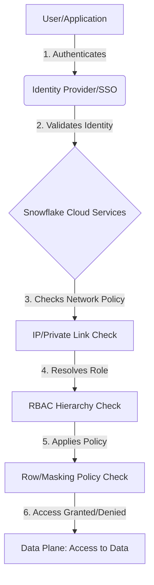

## Security, Identity, and Access Control

### Section at a Glance
**What you'll learn:**
- Designing and implementing a robust Role-Based Access Control (RBAC) hierarchy.
- Managing user identity through Single Sign-On (SSO) and SCIM provisioning.
- Implementing network security via Network Policies and Private Link.
- Protecting sensitive data using Dynamic Data Masking and Row Access Policies.
- Auditing data access and user activity for compliance and forensics.

**Key terms:** `RBAC` · `Authentication` · `Authorization` · `Network Policy` · `Data Masking` · `Privilege`

**TL;DR:** Snowflake security relies on a "Least Privilege" model using Role-Based Access Control (RBAC), where access is granted to roles, not users, and visibility is further refined through fine-grained data governance and network-level restrictions.

---

### Overview
In a modern data ecosystem, the "Data Perimeter" has dissolved. For the enterprise, the primary business risk is no longer just a perimeter breach, but the unauthorized exposure of sensitive PII (Personally Identifiable Information) or the accidental deletion of critical assets. A single misplaced `GRANT` statement can lead to a massive compliance failure (e.g., GDPR or HIPAA violations).

Snowflake addresses this by decoupling identity (who you are) from authorization (what you can do). This architecture solves the "permission sprawl" problem common in legacy data warehouses, where managing individual user permissions becomes an administrative nightmare as an organization grows. By using a centralized, hierarchy-based RBAC model, Snowflake allows Data Engineers to build scalable, automated security models that satisfy both agile development needs and stringent audit requirements.

This section moves beyond simple "logins" to explore how Snowflake provides a multi-layered defense strategy—covering everything from the network layer to the cell-level data layer—ensuring that even if a credential is compromised, the blast radius is strictly contained.

---

### Core Concepts

#### 1. Role-Based Access Control (RBAC)
Snowflake does not grant privileges directly to users. Instead, privileges are granted to **Roles**, and **Users** are assigned to those roles. This abstraction is the foundation of Snowflake security.

*   **Privileges:** The specific permission to perform an action (e.g., `USAGE` on a database, `SELECT` on a table).
*   **Role Hierarchy:** Roles can be granted to other roles, creating a tree structure. 📌 **Must Know:** In Snowflake, permissions flow *upward* through the hierarchy. If `Role_A` is granted to `Role_B`, then `Role_B` inherits all privileges held by `Role_A`.
*   **The System Roles:** 
    *   `ORGADMIN`: Manages the organization and accounts.
    *   `ACCOUNTADMIN`: The "Super User." ⚠️ **Warning:** Avoid using `ACCOUNTADMIN` for daily tasks; it should be reserved strictly for account-level configuration and billing management.
    *   `SECURITYADMIN`: Manables users and roles; manages the `USERADMIN` role.
    *   `USERADMIN`: Specifically designed for creating users and roles.
    *   `SYSADMIN`: The primary role for object creation (Databases, Warehouses, etc.).

#### 2. Network Security
Security begins before a user even reaches the SQL editor. 
*   **Network Policies:** These allow you to define a list of allowed (or blocked) IP addresses. 
*   **Private Link:** For enterprises requiring high-security isolation, Snowflake supports AWS PrivateLink or Azure Private Link, ensuring data traffic never traverses the public internet. ⚠️ **Warning:** If you apply a restrictive Network Policy to your account and forget to include your current IP address, you will immediately lock yourself out of the Snowflake UI.

####  effectively 3. Data Governance & Fine-Grained Access
Even with the correct role, some data should remain obscured.
*   **Dynamic Data Masking:** Obfuscates sensitive data (e.g., showing only the last 4 digits of a SSN) at query time based on the user's role.
*   **Row Access Policies:** Restricts which rows a user can see (e.g., a Regional Manager can only see rows where `Region = 'North_America'`). 💡 **Tip:** Use Row Access Policies to implement "Multi-tenancy" in a single table, rather than creating separate tables for every client.

---

### Architecture / How It Works

The following diagram illustrates the flow of an authorization request in Snowflake:



1.  **User/Application:** The entity attempting to execute a query.
2.  **Identity Provider (IdP):** Uses SAML 2.0/SSO to verify the user's identity.
3.  **Cloud Services Layer:** The "brain" of Snowflake that evaluates the security context.
4.  **Network Policy Check:** Validates if the request origin is authorized.
5.  **RBAC Hierarchy Check:** Determines if the active role possesses the required privilege.
6.  **Policy Check:** Evaluates if fine-grained masking or row-level rules apply to the specific columns/rows being requested.
7.  **Data Plane:** The actual execution of the query against the micro-partitions.

---

### Comparison: When to Use What

| Feature | Best For | Trade-offs | Approx. Cost Signal |
| :--- | :--- | :--- | :--- |
| **SSO (SAML 2.0)** | Enterprise-wide identity management (Okta, Azure AD). | Requires integration setup with an IdP. | Low (Standard feature) |
| **Network Policies** | Restricting access to known corporate VPN/Office IPs. | High administrative overhead if IPs change frequently. | No direct cost |
| **Dynamic Data Masking**| Protecting PII/PHI (SSN, Credit Card) in shared tables. | Can increase complexity in SQL development. | Low (Compute overhead) |
| **Row Access Policies**| Multi-tenant architectures and regional data isolation. | Can impact query performance on very large datasets. | Low (Compute overhead) |

**How to choose:** Start with **SSO** and **Network Policies** to secure the perimeter. Once users are in the system, use **RBAC** to manage structural access, and only implement **Masking/Row-level policies** when specific compliance requirements (like GDPR) necessitate it.

---

### Cost Cheat Sheet

| Scenario | Recommended Option | Key Cost Driver | Watch Out For |
| :--- | :--- | :--- | :--- |
| **External User Access** | Security Integration (OAuth/SSO) | Administrative time | Managing lifecycle of external users |
| **Sensitive Data Audit** | Access History / Query History | Storage of metadata | High volume of logs in large accounts |
| **Data Recovery/Security** | Time Travel | Storage of "old" versions of data | 💰 **Cost Note:** Excessive Time Travel retention on frequently updated tables significantly increases storage costs. |
| **Automated Provisioning** | SCIM (System for Cross-domain Identity Management) | Integration complexity | Misconfigured mappings leading to over-privileging |

> 💰 **Cost Note:** The single biggest cost mistake in Snowflake security is over-retention of **Time Travel** on large, volatile tables. While it provides a safety net against accidental deletion, you are paying for the storage of every version of every micro-partition modified during that window.

---

### Service & Tool Integrations

1.  **Identity Providers (Okta, Azure AD, Ping):**
    *   Use **SAML 2.0** for seamless User Authentication.
    *   Use **SCIM** to automate User Provisioning (automatically creating/deleting users in Snowflake when they are added/removed from your corporate directory).
2.  **Cloud Infrastructure (AWS, Azure, GCP):**
    *   **Private Link/Private Endpoints:** Connect your VPC/VNet to Snowflake without traversing the public internet.
3.  **Data Governance Tools (Collibra, Alation):**
    *   Integrate via metadata APIs to augment Snowflake’s native object tags with enterprise-wide business glossaries.

---

### Security Considerations

| Control | Default State | How to Enable / Strengthen |
| :--- | :--- | :--- |
| **Authentication** | Password-based | Enable **MFA** (Multi-Factor Authentication) via Duo via the Snowflake UI. |
| **Authorization** | RBAC (No default access) | Implement a strict role hierarchy following the **Principle of Least Privilege**. |

| **Encryption (At Rest)** | AES-256 (Always ON) | Managed by Snowflake; no action required, but can use **Customer Managed Keys (Tri-Secret Secure)**. |
| **Encryption (In Transit)** | TLS 1.2+ (Always ON) | Ensure all client drivers/connectors are up to date to support modern TLS. |
| **Network Isolation** | Public Internet Access | Implement **Network Policies** to whitelist specific IP ranges. |

---

### Performance & Cost

While security metadata is managed in the Cloud Services layer, complex security logic can impact the **Data Plane** (Compute).

*   **Performance Bottleneck:** Complex **Row Access Policies** involving multiple `JOINs` to a mapping table can significantly increase query execution time on large-scale scans.
*   **Scaling Patterns:** Security policies should be designed to be "Sargable" (Search Argumentable). Avoid using complex regex in masking policies if you can use simple string manipulation.
*   **Cost Example:** 
    *   *Scenario:* A 1TB table has a Row Access Policy that joins to a `USER_MAPPING` table of 10,000 rows.
    *   *Impact:* Without optimization, every query must perform this join. If the join is inefficient, a query that should take 2 minutes might take 5 minutes, effectively **tripling your compute cost** for that specific workload.

---

### Hands-On: Key Operations

**1. Creating a new role and assigning it to a user.**
This establishes the foundation of your RBAC model.
```sql
USE ROLE USERADMIN;
CREATE ROLE data_analyst_role;
CREATE USER jdoe PASSWORD = 'TemporaryPassword123!';
GRANT ROLE data_analyst_role TO USER jdoe;
```
> 💡 **Tip:** Always use `USERADMIN` to create users/roles, but use `SECURITYADMIN` or `ACCOUNTADMIN` to grant privileges on objects.

**2. Granting usage permissions on a database and schema.**
Without `USAGE` on the parent, a user cannot "reach" the tables inside.
```sql
USE ROLE SYSADMIN;
GRANT USAGE ON DATABASE sales_db TO ROLE data_analyst_role;
GRANT USAGE ON SCHEMA sales_db.public TO ROLE data_analyst_role;
GRANT SELECT ON ALL TABLES IN SCHEMA sales_db.public TO ROLE data_analyst_role;
```

**3. Implementing a simple Masking Policy.**
This protects the `email` column from being seen in plain text by non-authorized roles.
```sql
CREATE OR REPLACE MASKING POLICY email_mask AS (val string) 
RETURNS string ->
  CASE
    WHEN CURRENT_ROLE() IN ('DATA_ADMIN_ROLE') THEN val
    ELSE '*********'
  END;

ALTER TABLE customers MODIFY COLUMN email SET MASKING POLICY email_mask;
```
> ⚠️ **Warning:** Masking policies are applied at the column level. If you have multiple policies, the order of operations and the complexity of the `CASE` statement can impact query performance.

---

### Customer Conversation Angles

**Q: We have 5,000 employees. We can't manually create users in Snowflake every day. How do we handle this?**
**A:** We recommend implementing SCIM provisioning via your existing Identity Provider like Okta or Azure AD. This automates the user lifecycle, so when an employee leaves your company, their Snowflake access is revoked instantly and automatically.

**Q: How can I be sure that my developers aren't seeing sensitive customer credit card numbers?**
**A:** We can implement Dynamic Data Masking. We define a policy that detects the user's role; if they aren't in the 'Finance_Admin' role, Snowflake will automatically redact the credit card digits before the data ever leaves the server.

**Q: Is our data encrypted while it's moving from our local server to Snowflake?**
**A:** Yes, all data in transit is encrypted using TLS 1.2 or higher, ensuring that the data is protected from interception during the upload process.

**Q: If a developer accidentally deletes a critical table, can we get it back?**
**A:** Yes, Snowflake’s **Time Travel** feature allows you to restore deleted objects for a defined period (up to 90 days), significantly reducing the risk of human error.

**Q: We are in a highly regulated industry. Can we ensure our data never travels over the public internet?**
**A:** Absolutely. By using technologies like AWS PrivateLink, we can establish a private connection between your cloud network and Snowflake, ensuring all traffic stays within your private network backbone.

---

### Common FAQs and Misconceptions

**Q: If I grant `SELECT` on a table, does the user also need `USAGE` on the database?**
**A:** Yes. ⚠️ **Warning:** A common mistake is granting table-level permissions but forgetting the `USAGE` permission on the Database and Schema. The user will receive an "Object does not exist" error.

**Q: Does creating a new role cost extra?**
**A:** No, creating roles and users is a metadata operation and does not incur direct Snowflake costs.

**Q: Can one role have multiple parent roles?**
**A:** Yes, this is the key to building a functional hierarchy. A `DATA_ANALYST` role can inherit permissions from both `SALES_ROLE` and `MARKETING_ROLE`.

**Q: Is the `ACCOUNTADMIN` role the same as a Superuser in PostgreSQL?**
**A:** Conceptually, yes, but in Snowflake, even `ACCOUNTADMIN` is subject to the Network Policies defined for the account.

**Q: Does Snowflake encrypt my data using my own keys?**
**A:** By default, Snowflake manages the keys. However, if your compliance needs require it, you can use **Tri-Secret Secure**, which combines a Snowflake-managed key with a key you manage in your own cloud KMS.

---

### Exam & Certification Focus
*   **Role Hierarchy (High Frequency):** Understand how privileges flow from child roles to parent roles. 📌 **Must Know.**
*   **Role Distinction:** Know the specific responsibilities of `USERADMIN` (creating users) vs. `SECURITYADMIN` (managing privileges).
*   **Object Hierarchy:** Understand the dependency chain: `Account -> Database -> Schema -> Table/View`.
*   **Network Security:** Understand the impact of Network Policies and how to prevent lockouts.
*   **Data Protection:** Understand the difference between **Time Travel** (recovery) and **Fail-safe** (disaster recovery by Snowflake).

---

### Quick Recap
- **RBAC is king:** Permissions are granted to roles, and roles are assigned to users.
- **Hierarchy Matters:** Permissions flow up the role tree; use this to scale access management.
- **Defense in Depth:** Use Network Policies (Perimeter), RBAC (Access), and Masking (Data) for complete coverage.
- **Least Privilege:** Always grant the minimum level of access (e.g., `SELECT` instead of `ALL`) required for a task.
- **Automation is Key:** Leverage SSO and SCIM to manage identities at scale without manual intervention.

---

### Further Reading
**Snowflake Documentation** — The definitive source for all SQL syntax and security object properties.
**Snowflake Security Whitepaper** — Deep dive into the architecture of encryption, authentication, and authorization.
**Snowflake Best Practices: Role Hierarchy** — Expert guidance on structuring roles for enterprise scalability.
**Snowflake Data Governance Guide** — Detailed instructions on implementing masking and row-level security.
**Snowflake Network Security Guide** — Documentation on Private Link and Network Policy implementation.