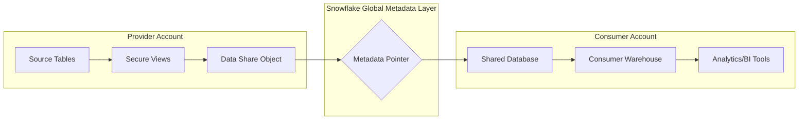

# Data Sharing and the Snowflake Marketplace

### Section at a Glance
**What you'll learn:**
- The fundamental mechanics of Snowflake Direct Data Sharing.
- The architectural distinction between Providers and Consumers.
- How to implement Secure Views to protect sensitive logic and data.
- The business utility of the Snowflake Marketplace and Private Data Exchanges.
- Security and cost implications of consuming third-party datasets.

**Key terms:** `Provider` · `Consumer` · `Secure View` · `Data Share` · `Marketplace` · `Data Exchange`

**TL;DR:** Snowflake Data Sharing allows for real-time, zero-copy access to data across different Snowflake accounts, eliminating the need for expensive, error-prone ETL processes and data duplication.

---

### Overview
In traditional data engineering, sharing data with a partner or vendor involves a "copy-and-send" workflow: you must export data to an S3 bucket, notify the recipient, and have them ingest it via a pipeline. This creates a "latency gap" where the recipient is always working on stale data, and it introduces significant security risks and egress costs.

Snowflake solves this through **Direct Data Sharing**. Instead of moving data, Snowflake allows a "Provider" to grant "Consumer" accounts access to specific objects within their existing architecture. Because both accounts reside on the Snowflake platform, they are looking at the same underlying metadata and storage.

This capability scales from simple one-to-one sharing between two companies to the massive, one-to-many ecosystem of the **Snowflake Marketplace**, where organizations can discover, subscribe to, and instantly query third-party datasets (like weather, financial, or demographic data) as if they were their own. This section covers the technical implementation, the security guardrails required, and the economic impact of moving from "data movement" to "data access."

---

### Core Concepts

#### 1. The Provider-Consumer Relationship
Data sharing is defined by roles. The **Provider** owns the data and manages the "Share" object. The **Consumer** receives the share and mounts it as a database in their own account. 
📌 **Must Know:** The Provider manages the data; the Consumer manages the compute (Virtual Warehouse) used to query it.

#### 2. Zero-Copy Sharing
Unlike traditional methods, no data is physically copied from the Provider to the Consumer. The Consumer is simply reading the Provider's metadata.
⚠️ **Warning:** While there is no data duplication, the Consumer *must* have an active Virtual Warehouse to run queries. If the Consumer's warehouse is suspended, they cannot access the shared data.

#### 3. Secure Views: The Privacy Layer
You rarely want to share a raw table. Often, you need to share a subset of data or hide specific columns. **Secure Views** are used to prevent the Consumer from seeing the underlying SQL logic or using certain optimization techniques that might inadvertently reveal sensitive data through error messages.
💡 **Tip:** Always use `SECURE` views when sharing data that contains PII (Personally Identable Information) to prevent "leakage" via query profile analysis.

#### 4. The Snowflake Marketplace vs. Private Exchange
*   **Marketplace:** A public, searchable hub where anyone can find and subscribe to datasets.
*   **Data Exchange:** A private, curated ecosystem for a specific group of organizations (e.g., a supply chain consortium) to share data amongst themselves.

---

### Architecture / How It Works



1.  **Provider Account:** Holds the authoritative source of truth and defines the Share object.
2.  **Data Share Object:** A container in the Provider account that holds references to the specific tables or views being shared.
3.  **Global Metadata Layer:** The Snowflake "magic" that allows the Consumer's metadata to point directly to the Provider's storage blocks.
4.  **Consumer Account:** Mounts the share as a read-only database.
5.  **Consumer Warehouse:** The compute engine owned and paid for by the Consumer that executes the queries.

---

### Comparison: When to Use What

| Option | Best For | Trade-offs | Approx. Cost Signal |
| :--- | :--- | :--- | :--- |
| **Direct Sharing** | 1-to-1 partnerships (e.g., Vendor $\leftrightarrow$ Client). | Requires manual setup of the share between accounts. | Zero egress; Provider pays storage; Consumer pays compute. |
| **Private Data Exchange** | Controlled ecosystems (e.g., a group of 10 banks). | High administrative overhead to manage membership. | Highly cost-efficient for group-wide data synchronization. |
| **Snowflake Marketplace** | Discovering new, third-party datasets for enrichment. | Data is "out of your control" once subscribed; requires vetting. | Pay-per-query (Consumer) or subscription-based (Provider). |

**How to choose:** Start with **Direct Sharing** for known partners. Move to a **Private Exchange** if you are managing a cluster of related business entities. Use the **Marketplace** when you need to augment your internal data with external signals (like inflation rates or supply chain indices).

---

ly### Cost Cheat Sheet

| Scenario | Recommended Option | Key Cost Driver | Watch Out For |
| :--- | :--- | :--- | :--- |
| Sharing internal data to a branch office | Direct Sharing | Storage (Provider) | Ensuring the branch office has a warehouse running. |
| Consuming 100TB of weather data | Marketplace | Compute (Consumer) | Large-scale joins that trigger massive warehouse scaling. |
| Creating a vendor ecosystem | Private Data Exchange | Metadata Management | Complexity in managing permissions across many accounts. |
| Sending data to a non-Snowflake user | *Not possible via Sharing* | Egress/Transfer Costs | You must use an ETL/Unload process (S3/Azure Blob). |

💰 **Cost Note:** The single biggest cost mistake occurs when a Consumer performs a massive `JOIN` between a shared dataset and their own large local table without proper filtering. This can cause the Consumer's warehouse to scale up or out, leading to unexpected credit consumption.

---

### Service & Tool Integrations

1.  **BI and Analytics Tools (Tableau, Sigma, Looker):**
    *   Connect directly to the shared database in the Consumer account.
    *   Since the data is "live," dashboards reflect Provider updates in real-time.
2.  **Snowflake Native Apps:**
    *   Native Apps use the underlying sharing technology to bundle code and data together.
    *   The app "shares" its functionality and necessary data to the consumer's account.
3.  **Data Pipelines (dbt, Airflow):**
    *   Use pipelines to refresh the "Source Tables" in the Provider account.
    *   The moment the pipeline finishes, the Consumer sees the new data.

---

### Security Considerations

Security in sharing is centered on the principle of **Least Privilege**. You are not sharing your database; you are sharing specific objects.

| Control | Default State | How to Enable / Strengthen |
| :--- | :--- | :--- |
| **Data Access Control** | Access denied by default. | Explicitly `GRANT USAGE` on share, schema, and table. |
| **Logic Obfuscation** | Logic is visible in standard views. | Use the `SECURE` keyword when creating views. |

| **Row/Column Level Security** | All rows/columns in table are visible. | Implement masking policies or filter rows within a Secure View. |
| **Network Isolation** | Accessible via Snowflake Network Policy. | Restrict Consumer access to specific IP ranges if required. |

---

### Performance & Cost

**Performance:**
The performance of a shared dataset is identical to the performance of a local dataset. The bottleneck is never the "sharing" itself, but rather the **Consumer's Virtual Warehouse**. If a Consumer uses an `X-Small` warehouse to join a 1TB shared table, it will perform poorly.

**Cost Scenario:**
*   **Provider:** Stores 5TB of data. Cost is standard Snowflake storage rates. No additional cost for the "act" of sharing.
*   **Consumer:** Subscribes to the 5TB share.
    *   *Scenario A:* Consumer runs a small aggregate query. Cost: ~0.1 credits.
    *   *Scenario B:* Consumer runs a `JOIN` of the 5TB share against their own 10TB table. Cost: ~50-100 credits (depending on warehouse size and complexity).

---

### Hands-Hands: Key Operations

First, as the **Provider**, we must create the share and add objects to it.
```sql
-- 1. Create the share object
CREATE SHARE my_company_share;

-- 2. Add the database and schema to the share
GRANT USAGE ON DATABASE production_db TO SHARE my_company_share;
GRANT USAGE ON SCHEMA production_db.sales_data TO SHARE my_company_share;

-- 3. Add a specific secure view (best practice) to the share
GRANT SELECT ON VIEW production_db.sales_data.v_regional_sales TO SHARE my_company_share;

-- 4. Add the consumer account to the share
ALTER SHARE my_company_share ADD ACCOUNT = 'ACME_CORP_ACCOUNT';
```
💡 **Tip:** Always grant permissions to the `SHARE` object, not just the database. The share is the container that carries the permissions.

Next, as the **Consumer**, we must mount the share to see the data.
```sql
-- 1. Create a database from the incoming share
CREATE DATABASE acme_shared_sales FROM SHARE acme_corp_account.my_company_share;

-- 2. Query the data immediately
SELECT * FROM acme_shared_sales.sales_data.v_regional_sales WHERE region = 'North';
```

---

### Customer Conversation Angles

**Q: "Does sharing data increase my storage costs because we are duplicating the data?"**
**A:** "Not at all. There is zero data duplication. You are simply accessing the existing storage via a metadata pointer, so storage costs remain exactly the same."

**Q: "If I am the Provider, can the Consumer see the underlying tables that my Secure View is based on?"**
**A:** "No. By using Secure Views, we ensure the Consumer can only see the specific columns and rows we've explicitly permitted, and they cannot inspect the underlying SQL logic."

**Q: "How much latency is there between us updating our data and the Partner seeing it?"**
**A:** "It is near-zero latency. Because we are sharing the metadata, the moment our ETL pipeline completes, the data is instantly visible in the Partner's account."

**Q: "What happens if our warehouse is suspended? Can the Partner still query the data?"**
**A:** "The data is always available, but the Partner must use their own compute resources to query it. They cannot 'piggyback' off our warehouse."

**Q: "Is there an egress fee for sending data to our partners via Snowflake?"**
**A:** "One of the biggest advantages is that there are no data egress fees within the Snowflake ecosystem, which significantly reduces the total cost of ownership compared to S3 or FTP transfers."

---

### Common FAQs and Misconceptions

**Q: Can I share a whole database with a consumer?**
**A:** No. You share a `SHARE` object, and you must explicitly add specific databases, schemas, and tables/views to that share.
⚠️ **Warning:** Never grant `USAGE` on an entire database to a share without carefully auditing which objects are included.

**Q: Can I share data with a customer who doesn't use Snowflake?**
**A:** No. Snowflake Direct Sharing requires both the Provider and the Consumer to be on the Snowflake platform. For non-Snowflake users, you must use traditional data unloading (e.g., to S3).

**Q: If I delete a table in my account, does the Consumer lose access?**
**A:** Yes. Since the Consumer is looking at your actual metadata, if the underlying object is dropped, the Consumer will receive an error.

**Q: Does the Consumer pay for the storage of the shared data?**
**A:** No. The Provider continues to pay for the storage. The Consumer only pays for the compute (Warehouse) used to run queries.

**Q: Can the Consumer write data back to my shared database?**
**A:** No. All shares are inherently **read-only** for the Consumer.

---

### Exam & Certification Focus
*   **Domain: Data Protection & Sharing**
*   **Identify Roles:** Distinguish between what the Provider manages (Storage, Metadata, Share Object) vs. what the Consumer manages (Compute/Warehouse). 📌 **High Frequency**
*   **Security Implementation:** Understand when to use `SECURE VIEW` to prevent data/logic exposure. 📌 **High Frequency**
*   **Architectural Knowledge:** Understand that "Zero-copy" means no physical data movement or duplication.
*   **Object Hierarchy:** Know the order of grants: `SHARE` $\rightarrow$ `DATABASE` $\rightarrow$ `SCHEMA` $\rightarrow$ `TABLE/VIEW`.

---

### Quick Recap
- **Zero-Copy:** No data is moved or duplicated during sharing.
- **Provider vs. Consumer:** Provider owns storage; Consumer owns compute.
- **Secure Views:** Essential for protecting sensitive logic and data during sharing.
- **Real-time:** Updates in the Provider account are instantly visible to the Consumer.
- **No Egress:** Sharing within Snowflake avoids the costs of moving data across the internet.

---

### Further Reading
**Snowflake Documentation** — Comprehensive guide on creating and managing Shares.
**Snowflake Documentation** — Detailed technical deep-dive into Secure Views and masking.
**Snowflake Marketplace Guide** — Instructions on how to discover and consume third-party data.
**Snowflake Whitepaper: Data Sharing** — High-level business value and architecture overview.
**Snowflake Documentation** — Reference for the `CREATE SHARE` SQL syntax and parameters.