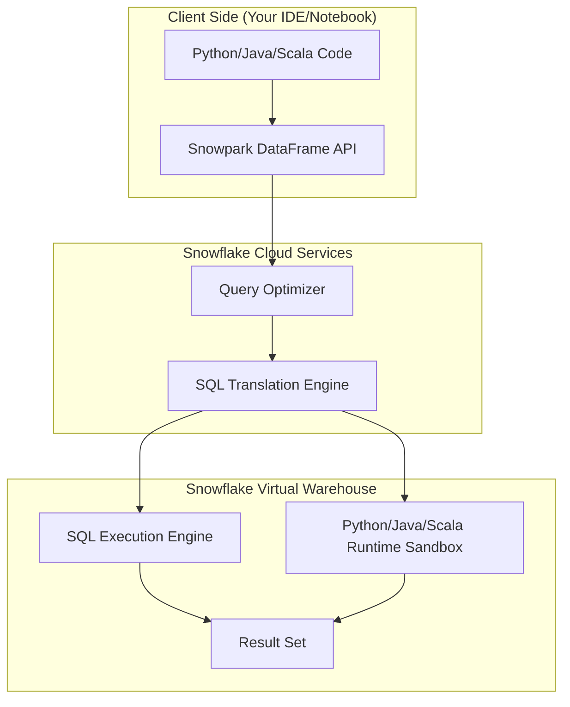

## Snowpark and Programmable Data Engineering

### Section at a $Glance$
**What you'll learn:**
- The fundamental shift from SQL-only processing to a multi-language programming paradigm.
- How the Snowpark DataFrame API translates high-level code into optimized SQL.
- The mechanics of User-Defined Functions (UDFs) and User-Defined Table Functions (UDTFs).
- Designing scalable, end-to-end machine learning and data science pipelines within Snowflake.
- Managing the security and performance implications of running non-SQL code in a managed environment.

**Key terms:** `DataFrame API` · `Lazy Evaluation` · `UDF` · `UDTF` · `Python Sandbox` · `Vectorized Execution`

**TL;DR:** Snowpark allows you to write Python, Java, or Scala code that executes directly inside the Snowflake engine, eliminating the need to move data out of Snowflake for complex processing or machine learning.

---

### Overview
For years, the "Data Gravity" problem has plagued enterprises. Data Engineers successfully centralized massive datasets in Snowflake, but Data Scientists—who rely on Python libraries like Pandas, Scikit-learn, or PyTorch—were forced to "egress" that data to external compute clusters (like Spark or local machines) to perform advanced analytics. This created a massive "security gap" (data leaving the governed perimeter) and a "cost gap" (paying for both Snowflake storage and external compute/egress fees).

Snowpark solves this by bringing the computation to the data. It provides a developer-friendly API that allows you to write imperative-style code (Python/Java/Scala) that Snowflake's query optimizer can understand and translate into highly efficient SQL. 

In the context of this course, Snowpark represents the evolution of Snowflake from a "Data Warehouse" to a "Data Cloud." It enables a unified engineering pattern where the same governance, security, and scaling rules applied to SQL queries are applied to complex Python-based machine learning workflows.

---

### Core Concepts

**The Snowpark DataFrame API**
Unlike a standard Python library that loads data into local memory, the Snowpark DataFrame API uses **Lazy Evaluation**. When you perform an operation (like `.filter()` or `.select()`), Snowpark does not execute it immediately. Instead, it builds a logical plan of the transformations.

> ⚠️ **Warning:** A common mistake for Python developers is forgetting that operations are only executed when an **action** (like `.collect()`, `.show()`, or `.save_as_table()`) is called. If you write a complex transformation but never call an action, your code will run without error, but no data will actually be processed.

**User-Defined Functions (UDFs) and UDTFs**
When SQL is insufficient for complex logic (e.g., parsing a custom JSON blob or running a regex-heavy string manipulation), Snowpark provides:
*   **Scalar UDFs:** Take one or more input rows and return a single value.
*   **UDTFs (Table Functions):** Take input and return an entire table (multiple rows and columns). This is critical for "exploding" complex data structures.

📌 **Must Know:** For the exam, remember that UDFs execute within a **secure sandbox**. This ensures that even though you are running Python code, the code cannot access the underlying Snowflake operating system or unauthorized files.

**The Python Sandbox & Environment**
Snowpark allows you to use various Python libraries via the Anaconda integration. Snowflake manages the environment, ensuring that the libraries you use are pre-installed and securely vetted.

💰 **Cost Note:** While the compute is performed on your Snowflake Warehouse, using heavy libraries (like `pandas` or `scikit-learn`) increases the memory pressure on your warehouse. If you use a small warehouse (e.g., X-Small) for heavy Python processing, you may encounter "Out of Memory" errors, forcing you to scale up to a larger warehouse, which directly increases your credit consumption.

---

### Architecture / How It Works



1.  **Client Side:** The developer writes code using the Snowpark Library (e.learn, PySpark-style).
2.  **SQL Translation Engine:** The API translates the high-level DataFrame operations into highly optimized SQL statements.
3.  **Query Optimizer:** Snowflake's engine treats the translated SQL as a standard query, applying all its usual optimizations.
4.  **Python/Java/Scala Runtime:** For logic that *cannot* be expressed in SQL (the actual UDF logic), Snowflake spins up a secure, isolated sandbox on the Warehouse to execute the code.
5.  **Result Set:** The final output is returned to the user or saved back to a Snowflake table.

---

### Comparison: When to Use What

| Option | Best For | Trade-offs | Approx. Cost Signal |
| :--- | :--- | :--- | :--- |
| **Standard SQL** | Aggregations, Joins, Filtering, ETL | Limited to relational logic; difficult for complex math. | Lowest (Highly optimized) |
| **Snowpark (Python/SQL API)** | Complex transformations, Feature Engineering, Data Science | Requires Python/Java/Scala knowledge; requires warehouse compute. | Moderate (Uses Warehouse credits) |
able | **External Compute (Spark/Databricks)** | Full control over custom OS libraries; high data movement/egress. | Highest (Egress + External Compute) |

**How to choose:** If your logic can be expressed in SQL, always use SQL. If you need procedural logic or specialized libraries (like `scipy`), use Snowpark. Only move to external compute if you have hardware-specific requirements (like GPUs) that Snowflake does not yet support.

---

### Cost Cheat Sheet

| Scenario | Recommended Option | Key Cost Driver | Watch Out For |
| :--- | :--- | :--- | :--- |
| **Simple Data Cleaning** | SQL | Warehouse uptime | Over-provisioning large warehouses for simple tasks. |
| **Complex Feature Engineering** | Snowpark (Python) | Memory-intensive libraries | ⚠️ Memory-heavy libraries causing warehouse resizing. |
| **Large Scale ML Training** | Snowpark ML | Warehouse size (Large/X-Large) | Long-running queries consuming credits continuously. |
| **Batch Processing via UDTFs** | Snowpark UDTF | Computational complexity per row | Logic that creates "infinite" rows, bloating result sets. |

> 💰 **Cost Note:** The single biggest cost mistake in Snowpark is failing to use **Vectorized UDFFs**. Standard UDFs process data row-by-row, which is slow and expensive. Vectorized UDFs process data in batches, significantly reducing the time the warehouse stays active.

---

### Service & Integrations
1.  **Snowflake Python Worksheets:** An integrated web interface for writing and debugging Python code directly in the Snowflake UI without local setup.
2.  **Anaconda Integration:** A curated repository of Python packages that are pre-installed and secured within the Snowflake environment.
3.  **dbt (Data Build Tool):** Using Snowpark to extend dbt models with Python-based logic while maintaining the lineage of SQL models.
4.  **Snowflake ML:** A suite of tools that leverages Snowpark to automate the machine learning lifecycle (feature engineering, training, and scoring) directly in the platform.

---

### Security Considerations

| Control | Default State | How to Enable / Strengthen |
| :--- | :--- | :--- |
| **Code Isolation** | Secure Sandbox | Inherently enabled; prevents access to Snowflake's underlying OS. |
| **Library Access** | Restricted to Anaconda | Use the "Anaconda integration" to whitelist specific packages. |
| **Data Access (RBAC)** | Standard Snowflake RBAC | Apply standard `GRANT` permissions on the tables the Python code touches. |
| **Network Isolation** | Cloud Service Layer | Use Network Policies to restrict which IPs can trigger Snowpark tasks. |

---

### Performance & Cost
To maximize performance in Snowpark, you must move from **Row-based processing** to **Batch-based processing**.

**Example Cost/Performance Scenario:**
*   **Scenario:** Processing 100 million rows to calculate a complex logarithmic decay.
*   **Option A (Standard UDF):** Processes row-by-row. The warehouse runs for 60 minutes on a Medium warehouse. **Cost: ~12 credits.**
*   **Option B (Vectorized UDF):** Processes in batches using Pandas/NumPy. The warehouse runs for 10 minutes on a Medium warehouse. **Cost: ~2 credits.**

**The Lesson:** Optimization in Snowpark is not just about better code; it is about reducing the **Warehouse Duration**.

---

### Hands-On: Key Operations

**Step 1: Creating a simple Python UDF in Snowflake**
This script defines a function that takes a string and returns its length, which is useful for data profiling.
```python
# This code defines a scalar UDF that can be called via SQL
create or replace function get_string_len(s string)
returns int
language python
packages = ('pandas')
handler 'get_len'
as
$$
def get_len(s):
    return len(s) if s is not None else 0
$$;
```
> 💡 **Tip:** Always include the `packages` parameter even if you aren't using them yet; it makes it easier to add dependencies later without rewriting the function.

**Step 2: Using the Snowpark DataFrame API in Python**
This demonstrates how to perform a transformation that looks like Python but executes as SQL.
```python
import snowflake.snowpark as snowpark

def main(session: snowpark.Session):
    # Load a table into a Snowpark DataFrame
    df = session.table("RAW_SALES_DATA")

    # Perform a transformation (Lazy: No data moved yet)
    # This will be translated into: SELECT * FROM RAW_SALES_DATA WHERE AMOUNT > 100
    df_filtered = df.filter(df["AMOUNT"] > 100)

    # An 'Action' that triggers the execution
    df_filtered.write.mode("overwrite").save_as_table("CLEAN_SALES_DATA")
    
    return "Success"
```

---

### Customer Conversation Angles

**Q: We already have a heavy Spark footprint. Why should we move our Python logic to Snowpark?**
**A:** Moving to Snowpark eliminates the "Data Egress" tax and the security risk of moving sensitive data to an external cluster; you get the power of Python with the governance of Snowflake.

**Q: Will my Data Scientists need to learn a new way to connect to Snowflake?**
**A:** No, they can use the familiar Snowpark DataFrame API, which is designed to feel very similar to PySpark, allowing them to use their existing skills.

**Q: Is Snowpark more expensive than running Python on a local machine?**
**A:** While you pay for Snowflake warehouse credits, you save significantly on the "hidden costs" of data movement, networking, and the operational overhead of managing external compute clusters.

**Q: Can I use any Python library I want, like `pip install`?**
**A:** You can use any library available through the Snowflake-Anaconda integration, which ensures all libraries are secure, vetted, and won't break your environment.

**Q: How does Snowpark handle large-scale Machine Learning?**
**A:** It allows you to perform feature engineering and model scoring directly on the warehouse, meaning your models always train on the most current, governed data without any ETL pipelines.

---

### Common FAQs and Misconceptions

**Q: Does Snowpark run Python code on my local laptop?**
**A:** No. The Python code is sent to Snowflake, where it is executed within a secure sandbox on the Snowflake Warehouse.

**Q: Is Snowpark just a wrapper for SQL?**
**A:** Mostly, yes. For standard operations, it generates SQL. However, for UDFs, it executes actual Python logic. 
> ⚠️ **Warning:** Do not assume *all* Python logic becomes SQL. If you use a library like `scikit-learn`, that part *must* run in the Python sandbox, not the SQL engine.

**Q: Can I use Snowpark to connect to external databases?**
**A:** Snowpark is designed to process data *within* Snowflake. While you can use it to process data, the data should ideally reside in Snowflake for maximum performance.

**Q: Does Snowpark support Java and Scala?**
**A:** Yes, Snowflake provides specialized APIs and runtimes for both Java and Scala developers.

**Q: Is there a limit to how much data I can process with Snowpark?**
**A:** Your limit is essentially the scale of your Snowflake Warehouse. You can scale from an X-Small to a 6X-Large to meet the demand.

**Q: Does using Snowpark increase my storage costs?**
**A:** No, Snowpark processes data already in Snowflake. It only impacts compute (Warehouse) costs.

---

### Exam & Certification Focus
*   **Domain: Data Engineering/Snowpark API**
    *   Understand the difference between **Lazy Evaluation** and **Action** operations. 📌
    *   Identify the use cases for **UDFs** (Scalar) vs. **UDTFs** (Table-valued). 📌
    *   Understand the role of the **Anaconda integration** in managing Python dependencies.
    *   Recognise the architectural flow: Client $\rightarrow$ SQL Translation $\rightarrow$ Warehouse.
    *   Knowledge of **Security Sandboxing** and how it protects the Snowflake environment.

---

### Quick Recap
- Snowpark brings Python, Java, and Scala computation to the data, eliminating egress.
- The API uses **Lazy Evaluation**; transformations are only executed when an action is called.
- **UDFs and UDTFs** allow for complex logic that SQL cannot handle.
- Everything runs within a **secure, isolated sandbox** on the Snowflake Warehouse.
- Performance optimization relies heavily on **Vectorized execution** and efficient warehouse sizing.

---

### Further Reading
**Snowflake Documentation** — Detailed API reference for Snowpark Python.
**Snowflake Python Workshop** — Practical, hands-on tutorials for engineers.
**Snowflake Anaconda Integration Whitepaper** — Deep dive into how Python packages are managed.
**Snowflake Engineering Blog** — Case studies on large-scale Snowpark implementations.
**Snowflake ML Documentation** — How to use Snowpark for automated machine learning.