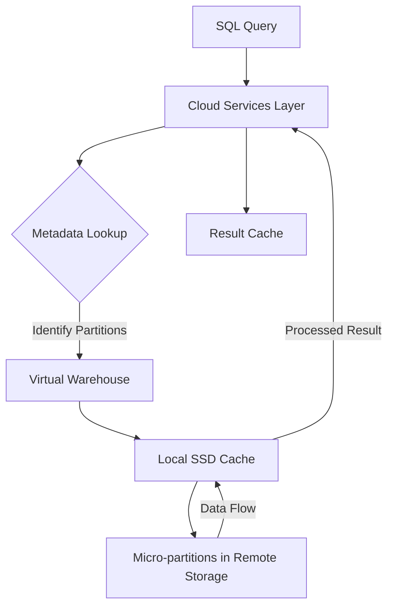

## Query Optimization and Performance Tuning

### Section at a Glance
**What you'll learn:**
- How to interpret the **Snowflake Query Profile** to identify bottlenecks.
- The mechanics of **Data Pruning** and how micro-partitions drive performance.
- Distinguishing between **Local Spilling** and **Remote Spilling** to disk.
- Strategies for implementing **Clustering Keys** and **Search Optimization Service (SOS)**.
- How to balance **Warehouse Scaling (Up vs. Out)** to optimize both latency and cost.

**Key terms:** `Micro-partitions` · `Pruning` · `Spilling` · `Clustering Key` · `Query Profile` · `Query Acceleration Service`

**TL;DR:** Snowflake performance tuning focuses on maximizing **data pruning** (reading only what is necessary) and minimizing **data movement** (avoiding disk spilling) to reduce both query latency and credit consumption.

---

### Overview
In a modern data warehouse, performance is the primary driver of business value. For a stakeholder, a "slow" dashboard translates to delayed decision-making; for a CFO, "unoptimized" queries translate directly to wasted cloud spend. 

The fundamental problem in large-scale data processing is the cost of I/O. If a query must scan 100TB of data to find 10 rows, the system is inefficient. Snowflake addresses this through its unique micro-partition architecture, but as data volume grows, the responsibility of maintaining efficiency shifts to the Data Engineer. 

This section moves beyond basic SQL syntax and dives into the engine's internals. We will explore how to diagnose "expensive" queries, understand how Snowflake's architecture manages data access, and learn when to leverage automated features like the Query Acceleration Service versus manual interventions like clustering. Understanding these concepts is the difference between being a SQL developer and being a Snowflake Architect.

---

### Core Concepts

#### 1. Micro-Partition Pruning
Snowflake stores all data in **micro-partitions**—small, immutable, compressed files. Each micro-partition contains metadata (Min/Max values) for every column.
- **Pruning** occurs when the Snowflake query optimizer uses this metadata to skip micro-partitions that do not contain the required data.
- **Effective Pruning:** When a query includes a filter (e.g., `WHERE date = '2023-01-01'`), Snowflake checks the metadata first. If the range doesn't match, the partition is never even touched.

> 📌 **Must Know:** Efficient pruning is the single most important factor in Snowflake performance. If your "Partitions Scanned" is nearly equal to "Partitions Total," your query is performing a full table scan, which is a massive cost and performance red flag.

#### 2. Data Spilling (The "Memory Wall")
When performing large joins or aggregations, the data being processed may exceed the available RAM in the Virtual Warehouse.
- **Local Spilling:** Data is moved from RAM to the local SSD of the warehouse nodes. This is slower but relatively manageable.
- **Remote Spilling:** When even the local SSD is full, data is spilled to **Remote Storage (S3/Azure Blob/GCS)**. 

⚠️ **Warning:** Remote spilling is a "performance killer." It introduces significant network latency, causing queries that should take seconds to take minutes, while you continue to pay for the warehouse compute.

####  3. Clustering and Search Optimization
- **Clustering Keys:** For very large tables (multi-terabyte), you can define a clustering key to physically group related data in micro-partitions. This enhances pruning.
- **Search Optimization Service (SOS):** A background service that creates optimized data structures to speed up "point lookup" queries (e.g., finding a specific ID in a massive table).

> 💰 **Cost Note:** Both Clustering Keys (due to background maintenance) and SOS (due to compute/storage overhead) incur additional costs. Never enable them on small tables; the overhead will likely outweigh the performance gains.

---

### Architecture / How It Works

The following diagram illustrates how a query moves from a SQL statement to the retrieval of specific micro-partitions.



1. **Cloud Services Layer:** Parses the SQL and performs the metadata lookup to determine which micro-partitions are needed.
2. **Metadata Lookup:** The engine inspects the Min/Max values of partitions to prune unnecessary data.
3. **Virtual Warehouse:** The compute engine that executes the heavy lifting (joins, aggregations, filters).
4. **Local SSD Cache:** The warehouse stores recently accessed data on local disk to avoid fetching from remote storage.
5. **Remote Storage:** The permanent home of the micro-partitions (e.g., AWS S3).
6. **Result Cache:** If an identical query is run and the underlying data hasn't changed, the result is returned instantly from the Cloud Services layer without using a warehouse.

---

### Comparison: When to Use What

| Feature | Best For | Trade-offs | Approx. Cost Signal |
| :--- | :--- | :--- | :--- |
| **Clustering Keys** | Large tables with frequent range filters | High maintenance cost (Automatic Clustering) | High (Compute intensive) |
| **Search Optimization (SOS)** | Point lookups (e.g., `WHERE ID = 123`) | Significant storage and compute overhead | High (Storage + Compute) |
  | **Materialized Views** | Pre-calculating complex aggregations | Data latency and maintenance cost | Medium (Compute + Storage) |
| **Query Acceleration Service** | Sudden spikes in large-scan workloads | Uses extra warehouse resources automatically | Variable (Per-second usage) |

**How to choose:** Start with the simplest solution (optimizing SQL and pruning). Move to Materialized Views for aggregations, and only use Clustering or SOS for massive, mission-critical tables where the performance gain justifies the maintenance cost.

---

### Cost Cheat Sheet

| Scenario | Recommended Option | Key Cost Driver | Watch Out For |
| :--- | :--- | :--- | :--- |
| **Large, predictable scans** | Larger Warehouse (Scale Up) | Warehouse Size (Credits/hour) | Spilling to Remote Storage |
| **High concurrency (Many users)** | Multi-cluster Warehouse (Scale Out) | Number of Clusters active | Over-provisioning clusters |
  | **Point Lookups in TB-scale tables** | Search Optimization Service | Background maintenance | Enabling on small tables |
| **Repeated, identical queries** | Utilize Result Cache | None (Metadata only) | Data changes (Invalidates cache) |

> 💰 **Cost Note:** The single biggest cost mistake is "Scaling Up" (e.g., moving from Small to 4X-Large) to solve a problem caused by **poor pruning**. You are essentially paying 64x more to scan the same inefficient amount of data.

---

### Service & Tool Integrations

1. **Snowsight (Web Interface):** The primary tool for visualizing the **Query Profile**. Use it to inspect the "Operator" nodes and identify which step is consuming the most time.
2. **Snowflake Python Connector:** Used to programmatically extract `QUERY_HISTORY` from the `ACCOUNT_USAGE` schema to build custom performance dashboards.
3. **External Monitoring (e.g., Datadog/Grafana):** Integrates via Snowflake's log/metric exports to alert engineers when "Spilling" or "Partition Scans" exceed established thresholds.

---

### Security Considerations

While performance tuning focuses on speed, it must not compromise data security.

| Control | Default State | How to Enable / Strengthen |
| :--- | :--- | :--- |
| **Data Access (RBAC)** | Role-based | Ensure tuning (like SOS) doesn't bypass row-level security policies. |
| **Query History Audit** | Enabled | Use `ACCOUNT_USAGE.QUERY_HISTORY` to audit who is running expensive/unauthorized queries. |

> 📌 **Must Know:** Tuning via Materialized Views or SOS does not bypass existing Row-Level Security (RLS) or Column-Level Masking policies; the security context of the user is maintained.

---

### Performance & Cost

**Tuning Guidance:**
- **Scaling Up (Vertical):** Increase warehouse size (e.g., Small $\to$ Medium). Use this for queries with large joins that suffer from **Local Spilling**.
- **Scaling Out (Horizontal):** Add more clusters to a Multi-cluster Warehouse. Use this to handle **Concurrency** (many users hitting the warehouse at once).

**Example Cost Scenario:**
A Data Engineer runs a 1TB join on an **X-Small** warehouse.
- **Scenario A (Unoptimized):** Query spills to Remote Storage. Duration: 45 minutes. Cost: ~0.25 credits.
- **Scenario B (Optimized via Clustering):** Query prunes 90% of data. Duration: 2 minutes. Cost: ~0.02 credits.
- **The Impact:** Even though the warehouse size stayed the same, the optimized query is **12.5x cheaper** and **22x faster**.

---

### Hands-On: Key Operations

**1. Analyzing a query via SQL to check for spilling:**
Check the `QUERY_HISTORY` to find if a specific `query_id` is spilling to disk.
```sql
SELECT query_id, query_text, bytes_spilled_to_remote, bytes_spanned_to_local
FROM table(information_schema.query_history())
WHERE query_id = '<your_query_id>';
```
💡 **Tip:** If `bytes_spilled_to_remote` is greater than zero, your priority should be increasing warehouse size or optimizing the join.

**2. Defining a Clustering Key:**
Apply a clustering key to a large table to improve pruning on the `transaction_date` column.
```sql
ALTER TABLE large_sales_table CLUSTER BY (transaction_date);
```
⚠️ **Warning:** Do not cluster on high-cardinality columns like `UUID` or `TIMESTAMP_NTZ` (with milliseconds), as this provides little pruning benefit and high cost.

---

### Customer Conversation Angles

**Q: Our queries are getting slower every week as our data grows. Should we just move to a larger warehouse?**
**A:** Scaling up is a valid short-term fix for memory issues, but we should first analyze your Query Profile to see if we can improve partition pruning through clustering or better SQL patterns to avoid long-term cost increases.

**Q: We have a dashboard that users refresh constantly. How can we make it instant?**
**A:** We should ensure your queries are "cache-friendly" by using consistent filters, which allows Snowflake to leverage the Result Cache, potentially returning results without even starting a warehouse.

**Q: Can we use Search Optimization to speed up our lookup queries?**
**A:** Yes, for point-lookup patterns on large tables, SOS is excellent, but we need to weigh the cost of the background maintenance against the latency savings.

**Q: Does increasing the number of clusters in my Multi-cluster Warehouse make individual queries faster?**
**A:** No, scaling out handles concurrency (more users), whereas scaling up (larger warehouse) handles query complexity (larger datasets).

**Q: Why am I seeing "Spilling" in my query profile?**
**A:** It means the data being processed is too large for the warehouse's RAM. We can either increase the warehouse size or rewrite the query to process less data at once.

---

### Common FAQs and Misconceptions

**Q: Does clustering a table make every query faster?**
**A:** No. Only queries that use the columns defined in the clustering key in their `WHERE` clause will see a performance boost.

**Q: If I delete data from a table, does the Result Cache clear?**
**A:** Yes. ⚠️ Any DML operation (INSERT, UPDATE, DELETE, MERGE) that modifies the underlying micro-partitions will invalidate the Result Cache for that table.

**Q: Is the Local Disk Cache shared between different warehouses?**
**A:** No. Each warehouse has its own local SSD cache. If you move a query from a Small to a Large warehouse, the cache is not "warm."

**Q: Does Snowflake automatically optimize my SQL queries?**
**A:** Snowflake optimizes the *execution plan* (the way it accesses data), but it cannot fix fundamentally inefficient SQL (like a Cartesian product).

**Q: Can I use the Search Optimization Service on any table?**
**A:** Yes, but it is only cost-effective on large tables where point-lookups are a frequent part of your workload.

---

### Exam & Certification Focus

*   **Query Profile Analysis (High Frequency):** Be able to identify "Spilling," "Pruning," and "Scan" metrics in a simulated scenario.
*   **Warehouse Scaling (High Frequency):** Distinguish between Scaling Up (Size) and Scaling Out (Multi-cluster).
*   **Caching Layers (High Frequency):** Know the difference between Result Cache (Cloud Services) and Local Disk Cache (Warehouse).
*   **Clustering & SOS (Medium Frequency):** Understand the use cases and cost implications of these features.

---

### Quick Recap
- **Pruning is King:** The goal of all optimization is to read as few micro-partitions as possible.
- **Monitor Spilling:** Remote spilling is a critical performance and cost bottleneck.
- **Scale Appropriately:** Use Multi-cluster for concurrency and Larger Warehouses for complex, memory-intensive joins.
- **Use Metadata:** Leverage the Cloud Services layer and the Result Cache whenever possible.
- **Cost-Benefit Analysis:** Always weigh the cost of automation (SOS/Clustering) against the actual performance gain.

---

### Further Reading
**Snowflake Documentation** — Deep dive into the Query Profile interface.
**Snowflake Documentation** — Detailed mechanics of Micro-partitioning.
**Snowflake Documentation** — Best practices for Clustering Keys.
**Snowflake Documentation** — Understanding the Search Optimization Service.
**Snowflake Whitepaper** — Architecture of the Snowflake Data Cloud.