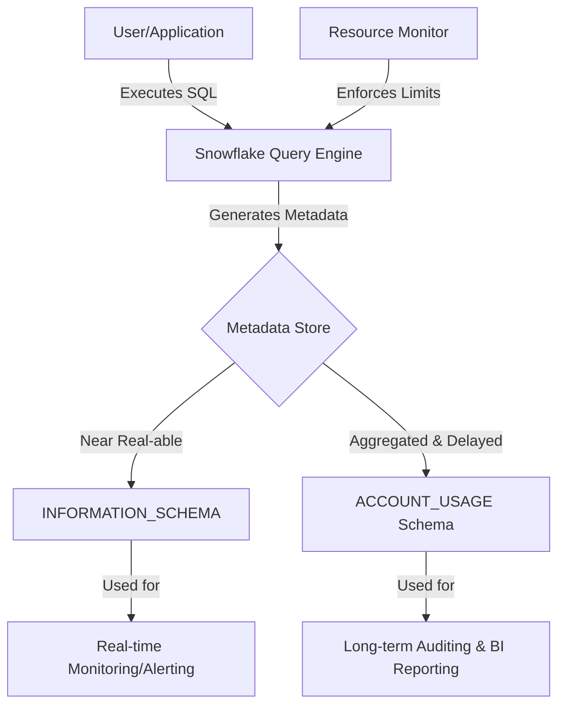

## Monitoring, Auditing, and Operations

### Section at a Glance
**What you'll learn:**
- How to differentiate between `INFORMATION_SCHEMA` and `ACCOUNT_USAGE` for observability.
- Implementing cost-control mechanisms using Resource Monitors.
- Auditing data access and user activity for compliance and security.
- Analyzing query performance using the Snowflake Query Profile.
- Managing warehouse lifecycle and scaling operations.

**Key terms:** `Account Usage` · `Information Schema` · `Resource Monitor` · `Query Profile` · `Object Tagging` · `Access History`

**TL;DR:** This section covers the essential "control plane" activities—monitoring costs, auditing access, and optimizing performance—to ensure your Snowflake environment remains secure, compliant, and within budget.

---

### Overview
In a traditional on-premises data warehouse, "operations" often meant managing hardware, patching OS kernels, and manually tuning disk I/O. In Snowflake’s SaaS model, the heavy lifting of infrastructure management is abstracted away. However, this abstraction introduces a new, critical business risk: **the "black box" cost and visibility problem.**

Without proper monitoring and auditing, a single poorly written Cartesian join or an unbounded automated ingestion process can trigger massive, unexpected credit consumption. From a business perspective, operations in Snowflake is not about managing servers; it/s about **governance, cost accountability, and performance observability.** 

This section provides the framework for moving from reactive firefighting (responding to high bills) to proactive management (using resource monitors and automated alerts) to ensure that your Snowflake investment scales predictably with your business needs.

---

### Core Concepts

#### 1. The Dual Layers of Observability
Snowflake provides two distinct ways to view metadata and usage. Understanding the difference is the most critical part of Snowflake operations.

*   **`INFORMATION_SCHEMA` (The Real-Time View):** A set of views and functions available in every database. It provides near real-time visibility into objects and queries currently active in the system.
    *   ⚠️ **Warning:** Data in `INFORMATION_SCHEMA` is subject to a "visibility lag" only in terms of object creation, but it is highly transient. If a query finishes, it may disappear from certain views once the metadata buffer clears.
*   **`ACCOUNT_USAGE` (The Historical View):** A shared database (`SNOWFLAKE` database) that contains long-term,-aggregated history of all account activity.
    *   📌 **Must Know:** The `ACCOUNT_USAGE` views have a latency (delay) of anywhere from 45 minutes to 3 hours. You cannot use this to stop a warehouse that is *currently* burning credits; you use it to analyze trends over weeks or months.

#### 2. Cost Control via Resource Monitors
Resource Monitors are the primary mechanism for preventing "bill shock." They allow you to set credit quotas on specific warehouses.
*   **Levels of Action:** You can configure a monitor to **Notify** (send an email), **Suspend** (stop the warehouse), or **Suspend Immediate** (kill all running queries and stop the warehouse).
*   **Thresholds:** You can set triggers at different percentages of the quota (e.g., 80% used, 100% used).

#### 3. Auditing and Data Governance
*   **Access History:** This tracks which users or roles accessed which columns and tables. This is vital for GDPR/CCPA compliance.
*   **Object Tagging:** Allows you to attach metadata (e.g., `Cost_Center: Marketing`) to objects like warehouses or databases, enabling granular cost attribution.
*   **Query Profile:** A graphical tool used to inspect the execution plan of a specific query to identify bottlenecks like "Exploding Joins" or "Remote Disk Spilling."

---

### Architecture / How It Works

The following diagram illustrates how telemetry flows from the execution engine into the observability layers used by Data Engineers.



1.  **User/Application:** The entry point for all SQL commands and data operations.
2.  **Snowflake Query Engine:** The compute layer (Virtual Warehouses) where the work actually happens.
3.  **Metadata Store:** The centralized repository that tracks every transaction, object change, and query execution.
4.  **INFORMATION_SCHEMA:** The low-latency, high-granularity interface for current session/database state.
5.  **ACCOUNT_USAGE:** The high-latency, high-retention repository for historical auditing.
6.  **Resource Monitor:** A policy engine that intercepts warehouse state changes based on credit consumption.

---

### Comparison: When to Use What

| Option | Best For | Trade-offs | Approx. Cost Signal |
| :--- | :--- | :--- | :--- |
| **`INFORMATION_SCHEMA`** | Real-time monitoring of current queries or active tables. | Very limited history; data disappears once the session/period ends. | Low (Metadata only) |
    | **`ACCOUNT_USAGE`** | Auditing, compliance, and long-term trend analysis/billing. | Data latency (up to 3 hours delay). | Low (Standard usage) |
    | **Query Profile** | Deep-dive performance tuning of a *specific* slow query. | Manual, one-by-one inspection; not for automation. | None |
    | **Resource Monitors** | Preventing runaway costs and enforcing budget limits. | If set too aggressively, can interrupt critical production pipelines. | High (Prevents high costs) |

**How to choose:** Use `INFORMATION_SCHEMA` for building automated, real-time alerts (e.g., "Is this warehouse currently overloaded?"). Use `ACCOUNT_USAGE` for building executive dashboards (e.g., "How much did the Finance department spend last month?").

---

### Cost Cheat Sheet

| Scenario | Recommended Option | Key Cost Driver | Watch Out For |
| :--- | :--- | :--- | :--- |
| **Daily Data Ingestion** | Auto-suspend (low timeout) | Warehouse uptime (minutes) | Setting `AUTO_SUSPEND` too high (e.g., 10 mins) when tasks run for 1 min. |
| **Ad-hoc Analytics** | Multi-cluster Warehouse | Number of clusters active | "Max Clusters" being set too high, causing rapid scaling during peaks. |
| **Compliance Auditing** | `ACCOUNT_USAGE` | Storage of metadata/logs | 💰 **Cost Note:** While metadata storage is minimal, querying massive `QUERY_HISTORY` tables requires compute power. |
| **Budget Enforcement** | Resource Monitors | Percentage thresholds | ⚠️ **Warning:** "Suspend Immediate" kills all queries, potentially breaking data pipelines. |

> 💰 **Cost Note:** The single biggest cost mistake in Snowflake is failing to set an `AUTO_SUSPEND` value on a warehouse. A warehouse left running because a developer forgot to stop it will continue to burn credits every minute until the timeout is reached.

---


### Service & Tool Integrations

1.  **Cloud Native Monitoring (CloudWatch/Azure Monitor/Stackdriver):**
    *   Use Snowflake's `Notification Services` to push alerts to cloud-native monitoring stacks via SNS or similar services.
2.  **Business Intelligence (Tableau/Looker/PowerBI):**
    *   Connect BI tools directly to the `ACCOUNT_USAGE` schema to create "Snowflake Cost Dashboards" for stakeholders.
3.  **Data Governance (Collibra/Alation):**
    *   Use `Access History` and `Object Tagging` to feed metadata into enterprise data catalogs for automated lineage and sensitivity mapping.

---

### Security Considerations

Operations and security are inextricably linked. Auditing is the "detective" control that complements the "preventative" controls of RBAC.

| Control | Default State | How to Enable / Strengthen |
| :--- | :--- | :--- |
| **Access Auditing** | Enabled (Standard) | Query `ACCESS_HISTORY` to track column-level data exposure. |
| **Network Isolation** | Accessible via Public IP | Implement **Network Policies** to restrict access to specific VPC/IP ranges. |
| **Credential Security** | Password/Key-based | Enforce **MFA (Multi-Factor Authentication)** for all users with high privileges. |
| **Data Masking Audit**| Dependent on Masking Policy | Monitor `ACCESS_HISTORY` to see if users are attempting to bypass masking. |

---

### Performance & Cost

**Scenario: The "Runaway Query" Problem**
A Data Engineer runs a `SELECT *` on a multi-terabyte table without a `WHERE` clause on a `LARGE` warehouse.

*   **The Cost:** A `LARGE` warehouse costs 8 credits per hour. If the query runs for 4 hours, you have spent 32 credits (~$128 at $4/credit).
*   **The Bottleneck:** The Query Profile shows "Remote Disk Spilling." This means the warehouse's local SSD is full, and it is now using S3/Azure Blob storage as "virtual RAM," which is significantly slower.
*   **The Fix:** 
    1.  **Immediate:** Use `SYSTEM$ABORT_QUERY(<query_id>)`.
    2.  **Long-term:** Implement a Resource Monitor to suspend the warehouse at a 100% threshold.
    3.  **Optimization:** Increase the warehouse size (e.g., to `X-LARGE`) to provide more local RAM, or rewrite the query to reduce the dataset.

---

### Hands-On: Key Operations

**1. Identify the top 5 most expensive queries in the last 24 hours.**
This query uses the `QUERY_HISTORY` view to find queries with the highest execution time.
```sql
SELECT query_text, user_name, execution_time / 1000 AS execution_seconds, total_elapsed_time / 1000 AS elapsed_seconds
FROM table(information_schema.query_history())
WHERE start_time >= DATEADD(day, -1, CURRENT_TIMESTAMP())
ORDER BY execution_time DESC
LIMIT 5;
```
> 💡 **Tip:** Always use `execution_time` rather than `elapsed_time` to see actual processing effort, as `elapsed_time` includes queueing time.

**2. Check for "Spilling" to Remote Disk.**
Use this to find queries that are likely causing performance degradation due to memory pressure.
```sql
SELECT query_id, query_text, bytes_spilled_to_remote_storage
FROM table(information_schema.query_history())
WHERE bytes_spilled_to_remote_storage > 0
ORDER BY bytes_spilled_to_remote_storage DESC;
```

**3. Create a Resource Monitor to prevent budget overrun.**
This script creates a monitor that notifies at 80% and suspends the warehouse at 100% of its monthly quota.
```sql
CREATE OR REPLACE RESOURCE MONITOR monthly_budget_monitor
WITH 
  CREDITS_PER_MONTH 500
  EXCEPTION_ERROR_ALERTS = (80)
  EXCEPTION_ERROR_ACTION = NOTIFY
  ERROR_ALERTS = (100)
  ERROR_ACTION = SUSPEND_IMMEDIATE;
```

---

### Customer Conversation Angles

**Q: How do I know if a specific user is accessing sensitive PII data?**
**A:** We can utilize the `ACCESS_HISTORY` view in the `ACCOUNT_USAGE` schema, which provides a granular audit trail of exactly which columns were accessed by which users.

**Q: I'm worried about developers accidentally spinning up huge warehouses and blowing our budget. How do we stop that?**
**A:** We implement Resource Monitors at the warehouse level. We can set hard limits that will automatically suspend any warehouse once it hits a predefined credit threshold.

** Q: Can I see a report of how much each department spent on Snowflake last month?**
**A:** Yes, by using Object Tagging, we can tag warehouses and databases with cost centers, then query the `ACCOUNT_USAGE` views to generate precise departmental billing reports.

**Q: Our queries are running slow. How can I find out why?**
**A:** We use the Snowflake Query Profile. It allows us to see if the bottleneck is due to data scanning, heavy joins, or "spilling" to remote storage, which tells us exactly whether to tune the SQL or scale the warehouse.

**Q: If I set a monitor to "Suspend Immediate," will it break my scheduled data pipelines?**
**A:** It can. While it protects your budget, it will kill active queries. We recommend a "Notify" action at 80% to give your team time to intervene before the "Suspend" action hits.

---

### Common FAQs and Misconceptions

**Q: Is the `ACCOUNT_USAGE` view real-time?**
**A:** No. ⚠️ **Warning:** There is a latency of up to a few hours. If you need to see what is happening *right now*, you must use `INFORMATION_SCHEMA`.

**Q: Do I pay extra to store the audit logs and metadata?**
**A:** No, Snowflake manages the metadata and logging storage as part of the service. You only pay for the compute used to query these views.

**Q: Can I use Resource Monitors to limit a single user's usage?**
**A:** No, Resource Monitors are applied to Warehouses. To limit a user, you would need to assign them to a specific warehouse and monitor that warehouse.

**Q: Does the `AUTO_SUSPEND` setting impact my cost?**
**A:** Absolutely. ⚠️ **Warning:** A high `AUTO_SUSPEND` value (e.g., 30 minutes) on a warehouse used for frequent, short tasks will lead to significant "idle" credit consumption.

**Q: Does `ACCOUNT_USAGE` show data that was deleted?**
**A:** Yes, it provides a historical record of dropped objects and deleted data, which is essential for forensic auditing.

**Q: If I scale my warehouse from Medium to Large, does my cost double?**
**A:** Yes, Snowflake warehouse sizes are linear. A Large warehouse uses twice the number of credits per hour as a Medium warehouse.

---

### Exam & Certification Focus
*   **Identify the difference between `INFORMATION_SCHEMA` and `ACCOUNT_USAGE`** (High Frequency - Domain: Data Governance).
*   **Determine the appropriate action for a Resource Monitor** (High Frequency - Domain: Cost Management).
*   **Analyze Query Profile outputs** (Medium Frequency - Domain: Performance Optimization).
*   **Understand the impact of `AUTO_SUSPEND` on credit consumption** (High Frequency - Domain: Cost Management).
*   **Recognimate the role of `ACCESS_HISTORY` in compliance** (Medium Frequency - Domain: Security).

---

### Quick Recap
- `INFORMATION_SCHEMA` is for real-time, transient data; `ACCOUNT_USAGE` is for historical, delayed auditing.
- Resource Monitors are the primary "safety net" for cost control.
- `AUTO_SUSPEND` is the most important setting for preventing idle credit waste.
- Query Profile is the "X-ray" for diagnosing slow SQL performance.
- Object Tagging enables sophisticated, departmentalized cost attribution.

---

### Further Reading
**Snowflake Documentation** — The definitive guide to `ACCOUNT_USAGE` and `INFORMATION_SCHEMA` schemas.
**Snowflake Best Practices: Cost Management** — Expert recommendations on warehouse sizing and scaling.
**Snowflake Security Whitepaper** — Deep dive into encryption, network policies, and auditing.
**Snowflake Query Profile Guide** — Detailed breakdown of how to interpret execution plans.
**Snowflake Resource Monitor Overview** — Instructions on setting up triggers and actions.