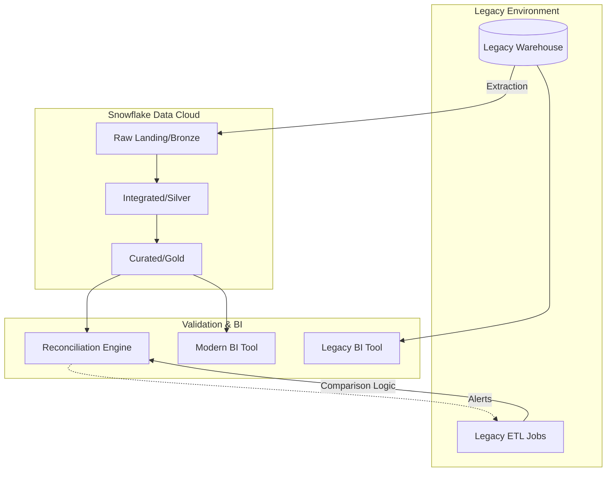

## Migration and Adoption Strategies

### Section at a Glance
**What you'll learn:**
- Evaluating and selecting migration patterns (Lift-and-Shift vs. Re-architecting).
- Implementing phased migration strategies to minimize business disruption.
- Strategies for data validation and reconciliation between legacy and Snowflake environments.
- Managing "Coexistence" architectures where legacy and Snowflake systems run in parallel.
- Driving user adoption and organizational change management.

**Key terms:** `Lift-and-Shift` · `Re-platforming` · `Coexistence` · `Data Reconciliation` · `Parallel Run` · `Change Management`

**TL;DR:** Successful Snowflake adoption is less about moving data and more about transitioning workloads; choose a pattern that balances speed-to-value (Lift-and-Shift) with long-term efficiency (Re-architecting) while maintaining data integrity through rigorous validation.

---

### Overview
For most enterprises, the decision to move to Snowflake isn't a single "event" but a strategic transition. The primary business driver is usually the "Data Gravity" problem: legacy on-premises warehouses (like Teradata or Netease) or aging Hadoop clusters have become too expensive to scale and too rigid to support modern, real-time analytics. 

The fundamental challenge in migration is the "Risk vs. Value" trade-off. A "Big Bang" migration—moving everything at once—promises rapid decommissioning of old hardware but carries an astronomical risk of business downtime and data loss. Conversely, a slow, overly cautious migration might leave the organization paying for two expensive environments for years, eroding the ROI of the Snowflake investment.

This section covers the architectural patterns used to navigate this transition. We will explore how to move from a state of "Rehosting" (simply moving SQL and data) to "Re-architecting" (leveraging Snowflake-native features like Snowpark and Dynamic Tables) to ensure that the migration doesn't just move existing technical debt from an on-prem server to the cloud.

---

### Core Concepts

#### 1. Migration Patterns
*   **Lift-and-Shift (Rehosting):** The process of moving existing schemas, tables, and SQL code to Snowflake with minimal changes. 
    *   *Best for:* Rapidly decommissioning expensive legacy hardware.
    *    ⚠️ **Warning:** Simply moving "bad" or inefficient SQL to Snowflake can lead to unexpected compute costs. If your legacy code relies on heavy procedural loops, it will perform poorly and cost more in Snowflake.
*   **Re-platforming:** Moving the data and logic but adjusting the code to use Snowflake-native features (e.g., replacing complex stored procedures with SQL or Snowpark).
*   **Re-architecting (Refactoring):** Completely redesigning the data model and ETL/ELT pipelines to take advantage of Snowflake’s multi-cluster shared data architecture. 
    *   📌 **Must Know:** This is where the true ROI of Snowflake is realized, specifically through the use of **Dynamic Tables** and **Streams/Tasks** to replace traditional, heavy-weight batch ETL.

#### 2. Adoption Strategies
*   **The Parallel Run (Coexistence):** Running the legacy system and Snowflake simultaneously. Both systems receive the same data inputs, and outputs are compared for parity.
*   **Phased Migration (Workload-based):** Migrating one business unit or one specific use case (e.g., "Marketing Analytics") at a time. This allows the data engineering team to learn and iterate.
*   **Change Management:** Addressing the "People" side of migration. This includes retraining SQL developers on Snowflake-specific syntax and teaching BI analysts how to leverage the near-infinite scaling of Snowflake.

#### 3. Data Validation and Reconciliation
Migration is only successful if the data is trusted.
*   **Row Count Validation:** The simplest check; ensuring $N$ rows in Source = $N$ rows in Target.
*   **Checksum/Aggregate Validation:** Comparing `SUM(revenue)` or `AVG(price)` across critical columns between systems.
*   **Schema Validation:** Ensuring data types, precision (especially for `NUMBER` types), and nullability have been preserved.

---


### Architecture / How It Works

The following diagram illustrates a **Phased Re-platforming** pattern, where legacy data is incrementally ingested into Snowflake while a validation layer ensures parity.



1.  **Legacy Warehouse:** The source of truth during the initial migration phase.
2.  **Extraction/Ingestion:** Tools like Fivetran, Airbyte, or custom Python scripts move data from the source to Snowflake Raw layers.
3.  **Snowflake Processing (Bronze $\rightarrow$ Gold):** The transformation of data using Snowflake-native logic (SQL, Snowpark).
4.  **Reconciliation Engine:** A specialized set of queries or tools that compare aggregates between the Legacy Warehouse and Snowflake.
5.  **Dual BI Layer:** During the coexistence phase, both the legacy and new BI tools point to their respective sources, allowing for a side-by-side comparison of report outputs.

---

### Comparison: When to Use What

| Option | Best For | Trade-offs | Approx. Cost Signal |
| :--- | :--- | :--- | :--- |
| **Lift-and-Shift** | Quick decommissioning of on-prem hardware. | High technical debt; carries over inefficient patterns. | Low initial effort; potentially high long-term compute cost. |
| **Phased Migration** | Large, complex enterprises with high risk-aversion. | Longer migration timeline; requires managing two environments. | 💰 **High:** Paying for both legacy and Snowflake simultaneously. |
| **Re-architecting** | High-growth companies needing real-time insights. | Highest upfront engineering effort and time. | Low long-term cost due to optimized, Snowflake-native pipelines. |

**How to choose:** If your primary driver is **cost reduction** of expiring hardware, prioritize **Lift-and-Shift**. If your driver is **business agility** and modernizing the data stack, prioritize **Re-architecting**.

---

### Cost Cheat Sheet

| Scenario | Recommended Option | Key Cost Driver | Watch Out For |
| :--- | :--- | :--- | :--- |
| **Initial Bulk Load** | Large Warehouse (e.g., 2XL) | Compute Time (Warehouse Size) | ⚠️ Unnecessary "over-provisioning" for small files. |
| **Incremental Daily Updates** | Small Warehouse (e.g., X-Small) | Number of Files & Cloud Services | High frequency of tiny files causing high Cloud Service overhead. |
  | **Running Dual Environments** | Phased Approach | Total Monthly Snowflake Credit Consumption | 💰 **The "Double Spend" Trap:** Running legacy and Snowflake at full scale. |
  | **Validation/Reconciliation** | Medium Warehouse | Complexity of Join/Aggregation Logic | Running massive "cross-system" joins that spill to remote disk. |

> 💰 **Cost Note:** The single biggest cost mistake during migration is failing to shut down legacy ETL processes once the Snowflake pipeline is validated. This leads to "double-processing" where the same data is being transformed twice—once in the old system and once in Snowflake.

---

### Service & Tool Integrations

1.  **Data Movement (Ingestion):**
    *   **Fivetran/Airbyte:** For automated, low-code replication of SaaS and DB sources.
    *   **Snowpipe:** For continuous, event-driven ingestion from Cloud Storage (S3/GCS/Azure Blob).
2.  **Transformation (The "T" in ELT):**
    *   **dbt (data build tool):** Essential for managing the transformation logic and documentation in a modern Snowflake migration.
3.  **Observability & Validation:**
    *   **Monte Carlo / Great Expectations:** For automated data quality monitoring to ensure the migration hasn't introduced regressions.

---

### Security Considerations

During a migration, the "attack surface" increases because data exists in two places.

| Control | Default State | How to Enable / Strengthen |
| :--- | :--- | :--- |
| **Network Isolation** | Accessible via Public Internet (via Proxy) | Implement **Network Policies** to restrict access to known corporate IPs/VPCs. |
| **Data Encryption** | AES-25/256 (Always On) | Use **Tri-Secret Secure** if you need to manage your own keys (BYOK). |
| **Access Control** | RBAC (Role-Based) | Implement a **Least Privilege** model; do not migrate `ACCOUNTADMIN` permissions to all users. |
| **Auditability** | `QUERY_HISTORY` available | Use **Snowflake Horizon** to monitor sensitive data access and lineage. |

---

### Performance & Cost

A common migration bottleneck is **Data Skew** and **Spilling**. When migrating large tables, if your Snowflake Warehouse size is too small for the volume of data being transformed, you will see "Spilling to Remote Storage."

**Example Cost Scenario:**
Imagine you are migrating a 10TB table.
*   **Scenario A (Small Warehouse - X-Small):** The query takes 10 hours due to heavy spilling to S3. Cost: 10 hours $\times$ 1 credit/hr = **10 Credits**.
*   **Scenario B (Large Warehouse - Large):** The query takes 30 minutes because the larger memory footprint handles the data in-memory. Cost: 0.5 hours $\times$ 8 credits/hr = **4 Credits**.

**The Lesson:** In migrations, larger warehouses are often *cheaper* for massive, heavy-lift operations because they finish significantly faster, reducing the total "compute-hours" billed.

---

### Hands-On: Key Operations

**1. Validating Row Counts between Source and Target**
Run this after an ingestion task to ensure no data was lost during the `COPY INTO` process.
```sql
-- Run this on both the legacy system and Snowflake
SELECT COUNT(*) FROM target_table;
-- Compare the result with the source_table count.
```
> 💡 **Tip:** Don't just check the total count; check the count grouped by a "date" or "region" column to find specifically *where* the loss occurred.

** 2. Implementing a simple Reconciliation Check**
This query compares the sum of a key metric (e.g., Sales) between two tables.
```sql
-- Comparing the 'Sales' metric across two different schemas during migration
SELECT 
    'Legacy_System' as Source, SUM(amount) as Total_Sales FROM legacy_db.sales
UNION ALL
SELECT 
    'Snowflake_System' as Source, SUM(amount) as Total_Sales FROM snowflake_db.sales;
```

**3. Cleaning up after a migration (Cost Management)**
Once a migration phase is complete, drop the temporary ingestion warehouses.
```sql
-- Permanently remove the warehouse used only for the migration bulk-load
DROP WAREHOUSE MIGRATION_BULK_LOAD_WH;
```

---

### Customer Conversation Angles

**Q: How long will it take to move our entire data warehouse to Snowflake?**
**A:** It depends on your pattern; a Lift-and-Shift of existing schemas can take weeks, while a full Re-architecting of complex pipelines typically takes months of engineering effort.

**Q: We are worried about our BI reports showing different numbers during the transition. How do we prevent this?**
**A:** We recommend a "Parallel Run" strategy where we use a reconciliation engine to compare the outputs of your legacy BI and Snowflake BI side-by-side before we decommission the old system.

**Q: Won't running both our legacy system and Snowflake simultaneously double our costs?**
**A:** There is an initial period of increased spend, but we mitigate this by using a phased approach and strictly managing the lifecycle of the migration warehouses.

**Q: Can we just move our existing ETL tools (like Informatica or DataStage) as they are?**
**A:** You can, but you won't see the full benefits of Snowflake; we recommend "Re-platforming" those tasks to Snowflake-native tools like dbt or Snowpipe to reduce latency and cost.

**Q: How do we ensure our security standards are maintained during the move?**
**A:** Snowflake provides enterprise-grade encryption and network policies out-of-the-box, and we will implement a "Least Privilege" RBAC model from day one of the migration.

---

### Common FAQs and Misconceptions

**Q: Does "Lift-and-Shift" mean we don't have to change any SQL?**
**A:** Most standard SQL will work, but ⚠️ you must review any procedural logic (loops, cursors) that may perform poorly in a cloud-native environment.

**Q: Is the migration a one-time project?**
**A:** The *initial* migration is a project, but "Adoption" is an ongoing process of evolving your data architecture.

**Q: Can we migrate our data while our business is still running?**
**A:** Yes, using a phased approach or parallel runs, we can migrate workloads without any downtime to your end-users.

**Q: Do we need to rewrite all our Python/Java code?**
**A:** No, if you use **Snowpark**, you can bring much of your existing Python or Java logic directly into Snowflake.

**Q: Will we lose our historical data?**
**A:** Not if we implement a rigorous data validation and reconciliation framework as part of the migration plan.

**Q: Is Snowflake's pricing predictable during a migration?**
**A:** It can be volatile if you are unmonitored; ⚠️ we strongly recommend setting up **Resource Monitors** before the migration begins to prevent budget overruns.

---

### Exam & Certification Focus

*   **Migration Patterns (Domain: Data Architecture):** Understand the difference between Rehosting, Re-platforming, and Re-architecting. 📌 *High Frequency.*
*   **Data Validation (Domain: Data Engineering):** Be able to explain how to prove data integrity between two systems.
*   **Cost Management (Domain: Snowflake Operations):** Understand the implications of "Double Spending" and how to use Resource Monitors during a migration.
*   **Snowflake Horizon (Domain: Security/Governance):** Know how to use built-in features to maintain governance during a transition.

---

### Quick Recap
- **Choose your pattern wisely:** Lift-and-Shift for speed; Re-architecting for long-term ROI.
- **Minimize risk via Phased Migration:** Move workloads one by one rather than a "Big Bang."
- **Validate everything:** Use row counts and aggregates to ensure parity between legacy and Snowflake.
- **Watch the "Double Spend":** Manage the cost of running parallel environments and decommission old ETLs promptly.
- **Embrace Snowflake-native features:** The true value of migration lies in adopting Snowpark, Dynamic Tables, and Snowpipe.

---

### Further Reading
**Snowflake Documentation** — Detailed guides on the `COPY INTO` command and data loading best practices.
**Snowflake Whitepaper: Migration to Snowflake** — Strategic architectural patterns for moving from legacy warehouses.
**dbt Documentation** — How to implement modern transformation layers during a migration.
**Snowflake Architecture Guide** — Understanding the multi-cluster shared data architecture to plan for scaling.
**Snowflake Best Practices: Performance** — Guidance on avoiding common pitfalls like disk spilling during large-scale data moves.