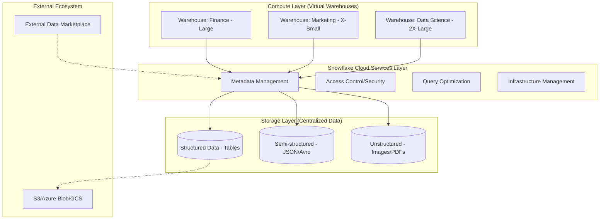

## Snowflake Use Cases and Competitive Positioning

### Section at a Glance
**What you'll learn:**
- Identifying the core business drivers for Snowflake adoption (The "Data Silo" problem).
- Evaluating Snowflake against competitors like BigQuery, Datasticks, and Redshift.
- Deep dive into advanced use cases: Data Sharing, Data Clean Rooms, and the Data Marketplace.
- Mapping technical features (Zero-copy cloning, Snowpipe) to specific business outcomes.
- Understanding the "Data Lakehouse" evolution and Snowflake's role in unstructured data processing.

**Key terms:** `Data Sharing` · `Data Marketplace` · `Data Clean Rooms` · `Multi-cloud` · `Data Lakehouse` · `Zero-copy Cloning`

**TL;DR:** Snowflake is not just a data warehouse; it is a global data network. Its competitive advantage lies in its ability to decouple storage from compute and share data instantaneously across organizations without moving or copying physical files.

---

### Overview
In the modern enterprise, the greatest cost is not storage—it is the friction of data movement. Traditionally, if Company A wanted to share data with Company B, they had to export CSVs, upload them to an FTP or S3 bucket, and notify the partner. This creates "data latency" and significant "egress costs."

Snowflake solves this by treating data as a shared utility. By leveraging a multi-cluster, shared-data architecture, Snowflake allows organizations to move from a "Siloed Warehouse" model to a "Data Network" model. This section explores how Snowflake positions itself as the central nervous and nervous system for data-driven companies, whether they are performing classical BI, real-time streaming, or cross-organizational data collaboration via Data Clean Rooms.

We will examine why an architect would choose Snowflake over "Big Data" incumbents and how the platform's unique ability to handle structured, semi-structured, and unstructured data simultaneously makes it a cornerstone of the modern Data Lakehouse strategy.

---

### Core Concepts

#### 1. Enterprise Data Warehousing (EDW) & BI
The foundational use case. Snowflake serves as the single source of truth for historical and operational data.
- **Business Impact:** Eliminates "version of the truth" conflicts between departments.
- **Key Feature:** Multi-cluster warehouses allow the Finance team's heavy reporting to run on one cluster while the Marketing team's ad-hoc queries run on another, ensuring zero resource contention. 📌 **Must Know:** This separation is why Snowflake handles "concurrency" better than traditional single-cluster engines.

#### 2. Data Sharing & The Snowflake Marketplace
Unlike traditional methods, Snowflake Sharing allows a provider to grant access to specific objects in their account to another Snowflake account.
- **Mechanism:** No data is moved. The consumer queries the provider's metadata and reads the provider's underlying storage (S3/Azure Blob/GCS) via the Snowflake engine.
- ⚠️ **Warning:** While the data doesn't move, the *compute* cost of running queries on that shared data is incurred by the account running the query (the consumer), unless the provider uses a "Reader Account."

#### 3. The Data Lakehouse (Unstructured Data)
Snowflake has evolved from a structured SQL engine to a Lakehouse. It can now manage unstructured data (images, PDFs, audio) using **Directory Tables**.
- **Business Impact:** Reduces the need to maintain a separate, complex Hadoop or Spark cluster for machine learning features.
- 💡 **Tip:** Use Directory Tables to create a searchable index of your S3/Azure/GCS files directly within Snowflake metadata.

#### 4. Real-time Streaming with Snowpipe
Snowpipe provides a continuous data ingestion service.
- **Mechanism:** It listens to cloud storage notifications (e.g., S3 Event Notifications) and automatically ingests new files as they land.
- 💰 **Cost Note:** Snowpipe uses "Serverless" compute. You are charged based on the number of files processed and the compute resources used, not by a running warehouse. This is much cheaper for intermittent, small file arrivals than keeping a Large Warehouse running 24/7.

---

### Architecture / How It Works

The following diagram illustrates the decoupling of the three layers that enable Snowflake's unique use cases.



1. **Cloud Services Layer:** The "Brain" that handles authentication, metadata, and query parsing.
2. **Compute Layer (Virtual Warehouses):** The "Muscle" where the actual SQL execution happens; these can be scaled up or out instantly.
3. **Storage Layer:** The "Memory" where the actual data resides in a proprietary, compressed, columnar format.
4. **External Ecosystem:** Integration points for raw data landing and third-party data consumption.

---

### Comparison: When to Use What

| Option | Best For | Trade-offs | Approx. Cost Signal |
| :--- | :--- | :--- | :--- |
| **Snowflake** | Multi-cloud, Data Sharing, and Unified Analytics (SQL + ML). | Higher cost for extremely high-frequency, sub-second "point lookups." | Premium for ease of use and zero-management. |
| **Databricks** | Heavy-duty Data Engineering, Spark-based ML, and deep Data Science. | Higher complexity; requires managing clusters and libraries. | Cost-effective for massive-scale ETL/Transform. |
| **Google BigQuery** | Google-native ecosystems and highly "bursty" serverless workloads. | Deeply tied to GCP; scaling is managed by Google (less granular control). | Pay-per-query or capacity-based (Slots). |
| **Amazon Redshift** | AWS-centric organizations with very predictable, 24/7 workloads. | Less flexibility in decoupling storage/compute compared to Snowflake. | Lower cost for "always-on" steady-state workloads. |

**How to choose:** If your priority is **Data Collaboration and ease of management**, choose Snowflake. If your priority is **Massive-scale Spark processing**, choose Databrint. If your priority is **Deep AWS integration and cost-predictability for fixed workloads**, choose Redshift.

---

### Cost Cheat Sheet

| Scenario | Recommended Option | Key Cost Driver | Watch Out For |
| :--- | :--- | :--- | :--- |
| **Continuous Data Ingestion** | Snowpipe | Number of files and compute time. | "Small file problem" (too many tiny files = high overhead). |
| **Periodic Monthly Reporting** | Standard Warehouse (Auto-suspend) | Warehouse size and duration of activity. | High `auto_suspend` threshold (leaving warehouses running idle). |
| **Data Science / ML Training** | Large/X-Large Warehouse | Warehouse size and duration. | Spilling to local/remote disk (indicates warehouse is too small). |
| **Cross-Org Data Sharing** | Direct Sharing | Consumer's compute usage. | 💰 **Egress costs** if the consumer is in a different cloud region/provider. |

> 💰 **Cost Note:** The single biggest mistake in Snowflake cost management is failing to set an **Auto-Suspend** timer. A warehouse left "Running" while idle can burn through a budget in hours. Always set a low auto-suspend (e.g., 60 seconds) for non-critical workloads.

---

### Service & Tool Integrations

1. **ELT/ETL Pipelines (e.g., dbt, Fivetran):**
   - Data is moved from source to Snowflake (Extract/Load).
   - Snowflake performs the transformations using its own compute (Transform).
2. **Business Intelligence (e.g., Tableau, Looker, PowerBI):**
   - Connect via standard ODBC/JDBC drivers.
   - Snowflake's query optimizer handles the heavy lifting, delivering fast dashboard refreshes.
3. **Data Science (e.g., Python, Snowpark):**
   - Use Snowpark to execute Python/Java/Scala code directly within Snowflake's engine.
   - This eliminates the need to move data out of Snowflake to an external Spark cluster.

---

  ### Security Considerations

Snowflake provides a "Security-First" architecture. Because data is shared, the following controls are critical.

| Control | Default State | How to Enable / Strengthen |
| :--- | :--- | :--- |
| **Encryption at Rest** | Enabled (AES-256) | Managed by Snowflake; supports Tri-Secret Secure (Customer-managed keys). |
| **Encryption in Transit** | Enabled (TLS 1.2) | Standard for all connections. |
| **Network Isolation** | Accessible via Public URL | Use **Network Policies** to restrict access to specific IP ranges/VPCs. |
| **Data Masking** | Plain text (if permissions allow) | Implement **Dynamic Data Masking** to hide PII from certain roles. |

---

### Performance & Cost

**The "Spilling" Problem:**
When a query's working set (data being processed in memory) exceeds the memory available in the Virtual Warehouse, Snowflake "spills" the data to the local disk (SSD), and eventually to the remote storage (S3/Azure Blob).

- **Spilling to Local Disk:** Performance degradation (noticeable).
- **Spilling to Remote Storage:** Massive performance collapse (catastrophic).

**Example Scenario:**
You run a complex `JOIN` on a 1TB table using an `X-Small` warehouse. The query takes 2 hours and costs $5.00 in credits.
If you scale to a `Large` warehouse, the query might finish in 10 minutes and cost $5.00.
**The Result:** You spent the same amount of money, but the business got the answer 110 minutes faster. This is the "Power of Scaling" without changing your budget.

---

### Hands-On: Key Operations

**1. Creating a Zero-Copy Clone**
This creates a metadata-only copy of a production table for testing, without duplicating storage costs.
```sql
-- Create a clone of the production orders table for the dev environment
CREATE TABLE orders_dev CLONE orders_prod;
```
> 💡 **Tip:** Cloning is instantaneous regardless of the table size because it only copies the metadata.

**2. Setting up a Secure View for Data Sharing**
When sharing data, you should never share base tables. Use a Secure View to mask sensitive columns.
```sql
-- Create a view that masks the customer's credit card number
CREATE OR REPLACE SECURE VIEW shared_orders_view AS
SELECT 
    order_id,
    customer_id,
    regexp_replace(credit_card, '(\d{4})-(\d{4})-(\d{4})', 'XXXX-XXXX-XXXX') as masked_cc
FROM orders_prod;
```
> 📌 **Must Know:** Using the `SECURE` keyword prevents users from seeing the underlying SQL logic via `GET_DDL`.

---

### Customer Conversation Angles

**Q: "We are already using AWS S3 for our data lake. Why do we need Snowflake?"**
**A:** "S3 is a great storage layer, but it's 'passive.' Snowflake provides an 'active' compute and metadata layer that allows you to query that data with SQL, manage security via RBAC, and share it with partners instantly without moving the files."

** <b>Q: "If we use Snowflake, how do we avoid massive costs when our data scientists run heavy queries?"</b>
**A:** "We implement separate, isolated Virtual Warehouses for Data Science. We can set strict auto-suspend policies and resource monitors on those specific warehouses so they can't impact your BI performance or your budget."

**Q: "How is Snowflake's security different from our on-premise warehouse?"**
**A:** "Snowflake provides 'Security by Default' with AES-256 encryption and automated patching. We can further strengthen it using Network Policies to ensure only your corporate VPN can access the data."

**Q: "Can we use Snowflake for our unstructured image data?"**
**A:** "Yes. With Directory Tables and Snowpark, you can catalog, metadata-search, and even run Python-based machine learning models directly against those images without ever moving them out of the platform."

**Q: "Does Data Sharing mean I have to pay for my customers' compute usage?"**
**A:** "Not necessarily. If you use 'Reader Accounts,' you manage the compute. If you share via the standard method, your customers use their own compute, meaning you only pay for the storage and the metadata management."

---

### Common FAQs and Misconceptions

**Q: Does Snowflake move my data to their cloud?**
**A:** Snowflake stores your data in your chosen cloud provider's region (AWS, Azure, or GCP). ⚠️ **Warning:** It does not move data *between* clouds unless you explicitly set up a cross-region replication.

**Q: Is Snowflake a 'Black Box'?**
**A:** While Snowflake manages the underlying infrastructure, it provides full transparency through the `QUERY_HISTORY` and `ACCESS_HISTORY` views.

**Q: Is Snowflake only for SQL users?**
**A:** While SQL is the primary interface, **Snowpark** allows engineers to use Python, Java, and Scala, bringing much of the Data Science ecosystem into the platform.

**Q: Does 'Zero-Copy Cloning' mean I'm paying for double the storage?**
**A:** No. ⚠️ **Warning:** You only pay for the *changes* made to the clone. The initial clone costs $0 in additional storage.

**Q: Can Snowflake replace our existing S3 Data Lake?**
**A:** It shouldn't necessarily *replace* it, but it *unifies* it. It acts as the high-performance compute and governance layer on top of your existing files.

**Q: Is Snowflake 'Serverless'?**
**A:** The *management* is serverless (no tuning VMs), but the *compute* (Warehouses) is "Virtual" and must be managed/scaled by the user to control costs.

---

### Exam & Certification Focus
*Refining for Snowflake SnowPro Core Certification*

- **Data Sharing (Domain: Data Warehouse/Data Sharing):** Understand the difference between a Share, a Reader Account, and the Marketplace. 📌 **High Frequency.**
- **Virtual Warehouse Scaling (Domain: Compute):** Know the difference between "Scaling Up" (larger size) and "Scaling Out" (Multi-cluster).
- **Zero-Copy Cloning (Domain: Storage):** Understand that it is a metadata operation and does not duplicate physical data.
- **Snowpipe (Domain: Data Ingestion):** Understand the serverless nature and how it responds to cloud storage events.
- **Storage Costs vs. Compute Costs (Domain: Cost Management):** Distinguish between the cost of data at rest vs. the cost of queries.

---

### Quick Recap
- Snowflake's core value is the **decoupling of storage and compute**.
- **Data Sharing** enables a "Data Network" without the cost or latency of data movement.
- **Snowpark** extends Snowflake's capabilities to Python and Java developers.
- **Cost Control** relies heavily on managing Virtual Warehouse **Auto-Suspend** and **Resource Monitors**.
- **Multi-cloud capability** allows for consistent architecture across AWS, Azure, and GCP.

---

### Further Reading
**Snowflake Documentation** — The definitive source for all SQL syntax and feature capabilities.
**Snowflake Architecture Whitepaper** — Deep dive into the multi-cluster, shared-data architecture.
**Snowflake Marketplace Guide** — How to discover and consume third-party datasets.
**Snowpark Developer Guide** — Instructions on running non-SQL code within Snowflake.
**Snowflake Security Best Practices** — Comprehensive guide on Network Policies and Data Masking.