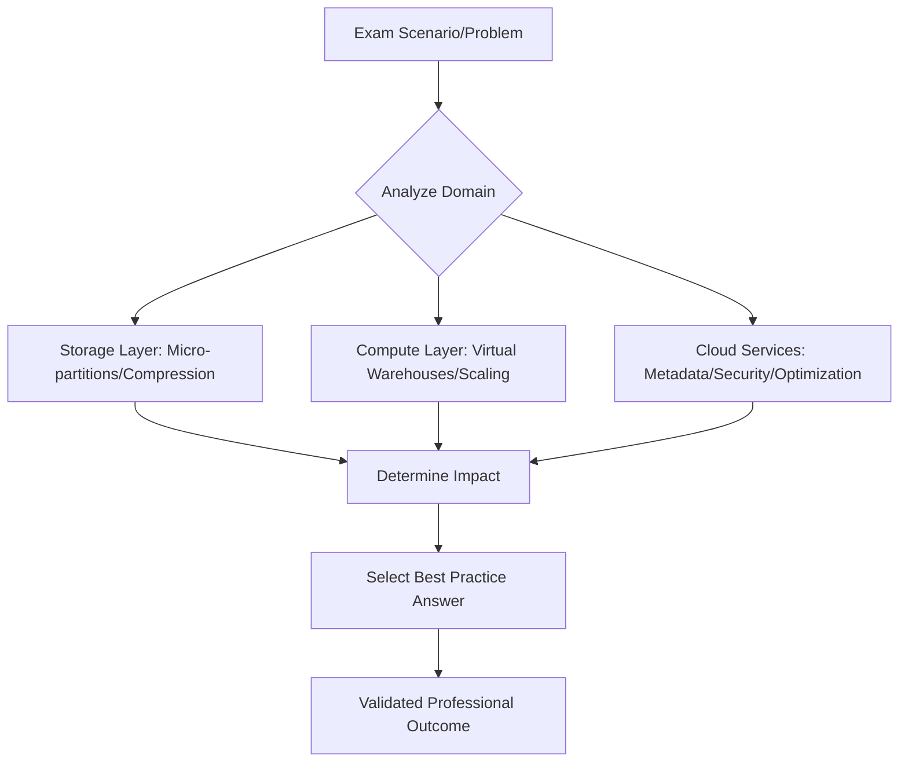

## Certification Exam Preparation

### Section at a Glance
**What you'll learn:**
- Deciphering the SnowPro Core exam domains and weightings.
- Strategies for identifying "distractor" answers in complex multiple-choice scenarios.
- Mapping theoretical architectural knowledge to practical troubleshooting.
- Developing a high-intensity study plan centered on the Snowflake Documentation.
- Leveraging certification to build professional credibility and enterprise trust.

**Key terms:** `SnowPro Core` · `Exam Domains` · `Distractor Answers` · `Architectural Validation` · `Hands-on Lab` · `Service Level Agreements (SLAs)`

**TL;DR:** Passing the Snowflake certification is not about memorizing facts; it is about demonstrating an architect-level understanding of how Snowflake’s unique multi-cluster shared data architecture mitigates operational risk and optimizes cost.

---

### Overview
For a Data Engineer, a certification is more than a digital badge; it is a formal validation of your ability to manage enterprise-grade data workloads. In a cloud-native ecosystem, organizations face significant "Day 2" operational risks—unexpected cost spikes, security breaches, and performance degradation. A certified professional provides the assurance that they understand the underlying mechanics of the Snowflake engine, not just the SQL syntax.

The Snowflake SnowPro Core exam is designed to test your ability to make informed architectural decisions. It moves beyond "how to write a query" into "how to structure a warehouse for concurrency" or "how to implement fine-grained access control without breaking downstream ETL pipelines." 

This final section provides the strategic framework required to approach the exam with the mindset of a Senior Solutions Architect. We will focus on synthesizing the technical depth covered in previous modules into the specific patterns tested by Snowflake, ensuring you can navigate even the most ambiguous exam questions.

---

### Core Concepts

**1. The Domain Framework**
The exam is partitioned into specific domains. You cannot afford to be "good at SQL" but "weak on Security."
*   **Snowflake Architecture (High Weight):** Focus on the separation of Storage, Compute, and Cloud Services. 📌 **Must Know:** You must understand exactly which tasks are handled by the Cloud Services layer (e.g., metadata management, access control, query optimization) versus the Virtual Warehouse.
*   **Data Movement & Loading:** Understanding `COPY INTO` vs. Snowpipe, and the nuances of file formats and error handling.
*   **Performance Management:** Understanding micro-partitions, clustering, and caching (Result, Metadata, and Warehouse caches). ⚠️ **Warning:** Do not confuse the Result Cache (which persists after a warehouse shuts down) with the Metadata Cache; the exam frequently tests the lifecycle of these different layers.
*   **Security & Governance:** Focus on RBAC (Role-Based Access Control), Network Policies, and Data Masking.

**2. The "Architectural Mindset" for Testing**
Exam questions are often scenario-based. They won't ask "What is a warehouse?" They will ask, "A customer is experiencing concurrency issues during the 9 AM ETL window; which adjustment provides the most cost-effective solution?"
*   **Identify the Constraint:** Is the problem Cost, Performance, or Complexity?
*   **Evaluate the Trade-offs:** Every architectural choice in Snowflake has a cost implication.

**3. Identifying Distractors**
Snowflake uses "distractor" answers—options that are technically possible in other cloud databases but incorrect or suboptimal in Snowflake. 
> 💡 **Tip:** When an answer choice suggests a manual, high-maintenance process (like manually re-partitioning tables), it is almost certainly a distractor. Snowflake is designed for automation.

---

### Architecture / How It Works

The following diagram illustrates the "Cognitive Map" you should use when approaching exam questions regarding Snowflake's components.



1.  **Exam Scenario:** The raw technical problem or business requirement presented in the question.
2.  **Analyze Domain:** The mental process of categorizing the problem into Architecture, Security, or Loading.
3.  **Storage/Compute/Services:** The three-tier architectural breakdown used to evaluate the solution.
4.  **Determine Impact:** Assessing how the solution affects cost, concurrency, or data integrity.
*   **Validated Professional Outcome:** The final selection of the most efficient, Snowflake-native solution.

---

### Comparison: Certification Levels

| Level | Target Audience | Focus Area | Exam Complexity | Cost Signal |
| :--- | :--- | :--- | :--- | :--- |
| **SnowPro Core** | Data Engineers/Architects | Fundamental architecture, features, and usage. | Moderate (Foundational) | Standard Exam Fee |
| **SnowPro Advanced (Data Engineer)** | Senior Data Engineers | Complex ETL, performance tuning, and data pipelines. | High (Deep Technical) | Higher Fee |
| **SnowPro Advanced (Architect)** | Solutions Architects | Multi-account strategy, security, and enterprise integration. | Very High (Strategic) | Higher Fee |

**How to choose:** Start with **SnowPro Core**. It is the prerequisite for all advanced certifications and establishes the essential vocabulary needed for higher-level architectural discussions.

---

### Cost Cheat Sheet

| Scenario | Recommended Study Option | Key Cost Driver | Watch Out For |
| :--- | :--- | :--- | :--- |
| **First-time Certification** | Official Snowflake Documentation + Hands-on | Time investment in lab environments. | ⚠️ Relying solely on third-party "dumps." |
| **Exam Retake** | Targeted gap analysis via practice exams | The cost of the retake fee. | 💰 **Cost Note:** Retake fees are non-refundable and can add up quickly. |
 	| **Deep-dive Tuning** | Snowflake Trial Account + Real-world datasets | Data egress/ingress and warehouse uptime. |
| **Enterprise Training** | Structured Coursework (like this one) | Training hours/opportunity cost. | Not applying theory to practical SQL. |

> 💰 **Cost Note:** The single biggest cost mistake in certification prep is "Tutorial Hell"—spending money on endless video courses without ever running a `CREATE WAREHOUSE` command in a live Snowflake instance. Hands-on experience is the only way to internalize the architecture.

---

### Service & Tool Integrations

To pass the exam, you must understand how Snowflake sits within the broader ecosystem:

1.  **Cloud Providers (AWS/Azure/GCP):** Understanding how Snowflake leverages S3/Blob/GCS for external stages.
2.  **BI Tools (Tableau/Looker/PowerBI):** Understanding how warehouse sizing impacts dashboard concurrency.
3.  **Data Integration (dbt/Fivetran):** Understanding the role of Snowflake as the compute engine for transformation logic.
4.  **Infrastructure as Code (Terraform):** Understanding how to automate the deployment of roles and warehouses.

---

### Security Considerations

The exam heavily weights your ability to protect data.

| Control | Default State | How to Strengthen |
| :--- | :--- | :--- |
| **RBAC (Role-Based Access Control)** | Users assigned to primary roles. | Implement a hierarchical role structure (Functional -> Access roles). |
| **Network Access** | Accessible via public internet (if permitted). | Implement **Network Policies** to restrict access to specific IP ranges. |
 	| **Data Encryption** | AES-256 (Always On). | Use **Tri-Secret Secure** for enhanced control over keys. |
 	| **Audit Logging** | `ACCESS_HISTORY` view available. | Regularly monitor `QUERY_HISTORY` for anomalous patterns. |

---

### Performance & Cost

The exam will test your ability to balance the "Performance vs. Cost" seesaw.

**Scenario:** A company has a dashboard that refreshes every 5 minutes. It currently uses a `Small` warehouse, but users complain of latency.
*   **Option A (Scale Up):** Change to `Medium`. 
    *   *Result:* Faster single queries, but higher cost per hour.
*   **Option B (Scale Out):** Enable Multi-cluster Warehouse (MCW).
    *   *Result:* Handles more concurrent users, prevents queuing, but does not make a single query faster.

**Example Cost Calculation:**
If a `Small` warehouse (2 credits/hr) runs 24/7, it costs 48 credits/day. If you "Scale Up" to `Large` (8 credits/hr) to solve a concurrency problem (when you should have scaled *out*), you have tripled your daily cost by 300% without actually solving the queuing issue.

---

### Hands-On: Key Operations

The following SQL pattern simulates the "Audit and Optimize" workflow you will be tested on.

**First, check for warehouse queuing (a sign you need to scale out):**
```sql
-- Check for queued queries in the last 24 hours
SELECT 
    WAREHOUSE_NAME, 
    QUEUED_PROBES_COUNT, 
    AVG(QUEUED_OVERLOAD_TIME) 
FROM SNOWFLAKE.ACCOUNT_USAGE.QUERY_HISTORY
WHERE START_TIME >= DATEADD(day, -1, CURRENT_TIMESTAMP())
GROUP BY 1;
```
> 💡 **Tip:** If `QUEUED_OVERLOAD_TIME` is high, your issue is **concurrency** (Scale Out/MCW). If `EXECUTION_TIME` is high, your issue is **query complexity** (Scale Up/Larger Warehouse).

**Second, verify if a table is using a cluster key (to ensure pruning efficiency):**
```sql
-- Verify clustering depth to see if manual clustering is needed
SELECT SYSTEM$CLUSTERING_INFORMATION('MY_DATABASE.MY_SCHEMA.MY_TABLE', '(COLUMN_NAME)');
```

---

### Customer Conversation Angles

**Q: "We are worried about the cost of Snowflake scaling up automatically. Will we get a massive bill?"**
**A:** "Snowflake provides granular control via Resource Monitors, which allow us to set hard limits and alerts to automatically suspend warehouses if they hit a specific credit threshold."

**Q: "How do we ensure our sensitive PII data isn't visible to all analysts?"**
**A:** "We implement Dynamic Data Masking and Row-Level Security, ensuring that users only see the data their specific role is authorized to view, even if they have access to the table."

** 	| Q: "Can we use Snowflake for both our real-time streaming and our batch ETL without them interfering?"**
**A:** "Yes, by using separate Virtual Warehouses for each workload, we provide workload isolation so that a heavy ETL job won't impact the latency of your real-time dashboards."

**Q: "What happens to our data if we stop paying our Snowflake subscription?"**
**A:** "Your data remains stored in the persistent storage layer, but access to compute resources is suspended; however, our focus is on designing architectures that ensure high availability and disaster recovery via cross-region replication."

**Q: "Is it difficult to migrate our existing SQL scripts to Snowflake?"**
**A:** "Since Snowflake is ANSI SQL compliant, most of your standard SQL logic will work out of the box, though we will optimize your scripts to take advantage of Snowflake-specific features like semi-structured data querying."

---

### Common FAQs and Misconceptions

**Q: Does scaling a warehouse up (e.g., Small to Large) make all running queries faster?**
**A:** No. ⚠️ **Warning:** Scaling up only affects queries that *start* after the resize. It does not retroactively provide more CPU/RAM to a query already in flight.

**Q: Is Snowflake a 'Data Lake' or a 'Data Warehouse'?**
**A:** It is a 'Data Cloud' that can act as both. It supports structured, semi-structured (JSON), and unstructured data.

**Q: Do I need to manage indexes in Snowflake?**
**A:** No. ⚠️ **Warning:** One of the most common misconceptions is that you need to manage indexes. Snowflake uses micro-partitions and metadata for pruning, eliminating the need for manual index management.

**Q: Can I use Snowflake on-premises?**
**A:** No, Snowflake is a cloud-native SaaS. However, you can use tools to ingest on-premises data into Snowflake.

**Q: Does Snowflake charge for storage even if no queries are running?**
**A:** Yes, you are charged for the average monthly storage used, regardless of compute activity.

---

### Exam & Certification Focus

*   **Domain: Architecture (High Importance):** Focus on the relationship between the three layers and how metadata enables the "Zero Copy Cloning" feature. 📌 **Must Know:** Cloning does *not* duplicate the physical data; it only duplicates the metadata.
*   **Domain: Loading (Medium Importance):** Mastery of `COPY INTO` vs. `Snowpipe` and the importance of file sizing (aim for 100-250MB compressed).
*   **Domain: Security (High Importance):** Focus on the difference between `ACCOUNTADMIN`, `SECURITYADMIN`, and `SYSADMIN`. 📌 **Must Know:** Never use `ACCOUNTADMIN` for daily data engineering tasks.
*   **Domain: Performance (High Importance):** Understanding the Three Caches (Result, Metadata, Warehouse) and how they impact query speed.

---

### Quick Recap
- **Architecture is Key:** Understand the separation of Storage, Compute, and Services.
- **Cost vs. Performance:** Always evaluate scaling *Up* (size) vs. scaling *Out* (concurrency).
- **Automation is Native:** Avoid manual interventions like indexing; rely on micro-partitions.
- **Security is Central:** Master RBAC and Network Policies for enterprise-grade trust.
- **Exam Strategy:** Look for the "Snowflake-native" way to solve the problem; avoid "legacy" manual processes.

---

### Further Reading
**Snowflake Documentation** — The primary source of truth for all feature behaviors and limits.
**Snowflake University** — Essential for hands-on, guided learning paths.
**Snowflake Architecture Whitepaper** — Deep dive into the underlying engine mechanics.
**Snowflake Best Practices Guide** — Critical for understanding the "Architectural Mindset."
**Snowflake SQL Reference** — Necessary for mastering semi-structured data syntax (JSON/Parquet).