# AWS Databricks Data Engineer Certification
### A Comprehensive Udemy Course Guide

**Generated:** 2026-04-09  
**Target Audience:** data engineers familiar with Apache Spark and AWS Glue who want to prepare for the Databricks Certified Data Engineer Associate exam on AWS  
**Total Sections:** 14

---

# Mastering the Lakehouse: AWS Databricks Data Engineer Certification Prep

The landscape of data engineering is undergoing a fundamental shift. The era of managing fragmented data silos—separating your data lake from your data warehouse—is giving way to the **Data Lakehouse** paradigm. For the modern data engineer working within the AWS ecosystem, this means moving beyond traditional ETL patterns to a unified, high-performance architecture.

If you are already proficient in Apache Spark and experienced in managing AWS Glue jobs, you are halfway there. However, mastering **Databricks on AWS** requires a shift in mindset: from managing discrete tasks to orchestrating integrated,-production-grade data pipelines.

### What You Will Gain
This course is designed to transform your existing Spark expertise into specialized Databricks mastery. By the end of this program, you will not only be prepared to ace the **Databricks Certified Data Engineer Associate** exam, but you will also possess the architectural blueprint to build enterprise-scale pipelines.

You will gain hands-on expertise in:
*   **The Medallion Architecture:** Mastering the transition of raw data through Bronze, Silver, and Gold layers to ensure data quality and reliability.
*   **Delta Lake Deep-Dives:** Leveraging ACID transactions, time travel, and schema enforcement to eliminate data corruption.

*   **Advanced Ingestion & Streaming:** Implementing high-efficiency patterns using **Auto Loader** and **Structured Streaming**.
*   **Declarative Engineering:** Moving away from complex manual orchestration toward **Delta Live Tables (DLT)**.
*   **Unified Governance:** Implementing fine-grained access control and lineage using **Unity Catalog**.
*   **Operational Excellence:** Optimizing AWS resource costs, monitoring pipeline health, and executing seamless migrations from **AWS Glue to Databricks**.

### Course Roadmap
We have structured this curriculum into four logical phases:
1.  **Foundations & Infrastructure:** Understanding Databricks architecture on AWS, compute configuration, and the integration with AWS services.
2.  **The Core Engine:** Deep dives into Delta Lake, the Medallion architecture, and efficient ingestion patterns.
3.  **Pipeline Engineering:** Advanced transformations using Spark SQL/PySpark, stream processing, and the power of Delta Live Tables.
4.  **Production & Governance:** Scaling with Unity Catalog, managing costs, implementing observability, and mastering Databricks Workflows.

### Prerequisites
To ensure your success, you should arrive with:
*   **Strong proficiency in Apache Spark** (specifically Spark SQL and/or PySpark).
*   **Experience with AWS fundamentals** (S3, IAM, and basic networking).
*   **Familiarity with AWS Glue** (understanding ETL patterns and Glue Catalog).
*   **Solid SQL skills** for data manipulation and transformation.

### About the Certification
The **Databricks Certified Data Engineer Associate** exam validates your ability to build, deploy, and maintain reliable data pipelines. It tests your knowledge of the Lakehouse architecture, the ability to implement much-needed data quality patterns, and your proficiency in using Databricks-specific features like Delta Lake and DLT to create scalable, production-ready systems.

### How to Use This Material
This course is designed to be **hands-on**. While the theoretical foundations are critical, the true learning happens during the implementation modules. We recommend following the labs closely, as they simulate real-world AWS production environments. Use the "Exam Readiness" section as your final litmus test to identify any gaps in your knowledge before sitting for the official certification.

**Prepare to move beyond simple ETL. It’s time to engineer the future of data.**

---

## Table of Contents

1. [Introduction to Databricks Architecture on AWS](#introduction-to-databricks-architecture-on-aws)
2. [Databricks Compute and Cluster Configuration](#databricks-compute-and-cluster-configuration)
3. [Deep Dive into Delta Lake: ACID, Versioning, and Optimization](#deep-dive-into-delta-lake-acid-versioning-and-optimization)
4. [Implementing Medallion Architecture: Bronze, Silver, and Gold Layers](#implementing-medallion-architecture-bronze-silver-and-gold-layers)
5. [Efficient Data Ingestion with Auto Loader and COPY INTO](#efficient-data-ingestion-with-auto-loader-and-copy-into)
6. [Data Transformation with Spark SQL and PySpark](#data-transformation-with-spark-sql-and-pyspark)
7. [Stream Processing with Structured Streaming](#stream-processing-with-structured-streaming)
8. [Building Declarable Pipelines with Delta Live Tables (DLT)](#building-declarable-pipelines-with-delta-live-tables-dlt)
9. [Data Governance and Security with Unity Catalog](#data-governance-and-security-with-unity-catalog)
10. [Monitoring, Logging, and Observability in Databricks](#monitoring-logging-and-observability-in-databricks)
11. [Cost Management and AWS Resource Optimization](#cost-management-and-aws-resource-optimization)
12. [Migration Strategies: Transitioning from AWS Glue to Databricks](#migration-strategies-transitioning-from-aws-glue-to-databricks)
13. [Orchestration and Automation with Databricks Workflows](#orchestration-and-automation-with-databricks-workflows)
14. [Exam Readiness and Final Review](#exam-readiness-and-final-review)

---

## Introduction to Databricks Architecture on AWS

### Section at a Glance
**What you'll learn:**
- The fundamental separation of the Databricks Control Plane and Data Plane.
- How Databricks leverages AWS native services (S3, EC2, IAM) to provide a Lakehouse architecture.
- The role of Unity Catalog in unified governance across a distributed environment.
- The distinction between All-Purpose, Job, and SQL warehouses in terms of compute and cost.
- The security implications of the Databrability Shared Responsibility Model on AWS.

**Key terms:** `Control Plane` · `Data Plane` · `Unity Catalog` · `Delta Lake` · `Lakehouse` · `Compute/Storage Separation`

**TL;DR:** Databricks on AWS is a multi-layered architecture that separates management (Control Plane) from processing (Data Plane), allowing you to run high-performance Spark workloads directly on your AWS S3 data without moving it out of your VPC.

---

### Overview
In the modern enterprise, the "Data Warehouse vs. Data Lake" debate has historically created a massive architectural tax. Organizations often find themselves maintaining a high-performance, structured warehouse (like Amazon Redshift) for BI, alongside a low-cost, unstructured data lake (like S3) for Machine Learning. This duplication leads to fragmented "silos of truth," inconsistent security models, and significant data egress costs.

The Databricks architecture on AWS solves this by introducing the **Lakehouse architecture**. It provides the performance and ACID transactions of a data warehouse directly on top of your low-cost S3 data lake. For the Data Engineer, this means you no longer need to build complex ETL pipelines just to move data from a "landing" zone to a "reporting" zone; the architecture allows you to treat S3 as your single, authoritative source of truth.

As you transition from AWS Glue or EMR, the most critical shift is understanding that while Databricks manages the "brains" (the orchestration and UI), the "muscle" (the EC2 instances and the S3 data) resides within your AWS ecosystem. This ensures that your data remains under your company's sovereign control and network perimeter.

---

### Core Concepts

#### 1. The Control Plane vs. The Data Plane
The most vital concept for both architects and engineers is the functional split between these two planes.

*   **The Control Plane:** This is the Databricks-managed environment. It hosts the Web UI, the Notebook interface, the cluster management logic, and the metadata for job orchestration. 
    *   📌 **Must Know:** The Control Plane does *not* store your actual business data; it only stores metadata and instructions on how to process it.
*   **The Data Plane:** This is located within **your** AWS account. When you spin up a cluster, Databricks triggers the launch of EC2 instances in your VPC. This is where the Spark executors live and where the actual reading/writing to S3 occurs.
    *   ⚠️ **Warning:** Developers often mistakenly believe that "Databricks manages the data." While they manage the *service*, the actual data resides in your S3 buckets. If your S3 permissions are misconfigured, you may inadvertently expose data or break your pipelines.

#### 2. Unified Governance with Unity Catalog
Unity Catalog is the industry's first unified governance solution for the Lakehouse. It provides a single place to manage access controls, lineage, and auditing across all your workspaces.
*   It moves governance from "folder-level" S3 permissions to "object-level" SQL permissions (e.g., `GRANT SELECT ON TABLE customers TO engineering_group`).

#### 3. The Storage Layer: Delta Lake on S3
The "engine" of the architecture is Delta Lake, an open-source storage layer. It brings reliability to S3 by providing features like:
*   **ACID Transactions:** Prevents partial data writes from corrupting tables.
*   **Time Travel:** The ability to query previous versions of data for auditing or rollbacks.
*   **Schema Enforcement:** Ensures that "bad data" doesn't break your downstream production tables.

---

### Architecture / How It Works

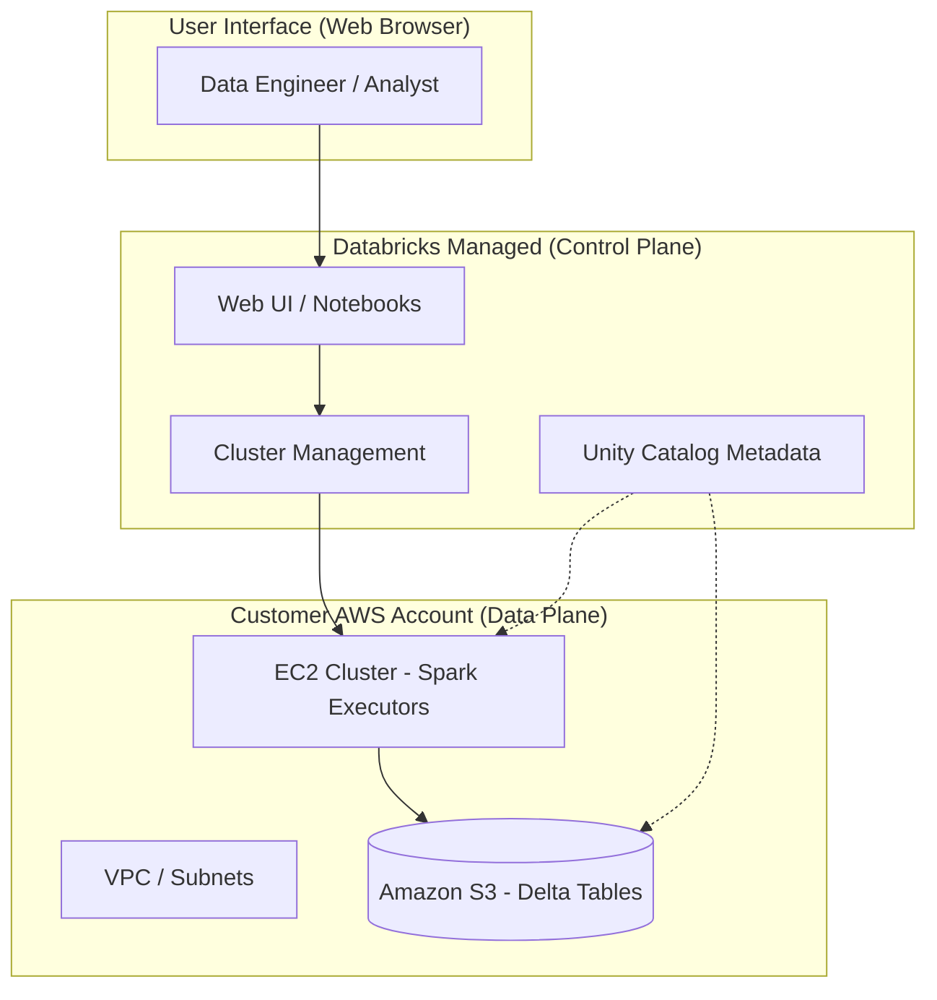

1.  **User Interface:** The engineer interacts with the Databricks UI via a browser.
2.  **Control Plane:** Databricks receives the instruction (e.g., "Run this Spark job") and manages the lifecycle of the compute.
3.  **Cluster Management:** The Control Plane sends commands to your AWS account to spin up or scale EC2 instances.
4.  **Data Plane (EC2):** The Spark engines execute the code, pulling data from S3 and performing transformations.
5.  **Amazon S3:** The persistent storage layer where the actual Delta/Parquet files reside.
6.  **Unity Catalog:** Acts as the "cross-plane" layer, managing permissions that apply to both the metadata and the physical data.

---

 
### Comparison: When to Use What

| Compute Option | Best For | Trade-offs | Approx. Cost Signal |
| :--- | :--- | :--- | :--- |
| **All-Purpose Clusters** | Interactive development, Ad-hoc analysis, Notebook experimentation. | Expensive; designed for "always-on" or manual start/stop. | 💰 High (Premium) |
| **Job Clusters** | Automated production pipelines (Workflows), ETL, Batch processing. | Cannot be used interactively; higher latency for startup. | 💡 Low (Optimized) |
| **SQL Warehouses** | BI Tools (Tableau, PowerBI), SQL-only users, high-concurrency querying. | Specialized for SQL; less flexible for Python/Scala heavy lifting. | 📊 Medium (Usage-based) |

**How to choose:** Use All-Purpose clusters for writing code, but **always** transition that code to a Job Cluster for production to minimize costs.

---

### Cost Cheat Sheet

| Scenario | Recommended Option | Key Cost Driver | Watch Out For |
| :--- | :--- | :--- | :--- |
| **Production ETL** | Job Clusters | EC2 Instance Type (vCPU/RAM) | Forgetting to set an "Auto-Termination" policy on manual clusters. |
| **Ad-hoc Exploration** | All-Purpose Clusters | Cluster Uptime | Leaving clusters running overnight with no active users. |
 
| **Business Intelligence** | SQL Warehouses | Databricks Units (DBUs) per hour | Over-provisioning warehouse size (e.g., using "Large" when "Small" suffices). |
| **Data Ingestion**| Auto Loader (Streaming) | S3 API Calls (LIST/GET) | Massive amounts of small files causing high S3 request costs. |

> 💰 **Cost Note:** The single biggest cost driver in Databricks is **Idle Compute**. A cluster running 24/7 without a single active query will quickly drain your budget. Always implement auto-termination (e.g., 20 minutes of inactivity).

---

### Service & Tool Integrations

1.  **AWS IAM & S3:** The foundation of security. Databricks uses IAM Roles (via Instance Profiles or Unity Catalog) to assume permissions to read/write to your S3 buckets.
2.  **AWS Glue Catalog:** Databricks can sync with the AWS Glue Data Catalog, allowing you to bridge the gap between legacy Glue jobs and new Databricks workloads.
3.  **Amazon Athena:** You can use Athena to query the same Delta tables sitting in S3 that Databricks is processing, providing a "serverless" alternative for simple queries.
4.  **AWS Lambda:** Often used to trigger Databricks Workflows via API when a new file lands in an S3 landing zone.

---

### Security Considerations

Databricks operates on a **Shared Responsibility Model**. Databricks secures the Control Plane; you secure the Data Plane and your AWS infrastructure.

| Control | Default State | How to Enable / Strengthen |
| :--- | :--- | :--- |
| **Data Encryption** | Encrypted at rest (S3-SSE) | Use AWS KMS with Customer Managed Keys (CMK) for full control. |
| **Network Isolation** | Public Access possible | Deploy Databricks in your own **VPC/VNet** using "Customer-Managed VPC." |

| **Access Control** | IAM-based | Implement **Unity Catalog** for fine-grained SQL-level permissions. |
| **Audit Logging** | Basic Logs | Enable **AWS CloudTrail** and Databricks Audit Logs to a centralized S3 bucket. |

---

### Performance & Cost

To achieve maximum performance while maintaining a lean budget, you must master **Instance Selection** and **Scaling**.

**The Performance/Cost Trade-off Example:**
Imagine a daily ETL job that processes 1TB of data.
*   **Scenario A (Suboptimal):** Using a large `m5.4xlarge` All-Purpose cluster, running 24/7.
    *   *Estimated Cost:* ~$10/hour $\times$ 24 hours = **$240/day**.
*   **Scenario B (Optimized):** Using a `m5.xlarge` Job Cluster, set to auto-terminate, running for exactly 1 hour.
    *   *Estimated Cost:* ~$2/hour $\times$ 1 hour = **$2/day**.

**Key Tuning Guidance:**
1.  **Use Spot Instances:** For non-critical, fault-tolerant ETL, use AWS Spot instances for your worker nodes to save up to 70-90% on EC2 costs.
2.  **Enable Auto-scaling:** Let the cluster grow during heavy shuffles and shrink during light periods.
3.  **Optimize File Sizes:** Avoid the "Small File Problem." Use the `OPTIMIZE` command in Delta Lake to compact small files into larger, more efficient ones.

---

### Hands-On: Key Operations

**Step 1: Creating an S3 Bucket for the Lakehouse**
First, we need a landing zone in AWS.
```bash
# Using AWS CLI to create a bucket for our Databricks data
aws s3 mb s3://my-databricks-lakehouse-data-001 --region us-east-1
```
> 💡 **Tip:** Always use a unique name and follow a naming convention that includes your environment (e.g., `-dev`, `-prod`).

**Step 2: Defining an IAM Policy for Databricks Access**
This policy allows the Databr icks cluster to read and write to our new bucket.
```json
{
    "Version": "2012-10-17",
    "Statement": [
        {
            "Effect": "Allow",
            "Action": ["s3:GetObject", "s3:PutObject", "s3:DeleteObject", "s3:ListBucket"],
            "Resource": [
                "arn:aws:s3:::my-databricks-lakehouse-data-001",
                "arn:aws:s3:::my-databricks-lakehouse-data-001/*"
            ]
        }
    ]
}
```

**Step 3: Creating a Table in Databrck (SQL)**
Once the cluster is running, we use SQL to define our structure.
```sql
-- Create a managed table in the Unity Catalog
CREATE TABLE main.default.sales_data (
  order_id INT,
  customer_id STRING,
  amount DOUBLE,
  order_date DATE
) USING DELTA;
```
> 💡 **Tip:** Using `USING DELTA` is the default in modern Databricks, but explicitly stating it ensures you are utilizing the Lakehouse features like Time Travel.

---

### Customer Conversation Angles

**Q: "Where is my data actually stored? In Databricks' account or mine?"**
**A:** Your data stays in your AWS account, specifically in your S3 buckets. Databricks only manages the compute that processes it, ensuring you maintain ownership and sovereignty.

**Q: "We already use AWS Glue. Why should we move to Databricks?"**
**A:** While Glue is excellent for serverless ETL, Databricks provides a unified "Lakehouse" environment that supports high-performance SQL, advanced Machine Learning, and much faster interactive development within a single interface.

**Q: "How do I know if my developers are overspending on clusters?"**
**A:** You can use Datbrticks System Tables to monitor DBU (Databricks Unit) consumption and set up automated alerts via Amazon CloudWatch or Databricks SQL dashboards.

**Q: "Is it possible to run Databricks without the internet? We have strict VPC requirements."**
**A:** Yes, by using a "Customer-Managed VPC" deployment, you can ensure all traffic stays within your private network, using AWS PrivateLink to communicate with the Databricks Control Plane.

**Q: "If I delete my Databricks workspace, is my data gone?"**
**A:** No. Since the data resides in your S3 buckets, deleting the Databricks workspace only deletes the management layer. Your underlying data remains safe in S3.

---

### Common FAQs and Misconceptions

**Q: "Is Databricks just a managed version of Apache Spark?"**
**A:** Not exactly. While it uses Spark, it adds a critical governance layer (Unity Catalog), a specialized storage layer (Delta Lake), and optimized compute engines (Photon) that far outperform standard open-source Spark.

**Q: "Do I need to pay for both AWS EC2 and Databricks?"**
**A:** Yes. You pay AWS for the underlying infrastructure (EC2, S3, EBS) and you pay Databricks for the software usage (DBUs).

**Q: "Can I use Databricks with my existing Redshift data?"**
**A:** Absolutely. You can use the Redshift connector to ingest data from Redshift into your Databricks Lakehouse for advanced analytics.

**Q: "Does the Control Plane see my sensitive data?"**
**A:** ⚠️ **Warning:** No. The Control Plane handles metadata (table names, schema) and instructions, but the actual data processing happens in your Data Plane (EC2/S3), meaning your raw data values never enter the Databrical-managed environment.

**Q: "Is Delta Lake a proprietary format?"**
**A:** No, it is an open-source format. This prevents vendor lock-in, as you can read the same Delta files using other tools like Apache Spark or Presto.

---

### Exam & Certification Focus

*   **Domain: Architecture (High Priority)**
    *   Distinguishing between Control Plane and Data Plane. 📌
    *   Understanding the role of S3 in the Lakehouse.
    *   Identifying the components of Unity Catalog.
*   **Domain: Data Engineering (Medium Priority)**
    *   The impact of Delta Lake features (ACID, Time Travel) on data pipelines.
    *   Using Auto Loader for efficient S3 ingestion.
*   **Domain: Security (Medium Priority)**
    *   Implementing the Principle of Least Privilege using IAM and Unity Catalog.
    *   Understanding Network Isolation (VPC deployment).

---

### Quick Recap
- Databricks on AWS separates **Management (Control Plane)** from **Compute (Data Plane)**.
- Your data stays in **your S3 buckets**, ensuring security and ownership.
- **Unity Catalog** is the central nervous system for all governance and metadata.
- **Job Clusters** are significantly more cost-effective than **All-Purpose Clusters** for production.
- The **Lakehouse** architecture eliminates data silos by bringing Warehouse-like features to your S3 Data Lake.

---

### Further Reading
**[Databricks Documentation]** — The definitive source for all feature updates and configuration guides.
**[AWS Whitepaper: Lake House Architecture]** — Deep dive into building modern data architectures on AWS.
**[Databricks Architecture Guide]** — Detailed technical breakdown of the Control/Data plane split.
**[Delta Lake Documentation]** — Everything you need to know about ACID transactions and storage optimization.
**[AWS Security Best Practices for Databricks]** — Essential reading for configuring VPCs, IAM, and KMS.

---

## Databricks Compute and Cluster Configuration

### Section at a Glance
**What you'll learn:**
- The architectural distinction between All-Purpose, Job, and SQL Warehouses.
- How to configure worker nodes, driver nodes, and scaling policies (Autoscaling).
- Managing Spot vs. On-Demand instances for cost-performance optimization.
- Optimizing cluster configurations for different workload types (ETL vs. Ad-hoc).
- Understanding the impact of cluster lifecycle management on operational overhead.

**Key terms:** `All-PG Compute` · `Job Compute` · `Serverless SQL` · `Autoscaling` · `Spot Instances` · `Driver Node`

**TL;DR:** Compute in Databricks is the engine of your data pipeline; choosing the right cluster type (All-Purpose, Job, or SQL Warehouse) is the single most important decision for balancing processing speed with cloud expenditure.

---

### Overview
In a modern data estate, the primary business pain point isn't "how do we process data," but "how do we process data without breaking the budget?" For organizations migrating from legacy Hadoop environments or AWS Glue, the complexity of managing compute resources can lead to "cloud sprawl"—where idle clusters and over-provisioned nodes create massive, unallocated costs.

Databricks solves this by decoupling compute from storage. While your data lives in S3, your compute (clusters) is transient. This section addresses the fundamental challenge of resource orchestration: how to provide enough horsepower for heavy-duty Bronze-to-Silver ETL pipelines while ensuring that interactive analysts have responsive, low-latency environments for SQL querying.

Properly configuring compute allows a Data Engineer to transition from being a "server administrator" to a "resource orchestrator." You will learn to design configurations that automatically scale up during peak ingestion windows and shut down during periods of inactivity, ensuring that the business only pays for the exact compute seconds utilized.

---

### Core Concepts

#### 1. Cluster Types
Databricks provides three primary flavors of compute, each optimized for a specific persona and cost profile.

*   **All-Purpose Compute:** Used for interactive analysis, notebook development, and ad-hoc debugging. 
    *   ⚠️ **Warning:** These clusters are the most expensive because they are designed for high availability and "always-on" interactivity. Leaving an All-Purpose cluster running overnight is a common cause of budget overruns.
*   **Job Compute:** Dedicated solely to running automated workflows (Databricks Jobs).
    *   📌 **Must Know:** Job clusters are significantly cheaper (often ~50% less) than All-Purpose clusters. For the exam, remember: **Always use Job clusters for production ETL pipelines.**
*   **SQL Warehouses (Classic, Pro, Serverless):** Optimized for SQL workloads and BI tools (like Tableau or Power BI).
    *   **Serverless SQL** is the modern standard, providing near-instant startup times by removing the need to manage underlying EC2 instances.

#### 2. The Cluster Anatomy
*   **Driver Node:** The "brain" of the cluster. It coordinates tasks, manages the Spark Context, and tracks the lineage of the DAG (Directed Acyclic Graph).
    *   💡 **Tip:** If you are performing heavy `collect()` operations or working with massive metadata, increase the Driver size to prevent Out-of-Memory (OOM) errors.
*   **Worker Nodes:** The "muscle" of the cluster. These nodes execute the actual partitions of data.
*   **Autoscaling:** Allows the cluster to dynamically add or remove workers based on the backlog of pending tasks.

#### 3. Instance Types & Purchasing Models
*   **On-Demand Instances:** Guaranteed availability. The node will not be reclaimed by AWS.
*   **Spot Instances:** Use spare AWS capacity at a massive discount (up to 90%).
    *   ⚠️ **Warning:** AWS can reclaim Spot instances at any time with very little notice. 
    *   📌 **Must Know:** Use Spot instances for **Worker nodes** in fault-tolerant Spark jobs, but **never** use Spot for the **Driver node**. If the Driver is lost, the entire job fails.

---

### Architecture / How It Works

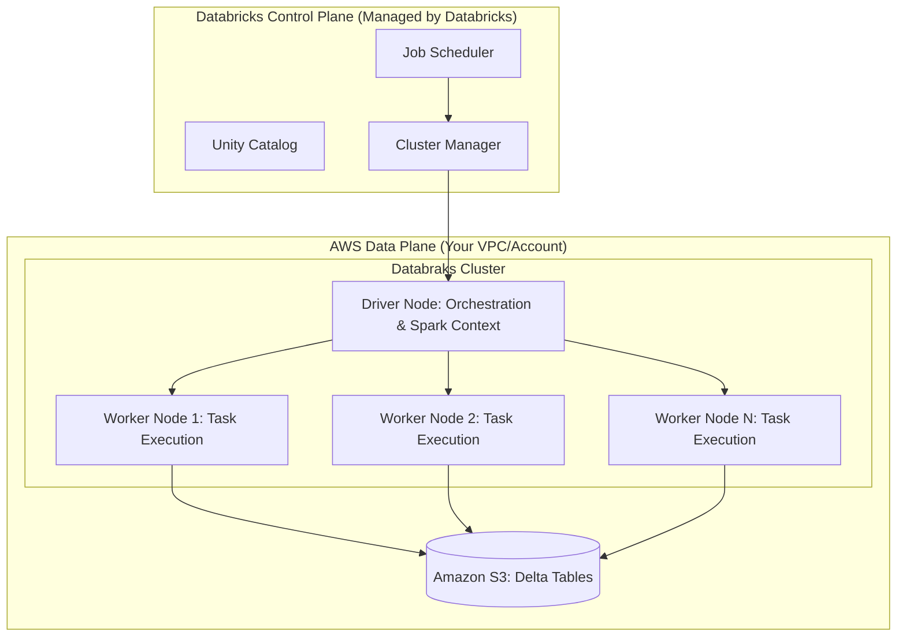

1.  **Cluster Manager:** Receives instructions from the Control Plane to provision EC2 instances in your AWS account.
2.  **Driver Node:** Receives the Spark plan and divides the workload into tasks.
3.  **Worker Nodes:** Pull data from S3, perform transformations, and write results back to S3.
4.  **Amazon S3:** Acts as the persistent storage layer, decoupled from the transient compute.

---

### Comparison: When to Use What

| Option | Best For | Trade-offs | Approx. Cost Signal |
| :--- | :--- | :--- | :--- |
| **All-Purpose Cluster** | Data Science, Ad-hoc EDA, Debugging | High cost; lacks automation efficiency | 💰💰💰 (Highest) |
| **Job Cluster** | Production ETL, Scheduled Pipelines | No interactivity; must wait for start-up | 💰 (Lowest) |
| **SQL Warehouse** | BI Reporting, SQL Analysts, Dashboards | Specific to SQL; not for Python/Scala logic | 💰💰 (Medium/High) |
| **Serverless SQL** | Rapid scaling, zero management overhead | Less control over underlying VM types | 💰💰 (Pay-per-use) |

**Decision Logic:** If you are writing code, use **All-Purpose**. If that code is running on a schedule, use **Job**. If you are querying a dashboard, use **SQL Warehouse**.

---

### Cost Cheat Sheet

| Scenario | Recommended Option | Key Cost Driver | Watch Out For |
| :--- | :--- | :--- | :--- |
| **Production ETL (Daily)** | Job Cluster + Spot Workers | Number of Worker Nodes | Driver node size (don't undersize) |
| **Data Science Exploration** | All-Purpose + On-Demand | Cluster Uptime (Auto-termination) | Leaving clusters idle overnight |
 $\text{Ad-hoc SQL Querying}$ | SQL Warehouse (Serverless) | Compute Seconds / SQL Units | Aggressive scaling settings |
| **Large-scale Batch Processing** | Job Cluster + Large Instances | Data Shuffle Volume | Disk spill to EBS (Slows down jobs) |

💰 **Cost Note:** The single biggest cost mistake in Databricks is failing to configure **Auto-Termination** on All-Purpose clusters. A cluster left running over a long weekend can cost hundreds of dollars for zero value.

---

### Service & Tool Integrations

1.  **AWS Glue/EMR Integration:**
    *   Use Databricks clusters to read from Glue Data Catalogs to maintain a single source of truth for metadata.
2.  **Amazon S3 (The Backbone):**
    *   Compute nodes use IAM Roles (Instance Profiles) to gain permission to read/write S3 buckets.
3.  **Unity Catalog:**
    *   Provides a centralized governance layer that manages permissions across all compute types (All-Purpose, Job, and SQL).
4.  **Databricks Workflows:**
    *   The orchestrator that triggers Job Clusters based on schedules, file arrival (S3 Events), or upstream task completion.

---

    ### Security Considerations

| Control | Default State | How to Enable / Strengthen |
| :--- | :--- | :--- |
| **Network Isolation** | Public Internet Access (via Databricks) | Deploy in **Customer-Managed VPC** with Private Link. |
| **Data Access Control** | IAM Role-based (S3) | Implement **Unity Catalog** for fine-grained (Row/Column) security. |
| **Encryption (At Rest)** | AWS Managed Keys (KMS) | Use **Customer-Managed Keys (CMK)** for higher compliance. |
| **Audit Logging**| Standard CloudTrail | Enable **Databricks Audit Logs** to track cluster creation/deletion. |

---

### Performance & Cost

**Tuning Strategy: The "Right-Sizing" Framework**
To optimize, you must balance **Compute Power** against **Data Shuffle**. 
*   **Small Clusters:** Low cost, but high "Shuffle" overhead. If workers are constantly swapping data to disk, your cost per row increases.
*   **Large Clusters:** High cost, but faster completion.

**Example Cost Scenario:**
*   **Scenario A (Under-provisioned):** 2 nodes, 4 hours to run. Cost: $2.00/hr * 4 = **$8.00**. (High risk of failure/OOM).
*   **Scenario B (Optimized):** 8 nodes (using Spot), 30 minutes to run. Cost: $8.00/hr * 0.5 = **$4.00**.
*   **Conclusion:** In many cases, increasing the number of nodes (scaling out) actually *redu/ces* total cost by reducing the total "wall clock" time the cluster is active.

---

### Hands-On: Key Operations

**Step 1: Setting up Auto-Termination (Python/REST API)**
This script (conceptually) ensures that a cluster shuts down after 20 minutes of inactivity to prevent cost leakage.
```python
# This represents the configuration payload for a cluster creation API call
cluster_config = {
    "cluster_name": "Production_ETL_Cluster",
    "autotermination_minutes": 20, # Crucial for cost control
    "node_type_id": "i3.xlarge",
    "driver_node_type_id": "i3.xlarge",
    "spark_version": "13.3.x-scala2.12"
}
```
> 💡 **Tip:** Always set `autotermination_minutes` to the lowest acceptable value for your team's workflow.

**Step 2: Using Spot Instances for Workers**
When defining your cluster via Terraform or API, you specify the use of Spot instances for the worker pool.
```hcl
# Terraform snippet for a Databricks Cluster with Spot Workers
resource "databricks_cluster" "spot_cluster" {
  cluster_name            = "Cost_Optimized_Worker_Pool"
  spark_version           = "13.3.x-scala2.12"
  node_type_id            = "m5.large"
  autotermination_minutes = 30

  autoscale {
    min_workers = 2
    max_workers = 8
  }

  # Enabling Spot for workers (Requires specific provider logic)
  # Note: In Databricks UI, this is a checkbox in the 'Instances' tab.
}
```

---

### Customer Conversation Angles

**Q: We already use AWS Glue. Why should we pay for extra Databricks compute?**
**A:** While Glue is excellent for serverless ETL, Databricks provides a much higher performance tier for complex transformations via the Photon engine and offers a superior environment for collaborative Data Science and SQL analytics in a single platform.

**Q: How do we prevent developers from leaving expensive clusters running 24/7?**
**A:** We implement mandatory Auto-Termination policies and use Tagging to attribute costs to specific departments, making "idle" compute visible to management.

**Q: Can we use Spot instances for our mission-critical production pipelines?**
**A:** Yes, but we use a "Hybrid" approach: we use On-Demand instances for the Driver node to ensure stability, and Spot instances for the Worker nodes to drive down the total cost of the job.

**Q: Is Databricks SQL Warehouse more expensive than standard clusters?**
**A:** It is priced differently—you pay for "SQL Units"—but because it features much faster scaling and "instant-on" capabilities, you typically avoid paying for the idle time common in standard clusters.

**Q: How do we ensure our data doesn't leave our AWS VPC?**
**A:** We can deploy Databricks in your own AWS VPC using Private Link, ensuring all traffic between the Control Plane and your Data Plane stays within the AWS network backbone.

---

### Common FAQs and Misconceptions

**Q: Does a larger Driver node make my Spark jobs faster?**
**A:** Not necessarily. The Driver manages orchestration. A larger driver helps with heavy metadata or large `collect()` calls, but it won't speed up the parallel processing of data on the workers.

**Q: If I use Spot instances, will my job fail if an instance is reclaimed?**
**A:** Spark is designed to handle node loss. The Driver will simply re-schedule the tasks that were on the lost worker onto the remaining nodes.
⚠️ **Warning:** This only works if your **Driver** is on an On-Demand instance.

**Q: Is "Serverless" compute more expensive than "Classic" compute?**
**A:** It depends on usage. For intermittent queries, Serverless is cheaper because there is zero "idle" cost. For constant, 24/7 heavy workloads, Classic might offer more granular cost control.

**Q: Can I use the same cluster for both Python ETL and SQL Dashboarding?**
**A:** You *can*, but you *shouldn't*. Mixing workloads leads to "resource contention," where a heavy ETL job slows down the dashboard for your executives.

**Q: Does increasing the number of workers always reduce the runtime?**
**A:** No. There is a point of diminishing returns known as "too much overhead," where the time spent coordinating tasks outweighs the benefits of extra parallelization.

---

### Exam & Certification Focus
*   **Cluster Types (High Frequency):** Identifying which cluster type to use for a specific persona (Job vs. All-Purpose). 📌
*   **Cost Optimization (High Frequency):** Understanding the cost implications of Spot vs. On-Demand and the importance of Auto-Termination.
*   **Scaling (Medium Frequency):** The difference between manual scaling and Autoscaling.
*   **Architecture (Medium Frequency):** The role of the Driver vs. Worker nodes in the Spark ecosystem.

---

### Quick Recap
- **All-Purpose** is for people; **Job** is for processes; **SQL Warehouse** is for dashboards.
- **Job Clusters** are the gold standard for cost-effective production ETL.
- **Spot Instances** are great for workers but dangerous for drivers.
- **Autotermination** is your primary defense against unexpected cloud bills.
- **Scaling Out** (more nodes) can often be cheaper than **Scaling Up** (bigger nodes) due to reduced execution time.

---

### Further Reading
**[Databricks Documentation]** — Official guide to Cluster Types and configuration.
**[AWS Whitepaper: Cost Optimization for Databricks]** — Best practices for managing AWS spend.
**[Databricks Engineering Blog]** — Deep dives into the Photon engine and compute performance.
**[Databricks Academy]** — Structured learning paths for the Data Engineer Associate exam.
**[AWS Architecture Center]** — Reference architectures for Databricks on AWS.

---

## Deep Dive into Delta Lake: ACID, Versioning, and Optimization

### Section at a Glance
**What you'll learn:**
- The mechanics of ACID transactions in a distributed storage environment.
- How the Delta Log enables Time Travel and data versioning.
- Advanced optimization techniques: Z-Ordering, Compaction (Optimize), and Data Skipping.
- Strategies for managing the "small file problem" in AWS S3.
- Implementing schema enforcement and evolution in production pipelines.

**Key terms:** `ACID` · `Delta Log` · `Time Travel` · `Z-Order` · `Compaction` · `Schema Enforcement`

**TL;DR:** Delta Lake adds a transactional layer over Parquet files on S3, providing the reliability of a relational database with the scale of a data lake, specifically through transaction logging and intelligent data indexing.

---

### Overview
In the traditional "Data Lake" era, organizations faced a recurring nightmare: partial writes. If a Spark job failed halfway through writing a massive partition to S3, you were left with "ghost data"—a corrupted state where some files existed and others didn't, making downstream reports unreliable. For businesses, this translates to broken SLAs, manual cleanup costs, and a fundamental lack of trust in the "Single Source of Truth."

Delta Lake was engineered to solve this "reliability gap." It introduces a transaction log (the Delta Log) that acts as the authoritative record of truth. By moving from "a folder of files" to "a managed table," we transition from a fragile data swamp to a robust Lakehouse architecture. This allows for concurrent reads and writes without the risk of reading uncommitted or partial data.

For the Data Engineer, this section is the most critical part of the Databricks ecosystem. While Spark provides the compute engine, Delta Lake provides the state management. Mastering Delta Lake is the difference between building a fragile pipeline that requires constant manual intervention and building a self-healing, production-grade Lakehouse.

---

### Core Concepts

#### 1. ACID Transactions
ACID (Atomicity, Consistency, Isolation, Durability) is the bedrock of Delta Lake. 
*   **Atomicity:** Either the entire transaction succeeds, or nothing is committed. There is no "half-written" state.
*   **Consistency:** Data conforms to the defined schema and constraints.
*   **Isolation:** Using **Optimistic Concurrency Control (OCC)**, multiple users can read and write simultaneously. Delta assumes conflicts are rare and only fails if two processes attempt to modify the same data version concurrently.
*   **Durability:** Once a transaction is committed to the Delta Log on S3, it is permanent.

> 📌 **Must Know:** In the exam, remember that Delta Lake achieves isolation through the **Delta Log**, not by locking the entire table. It checks for conflicts only at the point of commit.

#### 2. The Delta Log (The "Brain")
The `_delta_log` folder contains a sequence of JSON files (e.g., `000001.json`). Each file represents a "commit." These files list which Parquet files were added and which were removed. 
*   **Checkpoints:** Every 10 commits, Delta creates a **Checkpoint file** (Par Parallel/Parquet format). This aggregates the state so the engine doesn't have to replay thousands of JSON files to figure out the current state.

#### 3. Schema Enforcement vs. Evolution
*   **Enforcement:** Prevents "data pollution" by rejecting writes that don't match the table's schema.
*   **Evolution:** Allows intentional changes (e.g., adding a column) using `.option("mergeSchema", "true")`.

> ⚠️ **Warning:** Schema evolution is **additive only**. You cannot drop a column or change a data type (e.g., String to Integer) via simple evolution; these require a full table rewrite or `overwriteSchema`.

#### 4. Time Travel (Versioning)
Because the Delta Log tracks every change, you can query the table as it existed at a specific timestamp or version number.
*   **Use Cases:** Recovering from accidental deletes, auditing data changes, and reproducing ML models.

---

### Architecture / How It Works

```mermaid
graph TD
    subgraph "S3 Storage Layer (The Lake)"
        subgraph "Delta Table Folder"
            DL[Delta Log Folder: _delta_log/]
            JSON[JSON Commit Files: 001.json, 002.json]
            CP[Checkpoint Files: 001.parquet]
            PAR[Data Files: part-001.parquet, part-002.parquet]
        end
    end
    
    subgraph "Compute Layer (Databricks/Spark)"
        Engine[Spark Engine]
        Catalog[Unity Catalog / Hive Metastore]
    end

    Engine -->|Reads Log| JSON
    Engine -->|Reads State| CP
    Engine -->/Reads Data| PAR
    Catalog -->|Metadata Lookup| DL
```

1.  **Delta Log Folder:** The root directory containing the transaction history.
2.  **JSON Commit Files:** Individual entries representing atomic changes (Add/Remove actions).
3.  **Checkpoint Files:** Periodic snapshots that optimize the reading of the log.
4.  **Data Files:** The actual underlying Parquet files containing the raw data.
5.  **Spark Engine:** The compute unit that parses the log to determine which Parquet files are "active."
6.  **Catalog:** The metadata layer that points the user to the correct S3 path.

---

### Comparison: When to Use What

| Feature/Option | Best For | Trade-offs | Approx. Cost Signal |
| :--- | :--- | :--- | :--- |
| **Standard Delta Table** | General-purpose Bronze/Silver layers. | Standard storage costs. | Low |
| **Z-Order Indexing** | High-cardinality columns used in `WHERE` clauses. | Increases write latency (compute cost). | Medium (Compute) |
ical | **Delta Lake + Liquid Clustering** | Modern replacement for Z-Order; handles data skew better. | Medium (Compute) |
| **Parquet (Raw)** | Simple, append-only immutable logs. | No ACID, no Time Travel, no updates. | Lowest |

**How to choose:** If you are performing frequent lookups on a specific ID (e.g., `customer_id`), use **Z-Ordering** or **Liquid Clustering**. If you are simply dumping raw logs that are never updated, standard **Parquet** is sufficient, but you lose the ability to `UPDATE` or `DELETE`.

---

### Cost Cheat Sheet

| Scenario | Recommended Option | Key Cost Driver | Watch Out For |
| :--- | :--- | :--- | :--- |
| **Frequent Updates/Deletes** | Delta Lake with `OPTIMIZE` | S3 API calls & Compute for compaction | Not running `VACUUM` (storage bloat) |
| **Massive Append-only Streams** | Delta Lake (Standard) | S3 Put/Get requests | "Small File Problem" (too many tiny files) |
ical | **High-Concurrency Reads** | Z-Order / Liquid Clustering | Over-indexing (slows down writes) |
| **Long-term Archival** | Delta Lake + `VACUUM` | Storage (S3) | Deleting files that are still needed for Time Travel |

> 💰 **Cost Note:** The single biggest cost mistake is neglecting the **`VACUUM`** command. If you don't vacuum, Delta keeps all old versions of files to support Time Travel. Over months, your S3 storage costs will explode because you are paying for "dead" data that is no longer part of the current table version.

---

### Service & Tool Integrations

1.  **AWS Glue & Athena:**
    *   You can query Delta tables directly using Athena (via the Delta Lake connector).
    *   Glue Crawlers can be configured to recognize Delta format to populate the Glue Data Catalog.
2.  **Unity Catalog (UC):**
    *   Provides a centralized governance layer for Delta tables.
    *   Enables fine-grained access control (Row/Column level security) across the entire Databricks workspace.
3.  **Amazon S3:**
    *   Acts as the physical persistence layer.
    *   Integration requires proper IAM roles for Databricks clusters to perform `LIST`, `READ`, `WRITE`, and `DELETE` operations.

---

### Security Considerations

| Control | Default State | How to Enable / Strengthen |
| :--- | :--- | :--- |
| **Encryption at Rest** | S3 Managed (SSE-S3) | Use AWS KMS (SSE-KMS) for customer-managed keys. |
| **Encryption in Transit** | Enabled (TLS) | Ensure all Spark connections use HTTPS/SSL. |
  | **Access Control** | IAM-based | Use **Unity Catalog** for granular, identity-based permissions. |
| **Audit Logging** | CloudTrail | Enable S3 Data Events in CloudTrail to track who accessed which file. |

---

### Performance & Cost

**The "Small File Problem":**
In streaming or frequent batching, Spark creates many small files. This forces the S3 driver to perform thousands of `LIST` and `GET` requests, which is computationally expensive and slow.

**Optimization Strategy:**
1.  **`OPTIMIZE`**: Compacts small files into larger, more efficient files (aim for ~1GB).
2.  **`Z-ORDER`**: Reorganizes data within those files to co-locate related information.

**Example Cost Scenario:**
*   **Unoptimized Table:** 10,000 files of 1MB each. A query scanning 1GB of data requires 10,000 S3 `GET` requests.
*   **Optimized Table:** 1 file of 1GB. The same query requires 1 `GET` request.
*   **Impact:** While `OPTIMIZE` costs $X in Databricks compute, it can reduce downstream query costs (Athena/Databricks) by up to 90% and significantly reduce S3 request costs.

---

### Hands-On: Key Operations

**1. Compacting small files and co-locating data**
This command merges small files and organizes data by `user_id` to speed up filtered queries.
```sql
OPTIMIZE silver_user_transactions
ZORDER BY (user_id);
```
> 💡 **Tip:** Only Z-Order on columns frequently used in `WHERE` clauses. Z-Ordering on too many columns dilutes the effectiveness.

**2. Viewing Table History**
Use this to see the lineage of the table and identify which version to roll back to.
```sql
DESCRIBE HISTORY silver_user_transactions;
```

**3. Performing a Time Travel Query**
Query the state of the table as it was exactly 3 versions ago.
```sql
SELECT * FROM silver_user_transactions VERSION AS OF 3;
```

**4. Cleaning up old data (The Safety Valve)**
Delete files that are no longer needed for Time Travel (older than the retention period).
```sql
-- Warning: This makes older versions unrecoverable!
VACUUM silver_user_transactions RETAIN 168 HOURS;
```
> ⚠️ **Warning:** Do not set the `RETAIN` period to less than 7 days if you have active concurrent readers, as they might be mid-read on a file you just deleted.

---

### Customer Conversation Angles

**Q: We have many streaming jobs writing to the same table. Will they overwrite each other?**
**A:** No, Delta Lake uses Optimistic Concurrency Control. As long as the jobs are modifying different partitions, they can commit simultaneously without conflict.

****Q: How do we handle a situation where a bad batch of data was loaded?**
**A:** We can use Delta's "Time Travel" feature to instantly revert the table to the last known good version using the `RESTORE` command.

**Q: Does using Delta Lake increase our S3 storage costs significantly?**
**A:** It can, because Delta retains history for Time Travel. However, we manage this using the `VACUUM` command to prune old files, and the performance gains usually offset the storage cost.

**Q: Can my data scientists use Athena to query the Delta tables created by our engineers?**
**A:** Yes, Athena supports Delta Lake. We can configure the Glue Catalog so that both Databricks and Athena see the exact same consistent view of the data.

**Q: We need to change a column name. Can Delta do that automatically?**
**A:** Simple renames aren't supported via schema evolution alone; you would need to perform a schema overwrite, but we can automate this via a controlled Spark job.

---

### Common FAQs and Misconceptions

**Q: Does Delta Lake replace Parquet?**
**A:** No, Delta Lake *is* Parquet. It is a layer of metadata (the log) sitting on top of Parquet files.

**Q: Can I use Delta Lake with any S3 bucket?**
**A:** Yes, as long as your Databricks cluster has the necessary IAM permissions to read and write to that bucket.

**Q: Is `OPTIMIZE` required for every write?**
**A:** No, but it is a best practice for any table receiving frequent, small updates.

**Q: Does `VACUUM` delete my current data?**
**A:** No. It only deletes files that are no longer part of the current table state and are older than the retention threshold.

> ⚠️ **Warning:** A common misconception is that `VACUUM` is a "delete" command for data. It is actually a "cleanup" command for history.

**Q: Does Z-Ordering work on strings?**
**A:** Yes, but it is most effective on columns with high cardinality (many unique values) that are used in filters.

---

### Exam & Certification Focus
*   **Domain: Data Engineering on Databricks**
*   **Key Topics to Master:**
    *   The difference between `Append`, `Overwrite`, and `Merge` operations. 📌
    *   The role of the `_delta_log` in achieving ACID properties. 📌
    *   The mechanism and usage of `VACUUM` and its impact on Time Travel.
    *   Understanding `Z-ORDER` vs. standard partitioning.
    *   How `Schema Enforcement` prevents data corruption. 📌

---

### Quick Recap
- **ACID compliance** ensures data reliability and prevents partial writes in S3.
- The **Delta Log** is the single source of truth for all transactions.
- **Time Travel** allows for easy auditing and error recovery via versioning.
- **Optimization (`OPTIMIZE` + `Z-ORDER`)** is essential to prevent the "small file problem."
- **`VACUUM`** is mandatory to control storage costs and prevent "infinite" history growth.

---

### Further Reading
**[Delta Lake Documentation]** — Detailed technical reference for all Delta Lake commands and configurations.
**[Databricks Best Practices Guide]** — Industry-standard patterns for building Medallion Architectures.
**[AWS Whitepaper: Data Lakes on AWS]** — Context on how Delta Lake integrates with the broader AWS ecosystem.
**[Databricks Academy: Data Engineering with Databricks]** — Deep-dive video modules on Lakehouse implementation.
**[Apache Spark Performance Tuning]** — Advanced techniques for optimizing the compute layer behind Delta.

---

## Implementing Medallion Architecture: Bronze, Silver, and Gold Layers

### Section at a Glance
**What you'll learn:**
- The architectural purpose and business value of the Medallion pattern.
- Detailed implementation strategies for Bronze, Silver, and Gold layers.
- Data lineage and schema evolution strategies across the pipeline.
- How to optimize Delta Lake features (Upserts, Compaction) at each layer.
- Governance and security boundaries between different data quality tiers.

**Key terms:** `Delta Lake` · `Schema Enforcement` · `Data Lineage` · `ACID Transactions` · `Watermarking` · `Data Quality`

**TL;CR:** The Medallion architecture is a multi-hop data processing pattern that progressively improves data quality and structure, transforming raw, messy data into high-value, business-ready insights through structured refinement.

---

### Overview
In the modern enterprise, the primary driver of data engineering failure is not a lack of data, but a lack of *trust*. Organizations often struggle with "Data Swamps," where massive amounts of raw data are ingested into S3, but no one knows which files are complete, which columns are reliable, or which aggregates are current. This creates a massive business bottleneck: data scientists spend 80% of their time cleaning data rather than building models, and executives make decisions based on stale, inconsistent reports.

The Medallion Architecture solves this by introducing a structured, multi-stage refinement process using Delta Lake. Instead of a single, monolithic ETL job that attempts to clean and aggregate all at once, the workload is broken into discrete "hops." This separation of concerns allows for better error handling, easier debugging, and incremental processing.

For a Data Engineer on AWS, implementing this means moving from a "batch-and-forget" mindset to a "continuous refinement" mindset. You aren't just moving bytes from point A to point B; you are managing a state machine of data quality. This section explores how to leverage Databricks and Delta Lake to implement these layers to ensure that by the time data reaches the "Gold" layer, it is a single source of truth that the business can rely on for automated decision-making.

---

### Core Concepts

#### 1. The Bronze Layer (The Raw Landing Zone)
The Bronze layer is the entry point for all ingested data. Its primary purpose is to provide a permanent, immutable record of the source data.
*   **Structure:** Often mirrors the source system (JSON, CSV, Parquet). It is "schema-on-read" friendly but uses Delta Lake to provide ACID guarantees.
*   **State:** Raw, unvalidated, and potentially "dirty."
*   **Strategy:** Append-only. You rarely update Bronze; you only add new data. 
📌 **Must Know:** In a production environment, the Bronze layer should include metadata columns such as `_input_file_name`, `_processing_timestamp`, and `_source_system` to ensure full auditability.

#### 2. The Silver Layer (The Cleansed/Augmented Zone)
This is where the heavy lifting of data engineering happens. The Silver layer represents the "Single Version of the Truth."
*   **Structure:** Highly structured, often normalized or semi-normalized.
*   **Operations:** This layer involves **Schema Enforcement**, filtering out corrupt records, handling null values, and performing joins to enrich data (e.g., joining a raw transaction with a customer dimension).
*   **Data Quality:** This is where you apply "Expectations" or data quality constraints.
⚠️ **Warning:** Avoid performing complex business aggregations in Silver. If you start calculating "Monthly Active Users" in the Silver layer, you lose the ability to re-calculate that metric if the business logic changes. Keep Silver focused on *cleaning* and *joining*, not *summarizing*.

#### 3. The Gold Layer (The Curated/Aggregate Zone)
The Gold layer is the "Presentation Layer" optimized for consumption by BI tools (QuickSight, Tableau) and ML models.
*   **Structure:** De-normalized, highly aggregated, and organized into star schemas or feature stores.
*   **Use Case:** Business-level metrics (e.g., `daily_revenue_by_region`).
💡 **Tip:** The Gold layer should be read-optimized. Use Z-Ordering or Liquid Clustering on columns frequently used in `WHERE` clauses of BI dashboard filters to accelerate query performance.

---

### Architecture / How It Works

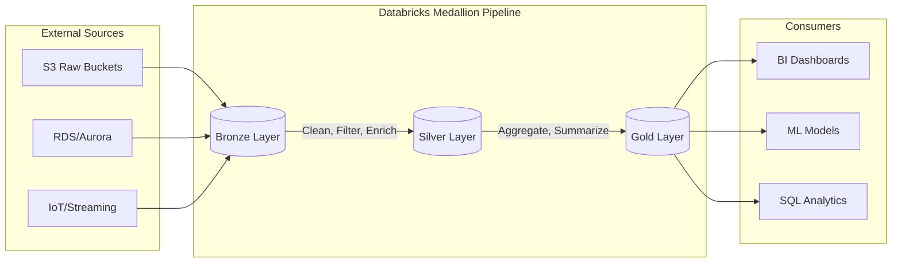

1.  **External Sources:** The origin of data, ranging from unstructured S3 files to structured AWS RDS instances.
2.  **Bronze Layer:** Receives raw ingestion via Auto Loader or Spark Streaming, preserving the original state.
3.  **Silver Layer:** Executes transformations, schema validation, and enrichment to create a reliable foundation.
4.  **Gold Layer:** Produces highly aggregated, business-ready datasets optimized for specific use cases.
5.  **Consumers:** The end-users (Analysts, Data Scientists) who interact with the refined Gold data.

---

### Comparison: When to Use What

| Feature | Bronze | Silver | Gold |
| :--- | :--- | :--- | :--- |
| **Data Quality** | Low (Raw) | High (Validated) | Highest (Aggregated) |
| **Schema** | Flexible/Raw | Strict/Enforced | Highly Structured |
| **Primary Users** | Data Engineers | Data Engineers / Scientists | Data Analysts / BI |
| **Storage Pattern** | Append-only | Upserts (Merge/Delta) | Overwrite or Append |
| **Approx. Cost Signal** | Low (Storage heavy) | Medium (Compute heavy) | High (Compute/Optimization) |

**How to choose:** Use Bronze for recovery/reprocessing, Silver for cross-functional data sharing, and Gold for specific departmental reporting needs.

---

### Cost Cheat Sheet

| Scenario | Recommended Option | Key Cost Driver | Watch Out For |
| :--- | :--- | :--- | :--- |
| **High-Volume IoT Ingestion** | Auto Loader to Bronze | S3 API Calls (LIST/GET) | Large numbers of tiny files |
| **Complex Data Cleaning** | Spark Structured Streaming | DBU (Databr_Units) for Compute | Long-running, unoptimized clusters |
| **Large Scale Historical Re-processing** | Bronze-to-Silver Batch | I/O and Shuffle | Not using Delta `VACUUM` |
| **Real-time BI Dashboards** | Gold Layer Materialized Views | Compute (Always-on clusters) | Unoptimized Z-Ordering |

💰 **Cost Note:** The single biggest cost mistake is failing to use **Auto Loader** for Bronze ingestion. Using standard `spark.read.format("csv").load()` on an S3 bucket with millions of files will cause the Spark Driver to crash or incur massive S3 LIST costs. Auto Loader uses file notification services to incrementally process only new files, significantly reducing compute and I/O costs.

---

### Service & Tool Integrations

1.  **AWS S3 & Auto Loader:**
    *   Acts as the physical storage layer.
    *   Auto Loader uses S3 Event Notifications to detect new files, providing an efficient "incremental" ingestion pattern into Bronze.
2.  **AWS Glue Data Catalog:**
    *   Provides a unified metadata layer.
    *   While Databricks has its own Unity Catalog, integrating with Glue allows other AWS services (like Athena) to query the Silver/Gold layers.
3.   **Unity Catalog (Databricks):**
    *   Provides centralized governance, lineage, and fine-grained access control across all three layers.

---

### Security Considerations

| Control | Default State | How to Enable / Strengthen |
| :--- | :--- | :--- |
| **Data Encryption** | Encrypted at rest (SSE-S3) | Use AWS KMS with Customer Managed Keys (CMK) for sensitive Gold data. |
| **Access Control** | S3 Bucket Permissions | Use **Unity Catalog** to manage row-level and column-level security. |
| **Network Isolation** | Public Internet Access | Deploy Databricks in a **VPC** with private endpoints (AWS PrivateLink). |
| **Audit Logging** | CloudTrail/S3 Logs | Enable **Databricks Audit Logs** to track who accessed which Gold table. |

---

### Performance & Cost

To optimize the Medallion architecture, you must balance the "cost of compute" against the "cost of storage and latency."

*   **The Bottleneck:** The Silver layer is often the most expensive because it involves `MERGE` operations (upserts). If your Silver layer is constantly rewriting large amounts of data, your DBU consumption will spike.
*   **The Optimization:** Use **Z-Ordering** on high-cardinally columns (like `customer_id`) in the Silver layer. This physically clusters related data together, reducing the amount of data scanned during joins.

**Example Cost Scenario:**
Imagine an ingestion pipeline processing 1TB of data daily.
*   **Inefficient Approach:** Using standard Spark batch jobs that rewrite the entire Silver table every day. **Estimated Cost: \$500/day** (due to massive I/O and compute).
*   **Optimized Approach:** Using Delta `MERGE` with Auto Loader and Z-Ordering. Only the new 1TB of data is processed and merged. **Estimated Cost: \$120/day**.

---

### Hands-On: Key Operations

First, we use Auto Loader to ingest raw JSON from S3 into our Bronze Delta table.
```python
# Incremental ingestion from S3 to Bronze using Auto Loader
(spark.readStream
  .format("cloudFiles")
  .option("cloudFiles.format", "json")
  .option("cloudFiles.schemaLocation", "s3://my-bucket/checkpoints/bronze_schema")
  .load("s3://my-bucket/raw_landing_zone/")
  .writeStream
  .format("delta")
  .option("checkpointLocation", "s3://my-bucket/checkpoints/bronze_table")
  .outputMode("append")
  .start("s3://my-bucket/bronze_table"))
```
💡 **Tip:** Always specify a `schemaLocation` when using Auto Loader; this allows Databricks to handle schema evolution (adding new columns) automatically without breaking your pipeline.

Next, we transform Bronze to Silver by filtering nulls and enforcing a schema.
```sql
-- Transforming Bronze to Silver: Cleaning and Filtering
CREATE OR REPLACE TABLE silver_sales AS
SELECT 
  transaction_id,
  CAST(customer_id AS STRING),
  CAST(amount AS DOUBLE),
  to_timestamp(transaction_time) as event_timestamp
FROM bronze_sales
WHERE transaction_id IS NOT NULL 
  AND amount > 0;
```

Finally, we create a Gold aggregate for the business.
```sql
-- Creating a Gold Table for Daily Revenue Reporting
CREATE OR REPLACE TABLE gold_daily_revenue AS
SELECT 
  date_trunc('day', event_timestamp) as sale_date,
  sum(amount) as total_revenue,
  count(transaction_id) as transaction_count
FROM silver_sales
GROUP BY 1;
```

---

### Customer Conversation Angles

**Q: Why should we pay for the extra compute to have a Silver layer instead of just querying the Raw data directly?**
**A:** While you *can* query raw data, the Silver layer acts as a "governed" layer. It removes errors, standardizes formats, and ensures that every analyst is using the same cleaned version of the truth, preventing conflicting reports.

**Q: If we are already using AWS Glue, do we really need the Medallion architecture in Databricks?**
**A:** The Medallion architecture is a design pattern, not a tool. You can implement it in Glue, but doing it in Databricks with Delta Lake allows you to use much more powerful features like ACID transactions, time travel, and much faster `MERGE` capabilities.

**$Q: Won't having three layers of data significantly increase our S3 storage costs?**
**A:** While storage volume increases slightly, the cost is offset by the massive reduction in compute costs. Because the layers are incremental, you aren't re-processing everything; you're only processing the delta, which is much more efficient.

**Q: How do we handle a situation where we discover a bug in our Silver layer logic?**
**A:** This is the beauty of the architecture. Since your Bronze layer is immutable, you can simply fix the logic in your Silver pipeline and re-run the processing from Bronze to Silver to "correct" the history.

**Q: Is the Gold layer safe for direct access by our BI tools like QuickSight?**
**A:** Absolutely. In fact, that is its intended purpose. The Gold layer is optimized for high-performance, low-latency queries for your end users.

---

### Common FAQs and Misconceptions

**Q: Can I skip the Bronze layer and go straight from Raw to Silver?**
**A:** You *can*, but it's risky. ⚠️ **Warning:** Without a Bronze layer, if your Silver transformation logic fails or you discover a bug, you have no "immutable" source to replay the data from. You'd have to go back to the original source system, which might not have the historical data available.

**Q: Does every single table in my lake need to be in all three layers?**
**A:** No. Only data that requires transformation, cleaning, or aggregation needs to move through the layers. Some simple lookup tables might go straight from Bronze to Gold.

**Q: Is the Medallion architecture only for streaming data?**
**A:** No. It works perfectly for both batch and streaming workloads. The "pattern" is about data quality evolution, not the ingestion frequency.

**Q: Does Delta Lake handle the movement between layers automatically?**
**A:** No, you must design the Spark/Databricks pipelines (using Auto Loader or Delta Live Tables) to move the data through these stages.

**Q: Is the Gold layer always de-normalized?**
**A:** Generally, yes. To maximize performance for BI tools, you want to minimize the number of joins required at query time.

---

### Exam & Certification Focus
*   **Data Engineering Associate Exam (Domain: Data Processing):**
    *   Identifying which layer (Bronze, Silver, or Gold) a specific transformation (e.g., aggregation, cleaning, or ingestion) belongs to. 📌 **Must Know**
    *   Understanding the use of `Auto Loader` for Bronze ingestion.
    *   Recognizing the role of `Delta Lake` in maintaining ACID properties across the layers.
    *   Implementing `Schema Enforcement` vs. `Schema Evolution` within the Silver layer.

---

### Quick Recap
- **Bronze:** Immutable, raw, and serves as the "system of record" for recovery.
- **Silver:** The "Single Version of Truth" where cleaning, filtering, and enrichment occur.
- **Gold:** The "Presentation Layer" optimized for BI and high-level business aggregates.
- **Efficiency:** Use Auto Loader for Bronze and Z-Ordering for Silver/Gold to manage costs.
- **Reliability:** The multi-hop approach allows for error isolation and data replayability.

---

### Further Reading
**Databricks Whitepaper** — The Definical guide to the Medallion Architecture.
**Delta Lake Documentation** — Deep dive into ACID transactions and Schema Enforcement.
**AWS Architecture Center** — Reference architectures for Data Lakes on AWS.
**Databricks Auto Loader Guide** — Best practices for incremental file ingestion.
**Delta Live Tables (DLT) Documentation** — How to automate the Medallion pipeline using declarative SQL/Python.

---

## Efficient Data Ingestion with Auto Loader and COPY INTO

### Section at a Glance
**What you'll learn:**
- Distinguishing between stream-based ingestion (Auto Loader) and batch-based ingestion (COPY INTO).
- Implementing Schema Evolution and Schema Inference to handle changing source data.
- Optimizing S3-to-Delta ingestion for high-frequency, small-file scenarios.
- Architecting scalable Bronze-layer ingestion pipelines on AWS.
- Managing cost and performance trade-offs in large-scale data movement.

**Key terms:** `Auto Loader` · `COPY INTO` · `Schema Evolution` · `Cloud Files` · `Checkpointing` · `Idempotency`

**TL;DR:** Master the two primary Databricks methods for moving data from AWS S3 into Delta Lake, choosing between the continuous, schema-aware intelligence of Auto Loader and the simplified, SQL-centric batch processing of COPY INTO.

---

### Overview
In the modern data estate, the "Ingestion Gap" is a primary driver of technical debt. Organizations often struggle with the "small file problem" or the "schema drift nightmare," where upstream changes in S3-based landing zones break downstream ETL pipelines, causing operational outages and costly manual interventions. For a Data Engineer, the challenge isn't just moving bytes; it is moving bytes *reliably* without knowing exactly what the next file will look like.

This section focuses on the two Databricks-native solutions designed to bridge this gap: **Auto Loader** and **COPY INTO**. Auto Loader is built for the "always-on" mindset, providing a scalable, stream-based approach to ingesting files as they arrive in S3. Conversely, `COPY INTO` offers a declarative, SQL-friendly way to perform periodic batch loads.

Understanding when to leverage the continuous intelligence of Auto Loader versus the administrative simplicity of `COPY INTO` is critical for building a Medallion Architecture that is both cost-effective and resilient. We will move beyond simple "how-to" and look at the architectural implications of each choice on your AWS bill and your team's on-call rotation.

---

### Core Concepts

#### 1. Auto Loader (`cloudFiles`)
Auto Loader is a feature of Structured Streaming that incrementally processes new data files as they arrive in S3.
*   **Schema Inference & Evolution:** Auto Loader can automatically detect the schema of incoming files. 
    > 📌 **Must Know:** When a new column appears in an S3 file, Auto Loader can update the schema of your Delta table without crashing the pipeline, provided you enable `mergeSchema`.
*   **File Discovery Modes:**
    *   **Directory Listing:** Scans the S3 bucket. Efficient for smaller datasets.
    *    **File Notification:** Uses AWS SNS/SQS to notify Databricks of new files. This is the gold standard for high-scale, high-velocity ingestion.
    > ⚠️ **Warning:** Relying on Directory Listing for buckets with millions of files can lead to significant latency and increased S3 `LIST` request costs.
*   **Checkpointing:** Maintains state in a persistent directory (S3). This ensures **idempotency**—if a cluster restarts, it knows exactly where it left off.

#### 2. COPY INTO
`COPY INTO` is a SQL command used for idempotent, batch-based ingestion from S3 into Delta tables.
*   **Idempotency:** It tracks which files have already been processed using a built-in metadata log.
*   **Simplicity:** It requires no streaming infrastructure or complex Spark configurations; it is a single SQL statement.
*   **Statelessness:** Unlike Auto Loader, it does not require a checkpoint directory, making it easier to manage via standard SQL orchestration tools (like dbt or Airflow).

#### 3. Schema Drift Management
Schema drift occurs when the source data structure changes. 
*   **Auto Loader** handles this via `cloudFiles.schemaEvolutionMode`.
*   **COPY INTO** requires more manual intervention or a pre-defined schema, though it can handle some basic evolution if the target is Delta.

---

### Architecture / How It Segment Works

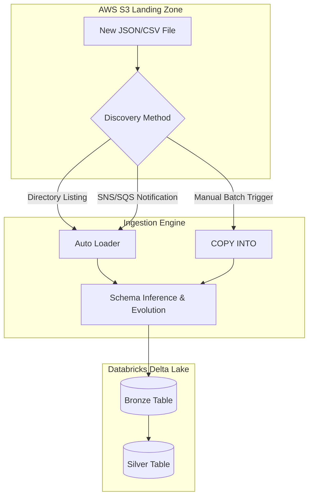

1.  **AWS S3 Landing Zone:** The source of truth where raw, unstructured, or semi-structured files arrive.
2.  **Discovery Method:** The mechanism (polling vs. notifications) used to identify new data.
3.  **Ingestion Engine:** The compute layer (Spark) that parses the raw bytes, applies schema logic, and handles the transformation.
4.  **Bronze Table:** The destination Delta table acting as the permanent, immutable record of the raw data.

---

### Comparison: When to Use What

| Option | Best For | Trade-offs | Approx. Cost Signal |
| :--- | :--- | :--- | :--- |
| **Auto Loader** | High-frequency, continuous, or unpredictable file arrivals. | Requires a running cluster/job (Streaming). | Higher (Compute uptime). |
/ **COPY INTO** | Scheduled, batch-driven workloads (e.g., nightly ETL). | Not "real-time"; requires manual triggers. | Lower (Compute on-demand). |
| **Standard Spark `read`** | One-time migrations or static datasets. | No built-in tracking; will re-process everything every time. | High (Wasteful re-computation). |

**How to choose:** If your business requirement is "near real-time" (seconds to minutes), use **Auto Loader**. If your requirement is "the dashboard must be ready by 8 AM," use **COPY INTO**.

---

### Cost Cheat Sheet

| Scenario | Recommended Option | Key Cost Driver | Watch Out For |
| :--- | :--- | :--- | :--- |
| **Massive S3 Buckets (>1M files)** | Auto Loader (File Notification) | AWS SNS/SQS & S3 Event costs. | 💰 **The "List" Tax:** Avoid Directory Listing on huge buckets. |
| **Low Volume, Periodic Data** | COPY INTO | Cluster start/stop duration. | Using a heavy cluster for a small SQL task. |
  **Extreme Schema Volatility** | Auto Loader | Schema evolution processing overhead. | Massive number of small columns. |
| **High Velocity (Thousands of files/min)** | Auto Loader (Streaming) | Continuous compute (DBU) consumption. | Unbounded streaming with no backpressure management. |

> 💰 **Cost Note:** The single biggest cost mistake is running a continuous Auto Loader cluster 24/7 for a data source that only arrives once an hour. Use `Trigger.AvailableNow` in Auto Loader to get streaming benefits with batch-like cost profiles.

---

### Service & Tool Integrations

1.  **AWS SNS/SQS + Auto Loader:**
    *   Configure S3 Event Notifications to push to an SQS queue.
    *   Configure Auto Loader to use `cloudFiles.useNotifications = true`.
    *   Result: Zero-latency discovery without scanning the whole bucket.
2.  **AWS Glue/Lambda + COPY INTO:**
    *   Use a Lambda function to trigger a Databricks SQL Warehouse task once an ETL process completes.
    *   Result: Orchestrated, event-driven batch pipelines.
3.  **dbt (data build tool) + COPY INTO:**
    *   Wrap `COPY INTO` statements within dbt models to maintain lineage and testing.

---

### Security Considerations

| Control | Default State | How to Enable / Strengthen |
| :--- | :--- | :--- |
| **IAM Authentication** | Identity-based | Use **Instance Profiles** or **Unity Catalog** credential Passthrough to limit S3 access. |
| **Encryption at Rest** | S3-Managed (SSE-S3) | Use **AWS KMS** (SSE-KMS) for customer-managed keys (CMK) to satisfy compliance. |

| **Data Isolation** | Shared Access | Use **Unity Catalog** to enforce fine-grained access control on the Bronze tables. |

---

### Performance & Cost

**Tuning Guidance:**
*   **File Size:** Aim for files in the 128MB–1GB range. If your source generates millions of 1KB files, use Auto Loader to "compact" them during the move to Bronze.
*   **The `AvailableNow` Pattern:** This is the "holy grail" for cost. It processes all new data since the last run and then shuts down the cluster.

**Cost Scenario Example:**
*   **Scenario:** A 24/7 Streaming Cluster for 10 files/day.
*   **Cost:** ~$30/day in DBUs (assuming small cluster).
*   **Alternative:** An `AvailableNow` job running 3 times a day.
*   **Cost:** ~$2/day in DBUs.
*   **Impact:** 93% reduction in compute cost with minimal latency impact.

---

### Hands-On: Key Operations

**Setting up Auto Loader with Schema Inference (Python):**
This script initializes an Auto Loader stream that automatically detects the schema of incoming JSON files.
```python
df = (spark.readStream
  .format("cloudFiles")
  .option("cloudFiles.format", "json")
  .option("cloudFiles.schemaLocation", "s3://my-bucket/checkpoints/schema")
  .load("s3://my-bucket/raw-data/"))

(df.writeStream
  .option("checkpointLocation", "s3://my-bucket/checkpoints/data")
  .trigger(availableNow=True) # Use AvailableNow for cost efficiency
  .toTable("bronze_table"))
```
> 💡 **Tip:** Always point `schemaLocation` to a persistent S3 path. If you lose this, Auto Loader loses its "memory" of the schema.

**Executing a Batch Load with COPY INTO (SQL):**
This SQL command incrementally loads data from a specific S3 folder into a Delta table.
```sql
COPY INTO bronze_table
FROM 's3://my-schema-bucket/landing-zone/'
FILEFORMAT = CSV
FORMAT_OPTIONS ('header' = 'true', 'inferSchema' = 'true')
COPY_OPTIONS ('mergeSchema' = 'true');
```
> 💡 **Tip:** `COPY INTO` is much easier to use for analysts who are comfortable with SQL but not Python/Scala.

---

### Customer Conversation Angles

**Q: We have millions of files arriving in S3 every hour. Won't scanning the bucket every time break the bank?**
**A:** Not if we use Auto Loader with File Notifications. By integrating S3 with AWS SNS/SQS, we only process files as they are explicitly announced, avoiding expensive and slow bucket listings.

**Q: Our upstream team keeps adding columns to their JSON files without telling us. How do we stop our pipelines from crashing?**
**A:** We should implement Auto Loader with Schema Evolution enabled. It will automatically detect the new columns and update our Bronze table schema without manual intervention.

**Q: Can we use `COPY INTO` for real-time streaming?**
**A:** No, `COPY INTO` is designed for batch workloads. For real-time or near-real-time needs, Auto Loader is the correct architectural choice.

**Q: How do I ensure that if a job fails halfway through, we don't get duplicate data?**
**A:** Both Auto Loader and `COPY INTO` are inherently idempotent. They use metadata logs and checkpoints to track which files have already been processed, so a retry will only pick up the "new" or "missing" files.

**Q: Is Auto Loader more expensive than `COPY INTO`?**
**A:** It depends on your frequency. For 24/7 streaming, yes, because you are paying for continuous compute. However, by using the `AvailableNow` trigger, we can get the intelligence of Auto Loader with the cost profile of a batch job.

---

### Common FAQs and Misconceptions

**Q: Does Auto Loader work with all file formats?**
**A:** It supports all major formats: JSON, CSV, Parquet, Avro, ORC, and Text.
> ⚠️ **Warning:** It does *not* support proprietary or highly complex formats like Excel or encrypted binary blobs without custom logic.

**Q: If I delete the checkpoint folder, will it re-process all data?**
**A:** Yes. The checkpoint is the "memory" of the stream. Deleting it makes the stream think it is starting from scratch.

**Q: Is `COPY INTO` basically just a wrapper for `spark.read`?**
**A:** No. Unlike `spark.read`, `COPY INTO` has built-in state management to track which files have already been loaded, preventing duplicates.

**Q: Can Auto Loader handle schema changes if I'm using `AvailableNow`?**
**A:** Absolutely. `AvailableNow` is simply a trigger mode; the underlying engine still utilizes all the schema-handling capabilities of Auto Loader.

**Q: Do I need to manage an SQS queue myself for Auto Loader notifications?**
**A:** You need to *configure* the S3-to-SQS notification, but Databricks handles the heavy lifting of consuming those messages.

---

### Exam & Certification Focus
*   **Domain: Data Processing (Data Engineering Associate)**
    *   Identify the difference between `cloudFiles` (Auto Loader) and `COPY INTO` (Domain: Ingestion).
    *   Understand **Schema Evolution** vs. **Schema Enforcement** (Domain: Data Integrity).
    *   Know the mechanism for **File Discovery** (Directory Listing vs. Notifications) (Domain: Performance Optimization).
    *   📌 **High Frequency:** Using `trigger(availableNow=True)` to balance cost and functionality.

---

### Quick Recap
- **Auto Loader** is for continuous or frequent, intelligent, schema-aware ingestion.
- **COPY INTO** is for simple, declarative, SQL-based batch loading.
- **File Notifications** are essential for high-scale S3 ingestion to avoid `LIST` costs and latency.
- **Idempotency** is a native feature of both tools, preventing duplicate data on retries.
- **Schema Evolution** is the key to building resilient, "self-healing" data pipelines.

---

### Further Reading
**Databricks Documentation** — Deep dive into Auto Loader configuration and options.
**AWS Documentation** — Understanding S3 Event Notifications for high-scale architecture.
**Delta Lake Whitepaper** — Understanding the underlying transaction log that enables `COPY INTO` idempotency.
**Databricks Academy** — Hands-on labs for building Medallion Architecture pipelines.
**Databricks Blog** — Case studies on optimizing cost with `AvailableNow` patterns.

---

## Data Transformation with Spark SQL and PySpark

### Section at a Glance
**What you'll learn:**
- The fundamental difference between Transformations and Actions in the Spark lifecycle.
- How to leverage the Spark SQL engine and the PySpark DataFrame API for complex ETL.
- Implementing advanced analytical patterns using Window functions and Aggregations.
- Identifying and mitigating "The Shuffle"—the primary driver of distributed computing costs.
- Optimizing performance by replacing Python UDFs with native Spark functions.

**Key terms:** `DataFrame` · `Lazy Evaluation` · `Catalyst Optimizer` · `Shuffle` · `Window Function` · `Action`

**TL;DR:** Data transformation is the process of converting raw, unstructured data into business-ready insights using Spark's distributed engine; success depends on understanding how to write code that minimizes data movement (shuffling) across the cluster.

---

### Overview
In modern data engineering, the "Data Swamp" problem is a significant business risk. Companies ingest massive amounts of data from AWS S3, but without a robust transformation layer, this data remains "dark"—unusable for BI, Machine Learning, or regulatory reporting. The transformation layer (typically the Silver and Gold layers of a Medallance Architecture) is where raw noise is converted into signal.

The challenge for the enterprise is scale. Traditional ETL tools often fail when data volume exceeds a single machine's memory. Spark SQL and PySpark solve this by distributing the workload across a cluster of AWS EC2 instances. This allows engineers to perform complex joins, aggregations, and filters on petabytes of data by breaking the work into small, manageable tasks.

For a Data Engineer, mastering these transformation techniques is not just about writing syntax; it is about managing computational complexity. A poorly written transformation can lead to "out of memory" (OOM) errors or astronomical AWS bills due to excessive network I/O. This section provides the technical depth required to build pipelines that are both performant and cost-effective.

---

### Core Concepts

#### 1. The Execution Model: Transformations vs. Actions
Spark operates on a principle of **Lazy Evaluation**. When you write a transformation (e.g., `.filter()`, `.select()`, `.join()`), Spark does not execute it immediately. Instead, it builds a **Logical Plan**.

*   **Transformations:** Operations that create a new DataFrame from an existing one. They are "lazy" because they only record the instructions.
*   **Actions:** Operations that trigger the actual computation and return a result to the driver or write data to storage (e.g., `.count()`, `.collect()`, `.save()`).

> ⚠️ **Warning:** A common mistake is performing an `.collect()` on a large dataset. This pulls all distributed data into the memory of the single Driver node, almost certainly leading to an Out-of-Memory error and pipeline failure.

#### 2. The Catalyst Optimizer
When an **Action** is called, Spark passes your code through the **Catalyst Optimizer**. This engine performs rule-based and cost-based optimizations, such as **Predicate Pushdown** (filtering data at the source before reading it into memory) and **Column Pruning** (reading only the columns needed).

📌 **Must Know:** The efficiency of your Spark SQL or PyFX code is often determined by how much work the Catalyst Optimizer can do to "prune" the workload before execution begins.

#### 3. Data Shuffling: The Performance Killer
**Shuffling** occurs when data needs to be redistributed across the cluster to perform operations like `groupBy` or `join`. This involves writing data to disk and moving it over the network.

> 💰 **Cost Note:** Excessive shuffling is the #1 driver of high Databricks costs. High network I/O increases the duration of your cluster's uptime, directly inflating your AWS instance spend.

#### 4. Window Functions
Window functions allow you to perform calculations across a set of rows that are related to the current row (e.g., calculating a running total or a 7-day moving average) without collapsing the rows into a single output, unlike a standard `groupBy`.

#### 5. User Defined Functions (UDFs)
A UDF allows you to write custom Python logic to transform data. 
> ⚠️ **Warning:** Standard Python UDFs are a "black box" to the Catalyst Optimizer. Spark cannot see inside the Python code, meaning it cannot optimize it, and it often requires expensive data serialization between the JVM and the Python runtime.

---

/
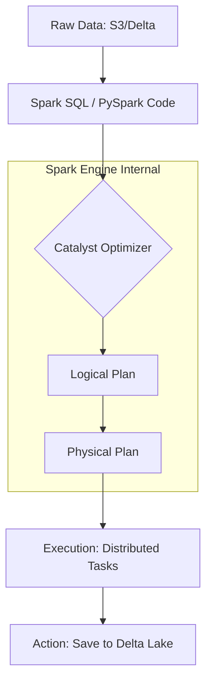
/

1.  **Raw Data:** The input source, typically stored in AWS S3 in Parquet or Delta format.
2.  **Spark Code:** The developer's instructions written in PySpark or SQL.
3.  **Catalyst Optimizer:** The brain of Spark that optimizes the execution path.
4.  **Logical Plan:** An abstract representation of *what* needs to be done.
5.  **Physical Plan:** The actual, optimized strategy of *how* to do it (e.le., which join algorithm to use).
6.  **Execution:** The distributed task execution across the worker nodes.
7.  **Action:** The final step that writes the result back to permanent storage.

---

### Comparison: When to Use What

| Option | Best For | Trade-offs | Approx. Cost Signal |
| :--- | :--- | :--- | :--- |
| **Spark SQL** | Analysts & Standard ETL | Highly optimized; easy to read/audit. | Low (Most efficient) |
/
| **PySpark (Native API)** | Complex, Programmatic ETL | Best for dynamic logic and iterative loops. | Low |
| **Python UDFs** | Extremely niche/complex logic | **High overhead**; breaks optimization. | High (Compute intensive) |
| **Pandas UDFs (Vectorized)** | Applying ML/Complex Math | Faster than standard UDFs; uses Arrow. | Medium |

**Decision Framework:** Always start with **Spark SQL** or the **Native PySpark API**. Only move to **Pandas UDFs** if a native function doesn't exist, and avoid standard **Python UDFs** unless there is no other mathematical possibility.

---

### Cost Cheat Sheet

| Scenario | Recommended Option | Key Cost Driver | Watch Out For |
| :--- | :--- | :--- | :--- |
| **Large-scale Joins** | Broadcast Join (if one table is small) | Network Shuffle | Data Skew (one node doing all the work) |
| **Aggregating Logs** | Predicate Pushdown (Filter early) | S3 Data Scanning | Reading unnecessary columns/rows |
| **Complex Math/ML** | Pandas UDF (Vectorized) | CPU/Memory overhead | Large-scale serialization |
| **Incremental Updates** | Delta Lake `MERGE` | Disk I/O and rewriting | Frequent small commits (small file problem) |

> 💰 **Cost Note:** The single biggest cost mistake is **Data Skew**. If 90% of your data belongs to one "Key" (e.g., a single large customer ID), one worker node will work significantly longer than the others, keeping your entire cluster active and billing while that one node struggles.

---

### Service & Tool Integrations

1.  **AWS Glue Data Catalog:** Acts as the central metadata repository. Spark SQL uses this catalog to resolve table names to S3 paths.
2.  **Delta Lake:** The storage layer that provides ACID transactions. Transformation logic (like `MERGE`) relies on Delta's transaction log.

3.  **Unity Catalog:** Provides fine-grained access control. Transformations must be performed within the context of a secured catalog to ensure data governance.
4.  **Amazon S3:** The underlying object store. Efficient transformations utilize S3's high throughput via partitioned data structures.

---

### Security Considerations

| Control | Default State | How to Enable / Strengthen |
| :--- | :--- | :--- |
| **Data Encryption (At Rest)** | Encrypted via S3-KMS | Ensure Databricks clusters use customer-managed keys (CMK). |
| **Data Access (RBAC)** | Broad access within workspace | Use **Unity Catalog** to implement row/column level security. |
| **Network Isolation** | Public/Private access depends on VPC | Deploy Databricks in a **Customer-managed VPC** with no public IP. |
| **Audit Logging** | Standard workspace logs | Enable **AWS CloudTrail** and Databricks Audit Logs for all transformations. |

---

### Performance & Cost

**The "Expensive Join" Example:**
Imagine a join between a `Sales` table (10 TB) and a `Products` table (100 MB).

*   **Scenario A (Standard Join):** Spark performs a "Sort-Merge Join." Both tables are shuffled across the network.
    *   *Cost Impact:* High. Massive network egress/ingress and high disk I/O.
*   **Scenario B (Broadcast Join):** You hint to Spark to `broadcast(products)`. The 100 MB table is sent to *every* worker node.
    *   *Cost Impact:* Low. No shuffling of the 10 TB table. The transformation completes in minutes instead of hours.

**Tuning Guidance:**
*   **Partitioning:** Ensure your data is partitioned by a high-cardinality key (e.g., `date` or `region`) to allow Spark to skip unnecessary files.
*   **Caching:** Use `.cache()` only for DataFrames that are reused multiple times in the *same* action pipeline. Over-caching consumes executor memory and triggers disk spilling.

---

### Hands-On: Key Operations

**1. Filtering and Selecting (The "Pruning" Step)**
This reduces the volume of data being processed early in the pipeline.
```python
# Filter for high-value orders and select only necessary columns
df_filtered = df.filter(df.order_value > 1000) \
                .select("order_id", "customer_id", "order_date")
```
> 💡 **Tip:** Always place `.filter()` as early as possible in your code to reduce the data volume being passed to subsequent transformations.

**2. Performing a Broadcast Join**
This avoids the expensive shuffle of the large dataset.
```python
from pyspark.sql.functions import broadcast

# Assuming 'large_sales_df' is 1TB and 'small_dim_df' is 50MB
enriched_df = large_saled_df.join(broadcast(small_dim_df), "product_id")
```

**3. Using Window Functions for Analytics**
This calculates a running total without losing individual row granularity.
```python
from pyspark.sql.window import Window
from pyspark.sql.functions import sum as _sum

# Define window: partition by customer, order by date
window_spec = Window.partitionBy("customer_id").orderBy("order_date")

# Calculate cumulative spend per customer
df_running_total = df.withColumn("cumulative_spend", _sum("order_value").over(window_spec))
```

---

### Customer Conversation Angles

**Q: "We have a lot of Python logic in our current Glue jobs. Will moving to Databricks be a performance hit?"**
**A:** Not necessarily. If your logic uses Python UDFs, moving to Databricks actually gives you a massive opportunity to optimize by rewriting those UDFs into native Spark SQL, which can result in 10x performance gains.

**Q: "How can we control the monthly AWS spend on our Databricks transformation pipelines?"**
**A:** We focus on two areas: implementing Broadcast Joins to eliminate network shuffling and utilizing Delta Lake's features to avoid full table rewrites, which reduces both compute time and S3 I/O costs.

**Q: "Is it better to use PySpark or Spark SQL for our data engineering team?"**
**A:** It's not an 'either/or.' Use Spark SQL for standard, readable ETL logic that analysts can audit, and use PySpark when you need to build dynamic, programmatic pipelines that require complex control flow.

**Q: "Can Databricks handle our data privacy requirements (GDPR/CCPA) during transformations?"**
**A:** Yes. By using Unity Catalog, we can apply fine-grained access control and masking directly within your transformation logic, ensuring sensitive data is never visible to unauthorized users.

---

### Common FAQs and Misconceptions

**Q: Does Spark execute transformations as soon as I write the code?**
**A:** No. Spark uses lazy evaluation; it only builds a plan. Execution only happens when an **Action** is called.
> ⚠️ **Warning:** If you don't see any errors in your code but the data isn't appearing in your destination, check if you actually called an Action (like `.write()`).

**Q: Is a Python UDF as fast as a native Spark function?**
**A:** No. Python UDFs are significantly slower because data must be moved between the Spark JVM and the Python process.

**Q: Does more RAM always mean faster Spark jobs?**
**A:** Not always. If your problem is "Data Skew" or "Network Shuffle," adding RAM won't help; you need to optimize your join strategies or partitioning.

**Q: Can I use Pandas code directly on a large Spark DataFrame?**
**A:** You cannot run standard Pandas on a distributed DataFrame without bringing it all to the driver (which causes OOM). You must use **Pandas UDFs (Vectorized UDFs)** which use Apache Arrow to process data in chunks.

---

### Exam & Certification Focus
*   **Domain: Data Processing**
    *   Distinguishing between Transformations and Actions. 📌
    *   Identifying the impact of Shuffling on cluster performance. 📌
    *   Selecting the correct Join strategy (Broadcast vs. Sort-Merge).
    *   Recognizing the benefits of Predicate Pushdown and Column Pruning.
    *   Applying Window functions for analytical transformations.

---

### Quick Recap
- **Lazy Evaluation** means Spark optimizes the entire pipeline before running a single task.
- **Shuffling** is the most expensive operation in a distributed cluster; minimize it at all costs.
- **The Catalyst Optimizer** is your best friend for making declarative SQL code performant.
- **Native Spark functions** should always be preferred over **Python UDFs** to avoid serialization overhead.
- **Effective Partitioning** and **Broadcasting** are the primary levers for controlling AWS costs in Databricks.

---

### Further Reading
**[Databricks Documentation]** — Detailed API reference for PySpark DataFrame operations.
**[Apache Spark Guide]** — Deep dive into the internals of the Catalyst Optimizer and Tungsten engine.
**[Delta Lake Documentation]** — Best practices for ACID transactions and the `MERGE` command.
**[AWS Whitepaper: Data Lakes on AWS]** — Architectural patterns for building scalable ETL pipelines.
**[Databricks Best Practices]** — Industry-standard patterns for performance tuning and cost management.

---

## Stream Processing with Structured Streaming

### Section at a Glance
**What you'll learn:**
- The fundamental difference between batch and stream processing in the Delta Lake ecosystem.
- How to implement the "Medallion Architecture" using continuous streaming.
- Managing stateful vs. stateless transformations in Spark.
- Handling late-arriving data using Watermarking.
- Implementing exactly-once processing guarantees for mission-critical pipelines.

**Key terms:** `Micro-batching` · `Watermarking` · `Checkpointing` · `Trigger Interval` · `Windowing` · `Delta Live Tables (DLT)`

**TL;DR:** Structured Streaming treats a live stream as an unbounded table, allowing you to use the same SQL and DataFrame APIs for both real-time and batch workloads to achieve low-latency data pipelines.

---

### Overview
In the modern enterprise, the value of data decays rapidly. A fraud detection system cannot wait for a nightly batch job; a logistics dashboard cannot wait for an hourly refresh. The business pain is "latency-induced blindness"—making decisions based on what happened an hour ago rather than what is happening *now*.

Historically, organizations had to maintain two separate codebases: one for high-speed streaming (e.MM., Apache Flink or Storm) and one for batch processing (e.MM., Spark or Glue). This "Lambda Architecture" created massive operational overhead, as logic had to be written, tested, and debugged twice.

Structured Streaming on Databricks solves this by providing a unified API. It treats the stream as a continuously growing table. This allows data engineers to apply the same business logic, transformations, and quality checks to both historical data and real-time feeds. By integrating this with Delta Lake, we achieve a "Kappa Architecture," where a single pipeline handles all data velocity needs, significantly reducing the Total Cost of Ownership (TCO) and engineering complexity.

---

### Core Concepts

**1. The Unbounded Table Model**
Structured Streaming views a stream as an unbounded table that is being appended to continuously. When you run a query, you are essentially performing an incremental computation on the new rows arriving in the table.

**2. Micro-batching vs. Continuous Processing**
*   **Micro-batching (Default):** Spark processes data in small, discrete chunks (batches) at a set interval. This provides high throughput and robust fault tolerance.
*   **Continuous Processing:** A low-latency mode designed for sub-millably latency, though it offers fewer supported operations. 
> ⚠️ **Warning:** Do not assume "Continuous Processing" is always better. It significantly limits the types of complex transformations (like certain aggregations) you can perform compared to micro-batching.

**3. Checkpointing and Fault Tolerance**
Checkpointing is the mechanism that allows a stream to recover after a failure. It saves the progress (the "offset") of the stream to a reliable storage location (S3).
📌 **Must Know:** If you lose your checkpoint directory, your stream will treat the entire history of the stream as "new" data, leading to massive duplicates in your target Delta table.

**4. Watermarking (Handling Late Data)**
In real-world IoT or mobile app scenarios, data often arrives out of order due to network latency. **Watermarking** tells the engine how long to wait for late data before discarding it from the state.
> 💡 **Tip:** Setting a watermark too low results in data loss (late data is dropped); setting it too high causes "state explosion," where the engine keeps too much data in memory, leading to OOM (Out of Memory) errors.

**5. Windowing**
Windowing allows you to group data into time-based buckets (e.g., "every 5 minutes"). This is essential for calculating moving averages or detecting spikes in real-time.

---

### Architecture / How It Works

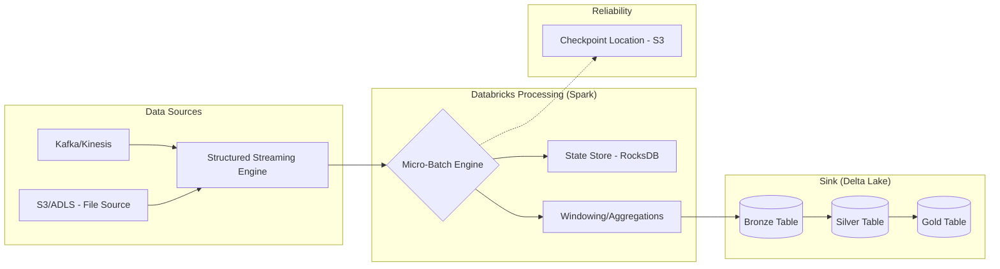

1.  **Data Sources:** The entry point where unstructured or semi-structured data (events, logs, sensor readings) originates.
2.  **Micro-Batch Engine:** The orchestration layer that triggers a new Spark job for every interval.
3.  **State Store:** A specialized storage layer (often using RocksDB) that tracks information across batches, such as running totals or windowed counts.
4.  **Checkpoint Location:** The "brain" of the stream, stored in S3, which records the exact offset of the last processed record to ensure exactly-once semantics.
5.  **Delta Lake Sinks:** The destination where the processed data is written as a permanent, versioned, and ACID-compliant table.

---

### Comparison: When to Use What

| Option | Best For | Trade-offs | Approx. Cost Signal |
| :--- | :--- | :--- | :--- |
| **Micro-batching** | Most ETL, aggregations, and standard business logic. | Higher latency (seconds to minutes). | Moderate (standard cluster usage). |

| **Continuous Processing** | Ultra-low latency-sensitive alerts (sub-second). | Limited SQL operations; lower throughput. | High (requires "always-on" compute). |

**How to choose:** Use **Micro-batching** as your default. Only move to **Continuous Processing** if your business use case (e.g., high-frequency trading or real-time security blocking) explicitly demands sub-second latency and you can handle the reduced transformation complexity.

---

### Cost Cheat Sheet

| Scenario | Recommended Option | Key Cost Driver | Watch Out For |
| :--- | :--- | :--- | :--- |
| **High Volume IoT** | Micro-batching with Auto Loader | Number of files/records processed. | Excessive small files (use `cloudFiles.maxFilesPerTrigger`). |
| **Real-time Dashboard** | Continuous Processing | Cluster uptime (24/7 compute). | Costly if the data volume is low/intermittent. |
| **Periodic Aggregates** | Trigger Once / AvailableNow | Compute duration per run. | Not "real-time"; data lags. |
| **Complex Windowing** | Micro-batching + RocksDB | State Store size/Disk I/O. | Memory pressure on the driver node. |

> 💰 **Cost Note:** The single biggest cost mistake in streaming is failing to use **Trigger.AvailableNow**. Using a continuous stream for data that only arrives in bursts keeps a cluster running 24/7, charging you for idle time. Use `AvailableNow` to process all available data and then shut down the cluster.

---

### Service & Tool Integrations

1.  **AWS Kinesis / Confluent Kafka:** Acting as the "Source," these services provide the durable buffer for high-velocity event streams.
2.  **Databricks Auto Loader:** A specialized feature of Structured Streaming that incrementally processes new files in S3 without manual directory listing.

3.  **Delta Live Tables (DLT):** An orchestration layer that wraps Structured Streaming with built-in monitoring, data quality (Expectations), and automated infrastructure management.
4.  **Amazon S3:** Serves as both the source for file-based streams and the permanent storage for both the Delta tables and the Stream Checkpoints.

---

### Security Considerations

| Control | Default State | How to Enable / Strengthen |
| :--- | :--- | :--- |
| **Data Encryption** | Encrypted at rest (S3-SSE). | Use AWS KMS with Customer Managed Keys (CMK) for granular control. |
| **Access Control** | IAM Roles/Unity Catalog. | Implement Unity Catalog to manage fine-grained permissions on streaming tables. |
| **Network Isolation** | Public Internet (unless configured). | Deploy Databricks in a private VPC with no public IP; use VPC Endpoints for S3. |
| **Audit Logging** | Enabled via CloudTrail. | Enable Databricks Audit Logs to track who accessed/modified the stream. |

---

### Performance & Cost

To optimize performance, you must manage the **Micro-batch duration**. 
*   **Too Short:** You spend more time on "overhead" (scheduling tasks) than doing actual work.
*   **Too Long:** Your data latency increases, and you risk "backpressure" where the stream cannot keep up with the incoming rate.

**Example Cost/Performance Scenario:**
Imagine an IoT stream producing 1GB of data per hour.
*   **Scenario A (Continuous):** You run a 4-node cluster 24/7. Cost: ~$15/hour * 24 = **$360/day**.
*   **Scenario B (Trigger.AvailableNow):** You run a 4-node cluster for 15 minutes every hour. Cost: ~$15/hour * (0.25 * 24) = **$90/day**.
*   **Result:** A **75% cost reduction** with an acceptable latency trade-off for most business use cases.

---

### Hands-On: Key Operations

**1. Setting up an Auto Loader stream to ingest JSON from S3.**
This code uses `cloudFiles` to incrementally ingest data as it arrives in S3.
```python
df = (spark.readStream
  .format("cloudFiles")
  .option("cloudFiles.format", "json")
  .option("cloudFiles.schemaLocation", "/mnt/checkpoints/schema")
  .load("/mnt/raw-data/incoming/"))

(df.writeStream
  .format("delta")
  .option("checkpointLocation", "/mnt/checkpoints/bronze_table")
  .trigger(availableNow=True)
  .start("/mnt/delta/bronze_table"))
```
> 💡 **Tip:** Always use `schemaLocation` with Auto Loader. It enables **Schema Evolution**, allowing your pipeline to adapt when new columns are added to your JSON files without crashing.

**2. Implementing a Windowed Aggregation with Watermarking.**
This code calculates the count of events per 10-minute window, allowing data to be up to 2 hours late.
```python
from pyspark.sql.functions import window, col

windowedCounts = (df.withWatermark("event_timestamp", "2 hours")
  .groupBy(
    window(col("event_timestamp"), "10 minutes"),
    col("device_id"))
  .count())

(windowedCounts.writeStream
  .outputMode("append")
  .format("delta")
  .option("checkpointLocation", "/mnt/checkpoints/windowed_counts")
  .start("/mnt/delta/windowed_counts_table"))
```
> ⚠️ **Warning:** When using `window`, you must use `.outputMode("append")` or `"complete"`. Using `"append"` with watermarking is highly efficient because Spark can drop old state once the watermark passes the window end.

---

### Customer Conversation Angles

**Q: We currently have a Batch pipeline and a Streaming pipeline for the same data. Can we merge them?**
**A:** Absolutely. By using Structured Streaming, you can use the exact same code for both. You simply change the "Trigger" interval, which reduces your maintenance burden and ensures logic consistency.

**Q: How do I know if my stream is falling behind (backpressure)?**
**A:** You should monitor the `inputRate` vs. `processRate` metrics in the Spark UI or via Databrics SQL. If `inputRate` consistently exceeds `processRate`, you need to scale your cluster or optimize your transformations.

**Q: What happens if the cluster restarts in the middle of a stream?**
**A:** As long as you have configured a `checkpointLocation` on S3, the new cluster will read the offset from the checkpoint and resume exactly where the previous one left off, ensuring no data is lost or duplicated.

**Q: Can we use Structured Streaming to feed our PowerBI dashboards?**
**A:** Yes. By writing the stream to a Delta table, PowerBI can query that table. For "near real-time" feel, you can set the dashboard to refresh at intervals matching your stream's micro-batch frequency.

**Q: Is it expensive to run a stream 24/7?**
**A:** It can be. If your data volume is low, I recommend using `Trigger.AvailableNow` to run the stream on a schedule. This gives you the benefits of streaming (schema evolution, incremental processing) without the cost of 24/7 compute.

---

### Common FAQs and Misconceptions

**Q: Does Structured Streaming guarantee that every record is processed exactly once?**
**A:** It guarantees **exactly-once semantics** *end-to-end*, provided that your source is replayable (like Kafka or S3) and your sink is an ACID-compliant store like Delta Lake.
> ⚠️ **Warning:** If you are writing to a non-transactional sink (like a plain CSV file), you may experience "at-least-once" delivery, leading to duplicates during failures.

** 
**Q: Does Watermarking delete data from my Delta table?**
**A:** No. Watermarking only instructs the streaming engine when it can safely "forget" the data from its **internal state (RAM/Disk)**. The data remains in your Delta table.

**Q: Can I use `GroupByKey` in a stream?**
**A:** You can, but it is extremely dangerous for streaming. `GroupByKey` without a window or watermark creates an unbounded state, which will eventually crash your cluster via Out-of-Memory errors.

**Q: Is the `append` mode the only mode available?**
**A:** No, there are also `complete` (re-writes the entire result table) and `update` (only writes changed rows), but the available modes depend on whether you are performing aggregations.

**Q: Can I use standard SQL to query a stream?**
**A:** Yes. You can use `readStream` in Python/Scala or `STREAM()` in SQL to treat a live stream as a queryable table.

---

### Exam & Certification Focus
*   **Data Engineering Associate Exam:**
    *   **[Domain: Data Processing]** Understand the difference between `Append`, `Complete`, and `Update` output modes. 📌 **Highly Tested.**
    *   **[Domain: Data Processing]** Identify the purpose of `checkpointLocation` for fault tolerance. 📌 **Critical.**
    *   **[Domain: Data Processing]** Understand how `Watermarking` manages late-arriving data and state size.
    *   **[Domain: Data Engineering]** Know how to use **Auto Loader** (`cloudFiles`) for incremental file ingestion.
    *   **[Domain: Data Engineering]** Ability to distinguish between Micro-batching and Continuous processing modes.

---

### Quick Recap
- **Unified API:** Use the same code for Batch and Stream.
- **Reliability:** Checkpointing is mandatory for fault tolerance and exactly-once processing.
- **Late Data:** Watermarking is the key to handling out-of-order events without crashing the cluster.
- **Cost Efficiency:** Use `Trigger.AvailableNow` to process bursty data without paying for idle compute.
- **Architecture:** The "Medallion Architecture" is best implemented via continuous/incremental streaming into Delta Lake.

---

### Further Reading
**[Databricks Documentation]** — Structured Streaming Programming Guide (The definitive reference for API usage).
**[Databricks Documentation]** — Delta Lake Guide (Essential for understanding how sinks handle streaming data).
**[Databricks Documentation]** — Auto Loader (Deep dive into efficient S3 file ingestion).
**[Databricks Documentation]** — Delta Live Tables (Overview of the managed streaming framework).
**[AWS Whitepaper]** — Streaming Data Processing on AWS (Architectural patterns for Kinesis and Spark).

---

## Building Declarative Pipelines with Delta Live Tables (DLT)

### Section at a Glance
**What you'll learn:**
- The shift from imperative (how) to declarative (what) data engineering.
- How to implement Medallion Architecture using DLT pipelines.
- Managing data quality using Expectations (Expectations/Constraints).
- Implementing continuous vs. triggered execution modes.
- Orchestrating complex dependencies and lineage within a single pipeline.

**Key terms:** `Declarative` · `Medallion Architecture` · `Expectations` · `Streaming Live Table` · `Materialized View` · `Incremental Processing`

**TL;TR:** Delta Live Tables (DLT) is a framework for building reliable, maintainable, and testable data pipelines that automatically manage infrastructure, orchestration, and data quality, allowing engineers to focus on logic rather than plumbing.

---

### Overview
In traditional data engineering, particularly with Spark or AWS Glue, engineers spend a disproportionate amount of time writing "plumbing" code: managing checkpoint locations, handling manual triggers, ensuring table dependencies are met in the right order, and implementing complex error-handling logic for bad data. This imperative approach is brittle; if a task fails or a schema changes, the entire orchestration-layer logic (like Airflow or Step Functions) must be manually updated.

For a business, this creates "Data Engineering Debt." The cost of maintaining these pipelines scales linearly with the number of pipelines, leading to high operational overhead and slow time-to-market for new insights.

Delta Live Tables (DLT) solves this by introducing a **declarative** paradigm. Instead of writing code that says, *"First, read from S3, then transform, then write to Parquet, then update the catalog,"* you write code that says, *"This table is the result of this transformation."* DLT handles the underlying Spark clusters, the orchestration of the DAG (Directed Acyclic Graph), the state management, and the retries. It transforms the role of the data engineer from a "pluggable component builder" to a "data flow architect," significantly reducing the Total Cost of Ownership (TCO) for data platforms.

---

### Core Concepts

**1. Declarative Programming vs. Imperative Logic**
In an imperative system (standard Spark), you define the *steps*. In DLT, you define the *desired end state*. You specify the source and the transformation, and DLT determines the most efficient way to compute the result.

**2. The Medallion Architecture**
DLT is designed to natively support the Medallance pattern:
*   **Bronze (Raw):** Ingests raw data from sources (S3, Kinesis) with minimal changes.
*   **Silver (Cleansed):** Applies transformations, joins, and filters. This is where "Expectations" are most critical.
*   **Gold (Aggregated):
    ** Business-level aggregates ready for BI tools.

**3. Live Tables vs. Streaming Live Tables**
*   **Streaming Live Tables (`STREAMING LIVE TABLE`):** Use this when you want incremental processing. DLT uses Spark Structured Streaming under the hood to process only new data since the last update. 📌 **Must Know:** This is essential for low-latency requirements and minimizing compute costs by avoiding full re-scans.
*   **Live Tables (`LIVE TABLE`):** These represent materialized views. They are computed based on the current state of the source. Use these for complex aggregations where you need the "final truth" rather than just the delta.

**4. Data Quality with Expectations**
DLT introduces **Expectations**, a powerful way to enforce data quality directly in the pipeline code.
*   **`CONSTRAINT ... ON VIOLATION DROP ROW`:** Silently cleans data by removing records that fail the check.
able
*   **`CONSTRAINT ... ON VIOLATION FAIL UPDATE`:** Stops the pipeline entirely if a condition isn't met. ⚠️ **Warning:** Use `FAIL UPDATE` sparingly in production pipelines; a single malformed record in a high-volume stream can cause significant downtime and downstream data freshness issues.
*   **`CONSTRAINT ... ON VIOLATION QUARANTINE`:** (Pattern-based) Allows you to flag data for manual review.

> 💡 **Tip:** Use `DROP ROW` for non-critical schema drifts or minor formatting errors to maintain pipeline availability, but use `FAIL UPDATE` for critical business logic errors (e.g., a null `customer_id`) where downstream reports would be fundamentally wrong.

---

### Architecture / How It Works

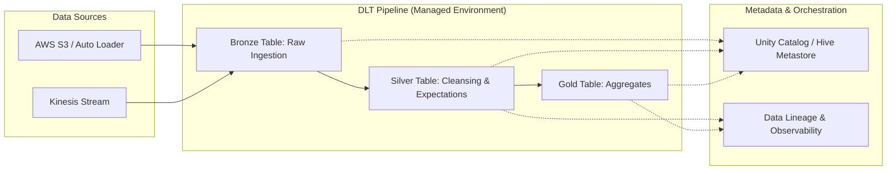

1.  **Data Sources:** The entry point where raw files or streams are ingested, often using Databricks Auto Loader.
2.  **Bronze Table:** The landing zone where data is persisted in Delta format with minimal transformation.
3.  **Silver Table:** The processing engine where complex logic and Expectations are applied to clean and enrich data.
4.  **Gold Table:** The final consumption layer where data is aggregated for business users.
    5.  **DLT Engine:** The managed service that handles cluster provisioning, task scheduling, and dependency management.
    6.  **Unity Catalog:** Provides the centralized governance, security, and lineage tracking for all tables produced.

---

### Comparison: When to Use What

| Option | Best For | Trade-offs | Approx. Cost Signal |
| :--- | :--- | :--- | :--- |
| **Standard Spark (Notebooks)** | Ad-hoc analysis, one-off ETL, experimentation. | High manual effort for orchestration and error handling. | Low (Pay only for cluster use) |
| **DLT (Triggered Mode)** | Batch processing, daily/hourly updates, cost-sensitive workloads. | Not real-time; data latency is tied to pipeline frequency. | Moderate (Efficient, no "always on" cost) |
| **DLT (Continuous Mode)** | Low-latency streaming, real-time dashboards, fraud detection. | Requires always-on clusters; higher cost. | High (Cluster runs 24/7) |
| **AWS Glue (Spark)** | Legacy ETL patterns, integration with AWS-native ecosystem. | Requires managing Glue Jobs and manual orchestration (Step Functions). | Variable (DPU based) |

**How to choose:** If your workload requires managing complex dependencies and data quality constraints, DLT is the superior choice. If you are performing a simple, one-time data migration, a standard Spark job is more cost-effective.

---

### Cost Cheat Sheet

| Scenario | Recommended Option | Key Cost Driver | Watch Out For |
| :--- | :--- | :--- | :--- |
| **High-Volume Batch** | DLT (Triggered) | Cluster size and duration of the "run". | Over-provisioning vCPUs for simple transformations. |
| **Real-time Streaming** | DLT (Continuous) | 24/7 Compute uptime. | Not turning off pipelines when not needed; using too many worker nodes. |
| **Small, Frequent Files** | DLT + Auto Loader | Number of file metadata operations. | "Small File Problem" causing excessive compute overhead. |
| **Complex Data Cleaning** | DLT (with Expectations) | Complexity of Python/SQL logic + compute time. | Using `FAIL UPDATE` on high-volume streams, causing expensive retries. |

> 💰 **Cost Note:** The single biggest cost mistake in DLT is running a pipeline in **Continuous Mode** for a workload that only needs to be updated once an hour. Always default to **Triggered Mode** unless your business KPI explicitly demands sub-minute latency.

---

  ### Service & Tool Integrations

1.  **AWS S3 & Auto Loader:** DLT integrates seamlessly with S3. Using Auto Loader within DLT allows for efficient, incremental file ingestion without manual state tracking.
2.  **Unity Catalog:** DLT populates Unity Catalog, enabling centralized access control, auditing, and end-to-end lineage.
3.  **Amazon Kinesis:** For streaming workloads, DLT can ingest data directly from Kinesis streams, making it a natural choice for AWS-centric architectures.
4.  **Databricks SQL:** The output of DLT (Gold tables) is directly queryable via Databricks SQL warehouses for BI tools like Tableau or PowerBI.

---

### Security Considerations

DLT leverages the underlying Databricks and AWS security models.

| Control | Default State | How to Enable / Strengthen |
| :--- | :--- | :--- |
| **Data Access (RBAC)** | Controlled by Workspace/Unity Catalog permissions. | Use **Unity Catalog** to define fine-grained access at the table/column level. |
| **Encryption (At Rest)** | AWS KMS managed encryption on S3. | Use **Customer Managed Keys (CMK)** via AWS KMS for stricter compliance. |
| **Network Isolation** | Public access via Databricks workspace. | Deploy Databricks in a **Private VPC** with no public internet egress. |
| **Audit Logging**| Databricks Audit Logs. | Enable **AWS CloudTrail** and Databricks System Tables to track all DLT modifications. |

---

### Performance & Cost

To optimize DLT, you must balance **compute density** with **data volume**. 

*   **Tuning Strategy:** For `Streaming Live Tables`, ensure you are using **Auto Loader**. It minimizes the cost of "listing" files in S3, which becomes expensive as S3 buckets grow to millions of objects.
*   **The Bottleneck:** The most common bottleneck is **shuffling** during large joins in the Silver layer. 
*   **Cost Scenario Example:**
    *   *Scenario:* A pipeline processes 1TB of data daily.
    *   *Approach A (Imperative Spark):* A cluster runs for 4 hours, heavily over-provisioned to handle the peak load. Cost: ~$50/day.
    *   *Approach B (DLT Triggered):* A smaller, right-sized cluster runs for 1 hour, utilizing incremental processing to only touch the 10GB of new data. Cost: ~$8/day.
    *   **Outcome:** DLT's ability to handle incremental state management results in an ~84% cost reduction in this scenario.

---

### Hands-On: Key Operations

**Defining a Bronze Table with Auto Loader (SQL)**
This code block defines the initial ingestion point from an S3 bucket.
```sql
CREATE OR REFRESH STREAMING LIVE TABLE bronze_orders
AS SELECT * FROM cloud_files("/mnt/raw_data/orders", "json");
```
> 💡 **Tip:** Always use `cloud_files` (Auto Loader) for Bronze tables to ensure you only process new files and avoid expensive S3 list operations.

**Applying Expectations for Data Quality (Python)**
This snippet demonstrates how to drop malformed records during the transition from Bronze to Silver.
```python
import dlt
from pyspark.sql.functions import col

@dlt.table(name="silver_orders")
@dlt.expect_or_drop("valid_order_id", "order_id IS NOT NULL")
def silver_orders():
    return dlt.read_stream("bronne_orders")
```
> ⚠️ **Warning:** If you use `expect_or_fail`, a single null `order_id` will crash your entire production pipeline and stop all downstream updates.

---

### Customer Conversation Angles

**Q: We already use Airflow to orchestrate our Spark jobs. Why should we switch to DLT?**
**A:** Airflow is a great general-purpose orchestrator, but it doesn't "see" the data inside your tasks. DLT understands the data lineage and dependencies, meaning it handles retries, incremental state, and data quality automatically without you needing to write complex Airflow DAG logic.

**Q: How much more expensive is DLT compared to running standard Databricks Jobs?**
**A:** While the compute cost is similar, the "hidden" cost of manual engineering—maintenance, fixing broken pipelines, and managing checkpoints—is significantly lower with DLT, leading to a lower Total Cost of Ownership.

**Q: Can DLT handle schema evolution if my source S3 files change?**
**A:** Yes, when used with Auto Loader within a DLT pipeline, it can automatically detect and evolve the schema, reducing the manual intervention required when upstream systems change.

**Q: If I use DLT, do I lose control over my Spark configurations?**
**A:** You lose control over the "plumbing" (like checkpointing), but you retain control over the "logic" and can still pass specific Spark configurations through the DLT pipeline settings.

**Q: Does DLT work with Unity Catalog?**
**A:** Absolutely; in fact, it is designed to be the primary way to populate Unity Catalog with governed, lineage-tracked data.

---

### Common FAQs and Misconceptions

**Q: Does DLT replace Spark?**
**A:** No, DLT is a high-level abstraction built *on top* of Spark. It uses Spark to execute the workloads.

**Q: Can I use DLT for ad-hoc SQL queries?**
**A:** No, DLT is for building pipelines. For ad-hoc queries, you should use Databricks SQL Warehouses.

**Q: Is DLT a "black box" where I can't see what's happening?**
**A:** Not at all. You can view the full DAG, inspect the lineage, and check the logs for every expectation violation.

**Q: Can I run DLT in a serverless way?**
**A:** Yes, Databricks is increasingly moving toward serverless compute for DLT, which further reduces management overhead.

**Q: Is DLT only for streaming data?**
**A:** No, as discussed, it supports both "Streaming" (incremental) and "Live" (materialized view/batch) modes. ⚠️ **Warning:** Do not assume "Live Table" means "Real-time"; it depends on your trigger frequency.

---

### Exam & Certification Focus

*   **Medallion Architecture (Domain: Data Engineering Patterns):** Understand the specific roles of Bronze, Silver, and Gold layers.
*   **Expectations (Domain: Data Quality):** Know the difference between `DROP ROW`, `FAIL UPDATE`, and no action. 📌 **Must Know: This is a high-frequency exam topic.**
*   **Streaming vs. Live Tables (Domain: Data Processing):** Be able to identify when to use incremental processing (`STREAMING`) vs. full refreshes (`LIVE`).
*   **Auto Loader Integration (Domain: Ingestion):** Understand how `cloud_files` simplifies ingestion and reduces cost.

---

### Quick Recap
- DLT is **declarative**, focusing on the "what" rather than the "how."
- It natively implements the **Medallion Architecture** for structured data flows.
- **Expectations** are the primary mechanism for enforcing data quality and governance.
- Use **Streaming Live Tables** for incremental, cost-efficient updates.
- DLT significantly reduces **operational overhead** and **engineering debt** by managing orchestration and state.

---

### Further Reading
**Databricks Documentation** — Deep dive into DLT syntax and configuration.
**Delta Lake Whitepaper** — Understanding the underlying storage layer that makes DLT possible.
**AWS Architecture Center** — Reference architectures for building data lakes on AWS using Databricks.
**Databricks Academy** — Hands-on labs for practicing pipeline creation.
**Unity Catalog Guide** — How to govern the tables produced by your DLT pipelines.

---

## Data Governance and Security with Unity Catalog

### Section at a Glance
**What you'll learn:**
- The architectural shift from the legacy Hive Metastore to the Unity Catalog (UC) model.
- How to implement the three-tier namespace (`catalog.schema.table`) for structured data governance.
- Implementing fine-grained access control, including row-level and column-level security.
- Managing data lifecycle through the distinction between Managed and External tables.
- Utilizing lineage and audit logs for enterprise-grade compliance and data lineage.

**Key terms:** `Metastore` · `Identity Federation` · `Three-tier Namespace` · `Managed Table` · `External Location` · `Lineage`

**TL;DR:** Unity Catalog is Databricks' unified governance layer that provides a single, centralized point to manage access, lineage, and auditing across all workspaces and data assets in your AWS environment.

---

### Overview
In the legacy Databricks architecture, security was often fragmented. If you had multiple workspaces in AWS, you often had to manage permissions separately in each, leading to "security silos." For a data engineer, this meant reconciling AWS IAM roles with Hive Metastore ACLs—a manual, error-prone process that creates significant compliance risks.

Unity Catalog solves the "fragmented truth" problem. It moves the source of authority from the individual workspace to the **Account level**. This allows organizations to define a security policy once (e.g., "The Finance Group can see the `revenue` column") and have that policy enforced regardless of which workspace or cluster a user is using to query the data.

From a business perspective, Unity Catalog transforms data from a liability into an asset. By providing automated lineage and centralized auditing, it reduces the "audit tax"—the massive amount of engineering time spent proving to regulators where data came far and how it was transformed. This section covers how to move from simple data movement to professional-grade data stewardship.

---

### Core Concepts

#### 1. The Three-Tier Namespace
Unity Catalog introduces a structured hierarchy that replaces the two-tier `schema.table` model found in the legacy Hive Metastore.
*   **Catalog:** The top-level container (e.g., `production`, `dev`, `staging`).
*   **Schema (Database):** The logical grouping within a catalog (e.g., `sales`, `marketing`).
*   **Table/View/Volume:** The actual data object.

📌 **Must Know:** On the certification exam, you must understand that Unity Catalog uses this **three-tier namespace**. When querying, you refer to data as `catalog_name.schema_name.table_name`.

#### 2. Identity Federation
Unlike the legacy model where users were local to a workspace, UC uses **Identity Federation**. Users and groups are created at the Databricks Account level.
*   **Impact:** A user added to the "Data Scientists" group in the Account console automatically inherits the correct permissions across all attached workspaces.

#### 3. Managed vs. External Tables
Understanding the difference in data ownership is critical for cost and lifecycle management.
*   **Managed Tables:** Databricks manages both the metadata and the physical data in S3. 
    ⚠️ **Warning:** If you run a `DROP TABLE` command on a **managed** table, Databricks deletes both the metadata *and* the underlying files in S3. This is permanent and cannot be undone via SQL.
*   **External Tables:** You provide the S3 path. Databricks only manages the metadata.
    💡 **Tip:** Use External Tables for "Gold" layer data that needs to be shared with other tools (like Amazon Athena or Snowflake) that reside outside of the Databricks ecosystem.

#### 4. Fine-Grained Access Control (FGAC)
UC allows you to move beyond "all or nothing" access.
*   **Column-level security:** Using masking functions to hide PII (e.g., masking everything except the last 4 digits of a SSN).
*   **Row-level security:** Using filtering predicates to ensure a regional manager can only see rows where `region = 'EMEA'`.

---

### Architecture / How It Works

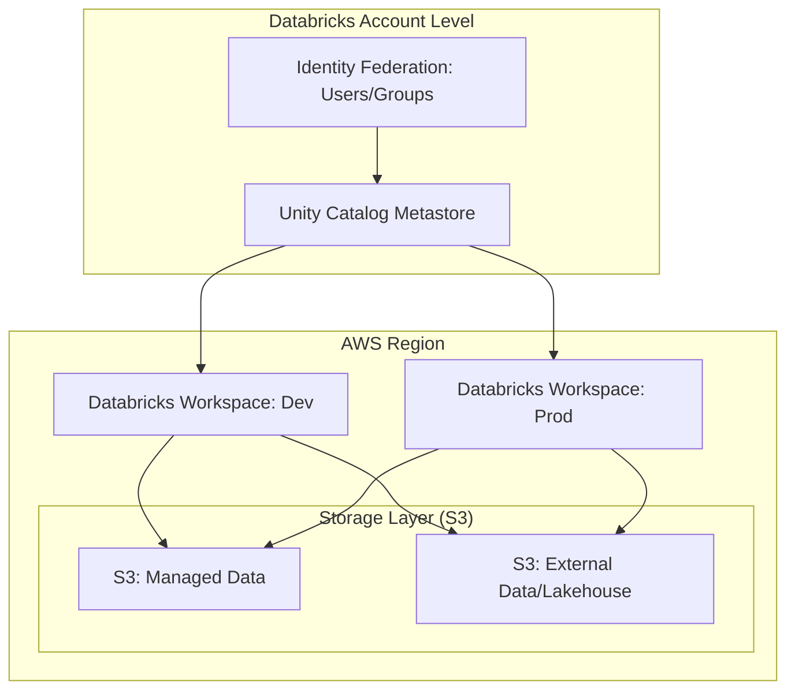

1.  **Unity Catalog Metastore:** The central metadata repository that holds the global state of all objects.
2.  **Identity Federation:** The centralized registry of users and groups managed at the account level.
3.  **Databricks Workspaces:** The compute environments where engineers run SQL/Python; they all point to the same Metastore.
4.  **S3 Managed/External:** The physical storage layer where the actual Parquet/Delta files reside.

---

### Comparison: When to Use What

| Option | Best For | Trade-offs | Approx. Cost Signal |
| :--- | :--- | :--- | :--- |
| **Managed Tables** | Internal ETL/Bronze/Silver layers | Databricks controls lifecycle; less flexibility for external tools. | Lowest management overhead. |
  | **External Tables** | Data sharing with external tools (Athena/Redshift) | Requires manual management of S3 lifecycle/cleanup. | Higher operational "cleanup" cost. |
| **Unity Catalog Volumes**| Unstructured data (PDFs, Images, CSVs) | Easier than managing raw S3 paths; integrates with SQL. | Minimal overhead. |
| **Legacy Hive Metastore**| Legacy workloads (Migration phase only) | No centralized governance; high security fragmentation. | High "hidden" human/audit cost. |

**How to choose:** Use **Managed Tables** for your primary internal Lakehouse architecture to simplify deletions and cleanup. Use **External Tables** only when the data must persist independently of the Databricks lifecycle or be accessed by non-Databricks services.

---

### Cost Cheat Sheet

| Scenario | Recommended Option | Key Cost Driver | Watch Out For |
| :--- | :--- | :--- | :--- |
| **High-volume PII masking** | Dynamic View with Masking | Compute (CPU) for runtime evaluation. | Complex regex masks can slow down queries. |
| **Large-scale Data Ingestion** | Managed Tables | S3 API calls & Storage growth. | `DROP TABLE` doesn't clean up external paths. |
  | **Cross-Workspace Analytics**| Unity Catalog Metastore | No direct cost, but requires Account-level setup. | Misconfigured IAM roles causing 403 errors. |
| **Regulatory Auditing** | UC Audit Logs | Storage of logs in S3. | Log volume explosion in highly active clusters. |

💰 **Cost Note:** The biggest cost mistake is failing to use **Managed Tables** for transient staging data. This leads to "orphaned" files in S3—data that is no longer in your catalog but is still costing you storage and potentially violating GDPR/CCPR deletion requests.

---

### Service & Integrations

1.  **AWS IAM & Storage Credentials:**
    *   UC uses **Storage Credentials** (mapping to an IAM Role) and **External Locations** (the S3 path) to bridge the gap between the Catalog and S3.
2.  **AWS Glue:**
    *   While Glue is excellent for ETL, UC provides superior lineage. Many architectures use Glue for discovery but UC as the "Single Source of Truth" for governance.
3.    **MLflow:**
    *   UC allows you to register models within the same three-tier namespace as your data, enabling "Model Lineage" (knowing exactly which version of a table trained which version of a model).

---

### Security Considerations

| Control | Default State | How to Enable / Strengthen |
| :--- | :--- | :--- |
| **Authentication** | Identity Federation (Account Level) | Use SSO (SAML/Okta) integrated with Databricks Account. |
| **Authorization** | `USAGE` on Catalog/Schema required | Use SQL `GRANT` and `REVOKE` statements. |
| **Data Encryption** | AWS S3 Managed (SSE-S3) | Use AWS KMS with Customer Managed Keys (CMK) for higher control. |
| **Audit Logging** | Enabled in UC | Configure log delivery to a dedicated S3 bucket for long-term retention. |

---

### Performance & Cost

**Tuning Guidance:**
While Unity Catalog introduces a metadata layer, the performance impact on query execution is negligible because the metadata is cached. However, **complex Row-Level Security (RLS)** can introduce latency. If a view uses a heavy `JOIN` to check user permissions for every row, your query speed will drop.

**Example Cost Scenario:**
Imagine a `sales_transactions` table with 1 billion rows.
*   **Scenario A (No Security):** Querying the table is a simple scan. Cost: $1.00 (Compute).
*   **Scenario B (Complex RLS):** Every query performs a `JOIN` against a `user_permissions` table. If the permission table is large and unoptimized, the query might take 2x longer. Cost: $2.00 (Compute).
*   **Strategy:** Always ensure your "Permission Mapping" tables are small, cached, or materialized to minimize the compute tax of security.

---

### Hands-On: Key Operations

**1. Creating a new Catalog for a specific business unit:**
```sql
CREATE CATALOG IF NOT EXISTS finance_catalog;
```
💡 **Tip:** Creating catalogs per department (Finance, HR, Ops) is a best practice for strict isolation.

**2. Granting read access to a specific group:**
```sql
GRANT USAGE ON CATALOG finance_catalog TO `finance_group`;
GRANT SELECT ON SCHEMA finance_catalog.revenue_data TO `finance_group`;
```

**3. Implementing Column-Level Masking for PII:**
First, create a masking function:
```sql
CREATE FUNCTION finance_catalog.mask_ssn(ssn STRING)
RETURN CASE WHEN is_account_group_member('admin') THEN ssn ELSE '***-**-****' END;
```
Then, apply it to a column in a view:
```sql
CREATE VIEW finance_catalog.revenue_data.secure_customers AS
SELECT customer_id, finance_catalog.mask_ssn(ssn) AS ssn
FROM finance_catalog.revenue_data.raw_customers;
```
💡 **Tip:** Always grant `USAGE` on the function itself to the users who need to run the view.

---

### Customer Conversation Angles

**Q: We already use AWS IAM roles to secure our S3 buckets. Why do we need Unity Catalog?**
**A:** IAM is great for infrastructure security, but it's "all or nothing." Unity Catalog allows you to grant access to specific rows or columns within a file, which IAM cannot do, and it centralizes that management so you don't have to manage hundreds of complex IAM policies.

**Q: Will moving to Unity Catalog require us to rewrite all our ETL pipelines?**
**A:** Not necessarily. Most Spark code remains the same; you are simply updating the reference from `database.table` to `catalog.database.table`.

**Q: If I delete a table in Unity Catalog, is my data gone forever?**
**A:** It depends. If it's a **Managed Table**, yes, the data is deleted from S3. If it's an **External Table**, only the metadata is removed; the files stay in your S3 bucket.

**Q: How does this help with GDPR compliance?**
**A:** UC provides built-in data lineage. You can trace a piece of PII from its ingestion in the Bronze layer all the way to the final reporting dashboard, making it much easier to prove compliance during an audit.

**Q: Does Unity Catalog add latency to my Spark queries?**
**A:** The metadata lookup happens at the start of the query. While there is a microscopic overhead for permission checking, the primary impact is the compute cost of complex logic like row-level filtering.

---

### Common FAQs and Misconceptions

**Q: Can I use Unity Catalog with the legacy Hive Metastore?**
**A:** You can have both running in the same account, but they are separate. You cannot "partially" migrate a single table into UC without defining it as a Catalog object.

**Q: Does Unity Catalog replace AWS Glue Data Catalog?**
**A:** Not strictly. They can coexist, but UC is designed to be the authoritative governance layer for Databricks workloads. ⚠️ **Warning:** Attempting to use Glue as the primary metadata source for Databricks workloads often leads to "split-brain" security where permissions are inconsistent.

**Q: Is the three-tier namespace a limitation?**
**A:** No, it's a feature. It allows for much better organization of large-scale data estates.

**Q: Can I use Unity Catalog to govern data that isn't in S3?**
**A:** Yes, via "Lakehouse Federation," you can govern external databases like PostgreSQL or Snowflake through the Unity Catalog interface.

**Q: Does Unity Catalog work with all Databricks cluster types?**
**A:** It requires "Access Mode" compatibility (Shared or Single User). ⚠️ **Warning:** Legacy "Standard" clusters that do not support Unity Catalog cannot use the new security features like dynamic masking.

---

### Exam & Certification Focus

*   **Domain: Data Engineering (Governance & Security)**
    *   Identify the difference between **Managed** and **External** tables (High Frequency). 📌
    *   Understand the **Three-Tier Namespace** structure (`catalog.schema.table`). 📌
    *   Distinguish between **Identity Federation** (Account level) and **Workspace-local** users.
    *   Explain the mechanism of **Row-Level Security** using SQL functions.
    *   Understand the impact of `DROP TABLE` on different table types.

---

### Quick Recap
- Unity Catalog provides a **centralized, account-level** governance model.
- The **three-tier namespace** (`catalog.schema.table`) is the foundation of UC.
- **Managed Tables** allow Databricks to control the physical data lifecycle.
- **Identity Federation** allows for seamless user management across multiple workspaces.
- **Fine-grained access control** enables secure, compliant data sharing via masking and filtering.

---

### Further Reading
**Databricks Documentation** — Official guide to Unity Catalog setup and administration.
**Databricks Whitepaper: Data Governance** — Deep dive into the architecture of the Lakehouse.
**AWS Architecture Center** — Best practices for building secure Data Lakes on AWS.
**Databrks Academy** — Hands-on labs for implementing Unity Catalog security.
**Delta Lake Documentation** — Understanding how transaction logs enable versioning and auditability.

---

## Monitoring, Logging, and Observability in Databricks

### Section at a Glance
**What you'll learn:**
- Distinguishing between Monitoring, Logging, and Observability in a Lakehouse context.
- Implementing and managing Cluster Logs and Audit Logs on AWS S3.
- Utilizing the Databricks SQL Query History and Spark UI for performance troubleshooting.
- Integrating Databrical telemetry with AWS CloudWatch and Amazon Managed Grafana.
- Setting up proactive alerting for pipeline failures and cost anomalies.

**Key terms:** `Control Plane` · `Data Plane` · `Audit Logs` · `Telemetry` · `Lineage` · `Log Delivery`

**TL;DR:** Monitoring ensures your Databricks workloads are running; logging tells you what happened when they failed; observability allows you to understand *why* a performance bottleneck occurred by analyzing the relationships between logs, metrics, and traces.

---

### Overview
In a production-grade Data Engineering ecosystem, "it's running" is never a sufficient answer. For a business, a pipeline that completes successfully but produces duplicate data is just as catastrophic as a pipeline that fails entirely. The cost of data downtime—the period when data is missing, inaccurate, or late—can reach millions of dollars in lost operational efficiency and eroded customer trust.

This section addresses the critical need for visibility. We move beyond simple "up/down" monitoring into the realm of observability. We will explore how to instrument your Databrability environment so that when a job slows down or a Spark partition skews, you aren't just notified of a failure, but you are provided with the "breadcrumbs" (logs and traces) necessary to perform a root-cause analysis (RCA) without manually re-running the job.

Within the context of this course, we view monitoring not as an afterthought, but as a core component of the Data Engineering Lifecycle. You will learn how to leverage the separation of the Databricks **Control Plane** (managed by Databricks) and the **Data Plane** (your AWS VPC) to ensure that telemetry is captured, aggregated, and actionable.

---

### Core Concepts

#### 1. The Three Pillars of Observability in Databricks
To achieve true observability, you must implement three distinct types of telemetry:
*   **Logs:** The immutable record of events (e.g., "User X started Cluster Y", "Task Z failed with OutOfMemoryError").
*   **Metrics:** Numerical representations of state over time (e.g., CPU utilization, Spark executor memory usage, number of records processed per second).
*   **Traces:** The journey of a single request or data packet through various distributed components (e.g., the path a specific Delta Table update takes from a Notebook through a DLT pipeline).

#### 2. Log Types and Scopes
*   **Cluster Logs:** These reside in your **Data Plane**. They include `stdout` and `stderr` from the Spark executors and driver. 
    ⚠️ **Warning:** Cluster logs are **not** automatically persisted to S3. You must explicitly configure an S3 bucket in the cluster configuration for log delivery, otherwise, logs are lost when the cluster terminates.
*   **Audit Logs:** These reside in the **Control Plane**. They record all actions taken in the Databricks workspace (e.g., identity changes, notebook edits, cluster creations). 
    📌 **Must Know:** For compliance-heavy industries (Finance, Healthcare), Audit Logs are the primary mechanism for satisfying SOC2 or HIPAA requirements regarding data access tracking.
*   **Unity Catalog Lineage:** This is the "modern observability." It provides a visual trace of how data moves from raw bronze to refined gold layers.

#### 3. Spark UI vs. Databricks SQL Query History
*   **Spark UI:** Deep, low-level technical details (DAGs, shuffle reads, spill to disk). Best for debugging hardware-level issues or complex join inefficiencies.
*   **SQL Query History:** High-level, user-friendly interface for SQL Warehouse performance. Shows execution time, bytes scanned, and query plan.
    💡 **Tip:** Use Query History first for SQL-based workloads; only dive into the Spark UI if the Query History reveals massive "Spill to Disk" metrics.

---

### Architecture / How It Works

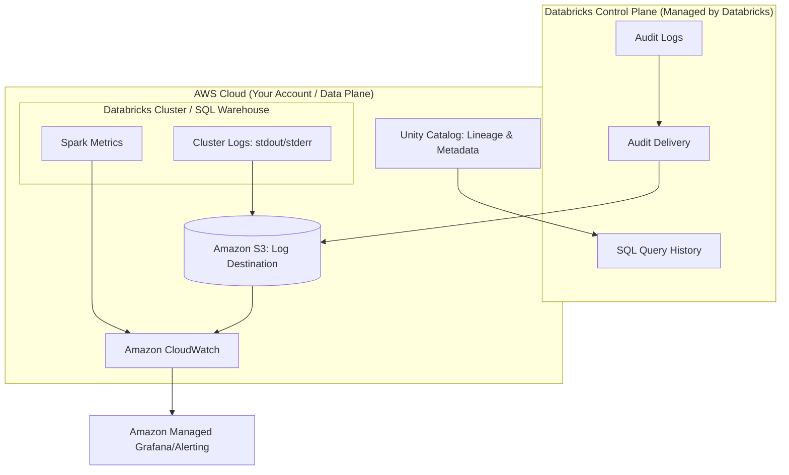

1.  **Control Plane:** Databricks captures user activity and SQL execution metadata.
2.  **Data Plane:** Your compute resources generate raw system and application logs.
3.  **S3 Destination:** The central repository where both Audit Logs and Cluster Logs are persisted for long-term storage and analysis.
4.  **CloudWatch:** Acts as the ingestion engine for metrics and log patterns to trigger alarms.
5.  **Unity Catalog:** Provides the structural observability layer, linking data movement to metadata.
6.  **Observability Layer:** Tools like Grafana or CloudWatch Dashboards aggregate this data for human consumption.

---

### Comparison: When to Use What

| Option | Best For | Trade-offs | Approx. Cost Signal |
| :--- | :--- | :--- | :--- |
| **Spark UI** | Deep-dive debugging of executor memory, shuffle, or skew. | Only available while the cluster is running. | Free (Compute cost only) |
| **Databricks SQL History** | Analyzing SQL Warehouse performance and query optimization. | Limited to SQL-based workloads. | Free (Included in SQL Warehouse) |
| **CloudWatch Logs/Metrics** | High-level infrastructure alerting (e.g., Cluster failure). | Requires setup of log delivery to S3/CloudWatch. | Moderate (Ingestion/Storage) |
| **Unity Catalog Lineage** | Understanding data impact and downstream dependencies. | Requires Unity Catalog to be enabled. | Low (Metadata overhead) |

**How to choose:** Start with **Unity Catalog Lineage** to see *what* changed, move to **SQL History/Spark UI** to see *how* it performed, and use **CloudWatch/Audit Logs** to see *who* or *what* triggered the event.

---

### Cost Cheat Sheet

| Scenario | Recommended Option | Key Cost Driver | Watch Out For |
| :--- | :--- | :--- | :--- |
| **Long-term Compliance** | S3 Glacier (via Audit Logs) | Storage volume & Retrieval | ⚠️ High cost to re-index massive log archives. |
| **Real-time Alerting** | CloudWatch Alarms | Metric frequency (Resolution) | 💰 High-resolution metrics (1-sec) increase costs significantly. |

| **Performance Debugging**| Spark UI / SQL History | Cluster uptime | ⚠️ Logs disappear if the cluster is terminated and not configured to S3. |
| **Data Governance Audit** | Unity Catalog Lineage | Number of lineage edges | Over-instrumenting every tiny transformation can create metadata bloat. |

> 💰 **Cost Note:** The single biggest cost mistake in observability is **Log Over-Ingestion**. Sending every single `DEBUG` level log from a high-frequency Spark job into CloudWatch can result in an AWS bill that exceeds your actual Databrks compute spend. Always filter for `ERROR` or `WARN` levels for real-time ingestion.

---

### Service & Integrations

#### 1. AWS CloudWatch Integration
1.  Configure Databricks to write Cluster Logs to a specific S3 bucket.
2.  Set up an **Amazon CloudWatch Agent** or an **S3 Event Notification** to trigger a Lambda function.
3.  The Lambda function parses the logs and pushes custom metrics to CloudWatch.
4.ly 4. Create CloudWatch Alarms based on these metrics.

#### 2. Unity Catalog & Data Lineage
1.  Enable Unity Catalog on your Databricks Metastore.
2.  As Spark jobs run, Unity Catalog automatically captures the relationship between source and target tables.
3.  Use the Catalog Explorer to visualize the "upstream" and "downstream" impact of a table change.

---

### Security Considerations

| Control | Default State | How to Enable / Strengthen |
| :--- | :--- | :--- |
| **Audit Log Access** | Restricted to Workspace Admins | Use IAM roles to grant specific Data Engineers "Read" access to the S3 log bucket. |
| **Log Encryption** | Encrypted at rest (S3 default) | Use **AWS KMS** with customer-managed keys (CMK) for higher compliance. |
| **Network Isolation** | Logs move via AWS backbone | Ensure all log-delivery S3 buckets are accessed via **VPC Endpoints** to avoid the public internet. |

---

### Performance & Cost
When tuning observability, you are balancing **Visibility** vs. **Latency** vs. **Cost**. 

**Example Scenario:**
An engineer is debugging a job that fails 10% of the time. 
- **Approach A (Cheap):** Only monitor `ERROR` logs in CloudWatch. *Result:* You know it failed, but you don't know if it was due to a memory spike or a network timeout.
- **Approach B (Expensive):** Stream all `INFO` and `DEBUG` logs to CloudWatch at 1-second resolution. *Result:* You have total visibility, but your CloudWatch ingestion costs are $500/month for a job that only costs $100/month to run.

**The Golden Rule:** Use **S3** as your "Source of Truth" for all logs (cheap storage) and use **CloudWatch/Datadog/Grafana** only for "Aggregated Summaries" (expensive, real-time ingestion).

---

### Hands-On: Key Operations

**Querying SQL Warehouse Performance using SQL:**
Run this in a Databricks SQL Editor to identify the longest-running queries in your warehouse.
```sql
SELECT 
  query_id, 
  query_text, 
  total_duration / 1000 AS duration_seconds,
  user_name
FROM system.query_history
ORDER BY total_duration DESC
LIMIT 10;
```
> 💡 **Tip:** The `system` catalog is a specialized area of Unity Catalog that allows you to query operational metadata using standard SQL.

**Configuring Cluster Log Delivery (Python/API Concept):**
While usually done via the UI, this represents the logic needed for IaC (Terraform).
```python
# Concept: Defining cluster log destination in a JSON cluster config
cluster_config = {
    "cluster_name": "Production_ETL_Cluster",
    "spark_conf": {
        "spark.databricks.clusterLogs.destination": "s3://my-company-logs/cluster-logs/"
    }
}
# 💡 Note: Ensure the Databricks Instance Profile has 's3:PutObject' permissions on this bucket.
```

---

### Customer Conversation Angles

**Q: "How will I know if my production pipeline fails at 2:00 AM?"**
**A:** We implement a multi-layered alerting strategy using CloudWatch Alarms tied to your S3 log stream, ensuring you receive notifications via PagerDuty or Email the moment a failure is logged.

**Q: "Can we use our existing Datadog/Grafana dashboards for Databricks?"**
**A:** Absolutely. By configuring Databricks to land logs in S3, we can use standard AWS integration patterns to pull that telemetry into your existing enterprise observability tools.

**Q: "Is the cost of monitoring going to significantly impact our Databricks spend?"**
**A:** Not if implemented correctly. We follow a 'Store in S3, Alert in CloudWatch' pattern, which keeps storage costs extremely low and only incurs high costs for the specific metrics we need for alerting.

**Q: "How do we prove to auditors who accessed our sensitive PII data?"**
**A:** We leverage Unity Catalog Audit Logs, which provide an immutable, unchangeable record of every identity that queried or modified specific tables.

**Q: "If a cluster is terminated, do we lose the logs?"**
**A:** Not if we have configured the 'Log Delivery' feature to an S3 bucket, which persists the logs independently of the cluster lifecycle.

---

### Common FAQs and Misconceptions

**Q: Are Databricks Audit Logs and Spark Logs the same thing?**
**A:** No. Audit Logs track *user actions* in the workspace; Spark Logs track *code execution* within the cluster.

**Q: Can I use the Spark UI to debug a job that finished yesterday?**
**A:** ⚠️ **Warning:** No. The Spark UI is ephemeral. Once the cluster is terminated, the UI is gone. You must have configured Cluster Log delivery to S3 to see historical execution details.

**Q: Does enabling Unity Catalog lineage impact our job performance?**
**A:** The overhead is minimal and is considered a best practice for maintaining data integrity and observability.

**Q: Does CloudWatch capture everything happening inside my Spark executors?**
**A:** Not automatically. CloudWatch captures what you explicitly send to it via log agents or S3 triggers.

**Q: Is the 'System' catalog available in all Databricks workspaces?**
**A:** No, it requires Unity Catalog to be enabled and specifically configured.

**Q: Can I monitor costs within Databricks itself?**
**A:** Yes, using the `system.billing` schema in Unity Catalog, you can run SQL queries to track compute usage and costs.

---

### Exam & Certification Focus
*   **Domain: Data Engineering with Databricks**
    *   Understand the difference between **Control Plane** and **Data Plane** telemetry. 📌
    *   Identify the requirement for **S3 bucket configuration** for persistent cluster logs. 📌
    *   Knowledge of **Unity Catalog** as the source for lineage and auditability.
    *   Ability to distinguish between **Monitoring** (status) and **Observability** (root cause).

---

### Quick Recap
- **Monitoring** is for availability; **Observability** is for understanding complexity.
- **Cluster Logs** must be directed to **S3** to survive cluster termination.
- **Audit Logs** are essential for security, compliance, and tracking user activity.
- **CloudWatch** is great for alerting, but **S3** is the cost-effective home for raw logs.
- **Unity Catalog** provides the most powerful layer of observability through automated **Lineage**.

---

### Further Reading
**Databricks Documentation** — Detailed guide on configuring cluster log delivery to S3.
**AWS CloudWatch User Guide** — Understanding how to ingest and alert on log patterns.
**Unity Catalog Whitepaper** — Deep dive into data governance and lineage capabilities.
**Databricks System Tables Guide** — How to query billing, lineage, and audit data using SQL.
**AWS Well-Architected Framework (Observability Pillar)** — Best practices for building resilient, visible systems.

---

## Cost Management and AWS Resource Optimization

### Section at a Glance
**What you'll learn:**
- Distinguishing between All-purpose and Job clusters to minimize compute spend.
- Leveraging AWS Spot Instances for non-critical Spark workloads.
- Implementing Delta Lake maintenance (`OPTIMIZE`, `ZORDER`, `VACUUM`) for storage and performance efficiency.
- Configuring Auto-scaling and Auto-termination to prevent "zombie" cluster costs.
- Utilizing AWS Cost Allocation Tags and Unity Catalog for granular cost attribution.

**Key terms:** `All-purpose Clusters` · `Job Clusters` · `Spot Instances` · `Delta Lake Vacuum` · `Auto-scaling` · `Cost Allocation Tags`

**TL;DR:** Efficient Databricks engineering on AWS requires a dual focus on compute lifecycle management (using Job clusters and Spot instances) and storage hygiene (using Delta Lake maintenance) to ensure performance does not outpace budget.

---

### Overview
In a modern data estate, the greatest risk to a Data Engineering project is not technical failure, but "unbounded cost." Unlike traditional on-premises environments where capacity is a sunk cost, AWS-based Databricks environments operate on a consumption-based model. This creates a direct, real-time correlation between code efficiency and the monthly cloud bill.

For the Data Engineer, cost management is a core part of the "Definition of Done." A pipeline that delivers 100% accuracy but costs more than the business value it generates is a failed pipeline. This section addresses the fundamental tension between performance (speed/throughput) and economy (resource utilization).

We will explore how to move from expensive, interactive "Always-on" patterns to efficient, ephemeral "Run-to-completion" patterns. We will also look at how the underlying AWS infrastructure—specifically EC2 and S3—can be tuned via Databricks-specific configurations to optimize the Total Cost of Ownership (TCO).

---

### Core Concepts

#### 1. Compute Architecture: All-purpose vs. Job Clusters
The most significant cost lever in Databricks is the choice of cluster type.
*   **All-purpose Clusters:** These are interactive clusters used for manual development, notebooks, and ad-hoc querying. They support multi-user concurrency but carry a significantly higher DBU (Databricks Unit) rate.
*   **Job Clusters:** These are ephemeral clusters created specifically to run a single workload (a job). They are terminated automatically once the task completes. 📌 **Must Know:** Job clusters are priced at a much lower DBU rate than All-purpose clusters.

#### 2. EC2 Instance Strategies
Databricks runs on AWS EC2. How you choose these instances impacts both cost and stability.
*   **On-Demand Instances:** Guaranteed availability. Best for mission-critical, time-sensitive ETL.
*   **Spot Instances:** Uses spare AWS capacity at a massive discount (up to 90%). ⚠️ **Warning:** Spot instances can be reclaimed by AWS with very little notice. If your driver node is on a Spot instance and it is reclaimed, the entire cluster fails. Always use On-Demand for the **Driver** and Spot for **Workers**.

#### 3. Delta Lake Storage Optimization
Cost isn't just compute; it's also the S3 storage footprint.
*   **`OPTIMIZE`:** Compacts small files into larger, more efficient Parquet files. This reduces S3 metadata overhead and improves read performance.
*   **`ZORDER`:** A technique to colocate related information in the same files, drastically reducing the amount of data scanned.
*   **`VACUUM`:** Removes old data files that are no longer needed by the current state of the table. 💰 **Cost Note:** While `VACUUM` saves S3 storage costs, setting the retention period too low can break "Time Travel" capabilities.

#### 4. Cluster Lifecycle Management
*   **Auto-scaling:** Automatically adds or removes workers based on the workload's Spark executor demand.
*   **Auto-termination:** A setting that shuts down an All-purpose cluster after a period of inactivity (e.g., 20 minutes). 💡 **Tip:** Always set a strict auto-termination limit for development clusters to prevent accidental overnight spend.

---

### Architecture / How It Works

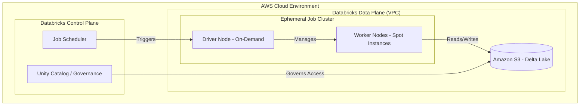

1.  **Job Scheduler:** Orchestrates the start and end of the cluster lifecycle.
2.  **Driver Node:** The "brain" of the cluster, handling task orchestration and metadata; must be On-Demand for stability.
3.  **Worker Nodes:** The "muscle" performing the actual data processing; ideally composed of Spot instances for cost savings.
4.  **Amazon S3:** The persistent storage layer where the Delta Lake transaction logs and Parquet data reside.
*   **Unity Catalog:** Provides the centralized governance layer to track which users/jobs are accessing which data, enabling cost attribution.

---

### Comparison: When to Use What

| Option | Best For | Trade-offs | Approx. Cost Signal |
| :--- | :--- | :--- | :--- |
| **All-purpose Cluster** | Exploratory Data Analysis (EDA), Debugging, Prototyping. | Highest DBU cost; risk of leaving "zombie" clusters running. | High (Premium) |
| **Job Cluster** | Production ETL, Scheduled Pipelines, Model Training. | Cannot be used interactively; requires a defined entry point. | Low (Discounted) |
| **Spot Instances** | Non-critical workloads, batch processing, data shuffling. | Risk of node preemption (interruption) leading to job retries. | Very Low |
| **On-Demand Instances** | Critical production jobs, Driver nodes, Streaming. | No risk of interruption, but higher-priced. | Standard |

**Decision Logic:** Use All-purpose clusters only while you are actively typing in a notebook. For anything that runs on a schedule or via an orchestration tool (like Airflow or Databrics Workflows), **always** use a Job Cluster.

---

### Cost Cheat Sheet

| Scenario | Recommended Option | Key Cost Driver | Watch Out For |
| :--- | :--- | :--- | :--- |
| **Daily Batch ETL** | Job Cluster + Spot Workers | DBU rate & Instance count | Driver node being on Spot |
| **Ad-hoc SQL Querying** | All-purpose Cluster | Auto-termination timeout | Forgetting to turn off the cluster |
| **Heavy Data Science/ML**| All-purpose + High Memory | Instance Type (r-series vs m-series) | Over-provisioning RAM |
| **Long-term Data Archiving**| S3 Lifecycle Policies | S3 API requests & Storage volume | Deleting files needed for Time Travel |

> 💰 **Cost Note:** The single biggest mistake in Databricks cost management is using All-purpose clusters for production pipelines. This mistake can easily triple your compute spend without providing any functional benefit.

---

### Service & Integrations

1.  **AWS Cost Explorer & Tags:**
    *   Apply `Project`, `Environment`, and `Owner` tags to your Databricks clusters.
    *   Use these tags in AWS Cost Explorer to generate granular reports showing exactly which pipeline is driving the bill.
2.  **AWS Glue Integration:**
    *   When migrating from Glue to Databricks, compare the "DPU" (Glue) vs "DBU" (Databricks) costs.
    *   Databricks often provides better performance for complex joins (lower duration), which can offset the higher per-unit cost.
3.  **Amazon S3 Lifecycle Management:**
    *   Automate the transition of older, unneeded Delta logs or raw data from S3 Standard to S3 Intelligent-Tiering or Glacier to reduce long-term storage costs.

---

### Security Considerations

Cost management and security intersect heavily in **Identity and Access Management (IAM)** and **Governance**.

| Control | Default State | How to Enable / Strengthen |
| :--- | :--- | :--- |
| **Cost Attribution** | Unstructured/Generic | Use **Unity Catalog** and Cluster Tags to map compute to specific business units. |
| **Network Isolation** | Public/Internal VPC | Deploy Databricks in a **Customer-managed VPC** with no public IP for compute nodes. |
| **Data Encryption** | Encrypted at Rest (AWS) | Use **AWS KMS** with customer-managed keys (CMK) for even stricter control. |
| **Audit Logging** | Basic CloudTrail | Enable **Databricks Audit Logs** to track who started/stopped clusters and the cost impact. |

---

### Performance & Cost

Optimization is a balancing act. Increasing performance often increases cost, but **inefficient** performance is a pure loss.

**Example Scenario: The "Small File Problem"**
Imagine a pipeline that writes data every 5 minutes. After 24 hours, you have 288 tiny files.
*   **The Cost:** Every time a downstream job reads this table, it must perform 288 separate S3 `GET` requests and metadata lookups. This increases both **S3 API costs** and **Databricks compute time** (due to overhead).
*   **The Fix:** Run an `OPTIMIZE` command daily.
*   **The ROI:** While `OPTIMIZE` costs a few cents in compute, it might reduce the downstream job duration from 10 minutes to 2 minutes, saving significant DBU spend over the month.

---

### Hands-On: Key Operations

**Step 1: Compacting small files to improve read performance.**
Run this on a table that undergoes frequent, small writes.
```sql
-- This compacts small files into larger, more efficient blocks.
OPTIMIZE silver_sales_data;
```
> 💡 **Tip:** You can combine this with `ZORDER` on columns frequently used in `WHERE` clauses to maximize the benefit.

**Step 2: Reorganizing data for high-performance filtering.**
```sql
-- This colocates related data in the same files, reducing data scanning.
OPTIMIZE silver_sales_data ZORDER BY (customer_id, transaction_date);
```

**Step 3: Cleaning up old data to manage S3 storage costs.**
Run this to remove files no longer needed by the current version of the table.
```python
# Python/PySpark way to vacuum a table
from delta.tables import DeltaTable

deltaTable = DeltaTable.forPath(spark, "/mnt/data/silver_sales_data")
# Removes files older than the default 7-day retention period
deltaTable.vacuum(retentionHours=168) 
```
⚠️ **Warning:** Never set `retentionHours` to a value lower than the time it takes for your longest-running concurrent job to complete, or you may delete files that a running job still needs to read.

---

### Customer Conversation Angles

**Q: "Why is our Databricks bill higher than our previous AWS Glue bill?"**
**A:** "While the per-unit DBU cost might be higher, Databricks' ability to process much larger volumes of data more quickly via the Photon engine often results in a lower *total* cost for the same workload."

**Q: "How can we prevent developers from accidentally running up huge bills?"**
**A:** "We implement strict Auto-termination policies for all interactive clusters and use AWS Cost Allocation Tags to ensure every cluster is tied to a specific budget and owner."

**Q: "Can we use Spot instances for everything to save money?"**
**A:** "We recommend Spot instances for your worker nodes to capture the 90% discount, but we must keep the Driver node on On-Demand to ensure the job doesn't fail if a worker is reclaimed."

**Q: "How much will `OPTIMIZE` cost us in compute?"**
**A:** "The cost is usually negligible compared to the savings gained from reduced S3 API calls and faster downstream execution; it's a high-ROI maintenance task."

**Q: "How do we know which department is responsible for which part of the bill?"**
**A:** "By utilizing Unity Catalog and enforcing Cluster Tags, we can integrate Databricks usage directly with AWS Cost Explorer for department-level chargebacks."

---

### Common FAQs and Misconceptions

**Q: Does Auto-scaling always save money?**
**A:** Not necessarily. Auto-scaling saves money by removing idle workers, but if your workload is constantly high, it might simply scale *up* to a larger, more expensive cluster. ⚠️ **Warning:** Auto-scaling manages capacity, not budget.

**Q: If I use `VACUUM`, will I lose my ability to use `DESCRIBE HISTORY`?**
**A:** No, you can still see the history, but you will lose the ability to "Time Travel" back to any version of the data that relied on the files you just deleted.

**Q: Is a larger cluster always faster?**
**A:** No. If your data volume is small, a massive cluster will spend more time on "network shuffle" and orchestration overhead than actual processing. This is a waste of money.

**Q: Does `ZORDER` work on every column?**
**A:** No. You should only `ZORDER` columns that are used frequently in filters. Over-using `ZORDER` on too many columns can actually degrade performance.

**Q: Are All-purpose clusters cheaper if I use them for scheduled tasks?**
**A:** No, they are actually more expensive. Always use Job Clusters for scheduled tasks to take advantage of the lower DBU rate.

---

### Exam & Certification Focus

*   **Cluster Types (Domain: Databricks Infrastructure):** Distinguishing between All-purpose and Job clusters and their respective pricing models. 📌 **High Frequency**
*   **Compute Optimization (Domain: Data Engineering Workflows):** Implementing Auto-termination and understanding the impact of Spot Instances.
*   **Storage Management (Domain: Data Lakehouse Architecture):** Understanding the mechanics and purpose of `OPTIMIZE`, `ZORDER`, and `VACUUM`.
*   **Governance & Cost (Domain: Data Governance):** Using Tags and Unity Catalog for cost attribution and auditing.

---

### Quick Recap
- **Use Job Clusters** for all production workloads to minimize DBU spend.
- **Leverage Spot Instances** for worker nodes to drastically reduce EC2 costs.
- **Always configure Auto-termination** on interactive clusters to prevent zombie costs.
- **Maintain Delta Tables** with `OPTIMIZE` and `VACUUM` to balance performance and S3 storage costs.
- **Enforce Tagging** to ensure cost transparency and accountability across the organization.

---

### Further Reading
**Databricks Documentation** — Detailed guide on Cluster Types and DBU pricing.
**AWS Whitepaper: Cost Optimization for AWS** — General principles for managing cloud spend.
**Delta Lake Documentation** — Deep dive into the mechanics of `OPTIMIZE` and `VACUUM`.
**AWS Cost Management Workshop** — Hands-on patterns for using Cost Explorer and Tags.
**Databricks Best Practices for Databricks SQL** — Specifically focused on warehouse cost management.

---

## Migration Strategies: Transitioning from AWS Glue to Databricks

### Section at a Glance
**What you'll learn:**
- Evaluating migration patterns: Lift-and-Shift vs. Re-platforming vs. Refactoring.
- Translating AWS Glue-specific PySpark (`glueContext`) to standard Spark and Delta Lake.
- Migrating metadata from the AWS Glue Data Catalog to Databrical Unity Catalog.
- Transitioning from AWS Glue Crawlers to Databricks Auto Loader and Delta Live Tables (DLT).
- Architecting a continuous migration path that minimizes downtime and data inconsistency.

**Key terms:** `Lift-and-Shift` · `Refactoring` · `Unity Catalog` · `Auto Loader` · `Delta Lake` · `Metadata Parity`

**TL;DR:** Migrating from AWS Glue to Databricks is less about moving data and more about moving *logic and governance*; while your data stays in S3, your compute logic must evolve from Glue-specific APIs to standardized Spark/Delta patterns to unlock the Lakehouse's full value.

---

### Overview
For many enterprises, AWS Glue has served as the reliable, serverless engine for ETL for years. However, as data complexity grows, organizations often encounter "The Glue Wall"—a point where the lack of interactive debugging, the limitations of the Glue Data Catalog's governance, and the difficulty of managing complex dependencies create significant engineering friction.

The business driver for migrating to Databrical is rarely "cheaper compute" and almost always "higher engineering velocity." Customers migrate when they need to move from simple batch ETL to real-time streaming, unified governance (Unity Catalog), and a collaborative environment where Data Scientists and Engineers work on the same compute.

This section covers how to navigate this transition. We will look at how to treat your existing S3 data as the "Single Source of Truth" while fundamentally upgrading the "Brain" of your operations from the Glue Catalog and Jobs to the Databricks Lakehouse.

---

### Core Concepts

#### 1. Migration Archetypes
When approaching a migration, you must choose a strategy based on your budget and desired end-state:
*   **Lift-and-Shift (Re-hosting):** Taking existing PySpark code and running it on Databricks clusters with minimal changes. 
    > ⚠️ **Warning:** Simply running Glue PySpark scripts on Databricks will fail if they rely on `awsglue` libraries or `glueContext`. You must strip out Glue-specific wrappers.
*   **Re-platforming (Re-architecting):** Moving from Glue Jobs to Databricks Workflows and replacing Glue Crawlers with Auto Loader. This is the "sweet spot" for most organizations.
*   **Refactoring:** Re-writing logic to leverage Delta Lake features like `MERGE`, `Z-ORDER`, and Delta Live Tables (DLT). This provides the highest ROI but requires the most engineering effort.

#### 2. Metadata Transition: Glue Catalog to Unity Catalog
The most critical part of the migration is the metadata layer. AWS Glue relies on the Glue Data Catalog, which is often a fragmented collection of tables. Databricks uses **Unity Catalog (UC)** to provide a unified namespace.
*   **Direct Mapping:** You can mount the Glue Catalog to Databr::s, but for a true migration, you must migrate metadata to UC to enable fine-grained access control and lineage.
*   **Consistency:** 📌 **Must Know:** A successful migration ensures that the S3 path remains the same, but the *definition* of the table moves from a Glue Database to a Unity Catalog Schema.

#### 3. The Compute Shift: From Crawlers to Auto Loader
In Glue, you likely use **Crawlers** to infer schema. In Databricks, Crawlers are considered an anti-pattern for high-frequency ingestion.
*   **Auto Loader** uses cloud-native file notification (SNS/SQS) to detect new files in S3 automatically.
*   **Benefit:** This reduces the "metadata latency" (the time between a file landing in S3 and it being queryable).

---

### Architecture / How It Works

The following diagram illustrates the transition from a legacy Glue-centric architecture to a modern Databricks Lakehouse architecture.

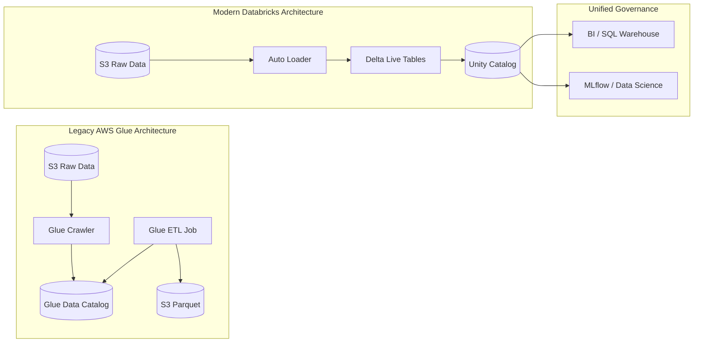

1.  **S3 Raw Data:** The persistent storage layer that remains unchanged during migration.
2.  **Auto Loader:** Replaces Glue Crawlers by incrementally processing new files in S3.
3.  **Delta Live Tables (DLT):** Replaces Glue ETL jobs with a declarative framework for managing data pipelines.
4.  **Unity Catalog:** The centralized governance layer replacing the Glue Data Catalog.
5.  **SQL/ML Layers:** The downstream consumers that benefit from the unified metadata.

---

### Comparison: When to Use What

| Strategy | Best For | Trade-offs | Approx. Cost Signal |
| :--- | :--- | :--- | :--- |
| **Lift-and-Shift** | Immediate migration with zero downtime. | Low innovation; inherits technical debt; potential runtime errors. | 🟢 Low initial effort; 🔴 High long-term maintenance. |
| **Re-platform** | Organizations wanting to modernize ETL pipelines. | Moderate effort; requires updating job orchestration. | 🟡 Balanced; replaces Glue DPUs with Databricks DBUs. |
| **Refactor (DLT)** | High-scale, mission-critical production pipelines. | High upfront engineering cost; requires deep Spark/Delta expertise. | 🔴 High upfront cost; 🟢 Lowest operational cost at scale. |

**How to choose:** Start with a **Re-platform** approach for your most stable pipelines to ensure stability, and reserve **Refactoring** for your most expensive, high-growth data streams where the performance gains of DLT will justify the engineering spend.

---

### Cost Cheat Sheet

| Scenario | Recommended Option | Key Cost Driver | Watch Out For |
| :--- | :--- | :--- | :--- |
| **Batch Processing (Nightly)** | Databricks Workflows | Cluster uptime (DBUs) | Leaving clusters running after job completion. |
| **Continuous Ingestion** | Auto Loader + DLT | Cloud Files/File Discovery | High-frequency small file arrivals causing "Small File Problem." |
| **Ad-hoc Data Science** | All-Purpose Compute | Interactive Session duration | Users forgetting to terminate interactive notebooks. |
| **Standard BI/SQL** | SQL Warehouse (Serverless) | SQL Warehouse compute (DBUs) | Over-provisioning warehouse size for simple queries. |

> 💰 **Cost Note:** The single biggest cost mistake in migration is treating Databricks clusters like Glue jobs—not managing the lifecycle of the cluster. Unlike Glue, which is "pay-per-job," Databricks clusters incur costs as long as they are "Running," even if no code is executing.

---

### Service & Integration

#### 1. AWS Glue Catalog Integration
You can allow Databricks to read directly from the AWS Glue Catalog during the transition phase.
1. Configure an External Location in Unity Catalog pointing to the Glue-managed S3 paths.
2. Use the `glue_catalog` integration in Databrities to federate queries.
3. Gradually migrate metadata to Unity Catalog.

#### 2. AWS IAM & Security
1. Use **IAM Roles for Service Accounts (IRSA)** or Instance Profiles to grant Databricks access to S3.
2. Map AWS IAM identities to **Unity Catalog Identities** to maintain a single source of truth for permissions.

---

### Security Considerations

| Control | Default State | How to Enable / Strengthen |
| :--- | :--- | :--- |
| **Data Encryption** | Encrypted at rest (S3) | Use AWS KMS with Customer Managed Keys (CMK). |
| **Access Control** | IAM-based (S3 Bucket Policies) | Implement **Unity Catalog** for fine-grained (Row/Column) security. |
| **Network Isolation** | Public Internet Access | Deploy Databricks in a **Private VPC** with no IGW. |
| **Audit Logging**| CloudTrail | Enable **Databricks Audit Logs** and stream to an S3/Log Analytics bucket. |

---

### Performance & Cost: The Migration ROI

When migrating, you must present a case based on **Compute Efficiency**. 

**Example Scenario:**
You have a Glue job running 10 DPUs (Data Processing Units) for 4 hours every night to process 1TB of data.
*   **Glue Cost:** ~$25/hour $\times$ 4 hours = **$100/night**.
*   **Databricks Cost (Refactored with DLT):** Using a smaller, optimized cluster with Auto Loader, the job completes in 1.5 hours. Even if the DBU rate is higher (e.g., $0.40/DBU), the total cost might drop to **$60/night**.

> 💡 **Tip:** The real savings come from **Incremental Processing**. In Glue, you often re-process entire partitions. In Databricks, using Delta Lake's `MERGE` and Auto Loader means you only process *new* data, drastically reducing the compute window.

---

### Hands-On: Key Operations

#### 1. Refactoring Glue PySpark to Standard Spark
This script converts a Glue-specific `DynamicFrame` read to a standard Spark `DataFrame` read using Delta Lake.

```python
# --- OLD GLUE CODE ---
# from awsglue.context import GlueContext
# glueContext = GlueContext(SparkContext.getOrCreate())
# dyf = glueContext.create_dynamic_frame.from_catalog(database="db", table_name="tbl")

# --- NEW DATABRICKS CODE ---
from pyspark.sql import SparkSession

# Initialize standard Spark session
spark = SparkSession.builder.getOrCreate()

# Read from S3 using the standard Spark/Delta approach
# This is more portable and much faster for schema evolution
df = spark.read.format("delta").load("s3://my-bucket/silver/my_table")

# Perform transformations...
df_transformed = df.filter(df.status == "active")

# Write back as Delta (The modern standard)
df_transformed.write.format("delta").mode("overwrite").save("s3://my-bucket/gold/my_table")
```
> 💡 **Tip:** Notice the removal of `glueContext`. By using `spark.read`, you are now using standard Spark, making your code compatible with any Spark environment, not just AWS.

---

### Customer Conversation Angles

**Q: We already have 500 Glue jobs. Are you saying we have to rewrite all of them?**
**A:** Not necessarily. We can start with a "Lift-and-Shift" to get your workloads running on Databricks immediately, then incrementally refactor the most critical or expensive jobs to take advantage of Delta Lake and DLT.

**Q: Will our data need to be moved out of S3?**
**A:** No. Your data stays exactly where it is in S3. We are simply changing the compute engine and the metadata layer that manages that data.

**Q: How will our existing IAM permissions work with Databricks?**
**A:** We will bridge the two. We can use your existing AWS IAM roles to allow Databricks to access S3, and then layer Unity Catalog on top to provide even more granular, SQL-based permissions for your users.

**Q: Is Databricks more expensive than Glue because of the DBU pricing?**
**A:** While the unit price might look higher, the "Total Cost of Ownership" is often lower because Databricks handles incremental processing much more efficiently, reducing the total compute hours required.

**Q: How do we handle the "Schema Drift" problem we have in Glue?**
**A:** Databricks uses Auto Loader and Delta Lake, which are designed specifically to handle schema evolution automatically without breaking your downstream pipelines.

---

### Common FAQs and Misconceptions

**Q: Can I use the AWS Glue Data Catalog directly in Databricks?**
**A:** Yes, but it is a temporary measure. 
> ⚠️ **Warning:** Relying solely on the Glue Catalog prevents you from using the most powerful features of Unity Catalog, such as fine-grained access control and data lineage.

**Q: Does Databricks replace AWS Glue entirely?**
**A:** Not necessarily. Glue can still be used for very simple, lightweight serverless triggers, but Databricks becomes the primary engine for all complex ETL, streaming, and analytics.

**Q: Does migrating to Databricks require a change in our S3 folder structure?**
**A:** No, but we recommend evolving from a "folder-per-date" structure to a "Delta Lake" format to unlock better performance.

**Q: Is Databricks a managed service or do I have to manage servers?**
**A:** It is a managed service. With "Serverless" options, Databricks manages the compute scaling and infrastructure for you, much like Glue.

---

### Exam & Certification Focus
*   **Domain: Data Transformation (Refactoring):** Understand the difference between `DynamicFrames` and `DataFrames`.
*   **Domain: Data Governance (Metadata):** Be able to explain how Unity Catalog replaces/augments the Glue Data Catalog.
*   **Domain: Data Ingestion (Architecture):** Know when to use Auto Loader vs. traditional batch processing. 📌 **Must Know:** Auto Loader is the preferred way to ingest files from S3 into a Lakehouse.

---

### Quick Recap
- **Data stays in S3;** only the compute and metadata layers change.
- **Avoid `glueContext`** in your new Databricks notebooks to ensure portability and performance.
- **Use Auto Loader** to replace Glue Crawlers for more efficient, event-driven ingestion.
- **Unity Catalog** is the cornerstone of modern Databricks governance, replacing Glue Catalog.
- **Refactoring to Delta Lake** provides the highest ROI through incremental processing and ACID transactions.

---

### Further Reading
**Databricks Documentation** — Comprehensive guide on Auto Loader and DLT.
**AWS Whitepaper: Lake House Architecture** — How to build modern data platforms on AWS.
**Unity Catalog Fundamentals** — Deep dive into governance and metadata migration.
**Delta Lake Official Docs** — Understanding ACID transactions and schema evolution.
**AWS Glue Documentation** — Reference for understanding your legacy source logic.

---

## Orchestration and Automation with Databricks Workflows

### Section at a Glance
**What you'll learn:**
- Designing complex Directed Acyclic Graphs (DAGs) using multi-task jobs.
- Implementing various trigger mechanisms, including Schedule and File Arrival.
- Optimizing costs by leveraging Job Clusters vs. All-Purpose Clusters.
- Configuring robust error handling, retries, and automated notifications.
- Integrating Workflows with Unity Catalog and AWS S3 for end-to end automation.

**Key terms:** `DAG (Directed Acyclic Graph)` · `Job Cluster` · `File Arrival Trigger` · `Task Dependency` · `Retry Policy` · `Continuous Execution`

**TL;DR:** Databricks Workflows is a fully managed orchestration service that allows you to automate data pipelines by chaining tasks, managing dependencies, and triggering computations based on schedules or data changes, all while minimizing operational overhead.

---

### Overview
In the modern data enterprise, a single notebook or a single Spark job is rarely enough. Real-world data engineering requires a "pipeline" mindset—a sequence of interdependent steps where the output of a Bronze-layer ingestion job becomes the input for a Silver-layer transformation. The business problem being solved here is **pipeline fragility and operational toil**. Without orchestration, engineers spend their time manually monitoring logs, restarting failed jobs, and managing complex Cron schedules.

For practitioners coming from AWS Glue, you are likely used to Glue Workflows or even external orchestrators like Apache Airflow. Databrks Workflows brings orchestration *into* the Lakehouse. This eliminates the "integration tax"—the latency and complexity of managing a separate service to trigger your Spark code. By keeping the orchestration logic alongside the data and the compute, you achieve tighter security integration, easier lineage tracking through Unity Catalog, and significantly reduced architectural complexity.

Ultimately, the goal of mastering Workflows is to move from "running scripts" to "managing data products." This transition allows your organization to move from reactive troubleshooting to proactive data delivery, ensuring that downstream BI dashboards and ML models are always fed with fresh, validated data.

---

### Core Concepts

#### The Job and Task Hierarchy
A **Job** is the top-level unit of orchestration. A Job can consist of a single **Task** or a complex graph of multiple tasks. 
- **Tasks:** The atomic unit of work. A task can be a Notebook, a Python script, a SQL query, a JAR file, or even a DLT (Delta Live Tables) pipeline.
- **Dependencies:** You define the execution order by specifying which tasks must complete before another begins. 📌 **Must Know:** In the Databricks UI, this is visually represented as a DAG.

#### Compute Strategy: The Engine of Cost Control
One of the most critical decisions in Workflows is the type of compute used to run your tasks.
- **Job Clusters:** These are ephemeral clusters created specifically for the task and terminated immediately upon completion. 
- **All-Purpose Clusters:** These are persistent clusters used for interactive analysis and development.

> ⚠️ **Warning:** Never run production workloads on All-Purpose clusters. They are significantly more expensive (often 2x-3x) than Job Clusters. Using them for automation is a common way to blow through your AWS budget without adding any technical value.

#### Trigger Mechanisms
Automation isn't just about "running at 2 AM." Databricks provides several trigger types:
1. **Scheduled Triggers:** Standard Cron-based scheduling.
2. **Continuous Triggers:** The job runs in a loop, immediately restarting a task as soon as the previous run completes (ideal for near-real-time streaming-lite workloads).
3. **File Arrival Triggers:** The job wakes up when a new file lands in a specific S3 bucket path. 

> 💡 **Tip:** Use File Arrival triggers to reduce latency. Instead of running a heavy job every hour "just in case" data arrived, trigger it the second the S3 prefix is updated to save compute cycles.

#### Error Handling and Observability
A robust pipeline must be "self-healing." 
- **Retries:** You can configure a specific number of retries and an interval between them for each task.
- **Notifications:** You can configure email or Slack alerts for `On Success`, `On Failure`, or `On Duration` (if a job runs too long).

---

### Architecture / How It Works

```mermaid
graph TD
    subgraph "Orchestration Layer (Databricks Control Plane)"
        A[Job Trigger: Schedule/File Arrival] --> B[Job Controller]
        B --> C{Task Dependency Graph}
    end

    subronetwork "Compute Layer (AWS VPC/Databricks Plane)"
        C --> D[Task 1: Ingestion]
        C --> E[Task 2: Transformation]
        D --> F[Job Cluster A]
        E --> G[Job Cluster B]
    end

    subgraph "Data Layer"
        F --> H[(S3 / Delta Lake)]
        G --> H
    end
```

1. **Job Trigger:** The event (time, file, or manual) that initiates the workflow.
2. **Job Controller:** The brain of the operation; it manages the state of the job and determines which task is next.
3. **Task Dependency Graph:** A logical map that tells the controller, "Do not start Task 2 until Task 1 returns a 'Success' status."
4. **Job Cluster:** The ephemeral compute resource provisioned by the controller to execute the specific task logic.
5. **Delta Lake:** The persistent storage layer where the results of the tasks are written and where the state of the data resides.

---

### Comparison: When to Use What

| Option | Best For | Trade-offs | Approx. Cost Signal |
| :--- | :--- | :--- | :--- |
| **Databricks Workflows** | End-to-end Lakehouse pipelines; integrated Spark/SQL/DLT tasks. | Tied to Databrical ecosystem; less flexible for non-Spark tasks. | **Low** (Integrated/Native) |
| **Apache Airflow (MWAA)** | Complex, multi-platform orchestration (e.g., triggering Snowflake, EMR, and Databricks). | High operational overhead; requires managing infrastructure and Python DAGs. | **High** (Infrastructure + Management) |
| **AWS Glue Workflows** | Simple ETL-only pipelines within the AWS Glue ecosystem. | Limited to Glue-specific tasks; difficult to orchestrate non-Glue logic. | **Medium** (Pay-per-DPU) |

**How to choose:** If your primary data processing happens in Databricks (Spark, SQL, Delta), use **Databricks Workflows**. Only move to Airflow if you have a "polyglot" architecture where the orchestration must bridge fundamentally different cloud services (e.g., triggering a SageMaker training job, then a Lambda, then a Databricks job).

---

### Cost Cheat Sheet

| Scenario | Recommended Option | Key Cost Driver | Watch Out For |
| :--- | :--- | :--- | :--- |
| **Daily Batch Ingestion** | Job Clusters (Scheduled) | Cluster Up-time | Overlapping runs (two jobs running at once). |
| **Near Real-Time Processing** | Continuous Jobs | 24/7 Cluster Availability | High "idle" cost if data arrives infrequently. |
| **Event-Driven Ingestion** | File Arrival Triggers | S3 Event Notification/Polling | Large volumes of tiny files triggering too many jobs. |
| **Development & Testing** | All-Purpose Clusters | Compute Instance Type | Forgetting to terminate clusters after testing. |

> 💰 **Cost Note:** The single biggest cost mistake in Databricks Workflows is failing to use **Job Clusters** for production tasks. The difference in DBU (Databricks Unit) pricing between All-Purpose and Job clusters is a primary driver of "Cloud Bill Shock."

---

### Service & Integrations

1. **Unity Catalog:** Workflows use Unity Catalog to enforce fine-grained access control. A job can only access the tables it has `SELECT` or `MODIFY` permissions for, regardless of who scheduled it.
2. **Amazon S3:** Use S3 as the trigger source for **File Arrival Triggers** to create reactive pipelines.
3. **Slack/Email/PagerDuty:** Integration via email or webhooks to ensure the engineering team is alerted to pipeline failures instantly.
ly
4. **Delta Live Tables (DLT):** You can use a Databricks Workflow task to trigger a DLT pipeline, allowing you to orchestrate "classic" Spark jobs and "declarative" streaming pipelines in one DAG.

---

### Security Considerations

Security in Workflows is centered around the principle of **Least Privilege**.

| Control | Default State | How to Enable / Strengthen |
| :--- | :--- | :--- |
| **Identity & Access** | User-level permissions | Use **Service Principals** to run jobs, not individual user accounts. |
| **Data Access** | Workspace-level | Use **Unity Catalog** to define table-level permissions for the job. |
| **Network Isolation** | Public Internet access possible | Run jobs within a **Private Link** enabled VPC/Subnet. |
| **Auditability** | Basic logs available | Enable **Databricks Audit Logs** and stream them to CloudWatch/S3. |

---

### Performance & Cost

**Tuning the "Retry" Logic:**
Setting retries too high can lead to "infinite loops" of failure that drain your budget. If a job fails due to a code error (e.g., a `SyntaxError`), retrying will not help and will only waste money.
- **Best Practice:** Use retries for **transient errors** (network blips, spot instance reclamation) but implement strict error alerting for logic errors.

**Example Cost Scenario:**
*   **Scenario:** A job runs every hour, processing 100GB of data.
*   **Option A (All-Purpose Cluster):** $10/hour DBU rate $\times$ 24 hours = **$240/day**.
*   **Option B (Job Cluster):** $4/hour DBU rate $\times$ 24 hours = **$96/day**.
*   **Result:** By simply switching the compute type, you save **$144 per day**, or roughly **$4,320 per month** for a single job.

---

### Hands-On: Key Operations

To create a job via the Databricks CLI, you first define a JSON configuration file.

**1. Define the Job Configuration (`job_config.json`)**
This file defines a single task that runs a notebook.

```json
{
  "name": "Daily_Bronze_Ingestion",
  "tasks": [
    {
      "task_key": "ingest_s3_to_bronze",
      "notebook_task": {
        "notebook_path": "/Users/data_eng/ingestion_logic"
      },
  "new_cluster": {
        "spark_version": "13.3.x-scala2.12",
        "node_type_id": "i3.xlarge",
        "num_workers": 2
      },
      "retry_on_failure": {
        "attempts": 3,
        "interval_millis": 10000
      }
    }
  ]
}
```
> 💡 **Tip:** Always use `new_cluster` (Job Cluster) in your JSON definition rather than referencing an existing `existing_cluster_id`.

**2. Create the Job via Databricks CLI**
Run this command in your terminal to deploy the job to your workspace.

```bash
databricks jobs create --json @job_config.json
```

---

### Customer Conversation Angles

**Q: We already use Airflow for our Snowflake and AWS Glue pipelines. Why should we move our Spark logic to Databricks Workflows?**
**A:** You should keep Airflow as your "Global Orchestrator" for cross-platform logic, but use Databricks Workflows for your "Lakehouse-specific" tasks. It reduces latency, simplifies security via Unity Catalog, and is significantly cheaper to run for Spark workloads because of native Job Cluster integration.

**Q: How do I ensure that my data scientists don't accidentally break the production pipeline when they update a notebook?**
**A:** You should use a combination of Git integration (Repos) and Service Principals. The production Workflow should run a version of the code from a "main" branch, triggered by a Service Principal that has different permissions than the individual developers.

** 📌 Q: If a task fails in the middle of a 10-task DAG, does the whole job stop?**
**A:** By default, the failure of a task will stop all downstream tasks that depend on it, but any "parallel" branches in your DAG that do not depend on the failed task will continue to execute.

**Q: Can I use Workflows to trigger a process only when a specific CSV arrives in S3?**
**A:** Yes, you can use the **File Arrival Trigger**. It monitors an S3 path and automatically kicks off the job as soon as the file is detected, which is much more cost-efficient than polling on a schedule.

**Q: Is there an extra cost for using the Databricks Workflows service itself?**
**A:** No, there is no separate "orchestration fee." You only pay for the standard DBU consumption of the compute clusters used to run the tasks.

---

### Common FAQs and Misconceptions

**Q: Does a "Continuous" trigger run a new cluster every time a task finishes?**
**A:** No, a continuous job maintains a running cluster to minimize the startup latency of the tasks.

**Q: Can I run SQL queries directly in a Workflow task?**
**A:** Yes, you can use the **SQL Task** type to execute specific statements or procedures directly against your SQL Warehouse.

**Q: Can I use Python libraries in my Workflow tasks?**
**A:** Yes, you can use `%pip install` within your notebooks, or define library dependencies in the job cluster configuration.

⚠️ **Q: If I use a Job Cluster, can I still use it for interactive debugging after the job finishes?**
**A:** No. Once the task completes, the cluster is terminated. ⚠️ **Warning:** If you find yourself needing to "interact" with a job cluster, you are likely using the wrong compute type for your current task.

**Q: Does Databricks Workflows support multi-cluster jobs?**
**A:** Yes, you can define multiple tasks, each with its own specific cluster configuration (e.g., a small cluster for ingestion and a large, memory-optimized cluster for heavy joins).

---

### Exam & Certification Focus
*For the Databricks Certified Data Engineer Associate Exam:*

- **Compute Selection (High Priority):** Understand the cost and lifecycle difference between All-Purpose and Job Clusters. 📌
- **Task Dependencies:** Be able to identify the correct execution order in a provided DAG diagram.
- **Trigger Types:** Know when to use Scheduled vs. Continuous vs. File Arrival.
- **Error Handling:** Understand how `retries` and `notifications` work to maintain pipeline reliability.
- **Integration:** Understand how Workflows interact with Unity Catalog for security.

---

### Quick Recap
- **Workflows** is the native, cost-effective orchestrator for the Databricks Lakehouse.
- **Always use Job Clusters** for automated production workloads to minimize costs.
- **DAGs** allow you to model complex, multi-step data dependencies.
- **File Arrival Triggers** enable efficient, event-driven data engineering.
- **Service Principals** are the best practice for running production-grade, secure automation.

---

### Further Reading
**Databricks Documentation** — Comprehensive guide to all Job and Task types.
**Databricks Best Practices** — Deep dive into cost-optimization and cluster usage.
**Unity Catalog Security Guide** — How to manage permissions for automated workloads.
**Delta Live Tables (DLT) Documentation** — Understanding how to orchestrate streaming pipelines.
**AWS S3 Event Notifications** — Context on how file arrival triggers interact with S3.

---

## Exam Readiness and Final Review

### Section at a Glance
**What you'll learn:**
- How to map technical Databricks features to specific exam domains.
- Strategies for decoding complex, multi-part exam questions.
- A final gap analysis of the Medallion Architecture, Delta Lake, and Unity Catalog.
- How to approach "best practice" questions regarding cost and performance.
- Final preparation for the transition from AWS Glue/EMR workflows to Databricks-native orchestration.

**Key terms:** `Exam Domains` · `Medallion Architecture` · `Delta Lake Optimization` · `Unity Catalog` · `Structured Streaming` · `Data Pipeline Orchestration`

**TL;DR:** This final section provides a strategic blueprint for passing the Databricks Certified Data Engineer Associate exam by synthesizing the course's technical pillars into a cohesive, exam-ready mental model.

---

### Overview
Passing a professional-level certification is not merely about memorizing syntax; it is about demonstrating architectural judgment. For a Data Engineer transitioning from AWS Glue or EMR, the challenge often lies in moving from "how to write a script" to "how to design a robust, governed, and cost-effective Lakehouse."

The Databricks Certified Data Engineer Associate exam tests your ability to navigate the **Data Engineering Lifecycle**. The business value of this certification lies in your ability to reduce "technical debt" and "operational toil." When a customer asks, "How do we ensure our pipelines don't break when the schema changes?" or "How do we prevent our S3 costs from spiraling due to small files?", they are looking for the exact architectural patterns covered in this course.

This section serves as your final audit. We will move away from the "how-to" of individual functions and move toward the "why" of architectural decisions, ensuring you are prepared for the situational questions that define the difficulty of this exam.

---

### Core Concepts

To succeed, you must master the four pillars of the exam syllabus.

#### 1. Data Processing (The Engine)
You must understand how **Delta Lake** provides ACID transactions on top of S3. 
*   **Schema Enforcement vs. Evolution:** Know when a write will fail (Enforcement) and how to permit changes (Evolution).
*   **Optimization:** Understand the mechanics of `OPTIMIZE` (compaction) and `Z-ORDER` (multi-dimensional clustering). 
📌 **Must Know:** The exam frequently tests the difference between `VACUUM` (removing old files) and `OPTIMIZE` (compacting current files). ⚠️ **Warning:** Running `VACUUM` with a retention period shorter than your Delta Log history can lead to data loss and broken transactions.

#### 2. Data Modeling (The Structure)
The **Medallion Architecture** is the heart of the exam.
*   **Bronze:** Raw ingestion, often containing duplicates or unstructured data.
*   **Silver:** Filtered, cleaned, and augmented data. The "source of truth."
*   **Gold:** Aggregated, business-level tables ready for BI.

#### 3. Data Orchestration (The Workflow)
You must distinguish between **Standard Jobs** and **Delta Live Tables (DLT)**.
*   **DLT:** Declarative pipelines that handle infrastructure, dependencies, and quality constraints (Expectations) automatically.
*   **Workflows:** Task orchestration, retries, and dependency management.

#### 4. Data Security (The Governance)
With the shift to **Unity Catalog**, focus on:
*   **Identity Management:** Users, Groups, and Service Principals.
*   **Access Control:** `GRANT` and `REVOKE` on catalogs, schemas, and tables.
*   **Lineage:** The ability to trace data from Bronze to Gold.

---

### Architecture / How It Works

The following diagram illustrates the "Exam Decision Logic"—the mental process you should use when presented with a scenario-based question.

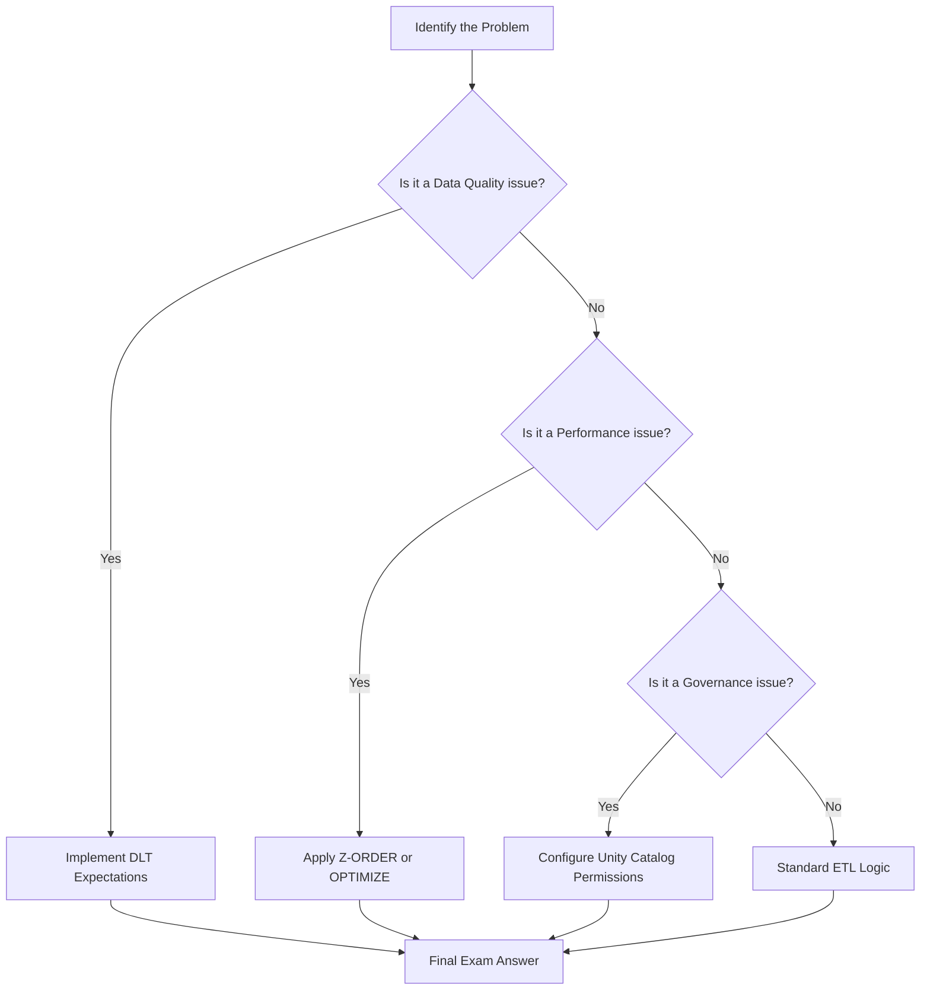

1.  **Identify the Problem:** Read the scenario to determine if the pain point is latency, cost, reliability, or security.
2.  **Identify the Layer:** Determine which Medallion layer (Bronze, Silver, or Gold) is being discussed.
3.  **Select the Feature:** Choose the Databricks-native feature (e.g., DLT, Unity Catalog, Delta Lake) that solves the specific problem.
4.  **Validate Constraints:** Ensure your choice adheres to the constraints mentioned (e._g., "must be low cost" or "must be near real-time").

---

### Comparison: When to Use What

| Feature | Best For | Trade-offs | Approx. Cost Signal |
| :--- | :--- | :--- | :--- |
| **Standard Spark Jobs** | Simple, one-off ETL or complex custom logic. | Requires manual management of dependencies and retries. | Moderate (Compute-heavy) |
| **Delta Live Tables (DLT)** | Production-grade, declarative, self-healing pipelines. | Higher abstraction; less "low-level" control over Spark tuning. | Higher (Managed overhead) |
| **Structured Streaming** | Low-latency, near real-time data ingestion. | Requires "checkpointing" and managing state/watermarks. | High (Requires 24/7 clusters) |
| **Auto Loader** | Ingesting files from S3 as they arrive. | Optimized for cloud storage; reduces manual file listing. | Low (Efficiently scales) |

**How to choose:** If the requirement emphasizes **reliability and automation**, choose DLT. If the requirement emphasizes **cost-efficiency for batch processing**, choose Standard Jobs with Auto Loader.

---

### Cost Cheat Sheet

| Scenario | Recommended Option | Key Cost Driver | Watch Out For |
| :--- | :--- | :--- | :--- |
| Frequent small file arrivals | **Auto Loader** | Cloud Object Store API calls | Not using `cloudFiles` format |
| High-frequency dashboard updates | **Gold Layer (Aggregated)** | Compute uptime (Always-on clusters) | Querying Bronze/Silver directly |
| Large-scale historical re-processing | **Serverless SQL Warehouses** | Query execution time | Over-provisioning warehouse size |
| Long-term data retention | **Delta Lake + VACUUM** | S3 Storage (Versioning) | Setting `VACUEM` retention too high |

💰 **Cost Note:** The single biggest cost mistake in Databricks on AWS is leaving **All-Purpose Compute** clusters running for automated production workloads. Always use **Job Clusters** for production ETL; they are significantly cheaper per DBU (Databricks Unit).

---

### Service & Integrations

1.  **AWS S3 & Databricks:** The foundational integration. S3 acts as the physical storage layer (the "Data Lake"), while Databricks provides the "Lakehouse" management layer.
2.  **AWS IAM & Unity Catalog:** Security integration. Use IAM roles to grant Databricks access to S3, but use Unity Catalog to manage fine-grained access to the data *inside* those S3 buckets.
3.  **AWS Glue Catalog & Unity Catalog:** Migration pattern. Use the Glue Catalog connector to allow Databricks to read existing metadata, then gradually migrate metadata into Unity Catalog for centralized governance.

---

### Security Considerations

| Control | Default State | How to Enable / Strengthen |
| :--- | :--- | :--- |
| **Data Encryption** | Encrypted at rest (S3-SSE) | Use AWS KMS for customer-managed keys (CMK). |
| **Network Isolation** | Accessible via Databricks UI | Deploy Databricks in your VPC using Private Link. |

| **Fine-grained Access** | All or nothing (at S3 level) | Use **Unity Catalog** to grant access to specific rows/columns. |
| **Audit Logging** | Standard CloudTrail logs | Enable **Databricks Audit Logs** to track workspace activity. |

---

### Performance & Cost

**The "Small File Problem" Scenario:**
Imagine a pipeline ingesting 1,000 small JSON files every hour into a Bronze table. 
*   **Impact:** Over time, the metadata overhead of reading 1,000 files per hour creates massive latency and increases S3 `LIST` request costs.
*   **Solution:** Implement `OPTIMIZE` on a schedule.
*   **Cost Example:** If a job takes 10 minutes to run but spends 8 minutes just "discovering" files, you are paying for 8 minutes of idle compute. By compacting these into larger files, the job might drop to 2 minutes, reducing compute costs by ~80% for that task.

---

### Hands-On: Key Operations

**1. Implementing Data Quality with DLT (Expectations)**
Use this to prevent "garbage in, garbage out" by dropping records that fail validation.
```sql
-- This DLT snippet defines a constraint that drops records with null IDs
CREATE OR REPLACE LIVE TABLE silver_users
(
  CONSTRAINT valid_user_id EXPECT (user_id IS NOT NULL) ON VIOLATION DROP ROW
)
AS SELECT * FROM LIVE.bronze_users;
```
💡 **Tip:** Use `ON VIOLATION FAIL UPDATE` if the data quality is mission-critical and the pipeline must stop on error.

**2. Optimizing a Table**
Run this to compact small files and improve query performance.
```sql
-- Compacting files and re-organizing data by a specific column
OPTIMIZE sales_data
ZORDER BY (transaction_date, store_id);
```

**3. Cleaning up old data**
Use this to manage storage costs by removing files no longer needed by the Delta Log.
```sql
-- Remove files no longer in the current state of the transaction log
VACUUM sales_data RETAIN 168 HOURS; 
```
⚠️ **Warning:** Do not run `VACUUM` with a retention period of 0 unless you are certain you don't need to "Time Travel" back to previous versions.

---

### Customer Conversation Angles

**Q: We already use AWS Glue for our ETL. Why should we move to Databricks?**
**A:** While Glue is excellent for serverless Spark, Databricks offers a unified "Lakehouse" approach, providing much deeper support for Delta Lake optimizations, superior governance via Unity Catalog, and significantly faster performance for complex workloads.

**Y: How do we ensure our data scientists aren't seeing sensitive PII data?**
**A:** We implement Unity Catalog, which allows us to define column-level security and row-level filtering, ensuring users only see the data they are explicitly authorized to see.

**Q: Will moving to Databricks increase our AWS S3 costs?**
**A:** Not necessarily. In fact, by using features like Auto Loader and Delta Lake's `OPTIMIZE`, we can reduce the number of expensive S3 API calls and improve data efficiency, which often offsets the cost of the Databrrics compute.

**Q: How can we trust the quality of the data in our Gold tables?**
**A:** We use Delta Live Tables (DLT) with "Expectations," which allows us to programmatically define data quality rules that automatically quarantine or drop invalid data before it reaches downstream users.

**Q: Can we keep our existing data in S3 as-is?**
**A:** Absolutely. Databricks is designed to work directly on top of your existing S3 data lake, allowing for an incremental migration rather than a "rip and replace" approach.

---

### Common FAQs and Misconceptions

**Q: Is Databricks just a managed version of Spark?**
**A:** No. While it uses Spark, it is a complete Data Intelligence Platform that includes Delta Lake, Unity Catalog, and specialized engines for SQL and Streaming.

**Q: Does `VACUUM` delete my data forever?**
**A:** It deletes files that are no longer referenced in the current Delta Log. ⚠️ **Warning:** Once `VACUUM` removes a file, you can no longer use "Time Travel" to see the table as it existed before that file was deleted.

**Q: Is Delta Lake a separate database we have to install?**
**A:** No, Delta Lake is an open-source storage layer that sits on top of your existing S3 files.

**Q: Can I use Databricks with my existing AWS IAM roles?**
**A:** Yes, Databricks integrates deeply with AWS IAM, allowing you to use instance profiles or Unity Catalog storage credentials to manage access.

**Q: Does DLT replace Spark?**
**A:** No, DLT is a high-level orchestration framework that *uses* Spark under the hood to execute your pipelines.

---

### Exam & Certification Focus

*   **Data Processing (30%):** Focus on Delta Lake features (Time Travel, ACID, Schema Evolution) and Spark Structured Streaming (Watermarking, Checkpointing). 📌 **High Frequency: Z-ORDER and OPTIMIZE.**
*   **Data Modeling (25%):** Focus on the purpose of each Medallion layer and the characteristics of Bronze vs. Silver vs. Gold.
*   **Data Orchestration (25%):** Focus on DLT (Expectations, Pipelines) and Databricks Workflows (Task dependencies, Retries).
*   **Data Security (20%):** Focus on Unity Catalog (Privileges, Catalogs, Schemas) and secure data ingestion. 📌 **High Frequency: Identity management and Grant/Revoke syntax.**

---

### Quick Recap
- **Medallion Architecture** is the standard for organizing data quality layers.
- **Delta Lake** provides the essential ACID and performance features (Optimize/Z-Order).
- **Unity Catalog** is the centralized governance engine for all data and identity.
- **DLT** simplifies complex, production-grade ETL with built-in quality checks.
- **Cost Efficiency** is achieved by using Job Clusters and optimizing file sizes.

---

### Further Reading
**Databricks Documentation** — The definitive source for syntax, API references, and feature updates.
**Delta Lake Documentation** — Deep dive into storage internals, ACID, and transaction logs.
**Databricks Academy** — Official training modules and practice exams for certification prep.
**AWS Whitepapers (Data Lake on S3)** — Context on how Databricks sits within the broader AWS ecosystem.
**Unity Catalog Guide** — Detailed tutorials on implementing fine-grained access control and lineage.