# AWS Certified Data Engineer Associate (DEA-C01)
### A Comprehensive Udemy Course Guide

**Generated:** 2026-04-09  
**Target Audience:** cloud engineers and developers familiar with AWS core services who want to pass the AWS Certified Data Engineer Associate exam  
**Total Sections:** 15

---

# Course Introduction: AWS Certified Data Engineer Associate (DEA-CO1)

## Master the Art of the Data Pipeline

In the modern era of cloud computing, the ability to manage infrastructure is no longer enough. The real competitive advantage lies in the ability to design, build, and optimize the pipelines that turn raw, fragmented data into actionable business intelligence. As organizations migrate from legacy systems to the cloud, the demand for engineers who can architect scalable, resilient, and secure data ecosystems has reached an all-time high.

Welcome to the **AWS Certified Data Engineer Associate** course. This program is specifically engineered to transition you from a generalist cloud practitioner to a specialized Data Engineer capable of navigating the complex AWS data landscape.

### What You Will Learn
This course is structured to follow the end-to-end lifecycle of data. We move beyond simple service definitions to focus on **architectural decision-making**. You will master the following pillars:

*   **Data Ingestion & Streaming:** Implementing robust ingestion patterns using Amazon Kinesis and MSK for real-time processing, alongside batch processing workflows.
*   **Storage & Data Lake Design:** Architecting highly scalable storage solutions using Amazon S3 and implementing a unified data lake strategy with AWS Lake Formation.
*   **Transformation & Processing:** Performing deep dives into AWS Glue for ETL, utilizing Amazon Athena for serverless querying, and managing large-scale warehousing with Amazon Redshift.
*   **Orchestration & Governance:** Building complex, automated data pipelines and ensuring data integrity through rigorous security, compliance, and networking configurations.
*   **Operational Excellence:** Optimizing for cost, performance, and monitoring to ensure your data pipelines are not just functional, but economically sustainable and highly available.

### Prerequisites
This course is designed for professionals who are already comfortable navigating the AWS Management Console. To get the most out of this material, you should possess:
*   **Foundational AWS Knowledge:** Familiarity with core services such as IAM, VPC, EC2, and S3.
*   **Programming/Scripting Literacy:** A working knowledge of SQL (essential) and basic Python (highly recommended for Glue and Lambda workflows).
*   **Cloud Fundamentals:** An understanding of cloud security principles and networking basics.

### About the DEA-C01 Exam
The **AWS Certified Data Engineer – Associate (DEA-C01)** exam validates your ability to implement data pipelines, manage data lifecycles, and implement data governance. The exam focuses on four key domains:
1.  **Data Ingestion and Transformation**
2.  **Data Pipeline Orchestration**
3.  **Data Store Management**
4.  **Data Governance and Security**

The exam tests not just your knowledge of "what" a service does, but "how" to use it to solve specific business problems under constraints like cost, latency, and scale.

### How to Use This Course
To succeed, do not treat this as a passive viewing experience. Follow this recommended roadmap:
1.  **Watch & Absorb:** Follow the modular deep dives, paying close attention to the "Data Architecture Foundations" to build a mental model of the ecosystem.
2.  **Apply:** When we cover services like AWS Glue or Amazon Redshift, attempt to replicate the architectures in your own AWS sandbox environment.
3.  **Review Strategy:** Use the *Exam Overview and Strategy* module to understand how AWS phrases much-anticipated "distractor" answers.
4.  **Final Mastery:** Complete the **Capstone** module. This is a simulated, high-stakes environment designed to test your ability to integrate all learned services into a single, cohesive architecture.

**Prepare to transform from a cloud engineer into a data architect. Let’s begin.**

---

## Table of Contents

1. [Course Introduction](#course-introduction)
2. [Exam Overview and Strategy](#exam-overview-and-strategy)
3. [AWS Data Architecture Foundations](#aws-data-architecture-foundations)
4. [Data Ingestion](#data-ingestion)
5. [AWS Glue Deep Dive](#aws-glue-deep-dive)
6. [Amazon S3 and Data Lake Design](#amazon-s3-and-data-lake-design)
7. [Amazon Athena](#amazon-athena)
8. [Amazon Redshift](#amazon-redshift)
9. [Streaming Data with Kinesis and MSK](#streaming-data-with-kinesis-and-msk)
10. [NoSQL and Purpose-Built Databases](#nosql-and-purpose-built-databases)
11. [AWS Lake Formation and Data Governance](#aws-lake-formation-and-data-governance)
12. [Data Orchestration and Pipelines](#data-orchestration-and-pipelines)
13. [Performance, Cost Optimization, and Monitoring](#performance-cost-optimization-and-monitoring)
14. [Security, Compliance, and Networking](#security-compliance-and-networking)
15. [Capstone and Exam Readiness](#capstone-and-exam-readiness)

---

# Course Introduction

## Overview

In the modern era of cloud computing, the role of the Data Engineer has shifted from managing infrastructure and writing brittle ETL scripts to designing resilient, scalable, and automated data ecosystems. The fundamental problem we are solving is no longer "how do we store data," but "how do a thousand different data sources flow into a single source of truth with high integrity, low latency, and strict governance." 

The AWS Data Engineering ecosystem is not a single service, but a collection of highly integrated, decoupled components designed to handle the "Three Vs" of Big Data: Volume, Velocity, and Variety. As a Data Engineer on AWS, your job is to orchestrate these components into a cohesive pipeline. You are not just moving bytes; you are managing state, ensuring schema evolution, and implementing the "Medallion Architecture" (Bronze, Silver, Gold layers) to transform raw, messy telemetry into high-value, queryable business intelligence.

To pass the AWS Certified Data Engineer Associate (DEA-C01) exam, you must move beyond a superficial understanding of services like S3 or Glue. You must understand the *mechanics* of data movement. You need to know why a Kinesis Data Stream is the right choice for real-time fraud detection versus why an AWS Glue Crawler is necessary for discovering schema changes in an S3-based data lake. This course is designed to move you from "knowing the services" to "architecting the solution."

We will focus on the "Data Lakehouse" paradigm—the convergence of the flexibility of data lakes (S3) with the ACID transactions and performance of data warehouses (Redshift). We will treat data as a product, focusing on the reliability, security, and observability of the pipelines you build.

## Core Concepts

### The Data Lakehouse Paradigm
The cornerstone of modern AWS data engineering is the decoupling of storage and compute. Unlike traditional on-premises databases where storage and CPU are tightly coupled, AWS allows us to use S3 as a cost-effective, infinitely scalable storage layer, while spinning up compute (Glue, EMR, Athena) only when needed.

### Data Ingestion Patterns
*   **Batch Ingestion:** High-latency, high-throughput movement of data. Key services: AWS Glue, AWS Data Pipeline, Amazon AppFlow. Use this when data freshness is measured in hours or days.
*   **Streaming Ingestion:** Low-latency, continuous movement. Key services: Amazon Kinesis (Data Streams/Firehose), Amazon MSK (Managed Streaming for Kafka). Use this for real-time monitoring and alerting.

### Data Transformation (ETL vs. ELT)
*   **ETL (Extract, Transform, Load):** Transformations occur *before* the data reaches the target. Essential for PII masking and data cleansing before landing in a data lake.
*   **ELT (Extract, Load, Transform):** Raw data is loaded into the warehouse/lake, and transformations are performed using the power of the target engine (e.g., Redshift Spectrum or Athena). This is the modern standard for scalability.

### Schema Management and Evolution
In a distributed system, schemas change. A field might change from an `Integer` to a `Float`, or a new column might appear. You must understand how AWS Glue Data Catalog manages partitions and how to handle "schema drift" without breaking downstream Spark jobs or Athena queries.

### Data Partitioning and Formats
*   **Partitioning:** Organizing data in S3 using prefixes (e.s., `s3://my-bucket/year=2023/month=10/day=27/`). This is the single most important lever for performance.
*   **Columnar Formats:** Moving away from CSV/JSON to Parquet or Avro. These formats allow for "predicate pushdown"—the ability to read only the columns and rows required by a query, drastically reducing I/O and cost.

## Architecture / How It Works

The following diagram represents the standard "Medallion Architecture" we will master throughout this course. This is the blueprint for a production-grade AWS Data Pipeline.

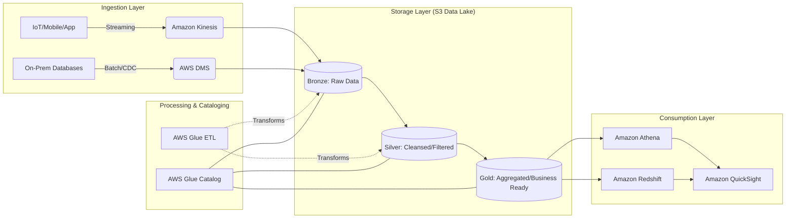

## AWS Service Integrations

Successful data engineering relies on the "connective tissue" between services.

*   **Inbound (Data Sources to Pipeline):**
    *   **AWS DMS (Database Migration Service):** Moves data from RDS or On-prem Oracle/SQL Server into S3. It provides Change Data Capture (CDC) to keep S3 in sync with source databases.
    *   **Amazon Kinesis Data Firehose:** Acts as the "delivery stream," taking streaming data and automatically batching/compressing it into S3.
*   **Outbound (Pipeline to Consumers):**
    *   **Amazon Athena:** A serverless query engine that uses the Glue Data Catalog to run SQL directly against S3.
    *   **Amazon QuickSight:** The BI layer that consumes the "Gold" layer data for visualization.
*   **The Glue/Lake Formation Nexus:**
    *   **AWS Glue Data Catalog** is the central metadata repository.
    *   **AWS Lake Formation** sits on top of the Catalog to provide fine-grained access control (column-level and row-level security).
*   **IAM Trust Relationships:**
    *   A Glue ETL job requires an **IAM Execution Role** with `s3:GetObject`, `s3:PutObject`, and `glue:UpdateTable` permissions.
    *   Crucially, the role must have a **Trust Policy** allowing `glue.amazonaws.com` to assume the role.

## Security

Security in data engineering is not an afterthought; it is a foundational requirement.

*   **IAM and Resource-Based Policies:**
    *   **Identity-based:** Permissions attached to the User/Role (e.g., "Can this Glue job read S3?").
    *   **Resource-based:** Policies attached to the S3 bucket or KMS key (e.g., "Only this specific Role can access this bucket").
*   **Encryption at Rest:**
    *   **SSE-S3:** Managed by S3. Good for basic needs.
    *   **SSE-KMS:** Uses AWS KMS. Essential for auditing (you can see exactly *who* decrypted a file in CloudTrail). Use this for sensitive data.
    *   **SSE-C:** Customer-provided keys. Use only when regulatory requirements mandate you hold the keys.
*   **Encryption in Transit:** All data moving between services (e.g., Kinesis to S3) must use **TLS/SSL**.
*   **Network Isolation:**
    *   **VPC Endpoints (Interface & Gateway):** Ensure your data traffic stays within the AWS backbone and never traverses the public internet. This is a critical exam topic for "Secure Data Ingestion."
*   **Audit Logging:**
    *   **AWS CloudTrail:** Records every API call (e.g., `DeleteBucket`, `StartJobRun`).
    *   **S3 Access Logs/CloudWatch Logs:** Tracks the actual data access patterns.

## Performance Tuning

If you don't tune your pipeline, your AWS bill will grow exponentially with your data.

*   **The "Small File Problem":** Having millions of 1KB files in S3 kills performance. **Action:** Use Kinesis Firehose or Glue to coalesce small files into larger (128MB - 512MB) Parquet files.
*   **Partition Projection:** Instead of relying on heavy Glue Metadata lookups, use partition projection in Athena to compute partition values from the S3 path directly.
*   **Scaling Patterns:**
    *   **Vertical Scaling:** Increasing the `Worker Type` in Glue (e.g., moving from `G.1X` to `G.2X`) to handle larger memory-intensive joins.
    *   **Horizontal Scaling:** Increasing the number of DPUs (Data Processing Units) or Kinesis Shards to handle increased throughput.
*   **Data Formats:** Always prefer **Parquet** or **ORC** for analytical workloads. Use **Avro** for write-heavy, schema-evolution-intensive streaming workloads.
*   **Cost vs. Performance:** Using `S3 Intelligent-Tiering` is often more cost-effective than manually managing lifecycle policies for unpredictable access patterns.

## Important Metrics to Monitor

You cannot manage what you cannot measure. Monitor these in CloudWatch:

| Metric Name (Namespace: `AWS/Glue`) | What it Measures | Threshold to Alarm | Action to Take |
| :--- | :--- | :--- | :--- |
| `glue.driver.aggregate.elapsedTime` | Duration of the job. | > 2x historical average | Check for data skew or increased input volume. |
| `glue.driver.aggregate.memoryUtilization` | Memory pressure on the driver. | > 85% | Upgrade worker type (e.g., G.1X to G.2X). |
| `glue.executor.aggregate.memoryUtilization`| Memory pressure on executors. | > 90% | Check for "Large Object" processing or increase DPUs. |
| `AWS/Kinesis: GetRecords.IteratorAgeMilliseconds` | Latency of stream processing. | > 5000ms | Increase Kinesis Shards to improve throughput. |
| `AWS/S3: 4xxErrors` | Access denied or bad requests. | > 0 | Check IAM policies and Bucket Policies immediately. |
| `AWS/S3: BytesDownloaded` | Volume of data egress. | Sudden Spikes | Investigate potential data exfiltration or rogue process. |
| `AWS/Lambda: Errors` | Failure rate of transform functions. | > 1% | Check Dead Letter Queue (DLQ) and error logs. |

## Hands-On: Key Operations

In this course, we will use Python (`boto3`) as our primary tool for automation. Here is how you programmatically check the status of a Glue Job.

```python
import boto3
import time

# Initialize the Glue client
glue = botoly.client('glue', region_name='us-east-1')

def monitor_glue_job(job_name):
    """
    Fetches the status of a specific Glue job run.
    Crucial for orchestrating downstream dependencies.
    """
    try:
        # Get the most recent job run for the specified job
        response = glue.get_job_runs(JobName=job_name)
        
        # The first item in the list is the latest run
        latest_run = response['JobRuns'][0]
        run_id = latest_run['JobRunId']
        status = latest_run['JobRunState']
        
        print(f"Job: {job_name} | RunID: {run_id} | Status: {status}")
        
        # In a real pipeline, you would loop/wait here
        if status == 'SUCCEEDED':
            print("Pipeline proceeding to downstream transformation...")
        elif status == 'FAILED':
            print("ALERT: Pipeline failed. Triggering SNS Notification.")
            
    except Exception as e:
        print(f"Error retrieving Glue job status: {str(e)}")

# Usage
monitor_glue_job('my_daily_etl_job')
```

## Common FAQs and Misconceptions

**Q: Does AWS Glue run on EC2 instances?**
**A:** No. Glue is a serverless service. You do not manage the underlying instances; you manage the DPUs (Data Processing Units).

**Q: Can I use Athena to query CSV files?**
**A:** Yes, but it is highly inefficient. For production, you should always convert CSV to Parquet to leverage columnar reads.

**Q: Is S3 a database?**
**A:** No. S3 is an object store. It provides the *storage* for the data lake, but you need a metadata layer (Glue Catalog) and a query engine (Athena/Redshift) to interact with it like a database.

**Q: If I use Kinesis Firehose, do I still need an ETL tool?**
**A:** Firehose can perform basic transformations (via Lambda), but for complex joins, aggregations, and multi-source enrichment, you still need Glue or EMR.

**Q: What is the difference between a Security Group and a Network ACL?**
**A:** Security Groups are *stateful* (at the instance/ENI level); NACLs are *stateless* (at the subnet level). For Data Engineering, you primarily focus on Security Groups for your Glue/EMR clusters.

**Q: Can AWS Glue access data in a private VPC?**
**A:** Yes, but only if you configure a "Glue Connection" with the appropriate VPC, Subnet, and Security Group settings.

**Q: Does S3 provide ACID transactions?**
**A:** S3 provides strong read-after-write consistency, but it does *not* natively support multi-object ACID transactions. To achieve ACID, you must use frameworks like **Apache Iceberg** or **AWS Glue Data Quality**.

**Q: Is it cheaper to use Kinesis Data Streams or Kinesis Data Firehose?**
**A:** Streams is more expensive because you pay for shard-hour and data volume, but it offers lower latency. Firehose is cheaper for high-volume, near-real-time delivery where 1-5 minute latency is acceptable.

## Exam Focus Areas

To pass the DEA-C01, master these domains:

*   **Domain 1: Ingestion & Transformation**
    *   Selecting between Batch (Glue/DMS) vs. Streaming (Kinesis/MSK).
    *   Implementing CDC (Change Data Capture) via DMS.
    *   Applying Lambda transforms in Kinesis Firehose.
*   **Domain 2: Store & Manage**
    *   Designing S3 bucket structures (Partitioning/Prefixes).
    *   Managing the AWS Glue Data Catalog and Schema Evolution.
    *   Implementing fine-grained access control via AWS Lake Formation.
*   **Domain 3: Operate & Support**
    *   Monitoring pipeline health using CloudWatch Metrics.
    *   Troubleshooting Glue Job failures and Kinesis shard throttling.
    *   Implementing error handling via Dead Letter Queues (DLQs).
*   **Domain 4: Design & Create Data Models**
    *   Choosing between Row-based (Avro) and Columnar (Parquet) formats.
    *   Designing Medallion Architectures (Bronze/Silver/Gold).

## Quick Recap

*   **Decouple Everything:** Always separate storage (S3) from compute (Glue/Athena).
*   **Partitioning is King:** Use S3 prefixes to minimize data scanned and reduce costs.
*   **Prefer Columnar:** Use Parquet for analytical queries to leverage predicate pushdown.
*   **Security is Layered:** Combine IAM, KMS, and VPC Endpoints for a "Defense in Depth" strategy.
*   **Monitor Latency:** Watch `IteratorAge` in Kinesis to detect pipeline bottlenecks.
*   **Automate Everything:** Use Boto3 and CloudFormation to manage your infrastructure and job orchestrations.

## Blog & Reference Implementations

*   **AWS Big Data Blog:** The "Bible" for staying updated on new features in Glue, EMR, and Athena.
*   **AWS re:Invent Deep Dives:** Search for "Deep Dive: AWS Glue" to see real-world large-scale implementations.
*   **AWS Workshop Studio:** Hands-on labs for "Amazon Athena" and "AWS Glue."
*   **AWS Well-Architected Tool:** Specifically the "Data Analytics Lens" for architectural reviews.
*   **aws-samples GitHub:** Search for `aws-glue-samples` to see production-grade Python/PySpark ETL templates.

---

# Exam Overview and Strategy

## Overview

The AWS Certified Data Engineer – Associate (DEA-C01) is not a vocabulary test; it is a validation of your ability to architect, deploy, and manage data pipelines within the AWS ecosystem. Unlike the Cloud Practitioner exam, which focuses on high-level "what" questions, the DEA-C01 focuses on the "how" and the "why." It is designed to certify that you can handle the complexities of data ingestion, transformation, storage, and orchestration while maintaining the rigorous standards of security and cost-optimization required in production environments.

The fundamental problem this exam solves is the "skill gap" in the modern data stack. As organizations move away from monolithic on-premise ETL tools toward decoupled, distributed cloud architectures, the role of the Data Engineer has shifted. You are no longer just writing SQL; you are managing state in Kinesis, managing partitions in S3, and managing compute in Glue. This exam tests your ability to navigate this decoupled architecture, ensuring you can pick the right tool for the right throughput, latency, and cost profile.

In the broader AWS ecosystem, this certification acts as a bridge. It sits between the "Developer" (who writes the code) and the the "Architect" (who designs the infrastructure). For a Data Engineer, the exam validates that you understand the "data gravity" within AWS—how data flows from edge locations into S3, how it is processed by Spark-based engines, and how it eventually serves downstream analytics via Athena or Redshift.

## Core Concepts

To master this exam, you must understand the four pillars of the DEA-C01 blueprint. Think of these as the "operating constraints" of your study plan.

### The Four Domains (The Weightage)
The exam is structured around four domains. You cannot afford to neglect any of them, but you must allocate your study time based on their relative weight:
1.  **Domain 1: Design Data Stores and Architectures (26%)**: Focuses on choosing between S3, Redshift, and DynamoDB based on schema requirements (structured vs. unstructured) and access patterns.
2.  **Domain 2: Ingest and Transform Data (28%)**: The "heart" of the exam. Focuses on Kinesis, MSK, Glue, and AppFlow. You must understand the difference between batch and stream processing.
3.  **Domain 3: Operate and Support Data Pipelines (26%)**: Focuses on monitoring, logging, and the "Day 2" operations—orchestration with Step Functions or MWAA and error handling.
4.  **Domain 4: Secure and Manage Data in AWS (20%)**: Focuses on IAM, KMS, and Lake Formation.

### Question Modalities
The exam utilizes two primary question types:
*   **Multiple Choice**: One correct answer. Usually tests your ability to pick the "most cost-effective" or "most performant" solution.
*   **Multiple Response**: You must select two or more correct answers. These are the "trap" questions. If you miss one required component, the entire answer is wrong.

### The "Threshold" Concept
The passing score is not explicitly disclosed, but you should aim for an **85% consistency rate** in practice exams. In the world of AWS Data Engineering, "almost correct" is a production outage. If a solution is functionally correct but uses an expensive instance type when a Spot instance would work, it is a **wrong** answer for the exam.

## Architecture / How It Works

The following diagram illustrates the mental model you should use when approaching any exam question. Every question is essentially a request to complete this pipeline.

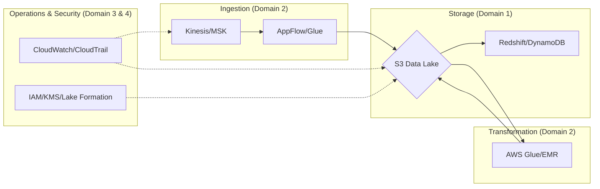

## AWS Service Integrations

In the context of the exam, "Integration" refers to how different services interact to form a cohesive pipeline. You must understand the "handshake" between services.

*   **Ingestion to Storage**: How does Kinesis Data Firehose deliver to S3? (Key concept: Buffering hints—Buffer Size and Buffer Interval).

*   **Transformation to Storage**: How does AWS Glue interact with the Glue Data Catalog to make S3 data queryable via Athena?
*   **Security Integration**: How does AWS Lake Formation provide fine-grained access control (cell-level security) on top of S3?
*   **IAM Trust Relationships**: You must understand that a Glue Service Role needs `s3:GetObject` permissions *and* `kms:Decrypt` permissions if the data is encrypted with a CMK. If you forget the KMS permission, the pipeline fails.
*   **Common Exam Pattern**: The "Serverless ETL Pattern." (S3 Event $\rightarrow$ Lambda $\rightarrow$ Glue $\rightarrow$ S3 $\rightarrow$ Athena).

## Security

Security is the most common area where engineers lose points. The exam treats security as a non-negotiable constraint.

*   **Identity and Access Management (IAM)**: Understand the difference between **Identity-based policies** (attached to a user/role) and **Resource-based policies** (attached to an S3 bucket). You must know when an S3 Bucket Policy is required to allow cross-account access.
*   **Encryption at Rest**: 
    *   **SSE-S3**: AWS manages the keys.
    *   **SSE-KMS**: You manage the keys (provides audit trails in CloudTrail).
    *   **SSE-C**: You provide the keys (rarely the "correct" answer in an AWS-native exam scenario).
*   **Encryption in Transit**: Always assume TLS (HTTPS) is required. Understand that VPC Endpoints (Interface vs. Gateway) are used to keep traffic within the AWS network, avoiding the public internet.
*   **Network Isolation**: Know how to use **S3 VPC Gateway Endpoints** to allow an EC2 instance in a private subnet to reach S3 without an Internet Gateway.
*   **Auditability**: CloudTrail is your source of truth for "Who did what." CloudWatch Logs is your source for "What happened inside the application."

## Performance Tuning

To pass the exam, you must learn to "tune" your study and your technical answers.

*   **Configuration Knobs (The "Correct" Answer Search)**:
    *   **Kinesis**: Tune `Shard Count` for throughput.
    *   **Glue**: Tune `Worker Type` (G.1X, G.2X) based on memory requirements.
    *   **S3**: Use `Partition Projection` in Athena to avoid expensive S3 `LIST` operations.
*   **Scaling Patterns**:
    *   **Horizontal**: Adding shards to Kinesis or nodes to EMR.
    *   **Vertical**: Increasing the instance size of a Redshift cluster.
*   **Data Format Optimization**: The exam loves **Parquet** and **ORC**. Why? Because they are columnar and support "predicate pushdown," which reduces the amount of data scanned (and thus reduces cost).
*   **Cost vs. Performance Trade-off**: This is the most important "tuning" skill. If a question asks for the *cheapest* way to run a job, and you pick a multi-node EMR cluster when a Glue job would suffice, you have failed the question.

## Important Metrics to Monitor

Use these metrics to monitor your **Exam Readiness**.

| Metric Name | Namespace | What it Measures | Threshold to Alarm | Action to Take |
| :--- | :--- | :--- | :--- | :--- |
| `Practice_Exam_Score` | `Study_Progress` | Your accuracy in mock tests. | `< 80%` | Re-study the specific Domain. |
| `Domain_Error_Rate` | `Study_Progress` | Which domain has the most misses. | `> 25%` | Deep dive into AWS Whitepapers for that domain. |
| `Concept_Retention` | `Memory` | Ability to recall service limits. | `Low` | Implement Spaced Repetition (Anki). |
| `HandsOn_Lab_Completion`| `Lab_Status` | Percentage of labs finished. | `< 100%` | Complete the remaining lab modules. |
| `Time_Per_Question` | `Exam_Simulation` | Speed of answering. | `> 2 mins` | Practice "skimming" and keyword identification. |

## Hands-On: Key Operations

You cannot pass this exam by reading; you must be able to manipulate the AWS environment.

### Operation 1: Inspecting S3 Metadata (The "Discovery" phase)
You need to know how to verify if a file is encrypted and what its format is.
```bash
# Check the encryption and metadata of an object
# This is critical for verifying KMS integration
aws s3api head-object --bucket my-data-lake --key raw/data_part_01.parquet
```

### Operation 2: Checking Glue Crawler Logs
When a pipeline fails, the first thing you do is check the logs.
```python
import boto3

# Using boto3 to identify the most recent error in CloudWatch Logs
# This simulates how you would debug a failed Glue Job in a real scenario
client = boto3less('logs')
response = client.describe_log_streams(
    logGroupName='/aws-glue/jobs/error',
    orderBy='LastEventTime',
    descending=True,
    limit=1
)
print(f"Latest Error Stream: {response['logStreams'][0]['logStreamName']}")
```

## Common FAQs and Misconceptions

**Q: I'm an expert in Python/Spark. Is this exam easy?**
**A:** No. This exam tests AWS-specific orchestration and integration (IAM, KMS, S3) as much as it tests coding logic.

**Q: Does "Serverless" always mean "Cheapest"?**
**A:** Not necessarily. For constant, high-throughput workloads, a provisioned Kinesis stream or EMR cluster might be more cost-effective than Lambda or Glue.

**Q: Is S3 Glacier the right place for all old data?**
**A:** Not if you need immediate access. You must distinguish between Glacier Instant Retrieval, Flexible Retrieval, and Deep Archive based on the "Retrieval Time" requirement in the prompt.

**Q: Can I use a single IAM user for my entire pipeline?**
**A:** In the exam, the answer is almost always **No**. You must use IAM Roles with the principle of Least Privilege.

**Q: Is Athena a database?**
**A:** No, it is an interactive query service. The "database" is the Glue Data Catalog.

**Q: What is the difference between Kinesis Data Streams and Firehose?**
**A:** Streams is for real-time, custom processing (requires manual scaling); Firehose is for near-real-time, "load and forget" delivery to S3/Redshift (fully managed).

**Q: Will knowing SQL help me?**
**A:** Immensely. Many questions revolve around Athena, Redshift, and Glue ETL logic.

**Q: If a question mentions "lowest latency," should I pick DynamoDB or Redshift?**
**A:** DynamoDB. Redshift is for analytical (OLAP) workloads; DynamoDB is for transactional (OLTP) low-latency workloads.

## Exam Focus Areas

*   **Ingestion & Transformation (Domain 2)**: Identifying the correct tool (Kinesis vs. MSK vs. AppFlow) based on source and frequency.
*   **Store & Manage (Domain 1)**: Partitioning strategies in S3 and choosing between Parquet and CSV.
*   **Operate & Support (Domain 3)**: Debugging Glue/EMR failures using CloudWatch and managing orchestration with Step Functions.
*   **Design & Create Data Models (Domain 4)**: Implementing Lake Formation permissions and KMS encryption policies.

## Quick Recap

*   **Think in Pipelines**: Every service is a link in a chain; identify where the break is.
*   **Cost is a Constraint**: Always look for the "most cost-effective" keyword.
*   **Security is Primary**: If the IAM/KMS part of the solution is missing, the solution is wrong.
*   **Format Matters**: Parquet and ORC are your best friends for performance.
*   **Decouple Everything**: Understand how S3 acts as the central "source of truth" for all services.
*   **Practice the "Why"**: Don't just learn what a service does; learn why you would choose it over another.

## Blog & Reference Implementations

*   [AWS Big Data Blog](https://aws.amazon.com/blogs/big-data/) - The definitive source for architectural patterns.
*   [AWS re:Invent Deep Dives](https://www.youtube.com/user/AWSreInvent) - Watch sessions on Glue and Redshift to see real-world scale.
*   [AWS Workshop Studio](https://workshops.aws/) - Search for "Data Engineering" to find hands-on labs.
*   [AWS Well-Architected Framework (Data Analytics Lens)](https://aws.amazon.com/architecture/well-architected/) - The "Bible" for designing reliable pipelines.
*   [AWS Samples GitHub](https://github.com/aws-samples) - Reference architectures for complex data ingestion patterns.

---

# AWS Data Architecture Foundations

## Overview

In the traditional on-premises world, data architecture was defined by "monolithic" scaling. If you needed more processing power for your ETL jobs, you had to buy more disks to expand your database. This tight coupling of compute and storage created a fundamental ceiling: you were always over-provisioning storage just to get the CPU cycles you needed, or over-provisioning compute and leaving expensive disks idle.

The "AWS Data Architecture Foundation" is built on a single, revolutionary principle: **The decoupling of compute and storage.** 

In a modern AWS data architecture, we treat storage (Amazon S3) as a highly durable, infinitely scalable, and low-cost "Single Source of Truth." We then attach compute resources (AWS Glue, Amazon EMR, Amazon Athena, or Amazon Redshift Spectrum) to that storage only when needed. This allows a data engineer to scale a processing cluster to 100 nodes to handle a heavy morning transformation and then spin it down to zero, while the data remains safely and cheaply stored in S3.

This section covers the architectural blueprint that powers almost every successful data pipeline on AWS. We will move away from the idea of a "database-centric" view toward a "data-lake-centric" view. You will learn why the "Medallion Architecture" (Bronze, Silver, Gold layers) is the industry standard for managing data quality and how to design systems that are not just functional, but cost-optimized and resilient to the "small file problem."

---

## Core Concepts

### Decoupling Compute and Storage
The fundamental pillar of AWS data engineering. By using Amazon S3 as the storage layer, you separate the cost of keeping data from the cost of processing it. 
*   **Impact:** You can run an Athena query (Serverless Compute) against petabytes of data without ever managing a single server.

### Schema-on-Write vs. Schema-on-Read
*   **Schema-on-Write (Traditional/Redshift):** Data must be structured and validated against a predefined schema *before* it can be loaded. This ensures high data quality but makes ingestion slow and brittle to upstream changes.
*   **Schema-on-Read (Modern/S3/Athena):** Data is loaded in its raw form (JSON, CSV, Parquet). The structure is applied by the compute engine *at the moment of the query*. This provides massive agility for ingestion but requires much more discipline in the "Transformation" layer to avoid a "Data Swamp."

### The Medallion Architecture (Data Lake Layers)
To prevent a Data Lake from becoming a Data Swamp, we implement logical layers:
1.  **Bronze (Raw):** The landing zone. Data is ingested exactly as it is from the source (immutable). No transformations allowed here.
2.  **Silver (Cleansed/Transformed):** Data is filtered, joined, and standardized. This is where we enforce types and handle nulls.
3.  **Gold (Curated/Business):** Aggregated, highly optimized data ready for consumption by BI tools like QuickSight or ML models in SageMaker.

### Columnar vs. Row-Based Storage
*   **Row-Based (CSV, JSON, Avro):** Great for transactional workloads (OLTP). Good when you need to read every field in a record.

*   **Columnar (Parquet, ORC):** The gold standard for Data Engineering (OLAP). Great for analytical queries. If your query only asks for `SUM(sales_amount)`, the engine only reads the `sales_amount` column, drastically reducing I/O and cost.

---

## Architecture / How It Works

The following diagram illustrates the standard "Decoupled Data Pipeline" pattern used in most enterprise AWS environments.

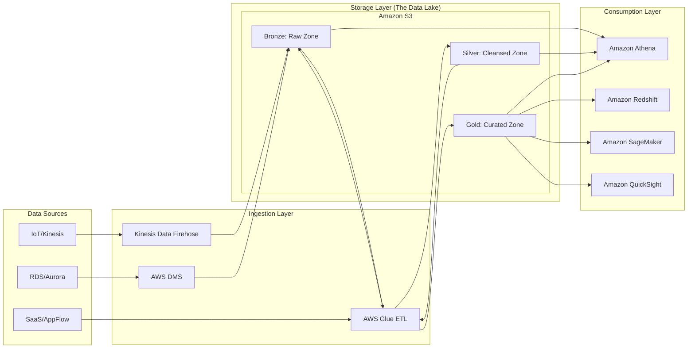

---

## AWS Service Integrations

A data engineer's job is essentially managing the "glue" between these services.

### Inbound (Data Ingestion)
*   **AWS DMS (Database Migration Service):** Moves data from on-prem or RDS into S3. It uses Change Data Capture (CDC) to stream updates.
*   **Amazon Kinesis Data Firehose:** The primary service for "streaming to S3." It handles buffering, compression, and format conversion (e.g., JSON to Parquet) automatically.
*   **Amazon AppFlow:** Connects SaaS platforms (Salesforce, Zendesk) directly to S3.

### Outbound (Data Consumption)
*   **Amazon Athena:** An interactive query service that uses standard SQL to analyze data directly in S3. It is the primary tool for the "Silver" and "Gold" layers.
*   **Amazon Redshift Spectrum:** Allows Redshift (your warehouse) to query data residing in S3 (your lake), enabling a "Lakehouse" architecture.
*   **Amazon QuickSight:** The BI layer that visualizes the "Gold" layer data.

### Integration Patterns & IAM
*   **The Service-Linked Role Pattern:** When Glue runs a job, it needs an IAM Role with `s3:GetObject`, `s3:PutObject`, and `glue:CreateDatabase` permissions.
*   **The Trust Relationship:** You must ensure that the Glue service principal (`glue.amazonaws.com`) is allowed to assume the role you've created.
*   **Cross-Account Pattern:** In production, Ingestion often happens in a "Producer Account," while Transformation/Analytics happens in a "Consumer Account." This requires S3 Bucket Policies that explicitly allow the Consumer Account's IAM Roles to access the Producer's S3 buckets.

---

## Security

Security in data engineering is not an afterthought; it is the foundation.

*   **IAM & Fine-Grained Access:** Do not use `s3:*`. Use specific permissions for specific prefixes. Use **AWS Lake Formation** to implement cell-level and column-level security (e.g., "Accountants can see the `salary` column, but Analysts cannot").
*   **Encryption at Rest:**
    *   **SSE-S3:** AWS manages the keys. Good for non-sensitive logs.
  	*   **SSE-KMS:** You manage the keys via AWS KMS. **Mandatory** for production. Allows for audit trails via CloudTrail (who used the key to decrypt this data?).
*   **Encryption in Transit:** Always use TLS (HTTPS) for all data movement. When working within a VPC, use **VPC Endpoints (PrivateLink)** for S3 and Glue so that data never traverses the public internet.
*   **Network Isolation:** Data pipelines should reside in private subnets. Use Security Groups to ensure that only your Glue/EMR clusters can talk to your RDS instances.
*   **Audit Logging:** 
    *   **AWS CloudTrail:** Logs every API call (who deleted the S3 bucket?).
    *   **S3 Access Logs:** Logs every object-level request (who downloaded the sensitive CSV?).

---

## Performance Tuning

If you don't tune your architecture, you will fail the "Cost Optimization" portion of the exam.

1.  **The "Small File Problem":** Having millions of 1KB files in S3 will destroy Athena/Glue performance. The overhead of opening each file exceeds the time spent reading data. 
    *   **Fix:** Use Kinesis Firehose to buffer data or use Glue to "compact" small files into larger ~128MB to 512MB files.
2.  **Partitioning:** This is the #1 performance lever. Instead of `s3://my-bucket/data.parquet`, use `s3://my-bucket/year=2023/month=10/day=27/data.parquet`. 
    *   **Why:** Athena will "prune" partitions, skipping entire folders that don't match your `WHERE` clause.
3.  **Columnar Format (Parquet):** Always convert CSV/JSON to Parquet in your Silver layer. It reduces the amount of data scanned, which directly reduces your Athena bill.
4.  **S3 Partition Projection:** For high-cardinality partitions (like many days/hours), don't rely on Glue Crawlers to find partitions. Use Partition Projection in your Athena table properties to calculate partition locations mathematically.
5.  **Compression:** Use **Snappy** compression with Parquet. It provides a great balance between compression ratio and CPU overhead for decompression.

---

## Important Metrics to Monitor

| Metric Name (Namespace: Metric) | What it Measures | Threshold to Alarm | Action to Take |
| :--- | :--- | :--- | :--- |
| `Kinesis/GetRecords.IteratorAgeMilliseconds` | The delay between data arriving in the stream and your application processing it. | > 60,000 (1 min) | Scale up your consumers (Lambda or KCL). |
| `Glue/glue.driver.aggregate.numCompletedStages` | Whether your Glue ETL jobs are progressing or stuck. | 0 (for an active job) | Check logs for OOM (Out of Memory) or infinite loops. |
| `S3/AllRequests` (S3 Namespace) | Sudden spikes in request volume. | 2x baseline | Check for a "runaway" Lambda function or a security breach. |
| `S3/4xxErrors` | Client-side errors (e.g., Access Denied or NoSuchKey). | > 5 in 5 mins | Inspect IAM policies or check for broken file paths in code. |
| `Glue/glue.executor.jvm.heap.usage` | Memory pressure on your Glue workers. | > 85% | Increase the Worker Type (e.g., from `G.1X` to `G.2X`). |
| `CloudWatch/Lambda/Duration` | Time taken to run your ingestion Lambda. | Approaching 9 mins | Refactor code or move to a more robust service like Glue. |

---

## Hands-On: Key Operations

### Task 1: Automating S3 Partitioning (Python/Boto3)
In production, we often need to move files from a "Landing" zone to a "Processed" zone while applying a partition structure.

```python
import boto3

def move_to_partitioned_zone(src_bucket, dest_bucket, file_key, year, month, day):
    s3 = boto3.client('s3')
    
    # Define the new partitioned path (The 'Silver' Layer pattern)
    new_key = f"silver/year={year}/month={month}/day={day}/{file_key.split('/')[-1]}"
    
    # Copy the object to the new partitioned location
    # We use copy_object because it's an atomic metadata operation in S3
    copy_source = {'Bucket': src_bucket, 'Key': file_key}
    
    try:
        s3.copy_object(Bucket=dest_bucket, CopySource=copy_source, Key=new_key)
        print(f"Successfully moved {file_key} to {new_key}")
        
        # Cleanup: Delete the raw file from the Bronze zone
        s3.delete_object(Bucket=src_bucket, Key=file_key)
    except Exception as e:
        print(f"Error moving file: {str(e)}")

# Usage: Moving a raw JSON file to a structured Silver zone
move_to_partitioned_zone('my-bronze-bucket', 'my-silver-bucket', 'uploads/data_123.json', '2023', '10', '27')
```

### Task 2: Creating an Athena Table with Partition Projection (SQL)
Avoid the "Glue Crawler overhead" by defining your partitions manually in the DDL.

```sql
CREATE EXTERNAL TABLE IF NOT EXISTS my_database.processed_sales (
  order_id string,
  amount double,
  customer_id string
)
PARTITIONED BY (year string, month string, day string)
STORED AS PARQUET
LOCATION 's3://my-silver-bucket/sales/'
TBLPROPERTIES (
  'projection.enabled' = 'true',
  'projection.year.type' = 'integer',
  'projection.year.range' = '2020,2025',
  'projection.month.type' = 'integer',
  'projection.month.range' = '1,12',
  'projection.month.digits' = '2',
  'projection.day.type' = 'integer',
  'projection.day.range' = '1,31',
  'projection.day.digits' = '2'
);
-- This allows Athena to 'calculate' where the data is without needing a Glue Crawler.
```

---

## Common FAQs and Misconceptions

**Q: I have a small amount of data. Why shouldn't I just use Amazon RDS?**
**A:** RDS is for OLTP (transactions). If you start performing heavy analytical aggregations (e.g., `SUM`, `GROUP BY` over millions of rows), you will lock your tables and crash your application. Use S3/Athena for analytics.

**Q: Does a Glue Crawler create the data in S3?**
**A:** No. A Crawler *discovers* metadata. It reads the existing files in S3 and updates the AWS Glue Data Catalog so Athena can query them.

**Q: Is S3 "Schema-on-Read" or "Schema-on-Write"?**
**A:** S3 is just storage. The *architecture* is Schema-on-Read. S3 doesn't care about your schema; the compute engine (Athena/Glue) applies it.

**Q: Can I use Glue to transform JSON directly into Parquet?**
**A:** Yes, this is the standard pattern for the "Bronze to Silver" transition.

**Q: What is the "Small File Problem" and how does it affect cost?**
**A:** Many small files cause high S3 `GET` request costs and high Athena "data scanned" costs due to metadata overhead. Always compact small files.

**Q: If I use SSE-KMS, does it make my queries slower?**
**A:** The latency impact is negligible, but you must ensure your IAM roles have `kms:Decrypt` permissions, otherwise, your queries will fail with "Access Denied."

**Q: Is it cheaper to use CSV or Parquet in S3?**
**A:** Parquet is more expensive to *compute* (due to CPU for compression) but significantly cheaper to *query* (due to reduced data scanning). For any analytical workload, Parquet wins.

**Q: Can Athena query data across different AWS accounts?**
**A:** Yes, but you must explicitly grant the Athena IAM role from Account A permission to access the S3 bucket in Account B via a Bucket Policy.

---

_Note: This concludes Section 3. In the next section, we will dive deep into Amazon S3: The Foundation of the Data Lake._

---

## Exam Focus Areas

**Domain: Design & Create Data Models**
*   Selecting between Columnar (Parquet) and Row-based (JSON) formats based on use case.
*   Designing Partitioning strategies to optimize query performance.
*   Implementing the Medallion (Bronze/Silver/Gold) architecture.

**Domain: Ingestion & Transformation**
*   Choosing between Kinesis Firehose (Streaming) and Glue/DMS (Batch/CDC).
*   Understanding how to use Glue for schema evolution and format conversion.

**Domain: Store & Manage**
*   Implementing S3 lifecycle policies (Transitioning to Glacier).
*   Implementing fine-grained access control using AWS Lake Formation.

**Domain: Operate & Support**
*   Identifying "Small File" bottlenecks using CloudWatch.
*   Monitoring Kinesis `IteratorAge` to detect ingestion lag.

---

## Quick Recap
*   **Decoupling is King:** Always separate compute (Glue/Athena) from storage (S3).
*   **Format Matters:** Use Parquet/Snappy for analytics to reduce cost and increase speed.
*   **Partition Strategically:** Use partitions (Year/Month/Day) to enable partition pruning.
*   **Avoid Small Files:** Compact small files into larger chunks to prevent performance degradation.
*   **Security is Multi-layered:** Use IAM for identity, KMS for encryption, and Lake Formation for fine-grained access.
*   **Schema-on-Read is Flexible:** Use it for agility, but use Glue/Athena to enforce structure in your Silver layer.

---

## Blog & Reference Implementations
*   **AWS Big Data Blog:** [Best practices for Amazon S3 partitioning](https://aws.amazon.com/blogs/big-data/)
*   **AWS re:Invent Session:** ["Building a Data Lake on AWS" (Deep Dive)](https://www.youtube.com/user/AWSOnlineTech)
*   **AWS Workshop Studio:** [Serverless Data Lake Workshop](https://catalog.us-east-1. workshops.aws/)
*   **AWS Well-Architected:** [Data Lake Design Patterns](https://aws.amazon.com/architecture/well-architected/)
*   **AWS Samples GitHub:** [AWS Glue ETL Patterns and Templates](https://github.com/aws-samples)

---

# Section 4: Data Ingestion

## Data Ingestion

### Overview
Data ingestion is the foundational stage of any data pipeline. In the AWS ecosystem, ingestion is not a single action but a spectrum of patterns ranging from **Real-time Streaming** (low latency, high velocity) to **Batch Processing** (high volume, high latency) and **Change Data Capture (CDC)** (synchronizing state). The primary challenge you will face as a Data Engineer is not just moving bits from point A to point/B, but managing the "impedance mismatch" between producers and consumers.

The core problem ingestion solves is **decoupling**. Producers (IoT devices, web servers, SaaS applications) operate on their own schedules and scales. Consumers (S3, Redshift, Athena, OpenSearch) have their own processing constraints. Without a robust ingestion layer, a spike in web traffic could overwhelm your downstream analytics engine, leading to data loss or system failure.

In the context of the AWS Certified Data Engineer Associate exam, you must view ingestion through the lens of **Latency vs. Cost vs. Complexity**. You will choose Kinesis for sub-second requirements, AWS DMS for database replication, AppFlow for third-party SaaS integration, and AWS Glue for scheduled batch movement. Choosing the wrong pattern isn't just a performance issue; it's a massive architectural cost error.

### Core Concepts

#### 1. Streaming Ingestion (Kinesis Data Streams & MSK)
*   **Shards (Kinesis):** The fundamental unit of throughput. A shard provides a fixed capacity (1MB/s ingress, 2MB/s egress). **Crucial Exam Note:** Scaling Kinesis is *manual* (resharding) unless you use Kinesis Data Streams On-Demand, which manages capacity for you but at a higher base cost.
*   **Partitions & Partition Keys:** This is how data is distributed across shards. A poor partition key (e.g., a constant value like `user_id=1`) leads to a **"Hot Shard"**—where one shard is overwhelmed while others are idle.
*   **Retention Period:** Default is 24 hours, but can be extended up and to 365 days. Increasing retention increases cost.

#### 2. Delivery/Buffered Ingestion (Kinesis Data Firehose)
*   **Buffer Hints:** Firehose doesn't send data immediately. It buffers based on **Size** (e.g., 5MB) or **Time** (e.g., 60 seconds). This is the "knob" you turn to balance latency vs. file count in S3.
*   **Transformation:** Firehose can trigger an AWS Lambda function to transform raw JSON into Parquet or Avro *in-flight* before it hits S3.

#### 3. Database/Change Data Capture (AWS DMS)
*   **Full Load vs. CDC:** Full Load moves the existing dataset; CDC captures only the changes (Inserts, Updates, Deletes) by reading the database transaction logs (e.g., Binlog in MySQL).
*   **Replication Instance:** The compute resource that performs the heavy lifting. If this instance is undersized, your CDC latency will spike.

#### 4. Managed SaaS Ingestion (AWS AppFlow)
*   **Zero-ETL/No-Code:** AppFlow is a "Pull" mechanism. It connects to SaaS (Salesforce, Zend/Zendesk, Slack) and moves data to AWS targets. It is specifically designed for when you don't want to manage complex API integrations.

### Architecture / How It Works

The following diagram illustrates the three primary ingestion patterns used in production-grade AWS architectures.

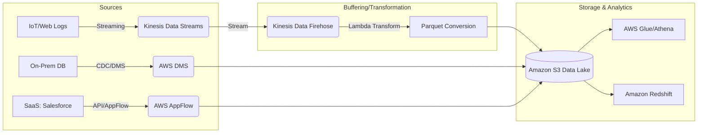

### AWS Service Integrations

*   **Inbound Integrations:**
    *   **AWS IoT Core:** Publishes messages directly to Kinesis Data Streams.
    *   **CloudWatch Logs:** Can be streamed via Kinesis Data Firehose for real-time log analysis.
    *   **On-Premise Databases:** Connected via AWS Site-to-Site VPN or Direct Connect to facilitate DMS replication.
*   **Outbound Integrations:**
    *   **S3 (The "Landing Zone"):** The universal destination for almost all ingestion services.
    *   **Amazon Redshift:** Via Firehose (streaming) or DMS (batch/CDC).
    *   **Amazon OpenSearch:** Via Firehose for real-time log indexing.
*   **IAM & Trust Relationships:**
    *   **Service-Linked Roles:** Kinesis Firehose requires an IAM role that allows it to `s3:PutObject` and `lambda:InvokeFunction`.
    *   **DMS Resource Access:** The DMS replication instance must have an IAM role with permissions to access the source (e.g., S3 for logs) and the target (e.g., Redshift).
*   **Multi-Service Pattern (The "Lambda Architecture"):**
    *   *Pattern:* Kinesis Data Streams (Real-time) $\rightarrow$ Kinesis Data Analytics (Flink) $\rightarrow$ OpenSearch.
    *   *Pattern:* Kinesis Data Streams $\rightarrow$ Kinesis Firehose $\rightarrow$ S3 $\rightarrow$ Glue $\rightarrow$ Athena (Batch/Historical).

### Security

*   **Encryption at Rest:**
    *   **Kinesis/MSK/S3:** Use **AWS KMS (SSE-KMS)**. For high-compliance workloads, use Customer Managed Keys (CMK) to maintain control over rotation policies.
    able to avoid `SSE-S3` for sensitive data to ensure auditability via CloudTrail.
*   **Encryption in Transit:**
    *   All ingestion-related APIs must use **TLS 1.2+**.
    *   When moving data from On-Prem to AWS (DMS), use **AWS Direct Connect** or **VPN** to ensure data never traverses the public internet.
*   **Network Isolation:**
    *   **VPC Endpoints (Interface Endpoints/PrivateLink):** Critical for security. Ensure your Kinesis/S3 traffic stays within the AWS network backbone, avoiding the public internet.
    *   **Security Groups:** Applied to DMS Replication Instances and MSK brokers to restrict ingress to known application CIDRs.
*   **Audit & Compliance:**
    *   **AWS CloudTrail:** Every `CreateStream`, `DeleteTable`, or `StartReplicationTask` event is logged.
    *   **S3 Block Public Access:** Always enabled on the ingestion landing zone.

### Performance Tuning

*   **Kinesis Data Streams:**
    *   **Avoid Hot Shards:** Use high-cardinality partition keys (e.g., `UUID` or `transaction_id`) instead of `region_id`.
    *   **Scaling:** Use **Kinesis On-Demand** if your traffic is unpredictable; use **Provisioned Mode** if you have a steady, predictable stream to save ~30% in costs.

*   **Kinesis Data Firehose:**
    *   **Buffer Tuning:** If you have many small files in S3, increase the buffer size (up to 128MB) or time (up to 900s). This reduces S3 `PUT` costs and improves Athena query performance (fewer, larger files).
*   **AWS DMS:**
    *   **Instance Sizing:** Monitor `CPUUtilization` and `FreeableMemory` on the replication instance.
    *   **Multi-AZ:** Always use Multi-AZ for production CDC tasks to prevent downtime during an AWS availability zone failure.
*   **Data Format:**
    *   **Always convert to Columnar (Parquet/ORC):** Perform this during the Firehose transformation stage or via Glue. This drastically reduces the amount of data scanned by Athena/Redshift.

### Important Metrics to Monitor

| Metric Name (Namespace: Kinesis/DMS/etc) | What it Measures | Threshold to Alarm | Action to Take |
| :--- | :--- | :--- | :--- |
| `GetRecords.IteratorAgeMilliseconds` (Kinesis) | Delay between data production and consumption. | > 60,000ms (1 min) | Scale up shards or check consumer Lambda performance. |
| `IncomingBytes` (Kinesis) | Throughput volume entering the stream. | Near Shard Limit (1MB/s) | Initiate shard splitting (resharding). |
| `WriteProvisionedThroughputExceeded` (Kinesis) | Throttling events due to shard capacity limits. | $> 0$ | Increase shards or check for hot shards. |
| `CDCLatency` (DMS) | Delay in applying changes from source to target. | $> 5$ minutes | Scale up DMS Replication Instance size. |
| `CPUUtilization` (DMS) | Compute load on the replication instance. | $> 80\%$ | Upgrade instance class (Vertical Scaling). |
| `S3.PutRequests` (S3) | Frequency of write operations to the landing zone. | Sudden spikes | Review Firehose buffer settings to batch more data. |

### Hands-On: Key Operations

#### 1. Creating a Kinesis Data Stream (Boto3)
```python
import boto3

client = boto3.client('kinesis', region_name='us-east-1')

# We use 'on_demand' for the exam-ready, scalable architecture 
# to avoid manual shard management in unpredictable workloads.
def create_stream(stream_name):
    try:
        response = client.create_stream(
            StreamName=stream_name,
            StreamModeDetails={'StreamMode': 'ON_DEMAND'}
        )
        print(f"Successfully created stream: {stream_name}")
        return response
    except Exception as e:
        print(f"Error: {e}")

create_stream('production-telemetry-stream')
```

#### 2. Checking Consumer Lag (Python/Boto3)
```python
import boto3

client = boto3.client('cloudwatch')

def check_iterator_age(stream_name):
    # High IteratorAge is the #1 cause of data loss in streaming pipelines.
    # It means your application is too slow to keep up with the stream.
    response = client.get_metric_statistics(
        Namespace='AWS/Kinesis',
        MetricName='GetRecords.IteratorAgeMilliseconds',
        Dimensions=[{'Name': 'StreamName', 'Value': stream_name}],
        StartTime='2023-10-01T00:00:00Z', # Use actual time window
        EndTime='2023-10-01T01:00:00Z',
        Period=300,
        Statistics=['Maximum']
    )
    return response['Datapoints']

print(check_iter_age('production-telemetry-stream'))
```

### Common FAQs and Misconceptions

**Q: Does Kinesis Data Firehose support real-time sub-second latency?**
**A:** No. Firehose is a buffered service. It has a minimum buffer interval of 60 seconds. For sub-second, use Kinesis Data Streams.

**Q: If I increase the number of shards in Kinesis, does the data automatically rebalance?**
**A:** Only if you perform a "split" operation on specific shards. Adding shards doesn't automatically move existing data; you must manage the repartitioning logic for the keys.

**Q: Can AWS DMS perform complex SQL transformations during ingestion?**
**A:** No. DMS is for movement and minimal mapping. For complex transformations, use AWS Glue or Kinesis Data Analytics (Flink).

**Q: Is Kinesis Data Streams cheaper than Kinesis Data Firehose for simple S3 dumps?**
**A:** Generally, no. Firehose is a managed service that handles the heavy lifting (buffering, S3 writes, Parquet conversion). Streams requires you to manage the consumers (Lambda/EC2).

**Q: What happens if my Kinesis stream reaches its capacity?**
**A:** You will see `ProvisionedThroughputExceeded` errors, and producers will be throttled (data may be dropped if not retried).

**Q: Can AppFlow be used to ingest data from an S3 bucket into Redshift?**
**A:** No. AppFlow is specifically for SaaS-to-AWS. For S3-to-Redshift, use `COPY` commands, Glue, or Redshift Spectrum.

**Q: Does DMS require a connection to the internet?**
**A:** No. In a production environment, you should use VPC Endpoints and private subnets so DMS communicates with your RDS/Aurora instances over the private AWS network.

**Q: Why is "Hot Sharding" a problem in Kinesis?**
**A:** It creates a bottleneck. Even if you have 100 shards, if all your data has the same partition key, only 1 shard is doing work, and you are still limited to 1MB/s.

### Exam Focus Areas

*   **Ingestion & Transformation (Domain 1):** Choosing between Streams (Real-time) vs. Firehose (Buffered) vs. DMS (CDC). Identifying the impact of partition keys on throughput.
*   **Store & Manage (Domain 2):** Configuring S3 bucket policies and KMS for incoming data. Managing partition hierarchies in S3 (e.g., `year=2023/month=10/`).
*   **Operate & Support (Domain 4):** Monitoring `IteratorAge` and `CPUUtilization`. Troubleshooting DMS replication lag and Kinesis throttling.
*   **Design & Create Data Models (Domain 3):** Designing partition keys to avoid hot shards. Designing Parquet/Avro schemas for efficient downstream consumption.

### Quick Recap
- [ ] **Decouple** producers and consumers using Kinesis or MSK.
- [ ] **Choose Firehose** for low-maintenance, buffered delivery to S3/Redshift.
- [ ] **Avoid Hot Shards** by using high-cardinality partition keys in Kinesis.
- [ ] **Monitor IteratorAge** to detect when your consumers are falling behind.
- [ ] **Use DMS** specifically for database replication and Change Data Capture (CDC).
- [ ] **Transform to Parquet** during ingestion to optimize downstream costs and performance.

### Blog & Reference Implementations
*   [AWS Big Data Blog](https://aws.amazon.com/blogs/big-data/): Best for architectural patterns (e.g., "Real-time analytics with Kinesis").
*   [AWS re:Invent - Kinesis Deep Dive](https://www.youtube.com/user/AWSFTW): Essential for understanding shard internals.
*   [AWS Workshop Studio - Data Engineering](https://workshop.aws/): Hands-on labs for setting up Kinesis/Glue pipelines.
*   [AWS Well-Architected Framework - Data Analytics Lens](https://docs.aws.amazon.com/wellarchitected/latest/data-analytics-lens/data-analytics-lens.html): The gold standard for designing resilient pipelines.
*   [AWS Samples GitHub](https://github.com/aws-samples): Search for "Kinesis-Firehose-Lambda-Transformation" for production-ready code.

---

# AWS Glue Deep Dive

## Overview

In the modern data engineering landscape, the primary challenge isn't just moving data; it's managing the metadata and the scale of transformation. AWS Glue is the foundational serverless ETL (Extract, Transform, Load) service that provides the "connective tissue" for the AWS Data Ecosystem. While services like Kinesis handle data in motion and S3 handles data at rest, Glue provides the intelligence to understand what that data actually is and how to transform it into a queryable, high-performance format.

The fundamental problem Glue solves is the "Schema Drift" and "Data Silo" problem. In a large enterprise, data arrives in various formats (JSON, CSV, Parquet, Avro) from various sources (RDS, S3, MongoDB). Without a centralized way to track schemas, downstream consumers like Amazon Athena or Amazon Redshift Spectrum are blind. Glue's Data Catalog acts as a persistent, centralized metadata repository, allowing you to treat your S3-based data lake as if it were a structured relational database.

From an architectural standpoint, you should view Glue not as a single service, running a single script, but as a suite of capabilities: **Crawlers** for discovery, **Data Catalog** for metadata management, **ETL Jobs** (Spark, Python, and Ray) for heavy lifting, and **Glue Studio/DataBrew** for low-code/no-code transformation. When designing pipelines for the DEA-C01 exam, remember that Glue is the "intelligence layer" that sits between your raw ingestion layer and your analytical consumption layer.

---

## Core Concepts

### The Glue Data Catalog
The heart of the service. It is a Hive-metastore-compatible repository.
*   **Databases:** Logical groupings of tables.
*   **Tables:** Metadata definitions (schema, partition keys, storage descriptors).
*   **Partitions:** A critical optimization. Partitions allow engines like Athena to skip scanning irrelevant S3 prefixes. 
*   **Note:** The Catalog does *not* store the actual data; it only stores the metadata (the "map" to the data).

### AWS Glue Crawlers
Automated processes that connect to a data store, determine the schema, and populate the Data Catalog.
*   **Behavior:** Crawlers use classifiers to infer schema. If a new column appears in your JSON, the crawler detects it and updates the table definition.

*   **The Trap:** Running crawlers too frequently on large S3 buckets is a common cost-sink and can lead to "partition bloat" if not configured to respect existing partitions.

### AWS Glue ETL Jobs
The compute engine. You have three main flavors:
1.  **Spark Jobs (PySpark/Scala):** Distributed processing for massive datasets. Uses **DPUs (Data Processing Units)**.
2.  **Python Shell Jobs:** For small-scale ETL. It uses a single-node architecture. It is significantly cheaper than Spark for tasks that don't require distributed computing (e.g., moving small CSVs to Parquet).
3.  **Ray Jobs:** A newer, high-performance distributed framework for Python, optimized for much faster scaling of Python-heavy workloads compared to Spark.

### Glue Dynamic Frames
This is a "Glue-specific" concept you **must** know. While Spark uses `DataFrames`, Glue uses `DynamicFrames`.
*   **Why it exists:** Standard Spark DataFrames require a fixed schema. If a single record in a million has a string where an integer should be, Spark might fail or nullify the data. 
*   **The Advantage:** `DynamicFrames` handle "schema evolution" and semi-structured data natively by allowing each record to have its own schema. They are designed to handle "dirty" data without crashing the job.

### Computing Units: DPUs
AWS Glue scales using **DPUs (Data Processing Units)**. 
*   1 DPU = 4 vCPUs and 16 GB of RAM.
*   **Limit/Quota:** You are subject to service quotas on the number of concurrent DPUs in a region. If your job requests 100 DPEX but your quota is 50, the job will fail to start.

---

## Architecture / How It Works

The following diagram illustrates the lifecycle of a standard Data Lake ingestion pattern:

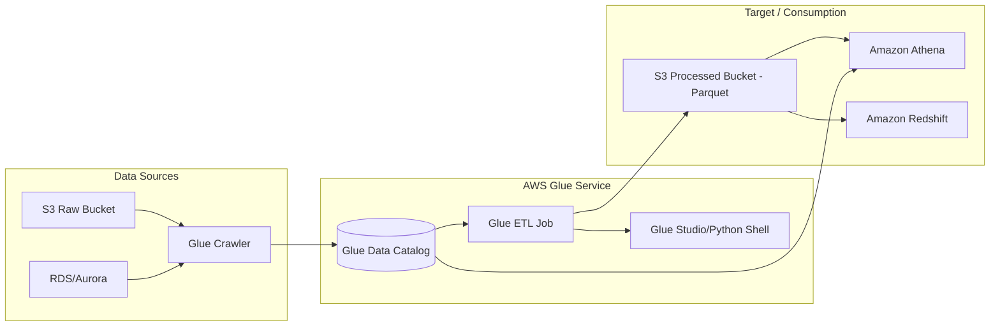

---

## AWS Service Integrations

### Data Inflow (Sources)
*   **Amazon S3:** The primary source for all Glue operations.
*   **Amazon RDS/Aurora:** Glue uses JDBC connectors to crawl and extract structured data.
*   **Amazon Kinesis/MSK:** Glue **Streaming** jobs can consume real-time data from Kinesis Data Streams or Managed Streaming for Kafka, allowing for real-time ETL.

### Data Outflow (Sinks)
*   **Amazon Athena:** Queries the Glue Data Catalog directly.
*   **Amazon Redshift:** Glue can load data into Redshift via the `COPY` command or use Redshift Spectrum to query S3 via the Glue Catalog.
*   **Amazon OpenSearch:** Glue can transform and index data for search workloads.

### IAM & Trust Relationships
*   **Glue Service Role:** The Glue Job/Crawler requires an IAM Role. 
*   **Required Permissions:** 
    *   `s3:GetObject` and `s3:PutObject` for the data buckets.
    *   `glue:GetTable`, `glue:CreateTable` for the Catalog.
    *   **Trust Policy:** The role must have a trust relationship allowing `glue.amazonaws.com` to assume the role.

### Common Pipeline Pattern (The Exam Favorite)
**Pattern:** *S3 (JSON) $\rightarrow$ Glue Crawler $\rightarrow$ Glue Catalog $\rightarrow$ Glue ETL (Transform to Parquet) $\rightarrow$ S3 (Parquet) $\rightarrow$ Athena.*
This pattern optimizes for cost (Parquet is cheaper to query) and performance (Partitioning).

---

## Security

### Identity and Access Management (IAM)
*   **Fine-Grained Access Control:** You can use **AWS Lake Formation** (which sits on top of Glue) to provide cell-level or row-level security. Standard IAM can only restrict access to the entire database or table.
*   **Resource-based Policies:** Ensure your S3 bucket policies allow the Glue Service Role access.

### Encryption
*   **At Rest:**
    *   **Data Catalog:** Use **AWS KMS** to encrypt the metadata (column names, types).
    *   **S3 Data:** Use **SSE-KMS** or **SSE-S3**. If your Glue job reads encrypted S3 data, the Glue IAM role must have `kms:Decrypt` permissions.
*   **In Transit:** All data movement within Glue is encrypted via **TLS**.

### Network Isolation (The "Production" Way)
*   **VPC Endpoints:** In a secure environment, your Glue jobs should not traverse the public internet. Use **Interface VPC Endpoints (PrivateLink)** to connect to the Glue service and **Gateway Endpoints** for S3.
*   **Security Groups:** When running Glue in a VPC (to access an RDS instance, for example), you must assign a Security Group to the Glue connection that allows inbound/outbound traffic to your database.

---

## Performance Tuning

### 1. The "Small File Problem"
*   **Problem:** Thousands of 1KB files cause massive overhead in Spark (high metadata latency and S3 LIST calls).
*   **Solution:** Use the `groupFiles` parameter in Glue ETL. This tells Glue to coalesce small files into larger tasks within a single DPU.

### 2. Partition Pruning
*   **Problem:** A query scanning 10,000 partitions is slow and expensive.
*   **Solution:** Always partition your data by a high-cardinality, frequently queried column (e.g., `year/month/day`). Ensure your Glue Job writes data in a partitioned structure.

### 3. Worker Type Selection
*   **G.1X:** Good for standard workloads.
*   **G.2X:** Use this if you encounter `OutofMemory (OOM)` errors. It provides more RAM per executor, ideal for complex joins or large shuffles.

### 4. Auto-Scaling
*   **Recommendation:** Enable **Glue Auto Scaling**. Instead of over-provisioning DPUs (and wasting money) to handle peaks, Glue will dynamically add/remove workers based on the actual backlog of Spark tasks.

---

## Important Metrics to Monitor

| Metric Name (Namespace: `AWS/Glue`) | What it Measures | Threshold to Alarm | Action to Take |
| :--- ability to handle load | | | |
| `glue.driver.aggregate.numCompletedStages` | Progress of the Spark Job. | If 0 after $X$ minutes. | Check if the job is stuck in "Starting" or if there is a resource deadlock. |
| `glue.executor.jvm.heap.usage` | Memory pressure on executors. | $> 85\%$ | Increase Worker Type from G.1X to G.2X or check for data skew. |
| `glue.driver.aggregate.numFailedTasks` | Number of failed Spark tasks. | $> 0$ | Inspect CloudWatch Logs for `ExecutorLost` or `OOM` errors. |
| `glue.driver.aggregate.elapsedTime` | Total execution duration. | $> 2 \times$ baseline. | Check for "Small File Problem" or increased data volume in source. |
| `glue.executor.jvm.gc.time` | Time spent in Garbage Collection. | High/Increasing | Indicates high memory pressure; implement partitioning or increase RAM. |

---

## Hands-On: Key Operations

### Operation 1: Starting a Glue Job via Boto3 (Python)
Use this when you want to trigger an ETL job from a Lambda function after an S3 upload.

```python
import boto3

def trigger_glue_job(job_name):
    client = botole3.client('glue')
    
    try:
        # Start the job run
        response = client.start_job_run(JobName=job_name)
        
        # Print the JobRunId for tracking
        print(f"Started Job: {job_name}. RunID: {response['JobRunId']}")
    except Exception as e:
        print(f"Error starting job: {str(e)}")

# Usage
trigger_glue_job('my_production_etl_job')
```

### Operation 2: Creating a Glue Table via AWS CLI
This is useful for automating environment setup in CI/CD pipelines.

```bash
# Create a table definition in the Glue Catalog
aws glue create-table \
    --database-name 'my_data_lake_db' \
    --table-input '{
        "Name": "users_table",
        "StorageDescriptor": {
            "Columns": [
                {"Name": "user_id", "Type": "int"},
                {"Name": "user_name", "Type": "string"},
                {"Name": "signup_date", "Type": "string"}
            ],
            "Location": "s3://my-data-bucket/processed/users/",
            "InputFormat": "org.apache.hadoop.hive.ql.io.parquet.MapredParquetInputFormat",
            "OutputFormat": "org.apache.hadoop.hive.ql.io.parquet.MapredParquetOutputFormat",
            "SerdeInfo": {
                "SerializationLib": "org.apache.hadoop.hive.ql.io.parquet.serde.ParquetHiveSerDe"
            }
        },
        "PartitionKeys": [
            {"Name": "signup_date", "Type": "string"}
        ]
    }'
```

---

## Common FAQs and Misconceptions

**Q: Does Glue compute happen in my VPC?**
**A:** By default, Glue runs in a service-managed VPC. If you need to access private resources (like an RDS instance), you must configure Glue to connect to *your* VPC.

**Q: Is Glue cheaper than Python Shell for all tasks?**
**A:** No. For small datasets (under a few GBs), Python Shell is much more cost-effective because it uses fewer DPUs and doesn't have the Spark startup overhead.

**Q: Can I use Glue to query RDS directly without an ETL job?**
**A:** You can use a Glue Crawler to catalog the RDS schema, but to *move* or *transform* the data, you still need a Job (Spark or Python Shell).

**Q: What is the difference between a Crawler and a Job?**
**A:** A Crawler is for *discovery* (metadata only). A Job is for *computation* (data transformation).

**Q: Does Glue support streaming?**
**A:** Yes, via Glue Streaming ETL, which uses Spark Structured Streaming under the hood.

**Q: If I delete an S3 bucket, does the Glue Table disappear?**
**A:** No. The metadata remains in the Data Catalog. This results in "orphaned" metadata, which can cause errors in Athena.

**Q: Can Glue handle schema evolution?**
**A:** Yes, specifically through `DynamicFrames` and by configuring Crawlers to "Update the table definition."

**Q: Is Glue a replacement for AWS Lambda?**
**A:** No. Lambda is for short-lived, event-driven microservices. Glue is for long-running, data-intensive ETL workloads.

---

s## Exam Focus Areas

*   **Ingestion & Transformation (Domain 1):**
    *   Choosing between Spark, Python Shell, and Ray based on data size and cost.
    *   Converting file formats (CSV/JSON to Parquet) for performance.
    *   Implementing "Small File" fixes using `groupFiles`.
*   **Store & Manage (Domain 2):**
    *   Managing the Glue Data Catalog.
    *   Implementing partitioning strategies.
    *   Using AWS Lake Formation for fine-grained access control.
*   **Operate & Support (Domain 4):**
    *   Monitoring Glue job failures via CloudWatch.
    *   Debugging OOM errors by adjusting worker types.
    *   Configuring VPC Endpoints for secure, private data processing.

---

## Quick Recap

*   **Glue is the Metadata Layer:** The Data Catalog is the single source of truth for your data lake.
*   **Choose the Right Engine:** Use Spark for massive scale, Python Shell for lightweight/cheap tasks, and Ray for Python-centric distributed tasks.
*   **Dynamic Frames are Key:** They are Glue’s specialized version of DataFrames, built to handle messy, evolving schemas.
*   **Optimize with Partitioning:** Always partition your S3 data to prevent expensive, full-bucket scans in Athena.
*   **Security is Multi-layered:** Use IAM for service access, KMS for encryption, and Lake Formation for row/column-level security.
*   **Watch your DPUs:** Scaling with Auto-scaling is the best way to balance performance and cost.

---

## Blog & Reference Implementations

*   **AWS Big Data Blog:** [aws.amazon.com/blogs/big-data/](https://aws.amazon.com/blogs/big-data/) (The go-to for architectural patterns).
*   **AWS re:Invent - Deep Dive into AWS Glue:** Search for sessions from 2022/2023 on YouTube for the latest Ray/Streaming updates.
*   **AWS Workshop Studio:** Look for the "AWS Glue Workshop" for hands-on lab environments.
*   **AWS Well-Architected Tool:** Specifically review the "Data Analytics Lens" for Glue-based architectures.
*   **AWS Samples (GitHub):** Search `aws-samples/aws-glue-examples` for production-grade PySpark scripts.

---

# Amazon S3 and Data Lake Design

## Overview

In the traditional on-premises world, storage and compute were tightly coupled. If you needed more disk space for your Hadoop cluster, you had to add more nodes, which meant paying for unnecessary CPU and RAM. Amazon S3 (Simple Storage Service) fundamentally broke this paradigm. As a data engineer, you must stop thinking of S3 as "just a folder in the cloud" and start viewing it as the **decoupled storage layer** that enables the modern AWS Data Lake.

The primary purpose of S3 in a data engineering pipeline is to serve as the "Single Source of Truth." It provides virtually unlimited, highly durable (99.999999999% durability), and scalable object storage. By separating storage (S3) from compute (Athena, EMR, Redshift Spectrum), we can scale our storage infinitely and only spin up expensive compute resources when we actually need to run a transformation or a query.

A Data Lake is not a single AWS service; it is an architectural pattern. It involves using S3 to store raw, semi-structured, and structured data in its native format, alongside a metadata catalog (AWS Glue) to make that data searchable. The goal is to move away from rigid, schema-on-write architectures (like traditional RDBMS) toward a flexible **schema-on-read** architecture, allowing for much higher ingestion velocity and-greater analytical flexibility.

In the AWS ecosystem, S3 acts as the "gravity well." Every major service—from Kinesis for streaming to SageMaker for Machine Learning—eventually lands its data in S3. Mastering S3 design is not an optional skill; it is the prerequisite for every other data engineering task in AWS.

---

## Core Concepts

### Object Storage vs. Block Storage
Unlike EBS (Elastic Block Store), which acts like a hard drive attached to a specific instance, S3 is **Object Storage**. You do not "append" data to an existing object. You overwrite the entire object. This is a critical distinction for data engineers: if you are constantly updating small chunks of a large CSV, you are creating massive overhead and cost.

### The Key-Value Model
Every object in S3 is identified by a **Key** (the full path, e_g_, `logs/2023/10/01/access.log`). While S3 uses a flat structure, we use forward slashes (`/`) in keys to simulate a folder hierarchy. This hierarchy is essential for partitioning.

### Consistency Model
**Note for the Exam:** As of late 2020, Amazon S3 provides **strong read-after-write consistency** for all applications. After a successful `PUT` of a new object or an `overwrite` of an existing object, any subsequent `GET` will immediately return the latest version. The old "eventual consistency" headache for overwrites is gone, but always verify the latest documentation for edge cases in metadata updates.

### Storage Classes & Lifecycle Management
Choosing the wrong storage class is the fastest way to blow your budget.
* **S3 Standard:** For frequently accessed data (the "Hot" tier). High availability, low latency.
* **S3 Intelligent-Tiering:** The "Auto-pilot" class. It moves data between frequent and infrequent access tiers based on usage patterns. **Use this by default** unless you have a very predictable access pattern.
* **S3 Standard-IA (Infrequent Access):** For data that is important but not accessed daily. Lower storage price, but higher retrieval costs.
* **S3 Glacier Instant Retrieval:** For archival data that still needs millisecond access when needed.
* **S3 Glacier Flexible/Deep Archive:** For long-term compliance (minutes to hours retrieval). Extremely cheap, but not for active data pipelines.

### Limits and Quotas
* **Object Size:** 0 bytes to 5 TB.
* **Prefix Throughput:** S3 can handle high request rates. While historically limited to 3,500 `PUT` and 5,500 `GET` per second per prefix, modern S3 scales automatically. However, for extremely high-scale workloads, you should still distribute keys across different prefixes.

---

## Architecture / How It Works

The following diagram illustrates the **Medallion Architecture** (Bronze, Silver, Gold), which is the industry standard for S3-based Data Lakes.

```mermaid
graph LR
    subgraph "Data Sources"
        A[IoT/Kinesis] -->|Streaming| B(S3 Bronze: Raw)
        C[RDBMS/DMS] -->|Batch| B
    end

    sub론 [Data Processing]
        B --> D{AWS Glue / EMR}
        D --> E(S3 Silver: Cleansed/Partitioned)
        E --> F{AWS Glue / EMR}
        F --> G(S3 Gold: Aggregated/Business Ready)
    end

    subgraph "Consumption Layer"
        G --> H[Amazon Athena]
        G --> I[Amazon Redshift Spectrum]
        G --> J[Amazon SageMaker]
    end

    style B fill:#f96,stroke:#333
    style E fill:#9f6,stroke:#333
    style G fill:#6cf,stroke:#333
```

---

## AWS Service Integrations

### Inbound (Data Ingestion)
* **AWS Glue/EMR:** Running ETL jobs to move data from external sources to S3.
* **Amazon Kinesis Data Firehose:** The primary "buffer" service. It takes streaming data, transforms it (via Lambda), and batches it into S3 in a specific format (like Parquet).
able **AWS DMS (Database Migration Service):** Used for Change Data Capture (CDC) to stream RDBMS logs directly into S3.
* **AWS AppFlow:** Ingests data from SaaS applications (Salesforce, Zendesk) into S3.

### Outbound (Data Consumption)
* **Amazon Athena:** An interactive query service that uses standard SQL to analyze data directly in S3. It relies on the **AWS Glue Data Catalog** to understand the schema.
* **Amazon Redshift Spectrum:** Allows Redshift to query data residing in S3 without loading it into the Redshift cluster.
* **Amazon SageMaker:** Pulls datasets from S3 to train machine learning models.

### IAM and Trust Relationships
To build a pipeline, you must configure **Cross-Service IAM Roles**. 
* **Example:** For Kinesis Firehose to write to S3, the Firehose service role must have `s3:PutObject` permissions on the destination bucket.
* **Pattern:** Always use the "Princance of Least Privilege." Don't give `s3:*`. Give `s3:PutObject` and `s3:GetBucketLocation`.

---

## Security

### Identity and Access Management (IAM)
* **IAM User/Role Policies:** Attached to the *entity* (e.g., an EC2 instance or a Lambda function).
* **S3 Bucket Policies:** Attached to the *resource*. This is where you enforce organization-wide rules (e.ical: "Deny any upload that isn't encrypted").

### Encryption
* **Encryption at Rest:**
    * **SSE-S3:** Managed by S3. Easiest, no extra cost.
    * **SSE-KMS:** Uses AWS Key Management Service. **Required for auditability** (you can see who used the key to decrypt data in CloudTrail).
    * **SSE-C:** You manage the keys. Rarely used in standard data engineering unless you have strict regulatory requirements.
* **Encryption in Transit:** Always enforce **TLS (HTTPS)**. Use bucket policies to deny any `s3:*` action where `aws:SecureTransport` is `false`.

### Network Isolation
* **VPC Endpoints (Gateway):** This is a **must-know** for the exam. A Gateway Endpoint allows your EC2 instances or Glue jobs inside a private VPC to communicate with S3 without traversing the public internet. It is **free** and highly recommended for security and performance.
* **S3 Interface Endpoints (PrivateLink):** Uses an ENI (Elastic Network Interface) in your VPC. It costs money but allows access from on-premises via Direct Connect/VPN.

### Audit and Compliance
* **AWS CloudTrail:** Logs every API call (e.g., `DeleteObject`). Essential for forensics.
* **S3 Server Access Logs:** Provides detailed records for the requests made to a bucket (useful for tracking 403 Forbidden errors).
* **S3 Inventory:** Provides a CSV report of all objects in your bucket. Essential for large-scale compliance audits.

---

## Performance Tuning

### The Partitioning Strategy (The #1 Performance Lever)
Do not store all your data in one flat folder. Use a hierarchical structure based on your query patterns.
* **Bad:** `s3://my-bucket/data.parquet`
* **Good:** `s3://my-bucket/sales/year=2023/month=10/day=01/data.parquet`
* **Why:** This enables **Partition Pruning**. When Athena queries `WHERE year=2023`, it completely ignores all other folders, drastically reducing data scanned and cost.

### Data Formats
* **Avoid CSV/JSON for large datasets:** They are row-based and heavy.
* **Use Columnar Formats (Apache Parquet or Avro):** Parquet is the gold standard for analytics. Because it is columnar, Athena only reads the specific columns requested in your `SELECT` statement.

### S3 Multipart Upload
For files larger than 100 MB, use **Multipart Upload**. It breaks the object into parts and uploads them in parallel.
* **Pro-Tip:** If a multipart upload fails, the "orphaned" parts stay in your bucket and **you get charged for them**. Always configure an S3 Lifecycle Rule to "Abort incomplete multipart uploads."

### Scaling Patterns
If you hit throughput limits (per prefix), implement **Hash-based Prefixing**. Instead of `logs/`, use `logs/a/`, `logs/b/`, etc., to spread the I/O load across more S3 partitions.

---

## Important Metrics to Monitor

| Metric Name (Namespace: `AWS/S3`) | What it Measures | Threshold to Alarm | Action to Take |
| :--- | :--- | :--- | :--- |
| `4xxErrors` | Client-side errors (Access Denied, Not Found). | > 1% of total requests | Check IAM policies or bucket permissions. |
| `5xxErrors` | Server-side errors (S3 is having issues). | Any sudden spike | Check AWS Service Health Dashboard; implement exponential backoff in code. |
able `BucketSizeBytes` | Total size of the bucket. | Sudden unexpected growth | Investigate if a rogue process is uploading massive amounts of data. |
| `NumberOfObjects` | Total count of objects. | Sudden spike | Check for "small file problem" (too many tiny files) which kills Athena performance. |
| `BytesDownloaded` | Data egress volume. | Unexpected spike | Check for data exfiltration attempts or unauthorized heavy analytics. |

---

## Hands-On: Key Operations

### Scenario: Automated Lifecycle Policy and Secure Upload (Python/Boto3)

In production, you don't click in the console. You automate.

```python
import boto3

s3_client = boto3.client('s3')
bucket_name = 'my-data-lake-production-001'

def setup_bucket_security(bucket):
    """
    Enforces Encryption in Transit (TLS) via a Bucket Policy.
    This is a critical security requirement for the DEA-C01 exam.
    """
    policy = {
        "Version": "2012-10-17",
        "Statement": [{
            "Sid": "AllowSSLRequestsOnly",
            "Effect": "Deny",
            "Principal": "*",
            "Action": "s3:*",
            "Resource": [f"arn:aws:s3:::{bucket}", f"arn:aws:s3:::{bucket}/*"],
            "Condition": {"Bool": {"aws:SecureTransport": "false"}}
        }]
    }
    s3_client.put_bucket_policy(Bucket=bucket, Policy=import json; json.dumps(policy))
    print(f"Security policy applied to {bucket}")

def create_lifecycle_rule(bucket):
    """
    Automates cost savings by moving data to Glacier after 90 days.
    Prevents 'Cloud Sprawl' and uncontrolled costs.
    """
    s3_client.put_bucket_lifecycle_configuration(
        Bucket=bucket,
        LifecycleConfiguration={
            'Rules': [{
                'ID': 'MoveToGlacier',
                'Status': 'Enabled',
                'Prefix': 'archive/',
                'Transitions': [{
                    'Days': 90,
                    'StorageClass': 'GLACIER'
                }]
            }]
        }
    )
    print(f"Lifecycle rule created for {bucket}")

# Execution
setup_bucket_security(bucket_name)
create_lifecycle_rule(bucket_name)
```

---

## Common FAQs and Misconceptions

**Q: Is S3 a filesystem like HDFS?**
**A:** No. It is object storage. You cannot "rename" a directory. Renaming a "folder" in S3 actually requires copying every object to a new key and deleting the old ones.

**Q: Does S3 provide strong consistency?**
**A:** Yes. Since late 2020, S3 provides strong read-after-write consistency for all operations.

**Q: Can I use S3 as a database for transactional (OLTP) workloads?**
**A:** No. S3 is for analytical (OLAP) workloads. It lacks the low-latency, single-row update capabilities of DynamoDB or RDS.

**Q: What is the difference between S3 Gateway Endpoints and Interface Endpoints?**
**A:** Gateway Endpoints are for S3/DynamoDB, are free, and use routing tables. Interface Endpoints (PrivateLink) use an IP address in your VPC and have an hourly cost plus data processing fees.

**able `s3:ListBucket` vs `s3:GetObject`?**
**A:** `ListBucket` is a permission on the **Bucket** level (to see what's inside). `GetObject` is a permission on the **Object** level (to read the content).

**Q: Does S3 provide any built-in versioning?**
**A:** Yes, if enabled. Versioning protects against accidental deletes/overwrites by keeping a history of object states.

**Q: Is it cheaper to store many small files or one large file in S3?**
**A:** One large file. You are charged for the number of `PUT` and `GET` requests. 1,000 1KB files cost much more in request fees than one 1MB file.

**Q: Can I use S3 Select to speed up queries?**
**A:** Yes. S3 Select allows you to use SQL to pull only a subset of data from a single object, reducing the amount of data transferred to your application.

---

## Exam Focus Areas

* **Store & Manage (Domain 2):**
    * Choosing the correct Storage Class based on access patterns.
    * Implementing Lifecycle Policies to optimize costs.
    * Implementing S3 Versioning for data durability.
* **Design & Create Data Models (Domain 4):**
    * Designing partition keys (Year/Month/Day) for Athena/Glue efficiency.
    * Selecting appropriate file formats (Parquet vs. CSV) for analytical performance.
* **Security (Domain 3):**
    * Writing Bucket Policies to enforce encryption and TLS.
    * Configuring VPC Endpoints for secure, private data access.
    * Managing IAM roles for cross-service data movement (Firehose to S3).

---

able **Quick Recap**
- [S3 is the foundation of the AWS Data Lake; decouple compute from storage.]
- [Use Partitioning (Year/Month/Day) to enable Partition Pruning and reduce Athena costs.]
- [Prefer Parquet/Avro over CSV/JSON for analytical workloads.]
- [Use S3 Intelligent-Tiering if you don't have a clear access pattern.]
- [Always enforce encryption in transit (TLS) via Bucket Policies.]
- [Use Gateway VPC Endpoints to keep S3 traffic off the public internet.]

---

## Blog & Reference Implementations
- [AWS Big Data Blog](https://aws.amazon.com/blogs/big-data/): The bible for architecture patterns and new feature releases.
- [AWS re:Invent - Deep Dive into S3](https://www.youtube.com/user/AWSOnlineTech): Search for "S3" to see real-world scale discussions.
- [AWS Workshop Studio](https://workshops.aws/): Look for "Data Engineering" workshops for hands-on labs.
- [AWS Well-Architected Tool](https://aws.amazon.com/well-architected/): Use the "Data Lake" lens to audit your S3 design.
- [AWS Samples GitHub](https://github.com/aws-samples): Search for "S3 ETL" to find production-ready Boto3 and Glue scripts.

---

# Amazon Athena

## Overview

Amazon Athena is a serverless, interactive query service that allows you to analyze data stored in Amazon S3 using standard SQL. If you have ever spent hours writing complex ETL pipelines just to move data from a landing zone into a data warehouse like Redshift, Athena is the service designed to disrupt that pattern. It implements the **"Schema-on-Read"** paradigm, meaning you don't need to load data into a proprietary database format before querying it; you simply point Athena at your S3 buckets, define a schema, and start running SQL.

In the AWS data engineering ecosystem, Athena sits as the "Ad-hoc Analysis" layer. While Amazon Redshift is your heavy-duty, high-performance data warehouse for complex joins and massive aggregations, Athena is your "Swiss Army Knife." It is the go-to service for quick investigations, log analysis (e.g., VPC Flow Logs, CloudTrail), and exploring new datasets before you commit to the cost of permanent storage in a warehouse.

The fundamental value proposition of Athena is the total decoupling of compute and storage. Because the compute is serverless, you don't manage clusters, you don't scale nodes, and you don't pay for idle time. You pay strictly for the amount of data scanned by your queries. This makes it incredibly cost-effective for intermittent workloads, but it also introduces a significant "architectural responsibility": if you write a poorly optimized query that performs a full table scan on a multi-terabyte dataset, you will receive a very expensive bill.

---

## Core Concepts

### Schema-on-Read
Unlike traditional RDBMS where you define a schema and then `INSERT` data, Athena uses schema-on-read. The structure is applied to the raw data at the moment the query is executed. This provides immense flexibility for semi-structured data (JSON, CSV, Parovet) but places the burden of data quality on the engineer.

### AWS Glue Data Catalog
Athena is "stateless." It has no inherent knowledge of your data's structure. It relies entirely on the **AWS Glue Data Catalog** to act as the central metadata repository. The Catalog stores table definitions, partitions, and schema information. Without a properly configured Glue Catalog, Athena is just a SQL engine looking at a pile of unorganized files.

### Workgroups
In a production environment, you never run queries in the "Default" workgroup. **Workgroups** allow you to isolate queries for different teams, set specific query limits, and—most importantly—enforce cost controls. You can use workgroups to prevent a junior analyst from accidentally running a query that scans a petabyte of data by setting a "Data Scanned" limit.

### Partitioning
Partitioning is the single most important concept in Athena. By organizing your S3 data into a folder hierarchy (e.g., `s3://my-bucket/logs/year=2023/month=10/day=01/`), Athena can skip entire directories that don't match your `WHERE` clause. This is the difference between a query taking 30 seconds and 30 minutes.

### Query Limits and Quotas
*   **Concurrent Queries:** Athena has a limit on how many queries can run simultaneously per account/region.
*    **Query Timeout:** By default, Athena queries will run for up to 30 minutes before being killed.
* **Data Scanned Limit:** You can configure workgroups to cancel queries that exceed a certain amount of data scanned.

---

## Architecture / How It Works

Athena follows a distributed query execution model based on Presto (and more recently, Trino). When you submit a SQL statement, Athena orchestrates the execution across a massive, hidden cluster of compute resources.

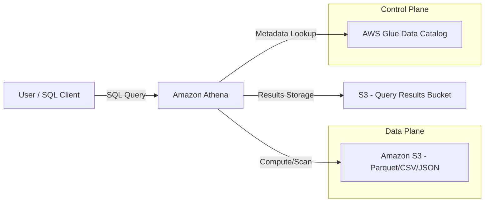

1.  **The Request:** A user or application submits a SQL query via the Console, CLI, or API.
2.  **Metadata Retrieval:** Athena queries the AWS Glue Data Catalog to understand the schema and where the files are located in S3.
3.  **Plan Execution:** Athena breaks the query into stages and distributes them across its internal compute fleet.
4.  **Data Scanning:** The compute nodes pull only the necessary data blocks from S3 (leveraging S3's high throughput).
5.  **Result Delivery:** The final result set is written back to a designated S3 bucket (the "Query Result Location") and presented to the user.

---

## AWS Service Integrations

### Inbound Data (The "Feeders")
*   **Amazon Kinesis Data Firehose:** The most common pattern. Firehose consumes streaming data, transforms it (via Lambda), converts it to **Parquet**, and drops it into S3. Athena then queries this "near real-time" data.
*   **AWS Glue ETL:** Periodically runs jobs to compact small files into larger, optimized Parquet files and updates the Glue Catalog.
*   **AWS DMS (Database Migration Service):** Moves data from on-premise RDBMS to S3, making it immediately queryable via Athena.

### Outbound Data (The "Consumers")
*   **Amazon QuickSight:** The primary BI tool for Athena. QuickSight uses Athena as the engine to generate visualizations.
able
*   **Amazon SageMaker:** Data scientists use Athena to explore datasets via SQL before feeding them into Machine Learning training pipelines.
*   **AWS Lambda:** Used to trigger downstream workflows or automated alerts based on query results.

### IAM and Trust Relationships
Athena requires a "Service-Linked Role" to access your S3 buckets and Glue Catalog. From an engineering perspective, you must ensure the **IAM Role/User executing the query** has:
1.  `s3:GetObject` and `s3:ListBucket` on the raw data buckets.
2.  `s3:PutObject` on the Athena Query Result bucket.
3.  `glue:GetTable` and `glue:GetPartitions` on the Glue Catalog.

---

## Security

### IAM and Access Control
Security in Athena is a multi-layered approach. 
*   **Fine-Grained Access Control (FGAC):** Using **AWS Lake Formation**, you can implement cell-level or column-level security. This allows you to permit a user to see the `orders` table but redact the `credit_card_number` column.
*   **Resource-based Policies:** Ensure your S3 bucket policies do not allow unauthorized access, even if the IAM user has Athena permissions.

### Encryption
*   **Encryption at Rest:** Athena integrates with **AWS KMS**. Your data in S3 should be encrypted using **SSE-KMS**. When Athena reads the data, it uses its service-linked role to decrypt the objects.
*   **Encryption in Transit:** All communications between Athena, S3, and Glue are encrypted via **TLS 1.2+**.
*   **Encryption of Results:** Always ensure your Athena Query Result bucket is configured with encryption to prevent sensitive query outputs from being readable in plain text.

### Network Isolation
For highly regulated industries (FinTech/Healthcare), you should use **VPC Endpoints (AWS PrivateLink)**. This ensures that the traffic between your VPC (where your application lives) and Athena/S3 never traverses the public internet, significantly reducing the attack surface.

### Audit and Compliance
*   **AWS CloudTrail:** Every `StartQueryExecution` API call is logged in CloudTrail. This is your audit trail for "who queried what and when."
*   **S3 Access Logs:** Use these to track the underlying data access patterns.

---

## Performance Tuning

If you don't tune Athena, you are essentially burning money. Follow these "Golden Rules."

### 1. The Format Rule: Use Columnar Formats
**Never use CSV for large-scale production Athena queries.** Use **Apache Parquet** or **Apache ORC**. 
*   **Why:** These are columnar formats. If you query `SELECT user_id FROM table`, Athena only reads the bytes associated with the `user_id` column, rather than the entire row.

### 2. The Partitioning Rule: Prune your Scans
Always partition by high-cardinality, frequently filtered columns (e.g., `date`, `region`, `event_type`).
*   **Anti-pattern:** Partitioning by `user_id` (too many partitions will kill the Glue Catalog performance).
*   **Best Practice:** Use `year/month/day` or `region`.

### 3. The File Size Rule: Avoid the "Small File Problem"
Athena performs poorly when reading millions of 1KB files. Each file requires an S3 `GET` request and metadata overhead.
*   **Target Size:** Aim for file sizes between **128MB and 510MB**.
*   **Solution:** Use AWS Glue ETL to "compact" small files into larger Parquet files.

### 4. The Compression Rule
Always use compression like **Snappy** (for Parquet). It reduces the amount of data scanned (lowering cost) and improves I/O throughput.

### Summary Table: Cost vs. Performance
| Feature | Low Cost / High Perf | High Cost / Low Perf |
| :--- | :--- | :--- |
| **File Format** | Parquet / ORC | CSV / JSON |
| **Partitioning** | Deeply Partitioned | No Partitioning (Full Scan) |
| **File Size** | 128MB - 512MB | Thousands of 10KB files |
| **Compression** | Snappy / Zlib | Uncompressed |

---

## Important Metrics to Monitor

| Metric Name (Namespace: `Athena`) | What it Measures | Threshold to Alarm | Action to Take |
| :--- | :--- | :--- | :--- |
| `QueryExecutionTime` | Duration of queries | > 10 mins (context dependent) | Check for missing partitions or large scans. |
| `QueryFailed` | Number of failed queries | > 1 | Investigate CloudWatch logs for SQL syntax or permission errors. |

| `S3:BytesDownloaded` (Namespace: `S3`) | Volume of data retrieved | Unexpected Spikes | Identify the user/query causing the massive scan. |
| `Glue:GetTable` (Namespace: `Glue`) | Catalog metadata latency | High latency | Check for "Partition Explosion" (too many partitions). |
| `Athena:DataScanned` (Custom/Workgroup) | Data volume per workgroup | Exceeding budget/quota | Implement stricter Workgroup limits or partition the data. |

---

## Hands-On: Key Operations

### Operation 1: Creating an External Table (SQL)
This is how you define the schema for your S3 data.

```sql
-- Step: Create an external table pointing to S3 Parquet data
-- Why: This tells Athena how to interpret the raw bytes in S3
CREATE EXTERNAL TABLE IF NOT EXISTS default.user_logs (
  user_id string,
  event_type string,
  event_timestamp timestamp
)
PARTITIONED BY (year string, month string) -- Crucial for performance
STORED AS PARQUET
LOCATION 's3://my-data-lake-bucket/logs/'
TBLPROPERTIES ("parquet.compress"="SNAPPY");
```

### Operation 2: Registering New Partitions (SQL)
If you add new data to S3 in a new folder, Athena won't see it until you update the metadata.

```sql
-- Step: Manually repair partitions
-- Why: Athena won't "scan" the whole S3 bucket looking for new folders; 
-- it only looks at the partitions registered in the Glue Catalog.
MSCK REPAIR TABLE default.user_logs;
```

### Operation 3: Running a Query via Python (Boto3)
Automating data analysis or triggering alerts based on query results.

```python
import boto3
import time

client = boto3.client('athena')

def run_athena_query(query, database, s3_output):
    # Step: Submit the query to the Athena engine
    response = client.start_query_execution(
        QueryString=query,
        QueryExecutionContext={'Database': database},
        ResultConfiguration={'OutputLocation': s3_output}
    )
    
    query_execution_id = response['QueryExecutionId']
    print(f"Query Started. ID: {query_execution_id}")
    
    # Step: Poll for completion
    # Why: Athena is asynchronous. You must wait for the status to be 'SUCCEEDED'
    while True:
        status = client.get_query_execution(QueryExecutionId=query_execution_id)
        state = status['QueryExecution']['Status']['State']
        
        if state in ['SUCCEEDED', 'FAILED', 'CANCELLED']:
            print(f"Query finished with state: {state}")
            break
        time.sleep(2)

# Usage
run_athena_query(
    "SELECT count(*) FROM user_logs WHERE year='2023'",
    "my_database",
    "s3://my-athena-results-bucket/results/"
)
```

---

## Common FAQs and Misconceptions

**Q: Is Athena a database like Amazon RDS?**
**A:** No. Athena is a *query engine*. It has no persistent storage of its own. It queries data that lives in S3.

**Q: If I delete my data in S3, will the Athena table still exist?**
**A:** The *metadata* (the table definition) will still exist in the Glue Catalog, but the query will fail because the underlying data source is gone.

** 
**Q: Does Athena support `INSERT INTO` or `UPDATE` statements?**
**A:** No. Athena is for OLAP (Analytical) workloads. It is essentially read-only for the data in S3. To "update" data, you must rewrite the files in S3 using a service like Glue or EMR.

**Q: Why is my query cost much higher than expected?**
**A:** You are likely performing a "Full Table Scan." This happens if you do not use a `WHERE` clause on your partition columns, forcing Athena to read every single file in the bucket.

**Q: Can I use Athena to query real-time streaming data?**
**A:** Not directly. There is a delay while data lands in S3. For true real-time, use Kinesis Data Analytics (Flink). For "near real-time" (minutes), use Athena with Kinesis Firehose.

**Q: Does Athena support Joins?**
**A:** Yes, it supports standard SQL joins, but be careful. Joining two massive, unpartitioned datasets will likely hit memory limits and fail.

**Q: Is Athena's performance comparable to Amazon Redshift?**
**A:** No. Redshift is optimized for high-performance, complex, multi-way joins on structured data. Athena is optimized for cost-effective, ad-hoc exploration of diverse datasets.

**Q: How does Athena handle JSON data?**
**A:** You can define a schema using the `JSON` SerDe (Serializer/Deserializer). It works well, but Parquet is much faster and cheaper.

---

**Exam Focus Areas**

*   **Store & Manage (Domain 2):** Optimizing S3 data formats (Parquet/ORC) and partitioning strategies to reduce costs.
*   **Ingestion & Transformation (Domain 1):** Using Kinesis Firehose to prepare data for Athena querying.
*   **Operate & Support (Domain 3):** Using Workgroups to control costs and monitoring query failures via CloudWatch.
*   **Design & Create Data Models (Domain 4):** Defining schemas in the Glue Data Catalog for Athena consumption.

---

## Quick Recap

*   **Athena is Serverless:** No clusters to manage; pay only for data scanned.
*   **Decoupled Architecture:** Uses S3 for storage and Glue for metadata.
*   **Format Matters:** Always use **Parquet** or **ORC** for cost and performance.
*   **Partitioning is King:** Use partition keys in your `WHERE` clause to avoid expensive full scans.
*   **Workgroups for Control:** Use them to isolate users and prevent runaway costs.
*   **Schema-on-Read:** The schema is applied at query time, providing flexibility but requiring data quality discipline.

---

## Blog & Reference Implementations

*   **AWS Big Data Blog:** [Optimizing Athena Queries](https://aws.amazon.com/blogs/big-data/) - Deep dives into partitioning and file formats.
*   **AWS re:Invent Sessions:** Search for "Amazon Athena" on YouTube to find sessions on "Serverless Data Lake Architectures."
*   **AWS Workshop Studio:** [Serverless Data Lake Workshop](https://catalog.us-east-1.prod.compute-engine.appspot.com/) - Hands-on labs for setting up Athena/Glue/S3.
*   **AWS Well-Architected Framework:** Review the "Cost Optimization Pillar" regarding Athena scan costs.
*   **AWS Samples GitHub:** [Amazon Athena Query Examples](https://github.com/awssamples) - Reference SQL patterns for complex datasets.

---

# Amazon Redshift

## Overview

If you are coming from a traditional RDBMS background like MySQL or PostgreSQL, your first instinct when facing massive datasets is to "just spin up a larger RDS instance." Stop right there. That is the fastest way to blow your budget and kill your query performance. Amazon Redshift is not an OLTP (Online Transactional Processing) database; it is an **OLAP (Online Analytical Processing)** data warehouse. 

The fundamental problem Redshift solves is the "analytical bottleneck." In a standard transactional database, data is stored in rows to make single-record lookups and updates fast. However, when you want to calculate the "average margin per region over the last three years," a row-based engine must scan every single column in every single row, wasting massive amounts of I/O. Redshift utilizes **columnar storage**, meaning it only reads the specific columns required for your query. This, combined with **Massively Parallel Processing (MPP)**, allows it to aggregate petabytes of data in seconds.

In the AWS Data Engineering ecosystem, Redshift serves as the "Single Source of Truth" for your analytical workloads. While S3 acts as your "Data Lake" (cheap, raw, unstructured), Redshift is your "Data Warehouse" (structured, high-performance, curated). It is the destination for transformed, high-value data that powers BI tools like Amazon QuickSight, Tableau, or Looker.

## Core Concepts

### Columnar Storage
Unlike RDS, Redshift stores data column-by-column rather than row-by-row. 
*   **The Benefit:** Significant reduction in I/O. If a table has 100 columns but your query only needs 3, Redshift physically ignores the other 97.
*   **The Trade-off:** Redshift is terrible at `UPDATE` and `DELETE` operations. Frequent single-row updates cause "fragmentation" and require heavy maintenance. Use Redshift for bulk loads, not transactional updates.

### Massively Parallel Processing (MPP)
Redshift distributes data and query execution across multiple nodes. When a query is issued, the **Leader Node** parses it, creates an execution plan, and distributes the workload across all **Compute Nodes**. Each node works on its slice of the data simultaneously.

### RA3 Instances and Managed Storage
In older Redshift generations (DC2), compute and storage were coupled. If you needed more disk space, you had to buy more compute, even if you didn't need the CPU. **RA3 instances** changed the game. They use **Managed Storage**, which allows you to scale compute and storage independently. Hot data resides on local SSDs for performance, while "cold" data is automatically moved to S3 (transparently to the user).

### Redshift Spectrum
This is a critical exam topic. Spectrum allows you to run SQL queries directly against data residing in **Amazon S3** without loading it into RedSQL. This enables a "Lake House" architecture: you keep your massive, raw datasets in S3 (Parquet/ORC format) and only load the aggregated, high-frequency data into Redshift local storage.

### Distribution Styles (The "Secret Sauce" of Performance)
How data is spread across nodes determines if your joins will be fast or a network nightmare.
*   **AUTO:** Redshift decides based on table size.
*   **EVEN:** Round-robin distribution. Good for tables that don't participate in joins.
*   **KEY:** Data is distributed based on a specific column's value. Use this for columns frequently used in `JOIN` clauses to ensure matching keys reside on the same node (collocation).
*   **ALL:** A full copy of the table is placed on every node. Use this **only** for small dimension tables (e.g., a `date_dimension` or `country_codes` table).

### Sort Keys
Sort keys determine the physical order of data on disk.
*   **Compound Sort Key:** Primarily optimizes the columns listed first. Best for queries with specific filters (e.., `WHERE timestamp > '2023-01-01'`).
*   **Interleaved Sort Key:** Gives equal weight to all columns in the key. Harder to maintain and more expensive to build, but great for multi-dimensional filtering.

## Architecture / How It Works

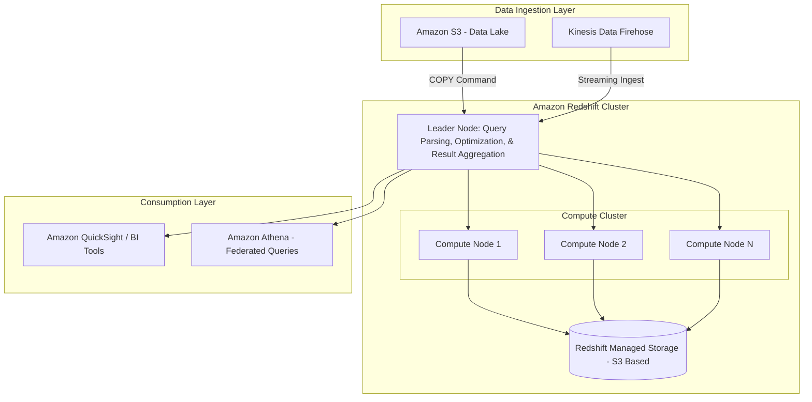

## AWS Service Integrations

### Data Inbound (The "Load" Phase)
*   **Amazon S3 $\rightarrow$ Redshift:** The primary pattern. Use the `COPY` command. **Never** use `INSERT` statements for large datasets; it is computationally expensive and creates massive transaction logs.
*   **Amazon Kinesis Data Firehose $\rightarrow$ Redshift:** Firehose can buffer streaming data and execute a `COPY` command into Redshift automatically.
*   **AWS Glue $\rightarrow$ Redshift:** Glue ETL jobs transform data in S3 and then trigger Redshift load processes.

### Data Outbound (The "Export" Phase)
*   **Redshift $\rightarrow$ Amazon S3:** Use the `UNLOAD` command to export query results to S3 in Parquet or CSV format. This is a common pattern for downstream data science workloads.
*   **Redshift Spectrum $\rightarrow$ S3:** Allows Redshift to act as a query engine for the S3 Data Lake.

### Identity & Access
*   **IAM Roles:** Redshift requires an IAM Role attached to the **Cluster**, not just the user. This role must have `s3:GetObject` and `s3:ListBucket` permissions so the cluster can "reach out" and grab data from S3 during a `COPY` operation.

## Security

### Network Isolation
*   **VPC Placement:** Redshift clusters should always reside in a Private Subnet. 
*   **Security Groups:** Control inbound traffic to the Redshift port (default 5439). Only allow traffic from your Application Tier or your Bastion Host.
*   **VPC Endpoints (PrivateLink):** Use VPC Endpoints to ensure traffic between your VPC and Redshift (or S3) never traverses the public internet.

### Encryption
*   **At Rest:** Use **AWS KMS** (SSE-KMS) to encrypt the underlying storage. This is mandatory for compliance (HIPAA/PCI).
*   **In Transit:** All communication between the client and the cluster, and between nodes, is encrypted using **TLS/SSL**.

### Audit and Compliance
*   **CloudTrail:** Tracks all API calls (e.g., `CreateCluster`, `ModifyCluster`).
*   **Redshift Audit Logging:** You must explicitly enable this to track SQL queries, user logins, and even the specific data accessed. Logs are typically exported to an S3 bucket.

## Performance Tuning

### The "Golden Rules" of Redshift Tuning
1.  **Minimize Data Shuffling:** If two large tables are joined on `customer_id`, ensure both use `DISTSTYLE KEY (customer_id)`. This prevents data from moving across the network during the join.
2.  **Avoid Small Inserts:** Batch your data. One `COPY` of 100MB is significantly faster than 1,000 `INSERT` statements of 100KB.
3.  **Use Compression Encodings:** Redshift uses different encoding types (LZO, ZSTD, Delta, etc.) per column. Use the `ANALYZE COMPRESSION` command to find the best settings. Proper compression reduces I/O and storage costs.
4.  **Monitor WLM (Workload Management):** Use **Auto WLM**. It uses machine learning to manage query queues, preventing a single "rogue" heavy query from starving your dashboard users of resources.

### Scaling Patterns
*   **Vertical Scaling:** Changing instance types (e.g., moving from `ra3.xlplus` to `ra3.4xlarge`). This involves downtime as the cluster is replaced.
*   **Horizontal Scaling:** Adding more nodes to the cluster.
*   **Concurrency Scaling:** A feature that automatically adds transient capacity to handle bursts in query volume. This is a "pay-per-use" feature that is vital for preventing query queues during peak business hours.

## Important Metrics to Monitor

| Metric Name (Namespace: `AWS/Redshift`) | What it Measures | Threshold/Alarm | Action to Take |
| :--- | :--- | :--- | :--- |
| `CPUUtilization` | Percentage of cluster CPU used. | `> 80%` for sustained periods. | Scale up instance type or check for unoptimized queries. |
| `WLMQueueLength` | Number of queries waiting in queue. | `> 0` for long durations. | Enable Concurrency Scaling or optimize heavy queries. |
| `HealthStatus` | Whether the cluster is in a healthy state. | `Status != 'available'` | Investigate node failures or cluster updates. |
| `DatabaseConnections` | Number of active connections. | Approaching your limit. | Check for connection leaks in application code. |
| `Read/Write Throughput` | Disk I/O activity. | Spikes causing high latency. | Evaluate if you need more RA3 nodes or better distribution keys. |

## Hands-On: Key Operations

### 1. Loading Data from S3 (The Most Important Skill)
```sql
-- Assume an IAM Role 'arn:aws:iam::123456789012:role/RedshiftS3Role' 
-- is already attached to the cluster.

COPY schema_name.target_table
FROM 's3://my-data-bucket/raw-data/users_export.csv'
IAM_ROLE 'arn:aws:iam::123456789012:role/RedshiftS3Role'
FORMAT AS CSV
IGNOREHEADER 1
REGION 'us-east-1';
-- Why: Using COPY is the only performant way to ingest large datasets.
-- It leverages the MPP architecture to load data in parallel across all nodes.
```

### 2. Exporting Data to S3 (Unloading)
```sql
-- Exporting a subset of data to S3 for use in SageMaker/Athena
UNLOAD ('SELECT user_id, signup_date FROM schema_name.target_table WHERE signup_date > \'2023-01-01\'')
TO 's3://my-data-bucket/exports/users_subset_'
IAM_ROLE 'arn:aws:iam::123456789012:role/RedshiftS3Role'
FORMAT AS PARQUET
PARALLEL ON;
-- Why: UNLOAD is much faster than standard SELECTs for large volumes.
-- Using PARQUET and PARALLEL ON creates multiple files, which is optimal for S3.
```

## Common FAQs and Misconceptions

**Q: Can I use Redshift as my primary application database for a web app?**
**A:** No. Redshift is an OLAP engine. The overhead of its columnar architecture and the latency of its distributed query execution make it unsuitable for high-frequency, single-row `INSERT/UPDATE/DELETE` workloads. Use RDS/Aurora for that.

**Q: Is Redshift Spectrum more expensive than loading data into Redshift?**
**A:** It depends. You pay per terabyte of data scanned by Spectrum. If you query a massive, unstructured dataset once, Spectrum is cheaper. If you query the same dataset every 5 minutes, loading it into Redshift local storage is more cost-effective.

**Q: Does the `COPY` command automatically handle schema changes?**
**A:** No. If your S3 file adds a new column, the `COPY` command will fail unless you use specific error-handling parameters or update your table schema first.

**Q: What is the difference between a "Cluster" and "Serverless"?**
**A:** Redshift Provisioned (Cluster) requires you to choose instance types and manage scaling. Redshift Serverless automatically scales capacity up and down based on your workload, making it ideal for unpredictable or intermittent workloads.

**Q: Can I use Redshift to query data in DynamoDB?**
**A:** Not directly via a command, but you can use **Amazon Athena Federated Query** or an ETL process (Glue) to move DynamoDB data to S3, which Redshift can then query via Spectrum.

**Q: Do I need to run `VACUUM` every day?**
**A:** Modern Redshift handles much of this automatically (Auto-Vacuum). However, you should still monitor for "ghost rows" (deleted rows not yet cleared) if you perform significant batch deletes.

## Exam Focus Areas

*   **Store & Manage (Domain 2):** Choosing between Redshift Provisioned vs. Serverless; managing S3 integration via `COPY`/`UNLOAD`; implementing RA3 scaling.
*   **Ingestion & Transformation (Domain 1):** Designing pipelines using Kinesis Firehose to Redshift; using Glue for schema evolution before Redshift ingestion.
*   **Design & Create Data Models (Domain 4):** Implementing optimal `DISTSTYLE` (Key, All, Even) and `SORTKEY` (Compound, Interleaved) to minimize data shuffling and I/O.
*   **Operate & Support (Domain 3):** Monitoring `WLMQueueLength`; troubleshooting `COPY` failures using `STL_LOAD_ERRORS`; managing encryption via KMS.

## Quick Recap
- [ ] **OLAP, not OLTP:** Redshift is for analytics, not transactions.
- [ ] **Columnar is King:** It reduces I/O by only reading necessary columns.
- [ ] **COPY is Mandatory:** Never use `INSERT` for bulk data.
- [ ] **Distribution Matters:** Use `KEY` for joins and `ALL` for small tables to prevent network bottlenecks.
- [ ] **RA3 = Freedom:** Decouples compute from storage, allowing independent scaling.
- [ ] **Spectrum = The Bridge:** Enables querying S3 data directly, creating a true "Lake House."

## Blog & Reference Implementations
*   **AWS Big Data Blog:** Deep dives into Redshift performance tuning and query optimization.
*   **AWS re:Invent - Amazon Redshift Deep Dive:** Essential viewing for understanding the internal engine architecture.
*   **AWS Workshop Studio:** "Amazon Redshift Workshop" - Hands-on labs for building your first warehouse.
*   **AWS Well-Architected Tool:** Check the "Data Analytics" lens for Redshift best practices.
*   **aws-samples (GitHub):** Search for "Redshift ETL patterns" to find production-ready Python/Glue code.

---

# Section 9: Streaming Data with Kinesis and MSK

## Overview

In the world of modern data engineering, the "batch window" is dying. We no longer live in a world where waiting six hours for an ETL job to finish is acceptable. Business stakeholders want real-time dashboards, fraud detection in milliseconds, and instant telemetry updates. This is the domain of **Stream Processing**.

Streaming data services solve the fundamental problem of **decoupling producers from consumers**. Without a streaming buffer, if your high-frequency IoT sensor (producer) sends data directly to your database (consumer), a sudden spike in traffic will crash your database. A streaming service like **Amazon Kinesis Data Streams (KDS)** or **Amazon Managed Streaming for Apache Kafka (MSK)** acts as a shock absorber. It persists the incoming data for a period of time, allowing consumers to process the data at their own pace, even if they temporarily fall behind.

When choosing between Kinesis and MSK, you are making a fundamental architectural decision. **Kinesis** is the "AWS-native" choice: it is serverless, highly integrated, and requires much less operational overhead. It is perfect for standard AWS workloads. **MSK**, on the other as, is the managed version of Apache Kafka. You choose MSK when you have an existing Kafka ecosystem, require specific Kafka-native plugins, or need the massive, highly-customizable throughput that Kafka provides. As a Data Engineer, your job isn't just to "use" these services, but to know which one provides the right balance of operational ease and raw performance for your specific scale.

---

## Core Concepts

### 1. Amazon Kinesis Data Streams (KDS)
*   **Shards:** The fundamental unit of capacity. One shard provides a fixed unit of throughput: **1 MB/s ingress** and **2 MB/s egress**. If you need 5 MB/s, you need at least 5 shards.
*   **Partition Key:** A string used to distribute data across shards. **Warning:** Do not use a low-cardinality key (like `RegionID`). This leads to "Hot Shards," where one shard is overwhelmed while others sit idle. Use high-cardinality keys like `UUID` or `DeviceID`.
*   **Retention Period:** By default, data is kept for 24 hours. You can extend this up to 365 days (note: this significantly increases costs).
*   **On-Demand vs. Provisioned Mode:**
    *   *Provisioned:* You manage shards. You pay for the shards you provisioned, regardless of use.

    *   *On-Demand:* AWS manages the scaling. It’s great for unpredictable workloads but more expensive per GB than provisioned mode.

### 2. Amazon Kinesis Data Firehose (KDF)
*   **Near-Real-Time:** Unlike KDS, KDF is a "delivery" service. It doesn't allow you to "read" the data manually; it pushes it to a destination.
*   **Buffering:** KDF uses two buffering hints: **Buffer Size** (e.g., 5MB) and **Buffer Interval** (e.m., 60 seconds). The delivery happens when *either* limit is hit.
*   **Transformation:** KDF can trigger an **AWS Lambda** function to transform raw JSON into Parquet/ORC before the data lands in S3.

### 3. Amazon MSK (Managed Streaming for Kafka)
*   **Brokers:** The servers that store the data. Unlike Kinesis, you don't manage "shards," you manage "instances" and "partitions."
*   **Topics & Partitions:** Data is organized into Topics. A Topic is split into Partitions, which allow for parallelism.
*   **Zookeeper/KRaft:** The coordination mechanism for the Kafka cluster.
*   **Managed Nature:** AWS handles the patching, setup, and hardware, but you are still responsible for choosing instance types and managing cluster scaling.

---

## Architecture / How It Works

The following diagram illustrates the two primary patterns you will see on the exam: the **Serverless Streaming Pipeline** (Kinesis) and the **Enterprise Kafka Pipeline** (MSK).

```mermaid
graph LR
    subgraph "Data Sources"
        A[IoT Sensors] --> KDS
        B[App Logs] --> KDS
        C[Microservices] --> MSK
    end

    subtrograph "Streaming Layer"
        KDS[Kinesis Data Streams] -- "Triggers" --> KDF[Kinesis Data Firehose]
        MSK[Amazon MSK] -- "MSK Connect" --> S3
    end

    subgraph "Processing & Storage"
        KDF -- "Lambda Transform" --> S3[(Amazon S3)]
        KDF --> Redshift[(Amazon Redshift)]
        S3 --> Athena[Amazon Athena]
    end
```

---

## AWS Service Integrations

### Data Ingress (Producers)
*   **Kinesis Agent:** A lightweight Java application installed on EC2/On-prem servers to ship logs to Kinesis.
*   **AWS DMS (Database Migration Service):** Can capture changes (CDC) from RDS/Oracle and stream them into Kinesis or MSK.
*   **AWS IoT Core:** Directly integrates with Kinesis to route sensor messages.

### Data Egress (Consumers)
*   **Kinesis Data Analytics (Flink):** Performs complex SQL or Flink applications on the live stream.
*   **AWS Lambda:** The primary way to trigger real-time compute based on a new record in KDS.
*   **Amazon S3/Redshift:** Primarily via Kinesis Data Firehose for "Zero-ETL" patterns.

### IAM & Trust Relationships
*   **Kinesis Firehose to S3:** The Firehose Service Role must have `s3:PutObject` and `s3:GetBucketLocation` permissions.
*   **Kinesis Data Streams to Lambda:** The Lambda execution role must have `kinesis:GetRecords`, `kinesis:GetShardIterator`, and `kinesis:DescribeStream`.

---

able ## Security

### Identity and Access Management (IAM)
*   **Resource-based Policies:** Used primarily with MSK (to allow cross-account access) and Kinesis (to restrict which VPCs can access the stream).
*   **Least Privilege:** Never use `kinesis:*`. Always scope to `kinesis:PutRecord` for producers and `kinesis:GetRecords` for consumers.

### Encryption
*   **At Rest:** 
    *   **Kinesis:** Supports **SSE-KMS**. Use a Customer Managed Key (CMK) if you need to rotate keys or audit usage via CloudTrail.
    *   **MSK:** Uses AWS KMS to encrypt EBS volumes and Kafka logs.
*   **In Transit:**
    *   **TLS/SSL:** Mandatory for MSK production environments.
    *   **VPC Endpoints (PrivateLink):** Use Interface VPC Endpoints for Kinesis to ensure data never traverses the public internet. This is a high-priority security requirement in the exam.

### Audit & Compliance
*   **CloudTrail:** Every API call (`CreateStream`, `DeleteStream`, `UpdateShardCount`) is logged here.
*   **VPC Flow Logs:** Crucial for auditing network-level access to MSK brokers.

---

## Performance Tuning

### The "Hot Shard" Problem
If you see `ReadProvisionedThroughputExceeded` on a specific shard, you have a **Hot Shard**. 
*   **The Fix:** Check your Partition Key. If you are using `CustomerID`, and one customer has 100x more events than others, that shard will choke. Change your key to something more granular, like `CustomerID + Timestamp`.

### Kinesis Data Firehose Tuning
*   **Buffer Size vs. Cost:** Larger buffers mean fewer, larger files in S3 (better for Athena/Glue performance), but higher latency.
*   **Lambda Transformation:** If your Lambda transformation takes too long, KDF might time out. Keep transformations lightweight.

### MSK Scaling
*   **Horizontal Scaling:** Add more brokers to the cluster. This requires a rebalance of partitions.
*   **Vertical Scaling:** Change the instance type (e.g., moving from `kafka.m5.large` to `kafka.m5.xlarge`). This usually involves a rolling update of the cluster.

---

## Important Metrics to Monitor

| Metric Name (Namespace: `Kinesis`) | What it Measures | Alarm Threshold | Action to Take |
| :--- | :--- | :--- | :--- |
| `ReadProvisionedThroughputExceeded` | Consumers are being throttled. | $> 0$ | Increase shards or optimize consumer logic. |
| `WriteProvisionedThroughputExceeded` | Producers are being throttled. | $> 0$ | Increase shards or check for hot keys. |
                | `IncomingBytes` | Total data volume entering the stream. | Check for unexpected spikes in traffic. |
| `IteratorAgeMilliseconds` | How far behind the consumer is from the tip of the stream. | $> 60,000$ (1 min) | Scale up consumers or check for processing bottlenecks. |
| `DeliveryToS3.Success` (Namespace: `Firehose`) | Percentage of successful deliveries to S3. | $< 100\%$ | Check IAM permissions or S3 bucket policies. |
| `Kafka.ConsumerLag` (Namespace: `MSK`) | The gap between the latest offset and the consumer offset. | Growing trend | Scale out consumer group members. |

---

## Hands-On: Key Operations

### 1. Creating a Kinesis Data Stream (AWS CLI)
```bash
# Create a stream named 'ProductionLogs'
# We use 'on-demand' to avoid managing shards for this specific workload
aws kinesis create-stream \
    --stream-name ProductionLogs \
    --stream-mode-capacity on-demand
```

### 2. Producing Data to Kinesis (Python/Boto3)
```python
import boto3
import json

client = boto3.client('kinesis')

# Data payload
data = {'user_id': 'user_123', 'event': 'login', 'status': 'success'}
payload = json.dumps(data)

# The 'PartitionKey' is CRITICAL. 
# Using 'user_123' ensures all logs for this user go to the same shard.
response = client.put_record(
    StreamName='ProductionLogs',
    Data=payload,
    PartitionKey='user_123' 
)

print(f"Successfully sent record. SequenceNumber: {response['SequenceNumber']}")
```

### 3. Consuming Data from Kinesis (Python/Boto3)
```python
import boto3
import time

client = boto3.client('kinesis')

# 1. Get the Shard Iterator (The 'pointer' in the stream)
shard_id = 'shardId-000000000000' # In reality, you'd fetch this via describe_stream
iterator = client.get_shard_iterator(
    StreamName='ProductionLogs',
    ShardId=shard_id,
    ShardIteratorType='LATEST'
)['ShardIterator']

# 2. Continuous Loop to poll for records
while True:
    response = client.get_records(ShardIterator=iterator, Limit=10)
    for record in response['Records']:
        print(f"New Record Found: {record['Data'].decode('utf-8')}")
    
    # Update the iterator to the next position
    iterator = response['NextShardIterator']
    time.sleep(1) # Don't hammer the API
```

---

## Common FAQs and Misconceptions

**Q: I need to process data in real-time with SQL. Should I use Kinesis Data Firehose?**
**A:** No. Firehose is for *delivery* (batching data into S3/Redshift). For real-time SQL processing, use **Kinesis Data Analytics (Flink)**.

**Q: Does Kinesis Data Streams provide built-in storage for long-term archiving?**
**A:** No. Kinesis is a transient buffer. While you can extend retention to 365 days, you should use Kinesis Data Firehose to archive data to **Amazon S3** for long-term, low-cost storage.

**Q: Can I use the same Partition Key for all my data in Kinesis?**
**A:** You *can*, but you **should not**. This creates a "Hot Shard" where a single shard handles all the traffic, effectively nullging the benefit of having a multi-shard stream.

**Q: Is MSK serverless?**
**A:** MSK is "managed," meaning AWS handles the heavy lifting, but it is not "serverless" in the same way Kinesis On-Demand is. You still interact with broker instances and cluster configurations.

**Q: Does Kinesis Data Firehose support schema enforcement?**
**A:** Not natively, but you can use an **AWS Lambda** function within the Firehose transformation step to validate or transform the schema before it reaches the destination.

**Q: If my Kinesis consumer fails, is the data lost?**
**A:** No. As long as the data is within the retention period (default 24h), a new consumer can start reading from a previous checkpoint or the beginning of the stream.

**Q: What is the main difference between Kinesis and MSK for an engineer?**
**A:** Kinesis is an AWS-native, API-driven service (simpler). MSK is a Kafka-compatible service (more flexible, ecosystem-rich, but more complex).

**Q: Can Kinesis Data Firehose write directly to Amazon Redshift?**
**A:** Yes, but it actually writes to S3 first and then issues a `COPY` command to Redshift. This is the standard, high-performance pattern.

---

## Exam Focus Areas

*   **Ingestion & Transformation (Domain 1):** 
    *   Choosing between KDS (low latency/custom) vs. KDF (delivery/near-real-time).
    *   Using Lambda for stream transformation in KDF.
    *   Implementing CDC (Change Data Capture) using DMS and Kinesis.
*   **Store & Manage (Domain 2):**
    *   Partitioning strategies (avoiding Hot Shards).
    *   Kinesis retention period management.
*   **Operate & Support (Domain 3):**
    *   Monitoring `IteratorAge` and `ProvisionedThroughputExceeded`.
    *   Scaling Kinesis shards (resharding).
    *   Securing streams using VPC Endpoints and KMS.

---

## Quick Recap

*   **Kinesis Data Streams** is for real-time, custom-built streaming applications.
*   **Kinesis Data Firehose** is for near-real-time delivery to S3, Redshift, or OpenSearch.
*   **Partition Keys** are the most critical configuration for preventing performance bottlenecks (Hot Shards).
*   **MSK** is the choice for Kafka-native workloads and massive scale.
*   **Scaling** Kinesis involves managing shards; scaling MSK involves managing broker instances.
*   **Security** requires IAM for access and KMS/TLS for data protection.

---

## Blog & Reference Implementations

*   **AWS Big Data Blog:** Search for "Kinesis Data Firehose" to learn about advanced transformation patterns.
*   **AWS re:Invent 2023 - Building Real-time Pipelines:** Deep dive into Kinesis-to-S3 architectures.
*   **AWS Workshop Studio:** "Amazon MSK Workshop" – hands-on cluster setup and producer/consumer labs.
*   **AWS Well-Architected Framework:** Review the "Reliability Pillar" for designing resilient streaming architectures.
*   **aws-samples (GitHub):** Search for `amazon-kinesis-samples` to see production-ready Python and Java producers.

---

# NoSQL and Purpose-Built Databases

## Overview

In the era of monolithic architectures, the "one-size-fits-all" relational database was king. However, as data engineers, we have moved into the era of **polyglot persistence**. The fundamental principle you must internalize for the DEA-C01 exam is this: **Do not use a relational database for a workload it wasn't designed for.** If you try to force highly connected graph data into DynamoDB, or massive time-series telemetry into RDS, you aren't just being inefficient—you are building a technical debt bomb that will explode under scale.

The "Purpose-Built" philosophy in AWS is about selecting a database based on the **access pattern**, not just the data format. AWS provides a spectrum of specialized engines: **DynamoDB** for ultra-low latency key-value/document access at any scale; **Amazon DocumentDB** for MongoDB-compatible workloads; **Amazon Neptune** for complex relationship mapping (Graph); and **Amazon Timestream** for massive-scale IoT/operational telemetry.

As a data engineer, your job isn't just to move data; it's to architect the storage layer so that downstream analytics (Athena, Redshift, Glue) can function without hitting bottlenecks. Understanding when to use a "Scale-out" (NoSQL) vs. a "Scale-up" (Relational) approach is the difference between a production-ready pipeline and a costly failure.

---

## Core Concepts

### 1. DynamoDB (Key-Value & Document)
*   **Partition Key (PK):** The fundamental input for the hash function that determines which partition the data resides on. **Crucial:** A poor PK choice leads to "Hot Partitions."
*   **Sort Key (SK):** Allows you to store multiple items under the same PK and provides ordered retrieval. This enables complex queries using operators like `begins_with`, `between`, and `>`.
*   **Global Secondary Index (GSI):** An index with a different PK and SK. GSIs are **asynchronous**; there is a replication lag between the base table and the GSI.
*   **Local Secondary Index (LSI):** Uses the same PK as the table but a different SK. **Engineer's Note:** Avoid LSIs in new designs. They impose a 10GB limit on the item collection and can only be created at table creation time.
*   **TTL (Time to Live):** Automatically expires items at no extra cost. This is a primary mechanism for managing data lifecycle and reducing storage costs.

### 2. Amazon Neptune (Graph)
*   **Vertices and Edges:** Data is stored as nodes (entities) and connections (relationships).
*   **Properties:** Both vertices and edges can hold metadata (key-value pairs).
*   **Query Languages:** Supports Gremlin (imperative) and SPARQL (declarative).

### 3. Amazon Timestream (Time-Series)
*   **Memory Store:** For high-throughput ingestion and low-latency queries on recent data.
*   **Magnetic Store:** For cost-effective long-term storage of historical data.
*   **Automated Tiering:** Data moves from memory to magnetic based on retention policies you define.

---

## Architecture / How It Works

The following diagram illustrates a common **Change Data Capture (CDC)** pattern used in modern data engineering to move data from a NoSQL operational store to an analytical data lake.

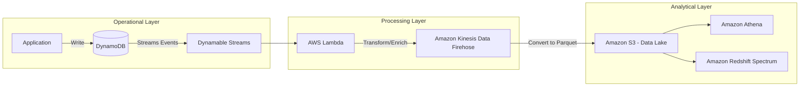

---

## AWS Service Integrations

### Data Ingestion (Into NoSQL)
*   **AWS Lambda:** The primary driver for "Event-Driven" ingestion. Lambda functions triggered by API Gateway or Kinesis write directly to DynamoDB.
*   **AWS DMS (Database Migration Service):** Used to migrate on-premise MySQL/PostgreSQL workloads into DynamoDB or DocumentDB.

*   **Amazon Kinesis:** High-frequency streaming data can be buffered and written to DynamoDB via Lambda to handle spikes in write volume.

### Data Egress (Out of NoSQL)
*   **DynamoDB Streams $\rightarrow$ S3/OpenSearch:** The "Gold Standard" for downstream analytics. Streams capture every `INSERT`, `MODIFY`, and `REMOVE` event.
*   **AWS Glue:** Uses specialized connectors to crawl DynamoDB tables, infer schemas, and catalog them in the Glue Data Catalog for Athena querying.
*   **Amazon Athena:** While you can't query DynamoDB *directly* with Athena, you use Glue to export DynamoDB data to S3 (Parquet) so Athena can perform SQL-based analytics on NoSQL data.

### IAM and Permissions
*   **Service-Linked Roles:** Required for services like DynamoDB to interact with other AWS resources (e.g., for automated backups).
*   **Fine-Grained Access Control (FGAC):** Using IAM `Condition` keys (like `dynamodb:LeadingKeys`), you can restrict a user to only access items where the Partition Key matches their UserID.

---

## Security

*   **Encryption at Rest:**
    *   **AWS Owned Key:** Default, no configuration needed.
    *   **AWS Managed Key (KMS):** Provides more visibility in CloudTrail.
    *   **Customer Managed Key (CMK):** Necessary for strict compliance (e.g., rotating keys manually or managing cross-account access).
*   **Encryption in Transit:** All APIs for DynamoDB and Neptune use **TLS (HTTPS)** by default.
*   **Network Isolation:**
    *   **VPC Endpoints (Interface Endpoints):** Critical for security. Use AWS PrivateLink to ensure your data traffic between your VPC and DynamoDB never traverses the public internet.
    
*   **Audit Logging:**
    *   **AWS CloudTrail:** Logs all "Management Events" (e.g., `CreateTable`, `DeleteTable`).
    *   **CloudWatch Logs:** Used to capture application-level logs or DynamoDB Stream processing errors.

---

## Performance Tuning

### 1. The "No-Scan" Rule
**Never use `Scan` in a production environment unless the table is tiny.** A `Scan` reads every single item in the table, consuming massive amounts of Read Capacity Units (RCUs) and increasing latency. Always use `Query` with a specific Partition Key.

### 2. Scaling Patterns
*   **Provisioned Capacity:** You specify RCU/WCU. Use this for predictable workloads. It's cheaper but requires Auto Scaling configuration to handle spikes.
*   **On-Demand Capacity:** You pay per request. Use this for "spiky" or unpredictable workloads (e.S., a new microservice launch). It is more expensive per request but eliminates the management overhead of scaling.

### 3. Avoiding Hot Partitions
If you use `Date` as a Partition Key, all writes for "today" will hit a single partition. This creates a bottleneck. **Solution:** Use a "Synthetic Shard Key" (e.g., `Date + RandomSuffix`) to distribute writes across the keyspace.

### 4. Data Format
For downstream integration, always prefer **Parquet or Avro** over JSON when exporting from DynamoDB to S3. The columnar nature of Parquet significantly reduces the amount of data Athena has to scan, directly lowering your costs.

---

## Important Metrics to Monitor

| Metric Name (Namespace: `AWS/DynamoDB`) | What it Measures | Threshold to Alarm | Action to Take |
| :--- | :--- | :--- | :--- |
| `ConsumedReadCapacityUnits` | Actual usage of RCU | 80% of Provisioned | Increase Provisioned Capacity or switch to On-Demand. |
| `ThrottledRequests` | Requests rejected due to capacity limits | $> 0$ | Investigate "Hot Keys" or increase WCU/RCU. |
| `SystemErrors` | Internal DynamoDB service errors | $> 0$ | Check AWS Service Health Dashboard; implement exponential backoff in code. |
| `ReplicationLatency` | Delay in Global Tables replication | $> 1$ second | Check network congestion or heavy write volume in the source region. |
| `UserErrors` | Requests failed due to client-side issues (e.g., 400s) | Sudden Spikes | Check application logs for malformed queries or unauthorized access attempts. |

---

## Hands-On: Key Operations (Python/Boto3)

### 1. Writing Data with Error Handling
```python
import boto3
from botocore.exceptions import ClientError

dynamodb = boto3.resource('dynamodb')
table = dynamodb.Table('OrdersTable')

def put_order(order_id, customer_id, amount):
    try:
        # Use put_item to insert data. 
        # Always include a unique PK to avoid accidental overwrites.
        table.put_item(
            Item={
                'OrderID': order_id,    # Partition Key
                'CustomerID': customer_id,
                'Amount': amount,
                'Status': 'PENDING'
            }
        )
        print("Order inserted successfully.")
    except ClientError as e:
        # Essential for production: Log the specific error (e.g., ProvisionedThroughputExceededException)
        print(f"Error inserting item: {e.response['Error']['Message']}")

put_order('ORD-123', 'USER-456', 99.99)
```

### 2. Efficient Querying (The "Query" vs "Scan" Demo)
```python
# INCORRECT: This is a SCAN (Expensive and slow)
# response = table.scan(FilterExpression=Key('CustomerID').eq('USER-456'))

# CORRECT: This is a QUERY (Efficient and targeted)
def get_customer_orders(customer_id):
    # We use the Partition Key directly. This hits only one partition.
    response = table.query(
        KeyConditionExpression=boto3.dynamodb.conditions.Key('CustomerID').eq(customer_id)
    )
    return response['Items']

orders = get_customer_orders('USER-456')
print(f"Found {len(orders)} orders.")
```

---

## Common FAQs and Misconceptions

**Q: If I use On-Demand mode, can I still experience throttling?**
**A:** Yes. While On-Demand scales rapidly, it is not infinite. If you suddenly burst 10x your previous peak, you may still see throttled requests until the partition splits occur.

**Q: Is a Global Secondary Index (GSI) free to maintain?**
**A:** No. You pay for the WCU required to replicate writes from the base table to the GSI.

**Q: Can I use an LSI to bypass the 10GB partition limit?**
**A:** No. LSIs actually *enforce* the 10GB limit on the entire item collection (all items with the same PK). Only GSIs allow you to scale beyond that.

**Q: Does DynamoDB Streams support deleting data?**
**A:** Yes. It captures `REMOVE` events, which is critical for downstream "hard delete" synchronization in your Data Lake.

**Q: Is DocumentDB a relational database?**
**A:** No. It is a non-relational, document-oriented database engine compatible with MongoDB.

**Q: How do I handle "Hot Keys" in DynamoDB?**
**A:** Use a more granular Partition Key or implement "Write Sharding" by appending a random suffix to the PK.

**Q: Can I use SQL to query DynamoDB directly?**
**A:** Not natively. You must use a bridge like AWS Glue/Athena (via S3) or a third-party tool.

**Q: Does TTL delete data immediately?**
**A:** No. DynamoDB typically deletes expired items within 48 hours of their expiration time. Do not rely on TTL for real-time logic.

---

## Exam Focus Areas

*   **Design & Create Data Models (Domain 1):**
    *   Choosing between Key-Value (DynamoDB), Graph (Neptune), and Time-series (Timestream).
    *   Designing Partition Keys to avoid hot partitions.
    *   Using GSIs vs. LSIs for different access patterns.
*   **Store & Manage (Domain 2):**
    *   Implementing lifecycle policies using DynamoDB TTL.
    *   Configuring encryption (KMS) and network isolation (VPC Endpoints).
    *   Managing capacity modes (On-Demand vs. Provisioned).
*   **Ingestion & Transformation (Domain 3):**
    *   Using DynamoDB Streams for CDC (Change Data Capture) pipelines.
    *   Integrating Lambda for real-time transformation of NoSQL data.
*   **Operate & Support (Domain 4):**
    *   Monitoring throttled requests and scaling throughput.
    *   Identifying and resolving high-latency/hot-partition issues.

---

## Quick Recap

*   **Choose the right tool:** Don't use DynamoDB for complex joins; don't use RDS for massive-scale telemetry.
*   **Query, don't Scan:** Scans are the #1 cause of performance degradation and cost overruns in NoSQL.
*   **GSIs are your friend, LSIs are technical debt:** Use GSIs for flexible access patterns; avoid LSIs due to size constraints.
*   **Use TTL for hygiene:** Automate data expiration to keep your storage costs low and your partitions healthy.
*   **Security is multi-layered:** Use IAM for fine-grained access and VPC Endpoints to keep traffic off the public internet.
*   **Monitor Throttling:** `ThrottledRequests` is your most important metric for scaling decisions.

---

## Blog & Reference Implementations

*   [AWS Big Data Blog](https://aws.amazon.com/blogs/big-data/): Essential for following recent patterns in DynamoDB/Athena integration.
*   [AWS re:Invent: Deep Dive into DynamoDB](https://www.youtube.com/user/AWSVideo): Search for "DynamoDB" to see architecture deep-dives from the engineers who built it.
*   [AWS Workshop Studio: DynamoDB Workshops](https://workshop.aws/): Practical, hands-on labs for building NoSQL patterns.
*   [AWS Well-Architected Framework - Performance Efficiency Pillar](https://aws.amazon.com/architecture/well-architected/): Guidance on selecting the right database for your workload.
*   [AWS Samples: DynamoDB Streams to S3 Pattern](https://github.com/aws-samples): Reference code for building CDC pipelines.

---

# AWS Lake Formation and Data Governance

## Overview

In the early days of building a data lake on AWS, engineers relied on a brittle combination of S3 bucket policies and complex IAM roles to manage access. While this works for a handful of datasets, it becomes an operational nightmare as you scale to thousands of tables and hundreds of users. You end up with "Policy Bloat," where a single IAM policy becomes too large to manage, and "Permission Drift," where it's impossible to audit who has access to which specific column in a Parquet file.

AWS Lake Formation was engineered to solve this specific problem of **Centralized Data Governance**. It acts as a security and governance layer sitting *on top* of your S3 data lake and the AWS Glue Data Catalog. Instead of managing access at the S3 object level (which is coarse-grained), Lake Formation allows you to define permissions at the database, table, column, and even row/cell level.

Think of Lake Formation as the "Policy Engine" for your data lake. It decouples the **storage** (S3) from the **metadata** (Glue) and the **authorization** (Lake Formation). When a user runs a query in Athena, Athena doesn't just look at S3; it asks Lake Formation, "Does this user have permission to see these specific columns in this table?" This transition from "Identity-based" security to "Resource-level" governance is the core evolution of a mature data engineering architecture.

In the context of the DEA-C01 exam, you must understand that Lake Formation does not store your data. It manages the *permissions* to that data. If you are designing a multi-account, multi-tenant data platform, Lake Formation is your primary tool for ensuring that a Data Scientist in the Marketing department cannot accidentally see PII (Personally Identifiable Information) in the Finance department's datasets.

---

## Core Concepts

### The Data Catalog & Metadata
Lake Formation leverages the **AWS Glue Data Catalog** as its underlying metadata store. Every table, partition, and schema defined in Glue is managed by Lake Formation. When you grant permissions in Lake Formation, you are essentially adding an authorization layer to the existing Glue metadata.

### Fine-Grained Access Control (FGAC)
This is the "killer feature." Traditional IAM allows you to grant access to an S3 prefix (e.g., `s3://my-bucket/logs/*`). Lake Formation allows you to go deeper:
*   **Column-level security:** Mask or hide specific columns (e.g., `social_security_number`) from certain users.
*   **Row-level security:** Filter rows based on a condition (e.g., `WHERE region = 'US'`).
*   **Cell-level security:** The intersection of column and row filtering.

### LF-Tags (Attribute-Based Access Control - ABAC)
The old way was to manage permissions per-table. This doesn't scale. The modern way—and the way you should design for the exam—is using **LF-Tags**. 
*   You attach tags to resources (e.arg., `Classification=Sensitive` or `Department=Finance`).
*   You grant users permissions based on those tags.
*   **Why it matters:** If a new table is created and tagged as `Classification=Sensitive`, the permissions are applied *automatically*. You don't have to update a single IAM policy.

### The "Lake Formation Admin" vs. IAM Admin
A common pitfall is confusing the two. A standard IAM Admin can manage the AWS account, but they cannot necessarily grant data access within Lake Formation unless they are explicitly designated as a **Lake Formation Administrator**. This separation of duties is critical for production-grade governance.

### Default Behavior Warning
When you use Lake Formation, it can "take over" the catalog. By default, if Lake Formation is enabled, the permissions defined in IAM are superseded by the permissions defined in Lake Granular Access Control. If you forget to grant a user permission in Lake Formation, even if they have `S3:GetObject` and `Glue:GetTable` in their IAM policy, **the query will fail.**

---

## Architecture / How It Works

The following diagram illustrates the decoupling of the compute, the control plane (governance), and the storage plane.

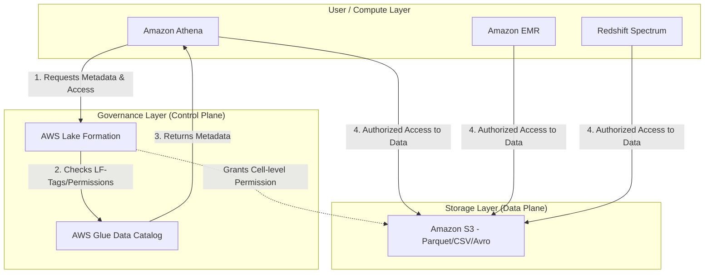

**The Data Flow Logic:**
1.  **The Request:** A user submits a query (e.g., via Athena).
2.  **The Authorization Check:** Athena contacts Lake Formation to ask if the user has permission to access the specific tables/columns requested.
3.**The Metadata Retrieval:** Lake Formation verifies the LF-Tags or explicit grants and then fetches the schema from the Glue Data Catalog.
4.  **The Data Access:** Once authorized, the compute engine (Athena/EMR) retrieves the actual data files from S3.

---

## AWS Service Integrations

### Data Ingestion (Into Lake Formation)
*   **AWS Glue Crawlers:** These are the primary engines. As crawlers discover new data in S3, they update the Glue Catalog. If Lake Formation is configured, these crawlers can also automatically apply LF-Tags to new tables.
*   **AWS Glue ETL:** Jobs that transform data can use Lake Formation to ensure that the transformed output is written with the correct security tags.

### Data Consumption (From Lake Formation)
*   **Amazon Athena:** The most common consumer. Athena integrates natively with Lake Formation to enforce column and row-level security.
*   **Amazon EMR:** Using the Lake Formation connector, EMR clusters can respect the fine-grained permissions defined in the catalog.
*   **Amazon Redshift Spectrum:** Allows Redshift to query S3 data while respecting Lake Formation security policies.

### IAM and Cross-Account Patterns
*   **Trust Relationships:** For cross-account data sharing, Lake Formation uses **Resource Links**. You don't just copy data; you share the metadata from Account A to Account B. Account B creates a "Resource Link" in its own catalog that points to the shared catalog in Account A.
*   **The Pattern:** **Centralized Data Lake (Account A) $\rightarrow$ Shared Catalog $\rightarrow$ Consumer Account (Account B)**. This is the gold standard for enterprise architecture.

---

## Security

### IAM Roles and Resource-Based Policies
To use Lake Formation, your compute service (like Athena) needs an IAM role that has permission to `lakeformation:GetDataAccess`. Without this, the service cannot "assume" the permissions granted by the Lake Formation admin.

### Encryption
*   **At Rest:** Lake Formation integrates with **AWS KMS**. You must ensure that the IAM roles used by your compute engines have `kms:Decrypt` permissions for the keys protecting the S3 objects.
*   **In Transit:** All communication between services (Athena to Lake Formation, or Athena to S3) is encrypted via **TLS**.

### Network Isolation
For high-security environments, use **VPC Endpoints (AWS PrivateLink)** for Glue and S3. This ensures that your data metadata requests and your actual data movement never traverse the public internet.

### Audit Logging
*   **AWS CloudTrail:** This is your single source of truth. Every `Grant`, `Revoke`, and `CreateTable` operation in Lake Formation is logged in CloudTrail. If an auditor asks, "Who granted access to the SSN column?", CloudTrail provides the answer.

---

## Performance Tuning

### Metadata Scaling
*   **Avoid "Small Table Syndrome":** While Lake Formation handles large catalogs well, having millions of tiny tables can slow down metadata retrieval. Use Glue Crawlers to consolidate metadata where possible.
*   **LF-Tag Complexity:** While ABAC (LF-Tags) is scalable, avoid deeply nested or overly complex tag logic that requires the engine to evaluate hundreds of tags per request.

### Data Partitioning
*   **The Golden Rule:** Lake Formation security is applied to the metadata. If your data is poorly partitioned in S3, Athena will scan more data than necessary, regardless of your Lake Formation settings. **Always partition by high-cardinality fields like `date` or `region`.**

### Cost vs. Performance
*   **Cell-Level Filtering Overhead:** Implementing complex row-level filtering (e.g., regex-based filtering on a large dataset) can introduce compute overhead in Athena. If you find query performance dropping, consider creating a "pre-filtered" materialized view or a separate table for that specific user group.

---

## Important Metrics to Monitor

| Metric Name (Namespace: `AWS/LakeFormation`) | What it Measures | Threshold to Alarm | Action to Take |
| :--- | :--- | :--- | :--- |
| `CatalogRequestLatency` | Time taken to process metadata requests. | > 500ms (context dependent) | Check for overly complex LF-Tags or massive table metadata. |
| `NumberOfTablesCreated` (via CloudTrail/Custom) | Rate of schema changes in the catalog. | Sudden spike (e.g., 100% increase) | Check for runaway Glue Crawlers or unauthorized automation. |
| `AccessDeniedErrors` (via CloudTrail/Custom) | Frequency of unauthorized access attempts. | Any significant increase | Investigate potential security breach or broken ETL pipelines. |
| `GlueCatalogServiceErrors` | Errors in the underlying Glue metadata service. | > 1% of total requests | Check AWS Service Health Dashboard; contact AWS Support. |

*Note: Many Lake Formation-specific metrics are actually observed through CloudTrail logs and converted into CloudWatch Metrics via Metric Filters.*

---

## Hands-On: Key Operations

### 1. Creating an LF-Tag (AWS CLI)
Before you can secure data, you must define your governance labels.

```bash
# Create a tag named 'Classification' with the value 'Confidential'
aws lakeformation create-lf-tag \
    --lf-tag-key Classification \
    --lf-tag-values Confidential
```

### 2. Granting Permissions via Boto3 (Python)
This is how you automate security in a CI/CD pipeline.

```python
import boto3

client = boto3.client('lakeformation')

def grant_table_access(database, table, principal, tag_key, tag_value):
    """
    Grants permissions to a principal based on an LF-Tag.
    This is much more scalable than granting permission to a specific table name.
    """
    try:
        response = client.grant_permissions(
            Principal={'User': principal},
able_resources={
                'TableWithLftags': {
                    'Database': database,
                    'Lftags': [{
                        'TagKey': tag_key,
                        'TagValues': [tag_value]
                    }]
                }
            },
            Permissions=['SELECT', 'DESCRIBE']
        )
        print(f"Successfully granted access to {principal}")
    except Exception as e:
        print(f"Error: {e}")

# usage: Grant 'analyst_user' SELECT access to any table tagged 'Classification=Confidential'
grant_table_access('sales_db', 'orders_table', 'analyst_user', 'Classification', 'Confidential')
```

---

## Common FAQs and Misconceptions

**Q: If I have S3 `GetObject` permissions in IAM, can I see the data in Lake Formation?**
**A:** No. If Lake Formation is managing the catalog, you must also have explicit permissions in Lake Formation. IAM is the "outer gate," but Lake Formation is the "inner gate."

**Q: Does Lake Formation move my data to a different S3 bucket?**
**A:** No. It is a metadata-only service. The data stays exactly where it was.

** Or: Does LF-Tags work for S3 objects?**
**A:** No. LF-Tags are applied to Glue Catalog resources (Databases, Tables, Columns). They are not S3 Object Tags.

**Q: Is Lake Formation more expensive than just using IAM?**
**A:** There is no direct "per-request" cost for Lake Formation itself, but you pay for the underlying Glue and Athena usage. The "cost" is the operational complexity you *avoid*.

**Q: Can I use Lake Formation with an on-premise Hadoop cluster?**
**A:** Not directly. You would need a bridge, such as an AWS Glue connector or an EMR cluster, to translate Lake Formation permissions into something the Hadoop ecosystem understands.

**Q: Does Lake Formation support schema evolution?**
**A:** Yes, as long as the Glue Crawler or ETL job is configured to update the catalog.

**Q: Can I grant access to a single column?**
**A:** Yes, this is one of its primary use cases (Column-level security).

**Q: Can I use Lake Formation to mask data?**
**A:** Yes, you can use it to restrict access to specific columns, effectively "masking" them from unauthorized users.

---

## Exam Focus Areas

*   **Domain: Design & Create Data Models**
    *   Implementing ABAC using LF-Tags for scalable security.
    *   Designing multi-account architectures using Resource Links.
*   **Domain: Store & Manage**
    *   Using Lake Formation for fine-grained access control (Column/Row level).
    *   Managing the Glue Data Catalog as the central metadata repository.
*   **Domain: Security (High Priority)**
    *   Distinguishing between IAM-based access and Lake Formation-based access.
    *   Implementing the principle of least privilege using cell-level security.
    *   Auditing data access using AWS CloudTrail.

---

## Quick Recap

*   **Lake Formation is a governance layer**, not a storage service.
*   **It enables Fine-Grained Access Control (FGAC)** at the column, row, and cell levels.
*   **LF-Tags enable ABAC**, allowing permissions to scale automatically with new data.
*   **It decouples identity from data**, allowing for complex, multi-account sharing via Resource Links.
*   **Permissions are additive:** You need both IAM and Lake Formation permissions for successful data access.
*   **Auditability is built-in** through integration with AWS CloudTrail.

---

able: Reference Implementations

*   **[AWS Big Data Blog](https://aws.amazon.com/blogs/big-data/):** Search for "Lake Formation" to find architectural deep-dives.
*   **[AWS re:Invent Sessions](https://www.youtube.com/user/AWSOnlineTech):** Look for "Securing your Data Lake with Lake Formation."
*   **[AWS Workshop Studio](https://workshop.aws/):** Search for "Lake Formation Workshop" for hands-on labs.
*   **[AWS Well-Architected Framework](https://aws.amazon.com/architecture/well-architected/):** Review the "Security Pillar" for data lake best practices.
*   **[AWS Samples GitHub](https://github.com/awssamples):** Search for "Lake Formation" for terraform and cloudformation templates.

---

# Data Orchestration and Pipelines

## Overview

In a distributed data architecture, services like AWS Glue, Amazon EMR, and AWS Lambda operate in isolation. While these services are powerful, they are "stateless" in the context of a larger business process. If your Glue ETL job finishes, how does your Athena table get refreshed? How do you notify the downstream BI dashboard if the ingestion failed? This is the problem of **Data Orchestration**.

Data Orchestration is the management of complex, multi-step workflows where the output of one task serves as the input for another. It involves managing dependencies, handling retries, implementing error logic (try/catch/finally), and maintaining the "state" of a pipeline. Without orchestration, you are not building a pipeline; you are building a collection of disconnected scripts that will inevitably fail in production due to unhandled edge cases.

In the AWS ecosystem, orchestration is primarily handled by **AWS Step Functions** (for stateful, logic-heavy workflows), **AWS Glue Workflows** (for simple, ETL-centric dependencies), and **Amazon Managed Workflows for Apache Airflow (MWAA)** (for complex, code-centric, and highly customized data science pipelines). As a Data Engineer, your job isn't just to write the code that transforms data, but to design the "brain" that knows when to run that code, when to retry it, and when to sound the alarm.

## Core Concepts

### AWS Step Functions: The State Machine
The heart of AWS orchestration is the **State Machine**. A state machine is a collection of states (steps) and the transitions between them.

*   **Standard Workflows:** Designed for long-running, mission-critical processes. They provide **exactly-once execution** and maintain a complete execution history for up to one year. Use these when you need to audit every single step of a financial processing pipeline.
*   **Express Workflows:** Designed for high-volume, short-duration tasks (less than 5 minutes). They are much cheaper and scale higher but offer **at-least-once execution** and do not provide a visual execution history in the console for long-term auditing. Use these for high-frequency IoT data ingestion triggers.

### Key State Types
*   **Task State:** The fundamental unit. It performs work by calling an AWS service (e.g., triggering a Glue Job).
*   **Choice State:** The `if-then-else` of your pipeline. It inspects the data payload and routes the workflow to different paths based on conditions.
*   **Map State:** This is your "loop." It allows you to iterate over a collection (like a list of S3 keys) and run a task for each item. This is the engine of parallel processing in orchestration.
*   **Parallel State:** Runs multiple branches of execution simultaneously. Use this when you need to run an EMR cluster setup and a Lambda function at the same time to save total execution time.
*   **Wait State:** Pauses the execution for a specific duration or until a specific timestamp.

### The "Payload" Trap (Critical Limit)
A common mistake engineers make is trying to pass large datasets through Step Functions. **The maximum payload size for a state machine transition is 256 KB.** If you attempt to pass a massive JSON array of records from one step to another, your pipeline will crash. 
*   **The Solution:** Use the **"Claim Check" pattern**. Store the large data in Amazon S3 and pass only the S3 URI (the "pointer") through the Step Function states.

## Architecture / How It Works

The following diagram illustrates a standard production-grade ETL orchestration pattern using Step Functions.

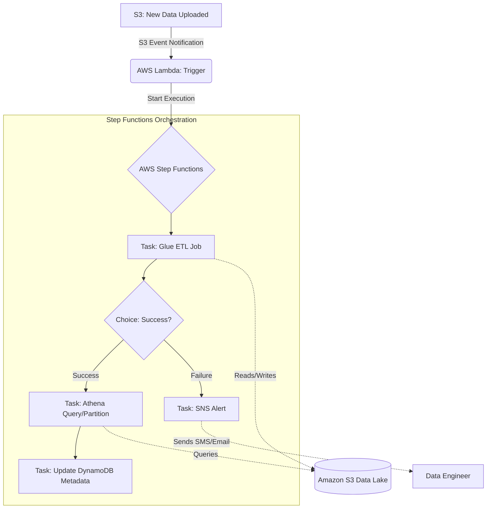

## AWS Service Integrations

### Inbound (Triggers)
*   **Amazon S3:** Using S3 Event Notifications to trigger a Lambda function, which then calls `StartExecution` on a Step Function.
*     **Amazon EventBridge:** The primary way to schedule pipelines (cron-like) or react to changes in AWS resource state.
*   **AWS IoT Core:** For streaming-heavy orchestration where device state changes trigger downstream processing.

### Outbound (Actions)
*   **AWS Glue:** The most common "Task" in a data pipeline. The Step Function triggers `StartJobRun`.
*   **AWS Lambda:** Used for lightweight transformations, API calls, or "glue code" between heavy lifting tasks.
*   **Amazon Athena:** To trigger queries and manage partitions after an ETL job completes.
*   **Amazon SNS/SQS:** To notify downstream consumers or decouple the pipeline from alerting systems.

### IAM Trust Relationships
For orchestration to work, the **Step Functions Execution Role** must have:
1.  `sts:AssumeRole` permission for `states.amazonaws.com`.
2.  Specific `Allow` permissions for the target services (e.g., `glue:StartJobRun`, `lambda:InvokeFunction`, `s3:GetObject`).
3.  **Crucial:** If Step Functions needs to write to CloudWatch Logs, the role must also have `logs:CreateLogGroup`, `logs:CreateLogStream`, and `logs:PutLogEvents`.

## Security

### Identity and Access Management (IAM)
Orchestration requires a "Least Privilege" approach. Do not use a single "Admin" role for your Step Function. Create a specific role that only has permissions for the specific Glue jobs and S3 buckets involved in that *specific* pipeline.

### Encryption
*   **Encryption at Rest:** Step Function execution history and any data passed in the payload are encrypted at rest using AWS managed keys or your own **KMS CMK (Customer Managed Key)**. If your pipeline handles PII, you **must** use a CMK to maintain control over the rotation and access policies.
*   **Encryption in Transit:** All communication between Step Functions and the integrated services (Lambda, Glue, etc.) is encrypted via **TLS 1.2/1.3**.

### Network Isolation
For highly sensitive environments, run your orchestration logic within a VPC. Use **Interface VPC Endpoints (AWS PrivateLink)** for Step Functions and Glue. This ensures that your data traffic never traverses the public internet, reducing the attack surface.

### Audit and Compliance
*   **AWS CloudTrail:** Every `StartExecution` and `StopExecution` call is logged in CloudTrail. This is your "Audit Trail" for compliance (SOC2/HIPutable/HIPAA).
*   **CloudWatch Logs:** Step Functions logs the input and output of every state. **Warning:** Be careful not to log sensitive PII in your state payloads, as this will persist in CloudWatch Logs.

## Performance Tuning

### Scaling Patterns
*   **Standard vs. Express:** Use **Express Workflows** for high-frequency, sub-minute tasks (like processing thousands of small files). Use **Standard Workflows** for long-running processes that need a visual history.
*   **The Map State Concurrency:** When using the `Map` state to process S3 files, do not leave the concurrency unlimited. If you trigger 10,000 Glue jobs at once, you will hit AWS service quotas and potentially crash your downstream database. Use the `MaxConcurrency` setting to throttle the load.

### Bottlenecks and Identification
*   **The "Lambda Warmup" Delay:** If your Step Function triggers a Lambda, and that Lambda is the first one called in a while, "cold start" latency can add seconds to your pipeline.
*   **Glue Job Startup Time:** The biggest bottleneck is often the 1-2 minute overhead of Glue provisioning the YARN containers. Do not use Lambda for heavy computation; use it only to *trigger* Glue.

### Cost vs. Performance
*   **State Transitions:** You are charged per state transition in Standard Workflows. A "chatty" state machine with 100 small steps is significantly more expensive than a streamlined one with 10 robust steps.
*   **Express Workflow Savings:** For high-volume, short-lived tasks, Express Workflows are significantly cheaper because they are billed based on execution duration and memory consumed, rather than per-transition.

## Important Metrics to Monitor

| Metric Name (Namespace: `AWS/States`) | What it Measures | Threshold to Alarm | Action to Take |
| :--- | :--- | :--- | :--- |
| `ExecutionsFailed` | Number of pipeline failures. | `> 0` (Immediate) | Investigate CloudWatch Logs and S3/Glue logs. |
| `ExecutionsTimedOut` | Pipeline running longer than expected. | Based on SLA (e.g., 2 hrs) | Check for deadlocks or resource exhaustion in Glue/EMR. |
| `ExecutionsAborted` | Manual or system-driven cancellations. | `> 0` | Check if a deployment or an automated script is killing jobs. |
| `ExecutionDuration` | How long the entire pipeline takes. | Deviation from baseline (e.g., +20%) | Check for data volume spikes or downstream service latency. |
| `LambdaFunctionError` | Errors in the Lambda logic within the state. | `> 0` | Check Lambda CloudWatch Logs for code exceptions. |

## Hands-On: Key Operations

### 1. Starting an Execution (Python/Boto3)
This is how your ingestion engine (like a Lambda or an EC2 instance) triggers the orchestration.

```python
import boto3

# Initialize the Step Functions client
sfn_client = boto3.client('stepfunctions')

def trigger_pipeline(execution_name, s3_input_path):
    """
    Triggers a Step Function execution with a specific S3 path.
    We pass the S3 path as input to avoid the 256KB payload limit.
    """
    response = sfn_client.start_execution(
        stateMachineArn='arn:aws:states:us-encrypt-1:123456789012:stateMachine:MyDataPipeline',
        name=execution_name,
        input=f'{{"s3_path": "{s3_input_path}"}}' # The 'Claim Check' pattern
    )
    print(f"Execution Started: {response['executionArn']}")

# Usage
trigger_pipeline("Daily_Ingestion_2023_10_27", "s3://my-data-lake/raw/2023/10/27/")
```

### 2. Checking Execution Status (AWS CLI)
Crucial for debugging and verifying if a pipeline completed successfully in a CI/CD pipeline.

```bash
# Describe the execution to check the status
aws stepfunctions describe-execution \
    --state-machine-arn arn:aws:states:us-east-1:123456789012:stateMachine:MyDataPipeline \
    --execution-arn arn:aws:states:us-east-1:123456789012:execution:MyDataPipeline:Daily_Ingestion_2023_10_27
```

## Common FAQs and Misconceptions

**Q: Can I use Step Functions to process 1GB of data directly in the state machine?**
**A: No.** The payload limit is 256KB. You must pass an S3 URI and have the next step (like Glue) read the data from S3.

**Q: What is the difference between AWS Glue Workflows and AWS Step Functions?**
**A: Scope.** Glue Workflows are specialized for ETL-only dependencies (e.g., "Run Job B after Job A"). Step Functions are general-purpose orchestrators that can coordinate Lambda, ECS, EMR, and even third-party APIs.

**Q: If my Glue job fails, does the Step Function automatically retry?**
**A: No.** You must explicitly define a `Retry` block in your Amazon States Language (ASL) definition to handle specific error codes like `Glue.InternalServiceException`.

**HT: Is Amazon MWAA just a managed version of Airflow?**
**A: Yes.** But the key difference for the exam is *usage*. Use MWAA when you need Python-based, complex, DAG-heavy data science workloads. Use Step Functions for event-driven, AWS-native, serverless architectures.

**Q: Does using Express Workflows mean I can't use a Choice state?**
**A: No.** You can use all standard state types in Express Workflows, but you lose the visual execution history in the AWS Console.

**Q: How do I handle "at-least-once" delivery in Express Workflows?**
**A: Idempotency.** Since a task might run twice, your downstream tasks (like Lambda or Glue) must be designed to be idempotent (running them multiple times with the same input yields the same result).

## Exam Focus Areas

*   **Ingestion & Transformation (Domain 1):** Choosing between Step Functions, Glue Workflows, and MWAA based on complexity and cost.
*   **Operate & Support (Domain 3):** Implementing error handling (Retry/Catch) and monitoring pipeline health via CloudWatch.
*   **Design & Create (Domain 4):** Implementing the "Claim Check" pattern to handle large data payloads within orchestrators.
*   **Security (Domain 2):** Configuring IAM roles for service-to-service communication and encrypting state machine inputs/outputs using KMS.

## Quick Recap

*   **Orchestration** is the "brain" that manages dependencies, retries, and state.
*   **Step Functions (Standard)** is for long-running, auditable, exactly-once tasks.
*   **Step Functions (Express)** is for high-volume, short-lived, at-least-once tasks.
*   **The 256KB Limit** is a hard ceiling; always use the **S3 Claim Check pattern** for large data.
*   **Error Handling** must be explicitly defined using `Retry` and `Catch` blocks in the ASL.
*   **Security** relies on the Step Function Execution Role having specific permissions for downstream services.

## Blog & Reference Implementations

*   **AWS Big Data Blog:** [Architecting Data Pipelines with AWS Step Functions](https://aws.amazon.com/blogs/big-data/) - Deep dives into pattern implementations.
*   **AWS re:Invent Session:** "Build Serverless Data Pipelines with AWS Step Functions" - Great for visual learners.
*   **AWS Workshop Studio:** [Serverless Data Engineering Workshop](https://workshop.aws/) - Hands-on labs for building end-to-end pipelines.
*   **AWS Well-Architected Framework:** [Data Engineering Lens](https://aws.amazon.com/architecture/well-architected/) - Guidance on reliability and cost-optimization.
*   **AWS Samples GitHub:** [Serverless Data Pipeline Patterns](https://github.com/aws-samples) - Production-ready CloudFormation and CDK templates.

---

# Performance, Cost Optimization, and Monitoring

## Overview

In the world of professional data engineering, writing code that works is only 20% of the job. The remaining 80% is ensuring that code doesn't bankrupt your company and that it scales when the data volume triples overnight. This section focuses on the "Operational Excellence" pillar of the AWS Well-Architected Framework, specifically applied to data pipelines.

When we talk about performance in a data context, we are primarily discussing **throughput** and **latency**. In an S3-centric data lake architecture, performance is a function of how efficiently you can prune data. If your Athena queries are scanning 1TB of data to find 1MB of results, you aren't just being slow; you are wasting compute resources and money. 

The core challenge of a Data Engineer is managing the "Data Engineering Trilemma": **Performance, Cost, and Complexity**. You can have a lightning-fast pipeline, but if it costs \$10,000 a day, it’s a failure. You can have a cheap pipeline, but if the data arrives 24 hours late, it’s useless. We will focus on how to use architectural patterns—like partitioning, columnar formats, and lifecycle policies—to navigate these trade-offs.

Finally, monitoring is our "early warning system." In distributed systems like AWS Glue or Amazon EMR, failures are rarely "hard" crashes; they are more often "silent" failures—data drift, late-arriving data, or creeping costs. We will learn how to move from reactive debugging to proactive observability using CloudWatch and AWS CloudTrail.

---

## Core Concepts

### 1. Data Partitioning and Pruning
Partitioning is the act of organizing your data into a hierarchical folder structure in S3 (e.g., `s3://my-bucket/sales/year=2023/month=10/day=27/`). 
*   **The Goal:** To allow query engines (Athena, Glue, EMR) to skip entire directories of data that do not match the `WHERE` clause.
*   **The Trap:** "Over-partitioning." If you partition by `timestamp` (down to the second), you create millions of tiny files. This leads to massive metadata overhead and kills performance.

### 2. Columnar Storage Formats (Parquet/ORC)
Unlike CSV or JSON (row-based), formats like Apache Parquet are columnar.
*   **Why it matters:** If a table has 100 columns but your query only needs 2, a columnar engine only reads the data for those 2 columns from disk.
*   **Compression:** Columnar formats allow for highly efficient encoding (RLE, Dictionary encoding). This reduces S3 storage costs and increases I/O throughput.

### 3. S3 Storage Classes and Lifecycle Management
Not all data is equal. 
*   **S3 Standard:** For active, frequently accessed data.
*   **S3 Intelligent-Tiering:** The "set it and forget it" choice for data with unknown access patterns. It automatically moves objects between frequent and infrequent access tiers.
*   **S3 Glacier Instant Retrieval:** For data you rarely touch but need in milliseconds when you do.

### 4. Amazon Athena Workgroups
A Workgroup is a logical separation of queries. 
*   **Use Case:** You can create a `dev_workgroup` with a per-query limit of 10MB and a `prod_workance` with higher limits. This prevents a junior engineer's "bad" query from consuming the entire department's budget.

---

## Architecture / How It Works

The following diagram illustrates the "Optimized Data Lakehouse" pattern. Note how the transformation layer (Glue) converts raw, expensive-to-process JSON into optimized, partitioned Parquet.

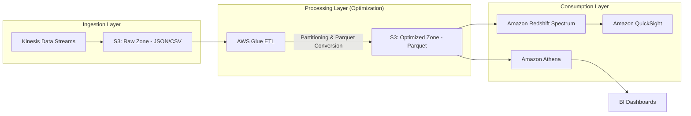

---

## AWS Service Integrations

*   **Data Inflow (The Producers):**
    *   **Amazon Kinesis/MSK:** Streams high-velocity data into S3 via Kinesis Data Firehose.
    *   **AWS Glue Crawlers:** Automatically scan S3 prefixes to populate the **AWS Glue Data Catalog**, which provides the schema metadata for Athena.
*   **Data Outflow (The Consumers):**
    *   **Amazon Athena:** Uses the Glue Catalog to query S3 directly.
    *   **Amazon QuickSight:** Pulls data from Athena to visualize trends.
    *   **Amazon Redshift Spectrum:** Allows Redshift to query S3 data without loading it into local disks, enabling a "Lakehouse" architecture.
*   **The Glue: IAM & Monitoring:**
    *   **IAM Roles:** Glue jobs require an execution role with `s3:GetObject`, `s3:PutObject`, and `glue:UpdateTable` permissions.
    *   **CloudWatch:** Every service logs metrics (e.g., `Glue Job Failed`) and logs (stdout/stderr) to CloudWatch.

---

## Security

### 1. Identity and Access Management (IAM)
*   **Princance of Least Privilege:** Never use `Resource: "*"`. For S3, specify the exact bucket and prefix. 
*   **Resource-Based Policies:** Use S3 Bucket Policies to restrict access to specific VPC endpoints or specific IAM roles, even if a user has administrative access elsewhere.

### 2. Encryption
*   **At Rest:** 
    *   **SSE-S3:** Managed by S3 (easiest).
    *   **SSE-KMS:** Uses AWS Key Management Service. **Crucial for exams:** This provides an audit trail in CloudTrail (who used the key to decrypt the data?).
*   **In Transit:** Always enforce `aws:SecureTransport: true` in your S3 bucket policies to mandate TLS 1.2+.

### 3. Network Isolation
*   **VPC Endpoints (S3 Gateway):** Use these to ensure data traffic between your VPC (where Glue/EMR lives) and S3 never leaves the Amazon network. It's more secure and avoids NAT Gateway costs.
*   **S3 Interface Endpoints (PrivateLink):** Use these when you need to access S3 from an on-premises network via Direct Connect or VPN.

---

## Performance Tuning

### The "Golden Rules" of Data Engineering Tuning

| Feature | Actionable Recommendation | The "Why" |
| :--- | :--- | :--- |
| **File Sizing** | Aim for 128MB - 512MB files. | Avoid "The Small File Problem." Thousands of 1KB files cause massive metadata overhead in Glue/Athena. |
| **Partitioning** | Partition by `date`, `region`, or `category`. | Enables "Partition Pruning." Reduces the `Data Scanned` metric. |
| **File Format** | Convert everything to **Apache Parquet**. | Columnar storage allows the engine to skip unnecessary columns and improves compression. |
| **Compression** | Use **Snappy** for Parquet. | Snappy provides a great balance between CPU decompression speed and compression ratio. |
| **Glue Scaling** | Use `WorkerType: G.1X` or `G.2X` for memory-intensive jobs. | Vertical scaling prevents `OutOfMemory` (OOM) errors in Spark executors. |

---

## Important Metrics to Monitor

| Metric Name | Namespace | What it measures | Threshold | Action |
| :--- | :--- | :--- | :--- | :--- |
| `Records Scanned` | `Athena` | Amount of data read by a query. | Sudden Spikes | Investigate if partitioning is being ignored in new queries. |
| `BytesScanned` | `Athena` | Total volume of data processed. | High cost/month | Audit the `WHERE` clauses in your most expensive queries. |
| `Glue Job Failed` | `Glue` | Number of ETL job failures. | `> 0` | Check CloudWatch Logs for Python/Spark exceptions. |
| `S3: 4xx Errors` | `S3` | Unauthorized or "Not Found" requests. | Increasing trend | Check for broken IAM policies or drifting partition logic. |
| `CPUUtilization` | `EMR` | Core node pressure. | `> 85%` | Scale the cluster horizontally (add more nodes). |
| `Throttling` | `Kinesis` | `ReadProvisionedThroughputExceeded` | `> 0` | Increase the number of Shards in your Kinesis Stream. |

---

## Hands-On: Key Operations

### Operation 1: Checking S3 Object Sizes (Python/Boto3)
*Why: To identify the "Small File Problem" before it breaks your Athena queries.*

```python
import boto3

s3 = boto3.client('s3')
bucket_name = 'my-data-lake-bucket'
prefix = 'sales/year=2023/'

# List objects in the partition
paginator = s3.get_paginator('list_objects_v2')
for page in paginator.paginate(Bucket=bucket_name, Prefix=prefix):
    for obj in page.get('Contents', []):
        size_mb = obj['Size'] / (1024 * 1024)
        # Alert if file is smaller than 10MB (Sub-optimal for Athena)
        if size_mb < 10:
            print(f"WARNING: Small file detected: {obj['Key']} ({size_mb:.2f} MB)")
```

### Operation 2: Creating a Partition in Glue Catalog (AWS CLI)
*Why: If you add data to S3 but don't update the Catalog, Athena won't see it.*

```bash
# Add a new partition to the 'sales' table
aws glue create-partition \
    --database-name sales_db \
    --table-name sales_table \
    --partition-input '{"values": ["2023", "10", "28"], "storage_descriptor": [{"location": "s3://my-data-lake-bucket/sales/year=2023/month=10/day=28/", "input_format": "...", "output_format": "...", "ser_de_info": {...}}]}'

# Note: In a real production pipeline, you would use Glue Crawlers 
# or 'MSCK REPAIR TABLE' in Athena to automate this.
```

---

## Common FAQs and Misconceptions

**Q: I have millions of small files in S3. Will it affect my Athena costs?**
**A:** Yes, significantly. Athena charges per TB scanned. While the total *data* size might be small, the overhead of opening and reading millions of metadata headers increases the time and resources required, often leading to longer-running, more expensive queries.

**Q: Is S3 Standard the cheapest storage class?**
**A:** No. S3 Standard is the most expensive for long-term storage. S3 Glacier Deep Archive is the cheapest. You must use Lifecycle Policies to move data down.

**Q: Does partitioning data in S3 improve write performance?**
**A:** No. Partitioning actually adds a slight overhead to writes because the system must determine the destination prefix. The benefit is strictly for **read** performance.

**Q: Can I use a VPC Endpoint to save money on S3?**
**A:** Yes. If you are transferring TBs of data from EC2/EMR to S3, using a **Gateway VPC Endpoint** is free and avoids the high costs of NAT Gateway data processing charges.

**Q: If I use Parquet, do I still need to partition?**
**A:** Yes. Parquet optimizes *columns* (vertical pruning), but Partitioning optimizes *rows/folders* (horizontal pruning). You need both for a high-performance architecture.

**Q: Does AWS Glue respect IAM roles assigned to the S3 bucket?**
**A:** Yes. Glue needs both an IAM Role (to run the job) and the S3 Bucket Policy must permit that Role to access the data.

**Q: What is the "Small File Problem"?**
**A:** It is the phenomenon where a high number of tiny files (KBs) causes massive latency in distributed engines (Athena/Glue) due to the overhead of file listing and metadata processing.

**Q: Does Athena have a way to limit costs per user?**
**A:** Yes, via **Athena Workgroups**. You can set a "Data Scanned per Query" limit to prevent runaway costs.

---

## Exam Focus Areas

*   **Domain: Ingestion & Transformation (Transform)**
    *   Identifying when to use Parquet vs. CSV.
    *   Understanding how Glue ETL handles partitioning.
*   **Domain: Store & Manage (Store)**
    *   Choosing the correct S3 Storage Class based on access frequency.
    *   Implementing S3 Lifecycle policies for cost optimization.
*   **Domain: Operate & Support (Operate)**
    *   Monitoring Glue/Athena using CloudWatch metrics.
    *   Using VPC Endpoints for secure and cost-effective data transfer.
    *   Troubleshooting S3 403 (Permission) and 503 (Throttling) errors.

---

## Quick Recap

*   **Partitioning is for Pruning:** Always organize data by high-cardinality columns used in `WHERE` clauses.
*   **Format Matters:** Use Parquet/ORC to minimize the amount of data scanned by Athena/Redshift.
*   **Watch the Files:** Avoid the "Small File Problem"; aim for larger, compressed files.
*   **Cost is a Feature:** Use S3 Intelligent-Tiering and Lifecycle policies to automate cost savings.
*   **Security is Layered:** Combine IAM Roles, S3 Bucket Policies, and KMS encryption for a "Defense in Depth" strategy.
*   **Observe or Die:** Use CloudWatch metrics to monitor `BytesScanned` and `Job Failures` to maintain pipeline health.

---

## Blog & Reference Implementations

*   **[AWS Big Data Blog](https://aws.amazon.com/blogs/big-data/):** The gold standard for architectural patterns and new feature deep-dives.
*   **[AWS re:Invent - Optimizing Athena Queries](https://www.youtube.com/results?search_query=aws+reinvent+athena+optimization):** Search for recent sessions to see real-world performance benchmarks.
*   **[AWS Workshop Studio: Data Engineering](https://workshop.aws/):** Hands-on labs for setting up Glue, Athena, and S3 pipelines.
*   **[AWS Well-Architected Framework - Data Analytics Lens](https://docs.aws.amazon.com/wellarchitected/latest/data-analytics-lens/data-analytics-lens.html):** The official guide to building robust data architectures.
*   **[AWS Samples GitHub](https://github.com/aws-samples):** Search for "Data Lake" or "Glue ETL" to find production-ready Python/Spark code.

---

## Security, Compliance, and Networking

### Overview
In the world of data engineering, a pipeline is only as good as its security posture. You can build the most sophisticated, high-throughput ETL pipeline using Glue, Spark, and Kinesis, but if you cannot prove the integrity of your data or if you leak sensitive PII (Personally Encrypted Information) due to a misconfigured S3 bucket, you have failed as an engineer. Security in AWS data engineering is not a "layer" you add at the end; it is the foundation upon which the entire architecture is built.

The core problem we are solving here is the **Principle of Least Privilege** and the **Reduction of the Attack Surface**. In a traditional on-premise environment, you relied on physical firewalls and "perimeter security." In AWS, the perimeter is identity-based. We use IAM to define *who* can touch the data, VPC Endpoints to ensure data *never* touches the public internet, and KMS to ensure that even if a malicious actor steals the raw bits, they are mathematically useless without the decryption keys.

As a data engineer, your job is to navigate the tension between **accessibility** (getting data to the analysts) and **security** (keeping unauthorized users out). This section focuses on the "plumbing" of security: how to configure IAM roles for Glue, how to set up VPC Endpoints for S3 and Athena, and how to manage KMS keys so that your downstream Spark jobs don't crash due to `AccessDenied` errors.

### Core Concepts

#### 1. Identity and Access Management (IAM)
*   **IAM Roles vs. Users:** In data pipelines, we almost never use IAM Users. We use **IAM Roles**. A Glue ETL job or a Lambda function "assumes" a role. This role provides temporary credentials, which is significantly more secure than hardcoding long-handed access keys.
*   **Identity-Based Policies:** Attached to the Role (e.g., "This Glue job can read from S3").
*   **Resource-Based Policies:** Attached to the Resource (e.g., "Only this specific Glue Role can access this S3 bucket").
*   **The "Intersection" Rule:** For a request to succeed, both the Identity-based policy AND the Resource-based policy must allow it. If the IAM Role says "Allow" but the S3 Bucket Policy says "Deny," the result is a **Deny**.

#### 2. Networking: The VPC Perimeter
*   **Public vs. Private Subnets:** Data processing engines (like Glue or EMR) should reside in **Private Subnets** with no direct route to the Internet Gateway.
*   **VPC Endpoints (The Data Engineer's Best Friend):**
    *   **Gateway Endpoints:** Specifically for **S3** and **DynamoDB**. They are free and provide a route from your VPC to the service without leaving the AWS network.
       *   *Engineer's Note:* If you are running Glue in a VPC, you **must** have an S3 Gateway Endpoint, or your job will time out trying to reach S3 via the public internet.
    *   **Interface Endpoints (AWS PrivateLink):** Used for most other services (Kinesis, KMS, Secrets Manager). These use an ENI (Elastic Network Interface) inside your subnet. They cost money per hour/GB, so use them judiciously.
*   **NAT Gateways:** Used when your private resources need to reach the internet (e.g., to download a Python library from PyPI). These are expensive and can become throughput bottlenecks.

#### 3. Encryption and Key Management (KMS)
*   **Encryption at Rest:**
    *   **SSE-S3:** AWS manages the keys. Easy, but provides less control.
    *   **SSE-KMS:** You manage the keys via AWS KMS. This provides an audit trail in CloudTrail (you can see *who* decrypted the data). **This is the standard for production data lakes.**
*   **Encryption in Transit:** Always use **TLS 1.2+**. When moving data between services (e.g., Kinesis to S3), AWS handles this, but you must ensure your VPC Endpoints are configured to support it.
*   **Envelope Encryption:** The practice of encrypting data with a Data Key (DK), and then encrypting that DK with a Master Key (KMS CMK). This is how AWS handles massive datasets without the latency of sending large files to the KMS service.

### Architecture / How It Works

The following diagram illustrates a secure, production-grade data ingestion pattern. Notice how the data flows through VPC Endpoints, avoiding the public internet entirely.

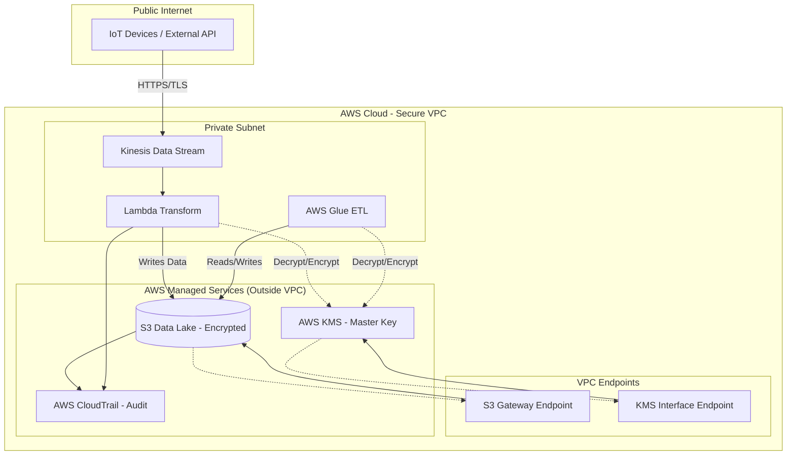

### AWS Service Integrations

*   **Inbound (Ingestion):**
    *   **AWS IoT Core / Kinesis:** Feeds data into the pipeline. Requires IAM permissions for the device/producer to `kinesis:PutRecord`.
    *   **AWS AppFlow:** Moves data from SaaS (Salesforce/Zendesk) to S3. Requires a service-linked role to access the source and destination.
*   **Outbound (Transformation & Storage):**
    *   **AWS Glue to S3:** The most common pattern. Requires `s3:GetObject` and `s3:PutObject`, plus `kms:Decrypt/GenerateDataKey` if using SSE-KMS.
    *   **Athena to S3:** Athena queries S3. The Athena service role must have permission to access the S3 bucket and the KMS key used for encryption.
*   **The "Trust" Relationship:**
    *   When a service like Glue needs to access a resource, you must define a **Trust Policy** on the IAM Role that allows the service principal (e.g., `glue.amazonaws.com`) to assume that role. Without this, the role is useless.

### Security

*   **IAM Roles & Policies:**
    *   **Permission Boundary:** A managed policy that sets the maximum permissions an identity-based policy can grant. Use this to prevent developers from escalating their own privileges.
    *   **Service-Linked Roles (SLRs):** These are predefined roles created by AWS services. You don't manage them, but you must be aware of them when troubleshooting "Access Denentially" in services like Auto Scaling or Kinesis.
*   **Encryption at Rest:**
    *   **SSE-KMS:** Always use this for sensitive data. It allows for **Key Rotation**, which is a compliance requirement for SOC2/HIPAA.
    *   **Cross-Account Access:** If your Data Lake is in Account A and your Glue Job is in Account B, you must update the **KMS Key Policy** in Account A to allow Account B to use the key. *This is a frequent exam trap.*
*   **Encryption in Transit:**
    *   **VPC Endpoints:** Use Interface Endpoints (PrivateLink) to ensure traffic between your VPC and services like Lambda or Glue stays within the AWS backbone.
    *   **TLS:** Ensure all API calls to S3 or Kinesis use HTTPS.
*   **Audit Logging:**
    *   **AWS CloudTrail:** The "Black Box" recorder. Every API call (e.g., `DeleteBucket`, `GetSecretValue`) is logged. For Data Engineers, CloudTrail is the primary tool for debugging "Why did my job fail with Access Denied?"
    *   **S3 Access Logs:** Tracks every request made to an S3 bucket. Essential for compliance audits.
*   **Compliance:**
    *   **Data Residency:** Use AWS Regions to ensure data stays within specific geographic boundaries (e.g., GDPR requirements).
    *   **FIPS Endpoints:** For highly regulated industries, use FIPS-validated endpoints for AWS services.

### Performance Tuning

*   **KMS Throttling (The "Silent Killer"):**
    *   **Problem:** If you have a massive Glue job processing thousands of small files, each file requires a `kms:Decrypt` call. You will hit KMS API rate limits.
    *   **Tuning:** Use larger file sizes (Parquet/Avro) to reduce the number of calls. Implement **Envelope Encryption** correctly so you only call KMS for the Data Key, not for every single record.
*   **NAT Gateway Bottlenecks:**
    *   **Problem:** If your Glue job downloads a large library or connects to an external API via a NAT Gateway, you may hit bandwidth limits or incur massive costs.
    *   **Tuning:** Use **VPC Endpoints** for S3 and other AWS services to bypass the NAT Gateway.
*   **S3 Partitioning & Prefix Scaling:**
    *   **Problem:** While S3 scales massively, extreme request rates to a single "prefix" (folder) can cause 503 Slow Down errors.
    *   **Tuning:** Use a high-entropy prefix strategy (e.g., `s3://bucket/year/month/day/hour/`) to distribute requests across S3 partitions.
*   **Cost vs. Performance:**
    *   **Interface Endpoints vs. Gateway Endpoints:** Always use Gateway Endpoints for S3/DynamoDB because they are **free**. Only use Interface Endpoints when a Gateway Endpoint is not available.

### Important Metrics to Monitor

| Metric Name (Namespace) | What it Measures | Threshold to Alarm | Action to Take |
| :--- | :--- | :--- | :--- |
| `KMS: ThrottlingException` (KMS) | Rate of rejected KMS API calls. | > 5 in 1 min | Check if Glue job is processing too many small files; implement batching. |
| `NATGateway: ErrorPortAllocation` (NATGateway) | Exhaustion of available ports for outbound connections. | > 0 | Increase NAT Gateway scale or move traffic to VPC Endpoints. |
   | `S3: 403 Forbidden` (S3) | Rate of unauthorized access attempts. | Investigate IAM policy changes or compromised credentials. |
| `Glue: Job Run Failed` (Glue) | Frequency of ETL job failures. | > 1 | Check CloudWatch Logs and CloudTrail for `AccessDenied` or `Network Unreachable`. |
| `VPC: BytesOut` (VPC) | Volume of data leaving your VPC. | Unexpected spikes | Check for data exfiltration or misconfigured data replication. |
| `Kinesis: ReadProvisionedThroughputExceeded` (Kinesis) | Kinesis shard is being overwhelmed by reads. | > 0 | Increase the number of shards in the stream (resharding). |

### Hands-On: Key Operations

#### 1. Creating an S3 Bucket with Mandatory Encryption (Python/Boto3)
As a data engineer, never create a bucket without enforcing encryption.

```python
import boto3

s3 = boto3                    # Initialize S3 client
bucket_name = 'my-secure-data-lake-12345'

# Create the bucket
s3.create_bucket(Bucket=bucket_name)

# Enforce AES256 encryption at the bucket level
# This ensures every object uploaded is encrypted at rest
s3.put_bucket_encryption(
    Bucket=bucket_name,
    ServerSideEncryptionConfiguration={
        'Rules': [
            {
                'ApplyServerSideEncryptionByDefault': {
                    'SSEAlgorithm': 'AES256'
                }
            }
        ]
    }
)
print(f"Bucket {bucket_name} created with default SSE-S3 encryption.")
```

#### 2. Attaching a Bucket Policy to Restrict Access to a Specific VPC (AWS CLI)
This is how you ensure that your data can *only* be accessed from within your corporate network.

```bash
# Create a policy file named policy.json
cat <<EOF > policy.json
{
    "Version": "2012-10-17",
    "Statement": [
        {
            "Sid": "DenyIfNotInVPC",
            "Effect": "Deny",
            "Principal": "*",
            "Action": "s3:*",
            "Resource": [
                "arn:aws:s3:::my-secure-data-lake-12345",
                "arn:aws:s3:::my-secure-data-lake-12345/*"
            ],
            "Condition": {
                "StringNotEquals": {
                    "aws:SourceVpc": "vpc-0a1b2c3d4e5f6g7h8"
                }
            }
        }
    ]
}
EOF

# Apply the policy to the bucket
aws s3api put-bucket-policy --bucket my-secure-data-lake-12345 --policy file://policy.json
```

### Common FAQs and Misconceptions

**Q: I gave my Glue Role `AmazonS3FullAccess`. Why am I getting `Access Denied` when reading encrypted files?**
**A:** You likely forgot the KMS permissions. To read SSE-KMS encrypted files, the role needs `kms:Decrypt` on the specific KMS key used to encrypt the data.

**Q: Is a VPC Gateway Endpoint the same as an Interface Endpoint?**
**A:** No. Gateway Endpoints are for S3 and DynamoDB and are free. Interface Endpoints use PrivateLink, use an ENI, and incur an hourly/data processing cost.

**Q: If I use S3 SSE-S3, does it protect me from an AWS Administrator?**
**A:** No. SSE-S3 manages keys automatically. An administrator with sufficient IAM permissions can still access the data. For higher security, use SSE-KMS with strict Key Policies.

**Q: Does creating a NAT Gateway make my VPC "Public"?**
**A:** No. The resources in your private subnet are still private. The NAT Gateway simply allows them to initiate outbound requests to the internet (e.g., for updates) without allowing the internet to initiate connections to them.

**Q: Can I use a VPC Endpoint to allow my on-premise server to talk to S3?**
**A:** No. VPC Endpoints are for resources *inside* your VPC. For on-premise access, you would use a Site-to-Site VPN or Direct Connect.

**A: Does CloudTrail log every single S3 `GetObject` request by default?**
**A:** No. CloudTrail logs management events (like `CreateBucket`) by default. To log data events (like `GetObject`), you must explicitly enable **S3 Data Events** in your Trail configuration, which increases cost.

**Q: If I delete a KMS key, what happens to the data encrypted with it?**
**A:** The data becomes permanently unrecoverable. This is a "digital shredding" mechanism, but it can be catastrophic if done accidentally.

**Q: Can an IAM Policy override a Bucket Policy?**
**A:** Only if the Bucket Policy is an explicit `Deny`. In AWS, an explicit `Deny` in *any* applicable policy always wins.

### Exam Focus Areas

*   **Ingestion & Transformation (Domain: Ingestion):**
    *   Configuring IAM roles for Kinesis and Glue.
    *   Setting up VPC Endpoints to ensure secure data flow from Kinesis to S3.
*   **Store & Manage (Domain: Storage):**
    *   Implementing S3 Bucket Policies to restrict access via VPC or IP range.
    *   Enforcing encryption at rest using SSE-KMS.
*   **Operate & Support (Domain: Security/Compliance):**
    *   Using CloudTrail for auditing data access.
    *   Troubleshooting `AccessDenied` errors by analyzing the intersection of IAM and Resource-based policies.
*   **Design & Create (Domain: Networking):**
    *   Choosing between Gateway Endpoints (S3/DynamoDB) and Interface Endpoints (KMS/Lambda).
    *   Designing multi-account architectures using KMS Key Policies for cross-account data sharing.

### Quick Recap
*   **Identity is the new Perimeter:** Use IAM Roles and Least Privilege.
*   **Encryption is non-negotiable:** Use SSE-KMS for production-grade auditability.
*   **Avoid the Internet:** Use VPC Gateway Endpoints for S3 to save money and increase security.
*   **The Deny Wins Rule:** An explicit `Deny` in a Bucket Policy or SCP overrides any `Allow` in an IAM Role.
*   **KMS is a bottleneck:** Be careful with high-frequency small-file processing to avoid KMS throttling.
*   **Audit everything:** Use CloudTrail to track who is accessing your data and when.

### Blog & Reference Implementations
*   **AWS Big Data Blog:** [Securing your Data Lake with AWS](https://aws.amazon.com/blogs/big-data/) - Best practices for S3 and Glue security.
*   **AWS re:Invent 2023:** [Deep Dive into AWS KMS](https://www.youtube.com/user/AWS) - Understanding envelope encryption at scale.
*   **AWS Workshop Studio:** [Security Workshop for Data Engineers](https://workshop.aws/) - Hands-on labs for VPC and IAM configuration.
*   **AWS Well-Architected Tool:** [Security Pillar Guidance](https://aws.amazon.com/architecture/well-architected/) - Check your architecture against industry standards.
*   **AWS Samples GitHub:** [Data Engineering Patterns](https://github.com/aws-samples) - Reference CloudFormation templates for secure VPC/S3 setups.

---

This is the final section of the course. We are moving away from individual service deep-slices and moving into **Architectural Synthesis**. In the real world, and on the exam, you are never asked "What is Glue?". You are asked: "Given a requirement for a low-latency, cost-effective, and highly scalable streaming pipeline with schema evolution, which architecture should you deploy?"

This section is designed to prepare you for that level of thinking.

## Capstone and Exam Readiness

### Overview
The AWS Certified Data Engineer Associate (DEA-C01) exam does not test your ability to memorize API calls; it tests your ability to act as a decision-maker. A data engineer’s role is to balance the "Iron Triangle" of cloud architecture: **Cost, Complexity, and Performance.** 

The "Service" we are analyzing in this Capstone is the **Integrated Data Pipeline**. In production, a pipeline is not a single service; it is a choreographed dance of ingestion (Kinesis/MSK), transformation (Glue/EMR/Lambda), storage (S3/Redshift), and orchestration (Step Functions/MWAA). The problem this section solves is "siloed knowledge." You might know how to write a PySpark script, but if you don't know how to secure that script using VPC Endpoints or how to monitor its failure via CloudWatch Alarms, you are not a Data Engineer; you are a developer.

This section focuses on the synthesis of all previous modules. We will treat the entire pipeline as a single, cohesive entity, focusing on the "glue" that holds services together: IAM, Networking, and Orchestration. We will focus on the transition from *functional* code to *production-ready* architecture.

### Core Concepts

#### The Decision Matrix (The "Exam Mindset")
When faced with a design choice, always evaluate using these three lenses:
1.  **Operational Overhead:** Is it Serverless (Lambda/Glue) or Managed (EMR/MSK)? For the exam, if "minimal operational effort" is mentioned, lean towards Serverless.
2.  **Latency Requirements:** Is it Real-time (Kinesis/MSK) or Batch (S3/Glue/EMR)?
3.  **Cost-Efficiency:** Is it "Scale-to-Zero" (Lambda) or "Always-On" (EC2/EMR)?

#### Data Partitioning and Schema Evolution
The most common failure point in any pipeline is the breakdown of partitioning strategies. 
*   **Partitioning:** Essential for Athena/Glue/Redshift Spectrum. The exam expects you to understand that over-partitioning (e.g., partitioning by `timestamp` instead of `date`) leads to the "Small File Problem," which kills performance and increases S3 `LIST` request costs.
*   **Schema Evolution:** Understanding how Glue Crawlers detect changes vs. how you manually manage schema registry in Kinesis/MSK.

#### The "Golden" File Formats
*   **Parquet/ORC:** Columnar, optimized for Athena/Redshift/Glue. Use for analytical queries (OLAP).
*   **Avro/JSON:** Row-based, optimized for streaming ingestion (Kinesis/MSK). Use for transactional/ingestion (OLTP) scenarios.

### Architecture / How It Works

The following architecture represents the "Standard Exam-Ready Pipeline." This is the pattern you should memorize.

```mermaid
graph LR
    subgraph "Ingestion Layer"
        A[Producer: App/IoT] --> B[Kinesis Data Streams]
        B --> C[Kinesis Data Firehose]
    end

    subgraph "Transformation Layer"
        C --> D{Lambda Transform}
        D --> E[S3 Raw Zone]
        E --> F[AWS Glue ETL]
    end

    subgraph "Storage & Analytics Layer"
        F --> G[S3 Processed Zone - Parquet]
        G --> H[AWS Glue Data Catalog]
        H --> I[Amazon Athena]
        H --> J[Amazon Redshift]
        I --> K[Amazon QuickSight]
    end

    subgraph "Orchestration & Monitoring"
        L[AWS Step Functions] -.-> F
        L -.-> D
        M[CloudWatch] -.-> B
        M -.-> F
        M -. 
    end
```

### AWS Service Integrations

A pipeline is only as strong as its integrations.

*   **Inbound Data (The Producers):** 
    *   **Kinesis/MSK:** Feed data into Firehose or Lambda.
    *   **AWS DMS (Database Migration Service):** Feeds data from RDS/On-prem to S3/Redshift.
    *   **AppFlow:** Feeds SaaS data (Salesforce/Zendesk) directly into S3.
*   **Outbound Data (The Consumers):**
    *   **Athena/Redshift:** Query S3 data via the Glue Data Catalog.
    *   **QuickSight:** Visualizes data from Athena or Redshift.
*   **The "Glue" (IAM & Orchestration):**
    *   **IAM Trust Relationships:** A Glue Job needs an execution role with `s3:GetObject`, `s3:PutObject`, and `glue:GetTable` permissions. 
    *   **Step Functions:** Acts as the brain, calling Glue, Lambda, and Athena in a specific sequence (DAG).
*   **Common Exam Pattern:** "S3 $\to$ EventBridge $\to$ Lambda $\to$ Glue." This is the classic "Event-Driven ETL" pattern.

### Security

Security is non-negotiable. If an answer choice ignores IAM or encryption, it is likely wrong.

*   **Identity & Access Management (IAM):**
    *   **Service-Linked Roles:** Roles created by AWS to allow services to act on your behalf.
    *   **Resource-based Policies:** Essential for S3 Bucket Policies and KMS Key Policies. You must ensure the Glue Role has permission to use the KMS key that encrypts the S3 bucket.
*   **Encryption at Rest:**
    *   **SSE-S3:** Managed by S3 (Easiest, but least control).
    *   **SSE-KMS:** Uses AWS KMS (Required for auditability/rotation). **Exam tip:** If the question mentions "Audit trails for key usage," the answer is SSE-KMS.
    *   **SSE-C:** Customer-provided keys (Rarely the "best" answer unless specified).
*   **Encryption in Transit:**
    *   Always use **TLS/HTTPS** for all API calls.
    *   **VPC Endpoints (Interface vs. Gateway):** Use **Gateway Endpoints** for S3 and DynamoDB to keep traffic off the public internet. Use **Interface Endpoints (PrivateLink)** for almost everything else (Glue, Kinesis).
*   **Audit & Compliance:**
    *   **CloudTrail:** Records *who* called *which* API. 
    *   **CloudWatch Logs:** Records *what* happened inside the application/job.

### Performance Tuning

Don't guess; tune based on these principles:

1.  **The Small File Problem:** If you have thousands of 1KB files in S3, Athena will be incredibly slow and expensive. **Fix:** Use Glue/Spark to "compact" these files into larger (128MB - 512MB) Parquet files.
2.  **Partition Projection:** For high-cardinality partitions (like `date` or `hour`), avoid Glue Crawlers and use **Athena Partition Projection** to calculate partitions via configuration rather than metadata lookups.
3.  **Kinesis Scaling:** If you see `ReadProvisionedThroughputExceeded`, you need to **increase the number of shards** (Horizontal scaling).
4.  **Glue Worker Types:** 
    *   `G.1X`: Standard.
    *   `G.2X`: For memory-intensive jobs (shuffles/joins).
    *   *Don't* over-provision. Use the smallest worker type that completes the job within your SLA.
5.  **S3 Prefixing:** While S3 now scales automatically, for extremely high request rates (thousands of TPS), use different prefixes to avoid hot partitions.

### Important Metrics to Monitor

| Metric Name (Namespace) | What it Measures | Alarm Threshold | Action to Take |
| :--- | :--- | :--- | :--- |
| `GetRecords.IteratorAgeMilliseconds` (Kinesis) | Delay between data arrival and processing. | > 60,000ms (1 min) | Scale out Kinesis Shards or increase Lambda concurrency. |
| `Glue.driver.aggregate.elapsedTime` (Glue) | Total time taken by the driver node. | Sustained increase | Investigate data skew or OOM (Out of Memory) errors. |
| `4xxErrors` (S3) | Client-side errors (e.g., 403 Forbidden, 404 Not Found). | Any non-zero spike | Check IAM permissions or object existence in the pipeline. |
| `Errors` (Lambda) | Number of failed function executions. | > 1% of total invocations | Check CloudWatch Logs for code exceptions or timeouts. |
| `ExecutionFailures` (Step Functions) | Failed steps in the state machine. | > 0 | Check the input/output of the failed state in the execution history. |
_Note: Always monitor `CPUUtilization` and `MemoryUtilization` for EMR/EC2 nodes to trigger Auto Scaling Groups._

### Hands-On: Key Operations

#### 1. Triggering a Glue Job via Boto3 (Python)
This is how you automate your pipelines. Never trigger jobs manually in production.

```python
import boto3

# Initialize the Glue client
glue = boto3.client('glue', region_name='us-east-1')

def trigger_etl_pipeline(job_name):
    try:
        # Start the job execution
        response = glue.start_job_run(JobName=job_name)
        
        # The 'JobRunId' is critical for tracking the specific execution
        run_id = response['JobRunId']
        print(f"Successfully started job: {job_name}. Run ID: {run_id}")
        return run_id
    except Exception as e:
        print(f"Error starting Glue job: {str(e)}")
        raise e

# Execution
trigger_etl_pipeline('my_daily_s3_to_redshift_job')
```

#### 2. Checking S3 Partition Consistency (AWS CLI)
Use this to verify if your Glue Crawler or Spark job actually created the partitions you expect.

```bash
# List all partitions in the S3 path to verify the structure
# If you see too many small directories, you have a partitioning problem.
aws s3 ls s3://my-data-lake-processed/year=2023/month=10/ --recursive --human-readable

# Check if a specific partition exists (used in automation scripts)
aws s3 ls s3://my-data-lake-processed/year=2023/month=10/day=01/ | grep "part-0000"
```

### Common FAQs and Misconceptions

**Q: I have a massive amount of data; should I use Lambda or Glue?**
**A:** If it's a heavy transformation (joins, aggregations, shuffling), use **Glue**. Lambda is for lightweight, "near-real-time" transformations. If your Lambda exceeds 15 minutes, it will fail.

**Q: Does Kinesis Firehose support real-time processing?**
**A:** It is "near-real-time." There is a buffering period (based on time or size). If you need sub-second latency, you must use **Kinesis Data Streams** directly with a consumer.

**Q: Can I use Athena to query data in Redshift?**
**A:** Yes, via **Redshift Spectrum**, but the architecture is actually Athena querying S3, which contains data Redshift also sees. The "trick" is understanding that the data lives in S3, not in the Redshift local storage.

**Q: Is an EMR cluster the same as a Glue job?**
**A:** Both use Spark, but EMR is **Managed** (you manage the cluster/EC2) and Glue is **Serverless** (you only manage the script). Use EMR for long-running, highly customized, or very large-scale workloads where you need control over the underlying infrastructure.

**Q: Does S3 provide strong consistency?**
**A:** Yes. Since late 2020, S3 provides **strong read-after-write consistency** for all applications. You no longer need to worry about "stale" reads after an overwrite.

**Q: If I use KMS for S3 encryption, does it impact performance?**
**A:** Negligible for most data engineering workloads. However, keep an eye on KMS API rate limits if you are performing millions of small object GET/PUT requests.

**sQ: Is Glue Crawler the best way to update the Data Catalog?**
**A:** For discovery, yes. For production pipelines, **no**. You should use `CREATE TABLE` or `MSCK REPAIR TABLE` (in Athena) as part of your ETL process to ensure the catalog is updated exactly when the data arrives.

**Q: Can I use a VPC Endpoint for S3 to save money?**
**A:** Yes. Using a **Gateway Endpoint** for S3 is free and keeps your data traffic within the AWS network, significantly reducing NAT Gateway costs.

### Exam Focus Areas

*   **Ingestion & Transformation (Domain 1):** Choosing between Kinesis, MSK, and Firehose based on latency; implementing Lambda transformations; managing Glue ETL scripts.
*   **Store & Manage (Domain 2):** S3 partitioning strategies; choosing between Parquet and JSON; managing the Glue Data Catalog; Redshift Spectrum usage.
*   **Operate & Support (Domain 3):** Monitoring via CloudWatch; setting up Alarms for `IteratorAge`; troubleshooting Glue job failures; implementing IAM least-privilege.
*   **Design & Create Data Models (Domain 4):** Implementing schema evolution; designing partitioned S3 bucket structures; optimizing Athena queries via Partition Projection.

### Quick Recap
*   **Choose Serverless** (Glue/Lambda/Athena) for minimal operational overhead.
*   **Partition by Date/Hour**, but avoid over-partitioning to prevent the "Small File Problem."
*   **Use Parquet** for analytical workloads to reduce cost and increase speed.
*   **Secure everything** with KMS (at rest) and VPC Endpoints (in transit).
*   **Monitor `IteratorAge`** to ensure your streaming ingestion isn't falling behind.
*   **Always evaluate the "Iron Triangle"** (Cost, Complexity, Performance) before picking a service.

### Blog & Reference Implementations
*   **AWS Big Data Blog:** The gold standard for new feature announcements (e.g., Glue updates).
*   **AWS re:Invent Deep Dives:** Watch the "Data Engineering" track—specifically sessions on Athena and Glue performance.
*   **AWS Workshop Studio:** Search for "Data Engineering Workshop" to practice building end-to-end pipelines.
*   **AWS Well-Architected Tool:** Use the "Data Analytics Lens" to validate your architectures against best practices.
*   **aws-samples (GitHub):** Look for the `aws-glue-samples` repository to see production-grade PySpark code.